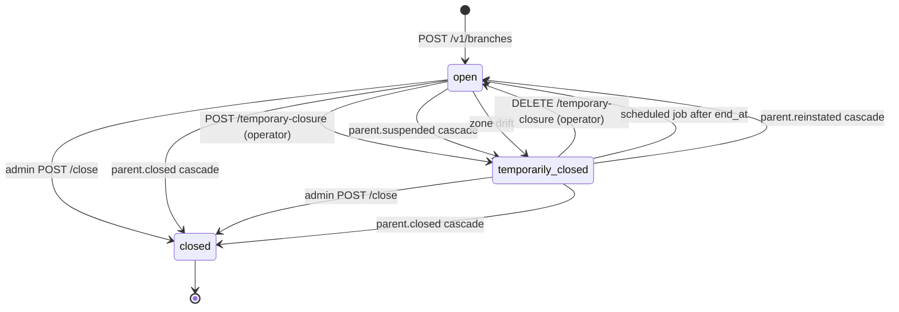
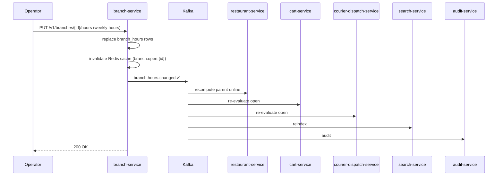
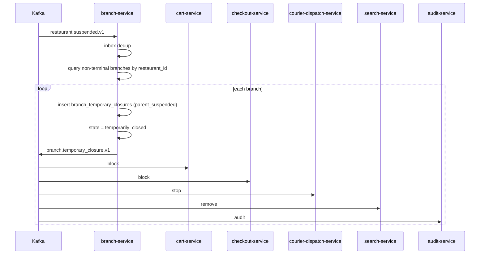
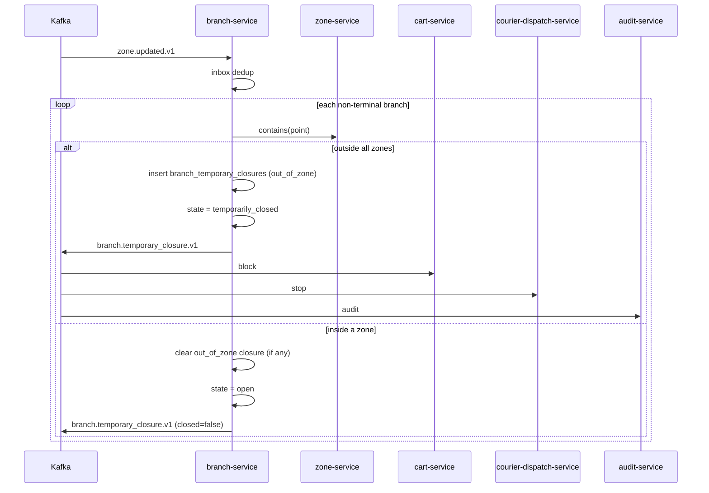

# branch-service — Workflows

## 1. Branch Onboarding (Create)

### 1.1 Objective

A merchant owner creates a branch under an approved restaurant;
the service geocodes the address, validates the branch is in a
serving zone, and persists it. The `branch.created.v1` event is
emitted and consumed by `cart-service`,
`courier-dispatch-service`, and `search-service` to make the
branch orderable and findable.

### 1.2 Initiating Actor

`merchant_owner` (human) — the merchant's owner.

### 1.3 Participating Services

- `branch-service` (this service).
- `restaurant-service` (parent; verify approved).
- `geolocation-service` (geocode).
- `zone-service` (zone check).
- `configuration-service` (defaults).
- `notification-service` (lifecycle).
- `menu-service`, `cart-service`, `courier-dispatch-service`,
  `search-service`, `audit-service` (downstream consumers).

### 1.4 Prerequisites

- The parent restaurant is `approved`.
- A serving zone exists at the branch's location.
- The address is real and geocodable.
- The operator has uploaded hours (or accepts defaults).

### 1.5 Happy Path

```mermaid
sequenceDiagram
    participant OWN as Merchant Owner
    participant BRH as branch-service
    participant RES as restaurant-service
    participant GEO as geolocation-service
    participant ZONE as zone-service
    participant CFG as configuration-service
    participant K as Kafka
    participant MN as menu-service
    participant CRT as cart-service
    participant CDP as courier-dispatch-service
    participant SR as search-service
    participant AUD as audit-service
    participant NOT as notification-service

    OWN->>BRH: POST /v1/branches (restaurant_id, address, hours, prep_capacity, Idempotency-Key)
    BRH->>RES: GET /v1/restaurants/{restaurant_id}
    RES-->>BRH: approved
    BRH->>GEO: geocode(address)
    GEO-->>BRH: { lat, lng, normalized_address }
    BRH->>ZONE: contains(point)
    ZONE-->>BRH: zone_id (in serving zone)
    BRH->>CFG: GET branch.default_hours
    CFG-->>BRH: defaults
    BRH->>BRH: state=open; persist (PostGIS point)
    BRH-->>OWN: 201 branch
    BRH->>K: branch.created.v1
    K->>MN: enable menu binding
    K->>CRT: enable orders
    K->>CDP: enable dispatch
    K->>SR: index
    K->>AUD: audit
```

### 1.6 Alternate Paths

- **Geocode failure**: 422 `GEOCODE_FAILED`; the operator is
  asked to correct the address.
- **Outside zone**: 422 `OUT_OF_ZONE`; the operator is told the
  supported zones.
- **Default hours**: if the operator omits hours, the service
  uses `branch.default_hours` from `configuration-service`.

### 1.7 Failure Paths

- **`restaurant-service` unreachable**: 503 `DEPENDENCY_TIMEOUT`.
- **Geocode circuit open**: 503 `CIRCUIT_OPEN`; the operator is
  asked to retry.
- **Outbox publish failure**: outbox row retried; DLQ on
  persistent failure.

### 1.8 Business Rules

- A branch can be created only if its parent restaurant is
  `approved`.
- A branch must be in a serving zone to be created.
- A branch's address must be geocodable.

### 1.9 State Transitions



### 1.10 Events

| Event | Direction | When |
|-------|-----------|------|
| `branch.created.v1` | produced | `POST /v1/branches` |
| `restaurant.created.v1` | consumed | parent enabled |
| `restaurant.suspended.v1` | consumed | cascade temporary closure |
| `restaurant.closed.v1` | consumed | cascade permanent closure |
| `zone.updated.v1` | consumed | zone drift auto-closure |

### 1.11 APIs Involved

| API | Direction | When |
|-----|-----------|------|
| `POST /v1/branches` | inbound | create |
| `GET /v1/restaurants/{id}` to restaurant-service | outbound | parent check |
| `GET /v1/geocode` to geolocation-service | outbound | geocode |
| `POST /v1/zones/contains` to zone-service | outbound | zone check |

### 1.12 Compensation / Rollback

- **Cascade temporary closure was wrong**: the operator clears
  the temporary closure via `DELETE /temporary-closure` with
  reason; the state returns to `open`.
- **Permanent closure by mistake**: there is no undo. The
  operator must create a new branch.

### 1.13 Final State

Branch is `open`; consumers are notified within 30 s; the branch
is searchable and orderable.

## 2. Hours Change

### 2.1 Objective

Operator updates weekly hours or adds a special date; the change
propagates to all downstream services so that cart, checkout, and
dispatch see the correct open status.

### 2.2 Initiating Actor

`merchant_owner`, `merchant_ops`, or admin.

### 2.3 Participating Services

- `branch-service` (this service).
- `restaurant-service` (downstream — recompute parent online).
- `cart-service` (downstream — block / unblock).
- `courier-dispatch-service` (downstream — adjust).
- `search-service` (downstream — reindex).
- `audit-service`.

### 2.4 Prerequisites

- Branch is not `closed`.

### 2.5 Happy Path



### 2.6 Alternate Paths

- **Special hours add**: `POST /v1/branches/{id}/special-hours`;
  the entry is added to `branch_special_hours`; same event is
  emitted.

### 2.7 Failure Paths

- **Outbox failure**: outbox retried.
- **Consumer lag**: ≤ 30 s SLA monitored.

### 2.8 Business Rules

- Hours are interpreted in the branch's local timezone (IANA).
- Special hours override weekly hours on the same date.
- A row with `is_closed = true` and no open/close times is a
  full-day closure for that day.

### 2.9 State Transitions

This workflow does not change `state`; only the hours data. The
resulting open/closed evaluation is recomputed by consumers.

### 2.10 Events

| Event | Direction | When |
|-------|-----------|------|
| `branch.hours.changed.v1` | produced | hours or special hours change |

### 2.11 APIs Involved

| API | Direction | When |
|-----|-----------|------|
| `PUT /v1/branches/{id}/hours` | inbound | weekly hours |
| `POST /v1/branches/{id}/special-hours` | inbound | special date |

### 2.12 Compensation / Rollback

- The operator can re-issue the call with the previous hours.

### 2.13 Final State

Hours are updated; consumers re-evaluate within 30 s.

## 3. Cascade Suspension (Parent Restaurant Suspended)

### 3.1 Objective

When the parent restaurant is suspended, all of its non-terminal
branches are temporarily closed so that no orders are accepted.

### 3.2 Initiating Actor

`restaurant-service` (system) via `restaurant.suspended.v1`.

### 3.3 Participating Services

- `branch-service` (this service).
- `cart-service` (downstream — block orders).
- `checkout-service` (downstream — block).
- `courier-dispatch-service` (downstream — stop dispatch).
- `search-service` (downstream — remove).
- `audit-service`.

### 3.4 Prerequisites

- `restaurant.suspended.v1` is received.
- Inbox dedup passes (not already processed).

### 3.5 Happy Path



### 3.6 Alternate Paths

- **No non-terminal branches**: nothing to do; ack the event.
- **Already temporarily closed with `parent_suspended`**: skip
  (idempotent via the unique key on `reason_code`).

### 3.7 Failure Paths

- **Outbox failure**: outbox retried; DLQ.

### 3.8 Business Rules

- Cascade has priority over operator-set temporary closures.
- The auto-clear of this closure happens when
  `restaurant.reinstated.v1` is consumed.

### 3.9 State Transitions

The relevant transition is `open → temporarily_closed` with
`reason_code = "parent_suspended"`.

### 3.10 Events

| Event | Direction | When |
|-------|-----------|------|
| `restaurant.suspended.v1` | consumed | trigger |
| `branch.temporary_closure.v1` | produced | per branch |

### 3.11 APIs Involved

No direct API involvement; pure event-driven.

### 3.12 Compensation / Rollback

`restaurant.reinstated.v1` triggers clearing of the cascade
closure and re-opening the branch.

### 3.13 Final State

All non-terminal branches of the suspended restaurant are
`temporarily_closed`; downstream services are notified within
30 s.

## 4. Zone Drift Auto-Closure

### 4.1 Objective

When `zone.updated.v1` is received, branches that have fallen out
of all serving zones are auto-temporarily-closed so that no
orders are dispatched to an unserved area.

### 4.2 Initiating Actor

`zone-service` (system) via `zone.updated.v1`.

### 4.3 Participating Services

- `branch-service` (this service).
- `cart-service` (downstream — block).
- `courier-dispatch-service` (downstream — stop).
- `audit-service`.

### 4.4 Prerequisites

- `zone.updated.v1` is received.
- The branch's `location` is no longer in any serving zone.

### 4.5 Happy Path



### 4.6 Alternate Paths

- **Branch is in a zone already**: nothing to do; ack.

### 4.7 Failure Paths

- **`zone-service` timeout / circuit open**: the row is retried
  by the consumer; if persistent, DLQ; the reconciliation job in
  `reporting-service` runs nightly and flags branches that may
  be out of zone.

### 4.8 Business Rules

- Auto-closure is `temporarily_closed` (not permanent). When the
  zone changes again, the branch may be re-opened automatically.

### 4.9 State Transitions

`open → temporarily_closed` (reason `out_of_zone`) or
`temporarily_closed → open` (zone re-included).

### 4.10 Events

| Event | Direction | When |
|-------|-----------|------|
| `zone.updated.v1` | consumed | trigger |
| `branch.temporary_closure.v1` | produced | per branch |

### 4.11 APIs Involved

| API | Direction | When |
|-----|-----------|------|
| `POST /v1/zones/contains` to zone-service | outbound | zone check |

### 4.12 Compensation / Rollback

- The next `zone.updated.v1` that re-includes the branch clears
  the closure and re-opens.

### 4.13 Final State

Branches outside zones are `temporarily_closed` with
`reason_code = "out_of_zone"`; cart and dispatch are blocked.

---

## See also

### Sibling docs for this service

- [`README.md`](./README.md) — purpose, bounded context, responsibilities
- [`BRD.md`](./BRD.md) — business requirements
- [`SRS.md`](./SRS.md) — functional + non-functional requirements
- [`ERD.md`](./ERD.md) — data model (entities, relationships)
- [`INTEGRATION.md`](./INTEGRATION.md) — inter-service contracts (APIs, events, sagas)
- [`WORKFLOWS.md`](./WORKFLOWS.md) — operational workflows (happy paths, failure modes)
- [`TECH.md`](./TECH.md) — technology profile (runtime, libraries, data layer, admin endpoints, RBAC)

### Platform-wide

- [`../../shared/README.md`](../../shared/README.md) — `platform-spring-boot-starter` shared library (the single source of cross-cutting code for all Spring Boot services in the platform)
- [`../RECOMMENDATIONS.md`](../RECOMMENDATIONS.md) — platform-wide technology map (language, framework, version baseline, admin/RBAC pattern)
- [`../../README.md`](../../README.md) — services overview (the catalog of all 58 services)
- [`../../../main.md`](../../../main.md) — top-level platform specification (architecture, Keycloak, PostgreSQL 18, messaging, observability baseline)

