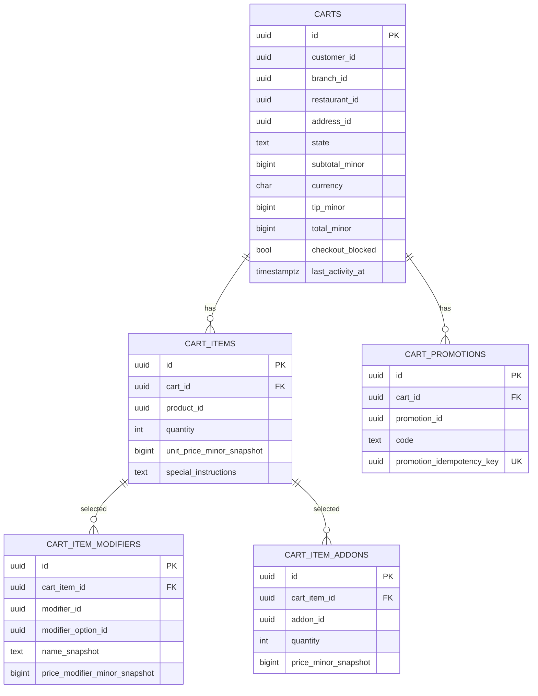

# cart-service — Entity-Relationship Diagram

## 1. Database

- Engine: **PostgreSQL 18**.
- Schema: `cart` (owned exclusively by this service).
- Migrations: `services/cart-service/prisma/migrations/`.

## 2. Cross-Service References

| Column | Type | Refers to | Source of truth |
|--------|------|-----------|------------------|
| `carts.customer_id` | UUID | Customer | `customer-service` |
| `carts.branch_id` | UUID | Branch | `branch-service` |
| `carts.restaurant_id` | UUID | Restaurant | `restaurant-service` |
| `carts.address_id` | UUID | Saved address | `address-service` (optional) |
| `cart_items.product_id` | UUID | Product | `menu-service` |
| `cart_item_modifiers.modifier_id` | UUID | Modifier | `menu-service` |
| `cart_item_modifiers.modifier_option_id` | UUID | Modifier option | `menu-service` |
| `cart_item_addons.addon_id` | UUID | Add-on | `menu-service` |
| `cart_promotions.promotion_id` | UUID | Promotion | `promotion-service` |
| `carts.checkout_session_id` | UUID | Checkout session | `checkout-service` |

All cross-service references are stored as columns **without**
database-level foreign keys.

## 3. Entities

### `carts`

A shopping cart.

#### Columns

| Column | Type | Constraints | Notes |
|--------|------|-------------|-------|
| `id` | UUID | PK | UUIDv7 |
| `customer_id` | UUID | NOT NULL | cross-service ref |
| `branch_id` | UUID | NOT NULL | cross-service ref |
| `restaurant_id` | UUID | NOT NULL | cross-service ref |
| `address_id` | UUID | NULL | cross-service ref |
| `state` | TEXT | NOT NULL DEFAULT 'active' CHECK in (...) | lifecycle |
| `subtotal_minor` | BIGINT | NOT NULL DEFAULT 0 | quoted subtotal |
| `currency` | CHAR(3) | NOT NULL | ISO-4217 |
| `tip_minor` | BIGINT | NOT NULL DEFAULT 0 | tip |
| `delivery_fee_minor` | BIGINT | NOT NULL DEFAULT 0 | quoted fee |
| `tax_minor` | BIGINT | NOT NULL DEFAULT 0 | quoted tax |
| `total_minor` | BIGINT | NOT NULL DEFAULT 0 | quoted total |
| `promotion_code` | TEXT | NULL | applied code |
| `promotion_discount_minor` | BIGINT | NOT NULL DEFAULT 0 | discount from promo |
| `checkout_blocked` | BOOLEAN | NOT NULL DEFAULT false | set on `restaurant.offline.v1` |
| `checkout_block_reason` | TEXT | NULL | reason |
| `checkout_session_id` | UUID | NULL | set on `POST /checkout` |
| `last_activity_at` | TIMESTAMPTZ | NOT NULL DEFAULT now() | for abandonment |
| `created_at` | TIMESTAMPTZ | NOT NULL DEFAULT now() | audit |
| `updated_at` | TIMESTAMPTZ | NOT NULL DEFAULT now() | audit |

#### Indexes

- PK on `id`.
- Index on `(customer_id, state) WHERE state = 'active'`.
- Partial index on `(last_activity_at) WHERE state = 'active'`
  — abandonment cron hot path.
- Index on `(state)`.

### `cart_items`

A line item in a cart.

#### Columns

| Column | Type | Constraints | Notes |
|--------|------|-------------|-------|
| `id` | UUID | PK | UUIDv7 |
| `cart_id` | UUID | NOT NULL, FK to `carts.id` | |
| `product_id` | UUID | NOT NULL | cross-service ref |
| `product_name_snapshot` | TEXT | NOT NULL | snapshot at add time |
| `quantity` | INTEGER | NOT NULL CHECK (quantity > 0) | |
| `unit_price_minor_snapshot` | BIGINT | NOT NULL | price at add time |
| `currency` | CHAR(3) | NOT NULL | |
| `special_instructions` | TEXT | NULL | up to 500 chars |
| `created_at` | TIMESTAMPTZ | NOT NULL DEFAULT now() | |
| `updated_at` | TIMESTAMPTZ | NOT NULL DEFAULT now() | |

#### Indexes

- PK on `id`.
- Index on `(cart_id)`.

### `cart_item_modifiers`

A modifier selection for an item.

#### Columns

| Column | Type | Constraints | Notes |
|--------|------|-------------|-------|
| `id` | UUID | PK | UUIDv7 |
| `cart_item_id` | UUID | NOT NULL, FK to `cart_items.id` | |
| `modifier_id` | UUID | NOT NULL | cross-service ref |
| `modifier_option_id` | UUID | NOT NULL | cross-service ref |
| `name_snapshot` | TEXT | NOT NULL | snapshot at add time |
| `price_modifier_minor_snapshot` | BIGINT | NOT NULL DEFAULT 0 | |
| `currency` | CHAR(3) | NOT NULL | |
| `created_at` | TIMESTAMPTZ | NOT NULL DEFAULT now() | |

#### Indexes

- PK on `id`.
- Index on `(cart_item_id)`.

### `cart_item_addons`

An add-on selection for an item.

#### Columns

| Column | Type | Constraints | Notes |
|--------|------|-------------|-------|
| `id` | UUID | PK | UUIDv7 |
| `cart_item_id` | UUID | NOT NULL, FK to `cart_items.id` | |
| `addon_id` | UUID | NOT NULL | cross-service ref |
| `name_snapshot` | TEXT | NOT NULL | snapshot at add time |
| `quantity` | INTEGER | NOT NULL DEFAULT 1 CHECK (quantity > 0) | |
| `price_minor_snapshot` | BIGINT | NOT NULL | |
| `currency` | CHAR(3) | NOT NULL | |
| `created_at` | TIMESTAMPTZ | NOT NULL DEFAULT now() | |

#### Indexes

- PK on `id`.
- Index on `(cart_item_id)`.

### `cart_promotions`

An applied promotion on a cart.

#### Columns

| Column | Type | Constraints | Notes |
|--------|------|-------------|-------|
| `id` | UUID | PK | UUIDv7 |
| `cart_id` | UUID | NOT NULL, FK to `carts.id` | |
| `promotion_id` | UUID | NOT NULL | cross-service ref |
| `code` | TEXT | NOT NULL | |
| `promotion_idempotency_key` | UUID | NOT NULL UNIQUE | `cart:{cart_id}:promo:{code}` |
| `discount_minor` | BIGINT | NOT NULL | applied discount |
| `currency` | CHAR(3) | NOT NULL | |
| `applied_at` | TIMESTAMPTZ | NOT NULL DEFAULT now() | |
| `applied_by_kc_sub` | UUID | NOT NULL | customer |
| `created_at` | TIMESTAMPTZ | NOT NULL DEFAULT now() | |

#### Indexes

- PK on `id`.
- UNIQUE on `promotion_idempotency_key`.
- Index on `(cart_id)`.

### `outbox`

Transactional outbox for events.

#### Columns

| Column | Type | Constraints | Notes |
|--------|------|-------------|-------|
| `id` | UUID | PK | UUIDv7 |
| `aggregate_type` | TEXT | NOT NULL | `Cart` |
| `aggregate_id` | UUID | NOT NULL | partition key |
| `event_name` | TEXT | NOT NULL | `cart.*.v1` |
| `event_id` | UUID | NOT NULL UNIQUE | dedup |
| `payload` | JSONB | NOT NULL | envelope |
| `headers` | JSONB | NOT NULL DEFAULT '{}' | Kafka headers |
| `created_at` | TIMESTAMPTZ | NOT NULL DEFAULT now() | |
| `claimed_at` | TIMESTAMPTZ | NULL | poller-set |
| `published_at` | TIMESTAMPTZ | NULL | poller-set |

#### Indexes

- PK on `id`.
- Index on `(published_at NULLS FIRST, created_at)`.

### `inbox`

Consumer-side dedup.

#### Columns

| Column | Type | Constraints | Notes |
|--------|------|-------------|-------|
| `event_id` | UUID | PK | |
| `consumer` | TEXT | NOT NULL | |
| `received_at` | TIMESTAMPTZ | NOT NULL DEFAULT now() | |
| `processed_at` | TIMESTAMPTZ | NULL | |
| `error` | TEXT | NULL | |

## 4. Mermaid ER Diagram



## 5. DDL Sketch

```sql
CREATE SCHEMA IF NOT EXISTS cart;

CREATE TABLE cart.carts (
    id UUID PRIMARY KEY,
    customer_id UUID NOT NULL,
    branch_id UUID NOT NULL,
    restaurant_id UUID NOT NULL,
    address_id UUID,
    state TEXT NOT NULL DEFAULT 'active' CHECK (state IN
        ('active','abandoned','checked_out')),
    subtotal_minor BIGINT NOT NULL DEFAULT 0 CHECK (subtotal_minor >= 0),
    currency CHAR(3) NOT NULL CHECK (currency ~ '^[A-Z]{3}$'),
    tip_minor BIGINT NOT NULL DEFAULT 0 CHECK (tip_minor >= 0),
    delivery_fee_minor BIGINT NOT NULL DEFAULT 0,
    tax_minor BIGINT NOT NULL DEFAULT 0,
    total_minor BIGINT NOT NULL DEFAULT 0,
    promotion_code TEXT,
    promotion_discount_minor BIGINT NOT NULL DEFAULT 0,
    checkout_blocked BOOLEAN NOT NULL DEFAULT false,
    checkout_block_reason TEXT,
    checkout_session_id UUID,
    last_activity_at TIMESTAMPTZ NOT NULL DEFAULT now(),
    created_at TIMESTAMPTZ NOT NULL DEFAULT now(),
    updated_at TIMESTAMPTZ NOT NULL DEFAULT now()
);

CREATE INDEX carts_customer_state_idx
    ON cart.carts (customer_id, state)
    WHERE state = 'active';

CREATE INDEX carts_active_idx
    ON cart.carts (last_activity_at)
    WHERE state = 'active';

CREATE TABLE cart.cart_items (
    id UUID PRIMARY KEY,
    cart_id UUID NOT NULL REFERENCES cart.carts(id),
    product_id UUID NOT NULL,
    product_name_snapshot TEXT NOT NULL,
    quantity INTEGER NOT NULL CHECK (quantity > 0),
    unit_price_minor_snapshot BIGINT NOT NULL,
    currency CHAR(3) NOT NULL,
    special_instructions TEXT,
    created_at TIMESTAMPTZ NOT NULL DEFAULT now(),
    updated_at TIMESTAMPTZ NOT NULL DEFAULT now()
);

CREATE INDEX cart_items_cart_idx
    ON cart.cart_items (cart_id);

CREATE TABLE cart.cart_item_modifiers (
    id UUID PRIMARY KEY,
    cart_item_id UUID NOT NULL REFERENCES cart.cart_items(id),
    modifier_id UUID NOT NULL,
    modifier_option_id UUID NOT NULL,
    name_snapshot TEXT NOT NULL,
    price_modifier_minor_snapshot BIGINT NOT NULL DEFAULT 0,
    currency CHAR(3) NOT NULL,
    created_at TIMESTAMPTZ NOT NULL DEFAULT now()
);

CREATE INDEX cart_item_modifiers_item_idx
    ON cart.cart_item_modifiers (cart_item_id);

CREATE TABLE cart.cart_item_addons (
    id UUID PRIMARY KEY,
    cart_item_id UUID NOT NULL REFERENCES cart.cart_items(id),
    addon_id UUID NOT NULL,
    name_snapshot TEXT NOT NULL,
    quantity INTEGER NOT NULL DEFAULT 1 CHECK (quantity > 0),
    price_minor_snapshot BIGINT NOT NULL,
    currency CHAR(3) NOT NULL,
    created_at TIMESTAMPTZ NOT NULL DEFAULT now()
);

CREATE INDEX cart_item_addons_item_idx
    ON cart.cart_item_addons (cart_item_id);

CREATE TABLE cart.cart_promotions (
    id UUID PRIMARY KEY,
    cart_id UUID NOT NULL REFERENCES cart.carts(id),
    promotion_id UUID NOT NULL,
    code TEXT NOT NULL,
    promotion_idempotency_key UUID NOT NULL UNIQUE,
    discount_minor BIGINT NOT NULL,
    currency CHAR(3) NOT NULL,
    applied_at TIMESTAMPTZ NOT NULL DEFAULT now(),
    applied_by_kc_sub UUID NOT NULL,
    created_at TIMESTAMPTZ NOT NULL DEFAULT now()
);

CREATE INDEX cart_promotions_cart_idx
    ON cart.cart_promotions (cart_id);

CREATE TABLE cart.outbox (
    id UUID PRIMARY KEY,
    aggregate_type TEXT NOT NULL,
    aggregate_id UUID NOT NULL,
    event_name TEXT NOT NULL,
    event_id UUID NOT NULL UNIQUE,
    payload JSONB NOT NULL,
    headers JSONB NOT NULL DEFAULT '{}'::jsonb,
    created_at TIMESTAMPTZ NOT NULL DEFAULT now(),
    claimed_at TIMESTAMPTZ,
    published_at TIMESTAMPTZ
);

CREATE INDEX outbox_pending_idx
    ON cart.outbox (published_at NULLS FIRST, created_at);

CREATE TABLE cart.inbox (
    event_id UUID PRIMARY KEY,
    consumer TEXT NOT NULL,
    received_at TIMESTAMPTZ NOT NULL DEFAULT now(),
    processed_at TIMESTAMPTZ,
    error TEXT
);
```

## 6. Audit Columns

`carts` has `created_at`, `updated_at`, `last_activity_at`.
`cart_items`, `cart_item_modifiers`, `cart_item_addons`,
`cart_promotions` have `created_at`/`updated_at`. There is no
separate audit log table; events are the audit record.

## 7. Soft Delete

No soft delete. Carts are abandoned (state) and hard-deleted
after 30 days.

## 8. JSONB Usage

`outbox.payload` and `outbox.headers` for the event envelope.
No other JSONB.

## 9. Partitioning

No partitioning. Carts are short-lived and pruned aggressively.

## 10. Data Retention

| Table | Retention | Purged by |
|-------|-----------|-----------|
| `carts` | 30 days after `abandoned` or `checked_out` | scheduled job |
| `cart_items` | with cart | hard delete with cart |
| `cart_item_modifiers` | with cart item | hard delete with cart |
| `cart_item_addons` | with cart item | hard delete with cart |
| `cart_promotions` | with cart | hard delete with cart |
| `outbox` | 24 h after `published_at` | scheduled job |
| `inbox` | 30 days | scheduled job |

## 11. Migration Considerations

- Adding a new `state` value: forward-only migration; update
  the state machine.
- The `promotion_idempotency_key` UNIQUE constraint is
  critical for preventing double-application of promotions.
- The abandonment cron is a separate job that runs every 5
  minutes and updates `state = 'abandoned'` for carts with
  `last_activity_at < now() - INTERVAL '30 minutes' AND state =
  'active'`.
- The cart re-quote is implemented as a row-level update
  inside a transaction that updates `carts.subtotal_minor`,
  `carts.total_minor`, etc. and writes a new outbox row.
- The checkout handoff is a synchronous call to
  `checkout-service` that creates the checkout session; on
  success, the cart is marked `checked_out` and the
  `checkout_session_id` is set.

---

## See also

### Sibling docs for this service

- [`README.md`](./README.md) — purpose, bounded context, responsibilities
- [`BRD.md`](./BRD.md) — business requirements
- [`SRS.md`](./SRS.md) — functional + non-functional requirements
- [`ERD.md`](./ERD.md) — data model (entities, relationships)
- [`INTEGRATION.md`](./INTEGRATION.md) — inter-service contracts (APIs, events, sagas)
- [`WORKFLOWS.md`](./WORKFLOWS.md) — operational workflows (happy paths, failure modes)
- [`TECH.md`](./TECH.md) — technology profile (runtime, libraries, data layer, admin endpoints, RBAC)

### Platform-wide

- [`../../shared/README.md`](../../shared/README.md) — `platform-spring-boot-starter` shared library (the single source of cross-cutting code for all Spring Boot services in the platform)
- [`../RECOMMENDATIONS.md`](../RECOMMENDATIONS.md) — platform-wide technology map (language, framework, version baseline, admin/RBAC pattern)
- [`../../README.md`](../../README.md) — services overview (the catalog of all 58 services)
- [`../../../main.md`](../../../main.md) — top-level platform specification (architecture, Keycloak, PostgreSQL 18, messaging, observability baseline)

