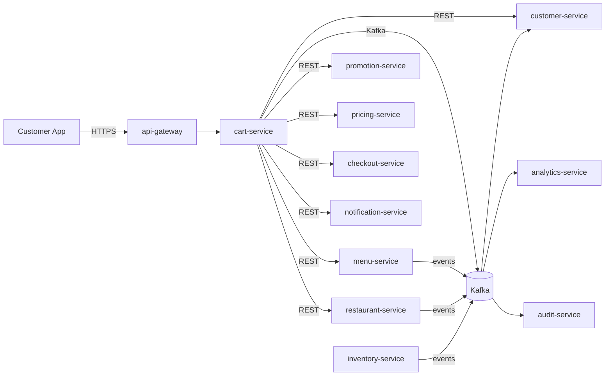

# cart-service — Software Requirements Specification

## 1. Introduction

This SRS specifies the software behavior of `cart-service`. It
covers functional requirements, non-functional requirements,
data requirements, API contract summaries, validation, state
transitions, authorization, idempotency, performance,
availability, security, and disaster recovery. The service is
the source of truth for the `Cart` aggregate.

## 2. Scope

In scope:

- Cart CRUD.
- Item management (add, update, remove with modifiers and
  add-ons).
- Promotion application.
- Sub-quote and re-quote.
- Cart lifecycle (active, abandoned, checked_out).
- Checkout handoff to `checkout-service`.

Out of scope:

- Checkout session (owned by `checkout-service`).
- Food order (owned by `food-order-service`).
- Menu catalog (owned by `menu-service`; read-only).
- Promotions definition (owned by `promotion-service`; this
  service only applies).
- Pricing engine (owned by `pricing-service`; this service
  only requests a sub-quote).

## 3. System Context

## 4. Actors

- **Customer (human)** — Keycloak subject with role
  `customer`.
- **`customer-service` (system)** — customer reference.
- **`menu-service` (system)** — product / price / availability.
- **`restaurant-service` (system)** — online status.
- **`promotion-service` (system)** — promo validation.
- **`pricing-service` (system)** — sub-quote.
- **`checkout-service` (system)** — checkout handoff.
- **`notification-service` (system)** — customer notifications.
- **`audit-service` (system)** — audit events.

## 5. Functional Requirements

| ID | Requirement | Priority |
|----|-------------|----------|
| FR--001 | The service MUST accept `POST /v1/carts` with `customer_id`, `branch_id`, optional `address_id` and `tip_minor`. | MUST |
| FR--002 | The service MUST verify the customer via `customer-service`. | MUST |
| FR--003 | The service MUST verify the branch is `open` and the restaurant is `online` (warning, not block). | MUST |
| FR--004 | The service MUST support `POST /v1/carts/{id}/items` with `product_id`, `quantity`, `modifier_option_ids[]`, `addon_ids[]`. | MUST |
| FR--005 | The service MUST re-validate the product, modifiers, and add-ons via `menu-service` on every add. | MUST |
| FR--006 | The service MUST support `PATCH /v1/carts/{id}/items/{iid}` (change quantity). | MUST |
| FR--007 | The service MUST support `DELETE /v1/carts/{id}/items/{iid}`. | MUST |
| FR--008 | The service MUST support `POST /v1/carts/{id}/promotions` with `code`. | MUST |
| FR--009 | The service MUST support `DELETE /v1/carts/{id}/promotions` (remove). | MUST |
| FR--010 | The service MUST request a sub-quote from `pricing-service` on every change. | MUST |
| FR--011 | The service MUST support `DELETE /v1/carts/{id}` (abandon). | MUST |
| FR--012 | The service MUST support `POST /v1/carts/{id}/checkout` (create checkout session). | MUST |
| FR--013 | The service MUST re-quote on `menu.item.price.changed.v1`. | MUST |
| FR--014 | The service MUST remove the item on `menu.item.unavailable.v1` or `cart.item.unavailable.v1`. | MUST |
| FR--015 | The service MUST block checkout (set `checkout_blocked = true`) on `restaurant.offline.v1`. | MUST |
| FR--016 | The service MUST mark carts as abandoned after `cart.abandonment.idle_minutes` (default 30). | MUST |
| FR--017 | The service MUST hard-delete abandoned carts after 30 days. | MUST |
| FR--018 | The service MUST publish a `cart.*.v1` event for every state change. | MUST |
| FR--019 | The service MUST support cursor pagination on `GET /v1/carts/by-customer/{customer_id}`. | MUST |
| FR--020 | The service MUST emit `admin.audit.cart.*` events for every admin action. | MUST |

## 6. Non-Functional Requirements

| ID | Category | Requirement | Target |
|----|----------|-------------|--------|
| NFR--001 | performance | P99 `POST /v1/carts/{id}/items` | < 1 s |
| NFR--002 | performance | P99 `GET /v1/carts/{id}` | < 200 ms (cache hit < 30 ms) |
| NFR--003 | performance | P99 `POST /v1/carts` | < 500 ms |
| NFR--004 | availability | service uptime | 99.9% over 30 days |
| NFR--005 | scalability | concurrent carts | ≥ 10,000 RPS |
| NFR--006 | scalability | `get cart` lookups | ≥ 20,000 RPS via Redis |
| NFR--007 | maintainability | MTTR for P1 | < 30 min |
| NFR--008 | data-integrity | zero event loss | outbox + 24 h ack |
| NFR--009 | latency | re-quote P95 | < 5 s |
| NFR--010 | observability | every state change queryable in audit | 100% |

## 7. API Requirements

REST API under `/v1/carts[...]` per
[`API_STANDARDS.md`](../../architecture/API_STANDARDS.md). All
write endpoints require `Idempotency-Key`. Cursor pagination by
default. OpenAPI 3.1 spec at `/openapi.json`.

(Full contracts in `INTEGRATION.md`.)

## 8. Data Requirements

| ID | Requirement | Notes |
|----|-------------|-------|
| DATA--001 | Carts are uniquely identified by `id UUIDv7`. | primary key |
| DATA--002 | Every mutable table has `created_at`, `updated_at`, `last_activity_at`. | audit |
| DATA--003 | `state` is a CHECK-constrained enum. | lifecycle |
| DATA--004 | `customer_id` is a UUID column with no DB FK. | cross-service ref |
| DATA--005 | `branch_id` is a UUID column with no DB FK. | cross-service ref |
| DATA--006 | `address_id` is a UUID column with no DB FK (optional). | cross-service ref |
| DATA--007 | `tip_minor` is a non-negative integer; `currency` is ISO-4217. | money |
| DATA--008 | `subtotal_minor` is a non-negative integer; `currency` is ISO-4217. | money |
| DATA--009 | `promotion_code` is a string (denormalized for display). | applied |
| DATA--010 | `promotion_idempotency_key` is a UUID; used to prevent double-application. | idempotency |

(Full schema in `ERD.md`.)

## 9. Validation Rules

- `customer_id` — UUID, must reference a valid customer (via
  API).
- `branch_id` — UUID, must reference a valid branch (via API).
- `quantity` — int in `[1, cart.max_quantity_per_item]`.
- `modifier_option_ids[]` — each must reference a valid
  modifier option (via API).
- `addon_ids[]` — each must reference a valid add-on (via
  API).
- `promotion_code` — drawn from `promotion-service`; validated
  via API.
- `tip_minor` — non-negative.
- Max items per cart: `cart.max_items` (default 50).

## 10. State Transitions

| From | To | Trigger |
|------|----|---------|
| (none) | `active` | `POST /v1/carts` |
| `active` | `abandoned` | 30 min idle (cron) |
| `active` | `checked_out` | `POST /v1/carts/{id}/checkout` succeeds |
| `checked_out` | — | terminal |

State transitions are described in detail in `WORKFLOWS.md`.

## 11. Authorization Requirements

- `customer` may read / write their own carts
  (`cart.customer_id == sub`).
- `platform_admin` may read any cart.
- Service-to-service via `client_credentials`.

## 12. Configuration Requirements

- `cart.abandonment.idle_minutes` — int (default 30).
- `cart.max_items` — int (default 50).
- `cart.max_quantity_per_item` — int (default 20).
- `cart.quote.cache_ttl_seconds` — int (default 60).
- `cart.rate_limit.create_per_hour` — int.

## 13. Error Handling

| Error | Response |
|-------|----------|
| Body validation failure | 400 `VALIDATION_FAILED` with `details[]` |
| Missing/invalid JWT | 401 `UNAUTHENTICATED` |
| Insufficient role | 403 `FORBIDDEN` |
| Customer not found | 404 `CUSTOMER_NOT_FOUND` |
| Branch not found / closed | 409 `BRANCH_CLOSED` |
| Product not available | 422 `PRODUCT_UNAVAILABLE` |
| Modifier / add-on invalid | 422 `MODIFIER_INVALID` |
| Promo invalid | 422 `PROMO_INVALID` |
| Promo double application | 422 `PROMO_ALREADY_APPLIED` |
| Max items reached | 422 `CART_FULL` |
| Checkout blocked | 409 `CHECKOUT_BLOCKED` |
| Idempotency key reused | 422 `IDEMPOTENCY_KEY_REUSED` |
| Rate limited | 429 `RATE_LIMITED` |
| Downstream timeout | 503 `DEPENDENCY_TIMEOUT` |
| Circuit open | 503 `CIRCUIT_OPEN` |
| Other | 500 `INTERNAL_ERROR` |

## 14. Concurrency Requirements

- Two concurrent item adds on the same cart MUST be serialized
  via row-level lock; the second one re-validates and may
  receive 409 if the cart is `checked_out` or `abandoned`.
- Two concurrent promo applications on the same cart MUST be
  serialized; the second one receives 422 if the promo is
  already applied.
- The abandonment cron MUST be safe to run multiple times
  (idempotent on `state`).

## 15. Idempotency Requirements

- All write endpoints require `Idempotency-Key`.
- Promotion application uses a separate
  `promotion_idempotency_key` (keyed on
  `cart:{cart_id}:promo:{code}`) to prevent double-application
  at the promotion service.
- All state transitions use the outbox pattern with `event_id`
  dedup.

## 16. Performance

- Dominant path: `GET /v1/carts/{id}`. P50 < 5 ms (cache hit),
  P99 < 30 ms.
- `POST /v1/carts/{id}/items`: P50 < 200 ms, P99 < 1 s
  (including pricing-service call).
- Re-quote: P50 < 100 ms, P99 < 500 ms.

## 17. Scalability

- Horizontal: HPA on CPU > 60% and
  `http_requests_in_flight > 500/replica`; max 12.
- Vertical: up to 4 CPU / 8 GiB.
- DB: 1 primary + 1 read replica in each region.
- Cache: Redis cluster, key `cart:{id}` TTL 30 s.

## 18. Availability

- SLO: 99.9% over 30 days (Tier-2).
- Error budget: ~44 min / 30 days.
- Maintenance: Sunday 04:00–06:00 UTC.

## 19. Security

| ID | Requirement | Notes |
|----|-------------|-------|
| SEC--001 | All endpoints require a valid JWT; service-to-service uses `client_credentials`. | gateway enforced |
| SEC--002 | Resource-level ownership checks at the service layer. | `cart.customer_id == sub` |
| SEC--003 | All cross-service calls use mTLS + `client_credentials` JWT. | defense in depth |
| SEC--004 | Secrets only in Vault. | pre-commit enforced |
| SEC--005 | Rate limiting at gateway and service. | `API_STANDARDS.md` §12 |
| SEC--006 | No PII beyond the customer's id. | minimal |
| SEC--007 | Admin actions emit `admin.audit.cart.*` events. | `audit-service` |
| SEC--008 | The service stores no card data; PCI scope is none. | SAQ-A |

## 20. Privacy

- PII stored: the customer's id; the cart contents are
  short-lived.
- Retention: 30 days (hard delete after 30 days of
  abandonment).
- Erasure: not directly supported (cart is short-lived).

## 21. Auditability

- Every state transition emits a `cart.*.v1` event.
- Every admin action emits an `admin.audit.cart.*` event.
- Audit retention: 7 years (for financial reconciliation).

## 22. Observability

- Logs: JSON to stdout with `correlation_id`, `trace_id`,
  `cart_id`, `customer_id`, `branch_id`, `state`, `from_state`,
  `to_state`, `actor`.
- Metrics:
  - RED: standard.
  - Business: `carts_created_total`,
    `carts_abandoned_total{reason}`,
    `carts_checked_out_total`,
    `cart_items_total{restaurant_id}`,
    `cart_re_quote_total{reason}`,
    `cart_quote_seconds` (histogram).
- Traces: OpenTelemetry.
- Alerts: SLO burn rate, outbox lag, abandonment lag.

## 23. Maintainability

- TypeScript strict, ESLint, Prettier.
- Coverage: ≥ 85% lines.
- Documentation: this folder.

## 24. Disaster Recovery

- RPO: 15 min (Tier-2; PITR 7 days).
- RTO: 60 min.
- Quarterly restore drill.

## 25. Acceptance Criteria

- AC-1: A customer can add an item in < 1 s.
- AC-2: A price change is reflected in the cart within 5 s.
- AC-3: An unavailable item is removed from the cart within
  5 s.
- AC-4: An offline restaurant blocks checkout.
- AC-5: A cart idle for 30 min is marked abandoned.
- AC-6: All state changes are emitted as events.
- AC-7: The service meets its 99.9% SLO.
- AC-8: The service stores no card data.
- AC-9: The service supports a max of 50 items per cart.
- AC-10: Abandoned carts are hard-deleted after 30 days.

---

## See also

### Sibling docs for this service

- [`README.md`](./README.md) — purpose, bounded context, responsibilities
- [`BRD.md`](./BRD.md) — business requirements
- [`SRS.md`](./SRS.md) — functional + non-functional requirements
- [`ERD.md`](./ERD.md) — data model (entities, relationships)
- [`INTEGRATION.md`](./INTEGRATION.md) — inter-service contracts (APIs, events, sagas)
- [`WORKFLOWS.md`](./WORKFLOWS.md) — operational workflows (happy paths, failure modes)
- [`TECH.md`](./TECH.md) — technology profile (runtime, libraries, data layer, admin endpoints, RBAC)

### Platform-wide

- [`../../shared/README.md`](../../shared/README.md) — `platform-spring-boot-starter` shared library (the single source of cross-cutting code for all Spring Boot services in the platform)
- [`../RECOMMENDATIONS.md`](../RECOMMENDATIONS.md) — platform-wide technology map (language, framework, version baseline, admin/RBAC pattern)
- [`../../README.md`](../../README.md) — services overview (the catalog of all 58 services)
- [`../../../main.md`](../../../main.md) — top-level platform specification (architecture, Keycloak, PostgreSQL 18, messaging, observability baseline)

