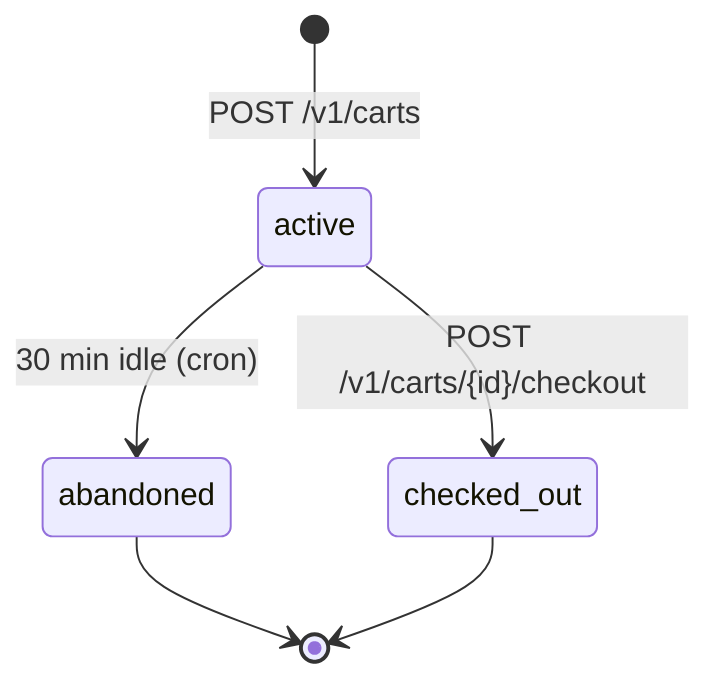

# cart-service — Workflows

## 1. Cart Creation and Item Add

### 1.1 Objective

A customer creates a cart, picks a branch, and adds an item
with modifiers and add-ons. The service validates the product
with `menu-service`, computes a sub-quote with
`pricing-service`, and persists the cart. The
`cart.created.v1` and `cart.updated.v1` events are emitted and
consumed by `analytics-service` and `customer-service`.

### 1.2 Initiating Actor

`customer` (human).

### 1.3 Participating Services

- `cart-service` (this service).
- `customer-service` (verify customer).
- `branch-service` (verify open).
- `restaurant-service` (verify online).
- `menu-service` (verify product, price, modifiers, add-ons).
- `pricing-service` (sub-quote).
- `notification-service` (optional, for warnings).
- `analytics-service`, `customer-service` (downstream
  consumers).

### 1.4 Prerequisites

- The customer is authenticated.
- The branch is `open` (warning if not).
- The product is `published` and not 86'd.
- The modifiers and add-ons are valid.

### 1.5 Happy Path

```mermaid
sequenceDiagram
    participant C as Customer
    participant CRT as cart-service
    participant CUS as customer-service
    participant BRH as branch-service
    participant RES as restaurant-service
    participant MN as menu-service
    participant PRC as pricing-service
    participant NOT as notification-service
    participant K as Kafka
    participant AN as analytics-service

    C->>CRT: POST /v1/carts (branch_id, address_id, tip_minor, Idempotency-Key)
    CRT->>CUS: GET /v1/customers/{customer_id}
    CUS-->>CRT: ok
    CRT->>BRH: GET /v1/branches/{branch_id}
    BRH-->>CRT: open
    CRT->>RES: GET /v1/restaurants/{restaurant_id}
    RES-->>RES: online
    CRT->>CRT: state=active; subtotal=0
    CRT->>K: cart.created.v1
    K->>AN: consumed
    CRT-->>C: 201 cart
    C->>CRT: POST /v1/carts/{id}/items (product_id, qty, modifier_option_ids, addon_ids, Idempotency-Key)
    CRT->>MN: GET /v1/menus/products/{id}
    MN-->>CRT: product, price, modifiers, add-ons
    CRT->>MN: GET /v1/menus/products/{id}/availability
    MN-->>CRT: available
    CRT->>CRT: insert cart_items, modifiers, add-ons
    CRT->>PRC: POST /v1/quote (cart)
    PRC-->>CRT: subtotal, tax, total
    CRT->>CRT: update carts.subtotal, total; last_activity_at
    CRT->>K: cart.updated.v1
    K->>AN: consumed
    CRT-->>C: 200 updated cart
```

### 1.6 Alternate Paths

- **Branch closed**: `checkout_blocked = true`; the cart is
  still created; the customer is notified.
- **Product unavailable**: 422 `PRODUCT_UNAVAILABLE`; the
  item is not added.
- **Modifier / add-on invalid**: 422 `MODIFIER_INVALID`.
- **Max items reached**: 422 `CART_FULL`.

### 1.7 Failure Paths

- **Downstream timeout / circuit open**: 503.
- **Outbox failure**: outbox retried.

### 1.8 Business Rules

- A cart belongs to exactly one customer and one branch.
- Items can only be added to an `active` cart.
- The subtotal is recomputed on every change.

### 1.9 State Transitions



### 1.10 Events

| Event | Direction | When |
|-------|-----------|------|
| `cart.created.v1` | produced | `POST /v1/carts` |
| `cart.updated.v1` | produced | item add / update / remove / promo |

### 1.11 APIs Involved

| API | Direction | When |
|-----|-----------|------|
| `POST /v1/carts` | inbound | create |
| `POST /v1/carts/{id}/items` | inbound | add item |
| `GET /v1/customers/{id}` to customer-service | outbound | verify customer |
| `GET /v1/menus/products/{id}` to menu-service | outbound | verify product |
| `POST /v1/quote` to pricing-service | outbound | sub-quote |

### 1.12 Compensation / Rollback

- **Add item was a mistake**: the customer calls
  `DELETE /v1/carts/{id}/items/{iid}` to remove.
- **Wrong branch**: the customer abandons the cart
  (`DELETE /v1/carts/{id}`) and creates a new one.

### 1.13 Final State

The cart is `active` with the added item, a fresh subtotal,
and `last_activity_at = now()`. The customer is ready to
apply promos or check out.

## 2. Promotion Application

### 2.1 Objective

Customer applies a promo code; the service validates the
promo via `promotion-service`, applies it idempotently, and
re-quotes.

### 2.2 Initiating Actor

`customer` (human).

### 2.3 Participating Services

- `cart-service` (this service).
- `promotion-service` (validate / apply).
- `pricing-service` (re-quote).
- `analytics-service` (downstream).

### 2.4 Prerequisites

- The cart is `active`.
- The promo code is provided.

### 2.5 Happy Path

```mermaid
sequenceDiagram
    participant C as Customer
    participant CRT as cart-service
    participant PRM as promotion-service
    participant PRC as pricing-service
    participant K as Kafka
    participant AN as analytics-service

    C->>CRT: POST /v1/carts/{id}/promotions {code: "SUMMER20", Idempotency-Key}
    CRT->>PRM: validate(code, cart, customer, Idempotency-Key=cart:{cart_id}:promo:SUMMER20)
    PRM-->>CRT: valid; discount_minor
    CRT->>CRT: insert cart_promotions (promotion_idempotency_key)
    CRT->>PRC: POST /v1/quote (cart with promo)
    PRC-->>CRT: subtotal, discount, total
    CRT->>CRT: update carts.promotion_code, discount, total
    CRT->>K: cart.updated.v1
    K->>AN: consumed
    CRT-->>C: 200 updated cart
```

### 2.6 Alternate Paths

- **Promo invalid**: 422 `PROMO_INVALID`.
- **Promo already applied**: 422 `PROMO_ALREADY_APPLIED` (the
  `promotion_idempotency_key` UNIQUE constraint catches
  duplicates).

### 2.7 Failure Paths

- **`promotion-service` unreachable**: 503.

### 2.8 Business Rules

- A promo is applied with an idempotency key derived from
  `(cart_id, code)`. The `promotion-service` also uses this
  key to prevent double-redemption.
- The subtotal is recomputed.

### 2.9 State Transitions

This workflow does not change the cart state; only the
applied promotion and total.

### 2.10 Events

| Event | Direction | When |
|-------|-----------|------|
| `cart.updated.v1` | produced | promo applied |

### 2.11 APIs Involved

| API | Direction | When |
|-----|-----------|------|
| `POST /v1/carts/{id}/promotions` | inbound | apply |
| `POST /v1/promotions/validate` to promotion-service | outbound | validate |

### 2.12 Compensation / Rollback

`DELETE /v1/carts/{id}/promotions` removes the promo and
re-quotes.

### 2.13 Final State

The promo is applied; the subtotal reflects the discount; the
customer is informed.

## 3. Re-quote on Price / Availability Change

### 3.1 Objective

When the menu emits a price change or unavailability, active
carts containing the affected product are re-quoted or have
the item removed. The customer is notified of the diff.

### 3.2 Initiating Actor

`menu-service` (system) via `menu.item.price.changed.v1` and
`menu.item.unavailable.v1`.

### 3.3 Participating Services

- `cart-service` (this service).
- `pricing-service` (re-quote).
- `notification-service` (notify customer).
- `analytics-service` (downstream).

### 3.4 Prerequisites

- The event is received.
- Inbox dedup passes.

### 3.5 Happy Path (Price Change)

```mermaid
sequenceDiagram
    participant MN as menu-service
    participant K as Kafka
    participant CRT as cart-service
    participant PRC as pricing-service
    participant NOT as notification-service
    participant C as Customer
    participant AN as analytics-service

    K->>CRT: menu.item.price.changed.v1
    CRT->>CRT: inbox dedup
    loop each active cart containing the product
        CRT->>PRC: POST /v1/quote
        PRC-->>CRT: new subtotal
        CRT->>CRT: update cart; last_activity_at
        CRT->>K: cart.updated.v1
        K->>AN: consumed
        CRT->>NOT: notify customer of price diff
        NOT-->>C: push: "Price changed for X"
    end
```

### 3.6 Alternate Paths

- **Unavailability**: same code path with item removal; the
  customer is notified that the item is no longer available.
- **No affected carts**: nothing to do.

### 3.7 Failure Paths

- **Outbox failure**: outbox retried.
- **Re-quote service down**: the change is queued; the
  reconciliation job retries within 60 s.

### 3.8 Business Rules

- The cart's `last_activity_at` is updated on re-quote (it
  counts as activity).
- The customer is notified of the diff (old vs new subtotal)
  within 5 s.

### 3.9 State Transitions

This workflow does not change the cart state; only the
contents and total.

### 3.10 Events

| Event | Direction | When |
|-------|-----------|------|
| `menu.item.price.changed.v1` | consumed | re-quote |
| `menu.item.unavailable.v1` | consumed | remove item |
| `cart.updated.v1` | produced | re-quote |

### 3.11 APIs Involved

| API | Direction | When |
|-----|-----------|------|
| (no inbound API for this workflow) | | |
| `POST /v1/quote` to pricing-service | outbound | re-quote |

### 3.12 Compensation / Rollback

- The customer can revert by removing the item and re-adding
  it (which re-fetches the current price).

### 3.13 Final State

The cart reflects the new price or has the item removed; the
customer is notified; the cart is still `active`.

## 4. Checkout Handoff

### 4.1 Objective

The customer initiates checkout; the service creates a
checkout session in `checkout-service`, marks the cart
`checked_out`, and emits `cart.checked_out.v1`.

### 4.2 Initiating Actor

`customer` (human).

### 4.3 Participating Services

- `cart-service` (this service).
- `checkout-service` (create session).
- `payment-service` (via checkout).
- `analytics-service` (downstream).

### 4.4 Prerequisites

- The cart is `active`.
- The cart has at least one item.
- The restaurant is `online` (otherwise `checkout_blocked =
  true`).

### 4.5 Happy Path

```mermaid
sequenceDiagram
    participant C as Customer
    participant CRT as cart-service
    participant CHK as checkout-service
    participant K as Kafka
    participant AN as analytics-service

    C->>CRT: POST /v1/carts/{id}/checkout (Idempotency-Key)
    CRT->>CRT: row-level lock; state=active; checkout_blocked=false
    CRT->>CRT: state=checked_out
    CRT->>CHK: POST /v1/checkouts (cart_id, Idempotency-Key=cart:{cart_id}:checkout)
    CHK-->>CRT: 201 checkout_session_id
    CRT->>CRT: update carts.checkout_session_id
    CRT->>K: cart.checked_out.v1
    K->>AN: consumed
    CRT-->>C: 201 checkout_session_id
```

### 4.6 Alternate Paths

- **Cart empty**: 409 `CART_EMPTY`.
- **Cart already checked out**: 409 `STATE_INVALID`.
- **Restaurant offline**: 409 `CHECKOUT_BLOCKED`.
- **`checkout-service` failure**: 503; the cart remains
  `active`; the customer can retry.

### 4.7 Failure Paths

- **Outbox failure**: outbox retried.
- **Checkout service failure**: the cart is NOT marked
  `checked_out`; the customer retries.

### 4.8 Business Rules

- The cart is marked `checked_out` BEFORE the
  `checkout-service` call (optimistic); if the call fails, a
  compensation reverts the state. The compensation is
  implemented via the row-level lock and a retry; in rare
  cases, a reconciliation job in `reporting-service` detects
  drift and opens a ticket.

### 4.9 State Transitions

The relevant transition is `active → checked_out`.

### 4.10 Events

| Event | Direction | When |
|-------|-----------|------|
| `cart.checked_out.v1` | produced | on success |

### 4.11 APIs Involved

| API | Direction | When |
|-----|-----------|------|
| `POST /v1/carts/{id}/checkout` | inbound | customer handoff |
| `POST /v1/checkouts` to checkout-service | outbound | create session |

### 4.12 Compensation / Rollback

If the `checkout-service` call fails after the cart is
marked `checked_out`, a compensation reverts the state to
`active`. The outbox event is not yet sent (the failure
short-circuits).

### 4.13 Final State

The cart is `checked_out`; the checkout session is created;
the customer proceeds to payment.

---

## See also

### Sibling docs for this service

- [`README.md`](./README.md) — purpose, bounded context, responsibilities
- [`BRD.md`](./BRD.md) — business requirements
- [`SRS.md`](./SRS.md) — functional + non-functional requirements
- [`ERD.md`](./ERD.md) — data model (entities, relationships)
- [`INTEGRATION.md`](./INTEGRATION.md) — inter-service contracts (APIs, events, sagas)
- [`WORKFLOWS.md`](./WORKFLOWS.md) — operational workflows (happy paths, failure modes)
- [`TECH.md`](./TECH.md) — technology profile (runtime, libraries, data layer, admin endpoints, RBAC)

### Platform-wide

- [`../../shared/README.md`](../../shared/README.md) — `platform-spring-boot-starter` shared library (the single source of cross-cutting code for all Spring Boot services in the platform)
- [`../RECOMMENDATIONS.md`](../RECOMMENDATIONS.md) — platform-wide technology map (language, framework, version baseline, admin/RBAC pattern)
- [`../../README.md`](../../README.md) — services overview (the catalog of all 58 services)
- [`../../../main.md`](../../../main.md) — top-level platform specification (architecture, Keycloak, PostgreSQL 18, messaging, observability baseline)

