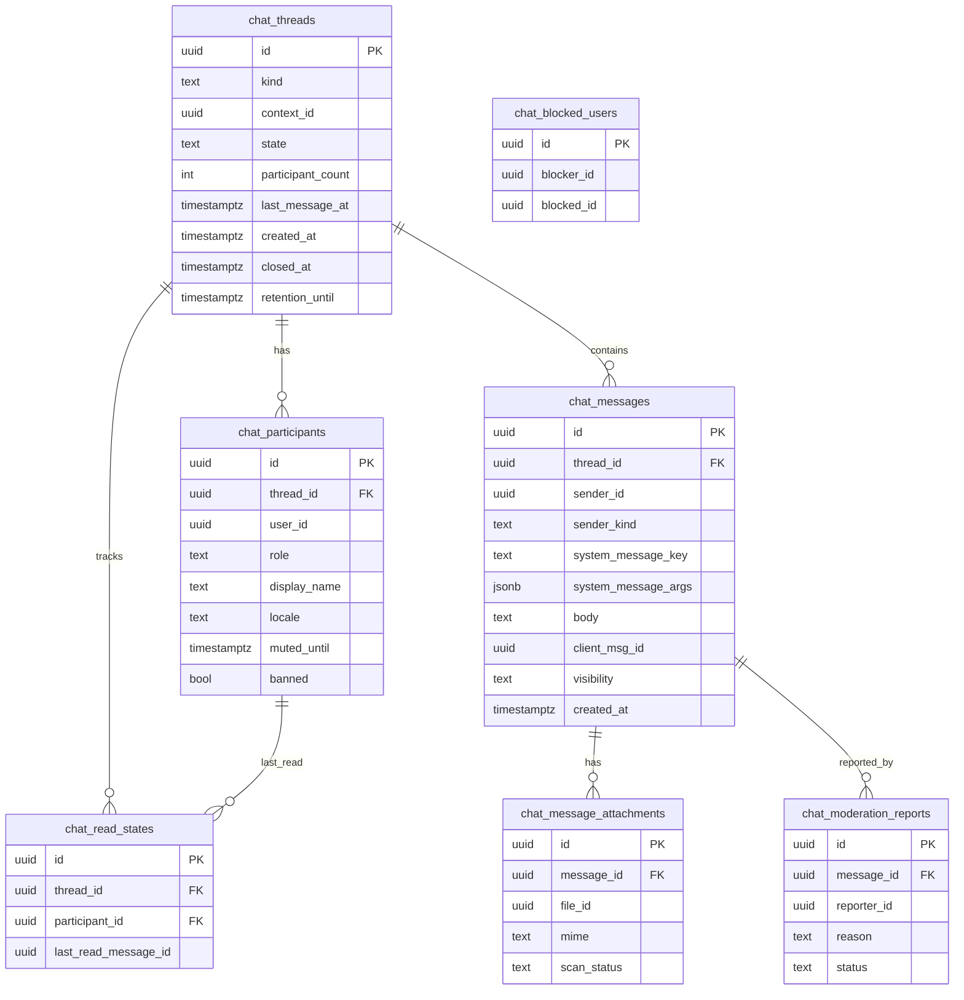

# chat-service — Entity-Relationship Diagram

## 1. Database

- Engine: PostgreSQL 19.
- Schema: `chat` (owned exclusively by this service).
- Migrations: `services/chat-service/migrations/`
  (versioned, forward-only; `golang-migrate v4`).

## 2. Cross-Service References

| Column | Type | Refers to | Source of truth |
|--------|------|-----------|------------------|
| `chat.threads.context_id` | UUID | the underlying aggregate (`trip_id` / `food_order_id` / `delivery_id`) in `trip-service` / `food-order-service` / `courier-service` | the respective upstream service |
| `chat.participants.user_id` | UUID | Keycloak `sub` (resolved via `identity-service`) | `identity-service` |
| `chat.messages.sender_id` | UUID | Keycloak `sub` (NULL for system messages) | `identity-service` |
| `chat.message_attachments.file_id` | UUID | `file-service.files.id` | `file-service` |
| `chat.moderation_reports.message_id` | UUID | `chat.messages.id` (intra-service FK; allowed) | this service |
| `chat.moderation_reports.reporter_id` | UUID | Keycloak `sub` | `identity-service` |
| `chat.blocked_users.blocker_id` | UUID | Keycloak `sub` | `identity-service` |
| `chat.blocked_users.blocked_id` | UUID | Keycloak `sub` | `identity-service` |

> Per platform convention, cross-service IDs are UUID columns
> WITHOUT database FKs. The single intra-service FK above is for
> referential integrity of the moderation report (we control both
> tables).

## 3. Entities

### `chat.threads`

A chat thread bound to a single service-context aggregate (trip,
food order, delivery).

#### Columns

| Column | Type | Constraints | Notes |
|--------|------|-------------|-------|
| `id` | UUID | PK | UUIDv7 |
| `kind` | text | NOT NULL, CHECK `kind IN ('trip_chat', 'food_order_chat', 'delivery_chat')` | thread kind |
| `context_id` | UUID | NOT NULL | the upstream aggregate id |
| `state` | text | NOT NULL, CHECK `state IN ('open', 'closing', 'closed', 'archived')`, default `'open'` | thread state |
| `participant_count` | int | NOT NULL, CHECK `participant_count > 0` | cached participant count |
| `last_message_at` | timestamptz | NULL | updated by trigger |
| `created_at` | timestamptz | NOT NULL DEFAULT now() | audit |
| `updated_at` | timestamptz | NOT NULL DEFAULT now() | audit |
| `closed_at` | timestamptz | NULL | when state -> closed |
| `archived_at` | timestamptz | NULL | when state -> archived |
| `close_reason` | text | NULL, CHECK `close_reason IN ('service_terminal', 'service_cancelled', 'admin_force_close', 'retention_sweep')` | reason for close |
| `retention_until` | timestamptz | NULL | computed by retention config |

#### Indexes

- PK on `id`.
- UNIQUE on `(kind, context_id)` — bootstrap idempotency (DATA--004).
- Index on `state` (reason: retention sweep filters on `state`).
- Index on `last_message_at DESC` (reason: listing recent threads).

### `chat.participants`

A participant in a thread.

#### Columns

| Column | Type | Constraints | Notes |
|--------|------|-------------|-------|
| `id` | UUID | PK | UUIDv7 |
| `thread_id` | UUID | NOT NULL | FK to `chat.threads.id` (intra-service) |
| `user_id` | UUID | NOT NULL | Keycloak `sub` |
| `role` | text | NOT NULL, CHECK `role IN ('rider', 'driver', 'customer', 'courier', 'restaurant_staff', 'system')` | participant role |
| `display_name` | text | NOT NULL | first name only |
| `locale` | text | NOT NULL, default `'en'` | for system message rendering |
| `joined_at` | timestamptz | NOT NULL DEFAULT now() | audit |
| `left_at` | timestamptz | NULL | populated when participant leaves (block) |
| `muted_until` | timestamptz | NULL | admin mute |
| `banned` | bool | NOT NULL DEFAULT false | admin ban |

#### Indexes

- PK on `id`.
- UNIQUE on `(thread_id, user_id)` (DATA--006).
- Index on `user_id` (reason: listing threads by user).

### `chat.messages`

A message in a thread. Partitioned by month.

#### Columns

| Column | Type | Constraints | Notes |
|--------|------|-------------|-------|
| `id` | UUID | PK | UUIDv7 |
| `thread_id` | UUID | NOT NULL | FK to `chat.threads.id` (intra-service) |
| `sender_id` | UUID | NULL | Keycloak `sub`; NULL for system messages |
| `sender_kind` | text | NOT NULL, CHECK `sender_kind IN ('user', 'system')` | sender kind |
| `system_message_key` | text | NULL, CHECK `system_message_key IS NULL OR sender_kind = 'system'` | i18n key for system messages |
| `system_message_args` | jsonb | NULL | template args for system messages |
| `body` | text | NULL, CHECK `body IS NULL OR char_length(body) <= 4000` | the text; encrypted via `pgcrypto` |
| `client_msg_id` | UUID | NULL | for idempotency |
| `has_attachment` | bool | NOT NULL DEFAULT false | derived |
| `visibility` | text | NOT NULL, CHECK `visibility IN ('visible', 'pending_attachment', 'hidden', 'removed')`, default `'visible'` | |
| `created_at` | timestamptz | NOT NULL DEFAULT now() | partition key |

#### Indexes

- PK on `(id, created_at)` (partition-compatible).
- Index on `(thread_id, created_at DESC)` (reason: history pagination).
- Index on `sender_id` (reason: GDPR sweep by sender).
- UNIQUE on `(thread_id, client_msg_id)` WHERE `client_msg_id IS NOT NULL` (FR--015).

### `chat.message_attachments`

A reference to a file attached to a message. The bytes live in
`file-service`; chat holds only metadata + the link.

#### Columns

| Column | Type | Constraints | Notes |
|--------|------|-------------|-------|
| `id` | UUID | PK | UUIDv7 |
| `message_id` | UUID | NOT NULL | FK to `chat.messages.id` (intra-service) |
| `file_id` | UUID | NOT NULL | `file-service.files.id` |
| `mime` | text | NOT NULL | the MIME type |
| `bytes` | bigint | NOT NULL | size in bytes |
| `scan_status` | text | NOT NULL, CHECK `scan_status IN ('pending', 'clean', 'infected', 'failed')`, default `'pending'` | |
| `visibility` | text | NOT NULL, CHECK `visibility IN ('visible', 'pending_attachment', 'hidden')`, default `'pending_attachment'` | |
| `created_at` | timestamptz | NOT NULL DEFAULT now() | audit |

#### Indexes

- PK on `id`.
- Index on `(message_id)` (reason: look up attachments for a message).
- Index on `(file_id)` (reason: scan-status callback lookup).

### `chat.read_states`

A per-participant read cursor for a thread.

#### Columns

| Column | Type | Constraints | Notes |
|--------|------|-------------|-------|
| `id` | UUID | PK | UUIDv7 |
| `thread_id` | UUID | NOT NULL | FK to `chat.threads.id` |
| `participant_id` | UUID | NOT NULL | FK to `chat.participants.id` |
| `last_read_message_id` | UUID | NULL | the cursor |
| `updated_at` | timestamptz | NOT NULL DEFAULT now() | audit |

#### Indexes

- PK on `id`.
- UNIQUE on `(thread_id, participant_id)`.

### `chat.moderation_reports`

A participant's report of a message.

#### Columns

| Column | Type | Constraints | Notes |
|--------|------|-------------|-------|
| `id` | UUID | PK | UUIDv7 |
| `message_id` | UUID | NOT NULL | FK to `chat.messages.id` |
| `reporter_id` | UUID | NOT NULL | Keycloak `sub` |
| `reason` | text | NOT NULL, CHECK `reason IN ('abuse', 'safety', 'illegal', 'spam', 'other')` | |
| `reason_text` | text | NULL | optional free-form text |
| `status` | text | NOT NULL, CHECK `status IN ('open', 'in_review', 'resolved', 'dismissed')`, default `'open'` | |
| `resolution_action` | text | NULL | e.g. `hide`, `remove`, `mute`, `ban` |
| `resolved_by` | UUID | NULL | admin who resolved |
| `resolved_at` | timestamptz | NULL | |
| `created_at` | timestamptz | NOT NULL DEFAULT now() | audit |

#### Indexes

- PK on `id`.
- Index on `(message_id)`.
- Index on `(status)`.
- Index on `(reporter_id)`.

### `chat.blocked_users`

A user-level block.

#### Columns

| Column | Type | Constraints | Notes |
|--------|------|-------------|-------|
| `id` | UUID | PK | UUIDv7 |
| `blocker_id` | UUID | NOT NULL | Keycloak `sub` |
| `blocked_id` | UUID | NOT NULL | Keycloak `sub` |
| `created_at` | timestamptz | NOT NULL DEFAULT now() | audit |

#### Indexes

- PK on `id`.
- UNIQUE on `(blocker_id, blocked_id)`.
- Index on `blocked_id` (reason: bootstrap-time check).

### `chat.outbox` + `chat.inbox`

Standard platform outbox / inbox tables (per
[`../../architecture/FAILURE_HANDLING.md`](../../architecture/FAILURE_HANDLING.md)).
Same shape as in other services.

## 4. Mermaid ER Diagram



## 5. DDL Sketch

```sql
CREATE SCHEMA IF NOT EXISTS chat;

CREATE TABLE chat.threads (
    id                  UUID PRIMARY KEY,
    kind                text NOT NULL CHECK (kind IN ('trip_chat', 'food_order_chat', 'delivery_chat')),
    context_id          UUID NOT NULL,
    state               text NOT NULL DEFAULT 'open' CHECK (state IN ('open', 'closing', 'closed', 'archived')),
    participant_count   int  NOT NULL CHECK (participant_count > 0),
    last_message_at     timestamptz,
    created_at          timestamptz NOT NULL DEFAULT now(),
    updated_at          timestamptz NOT NULL DEFAULT now(),
    closed_at           timestamptz,
    archived_at         timestamptz,
    close_reason        text CHECK (close_reason IS NULL OR close_reason IN ('service_terminal', 'service_cancelled', 'admin_force_close', 'retention_sweep')),
    retention_until     timestamptz
);

CREATE UNIQUE INDEX threads_kind_context_id_uniq ON chat.threads (kind, context_id);
CREATE INDEX threads_state_idx ON chat.threads (state);
CREATE INDEX threads_last_message_at_idx ON chat.threads (last_message_at DESC);

CREATE TABLE chat.participants (
    id            UUID PRIMARY KEY,
    thread_id     UUID NOT NULL REFERENCES chat.threads (id),
    user_id       UUID NOT NULL,
    role          text NOT NULL CHECK (role IN ('rider', 'driver', 'customer', 'courier', 'restaurant_staff', 'system')),
    display_name  text NOT NULL,
    locale        text NOT NULL DEFAULT 'en',
    joined_at     timestamptz NOT NULL DEFAULT now(),
    left_at       timestamptz,
    muted_until   timestamptz,
    banned        bool NOT NULL DEFAULT false
);

CREATE UNIQUE INDEX participants_thread_user_uniq ON chat.participants (thread_id, user_id);
CREATE INDEX participants_user_idx ON chat.participants (user_id);

-- chat.messages is partitioned by month on created_at
CREATE TABLE chat.messages (
    id                   UUID NOT NULL,
    thread_id            UUID NOT NULL,
    sender_id            UUID,
    sender_kind          text NOT NULL CHECK (sender_kind IN ('user', 'system')),
    system_message_key   text,
    system_message_args  jsonb,
    body                 text,
    client_msg_id        UUID,
    has_attachment       bool NOT NULL DEFAULT false,
    visibility           text NOT NULL DEFAULT 'visible' CHECK (visibility IN ('visible', 'pending_attachment', 'hidden', 'removed')),
    created_at           timestamptz NOT NULL DEFAULT now(),
    PRIMARY KEY (id, created_at)
) PARTITION BY RANGE (created_at);

CREATE INDEX messages_thread_created_idx ON chat.messages (thread_id, created_at DESC);
CREATE INDEX messages_sender_idx ON chat.messages (sender_id);
CREATE UNIQUE INDEX messages_client_msg_id_uniq ON chat.messages (thread_id, client_msg_id)
    WHERE client_msg_id IS NOT NULL;

-- monthly partitions created by a maintenance job
CREATE TABLE chat.messages_y2026m08 PARTITION OF chat.messages
    FOR VALUES FROM ('2026-08-01') TO ('2026-09-01');

CREATE TABLE chat.message_attachments (
    id           UUID PRIMARY KEY,
    message_id   UUID NOT NULL,
    file_id      UUID NOT NULL,
    mime         text NOT NULL,
    bytes        bigint NOT NULL,
    scan_status  text NOT NULL DEFAULT 'pending' CHECK (scan_status IN ('pending', 'clean', 'infected', 'failed')),
    visibility   text NOT NULL DEFAULT 'pending_attachment' CHECK (visibility IN ('visible', 'pending_attachment', 'hidden')),
    created_at   timestamptz NOT NULL DEFAULT now()
);

CREATE INDEX attachments_message_idx ON chat.message_attachments (message_id);
CREATE INDEX attachments_file_idx ON chat.message_attachments (file_id);

CREATE TABLE chat.read_states (
    id                     UUID PRIMARY KEY,
    thread_id              UUID NOT NULL REFERENCES chat.threads (id),
    participant_id         UUID NOT NULL REFERENCES chat.participants (id),
    last_read_message_id   UUID,
    updated_at             timestamptz NOT NULL DEFAULT now()
);

CREATE UNIQUE INDEX read_states_thread_participant_uniq ON chat.read_states (thread_id, participant_id);

CREATE TABLE chat.moderation_reports (
    id                  UUID PRIMARY KEY,
    message_id          UUID NOT NULL,
    reporter_id         UUID NOT NULL,
    reason              text NOT NULL CHECK (reason IN ('abuse', 'safety', 'illegal', 'spam', 'other')),
    reason_text         text,
    status              text NOT NULL DEFAULT 'open' CHECK (status IN ('open', 'in_review', 'resolved', 'dismissed')),
    resolution_action   text,
    resolved_by         UUID,
    resolved_at         timestamptz,
    created_at          timestamptz NOT NULL DEFAULT now()
);

CREATE INDEX moderation_reports_message_idx ON chat.moderation_reports (message_id);
CREATE INDEX moderation_reports_status_idx ON chat.moderation_reports (status);
CREATE INDEX moderation_reports_reporter_idx ON chat.moderation_reports (reporter_id);

CREATE TABLE chat.blocked_users (
    id           UUID PRIMARY KEY,
    blocker_id   UUID NOT NULL,
    blocked_id   UUID NOT NULL,
    created_at   timestamptz NOT NULL DEFAULT now()
);

CREATE UNIQUE INDEX blocked_users_pair_uniq ON chat.blocked_users (blocker_id, blocked_id);
CREATE INDEX blocked_users_blocked_idx ON chat.blocked_users (blocked_id);

-- chat.outbox + chat.inbox per platform convention
CREATE TABLE chat.outbox (
    id              UUID PRIMARY KEY,
    aggregate_id    UUID NOT NULL,
    event_type      text NOT NULL,
    payload         jsonb NOT NULL,
    headers         jsonb NOT NULL DEFAULT '{}'::jsonb,
    occurred_at     timestamptz NOT NULL DEFAULT now(),
    dispatched_at   timestamptz
);
CREATE INDEX outbox_occurred_at_idx ON chat.outbox (occurred_at) WHERE dispatched_at IS NULL;

CREATE TABLE chat.inbox (
    id           UUID PRIMARY KEY,
    event_id     UUID NOT NULL,
    event_type   text NOT NULL,
    payload      jsonb NOT NULL,
    occurred_at  timestamptz NOT NULL,
    received_at  timestamptz NOT NULL DEFAULT now(),
    processed_at timestamptz,
    UNIQUE (event_id, event_type)
);
```

## 6. Audit Columns

Every mutable table has `created_at`, `updated_at`, `created_by`,
`updated_by`. Where `created_by` / `updated_by` are not listed
above (e.g. `chat.threads`), they are added in a follow-up migration
— the platform convention applies.

## 7. Soft Delete

`chat.messages`: soft delete via `visibility = 'removed'` (the row
remains for the immutable audit chain).
`chat.moderation_reports`: no soft delete; status transitions are
the source of truth.
`chat.threads`: no soft delete; `state` transitions are the source
of truth.

## 8. JSONB Usage

- `chat.messages.system_message_args`: template arguments for the
  i18n system messages (e.g. `{ "driver_name": "Ahmed" }`).
  Justified: locale-aware system messages need structured args.

## 9. Partitioning

- `chat.messages` is range-partitioned by `created_at` (monthly).
  Monthly partitions are created by a nightly maintenance job. The
  retention sweep drops partitions older than
  `chat.retention.days.{thread_kind}`.

## 10. Data Retention

| Table | Retention | Purged by |
|-------|-----------|-----------|
| `chat.threads` | 90d after `state = archived` | nightly retention sweep |
| `chat.messages` (body) | `chat.retention.days.{thread_kind}` after thread close (default 30d); up to 7y for support | partition drop; GDPR sweep overrides |
| `chat.message_attachments` | same as `chat.messages` | cascade |
| `chat.read_states` | with the thread | cascade |
| `chat.moderation_reports` | indefinite (audit chain) | never purged |
| `chat.blocked_users` | indefinite | never purged |
| `chat.outbox` / `chat.inbox` | 7d / 30d | dispatcher / janitor |

## 11. Migration Considerations

- The `chat.messages` partition must exist before any message is
  written; the bootstrap migration creates the first 3 monthly
  partitions (`y<current>`, `y<next>`, `y<next+1>`).
- A backfill from the legacy `notification-service`-based chat
  (if any) is **not** in scope for v1 (the platform has never had
  in-app chat; this is a greenfield service).
- GDPR sweep is implemented as a separate background job
  (operator-initiated via `POST /admin/v1/chat/users/{id}/gdpr-erase`),
  not a partition drop.