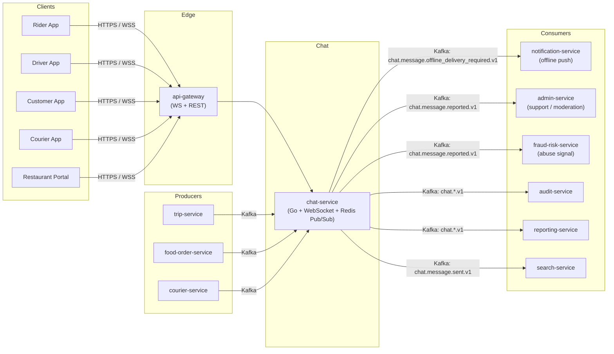
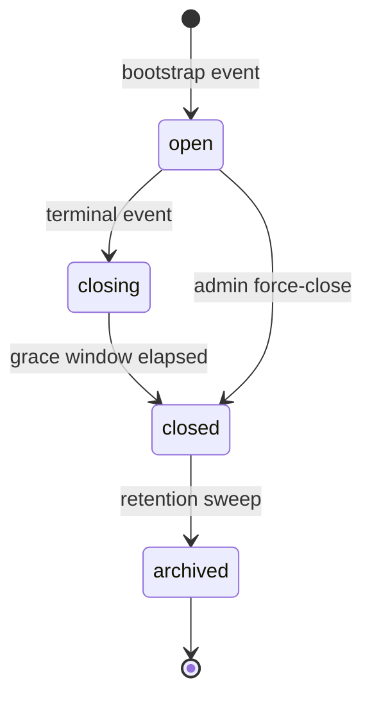
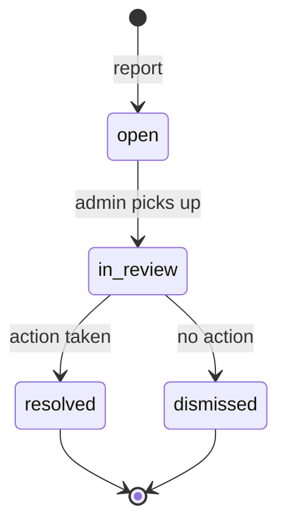

# chat-service — Software Requirements Specification

## 1. Introduction

This SRS specifies the functional, non-functional, security, and
operational requirements for `chat-service`. It is the engineering
contract for the service: the implementation must satisfy every MUST
requirement and SHOULD / MAY requirements are negotiated. The
business goals behind each requirement live in
[`BRD.md`](./BRD.md); the data model in [`ERD.md`](./ERD.md);
the inter-service contracts in [`INTEGRATION.md`](./INTEGRATION.md);
the operational workflows in [`WORKFLOWS.md`](./WORKFLOWS.md).

## 2. Scope

In scope:

- The `chat` PostgreSQL schema (threads, participants, messages,
  attachments, read states, moderation reports, blocked users,
  outbox, inbox).
- REST APIs under `/v1/chat/...`.
- WebSocket endpoint `WS /v1/chat/ws`.
- Event consumers for the bootstrap events (`ride.request.matched.v1`,
  `food.order.accepted.v1`, `delivery.courier.assigned.v1`) and the
  close events.
- Event producers: `chat.thread.created.v1`, `chat.thread.closed.v1`,
  `chat.message.sent.v1`, `chat.message.read.v1`,
  `chat.attachment.shared.v1`, `chat.message.reported.v1`,
  `chat.message.moderated.v1`,
  `chat.message.offline_delivery_required.v1`.
- Auto-generated system messages.
- Locale-aware system message rendering (`en`, `ar`, `fr`, `ur`).
- Admin / support moderation surface.

Out of scope:

- The file scanner — `file-service` runs ClamAV; chat-service waits
  for the visibility flag.
- The push channel — `notification-service`.
- The support-ticket lifecycle — `admin-service` (support module).
- The voice / phone-masking relay — `customer-service`.
- Marketing chat (e.g. a "chat with our concierge" experience) —
  `pricing-service` (promotion) or a future `support_chat` thread.

## 3. System Context

## 4. Actors

| Actor | Technical type | Capabilities |
|-------|----------------|--------------|
| Rider app | system | authenticated WebSocket; `POST /v1/chat/threads/{id}/messages` |
| Driver app | system | same |
| Customer app | system | same |
| Courier app | system | same |
| Restaurant back-office | system | same |
| `trip-service` | system | event producer of `trip.*.v1` |
| `food-order-service` | system | event producer of `food.order.*.v1` |
| `courier-service` | system | event producer of `delivery.*.v1` |
| `notification-service` | system | consumer of `chat.message.offline_delivery_required.v1` |
| `admin-service` (support) | system | consumer of `chat.message.reported.v1`; admin API |
| `fraud-risk-service` | system | consumer of `chat.message.reported.v1` |
| `audit-service` | system | consumer of every `chat.*.v1` |
| `reporting-service` | system | consumer of every `chat.*.v1` |
| `search-service` | system | consumer of `chat.message.sent.v1` (admin-only) |
| `configuration-service` | system | provider of `configuration.updated.v1` |
| Operations | human | admin surface (`/admin/v1/chat/...`) with `chat.admin` role |

## 5. Functional Requirements

### 5.1 Thread bootstrap

| ID | Requirement | Priority |
|----|-------------|----------|
| FR--001 | On `ride.request.matched.v1`, MUST create a `trip_chat` thread with participants `[rider, driver]`. Idempotent by `trip_id`. | MUST |
| FR--002 | On `food.order.accepted.v1`, MUST create a `food_order_chat` thread with participants `[customer, restaurant_staff]`. Idempotent by `order_id`. | MUST |
| FR--003 | On `delivery.courier.assigned.v1`, MUST create a `delivery_chat` thread with participants `[customer, courier]`. Idempotent by `delivery_id`. | MUST |
| FR--004 | On the terminal event (`trip.completed.v1` / `food.order.delivered.v1` / `delivery.completed.v1`), MUST close the thread (`state = closed`) and write a final system message. | MUST |
| FR--005 | On `trip.cancelled.v1` / `food.order.cancelled.v1` / `delivery.cancelled.v1`, MUST close the thread with the cancellation reason as a system message. | MUST |

### 5.2 Real-time message send

| ID | Requirement | Priority |
|----|-------------|----------|
| FR--010 | `POST /v1/chat/threads/{id}/messages` MUST accept `{ body: string, client_msg_id?: UUID }`. Body ≤ 4 000 chars. | MUST |
| FR--011 | MUST persist the message in `chat.messages` (encrypted at rest via `pgcrypto`) in the same transaction as the `chat.outbox` row. | MUST |
| FR--012 | MUST emit `chat.message.sent.v1` from the outbox dispatcher. | MUST |
| FR--013 | MUST publish to the `chat:thread:{thread_id}` Redis Pub/Sub channel for cross-replica WebSocket fan-out. | MUST |
| FR--014 | If the recipient is not on a connected WebSocket replica, MUST emit `chat.message.offline_delivery_required.v1` for `notification-service` to push. | MUST |
| FR--015 | Idempotency: if `client_msg_id` matches an existing message in the thread, return the original message and do not write a new row. | MUST |
| FR--016 | WebSocket inbound: `WS /v1/chat/ws?token=<jwt>` MUST accept `{ type: "send", thread_id, body, client_msg_id? }` frames and apply FR--010–FR--015. | MUST |
| FR--017 | WebSocket outbound: on `chat.message.sent.v1` or system-message creation, MUST push `{ type: "message", thread_id, message: { … } }` to every connected participant on a local replica. | MUST |
| FR--018 | WebSocket heartbeat: client MUST send a `ping` every 25 s; server MUST close the socket on 90 s of silence. | MUST |
| FR--019 | WebSocket origin check: server MUST reject the upgrade if `Origin` is not in `chat.websocket.allowed_origins`. | MUST |

### 5.3 Read state and typing

| ID | Requirement | Priority |
|----|-------------|----------|
| FR--020 | `POST /v1/chat/threads/{id}/messages/{msg_id}/read` MUST update `chat.read_states.last_read_message_id` for the calling participant. MUST emit `chat.message.read.v1`. | MUST |
| FR--021 | `POST /v1/chat/threads/{id}/typing` MUST publish to the `chat:typing:{thread_id}` Redis Pub/Sub channel (no persistence). | SHOULD |
| FR--022 | The WebSocket server MUST publish `{ type: "typing", thread_id, user_id }` to other participants within 200 ms p99. | SHOULD |

### 5.4 Attachments

| ID | Requirement | Priority |
|----|-------------|----------|
| FR--030 | `POST /v1/chat/threads/{id}/attachments` MUST accept `{ file_id: UUID, mime: string }` and register the attachment in `chat.message_attachments` (no bytes). | MUST |
| FR--031 | The attachment MUST remain `visibility = pending` until `file-service` reports `scan_status = clean`. | MUST |
| FR--032 | On `visibility = pending`, the recipient MUST NOT see the attachment; the sender sees "uploading…". | MUST |
| FR--033 | On scan success, MUST emit `chat.attachment.shared.v1` and update the message's `has_attachment` flag. | MUST |
| FR--034 | Default allowed MIME: `image/jpeg`, `image/png`, `image/webp`. Configurable via `chat.attachment.allowed_mime`. | SHOULD |
| FR--035 | Max attachment size: 25 MB by default. Configurable via `chat.attachment.max_bytes`. | SHOULD |

### 5.5 Reporting and moderation

| ID | Requirement | Priority |
|----|-------------|----------|
| FR--040 | `POST /v1/chat/threads/{id}/report` MUST accept `{ message_id: UUID, reason: enum, reason_text?: string }`. | MUST |
| FR--041 | `reason` ∈ {`abuse`, `safety`, `illegal`, `spam`, `other`}. | MUST |
| FR--042 | On report, MUST set `chat.messages.visibility = hidden` (recipient view), insert `chat.moderation_reports`, and emit `chat.message.reported.v1`. | MUST |
| FR--043 | If `reason ∈ {abuse, safety, illegal}`, MUST rely on `admin-service` (support) to open a support ticket (consumer of `chat.message.reported.v1`). | MUST |
| FR--044 | `admin-service` (admin role) MUST be able to call `POST /admin/v1/chat/threads/{id}/messages/{msg_id}/hide` or `/remove` to set `visibility = removed`. | MUST |
| FR--045 | A removed message persists in `chat.messages` (immutable) but the recipient and sender see `[message removed]`. | MUST |

### 5.6 Block

| ID | Requirement | Priority |
|----|-------------|----------|
| FR--050 | `POST /v1/chat/users/{user_id}/block` MUST insert into `chat.blocked_users` and emit `chat.user.blocked.v1`. | SHOULD |
| FR--051 | On a thread bootstrap (FR--001–FR--003), if the prospective participant is in the blocker's `chat.blocked_users`, MUST skip the thread creation (and log a `chat.thread.bootstrap_skipped.v1`). | MUST |
| FR--052 | A block is symmetric for the blocked user: the blocked user MAY also block back; the relationship is per-pair. | SHOULD |

### 5.7 System messages

| ID | Requirement | Priority |
|----|-------------|----------|
| FR--060 | MUST consume the state-transition events listed in the README 11 and write the corresponding system message in the thread. | MUST |
| FR--061 | System messages MUST have `sender_kind = system`, `sender_id = NULL`, and a `system_message_key` (e.g. `driver_arrived`). | MUST |
| FR--062 | System messages MUST render in the recipient's locale (default `en`). Locale resolver = `chat.system_message.locale` + the recipient's profile. | SHOULD |

### 5.8 Admin / support surface

| ID | Requirement | Priority |
|----|-------------|----------|
| FR--070 | `GET /admin/v1/chat/threads/{id}` MUST return the thread + participants + last 200 messages, with full PII visible. Requires `chat.admin` or `platform.support` with `X-Audit-Reason`. | MUST |
| FR--071 | `POST /admin/v1/chat/threads/{id}/close` MUST set `state = closed`; admin only; emits `chat.thread.closed.v1` with `reason = admin_force_close`. | MUST |
| FR--072 | `POST /admin/v1/chat/users/{user_id}/mute` MUST prevent the user from sending messages for `chat.mute.duration_seconds` (default 86400 = 24h). | MUST |
| FR--073 | `POST /admin/v1/chat/users/{user_id}/ban` MUST prevent the user from sending messages or being added to new threads; the ban is permanent until `DELETE /admin/v1/chat/users/{user_id}/ban`. | MUST |
| FR--074 | `GET /admin/v1/chat/reports` MUST list `chat.moderation_reports` filterable by `reason`, `status`, `thread_id`, `reporter_id`. | SHOULD |

### 5.9 Data-subject deletion (GDPR)

| ID | Requirement | Priority |
|----|-------------|----------|
| FR--080 | On a data-subject deletion request for `user_id`, MUST hard-update every `chat.messages.body` where the user is sender to `'[deleted by request]'` within 30 days. | MUST |
| FR--081 | The message metadata (sender_id, thread_id, created_at) remains in the audit chain. | MUST |
| FR--082 | The `chat.moderation_reports.reporter_id` and the participant rows are retained for the immutable audit chain but the PII (display name, locale) is scrubbed. | MUST |

## 6. Non-Functional Requirements

| ID | Category | Requirement | Target |
|----|----------|-------------|--------|
| NFR--001 | performance | `POST /v1/chat/threads/{id}/messages` p99 latency (online recipient) | ≤ 200 ms |
| NFR--002 | performance | `chat.message.offline_delivery_required.v1` → push delivery p99 | ≤ 1500 ms |
| NFR--003 | performance | `GET /v1/chat/threads/{id}/messages?cursor=…` p99 | ≤ 150 ms |
| NFR--004 | availability | uptime | 99.95% |
| NFR--005 | scalability | concurrent WebSocket connections per replica | ≥ 5 000 |
| NFR--006 | scalability | total concurrent WebSocket connections per region | ≥ 200 000 |
| NFR--007 | scalability | messages per second sustained (online) | ≥ 20 000 / region |
| NFR--008 | maintainability | MTTR | ≤ 30 min |
| NFR--009 | durability | zero message loss between accepted write and recipient delivery (online or offline) | 100% (acknowledged write ⇒ eventual delivery) |
| NFR--010 | durability | RPO | ≤ 60 s (Kafka retention 7 days) |
| NFR--011 | durability | RTO | ≤ 15 min |
| NFR--012 | observability | OpenTelemetry sampling on success | 10% (errors 100%) |

## 7. API Requirements

The full request / response / error contracts are in
[`INTEGRATION.md`](./INTEGRATION.md). Summary:

- `GET /v1/chat/threads` — list the caller's threads.
- `GET /v1/chat/threads/{id}` — read a thread.
- `GET /v1/chat/threads/{id}/messages` — paginated history.
- `POST /v1/chat/threads/{id}/messages` — send a message.
- `POST /v1/chat/threads/{id}/messages/{msg_id}/read` — mark read.
- `POST /v1/chat/threads/{id}/typing` — typing heartbeat.
- `POST /v1/chat/threads/{id}/attachments` — register attachment.
- `POST /v1/chat/threads/{id}/report` — report a message.
- `POST /v1/chat/users/{user_id}/block` — block a user.
- `DELETE /v1/chat/users/{user_id}/block` — unblock.
- `GET /v1/chat/users/{user_id}/blocked` — list blocked.
- `POST /v1/chat/threads/{id}/close` — force-close (admin).
- `WS /v1/chat/ws?token=...` — bidirectional.

(Admin: `/admin/v1/chat/...` for moderation; full list in
[`INTEGRATION.md`](./INTEGRATION.md) 5.)

## 8. Data Requirements

| ID | Requirement | Notes |
|----|-------------|-------|
| DATA--001 | All mutable tables have `created_at`, `updated_at`, `created_by`, `updated_by`. | Per platform convention |
| DATA--002 | `chat.messages.body` is encrypted at rest via `pgcrypto`. | NFR--006, GDPR |
| DATA--003 | `chat.messages` is range-partitioned by `created_at` (monthly). | Scalability |
| DATA--004 | `chat.threads.context_id` is UNIQUE per `kind` (`trip_chat`, `food_order_chat`, `delivery_chat`) so the bootstrap event is idempotent. | NFR--009 |
| DATA--005 | Cross-service IDs (e.g. `trip_id`, `order_id`, `delivery_id`) are stored as UUID columns WITHOUT database FKs. | Per platform convention |
| DATA--006 | No two participants may share the same `(thread_id, user_id)` in `chat.participants`. | UNIQUE constraint |
| DATA--007 | Message `body` length ≤ 4 000 characters; enforced by CHECK. | FR--010 |
| DATA--008 | The `chat.threads.state` column has CHECK `state IN ('open', 'closing', 'closed', 'archived')`. | State machine |

## 9. Validation Rules

- A message can be sent only if the thread is `open`.
- A message can be sent only by a participant of the thread.
- A thread is read-only when `state IN ('closing', 'closed', 'archived')`.
- A reported message is hidden from the recipient (visibility = `hidden`); the message is still in `chat.messages`.
- A user can block any other user (no self-block).
- An attachment `mime` MUST be in `chat.attachment.allowed_mime`.
- An attachment `file_id` MUST exist in `file-service` (`200 OK GET /v1/files/{file_id}`).

## 10. State Transitions

- `chat.threads.state`: `open → closing → closed → archived`. The
  `closing` transition is initiated when the terminal event arrives;
  `closed` is set after the 1-hour grace window
  (`BR--037`); `archived` is set by the retention sweep.

- `chat.moderation_reports.status`: `open → in_review → resolved | dismissed`.

## 11. Authorization Requirements

- All `/v1/chat/threads/{id}/...` endpoints require the caller to be
  a participant of the thread; otherwise `403 FORBIDDEN_NOT_PARTICIPANT`.
- `POST /v1/chat/threads/{id}/messages` additionally rejects if the
  caller is `muted` or `banned`.
- `POST /v1/chat/users/{user_id}/block` requires `user_id == sub` of the JWT.
- `POST /v1/chat/threads/{id}/close` requires the system token (service-account).
- All `/admin/v1/chat/...` endpoints require `chat.admin` or `platform.support` with `X-Audit-Reason`.

## 12. Configuration Requirements

See [`README.md`](./README.md) 13.

## 13. Error Handling

| Error | Status | Code | Trigger |
|-------|--------|------|---------|
| `INVALID_BODY` | 400 | `VALIDATION_FAILED` | `body` empty / > 4 000 chars |
| `INVALID_MIME` | 400 | `VALIDATION_FAILED` | attachment `mime` not in allow-list |
| `THREAD_NOT_FOUND` | 404 | `THREAD_NOT_FOUND` | thread does not exist |
| `NOT_PARTICIPANT` | 403 | `FORBIDDEN_NOT_PARTICIPANT` | caller is not a participant |
| `THREAD_CLOSED` | 409 | `THREAD_CLOSED` | thread `state != open` |
| `MUTED` | 403 | `MUTED` | caller is muted |
| `BANNED` | 403 | `BANNED` | caller is banned |
| `RATE_LIMITED` | 429 | `RATE_LIMITED` | per-user or per-thread limit |
| `FILE_SCAN_FAILED` | 422 | `ATTACHMENT_SCAN_FAILED` | file-service reports failed scan |
| `BLOCKED` | 403 | `PARTICIPANT_BLOCKED` | sender is blocked by the recipient |
| `FORBIDDEN_ORIGIN` | 4403 (WS) | — | WebSocket origin mismatch |

## 14. Concurrency Requirements

- A participant MAY have multiple WebSocket connections (e.g. mobile
  + web); the server deduplicates fan-out (only one delivery per
  device, identified by `device_id` in the WebSocket handshake).
- A thread's participant list is frozen at creation; no late-join in v1.
- Two senders MAY write concurrently to the same thread; PostgreSQL
  row-level lock on the thread row enforces serialization of writes.
- The `chat.outbox` dispatcher is single-writer per replica; the
  Kafka topic `chat.outbox.dispatcher.id` ensures only one replica
  per partition dispatches.

## 15. Idempotency Requirements

- `client_msg_id` deduplicates duplicate sends.
- Thread bootstrap is idempotent by `context_id` (UNIQUE).
- WebSocket reconnection is idempotent — the server replays the
  last unacknowledged message(s) using the `last_message_id` the
  client sends in the first frame.

## 16. Performance

- Dominant path: `POST /v1/chat/threads/{id}/messages`.
- P50 / P95 / P99 targets: 25 ms / 80 ms / 200 ms.

## 17. Scalability

- Horizontal: 6 replicas default; HPA on `chat_websocket_connections`
  and CPU.
- Vertical: 1.5 CPU / 1.5 GB memory limits per replica.

## 18. Availability

- SLO: 99.95%.
- Error budget per 30 days: ~21 min.
- Maintenance window: weekly Sunday 04:00–06:00 UTC.

## 19. Security

| ID | Requirement | Notes |
|----|-------------|-------|
| SEC--001 | All `/v1/chat/...` endpoints validate the JWT (Keycloak) at the gateway. | Per platform |
| SEC--002 | WebSocket connections authenticate with the JWT in `?token=<jwt>`. | FR--016 |
| SEC--003 | The WebSocket upgrade rejects `Origin` not in the allow-list. | FR--019 |
| SEC--004 | All admin actions require `chat.admin` + `X-Audit-Reason`; the reason is recorded in the audit chain. | FR--070–074 |
| SEC--005 | All message bodies are encrypted at rest via `pgcrypto`. | DATA--002 |
| SEC--006 | The payload MUST NOT contain raw phone numbers or email addresses. | BR--011 |
| SEC--007 | Profanity filter enabled by default; bypassable word list managed by admin. | BR config |
| SEC--008 | Rate limit per user and per thread; spam detection. | FR (5.2), NFR |
| SEC--009 | Block list (`chat.blocked_users`) prevents thread bootstrap. | FR--050–052 |
| SEC--010 | All `chat.*.v1` events pass through the immutable audit chain. | BR--028 |

## 20. Privacy

- PII stored: `chat.messages.body` (encrypted), `chat.participants.display_name`, `chat.participants.locale`.
- Retention: `chat.retention.days.{thread_kind}` (default 30d after thread close); `support_chat` will be 7y.
- Erasure: GDPR data-subject deletion hard-deletes message bodies within 30 days; metadata retained in audit.

## 21. Auditability

- `chat.thread.created.v1`, `chat.thread.closed.v1`, `chat.message.sent.v1`, `chat.message.read.v1`, `chat.attachment.shared.v1`, `chat.message.reported.v1`, `chat.message.moderated.v1`, `chat.message.offline_delivery_required.v1`, `chat.user.blocked.v1`, `chat.user.muted.v1`, `chat.user.banned.v1` are all consumed by `audit-service` for the immutable chain.

## 22. Observability

See [`README.md`](./README.md) 15.

## 23. Maintainability

- Code style: standard Go (`gofmt`, `golangci-lint v1.62+`).
- Test coverage target: 80% line coverage on the `internal/` packages.
- Documentation: this file + the per-sibling docs.

## 24. Disaster Recovery

- RPO: ≤ 60 s (Kafka retention 7 days).
- RTO: ≤ 15 min.

## 25. Acceptance Criteria

- See [`BRD.md`](./BRD.md) 16.