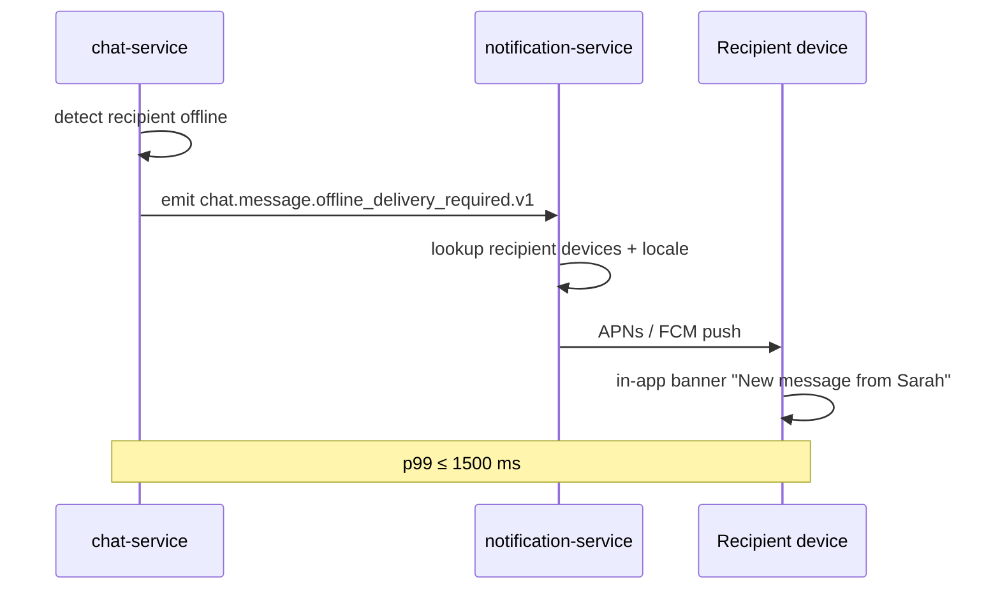
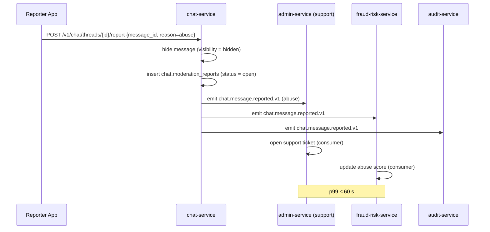
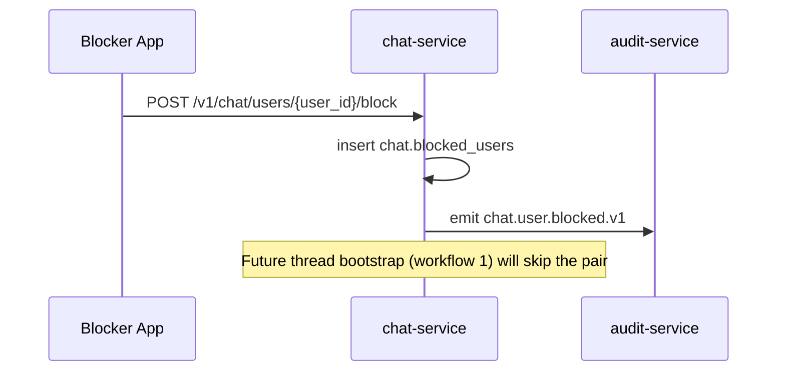
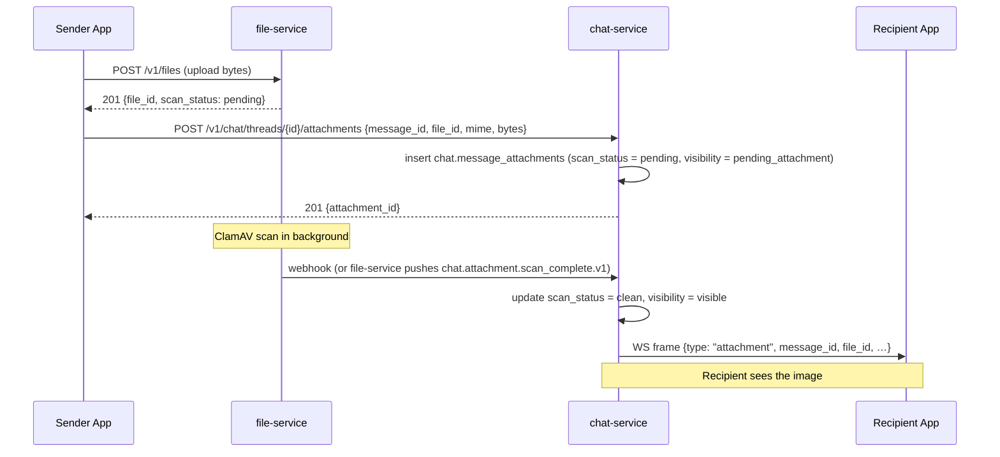
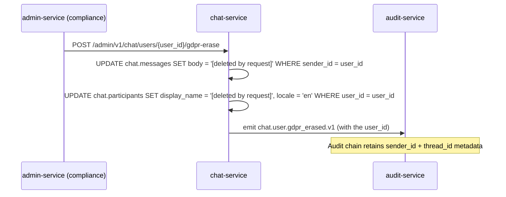

# chat-service — Workflows

> **Phase 7.7 v1.** All workflows below assume the v1 thread kinds:
> `trip_chat`, `food_order_chat`, `delivery_chat`. `support_chat`
> and `merchant_chat` are reserved for v2.

## 1. Thread Bootstrap on Service-Context Start

### 1.1 Objective

Create a chat thread for a freshly-matched service context (trip,
food order, delivery) with the right participants, before any user
tries to chat.

### 1.2 Initiating Actor

The upstream service (`trip-service`, `food-order-service`,
`courier-service`) emits the bootstrap event.

### 1.3 Participating Services

`trip-service` / `food-order-service` / `courier-service` →
`chat-service` → `notification-service`, `audit-service`,
`reporting-service`.

### 1.4 Prerequisites

- The upstream aggregate (`trip`, `food_order`, `delivery`) is in
  its matched / accepted / assigned state.
- The bootstrap event was emitted.

### 1.5 Happy Path

```mermaid
sequenceDiagram
    participant Trip as trip-service
    participant Chat as chat-service
    participant CS as customer-service / driver-service / courier-service / restaurant-service
    participant Notif as notification-service
    participant Aud as audit-service

    Trip->>Chat: ride.request.matched.v1 {trip_id, rider_id, driver_id}
    Chat->>Chat: dedup on (kind=trip_chat, context_id=trip_id)
    Chat->>CS: GET /v1/customers/{rider_id}, /v1/drivers/{driver_id}
    CS-->>Chat: {display_name, locale}
    Chat->>Chat: insert thread + 2 participants
    Chat->>Notif: emit chat.thread.created.v1 (in-app banner)
    Chat->>Aud: emit chat.thread.created.v1 (audit chain)
    Note over Chat: trip_chat thread open; rider + driver can chat
```

The same shape applies to `food_order_chat` and `delivery_chat`
with the corresponding bootstrap event and source services.

### 1.6 Alternate Paths

- **Blocker found**: if `rider_id` blocks `driver_id` (or vice
  versa) — chat-service skips the bootstrap, logs
  `chat.thread.bootstrap_skipped.v1`, and emits nothing.
- **Participant profile not found**: chat-service logs WARN and
  creates the thread with `display_name = "User"` and
  `locale = "en"`; the admin can fix later. The thread still
  opens.

### 1.7 Failure Paths

- **`customer-service` / `driver-service` unreachable**: chat-service
  retries 2x; on persistent failure it still creates the thread
  with `display_name = "User"` and emits
  `chat.thread.bootstrap_degraded.v1`.
- **Database write fails**: the event is retried (inbox); if it
  fails 3 times, the event goes to DLQ. A `reporting-service`
  reconciliation job surfaces trips without a chat thread (alert).

### 1.8 Business Rules

- BR--010, BR--011, BR--024, BR--030, BR--031, BR--032, BR--034.

### 1.9 State Transitions

`chat.threads.state`: `* → open` (initial).

### 1.10 Events

| Event | Direction | When |
|-------|-----------|------|
| `ride.request.matched.v1` | consumed | bootstrap |
| `food.order.accepted.v1` | consumed | bootstrap |
| `delivery.courier.assigned.v1` | consumed | bootstrap |
| `chat.thread.created.v1` | produced | thread created |

### 1.11 APIs Involved

| API | Direction | When |
|-----|-----------|------|
| `GET /v1/customers/{id}` (or driver / courier / restaurant) | outbound | resolve participant profile |
| `POST /v1/chat/threads/{id}/messages` | inbound | after bootstrap |

### 1.12 Compensation / Rollback

If the thread bootstrap fails after the underlying service context
has begun, the participants can still proceed with their context
(ride, order, delivery) but without chat. The reconciliation job
surfaces the missing thread; an admin or operator can re-trigger
the bootstrap by replaying the original event from the inbox DLQ.

### 1.13 Final State

`chat.threads.state = open` with `participant_count = 2` and
`last_message_at = NULL`.

---

## 2. Real-Time Message Send (Online Recipient)

### 2.1 Objective

Send a message from the sender to an online recipient with p99
≤ 200 ms.

### 2.2 Initiating Actor

The sender (rider / driver / customer / courier / restaurant_staff)
sends via the in-app chat surface.

### 2.3 Participating Services

`chat-service` (WebSocket fan-out via Redis Pub/Sub).

### 2.4 Prerequisites

- The sender is authenticated.
- The thread is `state = open`.
- The sender is a participant and not muted / banned.

### 2.5 Happy Path

```mermaid
sequenceDiagram
    participant App as Sender App
    participant Chat as chat-service
    participant DB as PostgreSQL
    participant RP as Redis Pub/Sub
    participant Rec as Recipient App (WS)

    App->>Chat: POST /v1/chat/threads/{id}/messages {body, client_msg_id}
    Chat->>Chat: validate (rate limit, mute, ban)
    Chat->>DB: BEGIN; dedup on (thread_id, client_msg_id)
    Chat->>DB: INSERT chat.messages; INSERT chat.outbox
    Chat->>DB: COMMIT
    Chat-->>App: 201 {message}
    Chat->>RP: PUBLISH chat:thread:{id} {message_id, body, sender_id, …}
    RP-->>Chat: subscriber fan-out
    Chat->>Rec: WS frame {type: "message", message: {…}}
    Note over Chat,Rec: p99 ≤ 200 ms
    par Outbox dispatcher
        Chat->>Chat: outbox dispatcher reads row
        Chat->>Chat: emit chat.message.sent.v1 to Kafka
    end
```

### 2.6 Alternate Paths

- **Idempotent replay (same `client_msg_id`)**: returns the original
  message; no new row, no new fan-out.
- **Recipient not on local replica**: chat-service emits
  `chat.message.offline_delivery_required.v1` → push (see
  workflow 3).

### 2.7 Failure Paths

- **Rate-limited**: `429 RATE_LIMITED`; the sender UI surfaces
  "slow down".
- **DB write fails**: `500 INTERNAL_ERROR`; the sender UI surfaces
  "could not send, retry". The sender's `client_msg_id` allows
  retry without dupe.
- **Redis Pub/Sub down**: chat-service still persists the message
  and emits `chat.message.offline_delivery_required.v1` (treating
  it as an offline delivery). Alert on
  `chat_websocket_connections` drop.

### 2.8 Business Rules

- BR--003, BR--004, BR--012, BR--014, BR--028.

### 2.9 State Transitions

`chat.messages.visibility` stays `visible`.

### 2.10 Events

| Event | Direction | When |
|-------|-----------|------|
| `chat.message.sent.v1` | produced | every accepted send |

### 2.11 APIs Involved

| API | Direction | When |
|-----|-----------|------|
| `POST /v1/chat/threads/{id}/messages` | inbound | send |
| `WS /v1/chat/ws` | inbound | send |
| `WS /v1/chat/ws` | outbound | fan-out |

### 2.12 Compensation / Rollback

A send is committed-on-accept. If fan-out fails, the outbox
dispatcher retries; eventually offline delivery takes over. There
is no explicit compensation; the guarantee is **eventual delivery**.

### 2.13 Final State

`chat.messages` has the new row; the recipient has received the
WS frame or the push.

---

## 3. Offline Fallback (Push via `notification-service`)

### 3.1 Objective

When the recipient is offline, deliver the message via push within
1.5 s p99.

### 3.2 Initiating Actor

`chat-service` detects that no local replica has the recipient
on a WebSocket.

### 3.3 Participating Services

`chat-service` → `notification-service` (consumer of
`chat.message.offline_delivery_required.v1`) → APNs / FCM.

### 3.4 Prerequisites

- The recipient has at least one device registered with
  `notification-service` (which they must, to receive any
  push).
- The recipient is not in their quiet hours (unless `urgency = urgent`).

### 3.5 Happy Path



### 3.6 Alternate Paths

- **Recipient has multiple devices**: `notification-service` fans
  out to all.
- **Recipient in quiet hours** (and `urgency = normal`): push is
  deferred to the next allowed window; an in-app banner is shown
  next time the recipient opens the app.
- **`urgency = urgent`**: push bypasses quiet hours (e.g. SOS-related).

### 3.7 Failure Paths

- **`notification-service` down**: chat-service retries via the
  outbox; if it fails, the message is still persisted and will
  appear in the in-app banner next time the recipient opens the
  app.
- **Recipient has no devices**: no push; the message appears in
  the in-app banner next session.

### 3.8 Business Rules

- BR--004, BR--013, BR--021.

### 3.9 State Transitions

None.

### 3.10 Events

| Event | Direction | When |
|-------|-----------|------|
| `chat.message.offline_delivery_required.v1` | produced | recipient offline |

### 3.11 APIs Involved

None direct (event-driven).

### 3.12 Compensation / Rollback

If `notification-service` does not acknowledge within the retry
budget, the outbox keeps retrying. There is no compensation.

### 3.13 Final State

The recipient sees the message on next session or via push.

---

## 4. Thread Close on Service-Context End

### 4.1 Objective

Close the chat thread when the underlying service context reaches
its terminal state (`completed` or `cancelled`).

### 4.2 Initiating Actor

`trip-service` / `food-order-service` / `courier-service` emits
the terminal event.

### 4.3 Participating Services

`trip-service` / `food-order-service` / `courier-service` →
`chat-service` → `notification-service`, `audit-service`,
`reporting-service`.

### 4.4 Prerequisites

- The thread is `state = open`.

### 4.5 Happy Path

```mermaid
sequenceDiagram
    participant Trip as trip-service
    participant Chat as chat-service
    participant Notif as notification-service
    participant Aud as audit-service

    Trip->>Chat: trip.completed.v1 {trip_id, total_minor, currency}
    Chat->>Chat: lookup thread by (kind=trip_chat, context_id=trip_id)
    Chat->>Chat: write system message "trip complete" with args
    Chat->>Chat: set state = 'closing'; closed_at = now()
    Chat->>Notif: emit chat.thread.closed.v1
    Chat->>Aud: emit chat.thread.closed.v1
    Note over Chat: After 1h grace window (BR--037)
    Chat->>Chat: set state = 'closed'
    Chat->>Chat: schedule retention sweep at retention_until
```

### 4.6 Alternate Paths

- **Thread already closed** (e.g. duplicate event): chat-service
  drops the duplicate (inbox dedup).

### 4.7 Failure Paths

- **Thread not found**: chat-service logs WARN; emits
  `chat.thread.close_skipped.v1`; no retry. A reconciliation job
  surfaces `closed aggregates without a closed thread`.

### 4.8 Business Rules

- BR--015, BR--037.

### 4.9 State Transitions

`chat.threads.state`: `open → closing → closed → archived`.

### 4.10 Events

| Event | Direction | When |
|-------|-----------|------|
| `trip.completed.v1` / `food.order.delivered.v1` / `delivery.completed.v1` | consumed | close |
| `chat.thread.closed.v1` | produced | close |

### 4.11 APIs Involved

None direct.

### 4.12 Compensation / Rollback

None — closing is a one-way transition.

### 4.13 Final State

`chat.threads.state = closed` after the grace window; `archived`
after the retention sweep.

---

## 5. Report and Moderation

### 5.1 Objective

A participant reports a message; the message is hidden from both
parties; a support ticket opens if the reason warrants it; the
fraud-risk score is updated.

### 5.2 Initiating Actor

The reporter (rider / driver / customer / courier / restaurant_staff)
hits "report" on a message.

### 5.3 Participating Services

`chat-service` → `admin-service` (support), `fraud-risk-service`,
`audit-service`.

### 5.4 Prerequisites

- The reporter is a participant of the thread.
- The message exists.

### 5.5 Happy Path



### 5.6 Alternate Paths

- **`reason = spam` / `reason = other`**: no support ticket
  opened automatically; the report sits in `chat.moderation_reports`
  for admin review.

### 5.7 Failure Paths

- **Report insert fails**: `500 INTERNAL_ERROR`; the reporter can
  retry with the same `Idempotency-Key`.

### 5.8 Business Rules

- BR--006, BR--017, BR--018.

### 5.9 State Transitions

`chat.messages.visibility`: `visible → hidden`.
`chat.moderation_reports.status`: `* → open → in_review → resolved | dismissed`.

### 5.10 Events

| Event | Direction | When |
|-------|-----------|------|
| `chat.message.reported.v1` | produced | every report |
| `chat.message.moderated.v1` | produced | admin hide / remove |

### 5.11 APIs Involved

| API | Direction | When |
|-----|-----------|------|
| `POST /v1/chat/threads/{id}/report` | inbound | report |
| `POST /admin/v1/chat/threads/{id}/messages/{msg_id}/hide` | admin | hide |
| `POST /admin/v1/chat/threads/{id}/messages/{msg_id}/remove` | admin | remove |

### 5.12 Compensation / Rollback

Admin can `POST /admin/v1/chat/threads/{id}/messages/{msg_id}/unhide`
to restore visibility (logged in the audit chain).

### 5.13 Final State

The message is hidden; the support ticket is open; the abuse score
is updated.

---

## 6. Block

### 6.1 Objective

A user blocks another user; no future thread will include both.

### 6.2 Initiating Actor

The blocker (any participant).

### 6.3 Participating Services

`chat-service`.

### 6.4 Prerequisites

- The blocker is authenticated.
- The blocked is a different user.

### 6.5 Happy Path



### 6.6 Alternate Paths

- **Existing thread contains both**: the existing thread is not
  closed; a system message "[participant left]" is appended.
  Future messages from the blocked user return
  `403 PARTICIPANT_BLOCKED`.

### 6.7 Failure Paths

- **Self-block**: `400 VALIDATION_FAILED`.
- **Blocker blocks blocked multiple times**: idempotent (UNIQUE).

### 6.8 Business Rules

- BR--020, BR--034.

### 6.9 State Transitions

None directly; the block takes effect on future bootstrap.

### 6.10 Events

| Event | Direction | When |
|-------|-----------|------|
| `chat.user.blocked.v1` | produced | every block |

### 6.11 APIs Involved

| API | Direction | When |
|-----|-----------|------|
| `POST /v1/chat/users/{user_id}/block` | inbound | block |

### 6.12 Compensation / Rollback

`DELETE /v1/chat/users/{user_id}/block` reverses the block.

### 6.13 Final State

`chat.blocked_users` has the row.

---

## 7. Attachment Upload

### 7.1 Objective

Attach an image to a message; the recipient sees the image only
after `file-service` confirms the scan is clean.

### 7.2 Initiating Actor

The sender.

### 7.3 Participating Services

`chat-service`, `file-service`.

### 7.4 Prerequisites

- The sender is a participant of the thread.
- The thread is `state = open`.

### 7.5 Happy Path



### 7.6 Alternate Paths

- **Scan fails (infected)**: `scan_status = infected`,
  `visibility = hidden`; the message remains visible (text only).
- **Scan fails (error)**: `scan_status = failed`,
  `visibility = hidden`; sender sees "scan failed, please retry".

### 7.7 Failure Paths

- **MIME not in allow-list**: `400 INVALID_MIME`.
- **`file-service` unreachable**: `502 BAD_GATEWAY`; sender retries.

### 7.8 Business Rules

- BR--009, BR--019, BR--038.

### 7.9 State Transitions

`chat.message_attachments.scan_status`: `pending → clean | infected | failed`.

### 7.10 Events

| Event | Direction | When |
|-------|-----------|------|
| `chat.attachment.shared.v1` | produced | scan clean |

### 7.11 APIs Involved

| API | Direction | When |
|-----|-----------|------|
| `POST /v1/files` | outbound (file-service) | upload bytes |
| `POST /v1/chat/threads/{id}/attachments` | inbound | register |

### 7.12 Compensation / Rollback

Sender can delete the message (which cascades to the attachment
metadata; the bytes in `file-service` are tombstoned by `file-service`'s
own retention).

### 7.13 Final State

The recipient sees the image; the audit chain has the attachment
event.

---

## 8. GDPR Data-Subject Deletion

### 8.1 Objective

Hard-delete all message bodies for a user; the audit chain
retains metadata.

### 8.2 Initiating Actor

`admin-service` (compliance module) initiates the deletion via
the chat-service admin API.

### 8.3 Participating Services

`chat-service`, `audit-service`.

### 8.4 Prerequisites

- The user has a verified GDPR deletion request.

### 8.5 Happy Path



### 8.6 Alternate Paths

- **Deletable in batch**: a nightly batch job processes pending
  deletion requests; the admin endpoint can also be triggered
  immediately.

### 8.7 Failure Paths

- **DB lock contention**: the job retries.

### 8.8 Business Rules

- BR--027.

### 8.9 State Transitions

`chat.messages.body`: `<text> → '[deleted by request]'`.

### 8.10 Events

| Event | Direction | When |
|-------|-----------|------|
| `chat.user.gdpr_erased.v1` | produced | deletion complete |

### 8.11 APIs Involved

| API | Direction | When |
|-----|-----------|------|
| `POST /admin/v1/chat/users/{user_id}/gdpr-erase` | admin | trigger |

### 8.12 Compensation / Rollback

None — deletion is one-way per GDPR.

### 8.13 Final State

Message bodies are redacted; metadata is retained in the audit chain.