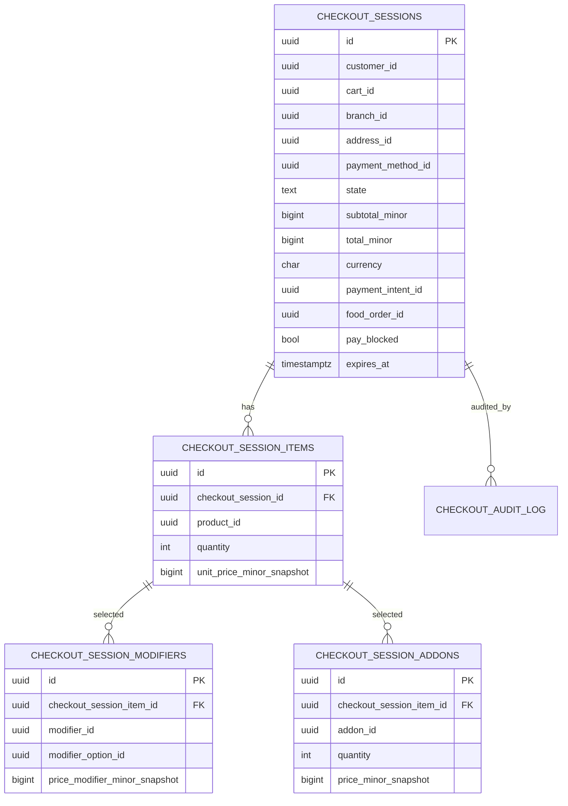

# checkout-service — Entity-Relationship Diagram

## 1. Database

- Engine: **PostgreSQL 18**.
- Schema: `checkout` (owned exclusively by this service).
- Migrations: `services/checkout-service/prisma/migrations/`.

## 2. Cross-Service References

| Column | Type | Refers to | Source of truth |
|--------|------|-----------|------------------|
| `checkout_sessions.customer_id` | UUID | Customer | `customer-service` |
| `checkout_sessions.cart_id` | UUID | Cart | `cart-service` |
| `checkout_sessions.address_id` | UUID | Saved address | `address-service` |
| `checkout_sessions.payment_method_id` | UUID | Payment method | `payment-service` |
| `checkout_sessions.payment_intent_id` | UUID | Payment intent | `payment-service` |
| `checkout_sessions.food_order_id` | UUID | Food order | `food-order-service` |
| `checkout_sessions.branch_id` | UUID | Branch | `branch-service` |
| `checkout_sessions.restaurant_id` | UUID | Restaurant | `restaurant-service` |
| `checkout_session_items.product_id` | UUID | Product | `menu-service` |

All cross-service references are stored as columns **without**
database-level foreign keys.

## 3. Entities

### `checkout_sessions`

A checkout session.

#### Columns

| Column | Type | Constraints | Notes |
|--------|------|-------------|-------|
| `id` | UUID | PK | UUIDv7 |
| `customer_id` | UUID | NOT NULL | cross-service ref |
| `cart_id` | UUID | NOT NULL | cross-service ref |
| `branch_id` | UUID | NOT NULL | cross-service ref |
| `restaurant_id` | UUID | NOT NULL | cross-service ref |
| `address_id` | UUID | NOT NULL | cross-service ref |
| `slot_start_at` | TIMESTAMPTZ | NOT NULL | |
| `slot_end_at` | TIMESTAMPTZ | NOT NULL | |
| `payment_method_id` | UUID | NOT NULL | cross-service ref |
| `state` | TEXT | NOT NULL DEFAULT 'pending' CHECK in (...) | lifecycle |
| `subtotal_minor` | BIGINT | NOT NULL CHECK (subtotal_minor >= 0) | frozen |
| `tax_minor` | BIGINT | NOT NULL CHECK (tax_minor >= 0) | frozen |
| `delivery_fee_minor` | BIGINT | NOT NULL CHECK (delivery_fee_minor >= 0) | frozen |
| `tip_minor` | BIGINT | NOT NULL DEFAULT 0 CHECK (tip_minor >= 0) | |
| `total_minor` | BIGINT | NOT NULL CHECK (total_minor >= 0) | frozen |
| `currency` | CHAR(3) | NOT NULL CHECK (currency ~ '^[A-Z]{3}$') | |
| `promotion_code` | TEXT | NULL | applied |
| `promotion_discount_minor` | BIGINT | NOT NULL DEFAULT 0 | |
| `payment_intent_id` | UUID | NULL | set on auth |
| `food_order_id` | UUID | NULL | set on success |
| `pay_blocked` | BOOLEAN | NOT NULL DEFAULT false | set on `restaurant.offline.v1` |
| `pay_block_reason` | TEXT | NULL | |
| `failure_reason_code` | TEXT | NULL | |
| `failure_reason_text` | TEXT | NULL | |
| `pay_idempotency_key` | UUID | NOT NULL UNIQUE | `checkout:{id}:pay` |
| `order_idempotency_key` | UUID | NOT NULL UNIQUE | `checkout:{id}:order` |
| `expires_at` | TIMESTAMPTZ | NOT NULL | TTL |
| `last_activity_at` | TIMESTAMPTZ | NOT NULL DEFAULT now() | |
| `created_at` | TIMESTAMPTZ | NOT NULL DEFAULT now() | |
| `updated_at` | TIMESTAMPTZ | NOT NULL DEFAULT now() | |

#### Indexes

- PK on `id`.
- UNIQUE on `pay_idempotency_key`.
- UNIQUE on `order_idempotency_key`.
- Index on `(customer_id, state)`.
- Partial index on `(expires_at) WHERE state = 'pending'` —
  expiration cron hot path.

### `checkout_session_items`

Snapshot of cart items at session creation.

#### Columns

| Column | Type | Constraints | Notes |
|--------|------|-------------|-------|
| `id` | UUID | PK | UUIDv7 |
| `checkout_session_id` | UUID | NOT NULL, FK to `checkout_sessions.id` | |
| `product_id` | UUID | NOT NULL | cross-service ref |
| `product_name_snapshot` | TEXT | NOT NULL | |
| `quantity` | INTEGER | NOT NULL CHECK (quantity > 0) | |
| `unit_price_minor_snapshot` | BIGINT | NOT NULL | |
| `currency` | CHAR(3) | NOT NULL | |
| `special_instructions` | TEXT | NULL | |
| `created_at` | TIMESTAMPTZ | NOT NULL DEFAULT now() | |

#### Indexes

- PK on `id`.
- Index on `(checkout_session_id)`.

### `checkout_session_modifiers`

Snapshot of modifier selections.

#### Columns

| Column | Type | Constraints | Notes |
|--------|------|-------------|-------|
| `id` | UUID | PK | UUIDv7 |
| `checkout_session_item_id` | UUID | NOT NULL, FK to `checkout_session_items.id` | |
| `modifier_id` | UUID | NOT NULL | cross-service ref |
| `modifier_option_id` | UUID | NOT NULL | cross-service ref |
| `name_snapshot` | TEXT | NOT NULL | |
| `price_modifier_minor_snapshot` | BIGINT | NOT NULL DEFAULT 0 | |
| `currency` | CHAR(3) | NOT NULL | |
| `created_at` | TIMESTAMPTZ | NOT NULL DEFAULT now() | |

### `checkout_session_addons`

Snapshot of add-on selections.

#### Columns

| Column | Type | Constraints | Notes |
|--------|------|-------------|-------|
| `id` | UUID | PK | UUIDv7 |
| `checkout_session_item_id` | UUID | NOT NULL, FK to `checkout_session_items.id` | |
| `addon_id` | UUID | NOT NULL | cross-service ref |
| `name_snapshot` | TEXT | NOT NULL | |
| `quantity` | INTEGER | NOT NULL DEFAULT 1 | |
| `price_minor_snapshot` | BIGINT | NOT NULL | |
| `currency` | CHAR(3) | NOT NULL | |
| `created_at` | TIMESTAMPTZ | NOT NULL DEFAULT now() | |

### `checkout_audit_log`

Append-only audit log.

#### Columns

| Column | Type | Constraints | Notes |
|--------|------|-------------|-------|
| `id` | UUID | PK | UUIDv7 |
| `checkout_session_id` | UUID | NOT NULL, FK to `checkout_sessions.id` | |
| `action` | TEXT | NOT NULL CHECK in (...) | `create`, `update`, `pay`, `pay_blocked`, `pay_success`, `pay_failure`, `expire`, `cancel` |
| `actor_kc_sub` | UUID | NULL | null for system |
| `actor_type` | TEXT | NOT NULL CHECK in (...) | `customer`, `system` |
| `details` | JSONB | NULL | |
| `correlation_id` | UUID | NOT NULL | |
| `occurred_at` | TIMESTAMPTZ | NOT NULL DEFAULT now() | |

#### Indexes

- PK on `id`.
- Index on `(checkout_session_id, occurred_at DESC)`.

### `outbox`

Transactional outbox for events.

#### Columns

| Column | Type | Constraints | Notes |
|--------|------|-------------|-------|
| `id` | UUID | PK | UUIDv7 |
| `aggregate_type` | TEXT | NOT NULL | `CheckoutSession` |
| `aggregate_id` | UUID | NOT NULL | partition key |
| `event_name` | TEXT | NOT NULL | `checkout.*.v1` |
| `event_id` | UUID | NOT NULL UNIQUE | dedup |
| `payload` | JSONB | NOT NULL | envelope |
| `headers` | JSONB | NOT NULL DEFAULT '{}' | Kafka headers |
| `created_at` | TIMESTAMPTZ | NOT NULL DEFAULT now() | |
| `claimed_at` | TIMESTAMPTZ | NULL | poller-set |
| `published_at` | TIMESTAMPTZ | NULL | poller-set |

#### Indexes

- PK on `id`.
- Index on `(published_at NULLS FIRST, created_at)`.

### `inbox`

Consumer-side dedup.

#### Columns

| Column | Type | Constraints | Notes |
|--------|------|-------------|-------|
| `event_id` | UUID | PK | |
| `consumer` | TEXT | NOT NULL | |
| `received_at` | TIMESTAMPTZ | NOT NULL DEFAULT now() | |
| `processed_at` | TIMESTAMPTZ | NULL | |
| `error` | TEXT | NULL | |

## 4. Mermaid ER Diagram



## 5. DDL Sketch

```sql
CREATE SCHEMA IF NOT EXISTS checkout;

CREATE TABLE checkout.checkout_sessions (
    id UUID PRIMARY KEY,
    customer_id UUID NOT NULL,
    cart_id UUID NOT NULL,
    branch_id UUID NOT NULL,
    restaurant_id UUID NOT NULL,
    address_id UUID NOT NULL,
    slot_start_at TIMESTAMPTZ NOT NULL,
    slot_end_at TIMESTAMPTZ NOT NULL,
    payment_method_id UUID NOT NULL,
    state TEXT NOT NULL DEFAULT 'pending' CHECK (state IN
        ('pending','completed','failed','expired','cancelled')),
    subtotal_minor BIGINT NOT NULL CHECK (subtotal_minor >= 0),
    tax_minor BIGINT NOT NULL CHECK (tax_minor >= 0),
    delivery_fee_minor BIGINT NOT NULL CHECK (delivery_fee_minor >= 0),
    tip_minor BIGINT NOT NULL DEFAULT 0 CHECK (tip_minor >= 0),
    total_minor BIGINT NOT NULL CHECK (total_minor >= 0),
    currency CHAR(3) NOT NULL CHECK (currency ~ '^[A-Z]{3}$'),
    promotion_code TEXT,
    promotion_discount_minor BIGINT NOT NULL DEFAULT 0,
    payment_intent_id UUID,
    food_order_id UUID,
    pay_blocked BOOLEAN NOT NULL DEFAULT false,
    pay_block_reason TEXT,
    failure_reason_code TEXT,
    failure_reason_text TEXT,
    pay_idempotency_key UUID NOT NULL UNIQUE,
    order_idempotency_key UUID NOT NULL UNIQUE,
    expires_at TIMESTAMPTZ NOT NULL,
    last_activity_at TIMESTAMPTZ NOT NULL DEFAULT now(),
    created_at TIMESTAMPTZ NOT NULL DEFAULT now(),
    updated_at TIMESTAMPTZ NOT NULL DEFAULT now(),
    CHECK (slot_end_at > slot_start_at)
);

CREATE INDEX checkout_sessions_customer_state_idx
    ON checkout.checkout_sessions (customer_id, state);

CREATE INDEX checkout_sessions_pending_expires_idx
    ON checkout.checkout_sessions (expires_at)
    WHERE state = 'pending';

CREATE TABLE checkout.checkout_session_items (
    id UUID PRIMARY KEY,
    checkout_session_id UUID NOT NULL
        REFERENCES checkout.checkout_sessions(id),
    product_id UUID NOT NULL,
    product_name_snapshot TEXT NOT NULL,
    quantity INTEGER NOT NULL CHECK (quantity > 0),
    unit_price_minor_snapshot BIGINT NOT NULL,
    currency CHAR(3) NOT NULL,
    special_instructions TEXT,
    created_at TIMESTAMPTZ NOT NULL DEFAULT now()
);

CREATE INDEX checkout_session_items_session_idx
    ON checkout.checkout_session_items (checkout_session_id);

CREATE TABLE checkout.checkout_session_modifiers (
    id UUID PRIMARY KEY,
    checkout_session_item_id UUID NOT NULL
        REFERENCES checkout.checkout_session_items(id),
    modifier_id UUID NOT NULL,
    modifier_option_id UUID NOT NULL,
    name_snapshot TEXT NOT NULL,
    price_modifier_minor_snapshot BIGINT NOT NULL DEFAULT 0,
    currency CHAR(3) NOT NULL,
    created_at TIMESTAMPTZ NOT NULL DEFAULT now()
);

CREATE TABLE checkout.checkout_session_addons (
    id UUID PRIMARY KEY,
    checkout_session_item_id UUID NOT NULL
        REFERENCES checkout.checkout_session_items(id),
    addon_id UUID NOT NULL,
    name_snapshot TEXT NOT NULL,
    quantity INTEGER NOT NULL DEFAULT 1,
    price_minor_snapshot BIGINT NOT NULL,
    currency CHAR(3) NOT NULL,
    created_at TIMESTAMPTZ NOT NULL DEFAULT now()
);

CREATE TABLE checkout.checkout_audit_log (
    id UUID PRIMARY KEY,
    checkout_session_id UUID NOT NULL
        REFERENCES checkout.checkout_sessions(id),
    action TEXT NOT NULL CHECK (action IN
        ('create','update','pay','pay_blocked','pay_success',
         'pay_failure','expire','cancel')),
    actor_kc_sub UUID,
    actor_type TEXT NOT NULL CHECK (actor_type IN
        ('customer','system')),
    details JSONB,
    correlation_id UUID NOT NULL,
    occurred_at TIMESTAMPTZ NOT NULL DEFAULT now()
);

CREATE INDEX checkout_audit_log_session_idx
    ON checkout.checkout_audit_log (checkout_session_id, occurred_at DESC);

CREATE TABLE checkout.outbox (
    id UUID PRIMARY KEY,
    aggregate_type TEXT NOT NULL,
    aggregate_id UUID NOT NULL,
    event_name TEXT NOT NULL,
    event_id UUID NOT NULL UNIQUE,
    payload JSONB NOT NULL,
    headers JSONB NOT NULL DEFAULT '{}'::jsonb,
    created_at TIMESTAMPTZ NOT NULL DEFAULT now(),
    claimed_at TIMESTAMPTZ,
    published_at TIMESTAMPTZ
);

CREATE INDEX outbox_pending_idx
    ON checkout.outbox (published_at NULLS FIRST, created_at);

CREATE TABLE checkout.inbox (
    event_id UUID PRIMARY KEY,
    consumer TEXT NOT NULL,
    received_at TIMESTAMPTZ NOT NULL DEFAULT now(),
    processed_at TIMESTAMPTZ,
    error TEXT
);
```

## 6. Audit Columns

`checkout_sessions` has `created_at`, `updated_at`,
`last_activity_at`, `expires_at`. `checkout_session_items`,
`checkout_session_modifiers`, `checkout_session_addons` have
`created_at`. `checkout_audit_log` is append-only.

## 7. Soft Delete

No soft delete. Sessions are short-lived and hard-deleted
after 7 days of expiration.

## 8. JSONB Usage

`outbox.payload` and `outbox.headers` for the event envelope.
`checkout_audit_log.details` for action-specific details. No
other JSONB.

## 9. Partitioning

No partitioning. Sessions are short-lived and pruned
aggressively.

## 10. Data Retention

| Table | Retention | Purged by |
|-------|-----------|-----------|
| `checkout_sessions` | 7 days after expiration / completion | scheduled job |
| `checkout_session_items` | with session | hard delete with session |
| `checkout_session_modifiers` | with session item | hard delete with session |
| `checkout_session_addons` | with session item | hard delete with session |
| `checkout_audit_log` | 7 years (financial) | hard delete after 7 years |
| `outbox` | 24 h after `published_at` | scheduled job |
| `inbox` | 30 days | scheduled job |

## 11. Migration Considerations

- Adding a new `state` value: forward-only migration; update
  the state machine; ensure consumers handle the new state.
- The `pay_idempotency_key` and `order_idempotency_key` UNIQUE
  constraints are critical for preventing double authorization
  and double order creation.
- The expiration cron is a separate job that runs every minute
  and updates `state = 'expired'` for sessions with
  `state = 'pending' AND expires_at < now()`.
- The session snapshot is created in the same DB transaction
  as the session row; atomicity is critical.
- The `POST /pay` flow is a saga: it calls `payment-service`
  to authorize (idempotent on `pay_idempotency_key`); on
  success, it calls `food-order-service` to create the order
  (idempotent on `order_idempotency_key`); on success, it
  marks the session `completed` and emits
  `checkout.completed.v1`.

---

## See also

### Sibling docs for this service

- [`README.md`](./README.md) — purpose, bounded context, responsibilities
- [`BRD.md`](./BRD.md) — business requirements
- [`SRS.md`](./SRS.md) — functional + non-functional requirements
- [`ERD.md`](./ERD.md) — data model (entities, relationships)
- [`INTEGRATION.md`](./INTEGRATION.md) — inter-service contracts (APIs, events, sagas)
- [`WORKFLOWS.md`](./WORKFLOWS.md) — operational workflows (happy paths, failure modes)
- [`TECH.md`](./TECH.md) — technology profile (runtime, libraries, data layer, admin endpoints, RBAC)

### Platform-wide

- [`../../shared/README.md`](../../shared/README.md) — `platform-spring-boot-starter` shared library (the single source of cross-cutting code for all Spring Boot services in the platform)
- [`../RECOMMENDATIONS.md`](../RECOMMENDATIONS.md) — platform-wide technology map (language, framework, version baseline, admin/RBAC pattern)
- [`../../README.md`](../../README.md) — services overview (the catalog of all 58 services)
- [`../../../main.md`](../../../main.md) — top-level platform specification (architecture, Keycloak, PostgreSQL 18, messaging, observability baseline)

