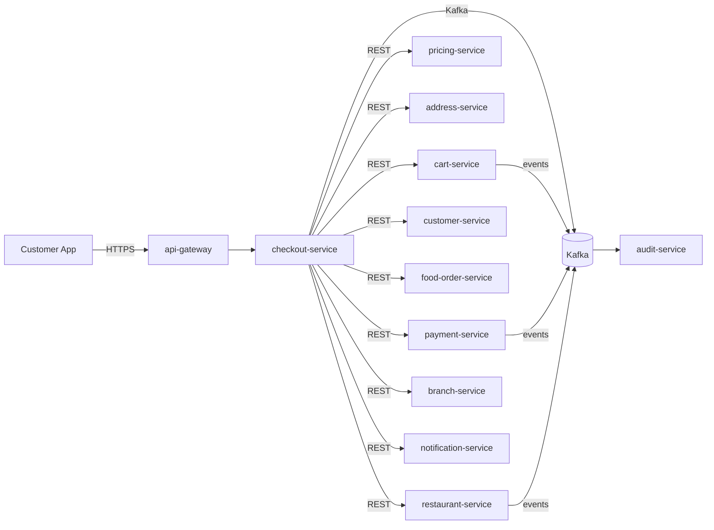

# checkout-service — Software Requirements Specification

## 1. Introduction

This SRS specifies the software behavior of `checkout-service`.
It covers functional requirements, non-functional requirements,
data requirements, API contract summaries, validation, state
transitions, authorization, idempotency, performance,
availability, security, and disaster recovery. The service is
the source of truth for the `CheckoutSession` aggregate.

## 2. Scope

In scope:

- Checkout session lifecycle.
- Address / slot / payment method selection.
- Final quote (frozen).
- Payment authorization and order creation.
- Session expiration and failure handling.

Out of scope:

- Cart contents (owned by `cart-service`; read-only).
- Payment intent state (owned by `payment-service`).
- Food order state (owned by `food-order-service`).
- Pricing engine (owned by `pricing-service`; this service
  only requests a quote).

## 3. System Context

## 4. Actors

- **Customer (human)** — Keycloak subject with role
  `customer`.
- **`cart-service` (system)** — cart contents.
- **`pricing-service` (system)** — final quote.
- **`address-service` (system)** — saved addresses.
- **`payment-service` (system)** — authorization.
- **`customer-service` (system)** — default payment method.
- **`food-order-service` (system)** — create order.
- **`restaurant-service` (system)** — online check.
- **`branch-service` (system)** — open check.
- **`notification-service` (system)** — customer notifications.
- **`audit-service` (system)** — audit events.

## 5. Functional Requirements

| ID | Requirement | Priority |
|----|-------------|----------|
| FR--001 | The service MUST accept `POST /v1/checkouts` with `cart_id`, `address_id`, `slot`, `payment_method_id`. | MUST |
| FR--002 | The service MUST verify the cart is `active` and not empty. | MUST |
| FR--003 | The service MUST snapshot the cart contents in the session row. | MUST |
| FR--004 | The service MUST request a final quote from `pricing-service` and store it. | MUST |
| FR--005 | The service MUST support `PATCH /v1/checkouts/{id}` to change address, slot, tip, payment method. | MUST |
| FR--006 | On address change, the service MUST re-quote. | MUST |
| FR--007 | The service MUST support `POST /v1/checkouts/{id}/pay` to authorize payment and create the order. | MUST |
| FR--008 | The service MUST authorize via `payment-service` with `Idempotency-Key: checkout:{session_id}:pay`. | MUST |
| FR--009 | On `payment.authorized.v1`, the service MUST create the food order via `food-order-service` with `Idempotency-Key: checkout:{session_id}:order`. | MUST |
| FR--010 | On successful order creation, the service MUST mark the session `completed` and emit `checkout.completed.v1`. | MUST |
| FR--011 | On `payment.failed.v1` or authorization failure, the service MUST mark the session `failed` and emit `checkout.failed.v1`. | MUST |
| FR--012 | The service MUST expire sessions after `checkout.session.ttl_minutes` (default 15) via a cron job. | MUST |
| FR--013 | The service MUST block `POST /pay` when `pay_blocked = true` (set on `restaurant.offline.v1`). | MUST |
| FR--014 | The service MUST support `DELETE /v1/checkouts/{id}` (cancel). | MUST |
| FR--015 | The service MUST hard-delete expired sessions after 7 days. | MUST |
| FR--016 | The service MUST publish a `checkout.*.v1` event for every state change. | MUST |
| FR--017 | The service MUST reject `POST /pay` on a session in `completed`, `failed`, or `expired` state with 409. | MUST |
| FR--018 | The service MUST emit `admin.audit.checkout.*` events for every admin action. | MUST |

## 6. Non-Functional Requirements

| ID | Category | Requirement | Target |
|----|----------|-------------|--------|
| NFR--001 | performance | P99 `POST /v1/checkouts` | < 1 s |
| NFR--002 | performance | P99 `GET /v1/checkouts/{id}` | < 200 ms (cache hit < 30 ms) |
| NFR--003 | performance | P99 `POST /v1/checkouts/{id}/pay` | < 3 s (excluding payment provider) |
| NFR--004 | availability | service uptime | 99.95% over 30 days |
| NFR--005 | scalability | concurrent sessions | ≥ 5,000 RPS |
| NFR--006 | scalability | `get session` lookups | ≥ 10,000 RPS via Redis |
| NFR--007 | maintainability | MTTR for P1 | < 30 min |
| NFR--008 | data-integrity | zero event loss | outbox + 24 h ack |
| NFR--009 | latency | failure propagation P95 | < 5 s |
| NFR--010 | latency | expiration detection P95 | < 5 min |

## 7. API Requirements

REST API under `/v1/checkouts[...]` per
[`API_STANDARDS.md`](../../architecture/API_STANDARDS.md). All
write endpoints require `Idempotency-Key`. OpenAPI 3.1 spec at
`/openapi.json`.

(Full contracts in `INTEGRATION.md`.)

## 8. Data Requirements

| ID | Requirement | Notes |
|----|-------------|-------|
| DATA--001 | Sessions are uniquely identified by `id UUIDv7`. | primary key |
| DATA--002 | Every mutable table has `created_at`, `updated_at`, `last_activity_at`, `expires_at`. | audit |
| DATA--003 | `state` is a CHECK-constrained enum. | lifecycle |
| DATA--004 | `customer_id` is a UUID column with no DB FK. | cross-service ref |
| DATA--005 | `cart_id` is a UUID column with no DB FK. | cross-service ref |
| DATA--006 | `address_id` is a UUID column with no DB FK. | cross-service ref |
| DATA--007 | `payment_method_id` is a UUID column with no DB FK. | cross-service ref |
| DATA--008 | `payment_intent_id` is a UUID column with no DB FK (set on auth). | cross-service ref |
| DATA--009 | `food_order_id` is a UUID column with no DB FK (set on success). | cross-service ref |
| DATA--010 | `subtotal_minor`, `tax_minor`, `delivery_fee_minor`, `tip_minor`, `total_minor` are non-negative integers; `currency` is ISO-4217. | money |
| DATA--011 | `pay_idempotency_key` is `checkout:{session_id}:pay`; stored for 24 h. | idempotency |
| DATA--012 | `order_idempotency_key` is `checkout:{session_id}:order`; stored for 24 h. | idempotency |

(Full schema in `ERD.md`.)

## 9. Validation Rules

- `cart_id` — UUID, must reference an `active` cart (via API).
- `address_id` — UUID, must reference a valid saved address
  (via API).
- `slot` — `{start_at, end_at}` with `end_at > start_at` and
  `start_at >= now() + checkout.delivery_slot.min_lead_minutes`.
- `payment_method_id` — UUID, must reference a valid payment
  method (via API).
- `tip_minor` — non-negative.

## 10. State Transitions

| From | To | Trigger |
|------|----|---------|
| (none) | `pending` | `POST /v1/checkouts` |
| `pending` | `completed` | `POST /pay` succeeds |
| `pending` | `failed` | `POST /pay` fails |
| `pending` | `expired` | cron after TTL |
| `pending` | `cancelled` | `DELETE /v1/checkouts/{id}` |

State transitions are described in detail in `WORKFLOWS.md`.

## 11. Authorization Requirements

- `customer` may read / write their own sessions
  (`session.customer_id == sub`).
- `platform_admin` may read any session.
- Service-to-service via `client_credentials`.

## 12. Configuration Requirements

- `checkout.session.ttl_minutes` — int (default 15).
- `checkout.delivery_slot.min_lead_minutes` — int (default 30).
- `checkout.quote.cache_ttl_seconds` — int (default 60).
- `checkout.rate_limit.create_per_hour` — int.

## 13. Error Handling

| Error | Response |
|-------|----------|
| Body validation failure | 400 `VALIDATION_FAILED` with `details[]` |
| Missing/invalid JWT | 401 `UNAUTHENTICATED` |
| Insufficient role | 403 `FORBIDDEN` |
| Cart not found / not active | 409 `CART_NOT_ACTIVE` |
| Restaurant offline | 409 `CHECKOUT_BLOCKED` |
| Address invalid | 422 `ADDRESS_INVALID` |
| Slot invalid | 422 `SLOT_INVALID` |
| Payment method invalid | 422 `PAYMENT_METHOD_INVALID` |
| State invalid | 409 `STATE_INVALID` |
| Idempotency key reused with different body | 422 `IDEMPOTENCY_KEY_REUSED` |
| Idempotency key reused with same body | return original response (200) |
| Payment failed | 422 `PAYMENT_FAILED` |
| Rate limited | 429 `RATE_LIMITED` |
| Downstream timeout | 503 `DEPENDENCY_TIMEOUT` |
| Circuit open | 503 `CIRCUIT_OPEN` |
| Other | 500 `INTERNAL_ERROR` |

## 14. Concurrency Requirements

- Two concurrent `POST /pay` on the same session MUST be
  serialized via row-level lock; the second one receives 409
  if the first changed the state to `completed` or `failed`.
- The expiration cron MUST be safe to run multiple times
  (idempotent on `state`).
- The `pay_idempotency_key` UNIQUE constraint catches
  duplicate `POST /pay` calls.

## 15. Idempotency Requirements

- All write endpoints require `Idempotency-Key`.
- `POST /pay` uses `pay_idempotency_key =
  checkout:{session_id}:pay` to prevent double authorization.
- Order creation uses `order_idempotency_key =
  checkout:{session_id}:order` to prevent double order.
- All state transitions use the outbox pattern with `event_id`
  dedup.

## 16. Performance

- Dominant path: `POST /v1/checkouts/{id}/pay`. P50 < 1 s
  (excluding payment provider), P99 < 3 s.
- `GET /v1/checkouts/{id}`: P50 < 5 ms (cache hit), P99 < 30
  ms.
- `POST /v1/checkouts`: P50 < 300 ms, P99 < 1 s.

## 17. Scalability

- Horizontal: HPA on CPU > 60% and
  `http_requests_in_flight > 500/replica`; max 12.
- Vertical: up to 4 CPU / 8 GiB.
- DB: 1 primary + 1 read replica in each region.
- Cache: Redis cluster, key `checkout:{id}` TTL 30 s.

## 18. Availability

- SLO: 99.95% over 30 days.
- Error budget: ~22 min / 30 days.
- Maintenance: Sunday 04:00–06:00 UTC.

## 19. Security

| ID | Requirement | Notes |
|----|-------------|-------|
| SEC--001 | All endpoints require a valid JWT; service-to-service uses `client_credentials`. | gateway enforced |
| SEC--002 | Resource-level ownership checks at the service layer. | `session.customer_id == sub` |
| SEC--003 | All cross-service calls use mTLS + `client_credentials` JWT. | defense in depth |
| SEC--004 | Secrets only in Vault. | pre-commit enforced |
| SEC--005 | Rate limiting at gateway and service. | `API_STANDARDS.md` §12 |
| SEC--006 | No PII beyond the customer's id and the address id. | minimal |
| SEC--007 | Admin actions emit `admin.audit.checkout.*` events. | `audit-service` |
| SEC--008 | The service stores no card data; PCI scope is none. | SAQ-A |

## 20. Privacy

- PII stored: customer id, address id; the session contents
  are short-lived.
- Retention: 7 days after expiration.
- Erasure: not directly supported (session is short-lived).

## 21. Auditability

- Every state transition emits a `checkout.*.v1` event.
- Every admin action emits an `admin.audit.checkout.*` event.
- Audit retention: 7 years (for financial reconciliation).

## 22. Observability

- Logs: JSON to stdout with `correlation_id`, `trace_id`,
  `checkout_session_id`, `customer_id`, `state`, `from_state`,
  `to_state`, `actor`.
- Metrics:
  - RED: standard.
  - Business: `checkouts_created_total`,
    `checkouts_completed_total`,
    `checkouts_failed_total{reason}`,
    `checkouts_expired_total`,
    `checkout_quote_seconds` (histogram).
- Traces: OpenTelemetry.
- Alerts: SLO burn rate, outbox lag, expiration lag.

## 23. Maintainability

- TypeScript strict, ESLint, Prettier.
- Coverage: ≥ 85% lines.
- Documentation: this folder.

## 24. Disaster Recovery

- RPO: 5 min (PITR 30 days for Tier-1).
- RTO: 30 min.
- Quarterly restore drill.

## 25. Acceptance Criteria

- AC-1: A customer can start checkout in < 1 s.
- AC-2: The final quote is frozen for the session.
- AC-3: `POST /pay` is idempotent on retries.
- AC-4: An offline restaurant blocks payment.
- AC-5: A session idle for 15 min is marked expired.
- AC-6: All state changes are emitted as events.
- AC-7: The service meets its 99.95% SLO.
- AC-8: The service stores no card data.
- AC-9: A session in `completed` is terminal.
- AC-10: Expired sessions are hard-deleted after 7 days.

---

## See also

### Sibling docs for this service

- [`README.md`](./README.md) — purpose, bounded context, responsibilities
- [`BRD.md`](./BRD.md) — business requirements
- [`SRS.md`](./SRS.md) — functional + non-functional requirements
- [`ERD.md`](./ERD.md) — data model (entities, relationships)
- [`INTEGRATION.md`](./INTEGRATION.md) — inter-service contracts (APIs, events, sagas)
- [`WORKFLOWS.md`](./WORKFLOWS.md) — operational workflows (happy paths, failure modes)
- [`TECH.md`](./TECH.md) — technology profile (runtime, libraries, data layer, admin endpoints, RBAC)

### Platform-wide

- [`../../shared/README.md`](../../shared/README.md) — `platform-spring-boot-starter` shared library (the single source of cross-cutting code for all Spring Boot services in the platform)
- [`../RECOMMENDATIONS.md`](../RECOMMENDATIONS.md) — platform-wide technology map (language, framework, version baseline, admin/RBAC pattern)
- [`../../README.md`](../../README.md) — services overview (the catalog of all 58 services)
- [`../../../main.md`](../../../main.md) — top-level platform specification (architecture, Keycloak, PostgreSQL 18, messaging, observability baseline)

