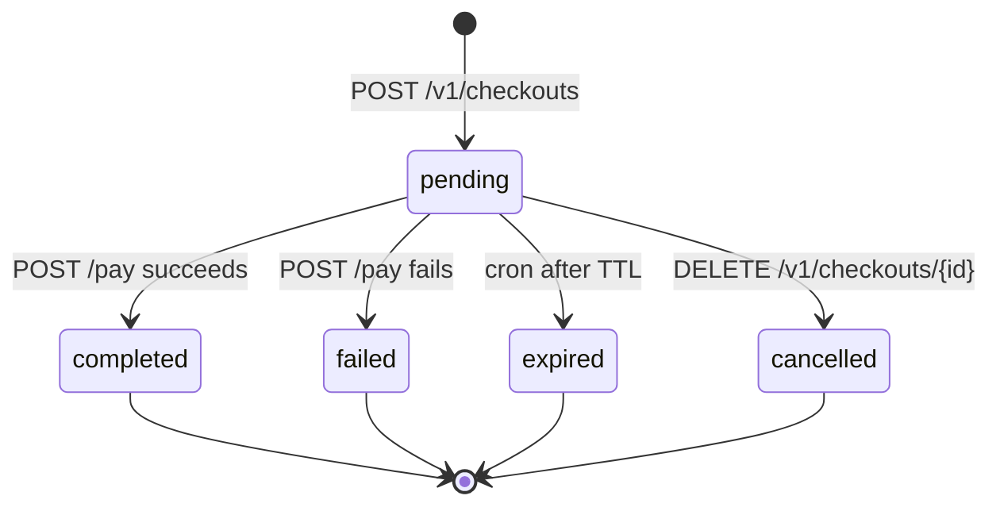
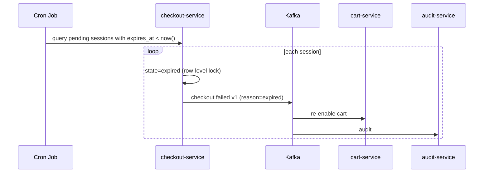

# checkout-service — Workflows

## 1. Session Creation

### 1.1 Objective

The customer starts checkout from an active cart; the service
snapshots the cart contents, requests a final quote from
`pricing-service`, and creates the session. The session is the
bridge to payment authorization.

### 1.2 Initiating Actor

`customer` (human).

### 1.3 Participating Services

- `checkout-service` (this service).
- `cart-service` (read cart contents).
- `pricing-service` (final quote).
- `address-service` (verify address).
- `payment-service` (verify payment method).
- `restaurant-service` / `branch-service` (verify online /
  open).
- `audit-service` (downstream).

### 1.4 Prerequisites

- The cart is `active` and not empty.
- The customer has a saved payment method.
- The address is in a serving zone.
- The slot is at least `checkout.delivery_slot.min_lead_minutes`
  in the future.
- The restaurant is `online` and the branch is `open`.

### 1.5 Happy Path

```mermaid
sequenceDiagram
    participant C as Customer
    participant CHK as checkout-service
    participant CRT as cart-service
    participant PRC as pricing-service
    participant ADR as address-service
    participant PAY as payment-service
    participant RES as restaurant-service
    participant BRH as branch-service
    participant K as Kafka
    participant AUD as audit-service

    C->>CHK: POST /v1/checkouts (cart_id, address_id, slot, payment_method_id, tip_minor, Idempotency-Key)
    CHK->>CRT: GET /v1/carts/{cart_id}
    CRT-->>CHK: cart contents
    CHK->>RES: GET /v1/restaurants/{restaurant_id}/online
    RES-->>CHK: online
    CHK->>BRH: GET /v1/branches/{branch_id}/open
    BRH-->>CHK: open
    CHK->>ADR: GET /v1/addresses/{address_id}
    ADR-->>CHK: ok
    CHK->>PAY: GET /v1/payment_methods/{payment_method_id} (validate)
    PAY-->>CHK: ok
    CHK->>PRC: POST /v1/quote (cart with tip, slot, address)
    PRC-->>CHK: subtotal, tax, fee, total
    CHK->>CHK: snapshot cart items; state=pending; expires_at=now()+15m
    CHK-->>C: 201 session
    CHK->>K: (no event on create; next state change)
```

### 1.6 Alternate Paths

- **Cart not active**: 409 `CART_NOT_ACTIVE`.
- **Restaurant offline**: 409 `CHECKOUT_BLOCKED` (the session
  is created with `pay_blocked = true`; the customer cannot
  pay).
- **Address invalid**: 422 `ADDRESS_INVALID`.
- **Slot invalid**: 422 `SLOT_INVALID`.
- **Payment method invalid**: 422 `PAYMENT_METHOD_INVALID`.

### 1.7 Failure Paths

- **Downstream timeout / circuit open**: 503.
- **Outbox failure**: outbox retried.

### 1.8 Business Rules

- The cart contents are snapshotted at session creation and
  frozen for the session.
- The final quote is the result of the most recent
  `pricing-service` call.
- The session is created in the same DB transaction as the
  cart snapshot; atomicity is critical.

### 1.9 State Transitions



### 1.10 Events

No event on create; the next state change emits one.

### 1.11 APIs Involved

| API | Direction | When |
|-----|-----------|------|
| `POST /v1/checkouts` | inbound | create |
| `GET /v1/carts/{id}` to cart-service | outbound | read cart |
| `POST /v1/quote` to pricing-service | outbound | final quote |

### 1.12 Compensation / Rollback

- **Session was created by mistake**: `DELETE
  /v1/checkouts/{id}`; the cart is re-enabled.

### 1.13 Final State

The session is `pending` with a frozen quote; the customer is
ready to pay.

## 2. Payment Authorization and Order Creation

### 2.1 Objective

The customer pays; the service authorizes via `payment-service`
and, on success, creates the food order via
`food-order-service`. The session is marked `completed` and
`checkout.completed.v1` is emitted.

### 2.2 Initiating Actor

`customer` (human).

### 2.3 Participating Services

- `checkout-service` (this service).
- `payment-service` (authorization).
- `food-order-service` (order creation).
- `cart-service` (downstream — clear).
- `notification-service` (inform customer).
- `audit-service`.

### 2.4 Prerequisites

- The session is `pending`.
- The session is not `pay_blocked`.
- The session has not expired.

### 2.5 Happy Path

```mermaid
sequenceDiagram
    participant C as Customer
    participant CHK as checkout-service
    participant PAY as payment-service
    participant FOR as food-order-service
    participant K as Kafka
    participant CRT as cart-service
    participant NOT as notification-service
    participant AUD as audit-service

    C->>CHK: POST /v1/checkouts/{id}/pay (Idempotency-Key)
    CHK->>CHK: row-level lock; state=pending; not pay_blocked; not expired
    CHK->>PAY: POST /v1/payments/authorize (Idempotency-Key=checkout:{session_id}:pay)
    PAY-->>CHK: payment_intent_id
    CHK->>FOR: POST /v1/orders (cart_id, address, slot, payment_intent_id, Idempotency-Key=checkout:{session_id}:order)
    FOR-->>CHK: 201 food_order_id
    CHK->>CHK: state=completed; food_order_id, payment_intent_id
    CHK->>K: checkout.completed.v1
    K->>CRT: clear cart
    K->>NOT: notify customer
    K->>AUD: audit
    CHK-->>C: 200 OK
```

### 2.6 Alternate Paths

- **Restaurant offline (`pay_blocked = true`)**: 409
  `CHECKOUT_BLOCKED`.
- **Session not pending**: 409 `STATE_INVALID`.
- **Session expired**: 409 `STATE_INVALID`.
- **Payment declined**: 422 `PAYMENT_FAILED`; session →
  `failed`; emit `checkout.failed.v1`.
- **Order creation failure**: rare; the service compensates
  by voiding the authorization; session → `failed`; emit
  `checkout.failed.v1`.

### 2.7 Failure Paths

- **Outbox failure**: outbox retried.
- **Order creation failure after authorization**: the service
  calls `payment-service.void` (compensation); the session is
  `failed`; `checkout.failed.v1` is emitted.

### 2.8 Business Rules

- The `pay_idempotency_key` UNIQUE constraint prevents double
  authorization.
- The `order_idempotency_key` UNIQUE constraint prevents
  double order creation.
- The compensation is "void the authorization" if the order
  creation fails.

### 2.9 State Transitions

The relevant transition is `pending → completed`. (See state
diagram in §1.9.)

### 2.10 Events

| Event | Direction | When |
|-------|-----------|------|
| `checkout.completed.v1` | produced | on success |
| `checkout.failed.v1` | produced | on failure |

### 2.11 APIs Involved

| API | Direction | When |
|-----|-----------|------|
| `POST /v1/checkouts/{id}/pay` | inbound | customer pay |
| `POST /v1/payments/authorize` to payment-service | outbound | authorize |
| `POST /v1/orders` to food-order-service | outbound | create order |

### 2.12 Compensation / Rollback

- **Order creation fails after authorization**: call
  `payment-service.void`; session → `failed`.
- **Customer wants to cancel before pay**: `DELETE
  /v1/checkouts/{id}`.

### 2.13 Final State

The session is `completed`; the food order is created; the
customer is informed.

## 3. Session Expiration

### 3.1 Objective

A pending session idle for `checkout.session.ttl_minutes`
(default 15) is marked `expired`; the cart is re-enabled.

### 3.2 Initiating Actor

Cron job (system).

### 3.3 Participating Services

- `checkout-service` (this service).
- `cart-service` (downstream — re-enable).
- `audit-service`.

### 3.4 Prerequisites

- The session is `pending`.
- `expires_at < now()`.

### 3.5 Happy Path



### 3.6 Alternate Paths

- **Session was paid in the meantime**: skip (state is no
  longer `pending`).

### 3.7 Failure Paths

- **Outbox failure**: outbox retried.

### 3.8 Business Rules

- The expiration cron runs every minute.
- The session is marked `expired` atomically with the
  `checkout.failed.v1` event.

### 3.9 State Transitions

The relevant transition is `pending → expired`.

### 3.10 Events

| Event | Direction | When |
|-------|-----------|------|
| `checkout.failed.v1` | produced | on expiration |

### 3.11 APIs Involved

No direct API involvement; pure internal cron.

### 3.12 Compensation / Rollback

The customer can re-checkout by creating a new session from
the same cart (the cart is re-enabled).

### 3.13 Final State

The session is `expired`; the cart is re-enabled; the
customer can re-checkout.

## 4. Payment Failure

### 4.1 Objective

When the payment provider declines the authorization, the
session is marked `failed`; the cart is re-enabled; the
customer is notified.

### 4.2 Initiating Actor

`payment-service` (system) via `payment.failed.v1`, or the
checkout service itself if the authorize call returns 4xx.

### 4.3 Participating Services

- `checkout-service` (this service).
- `cart-service` (downstream — re-enable).
- `notification-service` (inform customer).
- `audit-service`.

### 4.4 Prerequisites

- The session is `pending`.
- The payment was attempted.

### 4.5 Happy Path

```mermaid
sequenceDiagram
    participant CHK as checkout-service
    participant PAY as payment-service
    participant K as Kafka
    participant CRT as cart-service
    participant NOT as notification-service
    participant AUD as audit-service

    CHK->>PAY: POST /v1/payments/authorize
    PAY-->>CHK: 4xx PAYMENT_FAILED
    CHK->>CHK: state=failed; failure_reason_code; failure_reason_text
    CHK->>K: checkout.failed.v1
    K->>CRT: re-enable cart
    K->>NOT: notify customer
    K->>AUD: audit
    CHK-->>CH: 422 PAYMENT_FAILED
```

### 4.6 Alternate Paths

- **`payment.failed.v1` received after `POST /pay` returned
  success**: the consumer updates the session to `failed`
  (rare; the saga has a window where the event arrives after
  the response). The cart is re-enabled.

### 4.7 Failure Paths

- **Outbox failure**: outbox retried.

### 4.8 Business Rules

- A `failed` session cannot be retried; the customer must
  create a new session (the cart is re-enabled).

### 4.9 State Transitions

The relevant transition is `pending → failed`.

### 4.10 Events

| Event | Direction | When |
|-------|-----------|------|
| `checkout.failed.v1` | produced | on failure |
| `payment.failed.v1` | consumed | failure signal |

### 4.11 APIs Involved

| API | Direction | When |
|-----|-----------|------|
| `POST /v1/payments/authorize` to payment-service | outbound | authorize |

### 4.12 Compensation / Rollback

- The customer can update the payment method via `PATCH
  /v1/checkouts/{id}` (if the session is still `pending` and
  not expired) and retry `POST /pay`.
- After expiration, the customer must create a new session.

### 4.13 Final State

The session is `failed`; the cart is re-enabled; the customer
is informed.

---

## See also

### Sibling docs for this service

- [`README.md`](./README.md) — purpose, bounded context, responsibilities
- [`BRD.md`](./BRD.md) — business requirements
- [`SRS.md`](./SRS.md) — functional + non-functional requirements
- [`ERD.md`](./ERD.md) — data model (entities, relationships)
- [`INTEGRATION.md`](./INTEGRATION.md) — inter-service contracts (APIs, events, sagas)
- [`WORKFLOWS.md`](./WORKFLOWS.md) — operational workflows (happy paths, failure modes)
- [`TECH.md`](./TECH.md) — technology profile (runtime, libraries, data layer, admin endpoints, RBAC)

### Platform-wide

- [`../../shared/README.md`](../../shared/README.md) — `platform-spring-boot-starter` shared library (the single source of cross-cutting code for all Spring Boot services in the platform)
- [`../RECOMMENDATIONS.md`](../RECOMMENDATIONS.md) — platform-wide technology map (language, framework, version baseline, admin/RBAC pattern)
- [`../../README.md`](../../README.md) — services overview (the catalog of all 58 services)
- [`../../../main.md`](../../../main.md) — top-level platform specification (architecture, Keycloak, PostgreSQL 18, messaging, observability baseline)

