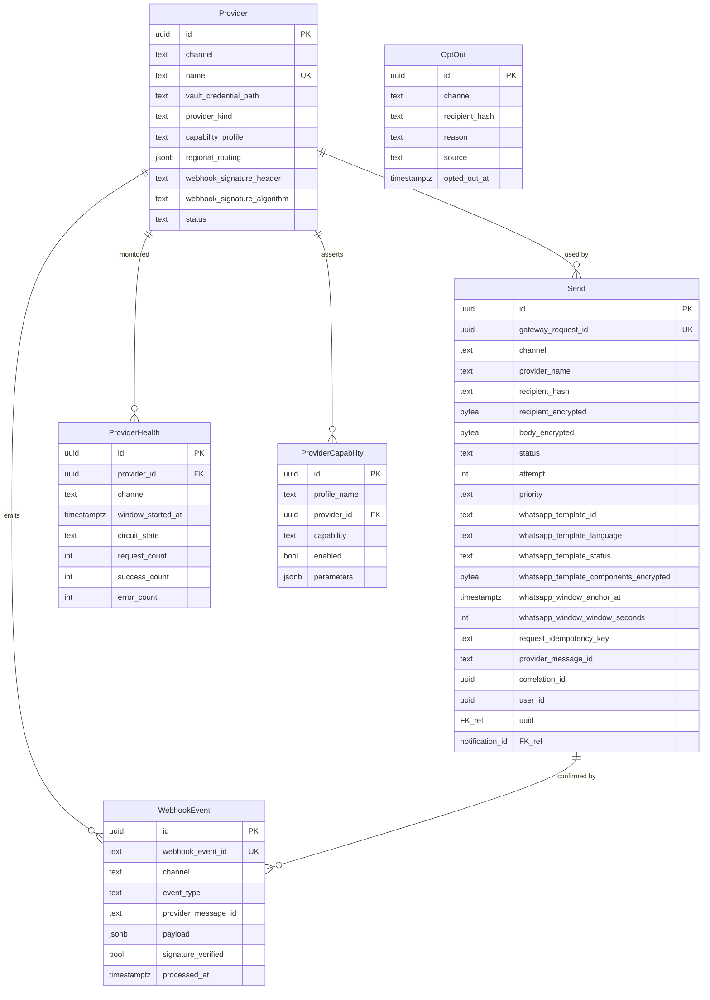

# communication-gateway-service — Entity-Relationship Diagram

## 1. Database

- **Engine**: PostgreSQL 18.
- **Schema**: `comms_gateway` — owned exclusively by this service.
- **Migrations**: `services/communication-gateway-service/migrations/`
  (versioned, forward-only, golang-migrate).

The schema is the canonical source of truth for the send log,
provider health, and opt-outs. Provider credentials live in
Vault, not here (per `SECURITY_ARCHITECTURE.md` §5).

> **v1.1 schema extension (WhatsApp + plug-in providers).**
> Added `whatsapp` as a 4th gateway channel; introduced
> provider-template tracking columns on `sends`
> (`whatsapp_template_id`, `whatsapp_template_language`,
> `whatsapp_template_status`, `whatsapp_template_components`)
> to mirror the provider's pre-approved template state.
> Provider onboarding remains **zero-schema-change** — each
> row in `comms_gateway.providers` plus the matching
> capability record in `provider_capabilities` describes the
> adapter; new providers can be Twilio WhatsApp, Meta Cloud
> API direct, 360dialog, MessageBird WhatsApp, Gupshup, or any
> future option that satisfies
> [`WHATSAPP_PROVIDER_CONTRACT.md`](./WHATSAPP_PROVIDER_CONTRACT.md).
>
> See [`WHATSAPP_PROVIDER_CONTRACT.md`](./WHATSAPP_PROVIDER_CONTRACT.md)
> for the capability matrix, adapter lifecycle, regional
> routing, and webhook signature requirements.

## 2. Cross-Service References

| Column | Type | Refers to | Source of truth |
|--------|------|-----------|------------------|
| `user_id` | UUID | `Customer` / `Driver` / `Courier` / `Merchant` | each owner service |
| `notification_id` | UUID | `Delivery` in `notification-service` | `notification-service` |
| `whatsapp_template_id` | TEXT (on `sends`) | the provider's pre-approved template id | provider (Meta Cloud, 360dialog, Twilio, …) — mirrored for routing only |
| `provider_template_version` | TEXT NULL | provider's internal version string for the template | provider |
| `actor_sub` (audit) | UUID | Keycloak `sub` of caller | `identity-service` (Keycloak) |
| `correlation_id` (audit) | UUID | per request | gateway / caller |

## 3. Entities

### `Provider`

A configured messaging provider. The `name` column is the
stable identifier (e.g. `twilio`, `meta-cloud-whatsapp`,
`messagebird-whatsapp`, `sendgrid`, `apns`, `fcm`). Adding a
new provider is **config-only**: an admin POSTs a new row;
no schema change is required.

#### Columns

| Column | Type | Constraints | Notes |
|--------|------|-------------|-------|
| `id` | UUID | PK | UUIDv7 |
| `channel` | TEXT | NOT NULL | `sms` \| `email` \| `push` \| `whatsapp` |
| `name` | TEXT | NOT NULL UNIQUE | `twilio`, `sendgrid`, `apns`, `fcm`, `meta-cloud-whatsapp`, `360dialog-whatsapp`, `messagebird-whatsapp`, `gupshup-whatsapp`, … |
| `display_name` | TEXT | NOT NULL | |
| `vault_credential_path` | TEXT | NOT NULL | path in Vault (e.g. `kv/platform/prod/comms-gateway/whatsapp/meta-cloud`) |
| `provider_kind` | TEXT | NOT NULL DEFAULT `'standard'` | `standard` (SMS/email/push) \| `whatsapp_bsp` (WhatsApp Business Solution Provider) \| `whatsapp_direct` (Meta Cloud API direct) \| `messaging_broker` (a plug-in that wraps multiple vendors — for future use) |
| `regional_routing` | JSONB | NULL | map of country code or region → priority, e.g. `{"966":1, "971":2}`. For WhatsApp this is especially important: Meta Cloud + 360dialog typically enforce different regional residency/latency profiles. |
| `capability_profile` | TEXT | NULL | named profile from `provider_capabilities.profile_name`. Used at runtime to validate that this provider satisfies the capabilities the caller needs (e.g. `send_template`, `media_upload`). Default profile: `sms_basic` / `email_basic` / `push_basic` / `whatsapp_template_v1`. |
| `webhook_signature_header` | TEXT | NULL | header name where the provider posts the HMAC signature. `X-Hub-Signature-256` for Meta Cloud; `X-Twilio-Signature` for Twilio; configurable per provider. |
| `webhook_signature_algorithm` | TEXT | NULL | `hmac_sha256` (default), `hmac_sha512`, `rsa_sha256` (rare). |
| `status` | TEXT | NOT NULL | `active` \| `disabled` |
| `created_at` | TIMESTAMPTZ | NOT NULL DEFAULT now() | |
| `updated_at` | TIMESTAMPTZ | NOT NULL DEFAULT now() | |
| `created_by` | UUID | NOT NULL | |
| `updated_by` | UUID | NOT NULL | |
| `deleted_at` | TIMESTAMPTZ | NULL | soft delete |

#### Indexes

- PK on `id`
- UNIQUE on `name`
- BTree on `channel` WHERE `status = 'active' AND deleted_at IS NULL`
- BTree on `(provider_kind, status)` WHERE `status='active'` (operational dashboards)

#### Constraints

- CHECK: `channel IN ('sms','email','push','whatsapp')`
- CHECK: `status IN ('active','disabled')`
- CHECK: `provider_kind IN ('standard','whatsapp_bsp','whatsapp_direct','messaging_broker')`

### `ProviderCapability`

A plug-in capability profile that providers opt into. This is
the data-driven implementation of the contract documented in
[`WHATSAPP_PROVIDER_CONTRACT.md`](./WHATSAPP_PROVIDER_CONTRACT.md);
calling code can ask "does provider P support capability X?"
without hard-coding adapter names. Adding a new provider does
NOT require new code — only a new row here plus a record in
`comms_gateway.providers`.

#### Columns

| Column | Type | Constraints | Notes |
|--------|------|-------------|-------|
| `id` | UUID | PK | UUIDv7 |
| `profile_name` | TEXT | NOT NULL UNIQUE | `sms_basic`, `email_basic`, `push_basic`, `whatsapp_template_v1`, `whatsapp_template_v1_with_media`, `whatsapp_template_v1_with_url_buttons`, `whatsapp_otp_v1`, etc. The named profile is referenced from `providers.capability_profile`. |
| `provider_id` | UUID | NOT NULL | FK (within schema) to the provider this capability is asserted for |
| `capability` | TEXT | NOT NULL | One of the canonical capabilities in the matrix below. |
| `enabled` | BOOLEAN | NOT NULL DEFAULT `true` | Allows per-capability toggling without dropping the row |
| `parameters` | JSONB | NULL | Provider-specific parameters (e.g. max header media bytes, allowed button types, regional availability map). Schema-free by design. |
| `created_at` | TIMESTAMPTZ | NOT NULL DEFAULT now() | |
| `updated_at` | TIMESTAMPTZ | NOT NULL DEFAULT now() | |
| `created_by` | UUID | NOT NULL | |
| `deleted_at` | TIMESTAMPTZ | NULL | soft delete (capabilities can be revoked) |

#### Canonical capabilities

The `capability` column is constrained to the values below. The
constant set lives here rather than in code so future plug-ins
(Telegram, RCS, Slack) can extend it via a migration.

| Capability | Applies to channels | Notes |
|------------|---------------------|-------|
| `send_template` | `whatsapp` (required), `push` (optional, for APNs rich notifications) | Send a pre-approved template with parameter substitution |
| `send_freeform_within_window` | `whatsapp` (optional) | Send session-message freeform text within the 24h customer-service window |
| `send_plain_text` | `sms` (always) | |
| `send_html_email` | `email` (always) | |
| `media_upload` | `whatsapp` (required for header-media), `email` (attachments), `push` (rich media) | Upload media first, reference by id |
| `template_submit` | `whatsapp` (required) | Submit a template to the provider for approval |
| `template_status` | `whatsapp` (required) | Poll the provider's template approval status |
| `webhook_signed_hmac_sha256` | `whatsapp` (required), `email` (often), `sms` (often) | Signed webhooks via `X-Hub-Signature-256` or vendor header |
| `webhook_signed_rsa_sha256` | `push` (APNs) | Apple-signed webhooks |
| `health_metrics` | all | p50/p95/p99 + error rate |
| `regional_routing` | all | map of country code → priority |
| `optout_keyword_stop` | `sms` (required), `whatsapp` (required) | registers STOP keyword on the send (provider-level); webhook ingest writes to `optouts` |
| `template_deletion` | `whatsapp` (required) | Admin-initiated delete of the provider's pre-approved template |
| `language_negotiation` | `whatsapp` (required), `email` (optional) | the provider supports per-send language code overrides |

#### Indexes

- PK on `id`
- UNIQUE on `(provider_id, capability)` WHERE `deleted_at IS NULL` — one capability per provider (multi-row conflict only when soft-deleted)
- BTree on `(profile_name, capability)` — fast lookup of "who supports X?" during routing

#### Constraints

- CHECK: `capability IN ('send_template','send_freeform_within_window','send_plain_text','send_html_email','media_upload','template_submit','template_status','webhook_signed_hmac_sha256','webhook_signed_rsa_sha256','health_metrics','regional_routing','optout_keyword_stop','template_deletion','language_negotiation')`

### `Send`

A single send attempt and its disposition.

#### Columns

| Column | Type | Constraints | Notes |
|--------|------|-------------|-------|
| `id` | UUID | NOT NULL | UUIDv7 |
| `gateway_request_id` | UUID | NOT NULL UNIQUE | the public id |
| `channel` | TEXT | NOT NULL | `sms` \| `email` \| `push` \| `whatsapp` |
| `provider_id` | UUID | NOT NULL | FK to providers (within schema) |
| `provider_name` | TEXT | NOT NULL | denormalized for analytics |
| `recipient_hash` | TEXT | NOT NULL | SHA-256 hex |
| `recipient_encrypted` | BYTEA | NOT NULL | `pgcrypto` ciphertext |
| `body_encrypted` | BYTEA | NOT NULL | for SMS / email; for WhatsApp structured templates this holds the serialized, variable-substituted components. |
| `body_length` | INT | NOT NULL CHECK (body_length >= 0) | |
| `subject_encrypted` | BYTEA | NULL | for email; null for SMS/push/WhatsApp |
| `status` | TEXT | NOT NULL | `queued` \| `sending` \| `accepted` \| `sent` \| `delivered` \| `read` \| `failed` \| `suppressed` \| `opted_out` |
| `attempt` | INT | NOT NULL DEFAULT 1 | |
| `priority` | TEXT | NOT NULL | `normal` \| `urgent` |
| `request_idempotency_key` | TEXT | NULL | client idempotency |
| `provider_message_id` | TEXT | NULL | the provider's reference (Twilio SID, SendGrid msg id, Meta Cloud `wamid.HBgN…`) |
| `provider_response_status` | INT | NULL | HTTP status from provider |
| `provider_response_body` | JSONB | NULL | raw, for debug |
| `failure_reason` | TEXT | NULL | `RATE_LIMITED`, `OPTED_OUT`, `CIRCUIT_OPEN`, `TEMPLATE_NOT_APPROVED`, `WINDOW_EXPIRED`, `MEDIA_UPLOAD_FAILED`, etc. |
| `whatsapp_template_id` | TEXT | NULL | for `channel='whatsapp'` only — the provider's pre-approved template id used for this send. Mirrored from `notification.templates.provider_template_id`. |
| `whatsapp_template_language` | TEXT | NULL | for `channel='whatsapp'` only — the registered language code (e.g. `ar_SA`). |
| `whatsapp_template_status` | TEXT | NULL | for `channel='whatsapp'` only — `submitted` \| `accepted` \| `failed` \| `rejected`. Reflects the immediate response from the provider for THIS send (not the per-template approval status, which lives in `notification.templates.provider_template_status`). |
| `whatsapp_template_components_encrypted` | BYTEA | NULL | for `channel='whatsapp'` only — `pgcrypto` ciphertext of the rendered (variable-substituted) WhatsApp components payload, kept for audit/replay. |
| `whatsapp_window_anchor_at` | TIMESTAMPTZ | NULL | for `channel='whatsapp'` only — anchor time used to enforce the 24h customer-service window. Null when `notification.whatsapp.template_24h_window_enforced=false`. |
| `whatsapp_window_window_seconds` | INT | NULL | for `channel='whatsapp'` only — the 24h (86400s) window length in effect for this send. Snapshotted from config at send time. |
| `correlation_id` | UUID | NOT NULL | |
| `user_id` | UUID | NULL | cross-ref |
| `notification_id` | UUID | NULL | cross-ref to `notification.deliveries.id` |
| `created_at` | TIMESTAMPTZ | NOT NULL DEFAULT now() | partition key |
| `updated_at` | TIMESTAMPTZ | NOT NULL DEFAULT now() | |
| `sent_at` | TIMESTAMPTZ | NULL | |
| `delivered_at` | TIMESTAMPTZ | NULL | |
| `read_at` | TIMESTAMPTZ | NULL | WhatsApp only — when the recipient opened/reads the message |
| `failed_at` | TIMESTAMPTZ | NULL | |
| `version` | INT | NOT NULL DEFAULT 1 | |

#### Indexes

- PK on `(id, created_at)` (because partitioned)
- UNIQUE on `gateway_request_id` (across partitions via
  `(gateway_request_id, created_at)` — enforced at the
  application layer for inserts)
- BTree on `(channel, created_at DESC)`
- BTree on `(status, created_at)` WHERE `status IN ('failed','suppressed','opted_out','accepted')`
- BTree on `recipient_hash`
- BTree on `notification_id` WHERE `notification_id IS NOT NULL`
- BTree on `correlation_id`
- BTree on `provider_message_id` WHERE `provider_message_id IS NOT NULL`
- BTree on `request_idempotency_key` WHERE `request_idempotency_key IS NOT NULL`
- BTree on `(channel, whatsapp_template_id)` WHERE `channel='whatsapp' AND whatsapp_template_id IS NOT NULL` (reconciliation of inbound status webhooks to the original send row)

#### Constraints

- CHECK: `channel IN ('sms','email','push','whatsapp')`
- CHECK: `status IN ('queued','sending','accepted','sent','delivered','read','failed','suppressed','opted_out')`
- CHECK: `priority IN ('normal','urgent')`
- CHECK: `attempt >= 1`
- CHECK: `(channel = 'whatsapp' AND whatsapp_template_id IS NOT NULL AND whatsapp_template_language IS NOT NULL)
         OR (channel <> 'whatsapp')`
- CHECK: `(status <> 'read') OR (channel = 'whatsapp')`
- CHECK: `(status <> 'accepted') OR (channel = 'whatsapp')`  (the `accepted` state is WhatsApp-only — Meta Cloud's "we got it" acknowledgement)
- CHECK: `(whatsapp_window_window_seconds IS NULL) OR (whatsapp_window_window_seconds > 0)`
- CHECK: `(whatsapp_window_window_seconds IS NULL) OR (whatsapp_window_anchor_at IS NOT NULL)`

#### Partitioning

- Range-partitioned by `created_at`, monthly.
- Retention: 90 days; partition dropped at 90 days.

### `WebhookEvent`

A webhook received from a provider. Idempotent on
`webhook_event_id`.

#### Columns

| Column | Type | Constraints | Notes |
|--------|------|-------------|-------|
| `id` | UUID | PK | UUIDv7 |
| `webhook_event_id` | TEXT | NOT NULL UNIQUE | the provider's event id (e.g. Twilio MessageSid, Meta Cloud `wamid.HBgN…`) |
| `channel` | TEXT | NOT NULL | `sms` \| `email` \| `push` \| `whatsapp` |
| `provider_id` | UUID | NOT NULL | |
| `provider_name` | TEXT | NOT NULL | |
| `event_type` | TEXT | NOT NULL | For SMS/email/push: `delivery`, `bounce`, `optout`, `complaint`, `opened`, `clicked`. For WhatsApp additionally: `accepted`, `sent`, `delivered`, `read`, `failed`, `template_status_update`. See CHECK. |
| `provider_message_id` | TEXT | NULL | the provider's message reference |
| `payload` | JSONB | NOT NULL | raw webhook payload |
| `signature_verified` | BOOLEAN | NOT NULL | |
| `processed_at` | TIMESTAMPTZ | NULL | |
| `error` | TEXT | NULL | |
| `correlation_id` | UUID | NOT NULL | |
| `created_at` | TIMESTAMPTZ | NOT NULL DEFAULT now() | |

#### Indexes

- PK on `id`
- UNIQUE on `webhook_event_id`
- BTree on `provider_message_id` WHERE `provider_message_id IS NOT NULL`
- BTree on `(channel, event_type, created_at DESC)` — operational queries by channel + event type
- BTree on `(processed_at, created_at)` for ops queries

#### Constraints

- CHECK: `channel IN ('sms','email','push','whatsapp')`
- CHECK: `event_type IN ('delivery','bounce','optout','complaint','opened','clicked','accepted','sent','read','failed','template_status_update')`

### `OptOut`

A persistent opt-out for a recipient.

#### Columns

| Column | Type | Constraints | Notes |
|--------|------|-------------|-------|
| `id` | UUID | PK | UUIDv7 |
| `channel` | TEXT | NOT NULL | `sms` \| `email` \| `push` |
| `recipient_hash` | TEXT | NOT NULL | SHA-256 hex |
| `recipient_encrypted` | BYTEA | NULL | optional; for ops to look up by recipient |
| `reason` | TEXT | NOT NULL | `STOP`, `UNSUBSCRIBE`, `COMPLAINT`, `ADMIN`, `USER` |
| `source` | TEXT | NOT NULL | `webhook`, `admin`, `api` |
| `opted_out_at` | TIMESTAMPTZ | NOT NULL DEFAULT now() | |
| `created_at` | TIMESTAMPTZ | NOT NULL DEFAULT now() | |
| `updated_at` | TIMESTAMPTZ | NOT NULL DEFAULT now() | |
| `created_by` | UUID | NOT NULL | |
| `updated_by` | UUID | NOT NULL | |
| `deleted_at` | TIMESTAMPTZ | NULL | for re-opt-in |

#### Indexes

- PK on `id`
- UNIQUE on `(channel, recipient_hash) WHERE deleted_at IS NULL`
- BTree on `recipient_hash`

#### Constraints

- CHECK: `channel IN ('sms','email','push','whatsapp')`
- CHECK: `reason IN ('STOP','UNSUBSCRIBE','COMPLAINT','ADMIN','USER')`

### `ProviderHealth`

A time-series snapshot of provider health (used for the
dashboard; circuit state is in memory + Redis).

#### Columns

| Column | Type | Constraints | Notes |
|--------|------|-------------|-------|
| `id` | UUID | PK | UUIDv7 |
| `provider_id` | UUID | NOT NULL | |
| `provider_name` | TEXT | NOT NULL | |
| `channel` | TEXT | NOT NULL | |
| `window_started_at` | TIMESTAMPTZ | NOT NULL | partition key |
| `window_seconds` | INT | NOT NULL | 60 |
| `request_count` | INT | NOT NULL DEFAULT 0 | |
| `success_count` | INT | NOT NULL DEFAULT 0 | |
| `error_count` | INT | NOT NULL DEFAULT 0 | |
| `p50_latency_ms` | INT | NULL | |
| `p95_latency_ms` | INT | NULL | |
| `p99_latency_ms` | INT | NULL | |
| `circuit_state` | TEXT | NOT NULL | `closed` \| `open` \| `half_open` |
| `created_at` | TIMESTAMPTZ | NOT NULL DEFAULT now() | |

#### Indexes

- PK on `id`
- BTree on `(provider_id, window_started_at DESC)`
- BTree on `(channel, window_started_at DESC)`

#### Constraints

- CHECK: `channel IN ('sms','email','push','whatsapp')`
- CHECK: `window_seconds = 60`
- CHECK: `circuit_state IN ('closed','open','half_open')`

#### Partitioning

- Range-partitioned by `window_started_at`, daily.
- Retention: 30 days; partition dropped.

### WhatsApp opt-out semantics

WhatsApp STOP / opt-out is captured into `optouts` keyed by
`(channel='whatsapp', recipient_hash)`. Unlike SMS where
`STOP` is universal, WhatsApp opt-outs are template-scoped:
the same recipient may be opted in for `transactional` templates
while opted out of `marketing` templates. To support that without
a schema change, the notification-service keeps a per-category
preference layer; this table stores the channel-wide opt-out
("no WhatsApp at all"). Template-scoped opt-outs live as
`preference` rows in `notification.preferences` keyed by
`channel='whatsapp'` and `category=<template_category>`.

### `Outbox` and `Inbox`

Standard outbox and inbox tables per `EVENT_ARCHITECTURE.md`.
The schema matches the geolocation-service pattern; see
`geolocation-service/ERD.md` for the canonical DDL.

## 4. Mermaid ER Diagram



## 5. DDL Sketch

```sql
CREATE SCHEMA IF NOT EXISTS comms_gateway;
SET search_path = comms_gateway, public;

CREATE TABLE comms_gateway.providers (
    id UUID PRIMARY KEY,
    channel TEXT NOT NULL CHECK (channel IN ('sms','email','push')),
    name TEXT NOT NULL UNIQUE,
    display_name TEXT NOT NULL,
    vault_credential_path TEXT NOT NULL,
    regional_routing JSONB,
    status TEXT NOT NULL CHECK (status IN ('active','disabled')),
    created_at TIMESTAMPTZ NOT NULL DEFAULT now(),
    updated_at TIMESTAMPTZ NOT NULL DEFAULT now(),
    created_by UUID NOT NULL,
    updated_by UUID NOT NULL,
    deleted_at TIMESTAMPTZ
);
CREATE INDEX providers_channel_active_idx
    ON comms_gateway.providers (channel)
    WHERE status = 'active' AND deleted_at IS NULL;

CREATE TABLE comms_gateway.sends (
    id UUID NOT NULL,
    gateway_request_id UUID NOT NULL,
    channel TEXT NOT NULL CHECK (channel IN ('sms','email','push')),
    provider_id UUID NOT NULL REFERENCES comms_gateway.providers(id),
    provider_name TEXT NOT NULL,
    recipient_hash TEXT NOT NULL,
    recipient_encrypted BYTEA NOT NULL,
    body_encrypted BYTEA NOT NULL,
    body_length INT NOT NULL CHECK (body_length >= 0),
    subject_encrypted BYTEA,
    status TEXT NOT NULL CHECK (status IN ('queued','sending','sent','delivered','failed','suppressed','opted_out')),
    attempt INT NOT NULL DEFAULT 1 CHECK (attempt >= 1),
    priority TEXT NOT NULL CHECK (priority IN ('normal','urgent')),
    request_idempotency_key TEXT,
    provider_message_id TEXT,
    provider_response_status INT,
    provider_response_body JSONB,
    failure_reason TEXT,
    correlation_id UUID NOT NULL,
    user_id UUID,
    notification_id UUID,
    created_at TIMESTAMPTZ NOT NULL DEFAULT now(),
    updated_at TIMESTAMPTZ NOT NULL DEFAULT now(),
    sent_at TIMESTAMPTZ,
    delivered_at TIMESTAMPTZ,
    failed_at TIMESTAMPTZ,
    version INT NOT NULL DEFAULT 1,
    PRIMARY KEY (id, created_at),
    UNIQUE (gateway_request_id, created_at)
) PARTITION BY RANGE (created_at);

CREATE TABLE IF NOT EXISTS comms_gateway.sends_2026_07
    PARTITION OF comms_gateway.sends
    FOR VALUES FROM ('2026-07-01 00:00:00+00') TO ('2026-08-01 00:00:00+00');

-- Verify IF NOT EXISTS did not hide a wrong parent or range.
DO $$
DECLARE
    v_parent   REGCLASS := 'comms_gateway.sends'::REGCLASS;
    v_child    REGCLASS := 'comms_gateway.sends_2026_07'::REGCLASS;
    v_expected TSTZRANGE := tstzrange('2026-07-01 00:00:00+00',
                                      '2026-08-01 00:00:00+00',
                                      '[)');
BEGIN
    IF (SELECT inhparent FROM pg_inherits WHERE inhrelid = v_child)
       IS DISTINCT FROM v_parent THEN
        RAISE EXCEPTION 'partition % is not attached to %',
            v_child::text, v_parent::text;
    END IF;
    IF NOT (SELECT relpartbound FROM pg_class WHERE oid = v_child)
              = v_expected THEN
        RAISE EXCEPTION 'partition % has unexpected bounds', v_child::text;
    END IF;
END $$;

CREATE INDEX sends_channel_created_idx
    ON comms_gateway.sends (channel, created_at DESC);
CREATE INDEX sends_status_open_idx
    ON comms_gateway.sends (status, created_at)
    WHERE status IN ('failed','suppressed','opted_out');
CREATE INDEX sends_recipient_hash_idx
    ON comms_gateway.sends (recipient_hash);
CREATE INDEX sends_notification_idx
    ON comms_gateway.sends (notification_id)
    WHERE notification_id IS NOT NULL;
CREATE INDEX sends_correlation_idx
    ON comms_gateway.sends (correlation_id);
CREATE INDEX sends_provider_message_idx
    ON comms_gateway.sends (provider_message_id)
    WHERE provider_message_id IS NOT NULL;
CREATE INDEX sends_idem_idx
    ON comms_gateway.sends (request_idempotency_key)
    WHERE request_idempotency_key IS NOT NULL;

CREATE TABLE comms_gateway.webhook_events (
    id UUID PRIMARY KEY,
    webhook_event_id TEXT NOT NULL UNIQUE,
    channel TEXT NOT NULL CHECK (channel IN ('sms','email','push')),
    provider_id UUID NOT NULL REFERENCES comms_gateway.providers(id),
    provider_name TEXT NOT NULL,
    event_type TEXT NOT NULL CHECK (event_type IN ('delivery','bounce','optout','complaint','opened','clicked')),
    provider_message_id TEXT,
    payload JSONB NOT NULL,
    signature_verified BOOLEAN NOT NULL,
    processed_at TIMESTAMPTZ,
    error TEXT,
    correlation_id UUID NOT NULL,
    created_at TIMESTAMPTZ NOT NULL DEFAULT now()
);
CREATE INDEX webhook_provider_message_idx
    ON comms_gateway.webhook_events (provider_message_id)
    WHERE provider_message_id IS NOT NULL;
CREATE INDEX webhook_processed_idx
    ON comms_gateway.webhook_events (processed_at, created_at);

CREATE TABLE comms_gateway.optouts (
    id UUID PRIMARY KEY,
    channel TEXT NOT NULL CHECK (channel IN ('sms','email','push')),
    recipient_hash TEXT NOT NULL,
    recipient_encrypted BYTEA,
    reason TEXT NOT NULL CHECK (reason IN ('STOP','UNSUBSCRIBE','COMPLAINT','ADMIN','USER')),
    source TEXT NOT NULL,
    opted_out_at TIMESTAMPTZ NOT NULL DEFAULT now(),
    created_at TIMESTAMPTZ NOT NULL DEFAULT now(),
    updated_at TIMESTAMPTZ NOT NULL DEFAULT now(),
    created_by UUID NOT NULL,
    updated_by UUID NOT NULL,
    deleted_at TIMESTAMPTZ
);
CREATE UNIQUE INDEX optouts_channel_recipient_uk
    ON comms_gateway.optouts (channel, recipient_hash)
    WHERE deleted_at IS NULL;
CREATE INDEX optouts_recipient_hash_idx
    ON comms_gateway.optouts (recipient_hash);

CREATE TABLE comms_gateway.provider_health (
    id UUID NOT NULL,
    provider_id UUID NOT NULL REFERENCES comms_gateway.providers(id),
    provider_name TEXT NOT NULL,
    channel TEXT NOT NULL CHECK (channel IN ('sms','email','push')),
    window_started_at TIMESTAMPTZ NOT NULL,
    window_seconds INT NOT NULL DEFAULT 60 CHECK (window_seconds = 60),
    request_count INT NOT NULL DEFAULT 0,
    success_count INT NOT NULL DEFAULT 0,
    error_count INT NOT NULL DEFAULT 0,
    p50_latency_ms INT,
    p95_latency_ms INT,
    p99_latency_ms INT,
    circuit_state TEXT NOT NULL CHECK (circuit_state IN ('closed','open','half_open')),
    created_at TIMESTAMPTZ NOT NULL DEFAULT now(),
    PRIMARY KEY (id, window_started_at)
) PARTITION BY RANGE (window_started_at);

CREATE TABLE IF NOT EXISTS comms_gateway.provider_health_2026_07_29
    PARTITION OF comms_gateway.provider_health
    FOR VALUES FROM ('2026-07-29 00:00:00+00') TO ('2026-07-30 00:00:00+00');

CREATE INDEX provider_health_provider_idx
    ON comms_gateway.provider_health (provider_id, window_started_at DESC);
CREATE INDEX provider_health_channel_idx
    ON comms_gateway.provider_health (channel, window_started_at DESC);
```

## 5. DDL Sketch

```sql
CREATE SCHEMA IF NOT EXISTS comms_gateway;
SET search_path = comms_gateway, public;

CREATE TABLE comms_gateway.providers (
    id UUID PRIMARY KEY,
    channel TEXT NOT NULL CHECK (channel IN ('sms','email','push','whatsapp')),
    name TEXT NOT NULL UNIQUE,
    display_name TEXT NOT NULL,
    vault_credential_path TEXT NOT NULL,
    provider_kind TEXT NOT NULL DEFAULT 'standard'
        CHECK (provider_kind IN ('standard','whatsapp_bsp','whatsapp_direct','messaging_broker')),
    regional_routing JSONB,
    capability_profile TEXT,
    webhook_signature_header TEXT,
    webhook_signature_algorithm TEXT,
    status TEXT NOT NULL CHECK (status IN ('active','disabled')),
    created_at TIMESTAMPTZ NOT NULL DEFAULT now(),
    updated_at TIMESTAMPTZ NOT NULL DEFAULT now(),
    created_by UUID NOT NULL,
    updated_by UUID NOT NULL,
    deleted_at TIMESTAMPTZ
);
CREATE INDEX providers_channel_active_idx
    ON comms_gateway.providers (channel)
    WHERE status = 'active' AND deleted_at IS NULL;
CREATE INDEX providers_kind_active_idx
    ON comms_gateway.providers (provider_kind, status)
    WHERE status = 'active';

CREATE TABLE comms_gateway.provider_capabilities (
    id UUID PRIMARY KEY,
    profile_name TEXT NOT NULL,
    provider_id UUID NOT NULL REFERENCES comms_gateway.providers(id),
    capability TEXT NOT NULL CHECK (capability IN (
        'send_template','send_freeform_within_window','send_plain_text','send_html_email',
        'media_upload','template_submit','template_status',
        'webhook_signed_hmac_sha256','webhook_signed_rsa_sha256',
        'health_metrics','regional_routing','optout_keyword_stop',
        'template_deletion','language_negotiation'
    )),
    enabled BOOLEAN NOT NULL DEFAULT true,
    parameters JSONB,
    created_at TIMESTAMPTZ NOT NULL DEFAULT now(),
    updated_at TIMESTAMPTZ NOT NULL DEFAULT now(),
    created_by UUID NOT NULL,
    deleted_at TIMESTAMPTZ
);
CREATE UNIQUE INDEX provider_capabilities_provider_cap_uk
    ON comms_gateway.provider_capabilities (provider_id, capability)
    WHERE deleted_at IS NULL;
CREATE INDEX provider_capabilities_profile_idx
    ON comms_gateway.provider_capabilities (profile_name, capability);

CREATE TABLE comms_gateway.sends (
    id UUID NOT NULL,
    gateway_request_id UUID NOT NULL,
    channel TEXT NOT NULL CHECK (channel IN ('sms','email','push','whatsapp')),
    provider_id UUID NOT NULL REFERENCES comms_gateway.providers(id),
    provider_name TEXT NOT NULL,
    recipient_hash TEXT NOT NULL,
    recipient_encrypted BYTEA NOT NULL,
    body_encrypted BYTEA NOT NULL,
    body_length INT NOT NULL CHECK (body_length >= 0),
    subject_encrypted BYTEA,
    status TEXT NOT NULL CHECK (status IN ('queued','sending','accepted','sent','delivered','read','failed','suppressed','opted_out')),
    attempt INT NOT NULL DEFAULT 1,
    priority TEXT NOT NULL CHECK (priority IN ('normal','urgent')),
    request_idempotency_key TEXT,
    provider_message_id TEXT,
    provider_response_status INT,
    provider_response_body JSONB,
    failure_reason TEXT,
    whatsapp_template_id TEXT,
    whatsapp_template_language TEXT,
    whatsapp_template_status TEXT,
    whatsapp_template_components_encrypted BYTEA,
    whatsapp_window_anchor_at TIMESTAMPTZ,
    whatsapp_window_window_seconds INT,
    correlation_id UUID NOT NULL,
    user_id UUID,
    notification_id UUID,
    created_at TIMESTAMPTZ NOT NULL DEFAULT now(),
    updated_at TIMESTAMPTZ NOT NULL DEFAULT now(),
    sent_at TIMESTAMPTZ,
    delivered_at TIMESTAMPTZ,
    read_at TIMESTAMPTZ,
    failed_at TIMESTAMPTZ,
    version INT NOT NULL DEFAULT 1,
    PRIMARY KEY (id, created_at),
    UNIQUE (gateway_request_id, created_at),
    CHECK (attempt >= 1),
    CHECK ((channel = 'whatsapp' AND whatsapp_template_id IS NOT NULL AND whatsapp_template_language IS NOT NULL)
        OR (channel <> 'whatsapp')),
    CHECK ((status <> 'read') OR (channel = 'whatsapp')),
    CHECK ((status <> 'accepted') OR (channel = 'whatsapp')),
    CHECK ((whatsapp_window_window_seconds IS NULL) OR (whatsapp_window_window_seconds > 0)),
    CHECK ((whatsapp_window_window_seconds IS NULL) OR (whatsapp_window_anchor_at IS NOT NULL))
) PARTITION BY RANGE (created_at);

CREATE TABLE IF NOT EXISTS comms_gateway.sends_2026_07
    PARTITION OF comms_gateway.sends
    FOR VALUES FROM ('2026-07-01 00:00:00+00') TO ('2026-08-01 00:00:00+00');

-- Verify IF NOT EXISTS did not hide a wrong parent or range.
DO $$
DECLARE
    v_parent   REGCLASS := 'comms_gateway.sends'::REGCLASS;
    v_child    REGCLASS := 'comms_gateway.sends_2026_07'::REGCLASS;
    v_expected TSTZRANGE := tstzrange('2026-07-01 00:00:00+00',
                                      '2026-08-01 00:00:00+00',
                                      '[)');
BEGIN
    IF (SELECT inhparent FROM pg_inherits WHERE inhrelid = v_child)
       IS DISTINCT FROM v_parent THEN
        RAISE EXCEPTION 'partition % is not attached to %',
            v_child::text, v_parent::text;
    END IF;
    IF NOT (SELECT relpartbound FROM pg_class WHERE oid = v_child)
              = v_expected THEN
        RAISE EXCEPTION 'partition % has unexpected bounds', v_child::text;
    END IF;
END $$;

CREATE INDEX sends_channel_created_idx
    ON comms_gateway.sends (channel, created_at DESC);
CREATE INDEX sends_status_open_idx
    ON comms_gateway.sends (status, created_at)
    WHERE status IN ('failed','suppressed','opted_out','accepted');
CREATE INDEX sends_recipient_hash_idx
    ON comms_gateway.sends (recipient_hash);
CREATE INDEX sends_notification_idx
    ON comms_gateway.sends (notification_id)
    WHERE notification_id IS NOT NULL;
CREATE INDEX sends_correlation_idx
    ON comms_gateway.sends (correlation_id);
CREATE INDEX sends_provider_message_idx
    ON comms_gateway.sends (provider_message_id)
    WHERE provider_message_id IS NOT NULL;
CREATE INDEX sends_idem_idx
    ON comms_gateway.sends (request_idempotency_key)
    WHERE request_idempotency_key IS NOT NULL;
CREATE INDEX sends_whatsapp_template_idx
    ON comms_gateway.sends (channel, whatsapp_template_id)
    WHERE channel = 'whatsapp' AND whatsapp_template_id IS NOT NULL;

CREATE TABLE comms_gateway.webhook_events (
    id UUID PRIMARY KEY,
    webhook_event_id TEXT NOT NULL UNIQUE,
    channel TEXT NOT NULL CHECK (channel IN ('sms','email','push','whatsapp')),
    provider_id UUID NOT NULL REFERENCES comms_gateway.providers(id),
    provider_name TEXT NOT NULL,
    event_type TEXT NOT NULL CHECK (event_type IN ('delivery','bounce','optout','complaint','opened','clicked','accepted','sent','read','failed','template_status_update')),
    provider_message_id TEXT,
    payload JSONB NOT NULL,
    signature_verified BOOLEAN NOT NULL,
    processed_at TIMESTAMPTZ,
    error TEXT,
    correlation_id UUID NOT NULL,
    created_at TIMESTAMPTZ NOT NULL DEFAULT now()
);
CREATE INDEX webhook_provider_message_idx
    ON comms_gateway.webhook_events (provider_message_id)
    WHERE provider_message_id IS NOT NULL;
CREATE INDEX webhook_processed_idx
    ON comms_gateway.webhook_events (processed_at, created_at);
CREATE INDEX webhook_channel_event_idx
    ON comms_gateway.webhook_events (channel, event_type, created_at DESC);

CREATE TABLE comms_gateway.optouts (
    id UUID PRIMARY KEY,
    channel TEXT NOT NULL CHECK (channel IN ('sms','email','push','whatsapp')),
    recipient_hash TEXT NOT NULL,
    recipient_encrypted BYTEA,
    reason TEXT NOT NULL CHECK (reason IN ('STOP','UNSUBSCRIBE','COMPLAINT','ADMIN','USER')),
    source TEXT NOT NULL,
    opted_out_at TIMESTAMPTZ NOT NULL DEFAULT now(),
    created_at TIMESTAMPTZ NOT NULL DEFAULT now(),
    updated_at TIMESTAMPTZ NOT NULL DEFAULT now(),
    created_by UUID NOT NULL,
    updated_by UUID NOT NULL,
    deleted_at TIMESTAMPTZ
);
CREATE UNIQUE INDEX optouts_channel_recipient_uk
    ON comms_gateway.optouts (channel, recipient_hash)
    WHERE deleted_at IS NULL;
CREATE INDEX optouts_recipient_hash_idx
    ON comms_gateway.optouts (recipient_hash);

CREATE TABLE comms_gateway.provider_health (
    id UUID NOT NULL,
    provider_id UUID NOT NULL REFERENCES comms_gateway.providers(id),
    provider_name TEXT NOT NULL,
    channel TEXT NOT NULL CHECK (channel IN ('sms','email','push','whatsapp')),
    window_started_at TIMESTAMPTZ NOT NULL,
    window_seconds INT NOT NULL DEFAULT 60 CHECK (window_seconds = 60),
    request_count INT NOT NULL DEFAULT 0,
    success_count INT NOT NULL DEFAULT 0,
    error_count INT NOT NULL DEFAULT 0,
    p50_latency_ms INT,
    p95_latency_ms INT,
    p99_latency_ms INT,
    circuit_state TEXT NOT NULL CHECK (circuit_state IN ('closed','open','half_open')),
    created_at TIMESTAMPTZ NOT NULL DEFAULT now(),
    PRIMARY KEY (id, window_started_at)
) PARTITION BY RANGE (window_started_at);

CREATE TABLE IF NOT EXISTS comms_gateway.provider_health_2026_07_29
    PARTITION OF comms_gateway.provider_health
    FOR VALUES FROM ('2026-07-29 00:00:00+00') TO ('2026-07-30 00:00:00+00');

CREATE INDEX provider_health_provider_idx
    ON comms_gateway.provider_health (provider_id, window_started_at DESC);
CREATE INDEX provider_health_channel_idx
    ON comms_gateway.provider_health (channel, window_started_at DESC);
```

## 6. Audit Columns

Every mutable table has `created_at`, `updated_at`, `created_by`,
`updated_by`. `sends` has `version` for optimistic concurrency.

## 7. Soft Delete

`providers` and `optouts` use `deleted_at`. `sends` and
`webhook_events` are append-mostly (state transitions are
updates, not soft delete).

## 8. JSONB Usage

| Table | Column | Justification |
|-------|--------|---------------|
| `providers` | `regional_routing` | map of country code / region → priority; rare read |
| `provider_capabilities` | `parameters` | provider-specific knobs (e.g. max header media bytes, allowed button types, regional availability map); never queried in hot path |
| `sends` | `provider_response_body` | raw, for debug; never queried |
| `sends` | `whatsapp_template_components_encrypted` | (BYTEA, not JSONB — encrypted) — rendered WhatsApp components |
| `webhook_events` | `payload` | raw, opaque |

## 9. Partitioning

| Table | Partition strategy | Retention |
|-------|--------------------|-----------|
| `sends` | RANGE by `created_at`, monthly | 90d |
| `provider_health` | RANGE by `window_started_at`, daily | 30d |


See [`DATABASE_ARCHITECTURE.md` §"Table Partitioning — Canonical Template"](../../architecture/DATABASE_ARCHITECTURE.md) for the idempotent `CREATE TABLE IF NOT EXISTS … PARTITION OF …` pattern, naming convention, and the service-owned maintenance-job contract (advisory lock, verification, retention/mixed-retention handling).

## 10. Data Retention

| Table | Retention | Purged by |
|-------|-----------|-----------|
| `sends` | 90d | partition drop |
| `webhook_events` | 30d | hard delete (`DELETE WHERE created_at < now() - interval '30 days'`) |
| `optouts` | while the opt-out is in effect | hard delete on re-opt-in (rare) |
| `provider_capabilities` | indefinite | soft delete (`deleted_at`) to allow re-onboarding after deprecation |
| `provider_health` | 30d | partition drop |
| `outbox` | 24h after publish | partition drop |
| `inbox` | 7d | hard delete |

## 11. Migration Considerations

- **Adding a new provider** is **purely a config change** (admin POSTs new rows into `comms_gateway.providers` and `comms_gateway.provider_capabilities`, plus a Vault credential path); no schema change.
- **Adding a new channel** requires a migration to update the CHECK constraint on 5 tables (`providers`, `sends`, `webhook_events`, `optouts`, `provider_health`).
- **Adding a new capability** to the canonical list is a CHECK constraint extension.
- **Send log retention**: a daily job drops partitions older than 90 days.
- **Webhook signature rotation**: a new provider with a new signature scheme is usually handled by setting `providers.webhook_signature_header` and `providers.webhook_signature_algorithm`; only exotic schemes (e.g. JWT bearer webhooks) require code change.
- **Onboarding playbook**: see [`WHATSAPP_PROVIDER_CONTRACT.md`](./WHATSAPP_PROVIDER_CONTRACT.md) §6 for the end-to-end operator runbook.

## 12. Migration Snippet — `comms_gateway` schema v1.1

Forward-only. Idempotent. Reviewable.

```sql
BEGIN;

-- 1. Channel CHECK extensions.
ALTER TABLE comms_gateway.providers
    DROP CONSTRAINT IF EXISTS providers_channel_check,
    ADD CONSTRAINT providers_channel_check
        CHECK (channel IN ('sms','email','push','whatsapp'));

ALTER TABLE comms_gateway.sends
    DROP CONSTRAINT IF EXISTS sends_channel_check,
    ADD CONSTRAINT sends_channel_check
        CHECK (channel IN ('sms','email','push','whatsapp'));

ALTER TABLE comms_gateway.webhook_events
    DROP CONSTRAINT IF EXISTS webhook_events_channel_check,
    ADD CONSTRAINT webhook_events_channel_check
        CHECK (channel IN ('sms','email','push','whatsapp'));

ALTER TABLE comms_gateway.optouts
    DROP CONSTRAINT IF EXISTS optouts_channel_check,
    ADD CONSTRAINT optouts_channel_check
        CHECK (channel IN ('sms','email','push','whatsapp'));

ALTER TABLE comms_gateway.provider_health
    DROP CONSTRAINT IF EXISTS provider_health_channel_check,
    ADD CONSTRAINT provider_health_channel_check
        CHECK (channel IN ('sms','email','push','whatsapp'));

-- 2. Extend `sends.status` to include `accepted` and `read`.
ALTER TABLE comms_gateway.sends
    DROP CONSTRAINT IF EXISTS sends_status_check,
    ADD CONSTRAINT sends_status_check
        CHECK (status IN ('queued','sending','accepted','sent','delivered','read','failed','suppressed','opted_out'));

-- 3. Extend `webhook_events.event_type` with WhatsApp-specific events.
ALTER TABLE comms_gateway.webhook_events
    DROP CONSTRAINT IF EXISTS webhook_events_event_type_check,
    ADD CONSTRAINT webhook_events_event_type_check
        CHECK (event_type IN ('delivery','bounce','optout','complaint','opened','clicked','accepted','sent','read','failed','template_status_update'));

-- 4. New `providers` columns.
ALTER TABLE comms_gateway.providers
    ADD COLUMN IF NOT EXISTS provider_kind TEXT NOT NULL DEFAULT 'standard'
        CHECK (provider_kind IN ('standard','whatsapp_bsp','whatsapp_direct','messaging_broker')),
    ADD COLUMN IF NOT EXISTS capability_profile TEXT,
    ADD COLUMN IF NOT EXISTS webhook_signature_header TEXT,
    ADD COLUMN IF NOT EXISTS webhook_signature_algorithm TEXT;

-- 5. New `sends` columns.
ALTER TABLE comms_gateway.sends
    ADD COLUMN IF NOT EXISTS whatsapp_template_id TEXT,
    ADD COLUMN IF NOT EXISTS whatsapp_template_language TEXT,
    ADD COLUMN IF NOT EXISTS whatsapp_template_status TEXT,
    ADD COLUMN IF NOT EXISTS whatsapp_template_components_encrypted BYTEA,
    ADD COLUMN IF NOT EXISTS whatsapp_window_anchor_at TIMESTAMPTZ,
    ADD COLUMN IF NOT EXISTS whatsapp_window_window_seconds INT,
    ADD COLUMN IF NOT EXISTS read_at TIMESTAMPTZ;

-- 6. New `sends` constraints.
ALTER TABLE comms_gateway.sends
    ADD CONSTRAINT sends_whatsapp_template_required_chk
        CHECK ((channel = 'whatsapp' AND whatsapp_template_id IS NOT NULL AND whatsapp_template_language IS NOT NULL)
            OR (channel <> 'whatsapp')),
    ADD CONSTRAINT sends_read_only_whatsapp_chk
        CHECK ((status <> 'read') OR (channel = 'whatsapp')),
    ADD CONSTRAINT sends_accepted_only_whatsapp_chk
        CHECK ((status <> 'accepted') OR (channel = 'whatsapp')),
    ADD CONSTRAINT sends_window_pair_chk
        CHECK ((whatsapp_window_window_seconds IS NULL) OR (whatsapp_window_window_seconds > 0)),
    ADD CONSTRAINT sends_window_anchor_pair_chk
        CHECK ((whatsapp_window_window_seconds IS NULL) OR (whatsapp_window_anchor_at IS NOT NULL));

-- 7. New sends indexes for WhatsApp.
CREATE INDEX IF NOT EXISTS sends_whatsapp_template_idx
    ON comms_gateway.sends (channel, whatsapp_template_id)
    WHERE channel = 'whatsapp' AND whatsapp_template_id IS NOT NULL;

CREATE INDEX IF NOT EXISTS sends_status_open_idx
    ON comms_gateway.sends (status, created_at)
    WHERE status IN ('failed','suppressed','opted_out','accepted');

CREATE INDEX IF NOT EXISTS webhook_channel_event_idx
    ON comms_gateway.webhook_events (channel, event_type, created_at DESC);

-- 8. `provider_capabilities` table.
CREATE TABLE IF NOT EXISTS comms_gateway.provider_capabilities (
    id UUID PRIMARY KEY,
    profile_name TEXT NOT NULL,
    provider_id UUID NOT NULL REFERENCES comms_gateway.providers(id),
    capability TEXT NOT NULL CHECK (capability IN (
        'send_template','send_freeform_within_window','send_plain_text','send_html_email',
        'media_upload','template_submit','template_status',
        'webhook_signed_hmac_sha256','webhook_signed_rsa_sha256',
        'health_metrics','regional_routing','optout_keyword_stop',
        'template_deletion','language_negotiation'
    )),
    enabled BOOLEAN NOT NULL DEFAULT true,
    parameters JSONB,
    created_at TIMESTAMPTZ NOT NULL DEFAULT now(),
    updated_at TIMESTAMPTZ NOT NULL DEFAULT now(),
    created_by UUID NOT NULL,
    deleted_at TIMESTAMPTZ
);
CREATE UNIQUE INDEX IF NOT EXISTS provider_capabilities_provider_cap_uk
    ON comms_gateway.provider_capabilities (provider_id, capability)
    WHERE deleted_at IS NULL;
CREATE INDEX IF NOT EXISTS provider_capabilities_profile_idx
    ON comms_gateway.provider_capabilities (profile_name, capability);

CREATE INDEX IF NOT EXISTS providers_kind_active_idx
    ON comms_gateway.providers (provider_kind, status)
    WHERE status = 'active';

COMMIT;
```

---

## See also

### Sibling docs for this service

- [`README.md`](./README.md) — purpose, bounded context, responsibilities
- [`BRD.md`](./BRD.md) — business requirements
- [`SRS.md`](./SRS.md) — functional + non-functional requirements
- [`ERD.md`](./ERD.md) — data model (entities, relationships)
- [`INTEGRATION.md`](./INTEGRATION.md) — inter-service contracts (APIs, events, sagas)
- [`WORKFLOWS.md`](./WORKFLOWS.md) — operational workflows (happy paths, failure modes)
- [`TECH.md`](./TECH.md) — technology profile (runtime, libraries, data layer, admin endpoints, RBAC)
- [`PLAN.md`](./PLAN.md) — implementation tracker (11 phases including WhatsApp)
- [`WHATSAPP_PROVIDER_CONTRACT.md`](./WHATSAPP_PROVIDER_CONTRACT.md) — plug-in provider capability matrix, adapter lifecycle, onboarding playbook

### Related services

- **Depends on**: [`admin-service`](../admin-service/README.md), [`analytics-service`](../analytics-service/README.md), [`audit-service`](../audit-service/README.md), [`configuration-service`](../configuration-service/README.md), [`customer-service`](../customer-service/README.md), [`feature-flag-service`](../feature-flag-service/README.md), [`identity-service`](../identity-service/README.md), [`notification-service`](../notification-service/README.md), [`payment-service`](../payment-service/README.md), [`promotion-service`](../promotion-service/README.md), [`ride-safety-service`](../ride-safety-service/README.md)
- **Depended on by**: [`notification-service`](../notification-service/README.md), [`support-service`](../support-service/README.md)

### Platform-wide

- [`../../shared/README.md`](../../shared/README.md) — `platform-spring-boot-starter` shared library (the single source of cross-cutting code for all Spring Boot services in the platform)
- [`../../shared/PLATFORM_BASELINE.md`](../../shared/PLATFORM_BASELINE.md) — single source for PostgreSQL 18, Kafka, Keycloak, Redis, OpenTelemetry, Vault, deployment, DR (do not restate these in this README)
- [`../RECOMMENDATIONS.md`](../RECOMMENDATIONS.md) — platform-wide technology map (language, framework, version baseline, admin/RBAC pattern)
- [`../../README.md`](../../README.md) — services overview (the catalog of all 58 services)
- [`../../../main.md`](../../../main.md) — top-level platform specification (architecture, Keycloak, PostgreSQL 18, messaging, observability baseline)

