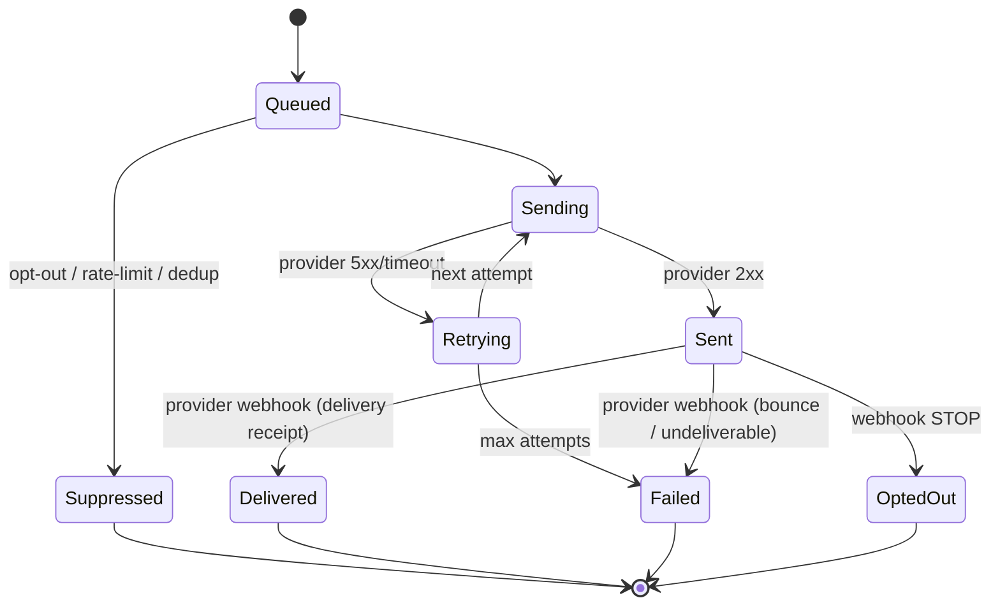

# communication-gateway-service — Software Requirements Specification

## 1. Introduction

This SRS specifies, for the engineering team, the functional,
non-functional, data, security, and operational requirements of
`communication-gateway-service`. It is derived from `BRD.md`
and from the platform's cross-service architecture.

## 2. Scope

In scope:

- All REST endpoints listed in `INTEGRATION.md` (send, get
  send, OTP, webhooks, admin).
- Provider routing with primary + fallback per channel.
- Rate limiting (per provider, per destination).
- Opt-out handling.
- Webhook ingestion and signature verification.
- Outbound events `comms.sms.sent.v1`, `comms.email.sent.v1`,
  `comms.push.sent.v1`, `comms.send.failed.v1`.

Out of scope:

- Notification templates, user preferences — `notification-service`.
- User identity, KYC.
- Provider-side data (e.g. Twilio's contact list).

## 3. System Context

```mermaid
flowchart LR
    N[notification-service] -->|POST /v1/sends| CG[communication-gateway-service]
    ID[identity-service] -->|POST /v1/otp| CG
    PAY[payment-service] -->|POST /v1/otp| CG
    RSH[ride-safety-service] -->|POST /v1/sends (urgent)| CG
    CG -->|SMS provider| SMS[(Twilio / MessageBird / Unifonic)]
    CG -->|Email provider| EML[(SendGrid / SES)]
    CG -->|Push provider| PUSH[(APNs / FCM)]
    SMS -.->|webhook| CG
    EML -.->|webhook| CG
    PUSH -.->|webhook| CG
    CG -->|comms.*.sent.v1| N
    CG -->|comms.*.sent.v1| AUD[audit-service]
    CG -->|comms.*.sent.v1| AN[analytics-service]
    CFG[configuration-service] -->|configuration.updated.v1| CG
```

## 4. Actors

| Actor | Type | Description |
|-------|------|-------------|
| `notification-service` | system | primary caller; sends push, SMS, email |
| `identity-service` | system | OTP delivery for phone verification |
| `payment-service` | system | OTP delivery for 3DS |
| `ride-safety-service` | system | emergency broadcasts |
| `admin-service` | system | admin operations |
| SMS provider | external | Twilio, MessageBird, Unifonic |
| Email provider | external | SendGrid, SES |
| Push provider | external | APNs, FCM |
| Operations (admin) | human | manage providers, rotate credentials |

## 5. Functional Requirements

| ID | Requirement | Priority |
|----|-------------|----------|
| FR--001 | The service MUST expose `POST /v1/sends` accepting `(channel, recipient, body, idempotency_key, metadata)` and returning a `gateway_request_id` and the chosen provider. For `channel='whatsapp'` the request MUST substitute `body`/`subject` with `whatsapp_template_name` + `whatsapp_template_language` + `whatsapp_variables`. | MUST |
| FR--002 | The service MUST route to the configured primary provider for the channel, with circuit-breaker-driven failover to the fallback. | MUST |
| FR--003 | The service MUST enforce per-provider QPS limits (token bucket). | MUST |
| FR--004 | The service MUST enforce per-destination rate limits (per phone for SMS, per email for email, per device for push, per phone for WhatsApp). | MUST |
| FR--005 | The service MUST check opt-outs before any provider call; if the recipient is opted out, suppress the send and return `OPTED_OUT`. | MUST |
| FR--006 | The service MUST expose `POST /v1/otp` accepting `(phone, code, ttl_seconds)` and delivering via the SMS channel with stricter rate limits. | MUST |
| FR--007 | The service MUST ingest provider webhooks for delivery receipts, opt-outs, and bounces; update the send disposition. For WhatsApp additionally ingest `accepted`, `read`, and `template_status_update` events. | MUST |
| FR--008 | The service MUST verify webhook signatures using the algorithm in `providers.webhook_signature_algorithm` and the header name in `providers.webhook_signature_header` (HMAC-SHA256 by default, RSA-SHA256 supported for APNs). | MUST |
| FR--009 | The service MUST retry transient provider failures (5xx, timeout) with exponential backoff (3 attempts). | MUST |
| FR--010 | The service MUST emit `comms.sms.sent.v1` on successful SMS ack, `comms.email.sent.v1` on email ack, `comms.push.sent.v1` on push ack, `comms.whatsapp.accepted.v1` on WhatsApp provider pipeline ack. | MUST |
| FR--011 | The service MUST emit `comms.send.failed.v1` on persistent failure. For WhatsApp also emit the channel-specific `comms.whatsapp.failed.v1`. | MUST |
| FR--012 | The service MUST support regional provider routing (per phone country code, per email domain, per recipient country code for WhatsApp). | MUST |
| FR--013 | The service MUST support a mock provider for dev / test / CI per channel (including `whatsapp`). | MUST |
| FR--014 | The service MUST allow admin to rotate provider credentials without downtime. | MUST |
| FR--015 | The service MUST expose `GET /v1/sends/{gateway_request_id}` returning the send's current disposition. | MUST |
| FR--016 | The service MUST require `Idempotency-Key` on `POST /v1/sends` and `POST /v1/otp`. | MUST |
| FR--017 | The service MUST require HMAC signature on `POST /v1/admin/providers/rotate`. | MUST |
| FR--018 | The service MUST support `priority=urgent` on `POST /v1/sends` to bypass rate limits and opt-outs (for safety broadcasts). | MUST |
| FR--019 | The service MUST validate every input against JSON Schema. | MUST |
| FR--020 | The service MUST document an OpenAPI 3.1 spec at `/openapi.json`. | MUST |
| FR--021 | The service MUST support a "test mode" that delivers to a sandbox (e.g. Twilio test credentials). | SHOULD |
| FR--022 | The service MUST NOT log raw phone numbers, email addresses, device tokens, or WhatsApp phone numbers in plain text; use SHA-256 recipient hash. | MUST |
| FR--023 | The service MUST support webhook replay (idempotent on `webhook_event_id`). | MUST |
| FR--024 | The service MUST cache opt-out lookups in Redis with sub-millisecond reads. | MUST |
| FR--025 | The service MUST expose `GET /v1/admin/sends` and `GET /v1/admin/optouts` for ops. | MUST |
| FR--050 | The service MUST onboard a new provider (any channel, any vendor) via `POST /v1/admin/providers` with no schema change. The request MUST include a capability list drawn from the canonical matrix; unknown capabilities return 422 `UNKNOWN_CAPABILITY`. | MUST |
| FR--051 | The service MUST answer "does provider X support capability Y?" by reading `comms_gateway.provider_capabilities` — no adapter-class hard-coding. | MUST |
| FR--052 | The service MUST expose `POST /v1/templates/submit`, `GET /v1/templates/{id}/status`, `DELETE /v1/templates/{id}` for the WhatsApp template approval lifecycle. These endpoints MUST be callable only by `notification-service`. | MUST |
| FR--053 | The service MUST ingest the provider's WhatsApp `template_status_update` webhook, look up the matching `sends` row by `provider_template_id` (or `provider_message_id`), and emit `comms.whatsapp.template_status_update.v1` for `notification-service` to update the template + write a new `template_history` snapshot. | MUST |
| FR--054 | The service MUST persist the WhatsApp 24h-window snapshot on every send (`sends.whatsapp_window_anchor_at`, `sends.whatsapp_window_window_seconds`). These columns are NULL for non-WhatsApp sends. | MUST |
| FR--055 | The service MUST persist the encrypted rendered WhatsApp components on every WhatsApp send (`sends.whatsapp_template_components_encrypted BYTEA`) for audit/replay. | MUST |
| FR--056 | The service MUST isolate WhatsApp circuit-breaker state from SMS/email/push so that a WhatsApp provider outage does not consume SMS/email/push capacity. | MUST |
| FR--057 | The service MUST refuse a WhatsApp send whose `whatsapp_template_status != 'accepted'` (i.e. when the provider rejected the immediate payload even though the template was pre-approved), returning 422 `PROVIDER_REJECTED`. | MUST |
| FR--058 | The service MUST expose `GET /v1/admin/providers/{name}/capabilities` returning the capability profile for a provider, and `POST /v1/admin/providers/capabilities` to add/disable an individual capability without re-registering the provider. | MUST |

## 6. Non-Functional Requirements

| ID | Category | Requirement | Target |
|----|----------|-------------|--------|
| NFR--001 | performance | P99 send (push) | ≤ 500 ms |
| NFR--002 | performance | P99 send (SMS) | ≤ 1.5 s |
| NFR--003 | performance | P99 send (email) | ≤ 2 s |
| NFR--004 | performance | P99 OTP delivery | ≤ 15 s |
| NFR--005 | availability | service uptime | 99.9% (T2) |
| NFR--006 | scalability | sends per second per replica | ≥ 200 |
| NFR--007 | maintainability | MTTR | ≤ 30 min |
| NFR--008 | correctness | opt-out honor latency | ≤ 1 min |
| NFR--009 | observability | all errors have `correlation_id` and `trace_id` | 100% |
| NFR--010 | auditability | all sends in audit log | 100% |
| NFR--011 | resilience | single provider outage → fallback | ≤ 5s |
| NFR--050 | performance | P99 WhatsApp send (template_send path) | ≤ 1.5s |
| NFR--051 | correctness | provider template status updates reconciled within 5s of receipt (idempotent on `event_id`) | ≤ 5s |
| NFR--052 | resilience | WhatsApp circuit breaker isolated from SMS/email/push | 100% isolation |
| NFR--053 | extensibility | new provider onboarded in ≤ 1 hour via `POST /v1/admin/providers` (no deploy, no schema change) | ≤ 1h |
| NFR--054 | policy | WhatsApp 24h window snapshot persisted on every send | 100% |
| NFR--055 | observability | every webhook produces a structured log line + an emission of `comms.<channel>.<state>.v1` | 100% |

## 7. API Requirements

- All public endpoints follow `architecture/API_STANDARDS.md`:
  - REST, JSON, UTF-8.
  - URI versioned (`/v1/...`).
  - Bearer JWT (validated at gateway); internal calls use
    client-credentials tokens.
  - Errors follow the platform envelope (see INTEGRATION.md).
  - `Idempotency-Key` required on state-changing POSTs.
  - `X-Correlation-Id` and `traceparent` propagated.

(Full contract in INTEGRATION.md.)

## 8. Data Requirements

| ID | Requirement | Notes |
|----|-------------|-------|
| DATA--001 | All tables live in schema `comms_gateway`. | per `DATABASE_ARCHITECTURE.md` |
| DATA--002 | Phone, email, device token, WhatsApp phone stored encrypted (`pgcrypto`). | PII |
| DATA--003 | Recipient hash (SHA-256) stored alongside the encrypted value for fast lookup. | |
| DATA--004 | `sends` partitioned by `created_at` (monthly). | high volume |
| DATA--005 | Primary keys are UUIDv7. | per platform standard |
| DATA--006 | Cross-service references (`user_id`, `notification_id`) are UUID columns WITHOUT database FKs. | per `DATA_OWNERSHIP.md` |
| DATA--007 | Every mutable table has `created_at`, `updated_at`, `created_by`, `updated_by`, `deleted_at`. | |
| DATA--008 | Provider credentials stored only in Vault; the schema stores only a reference (path). | per `SECURITY_ARCHITECTURE.md` §5 |
| DATA--030 | `comms_gateway.provider_capabilities` row per `(provider_id, capability)` is the data-driven plug-in contract; capabilities are looked up by name at routing time. | per [`WHATSAPP_PROVIDER_CONTRACT.md`](./WHATSAPP_PROVIDER_CONTRACT.md) |
| DATA--031 | `comms_gateway.sends` carries the WhatsApp provider-template fields (`whatsapp_template_id`, `whatsapp_template_language`, `whatsapp_template_status`, `whatsapp_template_components_encrypted`) and the 24h-window snapshot (`whatsapp_window_anchor_at`, `whatsapp_window_window_seconds`) for `channel='whatsapp'` only. | |

## 9. Validation Rules

- **FR--001 (send)**: `channel ∈ {sms, email, push, whatsapp}`;
  `recipient` valid per channel (E.164 for SMS, RFC 5322
  for email, opaque string for push token, E.164 for WhatsApp);
  for SMS/email/push, `body` non-empty, ≤ 1600 chars (SMS) /
  100KB (email) / 4KB (push); for WhatsApp, `whatsapp_template_name`
  and `whatsapp_template_language` are non-empty strings,
  `whatsapp_variables` is an object with positional keys `"1"`,
  `"2"`, … matching the registered `body_structured.variables[].index`;
  `idempotency_key` UUID; `metadata` optional JSON.
- **FR--006 (OTP)**: `phone` E.164; `code` 4-8 digits; `ttl_seconds`
  60..900.
- **FR--007 (webhook)**: provider signature valid (header +
  algorithm per `providers.webhook_signature_*`); payload
  matches provider's schema; `event_type` ∈ canonical list
  (extended for WhatsApp with `accepted`/`read`/`template_status_update`).
- **FR--017 (admin)**: HMAC signature valid; new credentials
  non-empty.
- **FR--050 (provider onboarding)**: `name` unique; `channel` ∈
  canonical list; `provider_kind` ∈ canonical list; every
  `capabilities[].capability` ∈ canonical matrix (else 422
  `UNKNOWN_CAPABILITY`); the named provider's `vault_credential_path`
  resolves in Vault at registration time.

## 10. State Transitions

Pointer: see `WORKFLOWS.md` §1, §2, §3. The send state
machine:



## 11. Authorization Requirements

- `POST /v1/sends`: role `service` (only
  `notification-service`, `identity-service`,
  `payment-service`, `ride-safety-service`).
- `POST /v1/otp`: role `service` (only `identity-service`,
  `payment-service`).
- `GET /v1/sends/{id}`: role `service` or `admin` or
  `support_agent`.
- Webhook endpoints: provider signature verified (no JWT).
- `POST /v1/admin/providers/rotate`: role `admin` or
  `platform_engineer` + HMAC + mTLS.

## 12. Configuration Requirements

- `comms.sms.provider`, `comms.sms.fallback_provider`.
- `comms.email.provider`, `comms.email.fallback_provider`.
- `comms.push.ios.provider`, `comms.push.android.provider`.
- `comms.rate_limit.sms.per_phone_per_minute` (default 5).
- `comms.rate_limit.sms.per_provider_qps` (default 1000).
- `comms.rate_limit.email.per_recipient_per_minute` (default
  10).
- `comms.rate_limit.push.per_device_per_minute` (default
  60).
- `comms.otp.ttl_seconds` (default 300).
- `comms.otp.max_attempts` (default 5).
- `comms.regional_routing` (map of country code → provider).
- All keys hot-reloadable on `configuration.updated.v1`.

## 13. Error Handling

| Error | When | Response |
|-------|------|----------|
| `VALIDATION_FAILED` | input schema or business validation fails | 400 |
| `UNAUTHENTICATED` | missing / invalid bearer | 401 |
| `FORBIDDEN` | role missing | 403 |
| `NOT_FOUND` | send not found | 404 |
| `RATE_LIMITED` | per-provider or per-destination limit exceeded | 429 with `Retry-After` |
| `OPTED_OUT` | recipient is on the opt-out list | 422 |
| `CIRCUIT_OPEN` | all providers' circuits open for the channel | 503 |
| `DEPENDENCY_TIMEOUT` | provider timeout after retries | 504 |
| `SIGNATURE_INVALID` | webhook signature mismatch or admin HMAC mismatch | 401 / 409 |
| `IDEMPOTENCY_KEY_REUSED` | key with different body | 422 |
| `INTERNAL_ERROR` | unexpected | 500 |

## 14. Concurrency Requirements

- Per-destination rate limits use Redis token bucket (atomic
  `INCR` + `EXPIRE`).
- Per-provider QPS uses a single in-process token bucket per
  replica; replicas are not synchronized (each replica has
  its own bucket; the sum is `replicas * qps`).
- Webhook processing is idempotent on `webhook_event_id`
  (inbox pattern).
- Send rows use optimistic concurrency on `version` for
  state transitions.

## 15. Idempotency Requirements

- `POST /v1/sends` and `POST /v1/otp` require
  `Idempotency-Key`. The service stores
  `(actor_sub, idempotency_key, request_hash, response_status,
  response_body, expires_at)` for 24h. On duplicate, if
  `request_hash` matches → return stored response; else 422
  `IDEMPOTENCY_KEY_REUSED`.
- Provider calls use the gateway's `Idempotency-Key` (we
  forward ours).
- All event emissions are guarded by the outbox pattern.
- Webhook processing is idempotent on `webhook_event_id`.

## 16. Performance

- **Dominant path**: `POST /v1/sends` (push).
- **P50 / P95 / P99** (push): 50ms / 200ms / 500ms.
- **P50 / P95 / P99** (SMS): 200ms / 800ms / 1.5s.
- **P50 / P95 / P99** (email): 300ms / 1s / 2s.
- **P50 / P95 / P99** (OTP): 1s / 3s / 15s.
- Throughput target: 200 sends/s per replica at P99.

## 17. Scalability

- **Horizontal scaling**: stateless replicas behind a load
  balancer. HPA on CPU 60% and on
  `comms_sends_per_second > 200`. Max replicas 20.
- **Vertical scaling**: typical 500m CPU / 768Mi memory
  requests; 1 CPU, 1.5Gi limits.
- **Webhook ingestion**: stateless; behind a dedicated
  load balancer; auto-scales on request rate.

## 18. Availability

- **SLO**: 99.9% over 30 days. Error budget: ~44 min / 30d.
- **Maintenance window**: Sunday 04:00–06:00 UTC.
- **Provider outage tolerance**: must fall back to the
  secondary provider within 5s.

## 19. Security

| ID | Requirement | Notes |
|----|-------------|-------|
| SEC--001 | All endpoints require bearer JWT; mTLS for admin. | per `SECURITY_ARCHITECTURE.md` §4, §14 |
| SEC--002 | Provider credentials in Vault, rotated quarterly. | per §5 |
| SEC--003 | Webhook signature verification (HMAC-SHA256) for all providers. | per §14 |
| SEC--004 | Phone, email, device token encrypted at rest with `pgcrypto` (DEK from KEK in Vault). | per §6, §7 |
| SEC--005 | Recipient hash (SHA-256) used in logs to avoid PII leakage. | per §7 |
| SEC--006 | Per-provider, per-destination rate limits. | per §12 |
| SEC--007 | Admin endpoint requires role + HMAC + mTLS; high-value actions (key rotation) require co-signature. | per §14 |
| SEC--008 | Every send and failure audited (send row + `comms.*.sent.v1` event). | per §9 |
| SEC--009 | No PAN, CVV, or financial PII ever processed. | per §8 |
| SEC--010 | Opt-out list respected; opt-out webhook ingestion verifies provider signature. | per §10, §14 |

## 20. Privacy

- **PII stored**: phone, email, device token (Confidential).
- **Retention**: send log 90 days; opt-out list while the
  opt-out is in effect (and indefinitely if the user has not
  opted back in).
- **Erasure**: on right-to-erasure request via
  `support-service`, the user's sends are anonymized (raw
  PII purged, `recipient_hash` retained for analytics).

## 21. Auditability

- **Audit events**:
  - `comms.sms.sent.v1` / `comms.email.sent.v1` /
    `comms.push.sent.v1` — every successful provider ack.
  - `comms.send.failed.v1` — every persistent failure.
  - `comms.provider.rotated.v1` — every provider key
    rotation (high-severity).
- The `sends` table is append-mostly (state transitions are
  updates, not soft delete); partitioned by month; 90-day
  retention.

## 22. Observability

- **Logs**: JSON to stdout; per `OBSERVABILITY.md`. Standard
  fields plus `gateway_request_id`, `channel`, `provider`,
  `recipient_hash`, `attempt`, `latency_ms`, `status`.
- **Metrics** (Prometheus):
  - `http_requests_total{route, method, status}`
  - `http_request_duration_seconds{route, method, status}` (histogram)
  - `comms_sends_total{channel, provider, status}` (status:
    `sent`, `delivered`, `failed`, `suppressed`, `opted_out`)
  - `comms_send_seconds{channel}` (histogram)
  - `provider_circuit_state{channel, provider}` (gauge)
  - `provider_rate_limit_remaining{channel, provider}` (gauge)
  - `comms_optouts_total{channel, reason}`
- **Traces**: OpenTelemetry; root span per send; provider
  call as child span.
- **Alerts**:
  - Provider circuit open ≥ 5 min → page.
  - Send failure rate > 5% over 5 min → page.
  - Opt-out honor latency > 1 min → warn.

## 23. Maintainability

- **Code style**: TypeScript strict, ESLint, Prettier.
- **Test coverage**: ≥ 85% statements.
- **Documentation**: OpenAPI 3.1 spec; CI validates.

## 24. Disaster Recovery

- **RPO**: 1h. Send log can be rebuilt from the audit events.
- **RTO**: 30 min. Stateless service; replicas can be
  promoted.

## 25. Acceptance Criteria

- All 25 functional requirements implemented and verified.
- All 11 non-functional requirements met.
- All 10 security requirements verified by an internal
  security review.
- A simulated primary provider outage in staging results in
  automatic fallback within 5s.
- An opt-out webhook from Twilio results in the next send
  to that phone being suppressed.
- OTP delivery P95 ≤ 5s in the load test.
- Provider credentials are loaded from Vault and never
  appear in logs.

---

## See also

### Sibling docs for this service

- [`README.md`](./README.md) — purpose, bounded context, responsibilities
- [`BRD.md`](./BRD.md) — business requirements
- [`SRS.md`](./SRS.md) — functional + non-functional requirements
- [`ERD.md`](./ERD.md) — data model (entities, relationships)
- [`INTEGRATION.md`](./INTEGRATION.md) — inter-service contracts (APIs, events, sagas)
- [`WORKFLOWS.md`](./WORKFLOWS.md) — operational workflows (happy paths, failure modes)
- [`TECH.md`](./TECH.md) — technology profile (runtime, libraries, data layer, admin endpoints, RBAC)
- [`PLAN.md`](./PLAN.md) — implementation tracker (11 phases including WhatsApp)
- [`WHATSAPP_PROVIDER_CONTRACT.md`](./WHATSAPP_PROVIDER_CONTRACT.md) — plug-in provider capability matrix, onboarding playbook

### Platform-wide

- [`../../shared/README.md`](../../shared/README.md) — `platform-spring-boot-starter` shared library (the single source of cross-cutting code for all Spring Boot services in the platform)
- [`../RECOMMENDATIONS.md`](../RECOMMENDATIONS.md) — platform-wide technology map (language, framework, version baseline, admin/RBAC pattern)
- [`../../README.md`](../../README.md) — services overview (the catalog of all 58 services)
- [`../../../main.md`](../../../main.md) — top-level platform specification (architecture, Keycloak, PostgreSQL 18, messaging, observability baseline)

