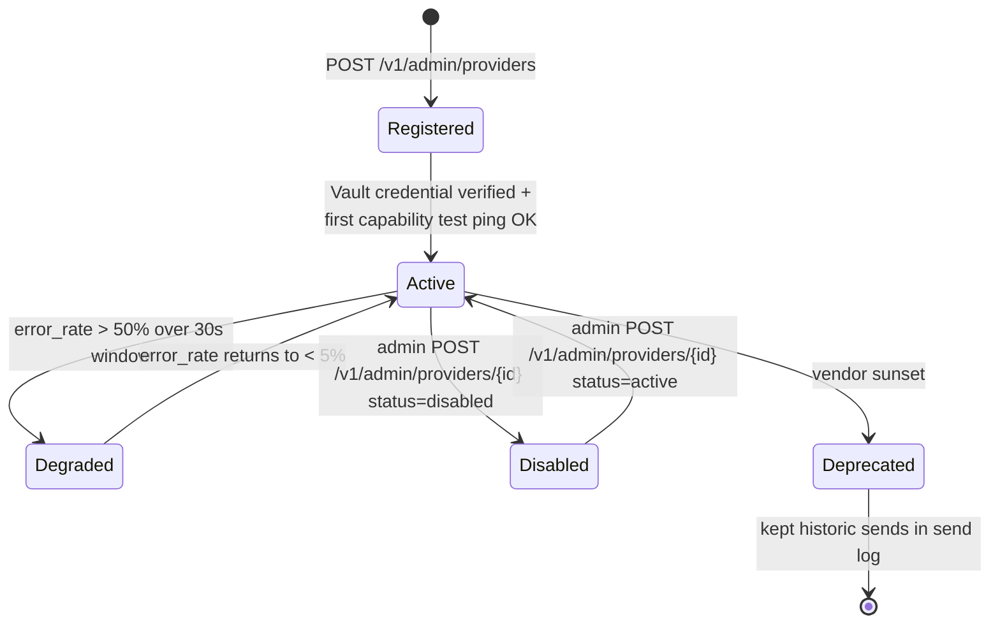
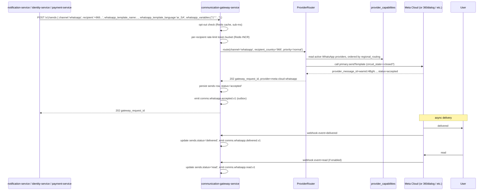

# communication-gateway-service — WhatsApp Provider Plug-in Contract

> Companion to [`README.md`](./README.md), [`ERD.md`](./ERD.md)
> (`Provider`, `ProviderCapability` entities), and
> [`INTEGRATION.md`](./INTEGRATION.md) (`POST /v1/admin/providers`,
> `POST /v1/templates/submit`, `GET /v1/templates/{id}/status`,
> `DELETE /v1/templates/{id}`, `POST /v1/webhooks/whatsapp/{provider}`).
> This document is the **single source** for *what* a plug-in
> provider must do to be onboarded, *how* the plug-in is
> represented in the database, *how* the gateway routes sends
> to it, and *how* templates / webhooks / opt-outs are
> coordinated with it.

The contract is intentionally **WhatsApp-shaped but
provider-agnostic**. It was written to onboard Meta Cloud API
direct, 360dialog, MessageBird WhatsApp, Gupshup, and Twilio
WhatsApp, but the same shape will accommodate Telegram, RCS,
or any future plug-in (FCM via APNs-compatible path already
uses this pattern for push). Adding a provider requires **zero
schema changes** — only an admin POST and a Vault credential
entry.

---

## 1. The capability matrix

Every provider advertises a set of **capabilities** from the
canonical list below. The gateway looks up capabilities by
name at runtime; there is no adapter-class name lookup
anywhere on the hot path.

| Capability | Channel | Required for WhatsApp? | Description |
|------------|---------|------------------------|-------------|
| `send_template` | `whatsapp`, `push` (optional) | required | Send a pre-approved template with parameter substitution. |
| `send_freeform_within_window` | `whatsapp` | optional | Send a freeform (session) message within the recipient's 24h customer-service window. |
| `send_plain_text` | `sms` | required for SMS | |
| `send_html_email` | `email` | required for email | |
| `media_upload` | `whatsapp`, `email`, `push` | required for WhatsApp (header-media) | Upload media first; reference by id in template send. |
| `template_submit` | `whatsapp` | required | Submit a template to the provider for approval. |
| `template_status` | `whatsapp` | required | Poll a template's provider-side approval status. |
| `webhook_signed_hmac_sha256` | `whatsapp`, `email`, `sms` | required for WhatsApp | Provider posts signed webhooks via `X-Hub-Signature-256` (or vendor equivalent). |
| `webhook_signed_rsa_sha256` | `push` (APNs) | n/a | Apple-signed webhooks. |
| `health_metrics` | all | required | Per-provider p50 / p95 / p99 latency + error rate. |
| `regional_routing` | all | optional | Country code → provider priority map. |
| `optout_keyword_stop` | `sms`, `whatsapp` | required for WhatsApp | Provider forwards a STOP keyword (per template or channel-wide) to `webhook_optout` for us to persist into `optouts`. |
| `template_deletion` | `whatsapp` | required | Admin-initiated delete of the provider's pre-approved template. |
| `language_negotiation` | `whatsapp`, `email` | required for WhatsApp | The provider supports per-send language overrides (`ar_SA`, `en_US`, …). |

The gateway refuses to onboard a provider that does NOT
assert the required capabilities for its `channel`. A Meta
Cloud provider with `template_submit` missing is rejected at
registration time with 422.

### 1.1 Capability parameters

Each capability may carry a free-form `parameters JSONB`
document. Common parameter keys (vendor-specific):

```jsonc
{
  "max_template_body_chars":      1024,
  "max_header_media_bytes":       16777216,
  "max_buttons_per_template":     10,
  "max_button_text_chars":        25,
  "supports_carousel":            true,
  "supports_video_header":        true,
  "regional_availability":        { "966": true, "971": true, "1": false }
}
```

The gateway reads these at routing time but does not enforce
strict semantic constraints; the provider SDK may reject at
send time with its own error codes.

## 2. Adapter contract

Each adapter implements a small, well-typed interface. Code
that uses an adapter asks "what can you do?" via the
capability matrix — never "what type are you?". The exact
class names live in code, NOT in this contract, so any vendor
can be added without touching the contract.

```text
// Pseudo-code (illustrative; final shape lives in the codebase).
interface ProviderAdapter {
  // Capability query (the canonical contract — nothing else
  // matters for routing decisions).
  capabilities(): Set<Capability>;

  // Template lifecycle.
  submitTemplate(req: SubmitTemplateRequest): Promise<{ providerTemplateId: string; status: 'submitted' | 'approved' | 'rejected' }>;
  getTemplateStatus(providerTemplateId: string): Promise<{ status: 'submitted' | 'approved' | 'rejected' | 'paused'; rejectReason?: string; approvedAt?: Date; language: string }>;
  deleteTemplate(providerTemplateId: string): Promise<void>;

  // Send path.
  sendTemplate(req: SendTemplateRequest): Promise<{ providerMessageId: string; status: 'accepted' | 'sent' | 'delivered' | 'failed' | 'read'; failureReason?: string; raw: unknown }>;

  // Freeform (only if capability asserted).
  sendFreeform?(req: SendFreeformRequest): Promise<…>;

  // Media (only if capability asserted).
  uploadMedia?(req: UploadMediaRequest): Promise<{ mediaId: string }>;

  // Health.
  health(): Promise<{ p50_latency_ms: number; p95_latency_ms: number; p99_latency_ms: number; error_rate: number; circuit_state: 'closed' | 'open' | 'half_open' }>;

  // Webhook signature verification (vendor-specific).
  verifyWebhookSignature(rawBody: Buffer, headers: Record<string, string>): boolean;
}
```

Adapter authors do NOT need to subclass a base class; the
gateway's `ProviderRouter` finds an adapter for a `(channel,
provider_name)` pair at startup and consults its
`capabilities()` to decide which sub-routes it can serve.

## 3. Provider lifecycle



State transitions are persisted on `providers.status` and
`provider_health.circuit_state`. A deprecated provider is
**never deleted** — its sends (and their audit chain) remain
for retention.

## 4. WhatsApp send path



The 24h customer-service window enforcement happens at
`RR` step 4: if `notification.whatsapp.template_24h_window_enforced=true`
AND the template is freeform AND the recipient's last inbound
message is more than `comms.whatsapp.window.seconds` ago, RR
refuses with 422 `WINDOW_EXPIRED`. Pre-approved structured
templates always pass.

## 5. Failure handling

| Failure | Handling |
|---------|----------|
| Provider 5xx | retry 3× with exponential backoff (1s, 5s, 25s); if all fail, mark `sends.status='failed'`, emit `comms.whatsapp.failed.v1` |
| Provider 429 | honor `Retry-After`; on sustained 429, open circuit |
| Provider 4xx (except 429) | no retry; immediate failure |
| `RATE_LIMITED` from our per-recipient bucket | 429 with `Retry-After` (caller may retry with backoff) |
| `OPTED_OUT` | 422, `optouts` already cached in Redis |
| `TEMPLATE_NOT_APPROVED` | 422 — admins must approve via `POST /v1/templates/{id}/approve` |
| `WINDOW_EXPIRED` | 422 — pre-approved structured templates always pass; freeform refuses |
| `MEDIA_UPLOAD_FAILED` | 422 — re-upload or fall back to text |
| Circuit `open` | RR tries fallback (`comms.whatsapp.fallback_provider` or next `comms.whatsapp.regional_routing`); if all open, 503 `CIRCUIT_OPEN` |

## 6. Onboarding playbook (operator runbook)

### 6.1 Onboard a new WhatsApp provider (zero schema change)

1. **Obtain credentials** from the vendor — typically a
   `client_id` / `client_secret` (or bearer token), a
   `waba_id` / `phone_id` (for Meta Cloud), and the webhook
   signing secret.
2. **Write to Vault** at
   `kv/platform/<env>/comms-gateway/whatsapp/<provider_name>`.
   The path is what `providers.vault_credential_path` will
   reference. Use Vault's
   `kv put kv/platform/prod/comms-gateway/whatsapp/meta-cloud
   client_id=... client_secret=... waba_id=... phone_id=... webhook_secret=...`.
3. **POST /v1/admin/providers** with the new provider's
   capability list (see §1).
4. **Set the active provider** by toggling
   `comms.whatsapp.provider` in `configuration-service`.
   Optionally also add to `comms.whatsapp.regional_routing`
   for country-specific preferences.
5. **Send a test message** via `POST /v1/sends` (admin
   HMAC; recipient one of the dev/test phones). Confirm 202.
6. **Reconcile webhooks**: trigger the provider's webhook
   (or use its developer console to send a test event).
   Confirm the gateway persists a `webhook_events` row with
   `signature_verified=true` and emits the channel-specific
   `comms.whatsapp.*.v1` event.
7. **Enable globally** by removing the country-level
   `comms.whatsapp.enabled=false` flag.

### 6.2 Roll over a provider (no downtime)

1. **Add the new provider** as a separate row in
   `providers` (step 6.1 above, with a different
   `vault_credential_path`).
2. **Mirror** existing provider's capability profile as the
   new provider's profile.
3. **Toggle** `comms.whatsapp.fallback_provider` to the new
   provider name for the first region.
4. **Watch** the dashboard for the next 24h; flip the primary
   once fallback activation rate is consistent.
5. **Retire** the old provider by setting
   `providers.status='disabled'`.

### 6.3 Onboard a future non-WhatsApp plug-in (e.g. Telegram)

The same onboarding flow applies. Differences:

- The CHECK `capability IN (...)` may need a migration
  (e.g. adding `send_telegram_text`). One-line migration
  documented in `ERD.md` §11.
- The webhook path uses the new channel, e.g.
  `POST /v1/webhooks/telegram/{provider}`.
- The `events` table (in your home-grown database for this
  provider) would grow new `comms.telegram.*.v1` events.
- All consumer docs already say *"channel-agnostic where
  practical"* — most consumers (audit, analytics) handle
  the new event family by the same idempotent mechanisms
  without changes.

## 7. Webhook signing cheat-sheet

| Vendor | Header | Algorithm | Verification |
|--------|--------|-----------|--------------|
| Meta Cloud | `X-Hub-Signature-256` | HMAC-SHA256 | `sha256=<hex>` over raw body with webhook secret (per `providers.webhook_signature_header='X-Hub-Signature-256'` + `webhook_signature_algorithm='hmac_sha256'`). |
| 360dialog | `X-Webhook-Signature` | HMAC-SHA256 | Same algorithm, header name differs. |
| Twilio WhatsApp | `X-Twilio-Signature` | HMAC-SHA1 (legacy) | Twilio-style signature; described in Twilio's docs. |
| MessageBird WhatsApp | `MessageBird-Signature` | HMAC-SHA256 | |
| Gupshup | `X-Gupshup-Signature` | HMAC-SHA256 | |
| APNs | (JWT bearer in header) | ECDSA P-256 | token verified using Apple's public key |

`providers.webhook_signature_header` and
`providers.webhook_signature_algorithm` hold the per-provider
configuration. The verification call is identical at the
adapter level: `adapter.verifyWebhookSignature(rawBody, headers)`.

## 8. Provider-scoped rate limits

| Limit | Where |
|-------|-------|
| Per-recipient per minute (`comms.rate_limit.whatsapp.per_recipient_per_minute`) | Redis token bucket per recipient hash; enforced before provider call |
| Per-provider QPS (`comms.rate_limit.whatsapp.per_provider_qps`) | Redis token bucket per provider; enforced before provider call |
| WhatsApp Business per-waba phone-number QPS | vendor-specific (`parameters.per_waba_qps_max`); we honor the lower of (a) our config and (b) the parameter |
| Destination phone quota (`per_phone_per_day` etc.) | enqueued by `notification-service` (per `notification.whatsapp.*` configs); enforced by token bucket in Redis |

## 9. Operational guardrails

1. **Opt-out semantics**: WhatsApp STOP / template-scoped opt-out
   flows:
   - Provider posts `optout` webhook for a STOP keyword on a
     template.
   - Gateway writes `(channel='whatsapp', recipient_hash)` into
     `comms_gateway.optouts`.
   - Notification-service mirrors a `(user_id, channel='whatsapp',
     category=<template_category>)` row in `notification.preferences`
     for per-category override.
   - Future sends honor both: a STOP on a marketing template only
     blocks marketing, not transactional.
2. **Personal-data redaction**: provider responses are stored
   in `sends.provider_response_body` (JSONB) and
   `webhook_events.payload` (JSONB) for forensics, but PII is
   never logged in plain text — see [SECURITY_ARCHITECTURE.md §7](../security-arch-not-here).
3. **Idempotency**: every send is keyed on
   `request_idempotency_key` (or — when missing — on
   `gateway_request_id`). Webhook ingestion is idempotent on
   `webhook_event_id`. Reconciler jobs periodically scan for
   sends that are stuck in `queued` > 30s and resubmit them.
4. **At-least-once delivery**: every send has retries. The
   caller is responsible for idempotency on their side; we
   duplicate-suppress on our side via `request_idempotency_key`.

---

## 10. Acceptance criteria for an onboarding

A WhatsApp provider is "onboarded" when:

1. `POST /v1/admin/providers` returns 201 with
   `capabilities_registered` matching the canonical list.
2. Vault credential path resolves via
   `comms-gateway-credentials` ServiceAccount.
3. Test `POST /v1/sends` returns 202 with a valid
   `gateway_request_id`.
4. A test webhook from the provider produces a
   `webhook_events` row with `signature_verified=true` and
   emits the correct `comms.whatsapp.<state>.v1` event.
5. The `provider_health` row appears within 60s of the first
   send and reports `circuit_state='closed'`.
6. At least one template is submitted via
   `POST /v1/templates/submit`, the provider's status
   transitions to `approved` via webhook, and a `template_history`
   snapshot is written in `notification-service` with
   `approved_by` populated.
7. An end-to-end send → delivered → read test in staging
   produces `notification.sent.v1`, `notification.delivered.v1`,
   `notification.read.v1`.

---

## See also

### Sibling docs for this service

- [`README.md`](./README.md) — purpose, bounded context, responsibilities
- [`BRD.md`](./BRD.md) — business requirements (BR--040 … BR--046, BR--050 … BR--052)
- [`SRS.md`](./SRS.md) — functional + non-functional requirements (FR--050 … FR--058)
- [`ERD.md`](./ERD.md) — data model (`providers`, `provider_capabilities`, `sends` columns, migration snippet)
- [`INTEGRATION.md`](./INTEGRATION.md) — inter-service contracts (admin endpoints, webhooks, events)
- [`WORKFLOWS.md`](./WORKFLOWS.md) — operational workflows
- [`TECH.md`](./TECH.md) — technology profile
- [`PLAN.md`](./PLAN.md) — implementation tracker (Phase 11 covers this contract)

### Platform-wide

- [`../../shared/PLATFORM_BASELINE.md`](../../shared/PLATFORM_BASELINE.md) — single source for PostgreSQL 18, Kafka, Keycloak, Redis, OpenTelemetry, Vault, deployment, DR
- [`../notification-service/WHATSAPP_TEMPLATES.md`](../notification-service/WHATSAPP_TEMPLATES.md) — partner doc: the structured-template model + approval workflow
- [`../notification-service/PLAN.md`](../notification-service/PLAN.md) — notification-side implementation tracker
- [`../../README.md`](../../README.md) — services overview
- [`../../../main.md`](../../../main.md) — top-level platform specification
