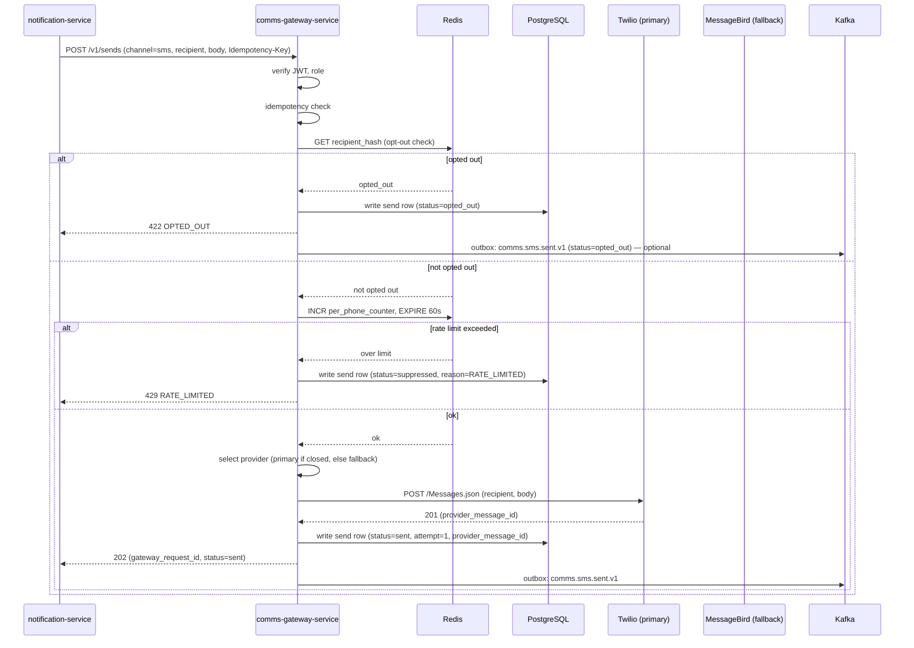
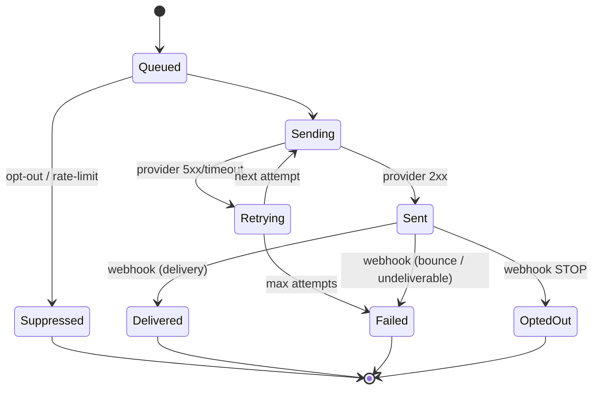
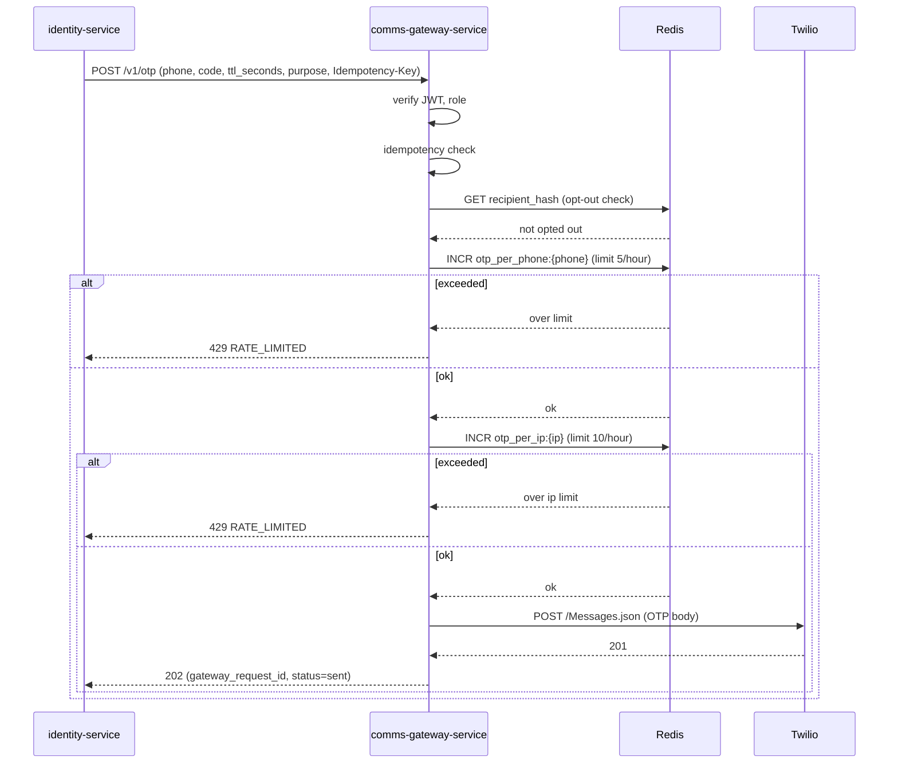
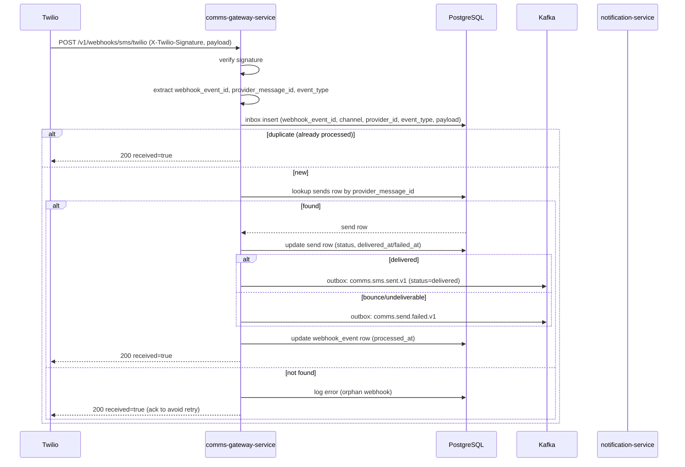
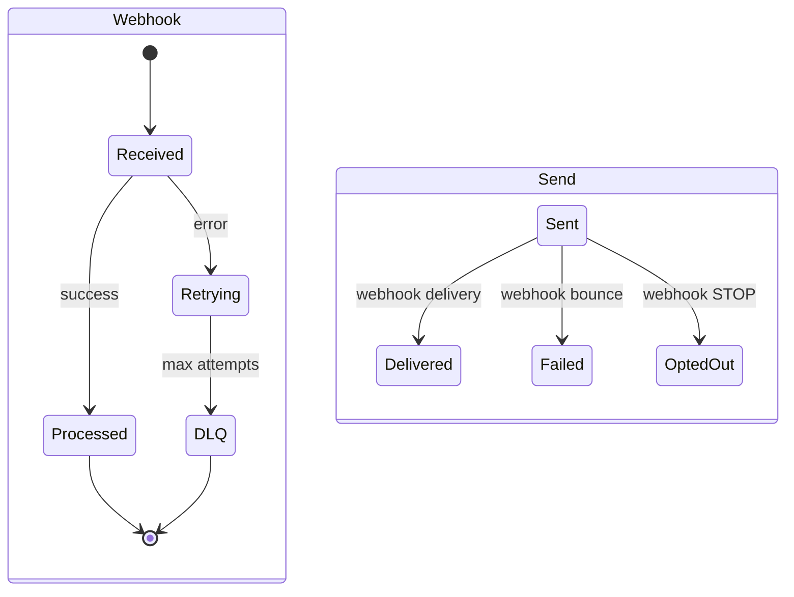
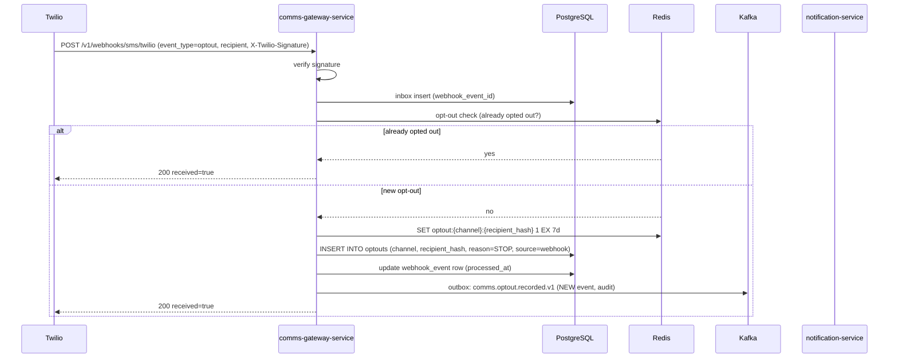
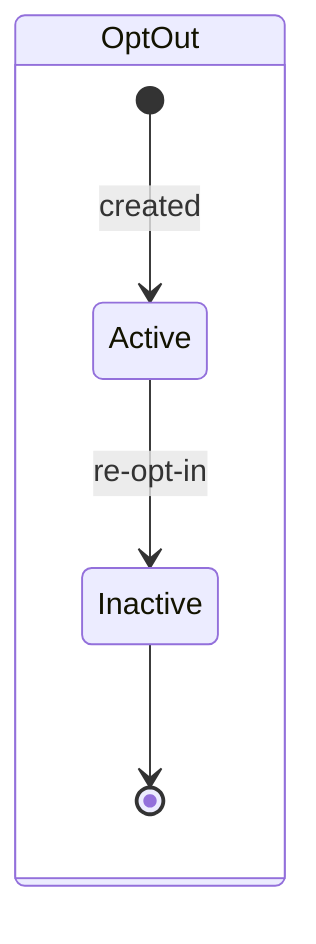
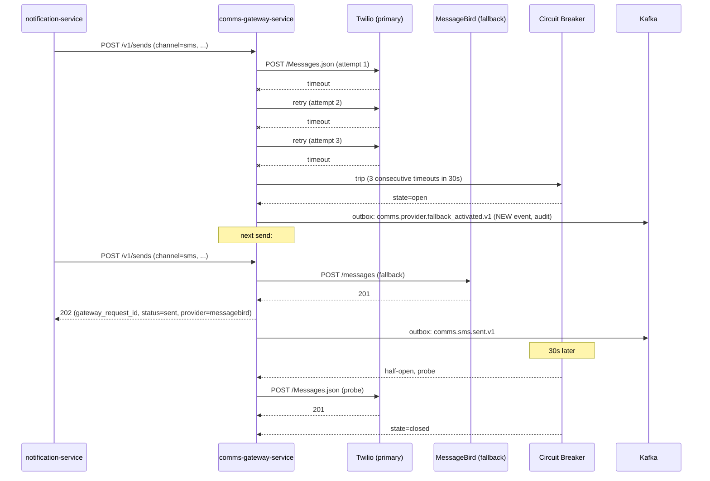
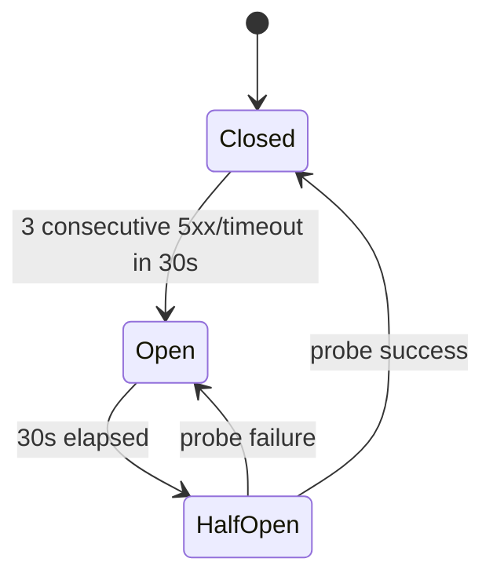

# communication-gateway-service — Workflows

## 1. Send an SMS

### 1.1 Objective

A caller (typically `notification-service`) sends an SMS to
a phone number. The service checks opt-out, rate limits,
provider health, and routes to the appropriate provider with
a fallback if needed.

### 1.2 Initiating Actor

`notification-service` (synchronous `POST /v1/sends`).

### 1.3 Participating Services

- `communication-gateway-service` (this service).
- SMS provider (primary; Twilio).
- SMS provider (fallback; e.g. MessageBird).
- `notification-service` (downstream consumer of
  `comms.sms.sent.v1`).
- `audit-service` (consumer).

### 1.4 Prerequisites

- Caller has role `service`.
- The phone number is E.164.
- `Idempotency-Key` provided.
- The recipient is not opted out.
- The per-phone rate limit is not exceeded.
- At least one provider's circuit is closed.

### 1.5 Happy Path



### 1.6 Alternate Paths

- **Primary provider returns 5xx / timeout**: retried up to
  3 times with backoff. If still failing, the primary
  circuit may open; subsequent sends route to the fallback.
- **Webhook delivery receipt** arrives later: the send row
  is updated to `delivered`; `comms.sms.sent.v1` is
  re-emitted (or the delivery state is propagated via the
  webhook).
- **Recipient format is invalid**: 400 `VALIDATION_FAILED`.
- **Body too long**: 400 `VALIDATION_FAILED` with
  `code=BODY_TOO_LONG`.

### 1.7 Failure Paths

- **All providers' circuits open**: 503 `CIRCUIT_OPEN`; the
  send row is marked `failed` with reason `CIRCUIT_OPEN`.
- **Provider persistently fails**: the send row is marked
  `failed` with reason `PROVIDER_5XX`; `comms.send.failed.v1`
  is emitted.
- **Opt-out detected after rate limit check but before
  provider call** (rare; race): the send is suppressed;
  no provider call; the rate limit counter is decremented
  (or we accept the counter for the rare race; rate limits
  are best-effort).
- **Database write fails** (after provider call succeeded):
  the outbox poller retries; the caller is acked with 202
  (the send was actually sent). The webhook will later
  update the send row.

### 1.8 Business Rules

- BR--010..BR--014, BR--019, BR--022, BR--024.
- FR--001..FR--005, FR--009, FR--011, FR--012, FR--016,
  FR--018, FR--022.

### 1.9 State Transitions



### 1.10 Events

| Event | Direction | When |
|-------|-----------|------|
| `comms.sms.sent.v1` | produced | on status → sent (and on delivered) |
| `comms.send.failed.v1` | produced | on persistent failure |

### 1.11 APIs Involved

| API | Direction | When |
|-----|-----------|------|
| `POST /v1/sends` | inbound | start of flow |
| Twilio / MessageBird | outbound | send |

### 1.12 Compensation / Rollback

- A sent SMS cannot be unsent. If a wrong recipient was
  sent, the recipient's opt-out is recorded and future
  sends are suppressed.
- The fallback provider's send is not rolled back; the
  primary is marked unhealthy and traffic shifts.

### 1.13 Final State

- A `sends` row with the final status (`sent`, `delivered`,
  `failed`, `opted_out`, `suppressed`).
- An outbox row for `comms.sms.sent.v1` (or
  `comms.send.failed.v1`).
- (On delivered) a `webhook_events` row updating the send
  disposition.

## 2. Deliver an OTP

### 2.1 Objective

Deliver a one-time password via SMS for phone verification
or 3DS, with strict per-phone and per-IP rate limits.

### 2.2 Initiating Actor

`identity-service` (phone verification) or `payment-service`
(3DS).

### 2.3 Participating Services

- `communication-gateway-service` (this service).
- SMS provider (primary / fallback).
- `identity-service` (or `payment-service`).

### 2.4 Prerequisites

- Caller has role `service` and is `identity-service` or
  `payment-service`.
- The phone is E.164.
- The per-phone rate limit (5/hour) and per-IP rate limit
  (10/hour) are not exceeded.
- `Idempotency-Key` provided.

### 2.5 Happy Path



### 2.6 Alternate Paths

- **Recipient is opted out**: 422 `OPTED_OUT`. The
  `identity-service` flow typically falls back to email
  OTP.
- **Provider fallback**: same as workflow 1.

### 2.7 Failure Paths

- **All providers' circuits open**: 503 `CIRCUIT_OPEN`.
  `identity-service` returns a "service unavailable" to
  the user and asks them to retry.
- **Per-phone or per-IP rate limit exceeded**: 429
  `RATE_LIMITED`. The `identity-service` flow throttles
  the user (e.g. "too many attempts, try again in an
  hour").
- **OTP delivery fails after retries**: the send row is
  marked `failed`; `comms.send.failed.v1` is emitted;
  `identity-service` falls back to email.

### 2.8 Business Rules

- BR--013, BR--015, BR--025.
- FR--006, FR--016, FR--018.

### 2.9 State Transitions

Same as workflow 1.

### 2.10 Events

| Event | Direction | When |
|-------|-----------|------|
| `comms.sms.sent.v1` | produced | on success |
| `comms.send.failed.v1` | produced | on persistent failure |

### 2.11 APIs Involved

| API | Direction | When |
|-----|-----------|------|
| `POST /v1/otp` | inbound | start of flow |

### 2.12 Compensation / Rollback

- A delivered OTP cannot be unsent. If the wrong phone was
  used, the user simply ignores it; the code expires
  after `ttl_seconds`.

### 2.13 Final State

- A `sends` row with `priority=normal`, `channel=sms`,
  `metadata.purpose=<purpose>`.
- An outbox row for `comms.sms.sent.v1`.

## 3. Ingest a Webhook (Delivery Receipt)

### 3.1 Objective

A provider sends a webhook (delivery receipt, bounce,
opt-out, complaint) and the service updates the
corresponding `sends` row's disposition.

### 3.2 Initiating Actor

The provider (Twilio, SendGrid, etc.).

### 3.3 Participating Services

- `communication-gateway-service` (this service).
- `notification-service` (downstream consumer of
  `comms.sms.sent.v1` for delivery state).
- `audit-service` (consumer).

### 3.4 Prerequisites

- The webhook signature is valid.
- The `provider_message_id` matches a known `sends` row.

### 3.5 Happy Path



### 3.6 Alternate Paths

- **Event type is `optout`**: workflow 4 (Honour opt-out)
  is triggered.
- **Event type is `complaint`**: the recipient is added
  to the opt-out list (similar to STOP); the send row is
  marked `failed`.

### 3.7 Failure Paths

- **Invalid signature**: 401; the webhook is rejected;
  the provider retries.
- **Database write fails**: the inbox row's `processed_at`
  stays null; a worker retries. After 3 failures, the
  webhook is routed to DLQ; an alert fires.
- **Orphan webhook** (no matching `sends` row): the
  webhook is logged as an error and acked (200) to avoid
  the provider's retry loop; an alert fires for ops.

### 3.8 Business Rules

- BR--016, BR--024, BR--028.
- FR--007, FR--008, FR--023.

### 3.9 State Transitions

The `webhook_events` row transitions `received → processed`
(or `received → error → DLQ`).

The `sends` row transitions `sent → delivered` /
`sent → failed` (depending on event type).



### 3.10 Events

| Event | Direction | When |
|-------|-----------|------|
| `comms.sms.sent.v1` | produced | on delivery webhook |
| `comms.send.failed.v1` | produced | on bounce/undeliverable webhook |

### 3.11 APIs Involved

| API | Direction | When |
|-----|-----------|------|
| `POST /v1/webhooks/sms/{provider}` | inbound | start of flow |

### 3.12 Compensation / Rollback

- A `sends` row is updated, not rolled back. If the
  webhook says "delivered" but the user says they didn't
  receive it, the discrepancy is investigated manually
  (the delivery state is the provider's, not the user's).

### 3.13 Final State

- `webhook_events` row marked `processed_at`.
- `sends` row updated with the new disposition.
- An outbox row for the corresponding event (if any).

## 4. Honour an Opt-Out (STOP)

### 4.1 Objective

When a user replies STOP to an SMS (or unsubscribes from an
email), the service records the opt-out and suppresses all
future sends to that recipient.

### 4.2 Initiating Actor

The provider (Twilio webhook) or the user (in-app settings
which call our API) or an admin.

### 4.3 Participating Services

- `communication-gateway-service` (this service).
- `notification-service` (downstream consumer — its
  preferences are also updated).

### 4.4 Prerequisites

- The opt-out source is verified (provider signature for
  webhooks; JWT for API; admin role for admin).

### 4.5 Happy Path



### 4.6 Alternate Paths

- **User opts back in** (in-app): `DELETE /v1/admin/optouts`
  (or a dedicated user-facing API) removes the opt-out
  row; the cache is invalidated.
- **Admin force-opt-out**: `POST /v1/admin/optouts` adds
  the opt-out row directly.

### 4.7 Failure Paths

- **Invalid signature**: 401; the webhook is rejected.
- **Database write fails**: the inbox row's `processed_at`
  stays null; the worker retries. The opt-out is not
  recorded until the write succeeds. Worst case: the next
  send goes through (the user receives one more message
  before the opt-out is recorded). This is rare and
  acceptable.

### 4.8 Business Rules

- BR--012, BR--028.
- FR--005, FR--008, FR--024.

### 4.9 State Transitions

The `optouts` row is created; the `webhook_events` row
transitions `received → processed`.



### 4.10 Events

| Event | Direction | When |
|-------|-----------|------|
| `comms.optout.recorded.v1` | produced (new event) | on opt-out recorded (audit) |

### 4.11 APIs Involved

| API | Direction | When |
|-----|-----------|------|
| `POST /v1/webhooks/sms/{provider}` | inbound | start of flow |

### 4.12 Compensation / Rollback

- An opt-out is not rolled back. The user must explicitly
  re-opt-in.

### 4.13 Final State

- An `optouts` row in `comms_gateway.optouts`.
- A `webhook_events` row marked `processed_at`.
- The Redis opt-out cache for the recipient is set (TTL
  7d, refreshed on every read).
- Future sends to this recipient are suppressed at the
  `POST /v1/sends` opt-out check (workflow 1).

## 5. Provider Fallback Activation

### 5.1 Objective

When the primary SMS provider's circuit opens, the service
automatically routes new sends to the fallback provider so
the user still receives the message.

### 5.2 Initiating Actor

The primary SMS provider's circuit breaker trips.

### 5.3 Participating Services

- `communication-gateway-service` (this service).
- Primary provider (Twilio).
- Fallback provider (MessageBird).
- `notification-service` (downstream consumer of
  `comms.sms.sent.v1`).

### 5.4 Prerequisites

- A fallback provider is configured.
- The fallback provider's circuit is closed.

### 5.5 Happy Path



### 5.6 Alternate Paths

- **Fallback also fails**: the fallback's circuit opens
  independently. When both are open, 503 `CIRCUIT_OPEN`
  is returned.
- **Regional routing**: a phone number in a region where
  only the fallback supports that prefix is routed to the
  fallback even if the primary is healthy.

### 5.7 Failure Paths

- **All providers' circuits open**: 503 `CIRCUIT_OPEN`; an
  alert fires.
- **Fallback is rate-limited**: the send is retried
  (different rate limit, different provider).

### 5.8 Business Rules

- BR--011, BR--022.
- FR--002, FR--012.

### 5.9 State Transitions

The provider circuit:



The `sends` row is the same state machine as workflow 1.

### 5.10 Events

| Event | Direction | When |
|-------|-----------|------|
| `comms.sms.sent.v1` | produced | on successful fallback send (provider=fallback) |
| `comms.send.failed.v1` | produced | on persistent failure |
| `comms.provider.fallback_activated.v1` | produced (new event) | on primary circuit open (audit) |

### 5.11 APIs Involved

| API | Direction | When |
|-----|-----------|------|
| `POST /v1/sends` | inbound | start of flow |
| Provider (primary) | outbound | every attempt |
| Provider (fallback) | outbound | every attempt after primary circuit opens |

### 5.12 Compensation / Rollback

- The user received the message on a different provider;
  no rollback needed.
- The primary circuit half-opens after 30s and probes; if
  the probe succeeds, the circuit closes.

### 5.13 Final State

- A `sends` row with the actual provider that succeeded.
- An outbox row for `comms.sms.sent.v1`.
- (On primary circuit open) an outbox row for
  `comms.provider.fallback_activated.v1`.

---

## 6. Send a WhatsApp Message (Structured Template)

Companion to [`WHATSAPP_PROVIDER_CONTRACT.md`](./WHATSAPP_PROVIDER_CONTRACT.md)
(the plug-in provider capability matrix + onboarding playbook).
This workflow walks a WhatsApp structured-template send from
`POST /v1/sends` to the provider pipeline ack through every
state transition the gateway exposes (`accepted` → `sent` →
`delivered` → `read`), and the template-status webhook
reconciliation with `notification-service`.

```mermaid
sequenceDiagram
    participant Caller as notification-service / identity-service / payment-service
    participant GW as communication-gateway-service
    participant RR as ProviderRouter
    participant Cap as provider_capabilities
    participant Meta as Meta Cloud (WhatsApp)
    participant Notif as notification-service

    Caller->>GW: POST /v1/sends { channel:'whatsapp', recipient:'+966...', whatsapp_template_name, whatsapp_template_language:'ar_SA', whatsapp_variables:{1..N} }
    GW->>GW: opt-out check (Redis cache, sub-ms)
    GW->>GW: per-recipient rate-limit token bucket (Redis INCR)
    GW->>GW: 24h-window check (snapshots whatsapp_window_anchor_at + whatsapp_window_window_seconds)
    GW->>RR: route(channel='whatsapp', recipient_country='966', priority='normal')
    RR->>Cap: read active WhatsApp providers, ordered by regional_routing
    RR->>Meta: call primary.sendTemplate (provider_kind='whatsapp_direct' or 'whatsapp_bsp')
    Meta-->>RR: provider_message_id=wamid.HBgN..., status=accepted
    RR-->>GW: 202 gateway_request_id, provider=meta-cloud-whatsapp
    GW->>GW: persist sends row, status='accepted', whatsapp_template_id=tpl_xyz, whatsapp_template_language=ar_SA, whatsapp_template_components_encrypted=...
    GW->>GW: emit comms.whatsapp.accepted.v1 (outbox)
    GW-->>Caller: 202 gateway_request_id

    Note over Meta: async delivery
    Meta->>Meta: leave Meta Cloud pipeline
    Meta->>GW: webhook POST /v1/webhooks/whatsapp/meta-cloud<br/>event=accepted then event=sent (per provider)
    GW->>GW: update sends.status='sent'; emit comms.whatsapp.accepted.v1 (final ack only)

    Meta->>Meta: deliver to recipient
    Meta->>GW: webhook event=delivered (provider_message_id=wamid...)
    GW->>GW: persist webhook_events row, status='delivered'
    GW->>GW: emit comms.whatsapp.delivered.v1

    Note over Meta: optional read receipt
    Meta->>GW: webhook event=read
    GW->>GW: status='read', read_at=now
    GW->>GW: emit comms.whatsapp.read.v1
```

The audit chain visible to `notification-service`:

- `comms_gateway.sends.gateway_request_id` is the cross-ref
  the notification-service already persists on its
  `notification.deliveries` row.
- `sends.whatsapp_template_id` +
  `sends.whatsapp_template_language` +
  `sends.whatsapp_template_components_encrypted` together
  form the immutable trail for the WhatsApp payload sent.
- The `comms.whatsapp.*.v1` events are the row-level
  notifications down to `notification-service` and
  `audit-service`.

## 7. Ingest a WhatsApp Webhook (template_status_update)

The provider posts a `template_status_update` webhook when one
of our submitted templates changes status. The gateway:

1. Verifies signature via `providers.webhook_signature_header` +
   `providers.webhook_signature_algorithm`.
2. Persists the raw payload in `webhook_events`.
3. Looks up the matching `templates` row (via
   `provider_template_id` set after first `submit`).
4. Emits `comms.whatsapp.template_status_update.v1` so the
   notification-service can write a new `template_history`
   snapshot with `approved_by` populated.

```mermaid
sequenceDiagram
    participant Meta as Meta Cloud
    participant GW as communication-gateway-service
    participant WH as comms_gateway.webhook_events
    participant Notif as notification-service
    participant TH as notification.template_history

    Meta->>GW: POST /v1/webhooks/whatsapp/meta-cloud<br/>X-Hub-Signature-256: sha256=...<br/>payload={event:metadata, template_id, status:'approved', language:ar_SA}
    GW->>GW: verifyWebhookSignature(rawBody, headers)
    alt signature invalid
        GW-->>Meta: 401 SIGNATURE_INVALID
    else signature valid
        GW->>WH: INSERT webhook_events (id, webhook_event_id, channel='whatsapp', event_type='template_status_update', provider_id, signature_verified=true, payload, ...)
        GW-->>Meta: 200 {received:true}
        GW->>GW: lookup templates by provider_template_id
        GW->>GW: emit comms.whatsapp.template_status_update.v1 (outbox)
    end
    Notif->>Notif: consume event; locate (template_id, locale)
    Notif->>Notif: update templates.provider_template_status='approved', provider_template_approved_at=now
    Notif->>TH: write snapshot (status=approved, approved_by=<admin-sub-or-system-actor>)
    Notif->>Notif: emit notification.template.published.v1
```

## 8. Onboard a New WhatsApp Provider (zero-schema-change)

```mermaid
sequenceDiagram
    participant Op as platform-ops
    participant Vault as Vault
    participant Admin as admin-service
    participant GW as communication-gateway-service
    participant Meta as Provider (e.g. Meta Cloud)

    Op->>Vault: vault kv put kv/platform/prod/comms-gateway/whatsapp/meta-cloud<br/>client_id=... client_secret=... waba_id=... webhook_secret=...
    Op->>Admin: POST /v1/admin/providers<br/>{name:'meta-cloud-whatsapp', channel:'whatsapp', provider_kind:'whatsapp_direct', vault_credential_path, capabilities:[send_template, send_freeform_within_window, media_upload, template_submit, template_status, webhook_signed_hmac_sha256, health_metrics, regional_routing, optout_keyword_stop, template_deletion, language_negotiation], regional_routing:{966:1,971:1}, webhook_signature_header:'X-Hub-Signature-256', webhook_signature_algorithm:'hmac_sha256'}
    Admin->>GW: HMAC + mTLS forwarded
    GW->>GW: validate capabilities ⊆ canonical matrix
    GW->>GW: BEGIN; INSERT providers; INSERT provider_capabilities (×N); COMMIT
    GW-->>Admin: 201 { id, name, capabilities_registered:11 }
    Op->>Admin: config-service: set comms.whatsapp.provider='meta-cloud-whatsapp'
    Op->>Admin: config-service: set comms.whatsapp.enabled=true (rollout region)
    GW->>Meta: ping (health check)
    Meta-->>GW: 200 {latency_ms:N}
    Op->>GW: smoke POST /v1/sends {channel:whatsapp, ..., idempotency_key:test}
    GW->>Meta: send_template
    Meta-->>GW: provider_message_id
    GW-->>Op: 202 gateway_request_id
    Note over Op: onboarding complete (≤ 1 hour)
```

The same flow applies for any future plug-in. The CHECK
constraints, signature headers, and capability parameters
are all per-provider via the `providers` row; no schema
migration required.

---


## 99. `Daily and Monthly Partition Maintenance`

### 99.1 Objective

Idempotently pre-create the next 30 days for `provider_health` and the next 12 months for `sends` in `comms_gateway`. The drop half is handled by the per-service retention job.

### 99.2 Initiating Actor

A scheduled job runs daily at `02:00 UTC`. Leader-elected via `pg_try_advisory_xact_lock(hashtext('comms_gateway.partition'), hashtext('daily_monthly'))`.

### 99.3 Happy Path

```mermaid
sequenceDiagram
    participant JOB as Partition job
    participant PG as PostgreSQL
    JOB->>PG: pg_try_advisory_xact_lock('comms_gateway.daily_monthly')
    alt lock acquired
        loop for each missing day in next 30
            JOB->>PG: CREATE TABLE IF NOT EXISTS comms_gateway.provider_health_YYYY_MM_DD PARTITION OF comms_gateway.provider_health
            JOB->>PG: verify (pg_inherits, relpartbound)
        end
        loop for each missing month in next 12
            JOB->>PG: CREATE TABLE IF NOT EXISTS comms_gateway.sends_YYYY_MM PARTITION OF comms_gateway.sends
            JOB->>PG: verify (pg_inherits, relpartbound)
        end
        JOB->>PG: assert now() in existing child
    else lock NOT acquired
        Note over JOB: another instance is running; exit cleanly
    end
```

### 99.4 Failure Paths

| Failure | Handling |
|---------|----------|
| Lock contention | exit 0 |
| DDL fails | retry 3× with backoff (1 s / 4 s / 16 s); page on-call |
| Today's child missing | critical alert; INSERTs would fail |

### 99.5 Business Rules

- Pre-create 30 complete future days for `provider_health` and 12 complete future months for `sends`.
- Every child is created with `CREATE TABLE IF NOT EXISTS … PARTITION OF …` so the job is safe to run twice in the same window.
- A verification step (`pg_inherits` parent + `relpartbound` range) runs after every `CREATE TABLE IF NOT EXISTS` because `IF NOT EXISTS` only guards the name, not the bounds.
- Optionally emit `audit.partition.maintained.v1` on success.

---

## See also

### Sibling docs for this service

- [`README.md`](./README.md) — purpose, bounded context, responsibilities
- [`BRD.md`](./BRD.md) — business requirements
- [`SRS.md`](./SRS.md) — functional + non-functional requirements
- [`ERD.md`](./ERD.md) — data model (entities, relationships)
- [`INTEGRATION.md`](./INTEGRATION.md) — inter-service contracts (APIs, events, sagas)
- [`WORKFLOWS.md`](./WORKFLOWS.md) — operational workflows (happy paths, failure modes)
- [`TECH.md`](./TECH.md) — technology profile (runtime, libraries, data layer, admin endpoints, RBAC)
- [`PLAN.md`](./PLAN.md) — implementation tracker (11 phases including WhatsApp)
- [`WHATSAPP_PROVIDER_CONTRACT.md`](./WHATSAPP_PROVIDER_CONTRACT.md) — plug-in provider capability matrix + onboarding playbook

### Platform-wide

- [`../../shared/README.md`](../../shared/README.md) — `platform-spring-boot-starter` shared library (the single source of cross-cutting code for all Spring Boot services in the platform)
- [`../RECOMMENDATIONS.md`](../RECOMMENDATIONS.md) — platform-wide technology map (language, framework, version baseline, admin/RBAC pattern)
- [`../../README.md`](../../README.md) — services overview (the catalog of all 58 services)
- [`../../../main.md`](../../../main.md) — top-level platform specification (architecture, Keycloak, PostgreSQL 18, messaging, observability baseline)

