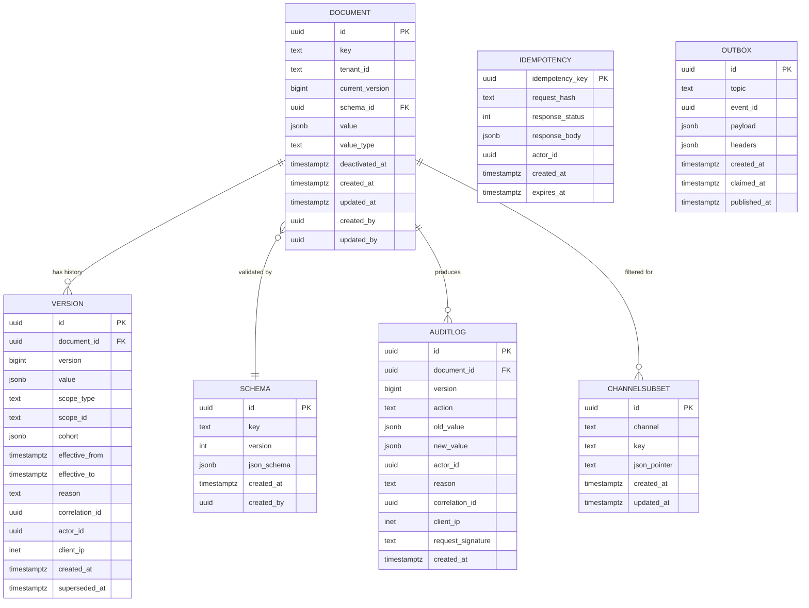

# Configuration Service — Entity-Relationship Diagram

## 1. Database

- Engine: PostgreSQL 19
- Schema: `configuration` (owned exclusively by this service)
- Migrations: `services/configuration-service/migrations/` (versioned,
  forward-only; run by a `pre-upgrade` Job before rolling deploy)

## 2. Cross-Service References

This service is a **source of truth**; it references other services
only by stable string keys (e.g. `ride_type:economy` references the
catalogued ride types owned by no other service) or by UUID for
entity-scoped overrides.

| Column | Type | Refers to | Source of truth |
|--------|------|-----------|------------------|
| `scope_id` (when `scope_type = 'restaurant'`) | UUID | `Restaurant.id` | `restaurant-service` |
| `scope_id` (when `scope_type = 'branch'`) | UUID | `Branch.id` | ``restaurant-service` (branch)` |
| `scope_id` (when `scope_type = 'merchant'`) | UUID | `Merchant.id` | ``restaurant-service` (merchant)` |
| `scope_id` (when `scope_type = 'user'`) | UUID | `Identity.id` | `identity-service` |
| `scope_id` (when `scope_type = 'ride_type'`) | string | catalog of ride types | this service |
| `scope_id` (when `scope_type = 'zone'`) | UUID | `Zone.id` | ``geolocation-service` (zones)` |

The service validates the reference via API at write time; no DB FKs
are created. See `docs/architecture/CONSISTENCY_STRATEGY.md`.

## 3. Entities

### `Document`

The current "head" of a configuration key. The most recent active
version. Soft-deletable; deactivation is itself a new version.

#### Columns

| Column | Type | Constraints | Notes |
|--------|------|-------------|-------|
| `id` | UUID | PK | UUIDv7 |
| `key` | TEXT | NOT NULL, UNIQUE | `[a-z][a-z0-9_.\-]{1,127}` |
| `tenant_id` | TEXT | NOT NULL DEFAULT 'global' | Tenant scope |
| `current_version` | BIGINT | NOT NULL | Latest active version number |
| `schema_id` | UUID | NOT NULL, FK → `schemas.id` | The declared schema |
| `value` | JSONB | NULL | Current value (NULL = deactivated) |
| `value_type` | TEXT | NOT NULL | mirror of schema's `type` |
| `deactivated_at` | TIMESTAMPTZ | NULL | soft delete |
| `created_at` | TIMESTAMPTZ | NOT NULL DEFAULT now() | audit |
| `updated_at` | TIMESTAMPTZ | NOT NULL DEFAULT now() | audit |
| `created_by` | UUID | NOT NULL | identity |
| `updated_by` | UUID | NOT NULL | identity |

#### Indexes

- PK on `id`
- UNIQUE on `key`
- Index on `schema_id`
- Partial index on `(tenant_id, key) WHERE deactivated_at IS NULL`
  (the dominant read path)

#### Constraints

- CHECK: `value_type IN ('string','number','boolean','object','array','null')`
- CHECK: `(deactivated_at IS NULL) OR (value IS NULL)`

### `Version` (history)

Immutable history of every version of every key.

#### Columns

| Column | Type | Constraints | Notes |
|--------|------|-------------|-------|
| `id` | UUID | PK | UUIDv7 |
| `document_id` | UUID | NOT NULL | points at `documents.id` |
| `version` | BIGINT | NOT NULL | monotonic per document |
| `value` | JSONB | NULL | the value at this version |
| `scope_type` | TEXT | NOT NULL | see precedence table |
| `scope_id` | TEXT | NULL | entity id (string for non-UUID scopes) |
| `cohort` | JSONB | NULL | staged rollout definition |
| `effective_from` | TIMESTAMPTZ | NULL | time-windowed override start |
| `effective_to` | TIMESTAMPTZ | NULL | time-windowed override end |
| `reason` | TEXT | NOT NULL | operator's reason |
| `correlation_id` | UUID | NOT NULL | request id |
| `actor_id` | UUID | NOT NULL | admin who wrote |
| `client_ip` | INET | NULL | request source |
| `created_at` | TIMESTAMPTZ | NOT NULL DEFAULT now() | audit |
| `superseded_at` | TIMESTAMPTZ | NULL | when a newer version took over |

#### Indexes

- PK on `id`
- UNIQUE on `(document_id, version)`
- Index on `(document_id, created_at DESC)`
- Index on `actor_id`
- Index on `correlation_id`
- Index on `created_at` (for partitioning and retention)

#### Constraints

- CHECK: `scope_type IN ('user','restaurant','branch','merchant','ride_type','zone','city','country','segment','tenant','global')`
- CHECK: `version >= 1`
- CHECK: `(effective_from IS NULL) = (effective_to IS NULL)` — both
  null or both set

### `Schema`

The declared JSON Schema for each key. Versioned with the value.

#### Columns

| Column | Type | Constraints | Notes |
|--------|------|-------------|-------|
| `id` | UUID | PK | UUIDv7 |
| `key` | TEXT | NOT NULL | mirrors `documents.key` |
| `version` | INT | NOT NULL | monotonic |
| `json_schema` | JSONB | NOT NULL | the JSON Schema document |
| `created_at` | TIMESTAMPTZ | NOT NULL DEFAULT now() | audit |
| `created_by` | UUID | NOT NULL | identity |

#### Indexes

- PK on `id`
- UNIQUE on `(key, version)`

### `AuditLog`

Immutable append-only audit log of every write. Note: the platform
audit log is owned by `audit-service`; this table is a fast
local cache for the configuration console's "what changed" view.

#### Columns

| Column | Type | Constraints | Notes |
|--------|------|-------------|-------|
| `id` | UUID | PK | UUIDv7 |
| `document_id` | UUID | NOT NULL | |
| `version` | BIGINT | NOT NULL | |
| `action` | TEXT | NOT NULL | create/update/rollback/deactivate/reactivate |
| `old_value` | JSONB | NULL | pre-image |
| `new_value` | JSONB | NULL | post-image |
| `actor_id` | UUID | NOT NULL | |
| `reason` | TEXT | NOT NULL | |
| `correlation_id` | UUID | NOT NULL | |
| `client_ip` | INET | NULL | |
| `request_signature` | TEXT | NULL | for high-value mutations |
| `created_at` | TIMESTAMPTZ | NOT NULL DEFAULT now() | |

#### Indexes

- PK on `id`
- Index on `(document_id, created_at DESC)`
- Index on `actor_id`
- Index on `correlation_id`
- Index on `created_at` (partition key)

#### Constraints

- CHECK: `action IN ('create','update','rollback','deactivate','reactivate','deprecate')`
- **No UPDATE / DELETE on this table** (enforced by revoked grants).

### `Idempotency`

`Idempotency-Key` dedupe per the platform standard.

#### Columns

| Column | Type | Constraints | Notes |
|--------|------|-------------|-------|
| `idempotency_key` | UUID | PK | |
| `request_hash` | TEXT | NOT NULL | sha256 of body |
| `response_status` | INT | NOT NULL | |
| `response_body` | JSONB | NOT NULL | |
| `actor_id` | UUID | NOT NULL | |
| `created_at` | TIMESTAMPTZ | NOT NULL DEFAULT now() | |
| `expires_at` | TIMESTAMPTZ | NOT NULL | created_at + 24h |

#### Indexes

- PK on `idempotency_key`
- Index on `expires_at` (purge job)

### `Outbox`

Outbox for the `configuration.updated.v1` event.

#### Columns

| Column | Type | Constraints | Notes |
|--------|------|-------------|-------|
| `id` | UUID | PK | UUIDv7 |
| `topic` | TEXT | NOT NULL | |
| `event_id` | UUID | NOT NULL | |
| `payload` | JSONB | NOT NULL | |
| `headers` | JSONB | NULL | |
| `created_at` | TIMESTAMPTZ | NOT NULL DEFAULT now() | |
| `claimed_at` | TIMESTAMPTZ | NULL | when the poller picked it up |
| `published_at` | TIMESTAMPTZ | NULL | when the broker acked |

#### Indexes

- PK on `id`
- Partial index on `(claimed_at) WHERE published_at IS NULL`
  (the poller's working set)

### `ChannelSubset`

A per-channel view declaration: which keys and which subset of
nested fields are visible to mobile / web clients.

#### Columns

| Column | Type | Constraints | Notes |
|--------|------|-------------|-------|
| `id` | UUID | PK | UUIDv7 |
| `channel` | TEXT | NOT NULL | e.g. `customer_app_en` |
| `key` | TEXT | NOT NULL | config key |
| `json_pointer` | TEXT | NULL | subset within the value |
| `created_at` | TIMESTAMPTZ | NOT NULL DEFAULT now() | |
| `updated_at` | TIMESTAMPTZ | NOT NULL DEFAULT now() | |

#### Indexes

- PK on `id`
- UNIQUE on `(channel, key, json_pointer)`

## 4. Mermaid ER Diagram



## 5. DDL Sketch

```sql
CREATE SCHEMA IF NOT EXISTS configuration;

CREATE TABLE configuration.documents (
    id UUID PRIMARY KEY,
    key TEXT NOT NULL UNIQUE
        CHECK (key ~ '^[a-z][a-z0-9_.\-]{1,127}$'),
    tenant_id TEXT NOT NULL DEFAULT 'global',
    current_version BIGINT NOT NULL DEFAULT 0,
    schema_id UUID NOT NULL,
    value JSONB,
    value_type TEXT NOT NULL
        CHECK (value_type IN ('string','number','boolean','object','array','null')),
    deactivated_at TIMESTAMPTZ,
    created_at TIMESTAMPTZ NOT NULL DEFAULT now(),
    updated_at TIMESTAMPTZ NOT NULL DEFAULT now(),
    created_by UUID NOT NULL,
    updated_by UUID NOT NULL,
    CHECK ((deactivated_at IS NULL) OR (value IS NULL))
);

CREATE INDEX idx_documents_active
    ON configuration.documents (tenant_id, key)
    WHERE deactivated_at IS NULL;

CREATE TABLE configuration.versions (
    id UUID NOT NULL,
    document_id UUID NOT NULL,
    version BIGINT NOT NULL CHECK (version >= 1),
    value JSONB,
    scope_type TEXT NOT NULL
        CHECK (scope_type IN ('user','restaurant','branch','merchant',
                              'ride_type','zone','city','country',
                              'segment','tenant','global')),
    scope_id TEXT,
    cohort JSONB,
    effective_from TIMESTAMPTZ,
    effective_to TIMESTAMPTZ,
    reason TEXT NOT NULL CHECK (length(reason) BETWEEN 8 AND 512),
    correlation_id UUID NOT NULL,
    actor_id UUID NOT NULL,
    client_ip INET,
    created_at TIMESTAMPTZ NOT NULL DEFAULT now(),
    superseded_at TIMESTAMPTZ,
    UNIQUE (document_id, version, created_at),
    CHECK ((effective_from IS NULL) = (effective_to IS NULL)),
    PRIMARY KEY (id, created_at)
) PARTITION BY RANGE (created_at);

CREATE INDEX idx_versions_doc_created
    ON configuration.versions (document_id, created_at DESC);
CREATE INDEX idx_versions_actor
    ON configuration.versions (actor_id);
CREATE INDEX idx_versions_correlation
    ON configuration.versions (correlation_id);

-- partitions managed by the migration runner; example:
CREATE TABLE IF NOT EXISTS configuration.versions_2026_07
    PARTITION OF configuration.versions
    FOR VALUES FROM ('2026-07-01 00:00:00+00') TO ('2026-08-01 00:00:00+00');

-- Verify IF NOT EXISTS did not hide a wrong parent or range.
DO $$
DECLARE
    v_parent   REGCLASS := 'configuration.versions'::REGCLASS;
    v_child    REGCLASS := 'configuration.versions_2026_07'::REGCLASS;
    v_expected TSTZRANGE := tstzrange('2026-07-01 00:00:00+00',
                                      '2026-08-01 00:00:00+00',
                                      '[)');
BEGIN
    IF (SELECT inhparent FROM pg_inherits WHERE inhrelid = v_child)
       IS DISTINCT FROM v_parent THEN
        RAISE EXCEPTION 'partition % is not attached to %',
            v_child::text, v_parent::text;
    END IF;
    IF NOT (SELECT relpartbound FROM pg_class WHERE oid = v_child)
              = v_expected THEN
        RAISE EXCEPTION 'partition % has unexpected bounds', v_child::text;
    END IF;
END $$;

CREATE TABLE configuration.schemas (
    id UUID PRIMARY KEY,
    key TEXT NOT NULL,
    version INT NOT NULL,
    json_schema JSONB NOT NULL,
    created_at TIMESTAMPTZ NOT NULL DEFAULT now(),
    created_by UUID NOT NULL,
    UNIQUE (key, version)
);

CREATE TABLE configuration.audit_log (
    id UUID NOT NULL,
    document_id UUID NOT NULL,
    version BIGINT NOT NULL,
    action TEXT NOT NULL
        CHECK (action IN ('create','update','rollback',
                          'deactivate','reactivate','deprecate')),
    old_value JSONB,
    new_value JSONB,
    actor_id UUID NOT NULL,
    reason TEXT NOT NULL,
    correlation_id UUID NOT NULL,
    client_ip INET,
    request_signature TEXT,
    created_at TIMESTAMPTZ NOT NULL DEFAULT now(),
    PRIMARY KEY (id, created_at)
) PARTITION BY RANGE (created_at);

CREATE TABLE IF NOT EXISTS configuration.audit_log_2026_07
    PARTITION OF configuration.audit_log
    FOR VALUES FROM ('2026-07-01 00:00:00+00') TO ('2026-08-01 00:00:00+00');

-- revoke UPDATE/DELETE; only INSERT allowed
REVOKE UPDATE, DELETE ON configuration.audit_log FROM configuration_app;

CREATE TABLE configuration.idempotency (
    idempotency_key UUID PRIMARY KEY,
    request_hash TEXT NOT NULL,
    response_status INT NOT NULL,
    response_body JSONB NOT NULL,
    actor_id UUID NOT NULL,
    created_at TIMESTAMPTZ NOT NULL DEFAULT now(),
    expires_at TIMESTAMPTZ NOT NULL
);
CREATE INDEX idx_idempotency_expires
    ON configuration.idempotency (expires_at);

CREATE TABLE configuration.outbox (
    id UUID PRIMARY KEY,
    topic TEXT NOT NULL,
    event_id UUID NOT NULL,
    payload JSONB NOT NULL,
    headers JSONB,
    created_at TIMESTAMPTZ NOT NULL DEFAULT now(),
    claimed_at TIMESTAMPTZ,
    published_at TIMESTAMPTZ
);
CREATE INDEX idx_outbox_unpublished
    ON configuration.outbox (claimed_at)
    WHERE published_at IS NULL;

CREATE TABLE configuration.channel_subsets (
    id UUID PRIMARY KEY,
    channel TEXT NOT NULL,
    key TEXT NOT NULL,
    json_pointer TEXT,
    created_at TIMESTAMPTZ NOT NULL DEFAULT now(),
    updated_at TIMESTAMPTZ NOT NULL DEFAULT now(),
    UNIQUE (channel, key, json_pointer)
);
```

## 6. Audit Columns

Every mutable table has `created_at`, `updated_at`, `created_by`,
`updated_by`. `audit_log` is append-only — no `updated_at`, and
UPDATE/DELETE grants are revoked.

## 7. Soft Delete

`documents.deactivated_at` is the soft-delete flag. A deactivated key
returns 404 on read by default; the version remains in `versions`
forever. A re-activation creates a new version.

## 8. JSONB Usage

| Table.Column | What is stored | Justification |
|--------------|----------------|---------------|
| `documents.value` | the configuration value | typed per schema |
| `versions.value` | historical value | full history |
| `versions.cohort` | staged rollout definition | flexible rule shape |
| `schemas.json_schema` | the JSON Schema | per-key |
| `idempotency.response_body` | cached response | replay |
| `outbox.payload` | event payload | per topic |
| `outbox.headers` | Kafka headers | trace context |
| `audit_log.old_value` / `new_value` | pre/post image | diff display |
| `channel_subsets.json_pointer` | subset selector | RFC 6901 pointer |

GIN index on `documents.value` for tenant searches:
`CREATE INDEX idx_documents_value_gin ON configuration.documents USING gin (value jsonb_path_ops);`

## 9. Partitioning

- `versions` partitioned by month on `created_at`.
- `audit_log` partitioned by month on `created_at`.
- `documents` not partitioned; the dominant access is by `key`.


See [`DATABASE_ARCHITECTURE.md` "Table Partitioning — Canonical Template"](../../architecture/DATABASE_ARCHITECTURE.md) for the idempotent `CREATE TABLE IF NOT EXISTS … PARTITION OF …` pattern, naming convention, and the service-owned maintenance-job contract (advisory lock, verification, retention/mixed-retention handling).

## 10. Data Retention

| Table | Retention | Purged by |
|-------|-----------|-----------|
| `documents` | indefinitely (deactivation preserves history) | n/a |
| `versions` | 7 years | monthly archival job → cold storage |
| `audit_log` | 7 years (financial impact) / 1 year (others) | monthly purge job |
| `idempotency` | 24 hours | daily purge job |
| `outbox` | 24 hours after `published_at` | hourly purge job |
| `schemas` | indefinitely | n/a |
| `channel_subsets` | indefinitely | n/a |

## 11. Migration Considerations

- Adding a new scope type requires only a `CHECK` constraint update
  and a one-time enum broadcast; no data migration.
- A schema change to a value MUST be a new version of the schema, not
  an in-place edit; the consumer's typed client must be re-deployed
  before the new schema is published.
- A `documents` row's `key` MUST NOT change; "rename" is a deprecate +
  create-new + redirect pattern.
- The `audit_log` table's append-only constraint is enforced at the
  database grant level — a migration MUST NOT grant UPDATE/DELETE.

---

## See also

### Sibling docs for this service

- [`README.md`](./README.md) — purpose, bounded context, responsibilities
- [`BRD.md`](./BRD.md) — business requirements
- [`SRS.md`](./SRS.md) — functional + non-functional requirements
- [`ERD.md`](./ERD.md) — data model (entities, relationships)
- [`INTEGRATION.md`](./INTEGRATION.md) — inter-service contracts (APIs, events, sagas)
- [`WORKFLOWS.md`](./WORKFLOWS.md) — operational workflows (happy paths, failure modes)
- [`TECH.md`](./TECH.md) — technology profile (runtime, libraries, data layer, admin endpoints, RBAC)

### Platform-wide

- [`../../shared/README.md`](../../shared/README.md) — `platform-spring-boot-starter` shared library (the single source of cross-cutting code for all Spring Boot services in the platform)
- [`../RECOMMENDATIONS.md`](../RECOMMENDATIONS.md) — platform-wide technology map (language, framework, version baseline, admin/RBAC pattern)
- [`../../README.md`](../../README.md) — services overview (the catalog of all 20 services)
- [`../../../main.md`](../../../main.md) — top-level platform specification (architecture, Keycloak, PostgreSQL 19, messaging, observability baseline)

## Related docs

- [`../../architecture/DATA_OWNERSHIP.md`](../../architecture/DATA_OWNERSHIP.md) — full source-of-truth matrix
- [`../../architecture/SERVICE_ISOLATION.md`](../../architecture/SERVICE_ISOLATION.md) — how this service handles a downstream outage
- [`../../architecture/DATABASE_ARCHITECTURE.md`](../../architecture/DATABASE_ARCHITECTURE.md) — PostgreSQL-per-service rules
- [`../../architecture/CONSISTENCY_STRATEGY.md`](../../architecture/CONSISTENCY_STRATEGY.md) — strong vs eventual consistency per context

