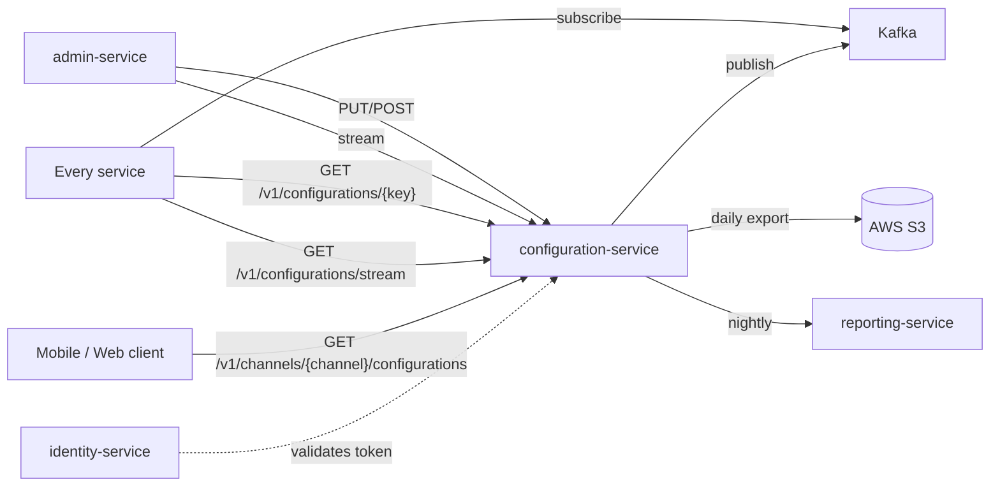
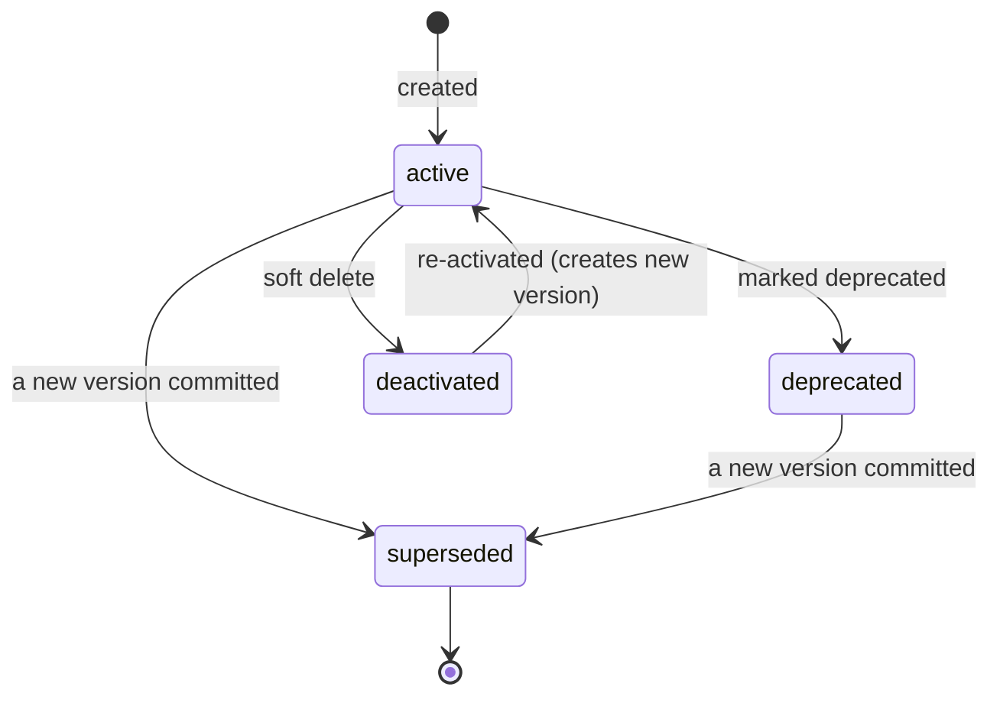

# Configuration Service — Software Requirements Specification

## 1. Introduction

This SRS specifies the behavior, performance, and operational
requirements of `configuration-service`. It is read by the
service-team engineers, the platform SRE, and the security team. It
inherits the platform-wide standards in
`docs/architecture/API_STANDARDS.md`,
`docs/architecture/EVENT_ARCHITECTURE.md`, and
`docs/architecture/SECURITY_ARCHITECTURE.md`.

## 2. Scope

In scope:

- The read and write APIs for versioned configuration documents.
- The long-poll update stream.
- The per-channel filtered subset for edge clients.
- The event publication of every change.
- The audit log of every write.

Out of scope:

- Feature flag evaluation (owned by `feature-flag-service`).
- Promotion and coupon logic (owned by `promotion-service`).
- Tax calculation (owned by `tax-service`).
- Customer preferences (owned by `user-profile-service`).

## 3. System Context

## 4. Actors

- **Operator (admin)** — human; carries the `config.admin` role;
  performs writes via the admin console.
- **Internal service** — system; consumes the long-poll stream and the
  Kafka topic.
- **Mobile / web client** — system; downloads filtered subset at
  launch and on event.
- **Auditor** — human; carries the `config.audit` role; reads history.
- **Reconciliation job** — system; reads historical versions for
  drift detection.

## 5. Functional Requirements

| ID | Requirement | Priority |
|----|-------------|----------|
| FR--001 | The service MUST expose `GET /v1/configurations/{key}` returning the latest value, the matched scope, and the version. | MUST |
| FR--002 | The service MUST resolve a request with an evaluation context (city, ride type, customer segment) using the documented precedence order. | MUST |
| FR--003 | The service MUST persist every write as a new immutable version, retaining the prior version. | MUST |
| FR--004 | The service MUST validate each value against the key's JSON Schema on write, returning 422 on failure. | MUST |
| FR--005 | The service MUST support `POST /v1/configurations` to create a new key with its schema. | MUST |
| FR--006 | The service MUST support `PUT /v1/configurations/{key}/versions` to create a new version, atomic with the audit log row. | MUST |
| FR--007 | The service MUST support `POST /v1/configurations/{key}/rollback` to revert to a prior version by reference. | MUST |
| FR--008 | The service MUST expose `GET /v1/configurations/{key}/versions` returning the full history, paginated. | MUST |
| FR--009 | The service MUST expose `GET /v1/configurations/stream` as a long-poll endpoint that holds the connection open until a change for the subscribed keys occurs, or until the configured timeout. | MUST |
| FR--010 | The service MUST publish `configuration.updated.v1` on every successful write, with the new version and the diff. | MUST |
| FR--011 | The service MUST publish `configuration.rolled_back.v1` on every rollback. | MUST |
| FR--012 | The service MUST publish `configuration.key.deprecated.v1` when a key is marked deprecated. | MUST |
| FR--013 | The service MUST expose `GET /v1/configurations/snapshot` for bulk read of a service's known keys, with a single round-trip. | MUST |
| FR--014 | The service MUST support per-channel filtered subset via `GET /v1/channels/{channel}/configurations`. | MUST |
| FR--015 | The service MUST export a daily snapshot of all current values to S3 and emit `configuration.snapshot.exported.v1`. | SHOULD |
| FR--016 | The service MUST support staged rollouts by attaching a `cohort` to a new version that applies only to a specific region/merchant list. | SHOULD |
| FR--017 | The service MUST support time-windowed overrides (a key resolves to a value during a date range). | SHOULD |
| FR--018 | The service MUST support soft delete (a `deactivation` version with `value = null`). | MUST |
| FR--019 | The service MUST compute a "preview impact" response on write, listing which services will reload. | SHOULD |
| FR--020 | The service MUST cache the read response in Redis with a 5-minute TTL keyed by `(tenant_id, key, version)`. | MUST |

## 6. Non-Functional Requirements

| ID | Category | Requirement | Target |
|----|----------|-------------|--------|
| NFR--001 | performance | P99 read latency | < 200ms |
| NFR--002 | performance | P99 write latency | < 500ms |
| NFR--003 | availability | uptime | 99.95% over 30d |
| NFR--004 | scalability | concurrent long-poll connections per pod | 1,000 |
| NFR--005 | scalability | concurrent readers per pod | 5,000 |
| NFR--006 | maintainability | MTTR | < 15 minutes |
| NFR--007 | durability | zero data loss on regional outage | RPO 5m, RTO 30m |
| NFR--008 | consistency | strong read-your-writes after a write completes | same request returns the new value |
| NFR--009 | observability | all requests have a trace and a structured log line | 100% coverage |
| NFR--010 | freshness | 99% of consumers reload within 5s of a write | median 2s |
| NFR--011 | auditability | 100% of writes have actor + reason | enforced in DB |

## 7. API Requirements

- Versioned URIs (`/v1/...`).
- Bearer JWT for all endpoints.
- `Idempotency-Key` required for non-idempotent writes.
- Errors in the standard envelope (`code`, `message`,
  `correlationId`, `details`).
- Full contracts in `INTEGRATION.md`.

## 8. Data Requirements

| ID | Requirement | Notes |
|----|-------------|-------|
| DATA--001 | Primary keys are UUIDv7 for documents; sequence ID for history (monotonic per key). | Time-orderable |
| DATA--002 | Every value MUST have a JSON Schema. | Stored in `configuration.schemas`. |
| DATA--003 | Every version MUST carry `actor_id`, `reason`, `created_at`, `correlation_id`. | Audit |
| DATA--004 | Soft delete is implemented by a `deactivated_at` flag, not a row deletion. | Retention |
| DATA--005 | Currency values in configuration are stored as integer minor units with a `currency` field. | Standard |
| DATA--006 | Time values are `timestamptz` UTC. | Standard |
| DATA--007 | Cross-service references are UUID columns without DB FKs. | Rule |
| DATA--008 | History is partitioned by month for retention and archive. | Compliance |

## 9. Validation Rules

- A key name MUST be `[a-z][a-z0-9_.\-]{1,127}`.
- A scope identifier MUST be a valid UUID for entity scopes, or an
  ISO 3166 code for country, or a slug for ride type.
- A new version's value MUST validate against the key's JSON Schema.
- A reason MUST be 8–512 characters.
- An `X-Audit-Reason` header is required for any write that affects
  production.

## 10. State Transitions

The configuration document has no formal state machine; the relevant
state is per-version:

See `WORKFLOWS.md` for the end-to-end flows.

## 11. Authorization Requirements

- Writes require the `config.admin` realm role.
- High-value writes (production rollouts, mass rollback) additionally
  require request signing and step-up MFA per the platform's
  `SECURITY_ARCHITECTURE.md` §14.
- Reads of audit history require the `config.audit` role.
- A `tenant_id` mismatch between the token and the value's tenant
  returns 403.

## 12. Configuration Requirements

- `LONGPOLL_MAX_WAIT_SECONDS` (env; default 25).
- `LONGPOLL_MAX_CONNS_PER_POD` (env; default 1000).
- `SNAPSHOT_CRON` (env; default `0 3 * * *`).
- `READ_CACHE_TTL_SECONDS` (env; default 300).
- `ADMIN_REALM` (env; default `platform-internal`).

The service MUST NOT read from its own configuration store for
operational parameters.

## 13. Error Handling

| Error | Response |
|-------|----------|
| Schema mismatch | 422 `VALIDATION_FAILED` with field-level `details[]` |
| Unknown key | 404 `CONFIG_KEY_NOT_FOUND` |
| Concurrent version race | 409 `VERSION_CONFLICT` with current version in details |
| Idempotency-Key reuse with different body | 422 `IDEMPOTENCY_KEY_REUSED` |
| Missing `X-Audit-Reason` | 400 `AUDIT_REASON_REQUIRED` |
| Long-poll limit exceeded | 503 `CIRCUIT_OPEN` with `Retry-After` |
| Cache layer down | read-through to DB; no user-facing error |

## 14. Concurrency Requirements

- A write to a key MUST be serialized at the row level
  (`SELECT ... FOR UPDATE` on the latest version).
- Two simultaneous writes to the same key MUST result in one win and
  one `409 VERSION_CONFLICT`.
- A long-poll connection MUST NOT block more than
  `LONGPOLL_MAX_WAIT_SECONDS`.

## 15. Idempotency Requirements

- All write endpoints (`POST /v1/configurations`,
  `PUT /v1/configurations/{key}/versions`,
  `POST /v1/configurations/{key}/rollback`) require an
  `Idempotency-Key` header.
- The service stores the key in a `configuration.idempotency` table
  for 24 hours, with the response status and body.

## 16. Performance

- Dominant path: `GET /v1/configurations/{key}`.
- P50/P95/P99: 5ms / 50ms / 200ms (cache hit).
- Cache miss path adds up to 50ms (DB read).
- Long-poll path adds `LONGPOLL_MAX_WAIT_SECONDS` at worst case.

## 17. Scalability

- Horizontal scaling: HPA on CPU and long-poll connection count.
- Vertical scaling: 1 vCPU / 1 GiB is the minimum; production 2 vCPU
  / 4 GiB per pod.
- Read replicas: 2 read replicas per region; reads served from the
  nearest replica.

## 18. Availability

- SLO: 99.95% over 30 days.
- Error budget: ~22 minutes per 30 days.
- Maintenance window: Sundays 04:00–06:00 UTC (low traffic regions
  only; no maintenance in primary regions during business hours).

## 19. Security

| ID | Requirement | Notes |
|----|-------------|-------|
| SEC--001 | All requests must carry a valid JWT validated at the gateway. | Defense in depth: re-validate in service. |
| SEC--002 | Mutations must carry a request signature for production rollouts. | HMAC-SHA256, per-tenant secret. |
| SEC--003 | Mutations must carry an `X-Audit-Reason` header. | Stored in audit log. |
| SEC--004 | No secrets in source; all credentials in Vault. | Quarterly rotation. |
| SEC--005 | All traffic TLS 1.3 (edge) / mTLS (in cluster). | Standard. |
| SEC--006 | No PII in default logs; access to history requires `config.audit`. | PII handling. |
| SEC--007 | Database user has rights only on the `configuration` schema. | Least privilege. |

## 20. Privacy

- PII stored: only what is declared in the key's schema (e.g. merchant
  copy referencing identifiable persons); default policy: no PII.
- Retention: 7 years for any row that affects financial
  reproducibility; 1 year for the rest.
- Erasure: tenant offboarding triggers a `key.deactivated` version
  for every key in the tenant; rows are retained per legal minimums
  but values are nulled.

## 21. Auditability

- Every write emits `configuration.updated.v1` AND a row in
  `configuration.audit_log` (immutable, append-only).
- `configuration.audit_log` includes `actor_id`, `reason`, `key`,
  `old_version`, `new_version`, `old_value`, `new_value`,
  `correlation_id`, `client_ip`.
- `audit-service` consumes `configuration.updated.v1` and persists to
  its own immutable store.

## 22. Observability

- Logs: JSON to stdout; fields `service`, `version`, `env`, `region`,
  `correlation_id`, `user_id`, `key`, `scope_type`, `version`,
  `latency_ms`, `status`.
- Metrics:
  - `http_requests_total{route, method, status}` (RED)
  - `http_request_duration_seconds{route, method, status}` (RED)
  - `config_writes_total{key, scope_type, tenant_id}`
  - `config_reads_total{key, cache_hit}`
  - `config_longpoll_connections`
  - `config_longpoll_duration_seconds`
  - `config_propagation_seconds` (event publish to consumer ack)
- Traces: OpenTelemetry; one root span per request; child spans for
  DB, Redis, Kafka.
- Alerts:
  - SLO burn rate.
  - `config_longpoll_connections` approaching the per-pod cap.
  - Cache hit rate below 80% for 5 minutes.
  - Propagation latency P99 > 5 seconds for 5 minutes.

## 23. Maintainability

- Code style: TypeScript ESLint config in
  `services/configuration-service/.eslintrc.json`.
- Test coverage: ≥ 85% on handlers, ≥ 95% on schema validators.
- Documentation: this folder; OpenAPI 3.1 at
  `/openapi.json`.

## 24. Disaster Recovery

- RPO: 5 minutes (PostgreSQL PITR + WAL shipping).
- RTO: 30 minutes (warm standby in another region).
- Backups: nightly logical; continuous WAL; 30-day retention on
  disk, 7-year retention in cold storage.

## 25. Acceptance Criteria

- 99.95% read-path availability for 30 days in production.
- 100% of writes are persisted in `configuration.audit_log` with
  `actor_id` and `reason`.
- A rollback completes in < 5 seconds and is visible to all consumers
  within 5 seconds.
- A failed schema validation returns 422 with the offending field
  listed in `details[]`.
- The service refuses to serve a write that omits `X-Audit-Reason` or
  `Idempotency-Key`.

---

## See also

### Sibling docs for this service

- [`README.md`](./README.md) — purpose, bounded context, responsibilities
- [`BRD.md`](./BRD.md) — business requirements
- [`SRS.md`](./SRS.md) — functional + non-functional requirements
- [`ERD.md`](./ERD.md) — data model (entities, relationships)
- [`INTEGRATION.md`](./INTEGRATION.md) — inter-service contracts (APIs, events, sagas)
- [`WORKFLOWS.md`](./WORKFLOWS.md) — operational workflows (happy paths, failure modes)
- [`TECH.md`](./TECH.md) — technology profile (runtime, libraries, data layer, admin endpoints, RBAC)

### Platform-wide

- [`../../shared/README.md`](../../shared/README.md) — `platform-spring-boot-starter` shared library (the single source of cross-cutting code for all Spring Boot services in the platform)
- [`../RECOMMENDATIONS.md`](../RECOMMENDATIONS.md) — platform-wide technology map (language, framework, version baseline, admin/RBAC pattern)
- [`../../README.md`](../../README.md) — services overview (the catalog of all 58 services)
- [`../../../main.md`](../../../main.md) — top-level platform specification (architecture, Keycloak, PostgreSQL 18, messaging, observability baseline)

