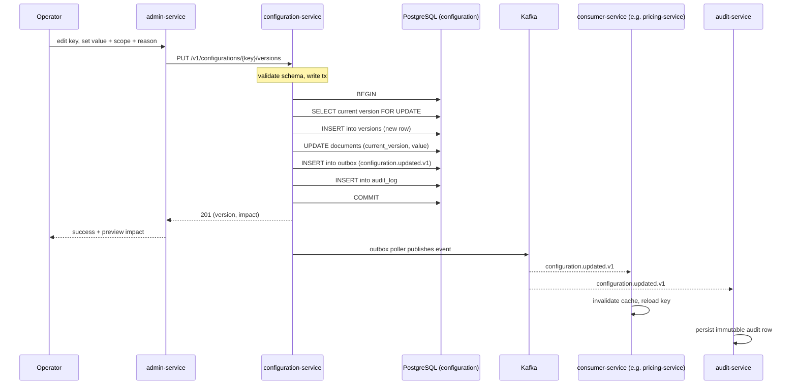
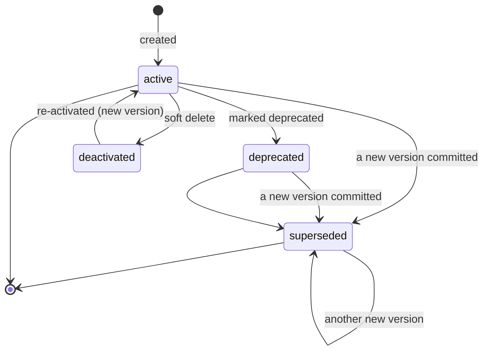
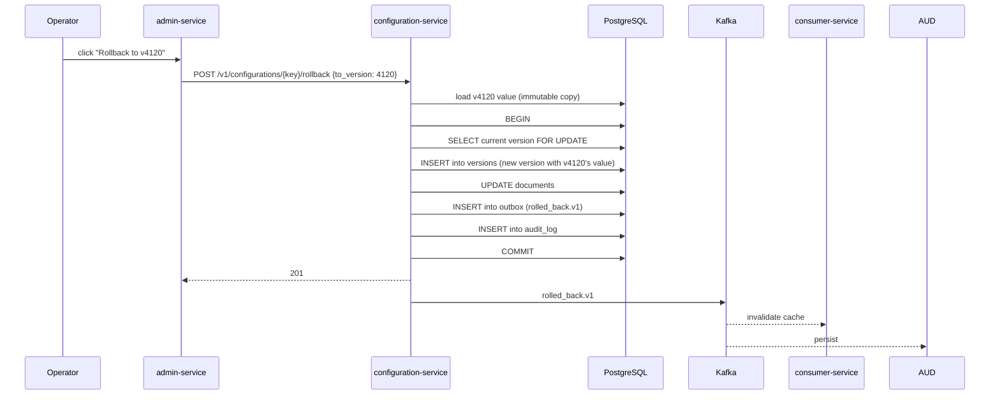
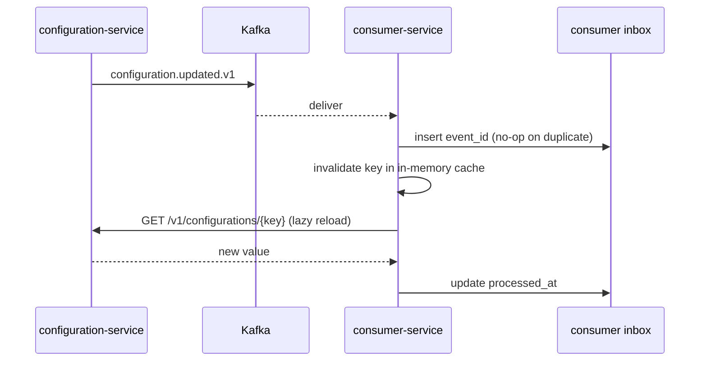
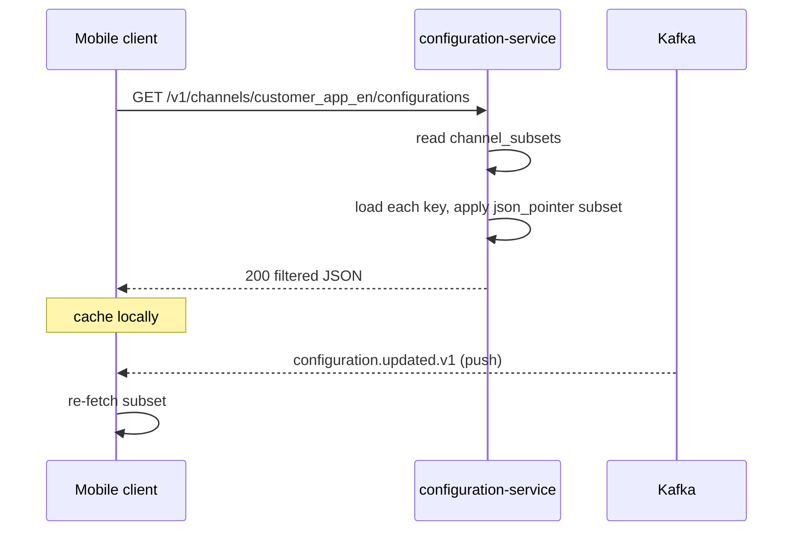

# Configuration Service — Workflows

## 1. Operator Commits a New Version of a Key

### 1.1 Objective

Change a business rule (e.g. base fare for Amsterdam) so that every
consumer reloads it within 5 seconds, with full attribution and
audit.

### 1.2 Initiating Actor

Operator (admin) via the admin console.

### 1.3 Participating Services

- `admin-service` (operator UI, RBAC, request signing)
- `configuration-service` (this service)
- `identity-service` (token validation, audit)
- Every consumer service (cache invalidation)
- `audit-service` (consumer of `configuration.updated.v1`)
- Kafka (event transport)

### 1.4 Prerequisites

- The operator holds the `config.admin` realm role.
- The key already exists in `configuration.documents` (or this is a
  new key, in which case workflow applies with the create step
  added).
- The operator has an `X-Audit-Reason` (free text, 8–512 chars).
- For high-value mutations: a valid `X-Signature` HMAC over the body.

### 1.5 Happy Path



State machine for a `ConfigurationDocument`:



### 1.6 Alternate Paths

- **First-time creation of the key**: instead of `PUT .../versions`,
  the operator calls `POST /v1/configurations` with a JSON Schema
  for the key, the initial value, and a scope.
- **Staged rollout**: the operator supplies a `cohort` object
  (e.g. `{"regions": ["eu-west"]}`); the new version applies only to
  matching evaluation contexts; a subsequent version with no cohort
  promotes to global.
- **Time-windowed override**: the operator supplies
  `effective_from` and `effective_to`; the new version is selected
  only inside that window.

### 1.7 Failure Paths

| Failure | Handling |
|---------|----------|
| Schema mismatch | 422 `VALIDATION_FAILED` with field-level `details[]`; nothing committed. |
| Concurrent version race | 409 `VERSION_CONFLICT`; operator retries with the new `expected_current_version`. |
| `X-Audit-Reason` missing | 400 `AUDIT_REASON_REQUIRED`; nothing committed. |
| Signature invalid | 403 `SIGNATURE_INVALID`; alert. |
| Idempotency-Key reused with different body | 422 `IDEMPOTENCY_KEY_REUSED`. |
| Outbox poller fails to publish | retry with backoff; DLQ after 3 attempts; alert on lag > 30s. |
| Consumer cache invalidation fails | consumer falls back to its `since_version` long-poll; eventually consistent. |

### 1.8 Business Rules

- The new version is the **only** winner when two writes race; the
  loser gets 409.
- A rollback creates a new version that mirrors the chosen prior
  version; the audit log still records the rollback.
- The matched scope and `version` MUST be returned to the consumer
  with every read.

### 1.9 State Transitions

See state machine in §1.5.

### 1.10 Events

| Event | Direction | When |
|-------|-----------|------|
| `configuration.updated.v1` | produced | every successful write |
| `configuration.rolled_back.v1` | produced | rollback |
| `configuration.key.deprecated.v1` | produced | deprecate |

### 1.11 APIs Involved

| API | Direction | When |
|-----|-----------|------|
| `PUT /v1/configurations/{key}/versions` | inbound | commit new version |
| `POST /v1/configurations` | inbound | create new key |
| `POST /v1/configurations/{key}/deprecate` | inbound | deprecate |
| `GET /v1/configurations/stream` | inbound | consumer long-poll |

### 1.12 Compensation / Rollback

If the new value is wrong, the operator performs a `POST .../rollback`
to revert to a prior version. Rollback itself is a new version; the
event chain remains consistent.

### 1.13 Final State

The new value is the head of `documents.value`; all consumers have
reloaded within 5 seconds; the `audit_log` has a single row with
`actor_id`, `reason`, `correlation_id`, and the diff.

## 2. Operator Rolls Back to a Prior Version

### 2.1 Objective

Revert a key to a prior version in one click, with full attribution
and audit.

### 2.2 Initiating Actor

Operator (admin).

### 2.3 Participating Services

- `admin-service`
- `configuration-service`
- Every consumer service
- `audit-service`
- Kafka

### 2.4 Prerequisites

- The operator has identified the prior version (`to_version`).
- The operator has the `config.admin` role and an `X-Audit-Reason`.

### 2.5 Happy Path



### 2.6 Alternate Paths

- **Rollback fails because the prior version is missing**: 404
  `VERSION_NOT_FOUND`; nothing committed.

### 2.7 Failure Paths

| Failure | Handling |
|---------|----------|
| Version not found | 404 |
| Concurrent write race | 409 `VERSION_CONFLICT`; operator retries |
| Signature invalid | 403 `SIGNATURE_INVALID`; alert |

### 2.8 Business Rules

- A rollback creates a new version; it does not rewrite history.
- The audit log records the rollback with `from_version` and
  `to_version`.

### 2.9 State Transitions

Same as §1.5; the document moves from the bad version back to a
good state via a new version.

### 2.10 Events

| Event | Direction | When |
|-------|-----------|------|
| `configuration.rolled_back.v1` | produced | rollback committed |

### 2.11 APIs Involved

| API | Direction | When |
|-----|-----------|------|
| `POST /v1/configurations/{key}/rollback` | inbound | rollback |

### 2.12 Compensation / Rollback

A rollback can itself be rolled back (rolling forward to the version
that was active before the rollback).

### 2.13 Final State

The active version is the rolled-back-to version; consumers reload
within 5 seconds; audit log has a `rollback` action row.

## 3. Consumer Service Reloads on Update

### 3.1 Objective

When `configuration.updated.v1` is published, every consumer
invalidates the relevant in-memory cache and reloads the value.

### 3.2 Initiating Actor

Kafka producer (outbox poller in this service).

### 3.3 Participating Services

- `configuration-service` (producer)
- Kafka
- Every consumer (e.g. `pricing-service`)

### 3.4 Prerequisites

- The consumer has a typed client configured with the keys it cares
  about.
- The consumer has an inbox table.

### 3.5 Happy Path



### 3.6 Alternate Paths

- **Long-poll alternative**: instead of subscribing to Kafka, the
  consumer holds an HTTP/2 connection to
  `GET /v1/configurations/stream?keys=...` and gets a JSON update
  payload directly. Same effect, no Kafka hop.

### 3.7 Failure Paths

| Failure | Handling |
|---------|----------|
| Kafka lag | consumer catches up; reloads with `since_version` |
| GET fails | consumer keeps prior value; alert on staleness |
| Inbox duplicate | no-op; re-run is safe |

### 3.8 Business Rules

- The consumer's typed client MUST validate the new value against
  its known schema; on mismatch, the client MUST log an error and
  refuse to apply the new value.

### 3.9 State Transitions

Internal: cache state goes from `stale` → `loading` → `fresh`.

### 3.10 Events

| Event | Direction | When |
|-------|-----------|------|
| `configuration.updated.v1` | consumed | every write |

### 3.11 APIs Involved

| API | Direction | When |
|-----|-----------|------|
| `GET /v1/configurations/{key}` | outbound (consumer → this service) | reload |

### 3.12 Compensation / Rollback

If the reload fails permanently, the consumer keeps the prior value
and emits a metric `config_reload_failures_total{key}`. An alert
fires when this metric is non-zero for 5 minutes.

### 3.13 Final State

The consumer's in-memory cache holds the new value within 5 seconds
of the write; subsequent reads return the new value.

## 4. Mobile Client Downloads a Filtered Subset

### 4.1 Objective

At app launch (and on `configuration.updated.v1`), the mobile / web
client downloads a per-channel filtered subset of configuration.

### 4.2 Initiating Actor

Mobile or web client.

### 4.3 Participating Services

- `configuration-service`

### 4.4 Prerequisites

- The channel has a `channel_subsets` entry for the keys it needs.
- The client has a valid JWT.

### 4.5 Happy Path



### 4.6 Alternate Paths

- The client may include a `since_version` parameter; the service
  returns only changed keys.

### 4.7 Failure Paths

| Failure | Handling |
|---------|----------|
| Service unreachable | client uses last cached subset; offline mode |
| Channel unknown | 404 `CHANNEL_NOT_FOUND`; client falls back to defaults |

### 4.8 Business Rules

- The client MUST NOT see keys that are not in its `channel_subsets`
  entry.
- A `json_pointer` is applied server-side; the wire response only
  carries the requested subset.

### 4.9 State Transitions

n/a (read-only flow).

### 4.10 Events

| Event | Direction | When |
|-------|-----------|------|
| `configuration.updated.v1` | consumed | reload trigger |

### 4.11 APIs Involved

| API | Direction | When |
|-----|-----------|------|
| `GET /v1/channels/{channel}/configurations` | inbound | app launch / update |

### 4.12 Compensation / Rollback

If the subset is missing required keys, the client falls back to a
hard-coded default set (build-time only); the missing key is logged
for triage.

### 4.13 Final State

The client has the latest filtered subset cached locally; the
experience continues without a redeploy.

---

## 99. `Monthly Partition Maintenance`

### 99.1 Objective

Idempotently pre-create the next 12 months for partitioned tables in `configuration`. The drop half is handled by the per-service retention job.

### 99.2 Initiating Actor

A scheduled job runs daily at `02:00 UTC`. Leader-elected via `pg_try_advisory_xact_lock(hashtext('configuration.partition'), hashtext('monthly'))`.

### 99.3 Happy Path

```mermaid
sequenceDiagram
    participant JOB as Partition job
    participant PG as PostgreSQL
    JOB->>PG: pg_try_advisory_xact_lock('configuration.monthly')
    alt lock acquired
        loop for each missing month in next 12
            JOB->>PG: CREATE TABLE IF NOT EXISTS configuration.<table>_YYYY_MM PARTITION OF configuration.<table>
            JOB->>PG: verify (pg_inherits, relpartbound)
        end
        JOB->>PG: assert now() in existing child
    else lock NOT acquired
        Note over JOB: another instance is running; exit cleanly
    end
```

### 99.4 Failure Paths

| Failure | Handling |
|---------|----------|
| Lock contention | exit 0 |
| DDL fails | retry 3× with backoff (1 s / 4 s / 16 s); page on-call |
| Today's child missing | critical alert; INSERTs would fail |

### 99.5 Business Rules

- Pre-create next 12 complete future months.
- Every child is created with `CREATE TABLE IF NOT EXISTS … PARTITION OF …` so the job is safe to run twice in the same window.
- A verification step (`pg_inherits` parent + `relpartbound` range) runs after every `CREATE TABLE IF NOT EXISTS` because `IF NOT EXISTS` only guards the name, not the bounds.
- Optionally emit `audit.partition.maintained.v1` on success.

---

## See also

### Sibling docs for this service

- [`README.md`](./README.md) — purpose, bounded context, responsibilities
- [`BRD.md`](./BRD.md) — business requirements
- [`SRS.md`](./SRS.md) — functional + non-functional requirements
- [`ERD.md`](./ERD.md) — data model (entities, relationships)
- [`INTEGRATION.md`](./INTEGRATION.md) — inter-service contracts (APIs, events, sagas)
- [`WORKFLOWS.md`](./WORKFLOWS.md) — operational workflows (happy paths, failure modes)
- [`TECH.md`](./TECH.md) — technology profile (runtime, libraries, data layer, admin endpoints, RBAC)

### Platform-wide

- [`../../shared/README.md`](../../shared/README.md) — `platform-spring-boot-starter` shared library (the single source of cross-cutting code for all Spring Boot services in the platform)
- [`../RECOMMENDATIONS.md`](../RECOMMENDATIONS.md) — platform-wide technology map (language, framework, version baseline, admin/RBAC pattern)
- [`../../README.md`](../../README.md) — services overview (the catalog of all 58 services)
- [`../../../main.md`](../../../main.md) — top-level platform specification (architecture, Keycloak, PostgreSQL 18, messaging, observability baseline)

