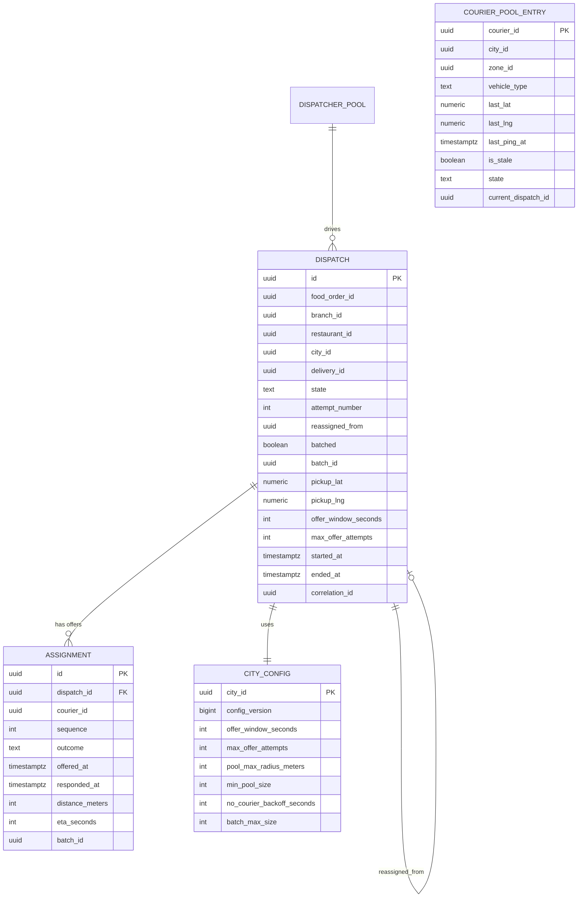

# courier-dispatch-service — Entity-Relationship Diagram

## 1. Database

- Engine: PostgreSQL 18.
- Schema: `courier_dispatch` (owned exclusively by this service).
- Migrations: `services/courier-dispatch-service/migrations/` —
  versioned, forward-only, `golang-migrate` (or equivalent).
- Replica: one read replica in-region for metrics queries; writes
  always hit the primary.

## 2. Cross-Service References

| Column | Type | Refers to | Source of truth |
|--------|------|-----------|------------------|
| `food_order_id` | UUID | `FoodOrder` in `food-order-service` | `food-order-service` |
| `courier_id` | UUID | `Courier` in `courier-service` | `courier-service` |
| `branch_id` | UUID | `Branch` in `branch-service` | `branch-service` |
| `restaurant_id` | UUID | `Restaurant` in `restaurant-service` | `restaurant-service` |
| `city_id` | UUID | `City` in `zone-service` | `zone-service` |
| `delivery_id` | UUID | `Delivery` in `delivery-service` | `delivery-service` |
| `correlation_id` | UUID | request scope (gateway-generated) | gateway |

All cross-service references are stored as UUID columns **without**
database-level foreign keys. Refer to
[`architecture/CONSISTENCY_STRATEGY.md`](../../architecture/CONSISTENCY_STRATEGY.md)
for the cross-service integrity strategy.

## 3. Entities

### `Dispatch`

The top-level entity for a single attempt to match a `food_order_id`
to a courier. One `Dispatch` per `food.order.ready.v1` event (re-runs
create a new dispatch with `reassigned_from` pointing back).

#### Columns

| Column | Type | Constraints | Notes |
|--------|------|-------------|-------|
| `id` | UUID | PK | UUIDv7 |
| `food_order_id` | UUID | NOT NULL | from `food-order-service` |
| `branch_id` | UUID | NOT NULL | pickup location |
| `restaurant_id` | UUID | NOT NULL | from `branch-service` |
| `city_id` | UUID | NOT NULL | dispatch region |
| `delivery_id` | UUID | NULL | set when an assignment is committed |
| `state` | TEXT | NOT NULL CHECK in (`initiated`,`offered`,`accepted`,`committed`,`no_courier`,`cancelled`,`failed`) | state machine |
| `attempt_number` | INT | NOT NULL DEFAULT 1 | increments on re-dispatch |
| `reassigned_from` | UUID | NULL REFERENCES dispatch(id) | self-FK only within this schema |
| `batched` | BOOLEAN | NOT NULL DEFAULT false | true if part of a multi-order offer |
| `batch_id` | UUID | NULL | shared id for batched offers |
| `pickup_lat` | NUMERIC(9,6) | NOT NULL | denormalised from branch |
| `pickup_lng` | NUMERIC(9,6) | NOT NULL | denormalised from branch |
| `pickup_address` | TEXT | NULL | denormalised (for logs / support) |
| `offer_window_seconds` | INT | NOT NULL | snapshot at dispatch time |
| `max_offer_attempts` | INT | NOT NULL | snapshot at dispatch time |
| `started_at` | TIMESTAMPTZ | NOT NULL DEFAULT now() | first offer |
| `ended_at` | TIMESTAMPTZ | NULL | terminal state reached |
| `correlation_id` | UUID | NOT NULL | from upstream event |
| `created_at` | TIMESTAMPTZ | NOT NULL DEFAULT now() | audit |
| `updated_at` | TIMESTAMPTZ | NOT NULL DEFAULT now() | audit |
| `created_by` | UUID | NOT NULL | service identity |
| `updated_by` | UUID | NOT NULL | service identity |
| `deleted_at` | TIMESTAMPTZ | NULL | not used; terminal state instead |

#### Indexes

- PK on `id`.
- Unique on `food_order_id, attempt_number` (one attempt per order
  per round).
- Index on `state` partial WHERE `state IN ('initiated','offered')`
  (operational lookups).
- Index on `city_id, state` (city dashboards).
- Index on `delivery_id` (look up dispatch by delivery).

#### Constraints

- CHECK `state IN (...)` as above.
- CHECK `attempt_number BETWEEN 1 AND 50`.
- CHECK `offer_window_seconds BETWEEN 1 AND 120`.
- CHECK `max_offer_attempts BETWEEN 1 AND 20`.

### `Assignment`

The assignment ledger. One row per offer attempt. Append-only —
INSERT only; no UPDATE; no DELETE. Cancellations and expirations
are recorded as additional rows.

#### Columns

| Column | Type | Constraints | Notes |
|--------|------|-------------|-------|
| `id` | UUID | PK | UUIDv7 |
| `dispatch_id` | UUID | NOT NULL | FK within schema → `dispatch(id)` |
| `courier_id` | UUID | NOT NULL | cross-service ref |
| `sequence` | INT | NOT NULL | 1..N for the Nth offer to this courier |
| `outcome` | TEXT | NOT NULL CHECK in (`offered`,`accepted`,`rejected`,`expired`,`cancelled`,`no_courier`) | |
| `offered_at` | TIMESTAMPTZ | NOT NULL | when the offer was pushed |
| `responded_at` | TIMESTAMPTZ | NULL | accept/reject timestamp |
| `distance_meters` | INT | NOT NULL | courier-to-pickup at offer time |
| `eta_seconds` | INT | NOT NULL | pickup ETA at offer time |
| `batch_id` | UUID | NULL | shared with the dispatch if batched |
| `correlation_id` | UUID | NOT NULL | |
| `created_at` | TIMESTAMPTZ | NOT NULL DEFAULT now() | audit (immutable) |

#### Indexes

- PK on `id`.
- Unique on `(dispatch_id, courier_id, sequence)` to prevent
  duplicate offer rows.
- Index on `courier_id, created_at` for courier audit queries.
- Index on `dispatch_id` for ledger look-ups.

#### Constraints

- CHECK `outcome IN (...)` as above.
- CHECK `responded_at IS NULL OR responded_at >= offered_at`.
- CHECK `sequence BETWEEN 1 AND 50`.

### `CourierPoolEntry` (Redis-first; PostgreSQL projection)

The live pool is stored in Redis as a sorted set
(`ZADD courier_pool:{city_id} <last_ping_ms> <courier_id>`). A
PostgreSQL projection is written for durability, audit, and warm
re-hydration after a Redis cold start.

#### Columns

| Column | Type | Constraints | Notes |
|--------|------|-------------|-------|
| `courier_id` | UUID | PK | cross-service ref |
| `city_id` | UUID | NOT NULL | |
| `zone_id` | UUID | NULL | finer grain |
| `vehicle_type` | TEXT | NOT NULL | denormalised for quick filtering |
| `last_lat` | NUMERIC(9,6) | NOT NULL | last known point |
| `last_lng` | NUMERIC(9,6) | NOT NULL | |
| `last_ping_at` | TIMESTAMPTZ | NOT NULL | |
| `is_stale` | BOOLEAN | NOT NULL DEFAULT false | true if last_ping > 60s old |
| `state` | TEXT | NOT NULL CHECK in (`available`,`busy`,`paused`) | in-pool only if `available` |
| `current_dispatch_id` | UUID | NULL | when `busy` |
| `offers_last_hour` | INT | NOT NULL DEFAULT 0 | fairness counter |
| `rejections_last_hour` | INT | NOT NULL DEFAULT 0 | fairness counter |
| `updated_at` | TIMESTAMPTZ | NOT NULL DEFAULT now() | |

#### Indexes

- PK on `courier_id`.
- Index on `(city_id, state, last_ping_at)` for pool queries.

#### Constraints

- CHECK `state IN (...)` as above.

### `CityConfig` (cache of `configuration-service`)

A local snapshot of city-level configuration so the service does not
block on `configuration-service` for every decision. Refreshed on
`configuration.updated.v1`.

#### Columns

| Column | Type | Constraints | Notes |
|--------|------|-------------|-------|
| `city_id` | UUID | PK | |
| `config_version` | BIGINT | NOT NULL | from `configuration-service` |
| `offer_window_seconds` | INT | NOT NULL | default 30 |
| `max_offer_attempts` | INT | NOT NULL | default 6 |
| `pool_max_radius_meters` | INT | NOT NULL | default 3000 |
| `min_pool_size` | INT | NOT NULL | default 5 |
| `no_courier_backoff_seconds` | INT | NOT NULL | default 60 |
| `batch_max_size` | INT | NOT NULL | default 3 |
| `feature_batched_dispatch` | BOOLEAN | NOT NULL | from feature-flag-service |
| `feature_zone_surge_aware` | BOOLEAN | NOT NULL | from feature-flag-service |
| `updated_at` | TIMESTAMPTZ | NOT NULL DEFAULT now() | |

#### Constraints

- CHECK `offer_window_seconds BETWEEN 1 AND 120`.
- CHECK `max_offer_attempts BETWEEN 1 AND 20`.

### `Outbox`

Standard outbox for transactional event publishing. See
[`EVENT_ARCHITECTURE.md`](../../architecture/EVENT_ARCHITECTURE.md).

#### Columns

| Column | Type | Constraints | Notes |
|--------|------|-------------|-------|
| `id` | BIGSERIAL | PK | |
| `event_id` | UUID | UNIQUE NOT NULL | the `event_id` in the envelope |
| `topic` | TEXT | NOT NULL | |
| `partition_key` | UUID | NOT NULL | usually `dispatch_id` |
| `payload` | JSONB | NOT NULL | event envelope |
| `created_at` | TIMESTAMPTZ | NOT NULL DEFAULT now() | |
| `claimed_at` | TIMESTAMPTZ | NULL | set by the poller |
| `published_at` | TIMESTAMPTZ | NULL | set after broker ack |

### `Inbox`

Standard inbox for consumer dedup.

#### Columns

| Column | Type | Constraints | Notes |
|--------|------|-------------|-------|
| `event_id` | UUID | PK | |
| `topic` | TEXT | NOT NULL | |
| `received_at` | TIMESTAMPTZ | NOT NULL DEFAULT now() | |
| `processed_at` | TIMESTAMPTZ | NULL | |
| `error` | TEXT | NULL | for diagnostics |

## 4. Mermaid ER Diagram



## 5. DDL Sketch

```sql
CREATE SCHEMA IF NOT EXISTS courier_dispatch;

CREATE TABLE courier_dispatch.dispatches (
    id UUID PRIMARY KEY,
    food_order_id UUID NOT NULL,
    branch_id UUID NOT NULL,
    restaurant_id UUID NOT NULL,
    city_id UUID NOT NULL,
    delivery_id UUID,
    state TEXT NOT NULL,
    attempt_number INT NOT NULL DEFAULT 1,
    reassigned_from UUID REFERENCES courier_dispatch.dispatches(id),
    batched BOOLEAN NOT NULL DEFAULT false,
    batch_id UUID,
    pickup_lat NUMERIC(9,6) NOT NULL,
    pickup_lng NUMERIC(9,6) NOT NULL,
    pickup_address TEXT,
    offer_window_seconds INT NOT NULL,
    max_offer_attempts INT NOT NULL,
    started_at TIMESTAMPTZ NOT NULL DEFAULT now(),
    ended_at TIMESTAMPTZ,
    correlation_id UUID NOT NULL,
    created_at TIMESTAMPTZ NOT NULL DEFAULT now(),
    updated_at TIMESTAMPTZ NOT NULL DEFAULT now(),
    created_by UUID NOT NULL,
    updated_by UUID NOT NULL,
    CONSTRAINT dispatches_state_chk CHECK (state IN
        ('initiated','offered','accepted','committed','no_courier','cancelled','failed')),
    CONSTRAINT dispatches_attempt_chk CHECK (attempt_number BETWEEN 1 AND 50),
    CONSTRAINT dispatches_window_chk CHECK (offer_window_seconds BETWEEN 1 AND 120),
    CONSTRAINT dispatches_max_chk CHECK (max_offer_attempts BETWEEN 1 AND 20)
);

CREATE UNIQUE INDEX dispatches_order_attempt_uq
    ON courier_dispatch.dispatches (food_order_id, attempt_number);
CREATE INDEX dispatches_state_open_ix
    ON courier_dispatch.dispatches (state)
    WHERE state IN ('initiated','offered');
CREATE INDEX dispatches_city_state_ix
    ON courier_dispatch.dispatches (city_id, state);
CREATE INDEX dispatches_delivery_ix
    ON courier_dispatch.dispatches (delivery_id);

CREATE TABLE courier_dispatch.assignments (
    id UUID NOT NULL,
    dispatch_id UUID NOT NULL REFERENCES courier_dispatch.dispatches(id),
    courier_id UUID NOT NULL,
    sequence INT NOT NULL,
    outcome TEXT NOT NULL,
    assigned_at TIMESTAMPTZ NOT NULL DEFAULT now(),
    offered_at TIMESTAMPTZ NOT NULL,
    responded_at TIMESTAMPTZ,
    distance_meters INT NOT NULL,
    eta_seconds INT NOT NULL,
    batch_id UUID,
    correlation_id UUID NOT NULL,
    created_at TIMESTAMPTZ NOT NULL DEFAULT now(),
    PRIMARY KEY (id, assigned_at),
    CONSTRAINT assignments_outcome_chk CHECK (outcome IN
        ('offered','accepted','rejected','expired','cancelled','no_courier')),
    CONSTRAINT assignments_response_chk
        CHECK (responded_at IS NULL OR responded_at >= offered_at),
    CONSTRAINT assignments_seq_chk CHECK (sequence BETWEEN 1 AND 50)
) PARTITION BY RANGE (assigned_at);

CREATE UNIQUE INDEX assignments_offer_uq
    ON courier_dispatch.assignments (dispatch_id, courier_id, sequence);
CREATE INDEX assignments_courier_ix
    ON courier_dispatch.assignments (courier_id, created_at DESC);
CREATE INDEX assignments_dispatch_ix
    ON courier_dispatch.assignments (dispatch_id);

CREATE TABLE IF NOT EXISTS courier_dispatch.assignments_2026_08 PARTITION OF courier_dispatch.assignments FOR VALUES FROM ('2026-08-01 00:00:00+00') TO ('2026-09-01 00:00:00+00');

CREATE TABLE courier_dispatch.courier_pool_entries (
    courier_id UUID PRIMARY KEY,
    city_id UUID NOT NULL,
    zone_id UUID,
    vehicle_type TEXT NOT NULL,
    last_lat NUMERIC(9,6) NOT NULL,
    last_lng NUMERIC(9,6) NOT NULL,
    last_ping_at TIMESTAMPTZ NOT NULL,
    is_stale BOOLEAN NOT NULL DEFAULT false,
    state TEXT NOT NULL,
    current_dispatch_id UUID,
    offers_last_hour INT NOT NULL DEFAULT 0,
    rejections_last_hour INT NOT NULL DEFAULT 0,
    updated_at TIMESTAMPTZ NOT NULL DEFAULT now(),
    CONSTRAINT pool_state_chk CHECK (state IN ('available','busy','paused'))
);

CREATE INDEX pool_city_state_ping_ix
    ON courier_dispatch.courier_pool_entries (city_id, state, last_ping_at);

CREATE TABLE courier_dispatch.city_config (
    city_id UUID PRIMARY KEY,
    config_version BIGINT NOT NULL,
    offer_window_seconds INT NOT NULL,
    max_offer_attempts INT NOT NULL,
    pool_max_radius_meters INT NOT NULL,
    min_pool_size INT NOT NULL,
    no_courier_backoff_seconds INT NOT NULL,
    batch_max_size INT NOT NULL,
    feature_batched_dispatch BOOLEAN NOT NULL,
    feature_zone_surge_aware BOOLEAN NOT NULL,
    updated_at TIMESTAMPTZ NOT NULL DEFAULT now(),
    CONSTRAINT citycfg_window_chk CHECK (offer_window_seconds BETWEEN 1 AND 120),
    CONSTRAINT citycfg_max_chk CHECK (max_offer_attempts BETWEEN 1 AND 20)
);

CREATE TABLE courier_dispatch.outbox (
    id BIGSERIAL PRIMARY KEY,
    event_id UUID UNIQUE NOT NULL,
    topic TEXT NOT NULL,
    partition_key UUID NOT NULL,
    payload JSONB NOT NULL,
    created_at TIMESTAMPTZ NOT NULL DEFAULT now(),
    claimed_at TIMESTAMPTZ,
    published_at TIMESTAMPTZ
);

CREATE TABLE courier_dispatch.inbox (
    event_id UUID PRIMARY KEY,
    topic TEXT NOT NULL,
    received_at TIMESTAMPTZ NOT NULL DEFAULT now(),
    processed_at TIMESTAMPTZ,
    error TEXT
);
```

## 6. Audit Columns

Every mutable table has `created_at`, `updated_at`, `created_by`,
`updated_by`. The `assignments` table is append-only; its
`created_at` is set once and never changes.

## 7. Soft Delete

Not used. Terminal states (`committed`, `no_courier`, `cancelled`,
`failed`) are recorded in `state`; rows are never deleted during the
operational window. A separate retention job hard-deletes dispatches
older than 3 years.

## 8. JSONB Usage

- `outbox.payload` — the event envelope. Per the platform standard.
- `dispatch.dispatch_metadata` is NOT used; structured columns
  suffice for the queries we run. If a future need arises (e.g. offer
  scoring trace), a new JSONB column may be added with a documented
  schema.

## 9. Partitioning

| Table | Strategy | Cadence | Pre-create | Retention |
|-------|----------|---------|------------|-----------|
| `assignments` | RANGE on `assigned_at` | monthly | 12 months | 3 years (audit) |

> See [DATABASE_ARCHITECTURE.md §"Table Partitioning — Canonical Template"](../../architecture/DATABASE_ARCHITECTURE.md) for the idempotent CREATE TABLE IF NOT EXISTS … PARTITION OF … pattern, naming convention, and the service-owned maintenance-job contract.

## 10. Data Retention

| Table | Retention | Purged by |
|-------|-----------|-----------|
| `dispatches` | 3 years (operational + audit) | nightly batch |
| `assignments` | 3 years (audit) | nightly batch |
| `courier_pool_entries` | last 24h of activity (hot) | TTL via `last_ping_at` |
| `city_config` | forever (versioned) | n/a |
| `outbox` | 24h after `published_at` | poller |
| `inbox` | 30 days (TTL) | nightly batch |

## 11. Migration Considerations

- All migrations are forward-only; no destructive changes without a
  multi-step plan (add column → backfill → switch → drop).
- The `assignments` table is append-only by convention; enforced by
  revoking UPDATE/DELETE privileges from the application role.
- Adding a new `outcome` value requires a CHECK constraint update
  AND a new value in the enum used by the state machine code.
- Adding a new `state` value follows the same pattern.
- Migrations run as a separate migration user (per
  [`SECURITY_ARCHITECTURE.md`](../../architecture/SECURITY_ARCHITECTURE.md));
  the application role has DML only.

---

## See also

### Sibling docs for this service

- [`README.md`](./README.md) — purpose, bounded context, responsibilities
- [`BRD.md`](./BRD.md) — business requirements
- [`SRS.md`](./SRS.md) — functional + non-functional requirements
- [`ERD.md`](./ERD.md) — data model (entities, relationships)
- [`INTEGRATION.md`](./INTEGRATION.md) — inter-service contracts (APIs, events, sagas)
- [`WORKFLOWS.md`](./WORKFLOWS.md) — operational workflows (happy paths, failure modes)
- [`TECH.md`](./TECH.md) — technology profile (runtime, libraries, data layer, admin endpoints, RBAC)

### Platform-wide

- [`../../shared/README.md`](../../shared/README.md) — `platform-spring-boot-starter` shared library (the single source of cross-cutting code for all Spring Boot services in the platform)
- [`../RECOMMENDATIONS.md`](../RECOMMENDATIONS.md) — platform-wide technology map (language, framework, version baseline, admin/RBAC pattern)
- [`../../README.md`](../../README.md) — services overview (the catalog of all 58 services)
- [`../../../main.md`](../../../main.md) — top-level platform specification (architecture, Keycloak, PostgreSQL 18, messaging, observability baseline)

