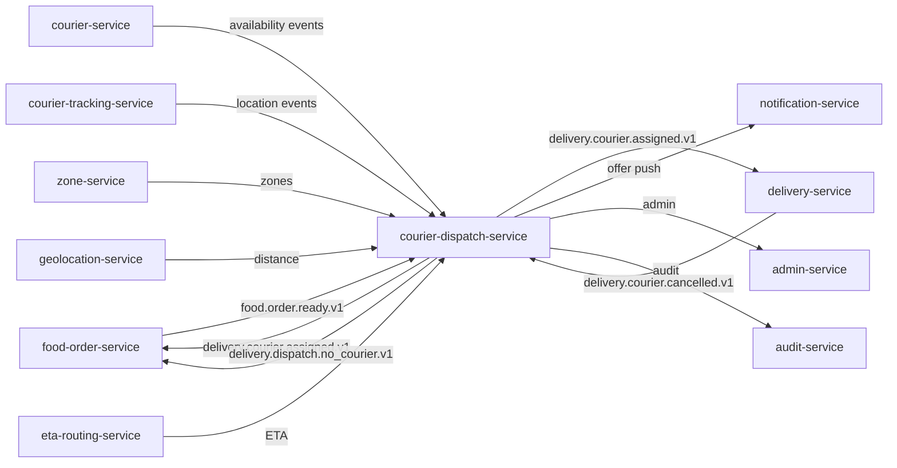

# courier-dispatch-service — Software Requirements Specification

## 1. Introduction

This document specifies the software behaviour of
`courier-dispatch-service`. It is the input for the engineering
implementation, the test plan, and the operational runbook. It MUST
remain consistent with `BRD.md` (business intent) and
`INTEGRATION.md` (contracts).

## 2. Scope

- In scope: the courier matching algorithm, the offer flow, the
  assignment ledger, the no-courier handling, reassignment, batched
  dispatch, admin force-reassign.
- Out of scope: courier profile / KYC, the high-frequency location
  stream, the delivery state machine, payment, customer-facing
  notifications.

## 3. System Context



## 4. Actors

- `courier` (Keycloak `platform-courier`, role `courier`) — human
  user accepting/rejecting offers.
- `food-order-service` (Keycloak `platform-services`,
  `food-order-service.svc`) — system actor producing trigger events.
- `courier-service` (Keycloak `platform-services`,
  `courier-service.svc`) — system actor producing availability
  events.
- `courier-tracking-service` (Keycloak `platform-services`,
  `courier-tracking-service.svc`) — system actor producing location
  events.
- `delivery-service` (Keycloak `platform-services`,
  `delivery-service.svc`) — system actor consuming assignments and
  emitting cancellations.
- `admin-service` (Keycloak `platform-internal`, role `admin`) —
  human admin performing force-reassign.

## 5. Functional Requirements

| ID | Requirement | Priority |
|----|-------------|----------|
| FR--001 | On `food.order.ready.v1`, create a `dispatch` row, query the available-courier pool, and offer to the top-N candidates. | MUST |
| FR--002 | On courier `accept`, persist the assignment, mark the courier as `busy`, emit `delivery.courier.assigned.v1`, and stop offering. | MUST |
| FR--003 | On courier `reject`, immediately offer to the next-best candidate without delay. | MUST |
| FR--004 | If the offer window expires without a response, mark the offer `expired` and offer to the next candidate. | MUST |
| FR--005 | After `max_offer_attempts` with no acceptance, emit `delivery.dispatch.no_courier.v1` and re-offer after `no_courier_backoff_seconds`. | MUST |
| FR--006 | On `delivery.courier.cancelled.v1` (after assignment, before pickup), enqueue a reassignment for the same `food_order_id`. | MUST |
| FR--007 | Support batched offers: when the order is from the same restaurant as an in-flight dispatch and within radius, include it in the existing courier's offer. | SHOULD |
| FR--008 | Honour zone surge and restricted zones when scoring couriers (penalise couriers who would cross a restricted zone, prefer couriers inside a surge zone). | SHOULD |
| FR--009 | Expose `POST /v1/dispatches/{id}/reassign` for admins; emits `delivery.dispatch.reassigned.v1`. | MUST |
| FR--010 | Re-evaluate the pool on every `courier.availability.online.v1` and `courier.location.updated.v1` (throttled to 1 Hz per courier). | MUST |
| FR--011 | If `courier-tracking-service` is down, fall back to last-known location with a `stale=true` flag and widen the search radius by 50%. | MUST |
| FR--012 | Persist every offer attempt (offer, accept, reject, expire) in the assignment ledger within 1s. | MUST |
| FR--013 | Reject any attempt to offer a delivery to a courier who already holds an active offer or active delivery (return `BUSINESS_RULE_VIOLATION`). | MUST |
| FR--014 | Support per-city configuration overrides for `offer_window_seconds`, `max_offer_attempts`, `pool_max_radius_meters`. | MUST |
| FR--015 | Emit metrics every 10 seconds: pool size, offer latency histogram, success rate. | SHOULD |

## 6. Non-Functional Requirements

| ID | Category | Requirement | Target |
|----|----------|-------------|--------|
| NFR--001 | performance | P50 time-to-assignment from `food.order.ready.v1` | ≤ 45s |
| NFR--002 | performance | P95 time-to-assignment | ≤ 90s |
| NFR--003 | performance | P95 pool-search latency | ≤ 200ms |
| NFR--004 | performance | P95 accept-pipeline latency (HTTP to state machine) | ≤ 300ms |
| NFR--005 | availability | Service uptime | 99.95% / 30d |
| NFR--006 | scalability | Sustain 50 dispatches / second / region | 50 rps sustained, 200 rps burst |
| NFR--007 | scalability | Pool size up to 50k couriers per city | bounded Redis memory |
| NFR--008 | scalability | Re-dispatch backpressure | up to 1k pending reassignments per replica |
| NFR--009 | maintainability | MTTR | ≤ 30 min |
| NFR--010 | observability | All dispatches traceable end-to-end | 100% |

## 7. API Requirements

- All non-idempotent `POST` endpoints MUST require `Idempotency-Key`.
- All responses MUST use the standard error envelope from
  `API_STANDARDS.md`.
- All endpoints MUST validate input with JSON Schema.
- Full contracts: `INTEGRATION.md`.

## 8. Data Requirements

| ID | Requirement | Notes |
|----|-------------|-------|
| DATA--001 | `dispatch_id` is a UUIDv7; the assignment ledger is keyed on it. | |
| DATA--002 | `food_order_id`, `courier_id`, `branch_id`, `restaurant_id`, `city_id` are stored as UUID columns WITHOUT database FKs. | Cross-service references. |
| DATA--003 | The assignment ledger is append-only; no UPDATE/DELETE on offer rows. | |
| DATA--004 | Every mutable table has `created_at`, `updated_at`, `created_by`, `updated_by`. | |
| DATA--005 | No PII is stored. Only IDs. | |

(Schema in `ERD.md`.)

## 9. Validation Rules

- A courier MUST be `online` and in the same city/zone as the order
  to receive an offer.
- A courier MUST NOT already have an active offer or active delivery.
- A dispatch MUST have a `food_order_id` referencing a known order
  (validated by event correlation, not FK).
- The `offer_window_seconds` MUST be > 0 and ≤ 120.
- The `max_offer_attempts` MUST be ≥ 1 and ≤ 20.
- An `accept` request MUST arrive within the offer window
  (server-side check).

## 10. State Transitions

`Dispatch` state machine (see `WORKFLOWS.md`):

```
initiated → offered → accepted → committed
                  ↘ expired ↗
                  ↘ rejected ↗
initiated → no_courier → re_offered (loop) → no_courier
```

`Assignment` rows are never modified once `committed=true`; a
cancellation inserts a *new* `released` row that points back to the
original.

## 11. Authorization Requirements

- Couriers may only accept/reject their own offers (server checks
  `offer.courier_id == sub`).
- Admins require role `courier.admin` to call force-reassign and
  metrics endpoints.
- Service-to-service callers must have the `courier-dispatch.write`
  or `courier-dispatch.read` role in the `courier-dispatch-service`
  client.

## 12. Configuration Requirements

- Reads `courier_dispatch.*` from `configuration-service` at startup
  and on `configuration.updated.v1`.
- All numeric configuration is validated against min/max bounds on
  load; an out-of-bounds value is logged and the previous value is
  retained.

## 13. Error Handling

| Error | Response |
|-------|----------|
| Courier already holds an offer | 409 `code: "OFFER_ALREADY_ACTIVE"` |
| Dispatch not found | 404 `code: "DISPATCH_NOT_FOUND"` |
| Offer expired | 410 `code: "OFFER_EXPIRED"` |
| Invalid Idempotency-Key reuse | 422 `code: "IDEMPOTENCY_KEY_REUSED"` |
| Downstream (courier-service) down | circuit open → 503 `code: "CIRCUIT_OPEN"` |

## 14. Concurrency Requirements

- A row-level lock on `couriers` row is acquired at offer time to
  prevent two concurrent offers to the same courier.
- The dispatch state machine uses optimistic concurrency
  (`updated_at` predicate) for accept/reject transitions.
- The Redis pool uses atomic `ZADD` / `ZREM` with a Lua script for
  the "remove and check" operation.

## 15. Idempotency Requirements

- All `POST` endpoints require `Idempotency-Key`. Replay returns
  the original response.
- The `accept` operation's idempotency key is
  `dispatch:<dispatch_id>:accept:<courier_id>`.
- The `reject` operation's idempotency key is
  `dispatch:<dispatch_id>:reject:<courier_id>`.
- The `force_reassign` operation's idempotency key is
  `dispatch:<dispatch_id>:reassign:<admin_id>:<timestamp>`.

## 16. Performance

- Dominant path: receive `food.order.ready.v1`, query Redis pool,
  pick top-3 candidates, push offer, receive accept.
- P50 / P95 / P99: see NFRs.
- Hot spot: Redis pool search. Mitigations: keep the sorted set
  small (≤ 50k entries per city), use `ZRANGEBYSCORE` with a
  bounding box.

## 17. Scalability

- Horizontal scaling: stateless; HPA on `kafka_consumer_lag` and
  `dispatch_pool_size`.
- Vertical scaling: bounded by Redis cluster size; no per-replica
  state.

## 18. Availability

- SLO: 99.95% over 30 days. Error budget: ~22 min / 30d.
- Maintenance window: none planned; rolling deploys only.
- Degraded mode: if `courier-tracking-service` is unreachable, the
  service continues with stale locations and a wider radius.

## 19. Security

| ID | Requirement | Notes |
|----|-------------|-------|
| SEC--001 | All endpoints require JWT bearer validated at the gateway. | Per `API_STANDARDS.md`. |
| SEC--002 | No PII is stored; only UUIDs. | |
| SEC--003 | Admin actions are audit-logged (`courier_dispatch.audit.assignment_committed.v1`). | |
| SEC--004 | Rate limit: 10 accept/reject per courier per minute (defense in depth). | At the service. |

## 20. Privacy

- PII stored: none.
- Retention: assignment rows retained for 3 years (audit / support).
- Erasure: not applicable (no PII to erase).

## 21. Auditability

- Every offer attempt is recorded with `offered_at`, `responded_at`,
  `outcome`, `correlation_id`, `courier_id`, `dispatch_id`,
  `food_order_id`.
- Admin actions emit `admin.action.performed.v1` (from
  `admin-service`) with `actor_id`, `target_dispatch_id`, `reason`.

## 22. Observability

- Logs: JSON, fields include `correlation_id`, `dispatch_id`,
  `order_id`, `courier_id`, `region`, `tenant_id`.
- Metrics: `dispatch_started_total{result}`,
  `dispatch_offer_seconds{outcome}`, `dispatch_pool_size`,
  `dispatch_no_courier_total`, `dispatch_assignment_ledger_size`.
- Traces: OpenTelemetry; root span per dispatch; child spans for
  pool search, offer push, accept handling.
- Alerts: SLO burn-rate; `no_courier` rate > 5% / 5m in any
  zone-hour; pool size < `min_pool_size` for > 2m in any zone.

## 23. Maintainability

- Code style: TypeScript strict, ESLint with platform rules.
- Test coverage: ≥ 80% line, ≥ 70% branch; 100% on the matching
  algorithm and the state machine.
- Documentation: this folder + `WORKFLOWS.md` diagrams.

## 24. Disaster Recovery

- RPO: 5 minutes (assignment ledger is replicated to standby
  region).
- RTO: 30 minutes (stateless service; replay outbox + assign from
  Redis replica).

## 25. Acceptance Criteria

- All `FR--` and `NFR--` are met and verified by automated tests.
- All `SEC--` are met and verified by a security review.
- A load test sustains 50 rps with p95 < 500ms for 30 minutes.
- A chaos test (kill `courier-tracking-service`) shows the service
  remains available with degraded radius.

---

## See also

### Sibling docs for this service

- [`README.md`](./README.md) — purpose, bounded context, responsibilities
- [`BRD.md`](./BRD.md) — business requirements
- [`SRS.md`](./SRS.md) — functional + non-functional requirements
- [`ERD.md`](./ERD.md) — data model (entities, relationships)
- [`INTEGRATION.md`](./INTEGRATION.md) — inter-service contracts (APIs, events, sagas)
- [`WORKFLOWS.md`](./WORKFLOWS.md) — operational workflows (happy paths, failure modes)
- [`TECH.md`](./TECH.md) — technology profile (runtime, libraries, data layer, admin endpoints, RBAC)

### Platform-wide

- [`../../shared/README.md`](../../shared/README.md) — `platform-spring-boot-starter` shared library (the single source of cross-cutting code for all Spring Boot services in the platform)
- [`../RECOMMENDATIONS.md`](../RECOMMENDATIONS.md) — platform-wide technology map (language, framework, version baseline, admin/RBAC pattern)
- [`../../README.md`](../../README.md) — services overview (the catalog of all 58 services)
- [`../../../main.md`](../../../main.md) — top-level platform specification (architecture, Keycloak, PostgreSQL 18, messaging, observability baseline)

