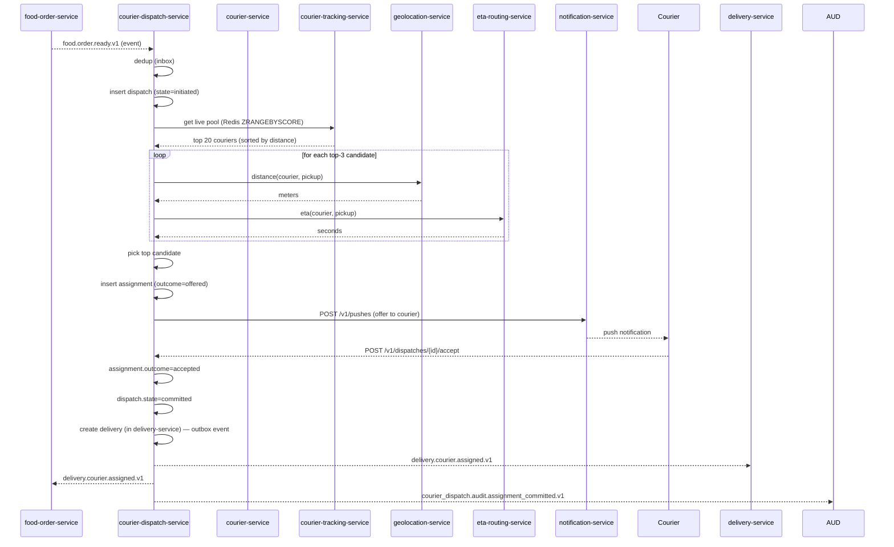
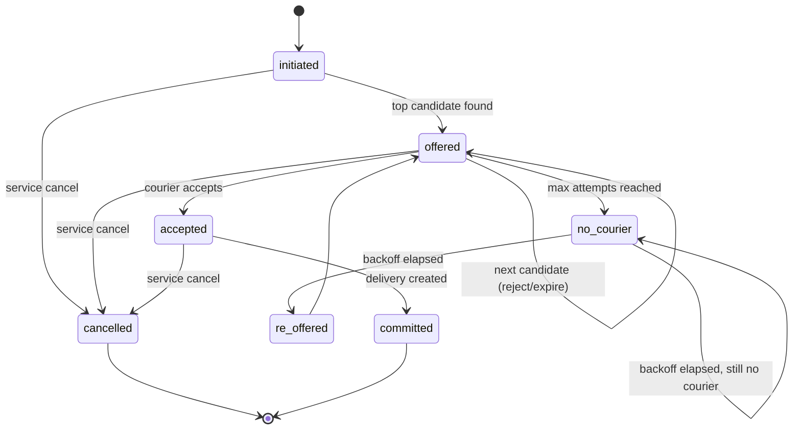
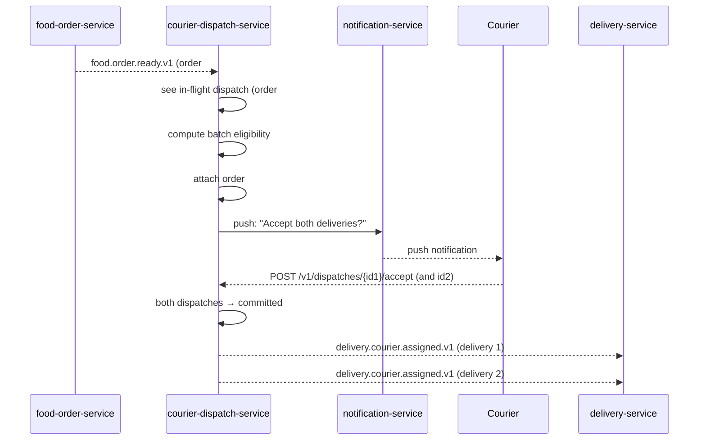
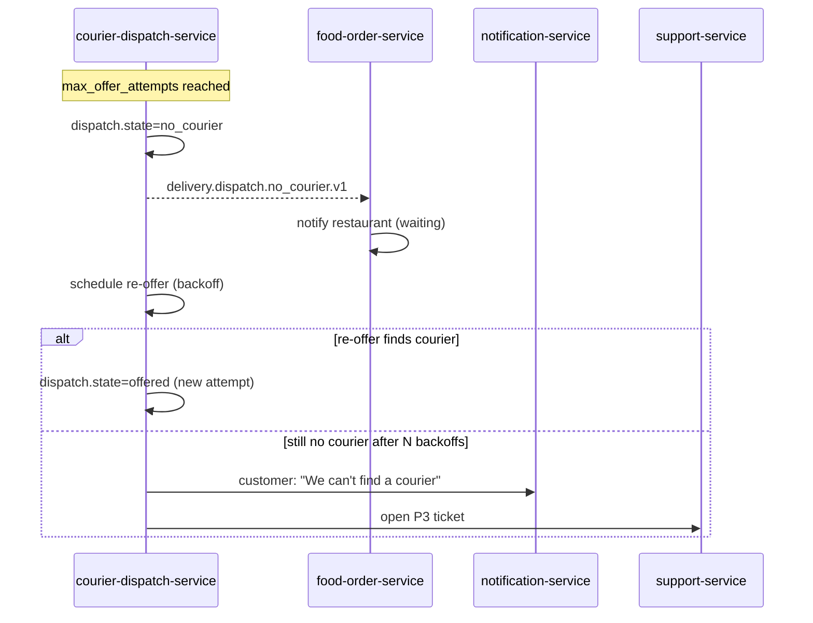
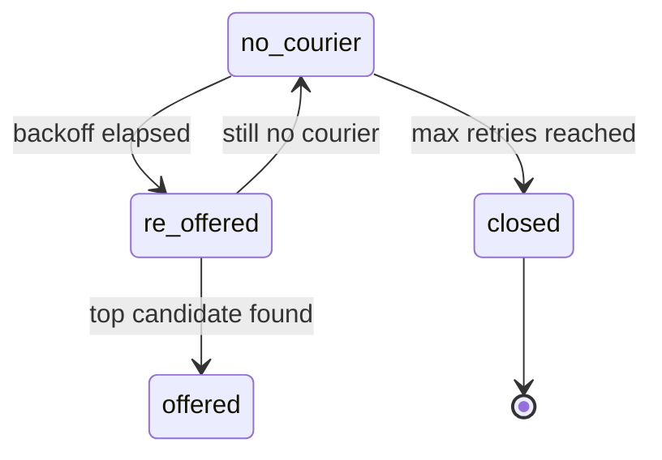
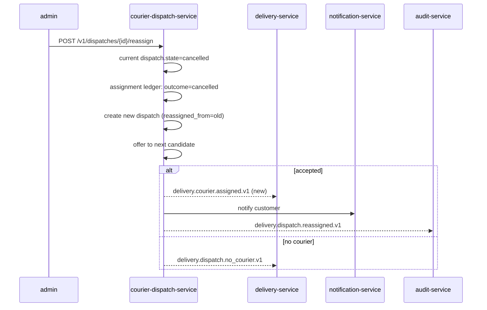

# courier-dispatch-service — Workflows

## 1. `Food Order Ready → Courier Assigned` (Happy Path)

### 1.1 Objective

Match a `food_order_id` to an available courier and emit
`delivery.courier.assigned.v1` within the offer window.

### 1.2 Initiating Actor

`food-order-service` (system actor) emits `food.order.ready.v1`.

### 1.3 Participating Services

- `food-order-service` (producer)
- `courier-dispatch-service` (this service)
- `courier-service` (online state, vehicle type)
- `courier-tracking-service` (last known location)
- `geolocation-service` (distance)
- `eta-routing-service` (ETA to pickup)
- `notification-service` (push offer)
- `delivery-service` (consumer of the assignment)

### 1.4 Prerequisites

- A courier is `online` in the same `city_id` (and ideally the same
  `zone_id`) as the order.
- The courier's `last_known_location` is no older than 60 seconds.
- The pool size in the city is at least `min_pool_size`.
- Configuration is loaded (city_config, feature flags).

### 1.5 Happy Path



### 1.6 Alternate Paths

- **First courier rejects**: re-offer to the next-best candidate
  immediately, no delay.
- **First offer expires**: re-offer to the next-best candidate.
- **Batched offer**: when the order is from the same restaurant as
  an in-flight dispatch, the existing courier is offered both
  orders as a batch; on accept, two `delivery.courier.assigned.v1`
  events are emitted (one per delivery).
- **Surge zone**: couriers in a surge zone are preferred; their
  effective distance is reduced by 10% in scoring.
- **Restricted zone**: couriers who would cross a restricted zone
  to reach the pickup are deprioritised.

### 1.7 Failure Paths

- **All couriers reject every offer**: after
  `max_offer_attempts`, the service emits
  `delivery.dispatch.no_courier.v1` and re-offers after
  `no_courier_backoff_seconds`.
- **`courier-tracking-service` down**: pool search uses last-known
  location with `is_stale=true`; search radius is widened by 50%.
- **`courier-service` down**: the dispatch pauses (does not
  advance); circuit-breaker fails fast; alert fires.
- **Push notification fails**: the offer remains `offered`; the
  courier may still accept in-app. After the offer window, the
  offer is marked `expired` and the next candidate is offered.
- **Outbox publish fails**: the row remains in the outbox; the
  poller retries with backoff; after N failures → outbox DLQ →
  support ticket.

### 1.8 Business Rules

- A courier can hold at most one active offer at a time.
- A courier can hold at most one active delivery at a time.
- The first courier to accept wins; subsequent concurrent accepts
  return 409 `OFFER_NOT_ACTIVE`.
- Batched offers count as a single assignment for the courier.

### 1.9 State Transitions



### 1.10 Events

| Event | Direction | When |
|-------|-----------|------|
| `food.order.ready.v1` | consumed | dispatch trigger |
| `courier.availability.online.v1` | consumed | pool update |
| `courier.location.updated.v1` | consumed | pool re-rank |
| `delivery.courier.cancelled.v1` | consumed | reassign |
| `delivery.courier.assigned.v1` | produced | on commit |
| `delivery.dispatch.no_courier.v1` | produced | on no_courier |
| `delivery.dispatch.offer.expired.v1` | produced | on offer expiry |
| `courier_dispatch.audit.assignment_committed.v1` | produced | on commit |

### 1.11 APIs Involved

| API | Direction | When |
|-----|-----------|------|
| `POST /v1/dispatches` | inbound | start (auto, by consumer) |
| `POST /v1/dispatches/{id}/accept` | inbound | courier accept |
| `POST /v1/dispatches/{id}/reject` | inbound | courier reject |
| `POST /v1/dispatches/{id}/cancel` | inbound | service cancel |
| `GET /v1/couriers/{id}` | outbound | enrich |
| `GET /v1/couriers/{id}/location` | outbound | pool search |
| `POST /v1/pushes` | outbound | offer notification |

### 1.12 Compensation / Rollback

- **Courier cancels after assignment but before pickup**:
  `delivery-service` emits `delivery.courier.cancelled.v1`. This
  service inserts a new dispatch with `reassigned_from` set and
  starts a new offer cycle.
- **Restaurant closes / order cancelled after dispatch start**: a
  cancellation event from `food-order-service` is received; the
  active offers are cancelled (`assignment.outcome=cancelled`); the
  dispatch is marked `cancelled`. No delivery is created.
- **Admin force-reassign**: see `force_reassign` workflow below.

### 1.13 Final State

- Dispatch: `committed` (happy) or `no_courier` (failure) or
  `cancelled` (compensation).
- Assignment ledger: contains every offer attempt with outcome.
- Delivery: created (in `delivery-service`) on commit; otherwise no
  delivery exists.

## 2. `Batched Dispatch` (Same Restaurant, Same Courier)

### 2.1 Objective

When two orders from the same restaurant are ready within a short
window, the service offers both to a single courier in one push.

### 2.2 Initiating Actor

`food-order-service` emits `food.order.ready.v1` for the second
order while the first dispatch is in `offered` or `accepted` state.

### 2.3 Participating Services

Same as the happy path.

### 2.4 Prerequisites

- `feature.batched_dispatch` is `true` for the city.
- Both orders are from the same `restaurant_id` and within
  `batch_max_radius_meters`.
- A dispatch is already in `offered` or `accepted` state for the
  first order.

### 2.5 Happy Path



### 2.6 Alternate Paths

- **Courier rejects the batch**: each order is re-dispatched
  independently.
- **One order's pickup window expires before the other**: the
  expired order is cancelled; the remaining order continues as a
  single dispatch.

### 2.7 Failure Paths

- The courier is assigned order #1 but cancels before pickup of
  order #2: the order #2 dispatch is re-offered as a single.
- Batched dispatch is disabled (`feature.batched_dispatch=false`):
  the second order triggers a normal single-order dispatch.

### 2.8 Business Rules

- `batch_max_size` is 3 (configurable).
- A batch is only offered if the pickup-to-dropoff distance for
  all orders combined is within `batch_max_total_distance_meters`.

### 2.9 State Transitions

Same as single-dispatch, but `dispatch.batched=true` and
`batch_id` is shared.

### 2.10 Events

| Event | Direction | When |
|-------|-----------|------|
| `food.order.ready.v1` | consumed | batch trigger |
| `delivery.courier.assigned.v1` | produced | one per delivery in the batch |

### 2.11 APIs Involved

Same as single dispatch.

### 2.12 Compensation / Rollback

Same as single dispatch; per-delivery cancellation works
independently.

### 2.13 Final State

Each delivery in the batch has its own `delivery_id` and lifecycle;
the courier holds both until completed or released.

## 3. `No-Courier Escalation`

### 3.1 Objective

When the offer window is exhausted with no acceptance, surface
`no_courier` to upstream so the customer can be notified and the
order can be re-offered (or refunded).

### 3.2 Initiating Actor

This service, after `max_offer_attempts` reached.

### 3.3 Participating Services

- `food-order-service` (consumer; re-offer or refund decision).
- `notification-service` (customer-facing message).
- `support-service` (P3 ticket for ops awareness).

### 3.4 Prerequisites

- All `max_offer_attempts` offers have ended in `rejected` or
  `expired`.

### 3.5 Happy Path



### 3.6 Alternate Paths

- Re-offer is automatic for up to `no_courier_max_retries` (default
  3); after that the dispatch is closed and a refund flow is
  triggered by `food-order-service`.

### 3.7 Failure Paths

- If the re-offer scheduler itself fails, a daily reconciliation
  job detects stale `no_courier` dispatches and opens a P1 ticket.

### 3.8 Business Rules

- `no_courier` rate per zone-hour is monitored; if it exceeds 5%,
  on-call is paged.

### 3.9 State Transitions



### 3.10 Events

| Event | Direction | When |
|-------|-----------|------|
| `delivery.dispatch.no_courier.v1` | produced | on max attempts |

### 3.11 APIs Involved

None direct (event-driven).

### 3.12 Compensation / Rollback

None — the customer's refund (if any) is handled by
`food-order-service` and `food-payment-integration-service`.

### 3.13 Final State

Dispatch is `closed` after max retries; the food order enters its
own cancellation / refund flow.

## 4. `Admin Force Reassign`

### 4.1 Objective

An operator (city ops, support) replaces the current courier with a
new one. Used when the courier is unresponsive, the location is
stale, or a customer complaint warrants the change.

### 4.2 Initiating Actor

A human admin via `admin-service` or the courier mobile app's
"support" flow (which routes to `support-service`).

### 4.3 Participating Services

- `admin-service` (or `support-service`).
- `courier-dispatch-service` (this service).
- `delivery-service` (consumer of the new assignment).
- `notification-service` (notify the new courier and the customer).

### 4.4 Prerequisites

- The admin has the `courier.admin` role.
- The current dispatch is in `committed` state and the delivery is
  not yet `picked_up`.

### 4.5 Happy Path



### 4.6 Alternate Paths

- The admin specifies a target courier; the service first tries
  that courier; if they reject, the standard offer flow resumes.

### 4.7 Failure Paths

- The reassign is idempotent: if the same admin submits the same
  reassign twice with the same Idempotency-Key, the second call
  returns the original result.
- If the dispatch is already in `cancelled` or `no_courier`, the
  endpoint returns 409 `STATE_INVALID`.

### 4.8 Business Rules

- Reassign requires an `audit_note` of at least 10 characters.
- Every reassign is mirrored to the `audit-service` with the
  admin's `kc_sub`.

### 4.9 State Transitions

Same dispatch state machine; a new dispatch row is created with
`reassigned_from` pointing back to the previous one.

### 4.10 Events

| Event | Direction | When |
|-------|-----------|------|
| `delivery.dispatch.reassigned.v1` | produced | on reassign |
| `delivery.courier.assigned.v1` | produced | if a new courier is found |

### 4.11 APIs Involved

| API | Direction | When |
|-----|-----------|------|
| `POST /v1/dispatches/{id}/reassign` | inbound | admin action |

### 4.12 Compensation / Rollback

None. The reassign is the action; there is no "unreassign".

### 4.13 Final State

A new committed dispatch (happy) or a `no_courier` (failure).

---

## 99. `Monthly Partition Maintenance`

### 99.1 Objective

Idempotently pre-create the next 12 monthly child partitions for partitioned tables in `courier_dispatch`.

### 99.2 Initiating Actor

A scheduled job runs daily at `02:00 UTC`. Leader-elected via `pg_try_advisory_xact_lock(hashtext('courier_dispatch.partition'), hashtext('monthly'))`.

### 99.3 Happy Path

```mermaid
sequenceDiagram
    participant JOB as Partition job
    participant PG as PostgreSQL
    JOB->>PG: pg_try_advisory_xact_lock('courier_dispatch.monthly')
    alt lock acquired
        loop for each missing month in next 12
            JOB->>PG: CREATE TABLE IF NOT EXISTS courier_dispatch.<table>_YYYY_MM PARTITION OF courier_dispatch.<table>
            JOB->>PG: verify (pg_inherits, relpartbound)
        end
        JOB->>PG: assert now() in existing child
    else lock NOT acquired
        Note over JOB: another instance is running; exit cleanly
    end
```

### 99.4 Failure Paths

| Failure | Handling |
|---------|----------|
| Lock contention | exit 0 |
| DDL fails | retry 3× with backoff (1 s / 4 s / 16 s); page on-call |
| Today's child missing | critical alert; INSERTs would fail |

### 99.5 Business Rules

- Pre-create 12 complete future months.
- Every child is created with `CREATE TABLE IF NOT EXISTS … PARTITION OF …`.
- A verification step (`pg_inherits` parent + `relpartbound` range) runs after every `CREATE TABLE IF NOT EXISTS`.
- Optionally emit `audit.partition.maintained.v1` on success.

---

## See also

### Sibling docs for this service

- [`README.md`](./README.md) — purpose, bounded context, responsibilities
- [`BRD.md`](./BRD.md) — business requirements
- [`SRS.md`](./SRS.md) — functional + non-functional requirements
- [`ERD.md`](./ERD.md) — data model (entities, relationships)
- [`INTEGRATION.md`](./INTEGRATION.md) — inter-service contracts (APIs, events, sagas)
- [`WORKFLOWS.md`](./WORKFLOWS.md) — operational workflows (happy paths, failure modes)
- [`TECH.md`](./TECH.md) — technology profile (runtime, libraries, data layer, admin endpoints, RBAC)

### Platform-wide

- [`../../shared/README.md`](../../shared/README.md) — `platform-spring-boot-starter` shared library (the single source of cross-cutting code for all Spring Boot services in the platform)
- [`../RECOMMENDATIONS.md`](../RECOMMENDATIONS.md) — platform-wide technology map (language, framework, version baseline, admin/RBAC pattern)
- [`../../README.md`](../../README.md) — services overview (the catalog of all 58 services)
- [`../../../main.md`](../../../main.md) — top-level platform specification (architecture, Keycloak, PostgreSQL 18, messaging, observability baseline)

