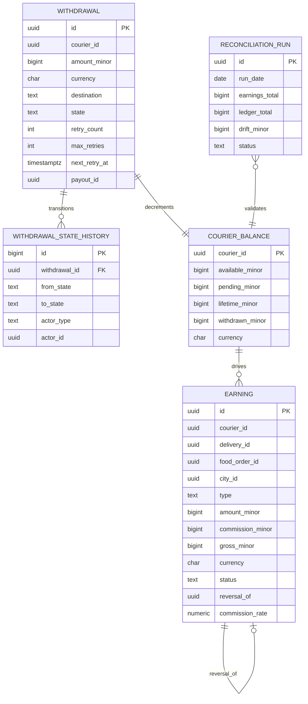

# courier-earnings-service — Entity-Relationship Diagram

## 1. Database

- Engine: PostgreSQL 18.
- Schema: `courier_earnings` (owned exclusively by this service).
- Migrations: `services/courier-earnings-service/migrations/` —
  versioned, forward-only.

## 2. Cross-Service References

| Column | Type | Refers to | Source of truth |
|--------|------|-----------|------------------|
| `courier_id` | UUID | `Courier` in `courier-service` | `courier-service` |
| `delivery_id` | UUID | `Delivery` in `delivery-service` | `delivery-service` |
| `food_order_id` | UUID | `FoodOrder` in `food-order-service` | `food-order-service` |
| `city_id` | UUID | `City` in `zone-service` | `zone-service` |
| `branch_id` | UUID | `Branch` in `branch-service` | `branch-service` |
| `restaurant_id` | UUID | `Restaurant` in `restaurant-service` | `restaurant-service` |
| `payment_method_token` | UUID | provider token in `payment-service` | `payment-service` |
| `correlation_id` | UUID | request scope | gateway |

All cross-service references are stored as UUID columns **without**
database-level foreign keys. See
[`architecture/CONSISTENCY_STRATEGY.md`](../../architecture/CONSISTENCY_STRATEGY.md).

## 3. Entities

### `Earning`

The courier earnings ledger. Append-only (INSERT only; no UPDATE
on `amount_minor`, `currency`, `type`, `courier_id`,
`delivery_id`).

#### Columns

| Column | Type | Constraints | Notes |
|--------|------|-------------|-------|
| `id` | UUID | PK | UUIDv7 |
| `courier_id` | UUID | NOT NULL | cross-service ref |
| `delivery_id` | UUID | NULL | null for non-delivery earnings (e.g. bonus) |
| `food_order_id` | UUID | NULL | denormalised for reporting |
| `branch_id` | UUID | NULL | |
| `restaurant_id` | UUID | NULL | |
| `city_id` | UUID | NOT NULL | |
| `type` | TEXT | NOT NULL CHECK in (`base`,`tip`,`bonus`,`adjustment`) | earning type |
| `amount_minor` | BIGINT | NOT NULL | positive; courier's share |
| `commission_minor` | BIGINT | NOT NULL | platform's cut |
| `gross_minor` | BIGINT | NOT NULL | `amount_minor + commission_minor` |
| `currency` | CHAR(3) | NOT NULL | ISO 4217 |
| `status` | TEXT | NOT NULL CHECK in (`accrued`,`reversed`) | terminal states |
| `reversal_of` | UUID | NULL REFERENCES earning(id) | self-FK for adjustments |
| `commission_rate` | NUMERIC(5,4) | NOT NULL | rate at accrual time |
| `correlation_id` | UUID | NOT NULL | from upstream event |
| `created_at` | TIMESTAMPTZ | NOT NULL DEFAULT now() | append-only |
| `created_by` | UUID | NOT NULL | system actor |
| `accrued_at` | TIMESTAMPTZ | NOT NULL | business accrual time |

#### Indexes

- PK on `id`.
- Unique on `(delivery_id, courier_id, type)` for `delivery_id IS NOT NULL`.
- Index on `courier_id, accrued_at DESC` for courier statement.
- Index on `city_id, accrued_at` for city aggregates.
- Index on `type, accrued_at` for type breakdown.

#### Constraints

- CHECK `type IN (...)` as above.
- CHECK `status IN (...)` as above.
- CHECK `amount_minor >= 0 AND commission_minor >= 0 AND gross_minor >= 0`.
- CHECK `gross_minor = amount_minor + commission_minor`.
- CHECK `commission_rate BETWEEN 0 AND 1`.

### `Withdrawal`

A courier's request to withdraw their available balance.

#### Columns

| Column | Type | Constraints | Notes |
|--------|------|-------------|-------|
| `id` | UUID | PK | UUIDv7 |
| `courier_id` | UUID | NOT NULL | cross-service ref |
| `amount_minor` | BIGINT | NOT NULL | positive |
| `currency` | CHAR(3) | NOT NULL | |
| `destination` | TEXT | NOT NULL CHECK in (`bank`,`wallet`) | |
| `state` | TEXT | NOT NULL CHECK in (`initiated`,`payout_inflight`,`completed`,`failed`,`cancelled`) | state machine |
| `retry_count` | INT | NOT NULL DEFAULT 0 | |
| `max_retries` | INT | NOT NULL | snapshot at creation |
| `next_retry_at` | TIMESTAMPTZ | NULL | |
| `last_error` | TEXT | NULL | |
| `payment_method_token` | UUID | NOT NULL | from `payment-service` |
| `payout_id` | UUID | NULL | set on first payout call |
| `payout_completed_at` | TIMESTAMPTZ | NULL | |
| `correlation_id` | UUID | NOT NULL | |
| `created_at` | TIMESTAMPTZ | NOT NULL DEFAULT now() | |
| `updated_at` | TIMESTAMPTZ | NOT NULL DEFAULT now() | |
| `created_by` | UUID | NOT NULL | |
| `updated_by` | UUID | NOT NULL | |

#### Indexes

- PK on `id`.
- Index on `courier_id, created_at DESC`.
- Partial unique on `(courier_id) WHERE state IN ('initiated',
  'payout_inflight')` to enforce "at most one pending".
- Index on `state, next_retry_at` for retry scheduler.

#### Constraints

- CHECK `state IN (...)` as above.
- CHECK `amount_minor > 0`.
- CHECK `retry_count >= 0 AND retry_count <= max_retries`.

### `WithdrawalStateHistory`

Append-only audit of withdrawal transitions.

#### Columns

| Column | Type | Constraints | Notes |
|--------|------|-------------|-------|
| `id` | BIGSERIAL | PK | |
| `withdrawal_id` | UUID | NOT NULL REFERENCES withdrawal(id) | FK within schema |
| `from_state` | TEXT | NULL | |
| `to_state` | TEXT | NOT NULL | |
| `actor_type` | TEXT | NOT NULL CHECK in (`courier`,`admin`,`system`) | |
| `actor_id` | UUID | NULL | |
| `reason` | TEXT | NULL | |
| `occurred_at` | TIMESTAMPTZ | NOT NULL | |
| `correlation_id` | UUID | NOT NULL | |
| `created_at` | TIMESTAMPTZ | NOT NULL DEFAULT now() | |

#### Indexes

- PK on `id`.
- Index on `withdrawal_id, occurred_at`.

### `CourierBalance`

Materialised balance per courier. Maintained in the same
transaction as an Earning or Withdrawal insert.

#### Columns

| Column | Type | Constraints | Notes |
|--------|------|-------------|-------|
| `courier_id` | UUID | PK | cross-service ref |
| `available_minor` | BIGINT | NOT NULL DEFAULT 0 | `accrued - withdrawn` |
| `pending_minor` | BIGINT | NOT NULL DEFAULT 0 | sum of pending withdrawals |
| `lifetime_minor` | BIGINT | NOT NULL DEFAULT 0 | sum of all earnings |
| `withdrawn_minor` | BIGINT | NOT NULL DEFAULT 0 | sum of completed withdrawals |
| `currency` | CHAR(3) | NOT NULL | |
| `last_accrual_at` | TIMESTAMPTZ | NULL | |
| `updated_at` | TIMESTAMPTZ | NOT NULL DEFAULT now() | |

#### Constraints

- CHECK `available_minor >= 0`.
- CHECK `pending_minor >= 0`.
- CHECK `lifetime_minor >= 0`.
- CHECK `withdrawn_minor >= 0`.

### `ReconciliationRun`

One row per daily reconciliation run.

#### Columns

| Column | Type | Constraints | Notes |
|--------|------|-------------|-------|
| `id` | UUID | PK | UUIDv7 |
| `run_date` | DATE | UNIQUE NOT NULL | |
| `started_at` | TIMESTAMPTZ | NOT NULL | |
| `ended_at` | TIMESTAMPTZ | NULL | |
| `earnings_total` | BIGINT | NOT NULL | sum from this service |
| `ledger_total` | BIGINT | NOT NULL | sum from ledger-service |
| `drift_minor` | BIGINT | NOT NULL | `earnings_total - ledger_total` |
| `status` | TEXT | NOT NULL CHECK in (`running`,`matched`,`drift`,`error`) | |
| `details` | JSONB | NULL | per-courier diffs if drift |
| `correlation_id` | UUID | NOT NULL | |
| `created_at` | TIMESTAMPTZ | NOT NULL DEFAULT now() | |

#### Constraints

- CHECK `status IN (...)` as above.

### `Outbox` / `Inbox`

Standard platform outbox/inbox. See
[`EVENT_ARCHITECTURE.md`](../../architecture/EVENT_ARCHITECTURE.md).

## 4. Mermaid ER Diagram



## 5. DDL Sketch

```sql
CREATE SCHEMA IF NOT EXISTS courier_earnings;

CREATE TABLE courier_earnings.earnings (
    id UUID NOT NULL,
    courier_id UUID NOT NULL,
    delivery_id UUID,
    food_order_id UUID,
    branch_id UUID,
    restaurant_id UUID,
    city_id UUID NOT NULL,
    type TEXT NOT NULL CHECK (type IN ('base','tip','bonus','adjustment')),
    amount_minor BIGINT NOT NULL,
    commission_minor BIGINT NOT NULL,
    gross_minor BIGINT NOT NULL,
    currency CHAR(3) NOT NULL,
    status TEXT NOT NULL CHECK (status IN ('accrued','reversed')),
    reversal_of UUID REFERENCES courier_earnings.earnings(id),
    commission_rate NUMERIC(5,4) NOT NULL,
    correlation_id UUID NOT NULL,
    created_at TIMESTAMPTZ NOT NULL DEFAULT now(),
    created_by UUID NOT NULL,
    accrued_at TIMESTAMPTZ NOT NULL,
    PRIMARY KEY (id, accrued_at),
    CONSTRAINT earnings_amounts_chk
        CHECK (amount_minor >= 0 AND commission_minor >= 0 AND gross_minor >= 0),
    CONSTRAINT earnings_gross_chk CHECK (gross_minor = amount_minor + commission_minor),
    CONSTRAINT earnings_rate_chk CHECK (commission_rate BETWEEN 0 AND 1)
) PARTITION BY RANGE (accrued_at);

CREATE UNIQUE INDEX earnings_delivery_courier_type_uq
    ON courier_earnings.earnings (delivery_id, courier_id, type)
    WHERE delivery_id IS NOT NULL;
CREATE INDEX earnings_courier_accrued_ix
    ON courier_earnings.earnings (courier_id, accrued_at DESC);
CREATE INDEX earnings_city_accrued_ix
    ON courier_earnings.earnings (city_id, accrued_at);
CREATE INDEX earnings_type_accrued_ix
    ON courier_earnings.earnings (type, accrued_at);

CREATE TABLE IF NOT EXISTS courier_earnings.earnings_2026_08 PARTITION OF courier_earnings.earnings FOR VALUES FROM ('2026-08-01 00:00:00+00') TO ('2026-09-01 00:00:00+00');

CREATE TABLE courier_earnings.withdrawals (
    id UUID PRIMARY KEY,
    courier_id UUID NOT NULL,
    amount_minor BIGINT NOT NULL,
    currency CHAR(3) NOT NULL,
    destination TEXT NOT NULL CHECK (destination IN ('bank','wallet')),
    state TEXT NOT NULL CHECK (state IN ('initiated','payout_inflight','completed','failed','cancelled')),
    retry_count INT NOT NULL DEFAULT 0,
    max_retries INT NOT NULL,
    next_retry_at TIMESTAMPTZ,
    last_error TEXT,
    payment_method_token UUID NOT NULL,
    payout_id UUID,
    payout_completed_at TIMESTAMPTZ,
    correlation_id UUID NOT NULL,
    created_at TIMESTAMPTZ NOT NULL DEFAULT now(),
    updated_at TIMESTAMPTZ NOT NULL DEFAULT now(),
    created_by UUID NOT NULL,
    updated_by UUID NOT NULL,
    CONSTRAINT withdrawals_amount_chk CHECK (amount_minor > 0),
    CONSTRAINT withdrawals_retry_chk
        CHECK (retry_count >= 0 AND retry_count <= max_retries)
);

CREATE INDEX withdrawals_courier_created_ix
    ON courier_earnings.withdrawals (courier_id, created_at DESC);
CREATE UNIQUE INDEX withdrawals_one_pending_uq
    ON courier_earnings.withdrawals (courier_id)
    WHERE state IN ('initiated','payout_inflight');
CREATE INDEX withdrawals_state_retry_ix
    ON courier_earnings.withdrawals (state, next_retry_at);

CREATE TABLE courier_earnings.withdrawal_state_history (
    id BIGSERIAL PRIMARY KEY,
    withdrawal_id UUID NOT NULL REFERENCES courier_earnings.withdrawals(id),
    from_state TEXT,
    to_state TEXT NOT NULL,
    actor_type TEXT NOT NULL CHECK (actor_type IN ('courier','admin','system')),
    actor_id UUID,
    reason TEXT,
    occurred_at TIMESTAMPTZ NOT NULL,
    correlation_id UUID NOT NULL,
    created_at TIMESTAMPTZ NOT NULL DEFAULT now()
);

CREATE INDEX wsh_withdrawal_time_ix
    ON courier_earnings.withdrawal_state_history (withdrawal_id, occurred_at);

CREATE TABLE courier_earnings.courier_balances (
    courier_id UUID PRIMARY KEY,
    available_minor BIGINT NOT NULL DEFAULT 0,
    pending_minor BIGINT NOT NULL DEFAULT 0,
    lifetime_minor BIGINT NOT NULL DEFAULT 0,
    withdrawn_minor BIGINT NOT NULL DEFAULT 0,
    currency CHAR(3) NOT NULL,
    last_accrual_at TIMESTAMPTZ,
    updated_at TIMESTAMPTZ NOT NULL DEFAULT now(),
    CONSTRAINT balances_nonneg_chk
        CHECK (available_minor >= 0 AND pending_minor >= 0
               AND lifetime_minor >= 0 AND withdrawn_minor >= 0)
);

CREATE TABLE courier_earnings.reconciliation_runs (
    id UUID PRIMARY KEY,
    run_date DATE UNIQUE NOT NULL,
    started_at TIMESTAMPTZ NOT NULL,
    ended_at TIMESTAMPTZ,
    earnings_total BIGINT NOT NULL,
    ledger_total BIGINT NOT NULL,
    drift_minor BIGINT NOT NULL,
    status TEXT NOT NULL CHECK (status IN ('running','matched','drift','error')),
    details JSONB,
    correlation_id UUID NOT NULL,
    created_at TIMESTAMPTZ NOT NULL DEFAULT now()
);

CREATE TABLE courier_earnings.outbox (
    id BIGSERIAL PRIMARY KEY,
    event_id UUID UNIQUE NOT NULL,
    topic TEXT NOT NULL,
    partition_key UUID NOT NULL,
    payload JSONB NOT NULL,
    created_at TIMESTAMPTZ NOT NULL DEFAULT now(),
    claimed_at TIMESTAMPTZ,
    published_at TIMESTAMPTZ
);

CREATE TABLE courier_earnings.inbox (
    event_id UUID PRIMARY KEY,
    topic TEXT NOT NULL,
    received_at TIMESTAMPTZ NOT NULL DEFAULT now(),
    processed_at TIMESTAMPTZ,
    error TEXT
);
```

## 6. Audit Columns

Every mutable table has `created_at`, `updated_at`, `created_by`,
`updated_by`. The `earnings` and `withdrawal_state_history` tables
are append-only.

## 7. Soft Delete

Not used. Earnings are immutable. Withdrawals that are `cancelled`
or `failed` are kept for audit; a separate retention job hard-deletes
rows older than 7 years.

## 8. JSONB Usage

- `reconciliation_runs.details` — per-courier diffs when drift
  detected. Bounded.
- `outbox.payload` — event envelope.

## 9. Partitioning

| Table | Strategy | Cadence | Pre-create | Retention |
|-------|----------|---------|------------|-----------|
| `earnings` | RANGE on `accrued_at` | monthly | 12 months | 7 years (financial) |

> See [DATABASE_ARCHITECTURE.md §"Table Partitioning — Canonical Template"](../../architecture/DATABASE_ARCHITECTURE.md) for the idempotent CREATE TABLE IF NOT EXISTS … PARTITION OF … pattern, naming convention, and the service-owned maintenance-job contract.

## 10. Data Retention

| Table | Retention | Purged by |
|-------|-----------|-----------|
| `earnings` | 7 years (financial) | nightly batch |
| `withdrawals` | 7 years (financial) | nightly batch |
| `withdrawal_state_history` | 7 years (audit) | nightly batch |
| `courier_balances` | forever (rebuilt on demand) | n/a |
| `reconciliation_runs` | 7 years | nightly batch |
| `outbox` | 24h after `published_at` | poller |
| `inbox` | 30 days (TTL) | nightly batch |

## 11. Migration Considerations

- The earnings table is append-only by convention; enforced by
  revoking UPDATE/DELETE on `amount_minor`, `currency`, `type`,
  `courier_id`, `delivery_id` from the application role.
- Adding a new `type` value requires a CHECK update and code
  changes.
- Adding a new `destination` value requires a CHECK update.
- The unique partial index `withdrawals_one_pending_uq` is
  critical; re-creation must be done in a single transaction.
- Balance updates are always in the same transaction as the
  earning / withdrawal insert; never in a separate transaction.

---

## See also

### Sibling docs for this service

- [`README.md`](./README.md) — purpose, bounded context, responsibilities
- [`BRD.md`](./BRD.md) — business requirements
- [`SRS.md`](./SRS.md) — functional + non-functional requirements
- [`ERD.md`](./ERD.md) — data model (entities, relationships)
- [`INTEGRATION.md`](./INTEGRATION.md) — inter-service contracts (APIs, events, sagas)
- [`WORKFLOWS.md`](./WORKFLOWS.md) — operational workflows (happy paths, failure modes)
- [`TECH.md`](./TECH.md) — technology profile (runtime, libraries, data layer, admin endpoints, RBAC)

### Platform-wide

- [`../../shared/README.md`](../../shared/README.md) — `platform-spring-boot-starter` shared library (the single source of cross-cutting code for all Spring Boot services in the platform)
- [`../RECOMMENDATIONS.md`](../RECOMMENDATIONS.md) — platform-wide technology map (language, framework, version baseline, admin/RBAC pattern)
- [`../../README.md`](../../README.md) — services overview (the catalog of all 58 services)
- [`../../../main.md`](../../../main.md) — top-level platform specification (architecture, Keycloak, PostgreSQL 18, messaging, observability baseline)

