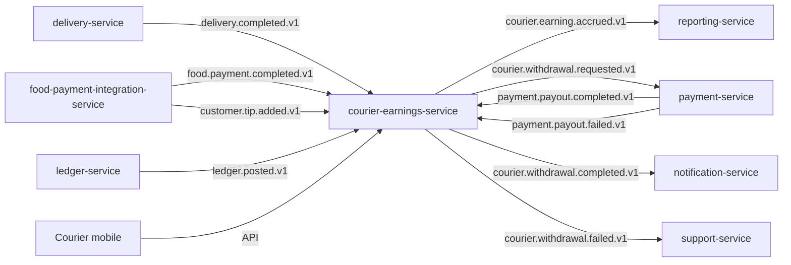

# courier-earnings-service — Software Requirements Specification

## 1. Introduction

This document specifies the software behaviour of
`courier-earnings-service`. It is the engineering source of truth
for the earnings ledger, withdrawals, and reconciliation.

## 2. Scope

- In scope: accrual (base + tip), the earnings ledger, withdrawal
  requests, payout orchestration, retries, the statement view,
  daily reconciliation.
- Out of scope: courier profile, delivery state, payment
  provider integration (owned by `payment-service`),
  wallet/ledger mechanics (those services own them).

## 3. System Context



## 4. Actors

- `courier` (Keycloak `platform-courier`).
- `food-payment-integration-service` (system actor).
- `delivery-service` (system actor; publishes the trigger).
- `payment-service` (system actor; executes payouts).
- `ledger-service` (system actor; reconciliation).
- `admin-service` / `support-service` (Keycloak `platform-internal`).

## 5. Functional Requirements

| ID | Requirement | Priority |
|----|-------------|----------|
| FR--001 | On `delivery.completed.v1`, insert a base earning row with `(delivery_id, courier_id, type=base, amount_minor, currency)`. | MUST |
| FR--002 | On `customer.tip.added.v1`, insert a tip earning row with `(delivery_id, courier_id, type=tip, ...)`. | MUST |
| FR--003 | The accrual insert is idempotent on `(delivery_id, courier_id, type)`. | MUST |
| FR--004 | Reject any attempt to modify an existing earning row (no UPDATE, no DELETE except by the reaper). | MUST |
| FR--005 | Provide `GET /v1/courier-earnings/balance/{courier_id}` returning `available_minor`, `pending_minor`, `lifetime_minor`. | MUST |
| FR--006 | Accept `POST /v1/courier-withdrawals` with `amount_minor`, `currency`, `destination` (`bank` or `wallet`). | MUST |
| FR--007 | Reject the withdrawal if the courier's available balance is less than `amount_minor` or less than `min_withdrawal_minor`. | MUST |
| FR--008 | Reject the withdrawal if the courier already has a pending withdrawal. | MUST |
| FR--009 | On accept, create the withdrawal row in `initiated` state and call `payment-service` for payout within 30s. | MUST |
| FR--010 | On `payment.payout.completed.v1`, mark the withdrawal `completed` and update the courier's available balance. | MUST |
| FR--011 | On `payment.payout.failed.v1`, increment the retry counter; if `< payout_max_retries`, retry with backoff; else mark `failed` and open a support ticket. | MUST |
| FR--012 | Provide `POST /v1/courier-withdrawals/{id}/cancel` (courier or admin) for withdrawals in `initiated` state and ≤ 30s old. | SHOULD |
| FR--013 | Provide `GET /v1/courier-statements/{courier_id}?period=daily|weekly|monthly`. | MUST |
| FR--014 | Run a daily reconciliation against `ledger-service` and emit `courier_earnings.audit.reconciled.v1`. | MUST |
| FR--015 | Support per-city commission overrides. | SHOULD |
| FR--016 | Support admin force-payout (`POST /v1/courier-withdrawals/{id}/force_payout`) with audit note. | MUST |
| FR--017 | Emit `courier.earning.accrued.v1` and `courier.withdrawal.requested.v1` on the outbox. | MUST |
| FR--018 | Maintain the statement cache (Redis) for hot reads. | SHOULD |
| FR--019 | Retry failed payouts with exponential backoff: 1m, 5m, 30m. | MUST |
| FR--020 | On reconciliation drift, open a P1 ticket and emit `courier_earnings.audit.reconciliation_drift.v1`. | MUST |

## 6. Non-Functional Requirements

| ID | Category | Requirement | Target |
|----|----------|-------------|--------|
| NFR--001 | performance | Accrual P99 | ≤ 5 min from event |
| NFR--002 | performance | Withdrawal initiation P99 | ≤ 30s |
| NFR--003 | performance | Balance read P99 | ≤ 100ms |
| NFR--004 | performance | Statement read P99 | ≤ 500ms |
| NFR--005 | availability | Service uptime | 99.95% / 30d |
| NFR--006 | scalability | Accrual throughput | 200 rps |
| NFR--007 | scalability | Concurrent active couriers | ≥ 100k |
| NFR--008 | maintainability | MTTR | ≤ 30 min |
| NFR--009 | observability | End-to-end trace per accrual | 100% |
| NFR--010 | consistency | Available balance always = sum of accruals − sum of withdrawals | enforced by the ledger and reconciliation |

## 7. API Requirements

- All non-idempotent `POST` endpoints require `Idempotency-Key`.
- All responses use the standard error envelope.
- All endpoints validate input with JSON Schema.
- Full contracts: `INTEGRATION.md`.

## 8. Data Requirements

| ID | Requirement | Notes |
|----|-------------|-------|
| DATA--001 | `courier_id`, `delivery_id`, `food_order_id`, `withdrawal_id`, `city_id` are stored as UUID columns WITHOUT database FKs. | Cross-service references. |
| DATA--002 | The earnings ledger is append-only (INSERT only). | |
| DATA--003 | Money values are `amount_minor BIGINT` + `currency CHAR(3)`. | |
| DATA--004 | Every mutable table has `created_at`, `updated_at`, `created_by`, `updated_by`. | |
| DATA--005 | No PII beyond `courier_id`. | |

## 9. Validation Rules

- `amount_minor > 0` for accruals and withdrawals.
- `currency` is a valid ISO 4217 code.
- `destination` is one of `bank`, `wallet`.
- A withdrawal's `amount_minor ≤ courier.available_balance` and
  `≥ min_withdrawal_minor`.
- A withdrawal's `amount_minor ≤ max_withdrawal_minor`.

## 10. State Transitions

`Withdrawal` state machine:

```
[*] → initiated → payout_inflight → completed
                                ↘ retry_scheduled → payout_inflight
                                ↘ failed → [*]
initiated → cancelled (courier within 30s)
```

`Earning` rows are terminal on insert; no transitions.

## 11. Authorization Requirements

- Couriers may only read their own earnings and request
  withdrawals for themselves.
- Admins require `courier.admin` for force-payout and admin views.
- Service-to-service callers require `courier-earnings.write` or
  `courier-earnings.read`.

## 12. Configuration Requirements

- Reads `courier_earnings.*` from `configuration-service` at
  startup and on `configuration.updated.v1`.
- All numeric config validated against min/max bounds.

## 13. Error Handling

| Error | Response |
|-------|----------|
| Insufficient balance | 422 `INSUFFICIENT_BALANCE` |
| Below minimum | 422 `BELOW_MIN_WITHDRAWAL` |
| Above maximum | 422 `ABOVE_MAX_WITHDRAWAL` |
| Pending withdrawal exists | 409 `WITHDRAWAL_ALREADY_PENDING` |
| Withdrawal not in `initiated` | 409 `STATE_INVALID` |
| Downstream `payment-service` down | 503 `CIRCUIT_OPEN` |
| Idempotency-Key reused | 422 `IDEMPOTENCY_KEY_REUSED` |

## 14. Concurrency Requirements

- A row-level lock on the `courier_earnings` summary row is
  acquired at every withdrawal to prevent double-spend.
- The accrual insert is idempotent by unique constraint on
  `(delivery_id, courier_id, type)`.
- The retry scheduler uses an advisory lock per withdrawal to
  prevent concurrent retries.

## 15. Idempotency Requirements

- All `POST` endpoints require `Idempotency-Key`.
- The accrual idempotency key is `delivery:<delivery_id>:courier:<courier_id>:type:<base|tip>`.
- The withdrawal idempotency key is
  `courier:<courier_id>:withdrawal:<request_id>`.
- Replays return the original response.

## 16. Performance

- Dominant path: receive `delivery.completed.v1`, insert earning
  row, update balance summary, emit `courier.earning.accrued.v1`.
- P50 / P95 / P99: see NFRs.
- Hot spot: the balance summary updates. Mitigated by
  denormalised `balance_minor` column updated in the same
  transaction as the earning.

## 17. Scalability

- Horizontal: stateless; HPA on `kafka_consumer_lag` and
  `courier_earnings_accrued_total`.
- Vertical: bounded by PostgreSQL connection pool.

## 18. Availability

- SLO: 99.95% over 30 days. Error budget: ~22 min / 30d.
- Maintenance: rolling deploys only.
- Degraded mode: if `payment-service` is down, withdrawals queue;
  the service returns 503 and the courier is told to retry.

## 19. Security

| ID | Requirement | Notes |
|----|-------------|-------|
| SEC--001 | All endpoints require JWT bearer validated at the gateway. | |
| SEC--002 | Couriers may only read their own earnings. | Server check. |
| SEC--003 | No PII is stored beyond `courier_id`. | |
| SEC--004 | No bank account details are stored. | Stored in `payment-service` as a token. |
| SEC--005 | Admin force-payout is audit-logged. | `admin.action.performed.v1`. |
| SEC--006 | Rate limit: 5 withdrawal requests per courier per hour. | At the service. |

## 20. Privacy

- PII stored: none.
- Retention: ledger rows retained for 7 years (financial).
- Erasure: not applicable.

## 21. Auditability

- Every earning row is immutable.
- Every withdrawal has a state history.
- Admin force-payouts emit `admin.action.performed.v1`.
- Reconciliation runs emit `courier_earnings.audit.reconciled.v1`
  (or `reconciliation_drift.v1` on drift).

## 22. Observability

- Logs: JSON, fields include `correlation_id`, `courier_id`,
  `earning_id`, `withdrawal_id`, `tenant_id`.
- Metrics: `courier_earnings_accrued_total{city_id,type}`,
  `courier_tip_accrued_total{city_id}`,
  `courier_withdrawal_requested_total`,
  `courier_withdrawal_completed_total`,
  `courier_withdrawal_failed_total{reason}`,
  `courier_earnings_ledger_size`,
  `courier_earnings_reconciliation_drift`.
- Traces: OpenTelemetry; root span per accrual / withdrawal.
- Alerts: SLO burn-rate; reconciliation drift > 0; payout failure
  rate > 5%; accrual lag > 10 min.

## 23. Maintainability

- Code style: TypeScript strict, ESLint with platform rules.
- Test coverage: ≥ 80% line, ≥ 70% branch; 100% on the state
  machine and the accrual idempotency.
- Documentation: this folder + `WORKFLOWS.md` diagrams.

## 24. Disaster Recovery

- RPO: 5 minutes (the earnings ledger is replicated to standby
  region).
- RTO: 30 minutes (stateless service).

## 25. Acceptance Criteria

- All FR/NFR are met and verified by automated tests.
- All SEC are met and verified by a security review.
- A load test sustains 200 accruals / second with p99 ≤ 5 min
  end-to-end.
- A chaos test (kill `payment-service`) shows the service queues
  withdrawals and resumes.
- Reconciliation reports zero drift over 7 days.

---

## See also

### Sibling docs for this service

- [`README.md`](./README.md) — purpose, bounded context, responsibilities
- [`BRD.md`](./BRD.md) — business requirements
- [`SRS.md`](./SRS.md) — functional + non-functional requirements
- [`ERD.md`](./ERD.md) — data model (entities, relationships)
- [`INTEGRATION.md`](./INTEGRATION.md) — inter-service contracts (APIs, events, sagas)
- [`WORKFLOWS.md`](./WORKFLOWS.md) — operational workflows (happy paths, failure modes)
- [`TECH.md`](./TECH.md) — technology profile (runtime, libraries, data layer, admin endpoints, RBAC)

### Platform-wide

- [`../../shared/README.md`](../../shared/README.md) — `platform-spring-boot-starter` shared library (the single source of cross-cutting code for all Spring Boot services in the platform)
- [`../RECOMMENDATIONS.md`](../RECOMMENDATIONS.md) — platform-wide technology map (language, framework, version baseline, admin/RBAC pattern)
- [`../../README.md`](../../README.md) — services overview (the catalog of all 58 services)
- [`../../../main.md`](../../../main.md) — top-level platform specification (architecture, Keycloak, PostgreSQL 18, messaging, observability baseline)

