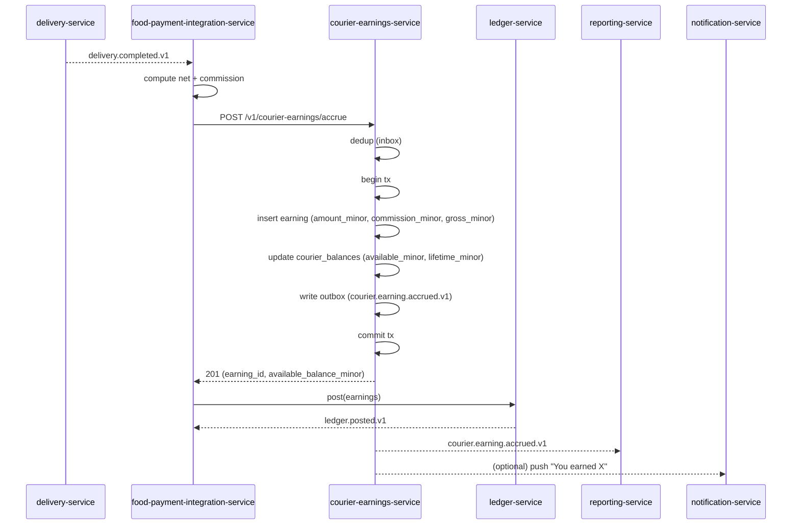
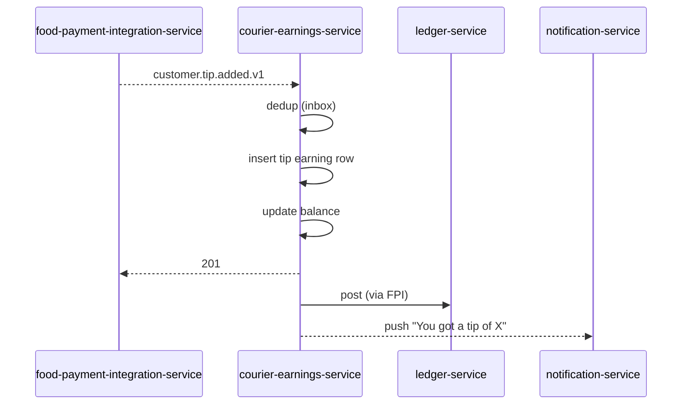
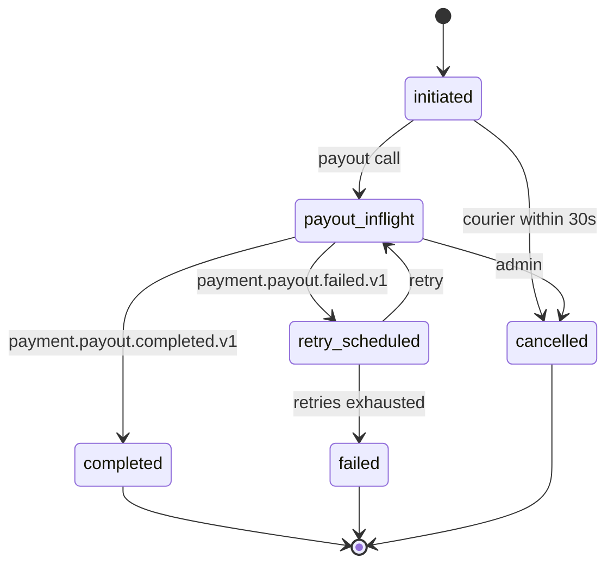
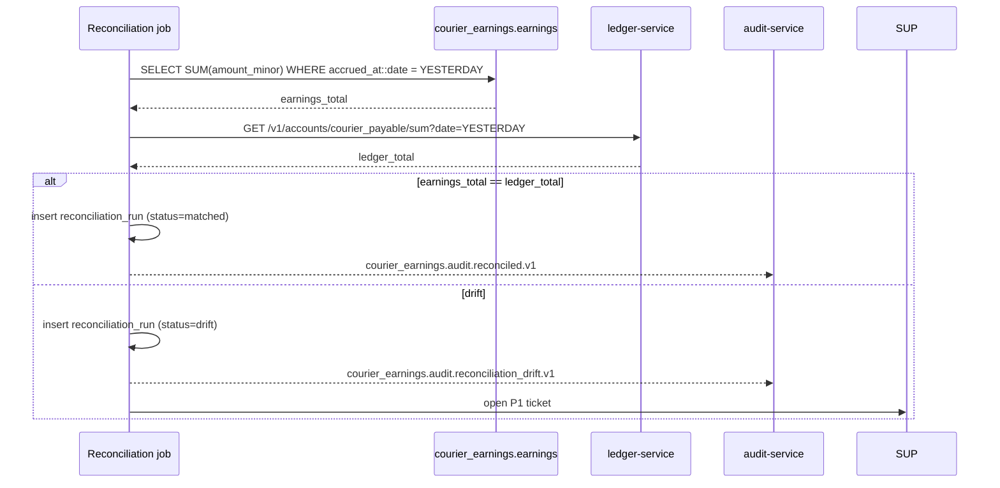

# courier-earnings-service — Workflows

## 1. `Earning Accrual on Delivery Completion` (Happy Path)

### 1.1 Objective

When a delivery is completed, accrue the courier's base earning
(less the platform commission) and update the balance.

### 1.2 Initiating Actor

`delivery-service` (system actor) emits `delivery.completed.v1`.

### 1.3 Participating Services

- `delivery-service` (producer)
- `food-payment-integration-service` (downstream consumer of the
  same event; provides the commission and net amounts)
- `courier-earnings-service` (this service)
- `ledger-service` (records the double-entry posting)
- `reporting-service` (consumer of `courier.earning.accrued.v1`)

### 1.4 Prerequisites

- A delivery has been completed and the proof of delivery has
  been validated.
- The commission rate for the city is loaded.
- The courier is `online` or was `online` at the time of delivery.

### 1.5 Happy Path



### 1.6 Alternate Paths

- **Tip is added later**: `customer.tip.added.v1` triggers a
  separate accrual (see §2).

### 1.7 Failure Paths

- **Duplicate event**: the unique constraint on
  `(delivery_id, courier_id, type)` prevents double-insert;
  the second call returns 409 `EARNING_ALREADY_EXISTS`.
- **Outbox publish fails**: the row remains; the poller retries.
- **Ledger-service down**: the financial saga is paused; the
  earning is still accrued in this service (the source of truth
  for the courier's earnings). Reconciliation will catch up.

### 1.8 Business Rules

- The earning row is append-only.
- The commission rate is the snapshot at accrual time.
- The balance is updated in the same transaction.

### 1.9 State Transitions

Earning rows are terminal on insert; no transitions.

### 1.10 Events

| Event | Direction | When |
|-------|-----------|------|
| `delivery.completed.v1` | consumed | on delivery done |
| `courier.earning.accrued.v1` | produced | on insert |

### 1.11 APIs Involved

| API | Direction | When |
|-----|-----------|------|
| `POST /v1/courier-earnings/accrue` | inbound | from FPI |

### 1.12 Compensation / Rollback

- A reversal is a new `adjustment` row with `reversal_of` pointing
  to the original.
- Admin-initiated via `POST /v1/courier-earnings/{id}/reverse` (not
  exposed in the normal API; available in the admin console).

### 1.13 Final State

- Earning row present in the ledger.
- `courier_balances.available_minor` increased.
- Event emitted.

## 2. `Tip Accrual` (After Delivery)

### 2.1 Objective

When a customer adds a tip after delivery, accrue the tip as a
separate earning row.

### 2.2 Initiating Actor

`food-payment-integration-service` emits `customer.tip.added.v1`.

### 2.3 Participating Services

- `food-payment-integration-service` (producer)
- `courier-earnings-service` (this service)
- `ledger-service` (records the tip posting)

### 2.4 Prerequisites

- The delivery is `delivered`.
- The customer has paid via a method that supports post-delivery
  tip (or has added a tip in the app).

### 2.5 Happy Path



### 2.6 Alternate Paths

- **Tip is part of the initial payment**: it is included in the
  base accrual (no separate row).
- **Tip is adjusted by support**: a separate `adjustment` row is
  inserted with `reversal_of` pointing to the original tip.

### 2.7 Failure Paths

- **Duplicate tip event**: 409 (idempotent).
- **Tip window expired** (default 24h after delivery): 422
  `TIP_WINDOW_EXPIRED`; the tip is recorded as a customer credit
  instead.

### 2.8 Business Rules

- The tip is added to the next withdrawal; it does not modify
  the already-captured base.
- Tips are commission-free by default; per-city overrides
  supported.

### 2.9 State Transitions

N/A (append-only).

### 2.10 Events

| Event | Direction | When |
|-------|-----------|------|
| `customer.tip.added.v1` | consumed | on tip add |
| `courier.earning.tip_accrued.v1` | produced | on insert |

### 2.11 APIs Involved

| API | Direction | When |
|-----|-----------|------|
| `POST /v1/courier-earnings/tip` | inbound | from FPI |

### 2.12 Compensation / Rollback

- Admin-initiated reversal (separate adjustment row).

### 2.13 Final State

- Tip earning row present.
- Balance increased.

## 3. `Withdrawal Request → Payout → Completion` (Happy Path)

### 3.1 Objective

A courier requests a withdrawal; the service orchestrates the
payout via `payment-service` and updates the balance on success.

### 3.2 Initiating Actor

Courier (mobile app) calls `POST /v1/courier-withdrawals`.

### 3.3 Participating Services

- `courier-earnings-service` (this service)
- `payment-service` (executes the payout)
- `ledger-service` (records the withdrawal posting)
- `notification-service` (notifies the courier)

### 3.4 Prerequisites

- The courier's `available_balance` ≥ `amount_minor` and
  ≥ `min_withdrawal_minor`.
- The courier has no pending withdrawal.
- The courier's `payment_method_token` is valid.

### 3.5 Happy Path

```mermaid
sequenceDiagram
    participant CUR as Courier mobile
    participant CES as courier-earnings-service
    participant PAY as payment-service
    participant LD as ledger-service
    participant NOT as notification-service
    participant AUD as audit-service

    CUR->>CES: POST /v1/courier-withdrawals
    CES->>CES: validate balance, no pending
    CES->>CES: insert withdrawal (state=initiated)
    CES->>CES: update balance (available -= amount; pending += amount)
    CES->>CES: write outbox (courier.withdrawal.requested.v1)
    CES-->>CUR: 202
    CES->>PAY: POST /v1/payouts (Idempotency-Key=withdrawal:W)
    PAY-->>CES: payout accepted (payout_id)
    CES->>CES: withdrawal.state=payout_inflight
    PAY-->>CES: payment.payout.completed.v1
    CES->>CES: withdrawal.state=completed
    CES->>CES: update balance (pending -= amount; withdrawn += amount)
    CES-->>NOT: courier.withdrawal.completed.v1
    CES-->>AUD: courier.withdrawal.completed.v1
```

### 3.6 Alternate Paths

- **Destination is `wallet`**: the `payment-service` credits the
  courier's wallet; this service updates the balance as usual.
- **Admin force-payout**: an admin calls
  `POST /v1/courier-withdrawals/{id}/force_payout`; the same
  payout flow is initiated with the admin's audit note.

### 3.7 Failure Paths

- **`payment-service` is down**: the withdrawal is in
  `payout_inflight`; the retry scheduler picks it up after the
  circuit closes.
- **Payout fails**: see §4.
- **Balance is insufficient at payout time** (race): 422
  `INSUFFICIENT_BALANCE`; the withdrawal is marked `failed` and
  the balance is restored.

### 3.8 Business Rules

- At most one pending withdrawal per courier.
- The balance is updated in the same transaction as the
  withdrawal state change.
- The payout is idempotent (same key → same result).

### 3.9 State Transitions



### 3.10 Events

| Event | Direction | When |
|-------|-----------|------|
| `courier.withdrawal.requested.v1` | produced | on creation |
| `courier.withdrawal.completed.v1` | produced | on completion |
| `payment.payout.completed.v1` | consumed | on payout done |
| `payment.payout.failed.v1` | consumed | on payout fail |

### 3.11 APIs Involved

| API | Direction | When |
|-----|-----------|------|
| `POST /v1/courier-withdrawals` | inbound | courier |
| `POST /v1/payouts` | outbound | to payment-service |
| `POST /v1/courier-withdrawals/{id}/cancel` | inbound | courier / admin |

### 3.12 Compensation / Rollback

- A failed payout returns the balance to available.
- An admin can cancel a `payout_inflight` withdrawal (e.g. if
  the bank details are clearly wrong).

### 3.13 Final State

- Withdrawal: `completed`.
- Balance: `available` decreased; `withdrawn` increased.

## 4. `Payout Failure and Retry`

### 4.1 Objective

Handle a failed payout: retry with backoff up to
`payout_max_retries`; on exhaustion, surface to support.

### 4.2 Initiating Actor

`payment-service` emits `payment.payout.failed.v1`.

### 4.3 Participating Services

- `payment-service` (producer)
- `courier-earnings-service` (this service)
- `support-service` (consumer of `courier.withdrawal.failed.v1`)

### 4.4 Prerequisites

- The withdrawal is in `payout_inflight`.

### 4.5 Happy Path (Retry Succeeds)

```mermaid
sequenceDiagram
    participant PAY as payment-service
    participant CES as courier-earnings-service
    participant SUP as support-service
    participant NOT as notification-service

    PAY-->>CES: payment.payout.failed.v1
    CES->>CES: increment retry_count
    alt retry_count < max_retries
        CES->>CES: withdrawal.state=retry_scheduled
        CES->>CES: next_retry_at = now + backoff
        Note over CES: backoff: 1m, 5m, 30m
        CES->>CES: (scheduler) next_retry_at reached
        CES->>PAY: POST /v1/payouts (retry)
        PAY-->>CES: payment.payout.completed.v1
        CES->>CES: withdrawal.state=completed
    else retries exhausted
        CES->>CES: withdrawal.state=failed
        CES->>CES: restore balance (pending -= amount; available += amount)
        CES-->>SUP: courier.withdrawal.failed.v1
        CES-->>NOT: notify courier ("Withdrawal failed, contact support")
    end
```

### 4.6 Alternate Paths

- **Permanent failure** (bank details invalid): skip retries,
  surface immediately.

### 4.7 Failure Paths

- **Scheduler itself fails**: a daily reconciliation detects
  withdrawals stuck in `retry_scheduled` for > 24h and pages
  on-call.

### 4.8 Business Rules

- Retries use exponential backoff: 1m, 5m, 30m.
- After `max_retries`, the withdrawal is `failed` and the
  balance is restored.

### 4.9 State Transitions

See §3.9.

### 4.10 Events

| Event | Direction | When |
|-------|-----------|------|
| `payment.payout.failed.v1` | consumed | on fail |
| `courier.withdrawal.failed.v1` | produced | on exhaustion |

### 4.11 APIs Involved

| API | Direction | When |
|-----|-----------|------|
| `POST /v1/payouts` | outbound | retry |

### 4.12 Compensation / Rollback

- Balance is restored on exhaustion.

### 4.13 Final State

- Withdrawal: `completed` (retry success) or `failed`
  (exhaustion).
- Balance: correct.

## 5. `Daily Reconciliation`

### 5.1 Objective

Compare the courier earnings ledger against the courier payable
account in `ledger-service`; report drift.

### 5.2 Initiating Actor

A scheduled job at 03:00 UTC daily.

### 5.3 Participating Services

- `courier-earnings-service` (this service)
- `ledger-service` (provides the courier payable total)
- `support-service` (consumer of drift events)
- `admin-service` (consumer of drift events)

### 5.4 Prerequisites

- Yesterday's earnings are immutable.

### 5.5 Happy Path (No Drift)



### 5.6 Alternate Paths

- **`ledger-service` is down**: the run is marked `error`; an
  on-call is paged; the run is retried after 1h.

### 5.7 Failure Paths

- **Drift persists for > 1 day**: severity escalates; finance is
  looped in.

### 5.8 Business Rules

- Reconciliation runs at most once per day.
- Drift is computed as `earnings_total - ledger_total` in minor
  units; per-courier diffs are stored in `details`.

### 5.9 State Transitions

Reconciliation runs: `running → matched` (no drift) or
`running → drift` (drift found) or `running → error` (failure).

### 5.10 Events

| Event | Direction | When |
|-------|-----------|------|
| `courier_earnings.audit.reconciled.v1` | produced | on match |
| `courier_earnings.audit.reconciliation_drift.v1` | produced | on drift |

### 5.11 APIs Involved

| API | Direction | When |
|-----|-----------|------|
| `GET /v1/accounts/courier_payable/sum` | outbound | to ledger-service |

### 5.12 Compensation / Rollback

- A drift is repaired by an ops / finance investigation; the
  correction is a separate `adjustment` row.

### 5.13 Final State

- A `reconciliation_runs` row present.
- If drift: a P1 ticket is open and the finance team is engaged.

---

## 99. `Monthly Partition Maintenance`

### 99.1 Objective

Idempotently pre-create the next 12 monthly child partitions for partitioned tables in `courier_earnings`.

### 99.2 Initiating Actor

A scheduled job runs daily at `02:00 UTC`. Leader-elected via `pg_try_advisory_xact_lock(hashtext('courier_earnings.partition'), hashtext('monthly'))`.

### 99.3 Happy Path

```mermaid
sequenceDiagram
    participant JOB as Partition job
    participant PG as PostgreSQL
    JOB->>PG: pg_try_advisory_xact_lock('courier_earnings.monthly')
    alt lock acquired
        loop for each missing month in next 12
            JOB->>PG: CREATE TABLE IF NOT EXISTS courier_earnings.<table>_YYYY_MM PARTITION OF courier_earnings.<table>
            JOB->>PG: verify (pg_inherits, relpartbound)
        end
        JOB->>PG: assert now() in existing child
    else lock NOT acquired
        Note over JOB: another instance is running; exit cleanly
    end
```

### 99.4 Failure Paths

| Failure | Handling |
|---------|----------|
| Lock contention | exit 0 |
| DDL fails | retry 3× with backoff (1 s / 4 s / 16 s); page on-call |
| Today's child missing | critical alert; INSERTs would fail |

### 99.5 Business Rules

- Pre-create 12 complete future months.
- Every child is created with `CREATE TABLE IF NOT EXISTS … PARTITION OF …`.
- A verification step (`pg_inherits` parent + `relpartbound` range) runs after every `CREATE TABLE IF NOT EXISTS`.
- Optionally emit `audit.partition.maintained.v1` on success.

---

## See also

### Sibling docs for this service

- [`README.md`](./README.md) — purpose, bounded context, responsibilities
- [`BRD.md`](./BRD.md) — business requirements
- [`SRS.md`](./SRS.md) — functional + non-functional requirements
- [`ERD.md`](./ERD.md) — data model (entities, relationships)
- [`INTEGRATION.md`](./INTEGRATION.md) — inter-service contracts (APIs, events, sagas)
- [`WORKFLOWS.md`](./WORKFLOWS.md) — operational workflows (happy paths, failure modes)
- [`TECH.md`](./TECH.md) — technology profile (runtime, libraries, data layer, admin endpoints, RBAC)

### Platform-wide

- [`../../shared/README.md`](../../shared/README.md) — `platform-spring-boot-starter` shared library (the single source of cross-cutting code for all Spring Boot services in the platform)
- [`../RECOMMENDATIONS.md`](../RECOMMENDATIONS.md) — platform-wide technology map (language, framework, version baseline, admin/RBAC pattern)
- [`../../README.md`](../../README.md) — services overview (the catalog of all 58 services)
- [`../../../main.md`](../../../main.md) — top-level platform specification (architecture, Keycloak, PostgreSQL 18, messaging, observability baseline)

