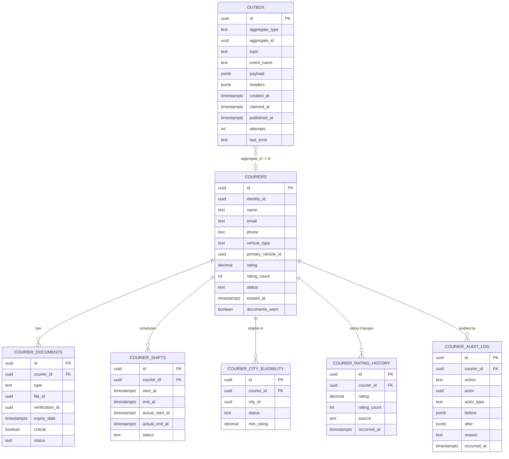

# courier-service — Entity-Relationship Diagram

## 1. Database

- **Engine**: PostgreSQL 18.
- **Schema**: `courier`.
- **Migrations**: `services/courier-service/migrations/`
  (versioned, forward-only, Flyway).

## 2. Cross-Service References

| Column | Type | Refers to | Source of truth |
|--------|------|-----------|------------------|
| `identity_id` (in `couriers`) | UUID | `Identity` in `identity-service` | `identity-service` |
| `primary_vehicle_id` | UUID | `Vehicle` in ``driver-service` (vehicles)` | ``driver-service` (vehicles)` |
| `kyc_verification_id` | UUID | KYC provider's verification | KYC provider |
| `background_check_verification_id` | UUID | Background-check provider's verification | Background-check provider |
| `document_file_id` (in `courier_documents`) | UUID | `File` in `file-service` | `file-service` |

All stored as UUID columns WITHOUT database FKs.

## 3. Entities

### `couriers`

The platform's courier aggregate. One row per courier.

#### Columns

| Column | Type | Constraints | Notes |
|--------|------|-------------|-------|
| `id` | UUID | PK | UUIDv7 |
| `identity_id` | UUID | NOT NULL, UNIQUE | cross-service ref |
| `name` | TEXT | NULL (PII, column-level encrypted) | cached |
| `email` | TEXT | NULL (PII, column-level encrypted) | cached |
| `phone` | TEXT | NULL (PII, column-level encrypted) | cached |
| `vehicle_type` | TEXT | NULL | `bicycle` / `motorcycle` / `car` / `scooter` / `walking` |
| `primary_vehicle_id` | UUID | NULL | cross-service ref |
| `kyc_verification_id` | UUID | NULL | provider's id |
| `kyc_verified_at` | TIMESTAMPTZ | NULL | when KYC was completed |
| `background_check_verification_id` | UUID | NULL | provider's id |
| `background_check_verified_at` | TIMESTAMPTZ | NULL | when background check was completed |
| `rating` | DECIMAL(3,2) | NOT NULL DEFAULT 0.0 | read-model |
| `rating_count` | INT | NOT NULL DEFAULT 0 | read-model |
| `rating_updated_at` | TIMESTAMPTZ | NULL | when rating was last updated |
| `status` | TEXT | NOT NULL DEFAULT 'pending_review' | `pending_review` / `approved` / `rejected` / `suspended` / `inactive` / `erased` |
| `rejected_reason` | TEXT | NULL | reason for rejection |
| `suspended_reason` | TEXT | NULL | reason for suspension |
| `suspended_at` | TIMESTAMPTZ | NULL | when suspended |
| `suspended_by` | UUID | NULL | actor's identity_id |
| `disabled_at` | TIMESTAMPTZ | NULL | when disabled |
| `erased_at` | TIMESTAMPTZ | NULL | when GDPR-erased |
| `documents_warn` | BOOLEAN | NOT NULL DEFAULT false | true if any document in grace period |
| `last_online_at` | TIMESTAMPTZ | NULL | for `inactive` detection |
| `row_version` | BIGINT | NOT NULL DEFAULT 1 | optimistic-lock |
| `created_at` | TIMESTAMPTZ | NOT NULL DEFAULT now() | audit |
| `updated_at` | TIMESTAMPTZ | NOT NULL DEFAULT now() | audit |
| `created_by` | UUID | NOT NULL | identity |
| `updated_by` | UUID | NOT NULL | identity |
| `deleted_at` | TIMESTAMPTZ | NULL | soft delete |

#### Indexes

- PK on `id`.
- UNIQUE on `identity_id` (partial, `WHERE deleted_at IS NULL`).
- Index on `status` (partial, `WHERE status IN ('pending_review', 'approved', 'suspended')`).
- Index on `vehicle_type` (partial, `WHERE status = 'approved'`).
- Index on `primary_vehicle_id` (partial, `WHERE primary_vehicle_id IS NOT NULL`).
- Index on `documents_warn` (partial, `WHERE documents_warn = true`).

#### Constraints

- CHECK: `status IN ('pending_review', 'approved', 'rejected', 'suspended', 'inactive', 'erased')`.
- CHECK: `vehicle_type IS NULL OR vehicle_type IN ('bicycle', 'motorcycle', 'car', 'scooter', 'walking')`.
- CHECK: `rating >= 0 AND rating <= 5`.

### `courier_documents`

The courier's KYC documents. Multiple rows per courier.

#### Columns

| Column | Type | Constraints | Notes |
|--------|------|-------------|-------|
| `id` | UUID | PK | UUIDv7 |
| `courier_id` | UUID | NOT NULL | FK to `couriers.id` |
| `type` | TEXT | NOT NULL | `id` / `vehicle_doc` / `selfie` / `bag_photo` / `background_check` / `medical` / `permit` |
| `file_id` | UUID | NOT NULL | cross-service ref to `file-service` |
| `verification_id` | UUID | NULL | provider's id |
| `verified_at` | TIMESTAMPTZ | NULL | when the provider verified |
| `expiry_date` | TIMESTAMPTZ | NULL | nullable for non-expiring docs (selfie, bag_photo) |
| `critical` | BOOLEAN | NOT NULL DEFAULT true | whether auto-suspend applies on expiry |
| `status` | TEXT | NOT NULL DEFAULT 'pending' | `pending` / `verified` / `rejected` / `expired` |
| `rejected_reason` | TEXT | NULL | provider's reason |
| `row_version` | BIGINT | NOT NULL DEFAULT 1 | optimistic-lock |
| `created_at` | TIMESTAMPTZ | NOT NULL DEFAULT now() | audit |
| `updated_at` | TIMESTAMPTZ | NOT NULL DEFAULT now() | audit |
| `created_by` | UUID | NOT NULL | identity |
| `updated_by` | UUID | NOT NULL | identity |
| `deleted_at` | TIMESTAMPTZ | NULL | soft delete |

#### Indexes

- PK on `id`.
- Index on `courier_id` (partial, `WHERE deleted_at IS NULL`).
- Index on `expiry_date` (partial, `WHERE deleted_at IS NULL AND expiry_date IS NOT NULL`) for the nightly expiry job.
- Index on `status` (partial, `WHERE status = 'verified' AND deleted_at IS NULL`).

#### Constraints

- CHECK: `type IN ('id', 'vehicle_doc', 'selfie', 'bag_photo', 'background_check', 'medical', 'permit')`.
- CHECK: `status IN ('pending', 'verified', 'rejected', 'expired')`.

### `courier_shifts`

The courier's shift schedule. Multiple rows per courier.

#### Columns

| Column | Type | Constraints | Notes |
|--------|------|-------------|-------|
| `id` | UUID | PK | UUIDv7 |
| `courier_id` | UUID | NOT NULL | FK to `couriers.id` |
| `start_at` | TIMESTAMPTZ | NOT NULL | planned shift start |
| `end_at` | TIMESTAMPTZ | NOT NULL | planned shift end |
| `actual_start_at` | TIMESTAMPTZ | NULL | when the courier actually went online |
| `actual_end_at` | TIMESTAMPTZ | NULL | when the courier actually went offline |
| `status` | TEXT | NOT NULL DEFAULT 'scheduled' | `scheduled` / `active` / `completed` / `cancelled` |
| `cancelled_reason` | TEXT | NULL | reason for cancellation |
| `row_version` | BIGINT | NOT NULL DEFAULT 1 | optimistic-lock |
| `created_at` | TIMESTAMPTZ | NOT NULL DEFAULT now() | audit |
| `updated_at` | TIMESTAMPTZ | NOT NULL DEFAULT now() | audit |
| `created_by` | UUID | NOT NULL | identity |
| `updated_by` | UUID | NOT NULL | identity |
| `deleted_at` | TIMESTAMPTZ | NULL | soft delete |

#### Indexes

- PK on `id`.
- Index on `courier_id` (partial, `WHERE deleted_at IS NULL`).
- Index on `start_at` (for the upcoming-shift query).
- Index on `status` (partial, `WHERE status = 'active'`).

#### Constraints

- CHECK: `status IN ('scheduled', 'active', 'completed', 'cancelled')`.
- CHECK: `end_at > start_at`.
- CHECK: `EXTRACT(EPOCH FROM (end_at - start_at)) / 60 >= 60` (min 60 min, configurable).
- CHECK: `EXTRACT(EPOCH FROM (end_at - start_at)) / 3600 <= 12` (max 12 hours, configurable).
- **EXCLUDE constraint** to prevent overlapping shifts:
  `EXCLUDE USING GIST (courier_id WITH =, tstzrange(start_at, end_at, '[)') WITH &&) WHERE (deleted_at IS NULL AND status IN ('scheduled', 'active'))`.

### `courier_city_eligibility`

The courier's eligibility per city. Many-to-many.

#### Columns

| Column | Type | Constraints | Notes |
|--------|------|-------------|-------|
| `id` | UUID | PK | UUIDv7 |
| `courier_id` | UUID | NOT NULL | FK to `couriers.id` |
| `city_id` | UUID | NOT NULL | cross-service ref |
| `status` | TEXT | NOT NULL DEFAULT 'eligible' | `eligible` / `ineligible` / `pending_review` |
| `min_rating` | DECIMAL(3,2) | NULL | per-city override |
| `granted_at` | TIMESTAMPTZ | NOT NULL DEFAULT now() | when granted |
| `granted_by` | UUID | NULL | actor's identity_id |
| `revoked_at` | TIMESTAMPTZ | NULL | when revoked |
| `revoked_by` | UUID | NULL | actor's identity_id |
| `revoked_reason` | TEXT | NULL | reason |
| `row_version` | BIGINT | NOT NULL DEFAULT 1 | optimistic-lock |
| `created_at` | TIMESTAMPTZ | NOT NULL DEFAULT now() | audit |
| `updated_at` | TIMESTAMPTZ | NOT NULL DEFAULT now() | audit |

#### Indexes

- PK on `id`.
- UNIQUE on `(courier_id, city_id)`.
- Index on `city_id` (for the dispatch eligibility check).

#### Constraints

- CHECK: `status IN ('eligible', 'ineligible', 'pending_review')`.

### `courier_rating_history`

Append-only history of rating updates. Range-partitioned
by month.

#### Columns

| Column | Type | Constraints | Notes |
|--------|------|-------------|-------|
| `id` | UUID | NOT NULL | UUIDv7 |
| `courier_id` | UUID | NOT NULL | FK to `couriers.id` |
| `rating` | DECIMAL(3,2) | NOT NULL | new rating |
| `rating_count` | INT | NOT NULL | new count |
| `delta` | DECIMAL(3,2) | NULL | change |
| `source` | TEXT | NOT NULL | `review.aggregated.v1` |
| `occurred_at` | TIMESTAMPTZ | NOT NULL DEFAULT now() | partition key |

#### Partitioning

- Range partition by `occurred_at` (monthly).
- Pre-create next 30 days.
- Drop partitions older than 1 year (after archive).

### `courier_audit_log`

Append-only audit of every state change. Immutable.

#### Columns

| Column | Type | Constraints | Notes |
|--------|------|-------------|-------|
| `id` | UUID | PK | UUIDv7 |
| `courier_id` | UUID | NOT NULL | FK to `couriers.id` |
| `action` | TEXT | NOT NULL | `create` / `update` / `approve` / `reject` / `suspend` / `reinstate` / `disable` / `erase` / `document_upload` / `document_verified` / `document_expired` / `vehicle_type_change` / `shift_scheduled` / `shift_started` / `shift_ended` / `shift_cancelled` / `eligibility_change` / `rating_update` |
| `actor` | UUID | NULL | actor's identity_id |
| `actor_type` | TEXT | NOT NULL | `user` / `admin` / `service` / `system` |
| `before` | JSONB | NULL | snapshot before |
| `after` | JSONB | NULL | snapshot after |
| `reason` | TEXT | NULL | reason code |
| `correlation_id` | UUID | NULL | request correlation id |
| `occurred_at` | TIMESTAMPTZ | NOT NULL DEFAULT now() | when the action happened |

#### Constraints

- No `UPDATE` or `DELETE`.
- Retention 7 years.

### `outbox`

Outbox table for the outbox pattern. Same shape as
`identity-service.outbox`.

## 4. Mermaid ER Diagram



## 5. DDL Sketch

```sql
CREATE SCHEMA IF NOT EXISTS courier;

CREATE TABLE courier.couriers (
    id UUID PRIMARY KEY,
    identity_id UUID NOT NULL,
    name TEXT,
    email TEXT,
    phone TEXT,
    vehicle_type TEXT,
    primary_vehicle_id UUID,
    kyc_verification_id UUID,
    kyc_verified_at TIMESTAMPTZ,
    background_check_verification_id UUID,
    background_check_verified_at TIMESTAMPTZ,
    rating DECIMAL(3,2) NOT NULL DEFAULT 0.0,
    rating_count INT NOT NULL DEFAULT 0,
    rating_updated_at TIMESTAMPTZ,
    status TEXT NOT NULL DEFAULT 'pending_review',
    rejected_reason TEXT,
    suspended_reason TEXT,
    suspended_at TIMESTAMPTZ,
    suspended_by UUID,
    disabled_at TIMESTAMPTZ,
    erased_at TIMESTAMPTZ,
    documents_warn BOOLEAN NOT NULL DEFAULT false,
    last_online_at TIMESTAMPTZ,
    row_version BIGINT NOT NULL DEFAULT 1,
    created_at TIMESTAMPTZ NOT NULL DEFAULT now(),
    updated_at TIMESTAMPTZ NOT NULL DEFAULT now(),
    created_by UUID NOT NULL,
    updated_by UUID NOT NULL,
    deleted_at TIMESTAMPTZ,
    CONSTRAINT couriers_status_check
        CHECK (status IN ('pending_review','approved','rejected','suspended','inactive','erased')),
    CONSTRAINT couriers_vehicle_type_check
        CHECK (vehicle_type IS NULL OR vehicle_type IN ('bicycle','motorcycle','car','scooter','walking')),
    CONSTRAINT couriers_rating_check
        CHECK (rating >= 0 AND rating <= 5)
);

CREATE UNIQUE INDEX couriers_identity_id_uniq
    ON courier.couriers (identity_id)
    WHERE deleted_at IS NULL;

CREATE INDEX couriers_status_idx
    ON courier.couriers (status)
    WHERE status IN ('pending_review','approved','suspended');

CREATE INDEX couriers_vehicle_type_idx
    ON courier.couriers (vehicle_type)
    WHERE status = 'approved';

CREATE INDEX couriers_primary_vehicle_id_idx
    ON courier.couriers (primary_vehicle_id)
    WHERE primary_vehicle_id IS NOT NULL;

CREATE INDEX couriers_documents_warn_idx
    ON courier.couriers (documents_warn)
    WHERE documents_warn = true;

CREATE TABLE courier.courier_documents (
    id UUID PRIMARY KEY,
    courier_id UUID NOT NULL REFERENCES courier.couriers(id),
    type TEXT NOT NULL,
    file_id UUID NOT NULL,
    verification_id UUID,
    verified_at TIMESTAMPTZ,
    expiry_date TIMESTAMPTZ,
    critical BOOLEAN NOT NULL DEFAULT true,
    status TEXT NOT NULL DEFAULT 'pending',
    rejected_reason TEXT,
    row_version BIGINT NOT NULL DEFAULT 1,
    created_at TIMESTAMPTZ NOT NULL DEFAULT now(),
    updated_at TIMESTAMPTZ NOT NULL DEFAULT now(),
    created_by UUID NOT NULL,
    updated_by UUID NOT NULL,
    deleted_at TIMESTAMPTZ,
    CONSTRAINT courier_documents_type_check
        CHECK (type IN ('id','vehicle_doc','selfie','bag_photo','background_check','medical','permit')),
    CONSTRAINT courier_documents_status_check
        CHECK (status IN ('pending','verified','rejected','expired'))
);

CREATE INDEX courier_documents_courier_id_idx
    ON courier.courier_documents (courier_id)
    WHERE deleted_at IS NULL;

CREATE INDEX courier_documents_expiry_date_idx
    ON courier.courier_documents (expiry_date)
    WHERE deleted_at IS NULL AND expiry_date IS NOT NULL;

CREATE TABLE courier.courier_shifts (
    id UUID PRIMARY KEY,
    courier_id UUID NOT NULL REFERENCES courier.couriers(id),
    start_at TIMESTAMPTZ NOT NULL,
    end_at TIMESTAMPTZ NOT NULL,
    actual_start_at TIMESTAMPTZ,
    actual_end_at TIMESTAMPTZ,
    status TEXT NOT NULL DEFAULT 'scheduled',
    cancelled_reason TEXT,
    row_version BIGINT NOT NULL DEFAULT 1,
    created_at TIMESTAMPTZ NOT NULL DEFAULT now(),
    updated_at TIMESTAMPTZ NOT NULL DEFAULT now(),
    created_by UUID NOT NULL,
    updated_by UUID NOT NULL,
    deleted_at TIMESTAMPTZ,
    CONSTRAINT courier_shifts_status_check
        CHECK (status IN ('scheduled','active','completed','cancelled')),
    CONSTRAINT courier_shifts_end_after_start_check
        CHECK (end_at > start_at),
    CONSTRAINT courier_shifts_duration_min_check
        CHECK (EXTRACT(EPOCH FROM (end_at - start_at)) / 60 >= 60),
    CONSTRAINT courier_shifts_duration_max_check
        CHECK (EXTRACT(EPOCH FROM (end_at - start_at)) / 3600 <= 12),
    CONSTRAINT courier_shifts_no_overlap
        EXCLUDE USING GIST (
            courier_id WITH =,
            tstzrange(start_at, end_at, '[)') WITH &&
        ) WHERE (deleted_at IS NULL AND status IN ('scheduled','active'))
);

CREATE INDEX courier_shifts_courier_id_idx
    ON courier.courier_shifts (courier_id)
    WHERE deleted_at IS NULL;

CREATE INDEX courier_shifts_start_at_idx
    ON courier.courier_shifts (start_at);

CREATE INDEX courier_shifts_status_idx
    ON courier.courier_shifts (status)
    WHERE status = 'active';

CREATE TABLE courier.courier_city_eligibility (
    id UUID PRIMARY KEY,
    courier_id UUID NOT NULL REFERENCES courier.couriers(id),
    city_id UUID NOT NULL,
    status TEXT NOT NULL DEFAULT 'eligible',
    min_rating DECIMAL(3,2),
    granted_at TIMESTAMPTZ NOT NULL DEFAULT now(),
    granted_by UUID,
    revoked_at TIMESTAMPTZ,
    revoked_by UUID,
    revoked_reason TEXT,
    row_version BIGINT NOT NULL DEFAULT 1,
    created_at TIMESTAMPTZ NOT NULL DEFAULT now(),
    updated_at TIMESTAMPTZ NOT NULL DEFAULT now(),
    CONSTRAINT courier_city_eligibility_status_check
        CHECK (status IN ('eligible','ineligible','pending_review'))
);

CREATE UNIQUE INDEX courier_city_eligibility_uniq
    ON courier.courier_city_eligibility (courier_id, city_id);

CREATE INDEX courier_city_eligibility_city_id_idx
    ON courier.courier_city_eligibility (city_id);

CREATE TABLE courier.courier_rating_history (
    id UUID NOT NULL,
    courier_id UUID NOT NULL REFERENCES courier.couriers(id),
    rating DECIMAL(3,2) NOT NULL,
    rating_count INT NOT NULL,
    delta DECIMAL(3,2),
    source TEXT NOT NULL,
    occurred_at TIMESTAMPTZ NOT NULL DEFAULT now(),
    PRIMARY KEY (id, occurred_at)
) PARTITION BY RANGE (occurred_at);

-- Idempotent pre-creation; safe to rerun as part of the maintenance job.
CREATE TABLE IF NOT EXISTS courier.courier_rating_history_2026_07
    PARTITION OF courier.courier_rating_history
    FOR VALUES FROM ('2026-07-01 00:00:00+00') TO ('2026-08-01 00:00:00+00');

CREATE TABLE courier.courier_audit_log (
    id UUID PRIMARY KEY,
    courier_id UUID NOT NULL REFERENCES courier.couriers(id),
    action TEXT NOT NULL,
    actor UUID,
    actor_type TEXT NOT NULL,
    before JSONB,
    after JSONB,
    reason TEXT,
    correlation_id UUID,
    occurred_at TIMESTAMPTZ NOT NULL DEFAULT now()
);

CREATE TRIGGER courier_audit_log_no_update
    BEFORE UPDATE OR DELETE ON courier.courier_audit_log
    FOR EACH STATEMENT EXECUTE FUNCTION raise_exception();

CREATE TABLE courier.outbox (
    id UUID PRIMARY KEY,
    aggregate_type TEXT NOT NULL,
    aggregate_id UUID NOT NULL,
    topic TEXT NOT NULL,
    event_name TEXT NOT NULL,
    payload JSONB NOT NULL,
    headers JSONB NOT NULL DEFAULT '{}'::jsonb,
    created_at TIMESTAMPTZ NOT NULL DEFAULT now(),
    claimed_at TIMESTAMPTZ,
    published_at TIMESTAMPTZ,
    attempts INT NOT NULL DEFAULT 0,
    last_error TEXT
);

CREATE INDEX outbox_unpublished_idx
    ON courier.outbox (created_at)
    WHERE published_at IS NULL;

CREATE INDEX outbox_aggregate_id_idx
    ON courier.outbox (aggregate_id);
```

## 6. Audit Columns

Every mutable table has `created_at`, `updated_at`,
`created_by`, `updated_by`. The `couriers`,
`courier_documents`, `courier_shifts`, and
`courier_city_eligibility` tables also have
`row_version` for optimistic locking. The
`courier_audit_log` is the source of truth for audit.

## 7. Soft Delete

- The `couriers` table uses soft delete (`deleted_at`).
- The `courier_documents` table uses soft delete;
  re-uploading a document of the same type is
  idempotent on the type.
- The `courier_shifts` table uses soft delete;
  cancelled shifts are soft-deleted rather than
  hard-deleted to preserve the schedule history.

## 8. JSONB Usage

- `courier_audit_log.before` / `after` — snapshots.
- `outbox.payload` / `outbox.headers` — event
  envelope.

## 9. Partitioning

- `courier_rating_history` is range-partitioned by
  `occurred_at` (monthly).
- Pre-create the next 30 days of partitions.
- Drop partitions older than 1 year (after archive).

## 10. Data Retention

| Table | Retention | Purged by |
|-------|-----------|-----------|
| `couriers` | until erasure + 7 years (tombstone) | background job |
| `courier_documents` | until courier erased + 7 years | background job |
| `courier_shifts` | 1 year hot, then archived; 7 years total | background job |
| `courier_city_eligibility` | until courier erased | background job |
| `courier_rating_history` | 1 year hot, then archived; 7 years total | partition drop after archive |
| `courier_audit_log` | 7 years (audit) | background job |
| `outbox` | 24 h after `published_at` | background job |

## 11. Migration Considerations

- Adding a new document type: add the value to the
  `courier_documents_type_check` constraint; add
  it to `courier.kyc.required_documents` in
  configuration.
- Adding a new vehicle type: add the value to the
  `couriers_vehicle_type_check` constraint; add
  it to `courier.vehicle_types` in configuration.
- Shift duration bounds: the
  `courier_shifts_duration_min_check` and
  `courier_shifts_duration_max_check` constraints
  use hard-coded 60 min and 12 h; if a future
  market needs different bounds, the constraints
  can be made configurable via a function that
  reads from `configuration-service`, but the
  default is preserved for now.
- Cross-service references (`identity_id`,
  `primary_vehicle_id`) are added as nullable
  columns; the back-channel consumer populates
  them.

---

## Appendix A — Predecessor tables absorbed (courier-dispatch + courier-tracking)

The tables below were migrated from `courier_dispatch.*` and
`courier_tracking.*` as part of [ADR-0016](../../architecture/adrs/0016-service-domain-consolidation.md).
The canonical source is [`../../MIGRATION_HUB.md`](../../MIGRATION_HUB.md)
3.1 and 3.2. The old schema names remain readable as views in
the `courier` schema for at least six months from 2026-08-05.

### A.1 Tables absorbed

| Old schema.table | New schema.table | Notes |
|------------------|------------------|-------|
| `courier_dispatch.dispatches` | `courier.dispatches` | state machine `initiated → offered → accepted → committed \| no_courier \| cancelled \| failed` |
| `courier_dispatch.assignments` | `courier.assignments` | append-only; RANGE on `assigned_at`, monthly; 3-year retention |
| `courier_dispatch.courier_pool_entries` | `courier.courier_pool_entries` | Redis-first sorted set; PG projection for durability |
| `courier_dispatch.city_config` | `courier.city_config` | configuration snapshot |
| `courier_dispatch.outbox` | `courier.outbox` | transactional outbox |
| `courier_dispatch.inbox` | `courier.inbox` | consumer dedup |
| `courier_tracking.current_location` | `courier.current_location` | UPSERT by `courier_id` |
| `courier_tracking.locations` | `courier.location_trail` | RANGE on `recorded_at`, monthly |

### A.2 Cross-service references (unchanged)

| Column | Refers to |
|--------|-----------|
| `food_order_id` | `food-order-service` |
| `courier_id` | `courier-service` |
| `branch_id` | ``restaurant-service` (branch)` |
| `restaurant_id` | `restaurant-service` |
| `city_id` | ``geolocation-service` (zones)` |
| `delivery_id` | ``courier-service` (delivery)` |

UUID columns without DB-level FKs.

### A.3 DDL sketch (migrated entities)

```sql
CREATE TABLE courier.dispatches (
    id UUID PRIMARY KEY,
    food_order_id UUID NOT NULL,
    branch_id UUID NOT NULL,
    restaurant_id UUID NOT NULL,
    city_id UUID NOT NULL,
    delivery_id UUID,
    state TEXT NOT NULL,
    attempt_number INT NOT NULL DEFAULT 1,
    reassigned_from UUID REFERENCES courier.dispatches(id),
    batched BOOLEAN NOT NULL DEFAULT false,
    batch_id UUID,
    pickup_lat NUMERIC(9,6) NOT NULL,
    pickup_lng NUMERIC(9,6) NOT NULL,
    pickup_address TEXT,
    offer_window_seconds INT NOT NULL,
    max_offer_attempts INT NOT NULL,
    started_at TIMESTAMPTZ NOT NULL DEFAULT now(),
    ended_at TIMESTAMPTZ,
    correlation_id UUID NOT NULL,
    created_at TIMESTAMPTZ NOT NULL DEFAULT now(),
    updated_at TIMESTAMPTZ NOT NULL DEFAULT now(),
    created_by UUID NOT NULL,
    updated_by UUID NOT NULL,
    CONSTRAINT dispatches_state_chk CHECK (state IN
        ('initiated','offered','accepted','committed','no_courier','cancelled','failed')),
    CONSTRAINT dispatches_attempt_chk CHECK (attempt_number BETWEEN 1 AND 50),
    CONSTRAINT dispatches_window_chk CHECK (offer_window_seconds BETWEEN 1 AND 120),
    CONSTRAINT dispatches_max_chk CHECK (max_offer_attempts BETWEEN 1 AND 20)
);

CREATE UNIQUE INDEX dispatches_order_attempt_uq
    ON courier.dispatches (food_order_id, attempt_number);

CREATE TABLE courier.assignments (
    id UUID NOT NULL,
    dispatch_id UUID NOT NULL REFERENCES courier.dispatches(id),
    courier_id UUID NOT NULL,
    sequence INT NOT NULL,
    outcome TEXT NOT NULL,
    assigned_at TIMESTAMPTZ NOT NULL DEFAULT now(),
    offered_at TIMESTAMPTZ NOT NULL,
    responded_at TIMESTAMPTZ,
    distance_meters INT NOT NULL,
    eta_seconds INT NOT NULL,
    batch_id UUID,
    correlation_id UUID NOT NULL,
    created_at TIMESTAMPTZ NOT NULL DEFAULT now(),
    PRIMARY KEY (id, assigned_at),
    CONSTRAINT assignments_outcome_chk CHECK (outcome IN
        ('offered','accepted','rejected','expired','cancelled','no_courier')),
    CONSTRAINT assignments_response_chk
        CHECK (responded_at IS NULL OR responded_at >= offered_at),
    CONSTRAINT assignments_seq_chk CHECK (sequence BETWEEN 1 AND 50)
) PARTITION BY RANGE (assigned_at);

CREATE UNIQUE INDEX assignments_offer_uq
    ON courier.assignments (dispatch_id, courier_id, sequence);

CREATE TABLE courier.current_location (
    courier_id UUID PRIMARY KEY,
    city_id UUID NOT NULL,
    zone_id UUID,
    last_lat NUMERIC(9,6) NOT NULL,
    last_lng NUMERIC(9,6) NOT NULL,
    last_ping_at TIMESTAMPTZ NOT NULL,
    is_stale BOOLEAN NOT NULL DEFAULT false,
    updated_at TIMESTAMPTZ NOT NULL DEFAULT now()
);

CREATE TABLE courier.location_trail (
    courier_id UUID NOT NULL,
    recorded_at TIMESTAMPTZ NOT NULL,
    lat NUMERIC(9,6) NOT NULL,
    lng NUMERIC(9,6) NOT NULL,
    bearing NUMERIC(5,2),
    speed_mps NUMERIC(5,2),
    accuracy_m NUMERIC(6,2),
    PRIMARY KEY (courier_id, recorded_at)
) PARTITION BY RANGE (recorded_at);
```

### A.4 Partitioning (predecessor)

| Table | Strategy | Cadence | Pre-create | Retention |
|-------|----------|---------|------------|-----------|
| `courier.assignments` | RANGE on `assigned_at` | monthly | 12 months | 3 years (audit) |
| `courier.location_trail` | RANGE on `recorded_at` | monthly | 12 months | 30 d hot; 1 y cold |

### A.5 Compatibility views (≥ 6 months)

```sql
CREATE VIEW courier_dispatch.dispatches AS TABLE courier.dispatches;
CREATE VIEW courier_dispatch.assignments AS TABLE courier.assignments;
CREATE VIEW courier_dispatch.courier_pool_entries AS TABLE courier.courier_pool_entries;
CREATE VIEW courier_tracking.current_location AS TABLE courier.current_location;
CREATE VIEW courier_tracking.locations AS TABLE courier.location_trail;
```

---

## See also

### Sibling docs for this service

- [`README.md`](./README.md) — purpose, bounded context, responsibilities
- [`BRD.md`](./BRD.md) — business requirements
- [`SRS.md`](./SRS.md) — functional + non-functional requirements
- [`ERD.md`](./ERD.md) — data model (entities, relationships)
- [`INTEGRATION.md`](./INTEGRATION.md) — inter-service contracts (APIs, events, sagas)
- [`WORKFLOWS.md`](./WORKFLOWS.md) — operational workflows (happy paths, failure modes)
- [`TECH.md`](./TECH.md) — technology profile (runtime, libraries, data layer, admin endpoints, RBAC)

### Platform-wide

- [`../../shared/README.md`](../../shared/README.md) — `platform-spring-boot-starter` shared library (the single source of cross-cutting code for all Spring Boot services in the platform)
- [`../RECOMMENDATIONS.md`](../RECOMMENDATIONS.md) — platform-wide technology map (language, framework, version baseline, admin/RBAC pattern)
- [`../../README.md`](../../README.md) — services overview (the catalog of all 20 services)
- [`../../../main.md`](../../../main.md) — top-level platform specification (architecture, Keycloak, PostgreSQL 18, messaging, observability baseline)

