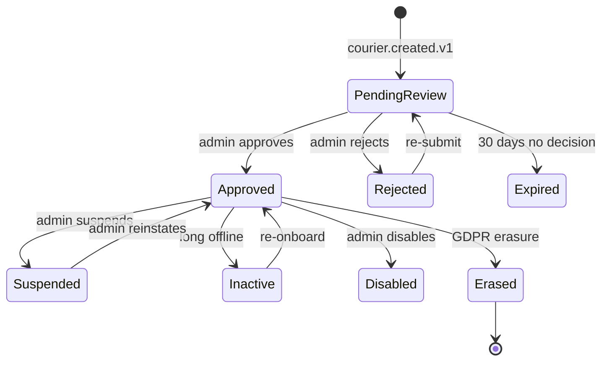

# courier-service — Software Requirements Specification

## 1. Introduction

This document specifies the software behavior, contracts,
and non-functional requirements of the `courier-service`.
The service is the platform's source of truth for the
courier aggregate — KYC, document expiry, vehicle type,
shift schedule, eligibility per city, rating, and the
courier state machine.

## 2. Scope

**In scope:**

- Courier profile (KYC, documents, vehicle type,
  shifts, eligibility, rating).
- Courier state machine (`pending_review`,
  `approved`, `rejected`, `suspended`, `inactive`,
  `erased`).
- Document expiry warnings (30, 7, 1 day) and
  auto-suspend after grace period.
- Vehicle type management.
- Shift schedule.
- City-level eligibility.
- Rating read-model.
- GDPR right-to-erasure.
- Event emission (`courier.*.v1`).

**Out of scope:**

- Authentication (Keycloak via `identity-service`).
- Common user preferences.
- Location.
- Delivery assignments (handled by
  ``courier-service` (dispatch)`).
- Earnings / withdrawals.
- Reviews / ratings aggregation.

## 3. System Context

```mermaid
flowchart LR
    IS[identity-service]
    VS["`driver-service` (vehicles)]
    RRS["`trip-service` / `food-order-service` / `search-service` (review projections)]
    KAFKA[(Kafka)]
    CSV[courier-service]
    DB[(PostgreSQL schema: courier)]
    REDIS[(Redis)]
    KYC[KYC + background-check providers]
    CFG[configuration-service]
    CDP["`courier-service` (dispatch)]
    CTR["`courier-service` (tracking)]
    DLV["`courier-service` (delivery)]
    NOT[notification-service]
    FRS[fraud-risk-service]
    AUD[audit-service]
    ANA["`reporting-service` (data lake)]
    ADM[admin-service]

    IS -->|identity.*.v1| KAFKA
    KAFKA --> CSV
    VS -->|vehicle.*.v1| KAFKA
    KAFKA --> CSV
    RRS -->|review.aggregated.v1| KAFKA
    KAFKA --> CSV
    CFG -->|configuration.updated.v1| KAFKA
    KAFKA --> CSV
    CSV --> DB
    CSV --> REDIS
    CSV --> KYC
    CSV -->|courier.*.v1| KAFKA
    KAFKA --> CDP
    KAFKA --> CTR
    KAFKA --> DLV
    KAFKA --> NOT
    KAFKA --> FRS
    KAFKA --> AUD
    KAFKA --> ANA
    ADM --> CSV
```

## 4. Actors

- **Courier** (human) — manages profile, uploads
  documents, sets vehicle type, schedules shifts.
- **Internal admin / support** (human) — admin
  actions.
- **KYC / background-check providers** (system) —
  verify documents.
- **Downstream services** (system) — read the
  courier for delivery matching.

## 5. Functional Requirements

| ID | Requirement | Priority |
|----|-------------|----------|
| FR--001 | Provide `GET /v1/couriers/{courier_id}` returning the courier. | MUST |
| FR--002 | Provide `POST /v1/couriers` to create a courier (idempotent on `identity_id`). | MUST |
| FR--003 | Provide `PATCH /v1/couriers/{courier_id}` to update profile fields. | MUST |
| FR--004 | Provide `GET /v1/couriers/{courier_id}/documents`. | MUST |
| FR--005 | Provide `POST /v1/couriers/{courier_id}/documents` to upload. | MUST |
| FR--006 | Provide `DELETE /v1/couriers/{courier_id}/documents/{document_id}`. | MUST |
| FR--007 | Provide `GET /v1/couriers/{courier_id}/vehicle-type`. | MUST |
| FR--008 | Provide `PUT /v1/couriers/{courier_id}/vehicle-type`. | MUST |
| FR--009 | Provide `GET /v1/couriers/{courier_id}/eligibility`. | MUST |
| FR--010 | Provide `POST /v1/couriers/{courier_id}/eligibility/cities/{city_id}`. | MUST |
| FR--011 | Provide `GET /v1/couriers/{courier_id}/rating`. | MUST |
| FR--012 | Provide `GET /v1/couriers/{courier_id}/shifts`. | MUST |
| FR--013 | Provide `POST /v1/couriers/{courier_id}/shifts` to schedule. | MUST |
| FR--014 | Provide `DELETE /v1/couriers/{courier_id}/shifts/{shift_id}` to cancel. | MUST |
| FR--015 | Provide `POST /v1/couriers/{courier_id}/approve` (admin). | MUST |
| FR--016 | Provide `POST /v1/couriers/{courier_id}/reject` (admin). | MUST |
| FR--017 | Provide `POST /v1/couriers/{courier_id}/suspend` (admin). | MUST |
| FR--018 | Provide `POST /v1/couriers/{courier_id}/reinstate` (admin). | MUST |
| FR--019 | Provide `POST /v1/couriers/{courier_id}/disable` (admin). | MUST |
| FR--020 | Provide `POST /v1/couriers/{courier_id}/erase` (GDPR). | MUST |
| FR--021 | Consume `identity.user.created.v1` to back-fill. | MUST |
| FR--022 | Consume `identity.user.updated.v1` to refresh cached claims. | MUST |
| FR--023 | Consume `identity.user.suspended.v1`. | MUST |
| FR--024 | Consume `identity.user.disabled.v1`. | MUST |
| FR--025 | Consume `identity.user.reinstated.v1`. | MUST |
| FR--026 | Consume `identity.user.erased.v1`. | MUST |
| FR--027 | Consume `vehicle.registered.v1` to link primary vehicle. | MUST |
| FR--028 | Consume `vehicle.insurance.expired.v1` to auto-suspend. | MUST |
| FR--029 | Consume `review.aggregated.v1` to update rating. | MUST |
| FR--030 | Nightly job emits `courier.document.expiring.v1` 30, 7, 1 day before expiry. | MUST |
| FR--031 | Nightly job auto-suspends couriers with expired critical documents after grace period. | MUST |
| FR--032 | Emit `courier.created.v1`. | MUST |
| FR--033 | Emit `courier.approved.v1`. | MUST |
| FR--034 | Emit `courier.rejected.v1`. | MUST |
| FR--035 | Emit `courier.suspended.v1`. | MUST |
| FR--036 | Emit `courier.reinstated.v1`. | MUST |
| FR--037 | Emit `courier.disabled.v1`. | MUST |
| FR--038 | Emit `courier.erased.v1`. | MUST |
| FR--039 | Emit `courier.shift.scheduled.v1`. | MUST |
| FR--040 | Emit `courier.shift.started.v1` on online. | MUST |
| FR--041 | Emit `courier.shift.ended.v1` on offline. | MUST |
| FR--042 | Emit `courier.document.expiring.v1`. | MUST |
| FR--043 | Emit `courier.document.expired.v1`. | MUST |
| FR--044 | All writes use the outbox pattern. | MUST |
| FR--045 | All non-idempotent POSTs require `Idempotency-Key`. | MUST |

## 6. Non-Functional Requirements

| ID | Category | Requirement | Target |
|----|----------|-------------|--------|
| NFR--001 | availability | monthly uptime | 99.95% |
| NFR--002 | performance | P99 read latency | ≤ 30 ms |
| NFR--003 | performance | P99 write latency | ≤ 500 ms |
| NFR--004 | scalability | concurrent reads per replica | ≥ 5,000 |
| NFR--005 | scalability | horizontal scale | 3 → 30 replicas per region |
| NFR--006 | maintainability | MTTR | ≤ 15 min median |
| NFR--007 | reliability | outbox publish lag P99 | ≤ 5 s |
| NFR--008 | reliability | event loss | 0 |
| NFR--009 | compliance | GDPR erasure SLA | 100% within 24 h expedited |
| NFR--010 | safety | auto-suspend within grace period | 100% |

## 7. API Requirements

All endpoints follow `architecture/API_STANDARDS.md`.
Full contract in `INTEGRATION.md`.

## 8. Data Requirements

| ID | Requirement | Notes |
|----|-------------|-------|
| DATA--001 | The service MUST own the `courier` schema. | One writer. |
| DATA--002 | Primary keys MUST be UUIDv7. | Time-ordered. |
| DATA--003 | Cross-service IDs (`identity_id`, `vehicle_id`) MUST be UUID columns WITHOUT database FKs. | Consistency strategy. |
| DATA--004 | PII columns MUST be column-level encrypted. | Envelope encryption. |
| DATA--005 | Audit columns MUST be present on every mutable table. | Standard. |
| DATA--006 | Soft delete (`deleted_at`) MUST be used for couriers. | GDPR. |
| DATA--007 | The `outbox` table MUST be present and used. | At-least-once. |
| DATA--008 | `courier_rating_history` MUST be range-partitioned by month. | Volume. |
| DATA--009 | Shifts MUST NOT overlap (enforced at the application layer). | Database constraint via `EXCLUDE` with `tstzrange`. |

(Full schema in `ERD.md`.)

## 9. Validation Rules

- `status` MUST be in `('pending_review', 'approved',
  'rejected', 'suspended', 'inactive', 'erased')`.
- A `document.type` MUST be in
  `courier.kyc.required_documents`.
- A `vehicle_type` MUST be in
  `courier.vehicle_types`.
- A shift's `start_at` MUST be in the future (for
  new shifts).
- A shift's `end_at` MUST be after `start_at`.
- A shift's duration MUST be in
  `[min_duration_minutes, max_duration_hours * 60]`.
- A courier cannot have overlapping shifts
  (enforced by `EXCLUDE` constraint).
- A `rating` MUST be in `[0.0, 5.0]`.
- A courier cannot be `approved` unless all
  required documents are uploaded and verified.
- A courier cannot be `approved` unless they have
  a primary vehicle.

## 10. State Transitions



## 11. Authorization Requirements

- All endpoints require a JWT bearer token.
- Self-service endpoints require `X-User-Id ==
  courier_id`; otherwise 403.
- Cross-courier reads (e.g. dispatch reading
  eligibility) require `courier.read.any` scope.
- Admin endpoints require `courier.admin` realm
  role on `platform-internal`.

## 12. Configuration Requirements

Listed in `README.md` 13.

## 13. Error Handling

| Condition | Response |
|-----------|----------|
| Unknown `courier_id` | 404 `NOT_FOUND` |
| Concurrent update | 409 `CONFLICT` |
| Approve with missing documents | 422 `KYC_DOCUMENTS_REQUIRED` |
| KYC provider failure | 502 `DEPENDENCY_UPSTREAM_FAILURE` |
| `Idempotency-Key` reused with different body | 422 `IDEMPOTENCY_KEY_REUSED` |
| Shift overlap | 422 `SHIFT_OVERLAP` |
| Shift duration out of range | 422 `SHIFT_DURATION_OUT_OF_RANGE` |
| Already-approved courier re-approved | 409 `CONFLICT` |

## 14. Concurrency Requirements

- The `couriers` row has an optimistic-lock version
  (`row_version`).
- The outbox poller is single-writer per replica via
  a Postgres advisory lock.
- Shift overlap is prevented by a `EXCLUDE`
  constraint using `tstzrange`.

## 15. Idempotency Requirements

- All non-idempotent POSTs require `Idempotency-Key`.

## 16. Performance

- **Dominant path**: courier read by `courier_id`
  (PK index hit) → return row. P99 ≤ 30 ms.
- Hot DB query: `SELECT * FROM courier.couriers
  WHERE id = $1`.
- Cache: Redis claim hot-cache TTL 600 s.

## 17. Scalability

- **Horizontal**: stateless beyond PostgreSQL +
  Redis + Kafka.
- **Vertical**: 1 vCPU / 1 GiB default.
- **HPA**: CPU 60% target; custom metric
  `courier_lookups_per_second` (target 5k/replica).

## 18. Availability

- **SLO**: 99.95% per 30d.
- **Error budget**: ~22 min / 30d.
- **Maintenance window**: none planned; rolling
  deploys.

## 19. Security

| ID | Requirement | Notes |
|----|-------------|-------|
| SEC--001 | All endpoints require a JWT bearer token. | Self or service. |
| SEC--002 | Self-service endpoints enforce `X-User-Id == courier_id`. | Gateway-injected header. |
| SEC--003 | PII columns are column-level encrypted. | Envelope encryption. |
| SEC--004 | Document files stored in `file-service`; this service holds only the `file_id`. | Defense in depth. |
| SEC--005 | No PII is logged in production. | Defense in depth. |
| SEC--006 | GDPR erasure preserves `courier_id`. | Soft delete + tombstone. |
| SEC--007 | mTLS in cluster. | Network-layer identity. |

## 20. Privacy

- Stored PII: `name`, `email`, `phone` (cached
  claims).
- Encryption: column-level, per-tenant DEK.
- Retention: until erasure + 7 years for the
  `courier_id` tombstone; financial records retained
  per legal hold with PII redacted.
- Erasure: `POST /v1/couriers/{id}/erase` anonymizes
  PII; `courier_id` preserved.
- Logs do not contain PII in production.

## 21. Auditability

- Every state change writes a row to
  `courier.courier_audit_log` (append-only) AND
  emits the corresponding `courier.*.v1` event.
- Retention 7 years.

## 22. Observability

- **Logs**: JSON to stdout; fields listed in
  `README.md` 15.
- **Metrics**: RED per endpoint + business metrics
  listed in `README.md` 15.
- **Traces**: OpenTelemetry. Sample 100% on errors,
  10% on success.
- **Alerts**: SLO burn-rate; document expiry
  warning lag; auto-suspend lag; rating update
  lag; shift overlap rate.

## 23. Maintainability

- **Code style**: Java 21 (Spotless + Checkstyle).
- **Test coverage**: ≥ 85% overall, 100% on
  KYC, document expiry, eligibility, shift
  validation, erasure paths.

## 24. Disaster Recovery

- **RPO**: ≤ 5 min (WAL streaming + 7-day PITR).
- **RTO**: ≤ 30 min (warm standby).

## 25. Acceptance Criteria

- An `identity.user.created.v1` event results in
  a `couriers` row within 5 seconds.
- A document upload results in a
  `courier.documents` row and triggers the KYC
  provider verification.
- An admin approval results in
  `courier.approved.v1` emitted; the courier can
  go online.
- A shift schedule POST results in
  `courier.shift.scheduled.v1` emitted.
- A vehicle type change results in
  `courier.updated.v1` emitted with the new
  `vehicle_type`.
- A document expiring in 30 / 7 / 1 day results
  in `courier.document.expiring.v1` emitted.
- A document expired past the grace period
  results in `courier.document.expired.v1` emitted
  and the courier auto-suspended.
- A `review.aggregated.v1` event results in the
  courier's rating updated within 5 minutes.
- A GDPR erasure request results in PII redaction
  and `courier.erased.v1` emitted.
- A ``courier-service` (dispatch)` request to check
  eligibility returns `true` for an approved,
  non-suspended courier with valid documents in
  the city.
- A shift overlap attempt results in
  `422 SHIFT_OVERLAP`.

---

## Appendix A — Predecessor SRS absorbed (courier-dispatch + courier-tracking)

The functional and non-functional requirements below were migrated
from ``courier-service` (dispatch)/SRS.md` and ``courier-service` (tracking)/SRS.md`
as part of [ADR-0016](../../architecture/adrs/0016-service-domain-consolidation.md).
The canonical source is [`../../MIGRATION_HUB.md`](../../MIGRATION_HUB.md)
3.1 (courier-dispatch) and 3.2 (courier-tracking).

### A.1 Functional requirements (from courier-dispatch)

| ID | Requirement | Priority |
|----|-------------|----------|
| FR-D-001 | On `food.order.ready.v1`, create a dispatch row, query the available-courier pool, and offer to the top-N candidates. | MUST |
| FR-D-002 | On courier `accept`, persist the assignment, mark the courier as `busy`, emit `delivery.courier.assigned.v1`, stop offering. | MUST |
| FR-D-003 | On courier `reject`, immediately offer to the next-best candidate without delay. | MUST |
| FR-D-D-004 | If the offer window expires without a response, mark the offer `expired` and offer to the next candidate. | MUST |
| FR-D-005 | After `max_offer_attempts` with no acceptance, emit `delivery.dispatch.no_courier.v1` and re-offer after `no_courier_backoff_seconds`. | MUST |
| FR-D-006 | On `delivery.courier.cancelled.v1`, enqueue a reassignment for the same `food_order_id`. | MUST |
| FR-D-007 | Support batched offers (multi-order from same restaurant within radius). | SHOULD |
| FR-D-008 | Honour zone surge and restricted zones when scoring couriers. | SHOULD |
| FR-D-009 | Expose `POST /v1/dispatches/{id}/reassign`; emits `delivery.dispatch.reassigned.v1`. | MUST |
| FR-D-010 | Re-evaluate the pool on `courier.availability.online.v1` and `courier.location.updated.v1` (throttled to 1 Hz per courier). | MUST |
| FR-D-011 | Fall back to last-known location with `stale=true` and widen radius by 50% when location stream is unreachable. | MUST |
| FR-D-012 | Persist every offer attempt within 1 s. | MUST |
| FR-D-013 | Reject attempt to offer a delivery to a courier who already holds an active offer or active delivery. | MUST |
| FR-D-014 | Support per-city overrides for `offer_window_seconds`, `max_offer_attempts`, `pool_max_radius_meters`. | MUST |
| FR-D-015 | Emit pool / latency / success metrics every 10 s. | SHOULD |

### A.2 Functional requirements (from courier-tracking)

| ID | Requirement | Priority |
|----|-------------|----------|
| FR-T-001 | Ingest location pings at up to 5 Hz per courier (target 1 Hz). | MUST |
| FR-T-002 | UPSERT current_location by `courier_id`. | MUST |
| FR-T-003 | Persist recent trail (range-partitioned by day). | MUST |
| FR-T-004 | Emit `courier.location.updated.v1` at curated 1 Hz per courier. | MUST |
| FR-T-005 | Serve `GET /v1/couriers/{id}/location` ≤ 30 ms p99. | MUST |
| FR-T-006 | Detect stale (no ping in 60 s) and suppress curated stream unless read. | MUST |

### A.3 Validation rules (predecessor)

- A courier MUST be `online` and in the same city/zone as the order.
- A courier MUST NOT already have an active offer or active delivery.
- The `offer_window_seconds` MUST be > 0 and ≤ 120.
- The `max_offer_attempts` MUST be ≥ 1 and ≤ 20.
- An `accept` MUST arrive within the offer window (server-side check).

### A.4 Error handling (predecessor)

| Error | Response |
|-------|----------|
| Courier already holds an offer | 409 `code: "OFFER_ALREADY_ACTIVE"` |
| Dispatch not found | 404 `code: "DISPATCH_NOT_FOUND"` |
| Offer expired | 410 `code: "OFFER_EXPIRED"` |
| Invalid Idempotency-Key reuse | 422 `code: "IDEMPOTENCY_KEY_REUSED"` |
| Downstream (location stream) down | circuit open → 503 `code: "CIRCUIT_OPEN"` |

### A.5 Concurrency requirements (predecessor)

- Row-level lock on `couriers` row at offer time.
- Dispatch state machine uses optimistic concurrency (`updated_at`).
- Redis pool uses atomic `ZADD`/`ZREM` with Lua script.

### A.6 Idempotency keys (predecessor)

- `dispatch:<dispatch_id>:accept:<courier_id>`
- `dispatch:<dispatch_id>:reject:<courier_id>`
- `dispatch:<dispatch_id>:reassign:<admin_id>:<timestamp>`

### A.7 Non-functional requirements (predecessor)

| ID | Category | Target |
|----|----------|--------|
| NFR-D-001 | performance | P50 time-to-assignment ≤ 45 s |
| NFR-D-002 | performance | P95 time-to-assignment ≤ 90 s |
| NFR-D-003 | performance | P95 pool-search latency ≤ 200 ms |
| NFR-D-004 | performance | P95 accept-pipeline latency ≤ 300 ms |
| NFR-D-005 | availability | 99.95% / 30 d |
| NFR-D-006 | scalability | 50 dispatches/s/region, 200 rps burst |
| NFR-D-007 | scalability | Pool ≤ 50k couriers per city |
| NFR-D-008 | scalability | Up to 1k pending reassignments / replica |
| NFR-D-009 | maintainability | MTTR ≤ 30 min |
| NFR-D-010 | observability | 100% dispatches traceable end-to-end |
| NFR-T-001 | performance | 5 Hz ingestion per courier |
| NFR-T-002 | performance | P95 GET ≤ 30 ms |
| NFR-T-003 | scalability | Monthly partitioning; 12 months pre-created |
| NFR-T-004 | DR | RPO 5 min; RTO 30 min |

### A.8 DR (predecessor)

- RPO: 5 minutes (assignment ledger replicated to standby region).
- RTO: 30 minutes (stateless service; replay outbox + assign from
  Redis replica).

### A.9 Acceptance criteria (predecessor)

- All FR/NFR met and verified by automated tests.
- Security review passed.
- 30-minute load test sustains 50 rps with p95 < 500 ms.
- Chaos test (kill ``courier-service` (tracking)` sub-call) shows the
  service remains available with degraded radius.

---

## See also

### Sibling docs for this service

- [`README.md`](./README.md) — purpose, bounded context, responsibilities
- [`BRD.md`](./BRD.md) — business requirements
- [`SRS.md`](./SRS.md) — functional + non-functional requirements
- [`ERD.md`](./ERD.md) — data model (entities, relationships)
- [`INTEGRATION.md`](./INTEGRATION.md) — inter-service contracts (APIs, events, sagas)
- [`WORKFLOWS.md`](./WORKFLOWS.md) — operational workflows (happy paths, failure modes)
- [`TECH.md`](./TECH.md) — technology profile (runtime, libraries, data layer, admin endpoints, RBAC)

### Platform-wide

- [`../../shared/README.md`](../../shared/README.md) — `platform-spring-boot-starter` shared library (the single source of cross-cutting code for all Spring Boot services in the platform)
- [`../RECOMMENDATIONS.md`](../RECOMMENDATIONS.md) — platform-wide technology map (language, framework, version baseline, admin/RBAC pattern)
- [`../../README.md`](../../README.md) — services overview (the catalog of all 20 services)
- [`../../../main.md`](../../../main.md) — top-level platform specification (architecture, Keycloak, PostgreSQL 18, messaging, observability baseline)

