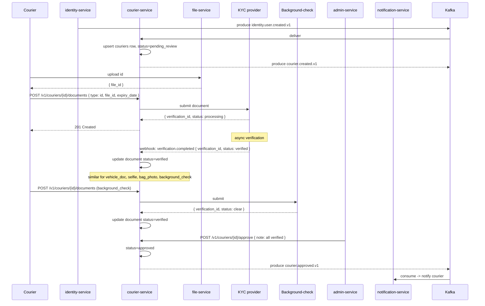
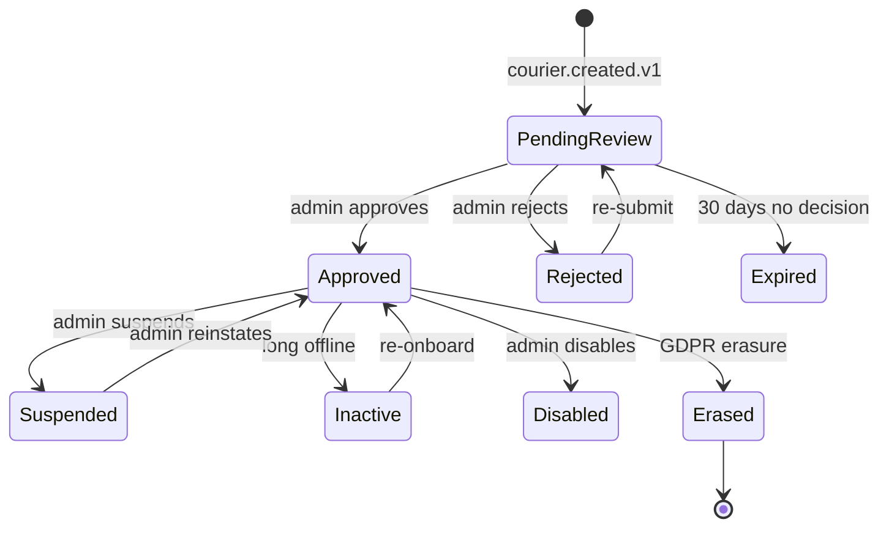
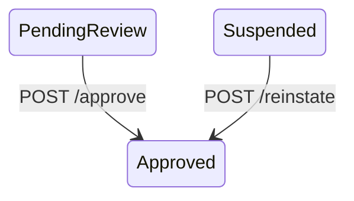
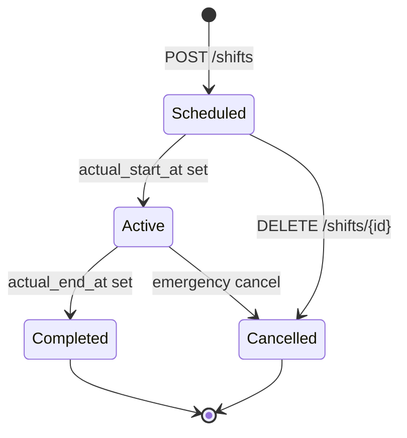
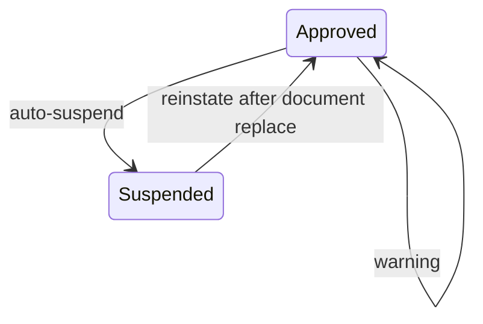
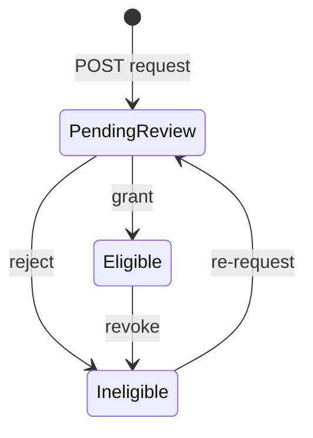

# courier-service — Workflows

## 1. Courier Onboarding (KYC)

### 1.1 Objective

Onboard a new courier: create a `couriers` row in
`pending_review`, accept document uploads, and route
to an admin for review. The courier can be `approved`
or `rejected`.

### 1.2 Initiating Actor

A courier (Keycloak user) registers and starts
onboarding. `identity-service` emits
`identity.user.created.v1`.

### 1.3 Participating Services

- `identity-service` (producer).
- `courier-service` (this service).
- `file-service` (KYC document storage).
- KYC provider (document verification).
- Background-check provider.
- `admin-service` (admin review).
- `notification-service` (courier notifications).
- `audit-service`.

### 1.4 Prerequisites

- `identity.user.created.v1` has been emitted.
- The courier has a Keycloak account.

### 1.5 Happy Path



### 1.6 Alternate Paths

- **Courier rejection**: admin reviews and finds an
  issue; the admin calls
  `POST /v1/couriers/{id}/reject` with a reason.
  `courier.rejected.v1` is emitted.
- **Re-submission**: a rejected courier can
  re-submit; `status` returns to `pending_review`.
- **Pending review expiry**: after 30 days in
  `pending_review`, the courier is auto-`expired`.

### 1.7 Failure Paths

- **KYC provider unreachable**: the service
  degrades to admin-override; a ticket is opened.
- **Document upload fails**: 502
  `DEPENDENCY_UPSTREAM_FAILURE`; the courier
  retries.
- **Background-check fails**: the document is
  marked `rejected`; the courier is told to
  contact support.

### 1.8 Business Rules

- A courier cannot be `approved` until all
  required documents are uploaded AND verified.
- A courier cannot be `approved` without a
  primary vehicle.
- The `pending_review` state has a 30-day TTL.

### 1.9 State Transitions



### 1.10 Events

| Event | Direction | When |
|-------|-----------|------|
| `courier.created.v1` | produced | on creation |
| `courier.approved.v1` | produced | on approval |
| `courier.rejected.v1` | produced | on rejection |
| `identity.user.created.v1` | consumed | to create the row |

### 1.11 APIs Involved

| API | Direction | When |
|-----|-----------|------|
| `POST /v1/couriers` | inbound | on creation |
| `POST /v1/couriers/{id}/documents` | inbound | per document |
| KYC provider | outbound | per document |
| `POST /v1/couriers/{id}/approve` | inbound | on approval |
| `POST /v1/couriers/{id}/reject` | inbound | on rejection |
| Kafka publish | outbound (outbox) | per state change |

### 1.12 Compensation / Rollback

A rejection can be followed by re-submission (status
back to `pending_review`). An approval can be
followed by a suspension (status to `suspended`).

### 1.13 Final State

- The `couriers` row is `approved` (or `rejected`).
- All required documents are `verified`.
- `courier.approved.v1` (or `courier.rejected.v1`) is
  on the topic.

## 2. Courier Approval

### 2.1 Objective

An admin reviews the courier's documents and approves
the courier. The courier can now go online and accept
deliveries.

### 2.2 Initiating Actor

`admin-service` calls
`POST /v1/couriers/{courier_id}/approve` on behalf of
an admin.

### 2.3 Participating Services

- `admin-service` (caller).
- `courier-service` (this service).
- ``courier-service` (dispatch)`,
  ``courier-service` (tracking)`,
  `notification-service`, `audit-service`
  (consumers of `courier.approved.v1`).

### 2.4 Prerequisites

- The `couriers` row exists with
  `status='pending_review'`.
- All required documents are `verified`.
- The courier has a `primary_vehicle_id`.

### 2.5 Happy Path

```mermaid
sequenceDiagram
    participant ADM as admin-service
    participant CSV as courier-service
    participant DB as PostgreSQL (courier)
    participant OB as Outbox
    participant T as Kafka (courier.approved)
    participant CDP as `courier-service` (dispatch)
    participant CTR as `courier-service` (tracking)
    participant NOT as notification-service

    ADM->>CSV: POST /v1/couriers/{id}/approve { note }
    CSV->>DB: BEGIN; UPDATE couriers SET status='approved', row_version=row_version+1; INSERT INTO courier_audit_log; INSERT INTO outbox; COMMIT
    CSV-->>ADM: 200 OK
    OB->>T: produce courier.approved.v1
    T->>CDP: consume -> courier is now in the dispatch pool
    T->>CTR: consume -> courier is now allowed to go online
    T->>NOT: consume -> notify courier
```

### 2.6 Alternate Paths

- **Re-approval after suspension**: a suspended
  courier is re-instated via
  `POST /v1/couriers/{id}/reinstate`; status
  returns to `approved`.

### 2.7 Failure Paths

- **Missing documents**: 422
  `KYC_DOCUMENTS_REQUIRED`.
- **No primary vehicle**: 422
  `PRIMARY_VEHICLE_REQUIRED`.
- **Already approved**: 409 `CONFLICT`.

### 2.8 Business Rules

- All required documents MUST be `verified`.
- A `primary_vehicle_id` MUST be set.
- The state change MUST propagate to
  ``courier-service` (dispatch)` and
  ``courier-service` (tracking)` within 10 s (P99).

### 2.9 State Transitions



### 2.10 Events

| Event | Direction | When |
|-------|-----------|------|
| `courier.approved.v1` | produced | on approval |

### 2.11 APIs Involved

| API | Direction | When |
|-----|-----------|------|
| `POST /v1/couriers/{id}/approve` | inbound | per approval |
| Kafka publish | outbound (outbox) | per approval |

### 2.12 Compensation / Rollback

A suspension reverts the courier's state to
`suspended`. There is no compensation at the service
level.

### 2.13 Final State

- The `couriers.status` is `approved`.
- `courier.approved.v1` is on the topic.
- The courier can go online and accept deliveries.

## 3. Shift Schedule

### 3.1 Objective

A courier schedules a shift for a future date/time
range; the platform uses the shift schedule to plan
capacity and to know when the courier is expected
online.

### 3.2 Initiating Actor

A courier calls
`POST /v1/couriers/{courier_id}/shifts` with a
`start_at` and `end_at`.

### 3.3 Participating Services

- `courier-service` (this service).
- `notification-service` (shift reminder).
- ``courier-service` (dispatch)` (capacity planning).

### 3.4 Prerequisites

- The `couriers` row is `approved`.
- The shift does not overlap with an existing
  active or scheduled shift.
- The shift duration is in
  `[min_duration_minutes, max_duration_hours * 60]`.

### 3.5 Happy Path

```mermaid
sequenceDiagram
    participant C as Courier
    participant CSV as courier-service
    participant DB as PostgreSQL (courier)
    participant OB as Outbox
    participant T as Kafka (courier.shift.scheduled)
    participant NOT as notification-service

    C->>CSV: POST /v1/couriers/{id}/shifts { start_at, end_at }
    CSV->>DB: BEGIN; INSERT INTO courier_shifts (...); INSERT INTO courier_audit_log; INSERT INTO outbox; COMMIT
    Note over DB: EXCLUDE constraint prevents overlap
    CSV-->>C: 201 Created
    OB->>T: produce courier.shift.scheduled.v1
    T->>NOT: consume -> shift reminder
```

### 3.6 Alternate Paths

- **Shift start (courier goes online)**: the
  courier opens the app; the `courier-service` (or
  the courier's app) updates
  `actual_start_at` and emits
  `courier.shift.started.v1`.
- **Shift end (courier goes offline)**: same path,
  with `actual_end_at` and
  `courier.shift.ended.v1`.
- **Shift cancellation**: the courier calls
  `DELETE /v1/couriers/{id}/shifts/{shift_id}`;
  the row is `status='cancelled'`.

### 3.7 Failure Paths

- **Shift overlap**: 422 `SHIFT_OVERLAP` (raised by
  the `EXCLUDE` constraint).
- **Shift too short / too long**: 422
  `SHIFT_DURATION_OUT_OF_RANGE`.
- **Not approved**: 422 `COURIER_NOT_APPROVED`.

### 3.8 Business Rules

- A shift MUST be at least
  `min_duration_minutes` (default 60).
- A shift MUST NOT exceed `max_duration_hours`
  (default 12).
- A courier cannot have overlapping shifts
  (enforced by `EXCLUDE` constraint).
- The shift change MUST propagate to dependent
  services within 10 s (P99).

### 3.9 State Transitions



### 3.10 Events

| Event | Direction | When |
|-------|-----------|------|
| `courier.shift.scheduled.v1` | produced | on schedule |
| `courier.shift.started.v1` | produced | on online |
| `courier.shift.ended.v1` | produced | on offline |

### 3.11 APIs Involved

| API | Direction | When |
|-----|-----------|------|
| `POST /v1/couriers/{id}/shifts` | inbound | per schedule |
| `DELETE /v1/couriers/{id}/shifts/{shift_id}` | inbound | per cancel |
| Kafka publish | outbound (outbox) | per change |

### 3.12 Compensation / Rollback

A cancellation sets `status='cancelled'`; the row is
preserved for the schedule history.

### 3.13 Final State

- The `courier_shifts` row is `scheduled`,
  `active`, `completed`, or `cancelled`.
- The corresponding event is on the topic.

## 4. Vehicle Type Change

### 4.1 Objective

A courier updates their vehicle type (e.g. switched
from bicycle to motorcycle); the dispatch matches
the right courier to the right order.

### 4.2 Initiating Actor

A courier calls
`PUT /v1/couriers/{courier_id}/vehicle-type` with the
new `vehicle_type`.

### 4.3 Participating Services

- `courier-service` (this service).
- ``courier-service` (dispatch)` (consumer; uses
  `vehicle_type` for matching).

### 4.4 Prerequisites

- The `couriers` row is `approved`.
- The new `vehicle_type` is in
  `courier.vehicle_types`.

### 4.5 Happy Path

```mermaid
sequenceDiagram
    participant C as Courier
    participant CSV as courier-service
    participant DB as PostgreSQL (courier)
    participant OB as Outbox
    participant T as Kafka (courier.updated)
    participant CDP as `courier-service` (dispatch)

    C->>CSV: PUT /v1/couriers/{id}/vehicle-type { vehicle_type: "motorcycle" }
    CSV->>DB: BEGIN; UPDATE couriers SET vehicle_type='motorcycle', row_version=row_version+1; INSERT INTO courier_audit_log; INSERT INTO outbox; COMMIT
    CSV-->>C: 200 OK
    OB->>T: produce courier.updated.v1 (changed_fields: [vehicle_type])
    T->>CDP: consume -> update dispatch pool
```

### 3.7 (Continued) Failure Paths

- **Invalid vehicle_type**: 400
  `VALIDATION_FAILED`.
- **Not approved**: 422 `COURIER_NOT_APPROVED`.

### 4.8 Business Rules

- The new `vehicle_type` MUST be in
  `courier.vehicle_types`.
- The change MUST propagate to
  ``courier-service` (dispatch)` within 10 s (P99).

### 4.9 State Transitions

None (vehicle_type is a single value).

### 4.10 Events

| Event | Direction | When |
|-------|-----------|------|
| `courier.updated.v1` | produced | on change |

### 4.11 APIs Involved

| API | Direction | When |
|-----|-----------|------|
| `PUT /v1/couriers/{id}/vehicle-type` | inbound | per change |
| Kafka publish | outbound (outbox) | per change |

### 4.12 Compensation / Rollback

A user can PUT again to revert.

### 4.13 Final State

- The `couriers.vehicle_type` is the new value.
- `courier.updated.v1` is on the topic.
- ``courier-service` (dispatch)` has the new vehicle
  type.

## 5. Document Expiry

### 5.1 Objective

A courier's document (ID, vehicle doc, etc.) is
nearing expiry. The service emits warnings 30, 7, 1
day before; if the document expires and is not
replaced within the grace period, the courier is
auto-suspended.

### 5.2 Initiating Actor

A nightly job in `courier-service` scans
`courier_documents` for upcoming expiries and
past-expiry entries past the grace period.

### 5.3 Participating Services

- `courier-service` (this service; nightly job).
- `notification-service` (warnings).
- ``courier-service` (dispatch)` (auto-suspend).

### 5.4 Prerequisites

- The `courier_documents` rows have `expiry_date`
  populated.

### 5.5 Happy Path (Warning)

```mermaid
sequenceDiagram
    participant JOB as Nightly job
    participant DB as PostgreSQL (courier)
    participant OB as Outbox
    participant T as Kafka (courier.document.expiring)
    participant NOT as notification-service
    participant C as Courier

    JOB->>DB: SELECT * FROM courier_documents WHERE status='verified' AND expiry_date BETWEEN now() AND now() + interval '30 days' AND deleted_at IS NULL
    loop for each document
        alt days_remaining in [30, 7, 1]
            JOB->>DB: BEGIN; INSERT INTO courier_audit_log; INSERT INTO outbox (courier.document.expiring.v1, days_remaining=...); COMMIT
            OB->>T: produce courier.document.expiring.v1
            T->>NOT: consume -> notify courier
            NOT-->>C: SMS/push: "Your ID expires in 7 days"
        end
    end
```

### 5.6 Auto-Suspend

```mermaid
sequenceDiagram
    participant JOB as Nightly job
    participant DB as PostgreSQL (courier)
    participant OB as Outbox
    participant T1 as Kafka (courier.document.expired)
    participant T2 as Kafka (courier.suspended)
    participant CDP as `courier-service` (dispatch)
    participant NOT as notification-service

    JOB->>DB: SELECT * FROM courier_documents WHERE status='verified' AND expiry_date < now() - interval '7 days' AND critical=true AND deleted_at IS NULL
    loop for each document
        JOB->>DB: BEGIN; UPDATE courier_documents SET status='expired'; UPDATE couriers SET status='suspended', suspended_reason='document_expired', suspended_at=now(), suspended_by=system; INSERT INTO courier_audit_log; INSERT INTO outbox (courier.document.expired.v1); INSERT INTO outbox (courier.suspended.v1); COMMIT
        OB->>T1: produce courier.document.expired.v1
        OB->>T2: produce courier.suspended.v1
        T1->>CDP: consume -> take offline
        T2->>CDP: consume -> take offline
        T1->>NOT: consume -> notify courier
    end
```

### 5.7 Alternate Paths

- **Courier replaces document before expiry**: the
  new document is `verified`; the old one is
  soft-deleted; the warnings are no longer
  emitted.
- **Document expired but in grace period**: the
  courier is `approved` with `documents_warn=true`;
  the platform shows a banner.

### 5.8 Business Rules

- Warning windows are 30, 7, 1 day.
- The grace period is `expiry_grace_days` (default
  7).
- Only `critical` documents trigger auto-suspend.
- The auto-suspend MUST happen within the grace
  period.

### 5.9 State Transitions



### 5.10 Events

| Event | Direction | When |
|-------|-----------|------|
| `courier.document.expiring.v1` | produced | 30/7/1 day before expiry |
| `courier.document.expired.v1` | produced | past expiry + grace |
| `courier.suspended.v1` | produced | on auto-suspend |

### 5.11 APIs Involved

None (internal job).

### 5.12 Compensation / Rollback

A courier can replace the expired document and the
admin (or the system, on verification) reinstates
the courier.

### 5.13 Final State

- The expired document is `status='expired'`.
- The courier is `suspended`.
- The events are on the topic.

## 6. Courier Suspension

### 6.1 Objective

Suspend a courier (admin action); block them from
accepting deliveries; propagate `courier.suspended.v1`
to every dependent service within 10 seconds (P99).

### 6.2 Initiating Actor

`admin-service` calls
`POST /v1/couriers/{courier_id}/suspend` on behalf of
an admin, fraud-reviewer, or the auto-suspend job.

### 6.3 Participating Services

- `admin-service` (caller) or auto-suspend job.
- `courier-service` (this service).
- Kafka (`courier.suspended.v1`).
- ``courier-service` (dispatch)`, ``courier-service` (delivery)`,
  `notification-service`, `fraud-risk-service`,
  `audit-service` (consumers).

### 6.4 Prerequisites

- The `couriers` row exists.
- The admin has the `courier.admin` realm role.

### 6.5 Happy Path

```mermaid
sequenceDiagram
    participant ADM as admin-service
    participant CSV as courier-service
    participant DB as PostgreSQL (courier)
    participant OB as Outbox
    participant T as Kafka (courier.suspended)
    participant CDP as `courier-service` (dispatch)
    participant DLV as `courier-service` (delivery)
    participant NOT as notification-service

    ADM->>CSV: POST /v1/couriers/{id}/suspend { reason: "fraud" }
    CSV->>DB: BEGIN; UPDATE couriers SET status='suspended', suspended_reason=..., suspended_at=now(), suspended_by=actor; INSERT INTO courier_audit_log; INSERT INTO outbox; COMMIT
    CSV-->>ADM: 200 OK
    OB->>T: produce courier.suspended.v1
    T->>CDP: consume -> remove from dispatch pool
    T->>DLV: consume -> block new delivery assignments
    T->>NOT: consume -> notify courier
```

### 6.6 Alternate Paths

- **Auto-suspend on document expiry**: the nightly
  job calls the same path with
  `actor_type=system`, `reason='document_expired'`.
- **Auto-suspend on insurance expiry**: the
  `vehicle.insurance.expired.v1` consumer triggers
  the same path.

### 6.7 Failure Paths

- **DB write fails**: the action is not performed;
  the admin retries.
- **Outbox publish fails**: the poller retries.

### 6.8 Business Rules

- A suspension reason MUST be in the allowed set.
- The suspension MUST be propagated to dependent
  services within 10 s (P99).

### 6.9 State Transitions

As in §1.9.

### 6.10 Events

| Event | Direction | When |
|-------|-----------|------|
| `courier.suspended.v1` | produced | on suspension |
| `courier.reinstated.v1` | produced | on re-instatement |
| `courier.disabled.v1` | produced | on disablement |

### 6.11 APIs Involved

| API | Direction | When |
|-----|-----------|------|
| `POST /v1/couriers/{id}/suspend` | inbound | per suspension |
| Kafka publish | outbound (outbox) | per suspension |

### 6.12 Compensation / Rollback

A re-instatement
(`POST /v1/couriers/{id}/reinstate`) reverts the
action; `courier.reinstated.v1` is emitted.

### 6.13 Final State

- The `couriers.status` is `suspended`.
- The `courier_audit_log` has the suspension entry.
- `courier.suspended.v1` is on the topic.

## 7. City-Level Eligibility

### 7.1 Objective

A courier requests eligibility in a city; the admin
grants it; the courier can be matched to deliveries
in that city.

### 7.2 Initiating Actor

A courier (or admin) calls
`POST /v1/couriers/{courier_id}/eligibility/cities/{city_id}`.

### 7.3 Participating Services

- `courier-service` (this service).
- ``geolocation-service` (zones)` (city validation).
- ``courier-service` (dispatch)` (consumer; uses
  eligibility for matching).

### 7.4 Prerequisites

- The courier is `approved`.
- The city is in ``geolocation-service` (zones)` and serves
  deliveries.

### 7.5 Happy Path

```mermaid
sequenceDiagram
    participant C as Courier
    participant CSV as courier-service
    participant ZN as `geolocation-service` (zones)
    participant DB as PostgreSQL (courier)
    participant OB as Outbox
    participant T as Kafka (courier.eligibility.changed)
    participant CDP as `courier-service` (dispatch)

    C->>CSV: POST /v1/couriers/{id}/eligibility/cities/{city_id}
    CSV->>ZN: GET /v1/cities/{id}
    ZN-->>CSV: { name, country, status: active }
    CSV->>DB: BEGIN; INSERT INTO courier_city_eligibility (courier_id, city_id, status='pending_review'); INSERT INTO courier_audit_log; INSERT INTO outbox; COMMIT
    Note over CSV: admin reviews the city
    ADM->>CSV: POST /v1/couriers/{id}/eligibility/cities/{city_id} (grant, status=eligible)
    CSV->>DB: UPDATE courier_city_eligibility SET status='eligible', granted_at=now()
    OB->>T: produce courier.eligibility.changed.v1
    T->>CDP: consume -> add to dispatch pool for the city
```

### 7.6 Alternate Paths

- **Auto-approval in trusted cities**: the service
  marks the eligibility `eligible` immediately.
- **Admin revocation**: an admin revokes
  eligibility.

### 7.7 Failure Paths

- **City not in ``geolocation-service` (zones)`**: 404
  `CITY_NOT_FOUND`.
- **Courier not approved**: 422
  `COURIER_NOT_APPROVED`.

### 7.8 Business Rules

- A courier can be eligible in multiple cities.
- The eligibility change MUST propagate to
  ``courier-service` (dispatch)` within 10 s (P99).

### 7.9 State Transitions



### 7.10 Events

| Event | Direction | When |
|-------|-----------|------|
| `courier.eligibility.changed.v1` | produced | on change |

### 7.11 APIs Involved

| API | Direction | When |
|-----|-----------|------|
| `POST /v1/couriers/{id}/eligibility/cities/{city_id}` | inbound | per change |
| `GET /v1/cities/{id}` (`geolocation-service` (zones)) | outbound | on validation |
| Kafka publish | outbound (outbox) | per change |

### 7.12 Compensation / Rollback

A revocation reverts the eligibility; the courier
can re-request.

### 7.13 Final State

- The `courier_city_eligibility` row is updated.
- `courier.eligibility.changed.v1` is on the topic.
- ``courier-service` (dispatch)` has the new eligibility.

## 8. GDPR Right-to-Erasure

### 8.1 Objective

Anonymize the `couriers` row and the cached claims;
emit `courier.erased.v1`; preserve the `courier_id`
and `identity_id` for referential integrity
(financial records in ``payment-service` (courier earnings)`,
`ledger-service`, `payment-service` retain the
`courier_id` reference but their PII fields are
redacted by the owning service).

### 8.2 Initiating Actor

`admin-service` calls
`POST /v1/couriers/{courier_id}/erase` on behalf of
a compliance officer or a user self-service flow.

### 8.3 Participating Services

- `admin-service` (caller).
- `courier-service` (this service).
- Kafka (`courier.erased.v1`).
- `audit-service`, ``reporting-service` (data lake)`, every
  service that owns a profile (consumers).

### 8.4 Prerequisites

- The `couriers` row exists.
- The compliance officer has `courier.admin` or
  `super_admin` realm role.

### 8.5 Happy Path

```mermaid
sequenceDiagram
    participant ADM as admin-service
    participant CSV as courier-service
    participant DB as PostgreSQL (courier)
    participant OB as Outbox
    participant T as Kafka (courier.erased)
    participant AUD as audit-service
    participant CE as `payment-service` (courier earnings)
    participant LD as ledger-service

    ADM->>CSV: POST /v1/couriers/{id}/erase { legal_basis: "user_request" }
    CSV->>DB: BEGIN; UPDATE couriers SET name='REDACTED', email='REDACTED', phone='REDACTED', primary_vehicle_id=NULL, status='erased', erased_at=now(), deleted_at=now(), rating=0, rating_count=0; UPDATE courier_documents SET file_id=NULL, status='erased', deleted_at=now(); UPDATE courier_city_eligibility SET revoked_at=now(), revoked_by=actor, revoked_reason='erasure'; INSERT INTO courier_audit_log; INSERT INTO outbox; COMMIT
    CSV-->>ADM: 200 OK { status: "erased", warnings: [] }
    OB->>T: produce courier.erased.v1
    T->>AUD: consume
    T->>CE: consume -> earnings retains courier_id, redacts PII
    T->>LD: consume -> ledger retains courier_id, redacts PII
```

### 8.6 Alternate Paths

- **Erasure with active financial records**: the
  service performs the erasure but populates
  `warnings[]` in the response.

### 8.7 Failure Paths

- **DB write fails**: the action is not performed;
  the admin retries.
- **Outbox publish fails**: the poller retries.

### 8.8 Business Rules

- The `courier_id` and `identity_id` are preserved.
- All PII columns are set to `REDACTED` / NULL.
- The `status` is set to `erased`.
- The `deleted_at` is set; the row is a tombstone.
- Documents and city eligibility are cleared.
- `courier.erased.v1` is emitted exactly once
  (idempotency on `Idempotency-Key`).
- The audit log retains the erasure entry
  indefinitely.

### 8.9 State Transitions

```mermaid
stateDiagram-v2
    [*] --> PendingReview
    PendingReview --> Erased: POST /erase
    Approved --> Erased: POST /erase
    Suspended --> Erased: POST /erase
    Inactive --> Erased: POST /erase
    Disabled --> Erased: POST /erase
    Rejected --> Erased: POST /erase
    Erased --> [*]
    Erased -.->|re-activation NOT allowed| Erased
```

### 8.10 Events

| Event | Direction | When |
|-------|-----------|------|
| `courier.erased.v1` | produced | on erasure |

### 8.11 APIs Involved

| API | Direction | When |
|-----|-----------|------|
| `POST /v1/couriers/{id}/erase` | inbound | per erasure |
| Kafka publish | outbound (outbox) | per erasure |

### 8.12 Compensation / Rollback

None. Erasure is irreversible.

### 8.13 Final State

- The `couriers` row is a tombstone with PII
  redacted.
- `courier_documents` rows are erased.
- `courier_city_eligibility` rows are revoked.
- `courier.erased.v1` is on the topic.
- The dependent services have anonymized their PII
  but retain the `courier_id` reference.
- The audit log has the erasure entry.

---

## See also

### Sibling docs for this service

- [`README.md`](./README.md) — purpose, bounded context, responsibilities
- [`BRD.md`](./BRD.md) — business requirements
- [`SRS.md`](./SRS.md) — functional + non-functional requirements
- [`ERD.md`](./ERD.md) — data model (entities, relationships)
- [`INTEGRATION.md`](./INTEGRATION.md) — inter-service contracts (APIs, events, sagas)
- [`WORKFLOWS.md`](./WORKFLOWS.md) — operational workflows (happy paths, failure modes)
- [`TECH.md`](./TECH.md) — technology profile (runtime, libraries, data layer, admin endpoints, RBAC)

### Platform-wide

- [`../../shared/README.md`](../../shared/README.md) — `platform-spring-boot-starter` shared library (the single source of cross-cutting code for all Spring Boot services in the platform)
- [`../RECOMMENDATIONS.md`](../RECOMMENDATIONS.md) — platform-wide technology map (language, framework, version baseline, admin/RBAC pattern)
- [`../../README.md`](../../README.md) — services overview (the catalog of all 58 services)
- [`../../../main.md`](../../../main.md) — top-level platform specification (architecture, Keycloak, PostgreSQL 18, messaging, observability baseline)

