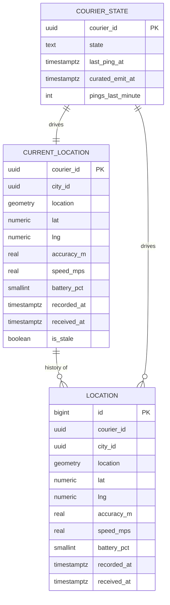

# courier-tracking-service — Entity-Relationship Diagram

## 1. Database

- Engine: PostgreSQL 18 with **PostGIS** extension.
- Schema: `courier_tracking` (owned exclusively by this service).
- Migrations: `services/courier-tracking-service/migrations/` —
  versioned, forward-only.

## 2. Cross-Service References

| Column | Type | Refers to | Source of truth |
|--------|------|-----------|------------------|
| `courier_id` | UUID | `Courier` in `courier-service` | `courier-service` |
| `city_id` | UUID | `City` in `zone-service` | `zone-service` |
| `correlation_id` | UUID | request scope | gateway |

All cross-service references are stored as UUID columns **without**
database-level foreign keys. See
[`architecture/CONSISTENCY_STRATEGY.md`](../../architecture/CONSISTENCY_STRATEGY.md).

## 3. Entities

### `CurrentLocation`

The latest known position per courier. UPSERT by `courier_id`. One
row per courier when online. Cleared when the courier goes offline
(reaper deletes after 24h).

#### Columns

| Column | Type | Constraints | Notes |
|--------|------|-------------|-------|
| `courier_id` | UUID | PK | cross-service ref |
| `city_id` | UUID | NOT NULL | denormalised for filtering |
| `zone_id` | UUID | NULL | finer grain |
| `location` | `geometry(Point, 4326)` | NOT NULL | PostGIS point |
| `lat` | NUMERIC(9,6) | NOT NULL | generated from `location` |
| `lng` | NUMERIC(9,6) | NOT NULL | generated from `location` |
| `accuracy_m` | REAL | NOT NULL | |
| `speed_mps` | REAL | NOT NULL | |
| `heading_deg` | REAL | NULL | |
| `battery_pct` | SMALLINT | NULL | 0..100 |
| `recorded_at` | TIMESTAMPTZ | NOT NULL | client timestamp |
| `received_at` | TIMESTAMPTZ | NOT NULL DEFAULT now() | server timestamp |
| `is_stale` | BOOLEAN | NOT NULL DEFAULT false | server-side flag |
| `updated_at` | TIMESTAMPTZ | NOT NULL DEFAULT now() | |

#### Indexes

- PK on `courier_id`.
- GIST on `location` for nearby queries.
- Index on `(city_id, is_stale)` for city pool views.

#### Constraints

- CHECK `accuracy_m BETWEEN 0 AND 1000`.
- CHECK `speed_mps BETWEEN 0 AND 200`.
- CHECK `battery_pct IS NULL OR battery_pct BETWEEN 0 AND 100`.

### `Location` (Trail, Partitioned by Day)

Append-only trail of recent pings. Partitioned by day on
`recorded_at`.

#### Columns

| Column | Type | Constraints | Notes |
|--------|------|-------------|-------|
| `id` | BIGSERIAL | PK | |
| `courier_id` | UUID | NOT NULL | cross-service ref |
| `city_id` | UUID | NOT NULL | |
| `location` | `geometry(Point, 4326)` | NOT NULL | |
| `lat` | NUMERIC(9,6) | NOT NULL | generated |
| `lng` | NUMERIC(9,6) | NOT NULL | generated |
| `accuracy_m` | REAL | NOT NULL | |
| `speed_mps` | REAL | NOT NULL | |
| `heading_deg` | REAL | NULL | |
| `battery_pct` | SMALLINT | NULL | |
| `recorded_at` | TIMESTAMPTZ | NOT NULL | |
| `received_at` | TIMESTAMPTZ | NOT NULL DEFAULT now() | |
| `correlation_id` | UUID | NOT NULL | |
| `created_at` | TIMESTAMPTZ | NOT NULL DEFAULT now() | append-only |

#### Indexes

- PK on `id`.
- Index on `(courier_id, recorded_at DESC)` for trail queries.
- Index on `(city_id, recorded_at)` for city aggregates.
- GIST on `location` (per partition) for trail-based geofence.

#### Constraints

- CHECK `accuracy_m BETWEEN 0 AND 1000`.
- CHECK `speed_mps BETWEEN 0 AND 200`.

### `CourierState` (Operational)

The operational state of a courier in this service (not the
authoritative availability state, which lives in
`courier-service`).

#### Columns

| Column | Type | Constraints | Notes |
|--------|------|-------------|-------|
| `courier_id` | UUID | PK | cross-service ref |
| `state` | TEXT | NOT NULL CHECK in (`online`,`offline`,`stale`) | server-side |
| `last_ping_at` | TIMESTAMPTZ | NULL | |
| `curated_emit_at` | TIMESTAMPTZ | NULL | last curated emit time |
| `pings_last_minute` | INT | NOT NULL DEFAULT 0 | for throttling |
| `updated_at` | TIMESTAMPTZ | NOT NULL DEFAULT now() | |

#### Indexes

- PK on `courier_id`.
- Index on `(state, last_ping_at)` for stale scanning.

### `Outbox` / `Inbox`

Standard platform outbox/inbox. See
[`EVENT_ARCHITECTURE.md`](../../architecture/EVENT_ARCHITECTURE.md).

## 4. Mermaid ER Diagram



## 5. DDL Sketch

```sql
CREATE EXTENSION IF NOT EXISTS postgis;

CREATE SCHEMA IF NOT EXISTS courier_tracking;

CREATE TABLE courier_tracking.current_locations (
    courier_id UUID PRIMARY KEY,
    city_id UUID NOT NULL,
    zone_id UUID,
    location geometry(Point, 4326) NOT NULL,
    lat NUMERIC(9,6) GENERATED ALWAYS AS (ST_Y(location)) STORED,
    lng NUMERIC(9,6) GENERATED ALWAYS AS (ST_X(location)) STORED,
    accuracy_m REAL NOT NULL,
    speed_mps REAL NOT NULL,
    heading_deg REAL,
    battery_pct SMALLINT,
    recorded_at TIMESTAMPTZ NOT NULL,
    received_at TIMESTAMPTZ NOT NULL DEFAULT now(),
    is_stale BOOLEAN NOT NULL DEFAULT false,
    updated_at TIMESTAMPTZ NOT NULL DEFAULT now(),
    CONSTRAINT current_acc_chk CHECK (accuracy_m BETWEEN 0 AND 1000),
    CONSTRAINT current_speed_chk CHECK (speed_mps BETWEEN 0 AND 200),
    CONSTRAINT current_battery_chk
        CHECK (battery_pct IS NULL OR battery_pct BETWEEN 0 AND 100)
);

CREATE INDEX current_location_gist
    ON courier_tracking.current_locations USING GIST (location);
CREATE INDEX current_city_stale_ix
    ON courier_tracking.current_locations (city_id, is_stale);

CREATE TABLE courier_tracking.locations (
    id BIGSERIAL,
    courier_id UUID NOT NULL,
    city_id UUID NOT NULL,
    location geometry(Point, 4326) NOT NULL,
    lat NUMERIC(9,6) GENERATED ALWAYS AS (ST_Y(location)) STORED,
    lng NUMERIC(9,6) GENERATED ALWAYS AS (ST_X(location)) STORED,
    accuracy_m REAL NOT NULL,
    speed_mps REAL NOT NULL,
    heading_deg REAL,
    battery_pct SMALLINT,
    recorded_at TIMESTAMPTZ NOT NULL,
    received_at TIMESTAMPTZ NOT NULL DEFAULT now(),
    correlation_id UUID NOT NULL,
    created_at TIMESTAMPTZ NOT NULL DEFAULT now(),
    PRIMARY KEY (id, recorded_at)
) PARTITION BY RANGE (recorded_at);

CREATE TABLE IF NOT EXISTS courier_tracking.locations_2026_07_29
    PARTITION OF courier_tracking.locations
    FOR VALUES FROM ('2026-07-29 00:00:00+00') TO ('2026-07-30 00:00:00+00');

-- Verify the child is actually attached to the correct parent with
-- the expected bounds. IF NOT EXISTS only guards the name; it does
-- not verify bounds.
DO $$
DECLARE
    v_parent   REGCLASS := 'courier_tracking.locations'::REGCLASS;
    v_child    REGCLASS := 'courier_tracking.locations_2026_07_29'::REGCLASS;
    v_expected TSTZRANGE := tstzrange('2026-07-29 00:00:00+00',
                                      '2026-07-30 00:00:00+00',
                                      '[)');
BEGIN
    IF (SELECT inhparent FROM pg_inherits WHERE inhrelid = v_child)
       IS DISTINCT FROM v_parent THEN
        RAISE EXCEPTION 'partition % is not attached to %',
            v_child::text, v_parent::text;
    END IF;
    IF NOT (SELECT relpartbound FROM pg_class WHERE oid = v_child)
              = v_expected THEN
        RAISE EXCEPTION 'partition % has unexpected bounds', v_child::text;
    END IF;
END $$;

CREATE INDEX locations_courier_time_ix
    ON courier_tracking.locations (courier_id, recorded_at DESC);
CREATE INDEX locations_city_time_ix
    ON courier_tracking.locations (city_id, recorded_at);
CREATE INDEX locations_gist
    ON courier_tracking.locations USING GIST (location);

CREATE TABLE courier_tracking.courier_states (
    courier_id UUID PRIMARY KEY,
    state TEXT NOT NULL CHECK (state IN ('online','offline','stale')),
    last_ping_at TIMESTAMPTZ,
    curated_emit_at TIMESTAMPTZ,
    pings_last_minute INT NOT NULL DEFAULT 0,
    updated_at TIMESTAMPTZ NOT NULL DEFAULT now()
);

CREATE INDEX courier_states_state_ping_ix
    ON courier_tracking.courier_states (state, last_ping_at);

CREATE TABLE courier_tracking.outbox (
    id BIGSERIAL PRIMARY KEY,
    event_id UUID UNIQUE NOT NULL,
    topic TEXT NOT NULL,
    partition_key UUID NOT NULL,
    payload JSONB NOT NULL,
    created_at TIMESTAMPTZ NOT NULL DEFAULT now(),
    claimed_at TIMESTAMPTZ,
    published_at TIMESTAMPTZ
);

CREATE TABLE courier_tracking.inbox (
    event_id UUID PRIMARY KEY,
    topic TEXT NOT NULL,
    received_at TIMESTAMPTZ NOT NULL DEFAULT now(),
    received_at TIMESTAMPTZ NOT NULL DEFAULT now(),
    processed_at TIMESTAMPTZ,
    error TEXT
);
```

## 6. Audit Columns

Every mutable table has `created_at` (or `received_at`) and
`updated_at`. The `locations` table is append-only; its
`created_at` is set once.

## 7. Soft Delete

Not used. `current_locations` rows are deleted by a reaper 24h
after the courier goes offline. Trail rows are dropped with their
partition.

## 8. JSONB Usage

- `outbox.payload` — event envelope.
- No other JSONB columns.

## 9. Partitioning

- `locations` (trail) is range-partitioned by day on `recorded_at`.
- Pre-create partitions for the next 30 days via a maintenance job.
- Drop partitions older than `trail_retention_days` (default 30).
- `current_locations` is NOT partitioned.

See [`DATABASE_ARCHITECTURE.md` §"Table Partitioning — Canonical Template"](../../architecture/DATABASE_ARCHITECTURE.md) for the idempotent `CREATE TABLE IF NOT EXISTS … PARTITION OF …` pattern, naming convention, and the service-owned maintenance-job contract (advisory lock, verification, retention/mixed-retention handling).

## 10. Data Retention

| Table | Retention | Purged by |
|-------|-----------|-----------|
| `current_locations` | 24h after courier goes offline | reaper |
| `locations` (trail) | 30 days | partition drop |
| `courier_states` | 24h after offline | reaper |
| `outbox` | 24h after `published_at` | poller |
| `inbox` | 30 days (TTL) | nightly batch |

## 11. Migration Considerations

- Adding PostGIS-generated columns is idempotent; use `IF NOT EXISTS`.
- Adding a new state value to `courier_states.state` requires a
  CHECK update and a code change to the state machine.
- Partition pre-creation is a separate scheduled job; ensure the
  job is deployed alongside the service.
- Trail partition drop is irreversible; ensure downstream
  consumers (analytics) have aggregated the data they need.

---

## See also

### Sibling docs for this service

- [`README.md`](./README.md) — purpose, bounded context, responsibilities
- [`BRD.md`](./BRD.md) — business requirements
- [`SRS.md`](./SRS.md) — functional + non-functional requirements
- [`ERD.md`](./ERD.md) — data model (entities, relationships)
- [`INTEGRATION.md`](./INTEGRATION.md) — inter-service contracts (APIs, events, sagas)
- [`WORKFLOWS.md`](./WORKFLOWS.md) — operational workflows (happy paths, failure modes)
- [`TECH.md`](./TECH.md) — technology profile (runtime, libraries, data layer, admin endpoints, RBAC)

### Platform-wide

- [`../../shared/README.md`](../../shared/README.md) — `platform-spring-boot-starter` shared library (the single source of cross-cutting code for all Spring Boot services in the platform)
- [`../RECOMMENDATIONS.md`](../RECOMMENDATIONS.md) — platform-wide technology map (language, framework, version baseline, admin/RBAC pattern)
- [`../../README.md`](../../README.md) — services overview (the catalog of all 58 services)
- [`../../../main.md`](../../../main.md) — top-level platform specification (architecture, Keycloak, PostgreSQL 18, messaging, observability baseline)

