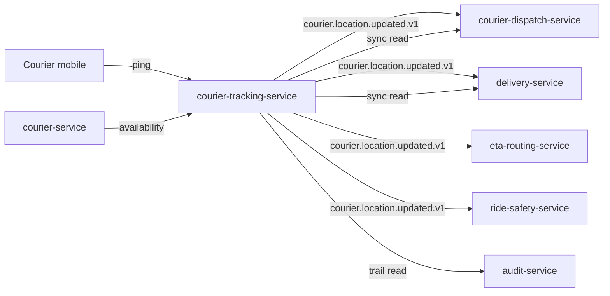

# courier-tracking-service — Software Requirements Specification

## 1. Introduction

This document specifies the software behaviour of
`courier-tracking-service`. It is the engineering source of truth
for the location stream, its API, and its data model.

## 2. Scope

- In scope: ingestion, current-location persistence, trail
  persistence, curated stream emission, last-known reads, nearby
  queries, stale detection, partition management.
- Out of scope: courier profile / KYC, delivery state, dispatch,
  safety analytics.

## 3. System Context



## 4. Actors

- `courier` (Keycloak `platform-courier`).
- `courier-service` (system actor).
- `courier-dispatch-service`, `delivery-service`,
  `eta-routing-service`, `ride-safety-service` (system actors,
  read-only).
- `admin-service` (Keycloak `platform-internal`, role `admin`).

## 5. Functional Requirements

| ID | Requirement | Priority |
|----|-------------|----------|
| FR--001 | Accept `POST /v1/couriers/{id}/location` with `lat`, `lng`, `accuracy_m`, `speed_mps`, `heading_deg`, `battery_pct`, `timestamp`. | MUST |
| FR--002 | Reject the ping with 403 if the JWT `sub` does not match `courier_id`. | MUST |
| FR--003 | Reject the ping with 409 if the courier is not `online` (per `courier-service` state). | MUST |
| FR--004 | UPSERT `courier_tracking.current_locations` on every accepted ping. | MUST |
| FR--005 | INSERT into `courier_tracking.locations` (trail) on every accepted ping, batched. | MUST |
| FR--006 | Emit `courier.location.updated.v1` at most `curated_rate_hz` per courier per second. | MUST |
| FR--007 | If a courier is stale (no ping in `stale_threshold_seconds`), suppress curated emits. | MUST |
| FR--008 | Serve `GET /v1/couriers/{id}/location` from Redis with PostgreSQL fallback. | MUST |
| FR--009 | Serve `GET /v1/couriers/{id}/trail?from=…&to=…` from the partitioned table. | MUST |
| FR--010 | Serve `GET /v1/locations/recent?city_id=…&bbox=…` for a bounding box of couriers. | MUST |
| FR--011 | Pre-create daily partitions for the next 30 days. | MUST |
| FR--012 | Drop daily partitions older than `trail_retention_days`. | MUST |
| FR--013 | Honor `configuration.updated.v1` for `curated_rate_hz`, `stale_threshold_seconds`, `max_ping_hz`, `trail_retention_days`. | MUST |
| FR--014 | Throttle incoming pings to `max_ping_hz` per courier (return 429 on excess). | SHOULD |
| FR--015 | Sample 1/1000 pings to `courier_tracking.audit.location_ingested.v1` for audit. | SHOULD |
| FR--016 | On `courier.availability.offline.v1`, mark the courier as offline; suppress curated emits. | MUST |

## 6. Non-Functional Requirements

| ID | Category | Requirement | Target |
|----|----------|-------------|--------|
| NFR--001 | performance | Ingest P99 | ≤ 100ms |
| NFR--002 | performance | Last-known P99 | ≤ 30ms |
| NFR--003 | performance | Nearby query P99 | ≤ 200ms (city bounding box) |
| NFR--004 | availability | Service uptime | 99.95% / 30d |
| NFR--005 | scalability | Sustained pings | 50k/s/region |
| NFR--006 | scalability | Burst pings | 100k/s/region (≤ 10s) |
| NFR--007 | maintainability | MTTR | ≤ 30 min |
| NFR--008 | observability | End-to-end trace per ingest | 100% (sampled) |
| NFR--009 | consistency | Last-known visible to readers within | 1s of ingest |
| NFR--010 | durability | Zero data loss for accepted pings (at-least-once) | MUST |

## 7. API Requirements

- All non-idempotent `POST` endpoints require `Idempotency-Key`.
- The ping endpoint's idempotency key is optional; if supplied, it
  is used for dedup within a 60s window (replays are no-ops).
- All endpoints validate input with JSON Schema.
- Full contracts: `INTEGRATION.md`.

## 8. Data Requirements

| ID | Requirement | Notes |
|----|-------------|-------|
| DATA--001 | `courier_id`, `city_id` are stored as UUID columns WITHOUT database FKs. | Cross-service references. |
| DATA--002 | The `locations` (trail) table is range-partitioned by day on `recorded_at`. | |
| DATA--003 | The `current_locations` table has one row per courier (UPSERT). | |
| DATA--004 | Location columns use PostGIS `geometry(Point, 4326)`. | |
| DATA--005 | No PII beyond the location is stored. | |
| DATA--006 | `recorded_at` is `timestamptz`; the service normalises client clocks. | |

## 9. Validation Rules

- `lat` ∈ [-90, 90]; `lng` ∈ [-180, 180].
- `accuracy_m` ≤ 1000 (rejected with 422 if higher; suspect fix).
- `speed_mps` ≤ 200 (rejected; above 720 km/h is a vehicle on a
  train, not a courier).
- `timestamp` MUST be within ±5 minutes of the server's wall clock.
- `battery_pct` ∈ [0, 100].

## 10. State Transitions

`CourierTrackingState`:

```
offline → online (event)
online → stale (no ping in N s)
stale → online (fresh ping)
online → offline (event)
```

## 11. Authorization Requirements

- Couriers may only ping their own location
  (`courier_id == sub`).
- Service-to-service callers require `courier-tracking.read` or
  `courier-tracking.write` in the `courier-tracking-service` client.
- Admin endpoints require `courier-tracking.admin`.

## 12. Configuration Requirements

- Reads `courier_tracking.*` from `configuration-service` at
  startup and on `configuration.updated.v1`.
- Numeric config validated against min/max bounds.

## 13. Error Handling

| Error | Response |
|-------|----------|
| Courier not online | 409 `COURIER_OFFLINE` |
| `courier_id` mismatch | 403 `NOT_ASSIGNED_COURIER` |
| Validation failed | 400 `VALIDATION_FAILED` |
| Throttled | 429 `RATE_LIMITED` with `Retry-After` |
| Database unavailable | 503 `DEPENDENCY_UNAVAILABLE` |

## 14. Concurrency Requirements

- The current-location UPSERT is the only synchronous DB write
  per ping; it is single-row by `courier_id`.
- The trail INSERT is batched (every 100ms or 1024 pings,
  whichever first) to amortise round-trips.
- A Redis sorted set is used to drive the curated emit cadence
  (a worker pops ready couriers and emits).

## 15. Idempotency Requirements

- The ping endpoint accepts an optional `Idempotency-Key`; if
  supplied, replays within 60s return the original response.
- Without an Idempotency-Key, the service trusts the `timestamp`
  to dedup (replays with the same `timestamp` are no-ops).

## 16. Performance

- Dominant path: HTTP POST → UPSERT current_location → enqueue
  trail batch → enqueue curated emit (if due).
- P50 / P95 / P99: see NFRs.

## 17. Scalability

- Horizontal: stateless; HPA on `kafka_consumer_lag` and
  `courier_location_ingested_total` rate.
- Vertical: bounded by PostgreSQL connection pool.
- Sharding: pings are partitioned by `courier_id`; the
  current-location UPSERT is single-row by primary key.

## 18. Availability

- SLO: 99.95% over 30 days. Error budget: ~22 min / 30d.
- Maintenance: rolling deploys only.
- Degraded mode: if Redis is down, the last-known read falls
  back to PostgreSQL (`current_locations`) with higher latency.

## 19. Security

| ID | Requirement | Notes |
|----|-------------|-------|
| SEC--001 | All endpoints require JWT bearer validated at the gateway. | |
| SEC--002 | Couriers may only ping their own location. | Server check. |
| SEC--003 | No PII beyond location. | |
| SEC--004 | Trail retention ≤ 30 days. | Hard limit. |
| SEC--005 | Customer-facing endpoints do not expose courier locations. | Not implemented in this service. |

## 20. Privacy

- PII stored: location trail (potentially sensitive beyond 24h).
- Retention: 30 days (trail), 5 min (Redis cache), forever
  (current — until the courier goes offline and a reaper deletes
  the row after 24h).
- Erasure: not applicable (no name/email/phone).

## 21. Auditability

- 1/1000 pings are sampled to
  `courier_tracking.audit.location_ingested.v1` for forensic
  purposes.
- Admin reads of the trail are logged with `actor_id` and reason.

## 22. Observability

- Logs: JSON; fields include `correlation_id`, `courier_id`,
  `city_id`.
- Metrics: `courier_location_ingested_total{city_id,source}`,
  `courier_location_curated_emitted_total{city_id}`,
  `courier_location_p99_latency_ms`,
  `courier_location_stale_count{city_id}`,
  `courier_location_pool_size{city_id}`,
  `courier_location_trail_bytes`.
- Traces: OpenTelemetry; one span per ingest; sampled 1/1000.
- Alerts: ingest p99 > 200ms; stale count > 10% of pool for > 5m;
  trail partition missing for today.

## 23. Maintainability

- Code style: Go 1.22; `golangci-lint` with platform rules.
- Test coverage: ≥ 80% line, ≥ 70% branch.
- Documentation: this folder + `WORKFLOWS.md`.

## 24. Disaster Recovery

- RPO: 5 minutes (current_locations is replicated to standby
  region; trail partitions are replicated).
- RTO: 30 minutes (stateless service).

## 25. Acceptance Criteria

- All FR/NFR are met and verified by automated tests.
- All SEC are met and verified by a security review.
- A load test sustains 50k pings/s with p99 ≤ 100ms.
- A chaos test (kill Redis) shows the last-known read falls back
  to PostgreSQL with p99 ≤ 200ms.
- Stale detection triggers within 60s.

---

## See also

### Sibling docs for this service

- [`README.md`](./README.md) — purpose, bounded context, responsibilities
- [`BRD.md`](./BRD.md) — business requirements
- [`SRS.md`](./SRS.md) — functional + non-functional requirements
- [`ERD.md`](./ERD.md) — data model (entities, relationships)
- [`INTEGRATION.md`](./INTEGRATION.md) — inter-service contracts (APIs, events, sagas)
- [`WORKFLOWS.md`](./WORKFLOWS.md) — operational workflows (happy paths, failure modes)
- [`TECH.md`](./TECH.md) — technology profile (runtime, libraries, data layer, admin endpoints, RBAC)

### Platform-wide

- [`../../shared/README.md`](../../shared/README.md) — `platform-spring-boot-starter` shared library (the single source of cross-cutting code for all Spring Boot services in the platform)
- [`../RECOMMENDATIONS.md`](../RECOMMENDATIONS.md) — platform-wide technology map (language, framework, version baseline, admin/RBAC pattern)
- [`../../README.md`](../../README.md) — services overview (the catalog of all 58 services)
- [`../../../main.md`](../../../main.md) — top-level platform specification (architecture, Keycloak, PostgreSQL 18, messaging, observability baseline)

