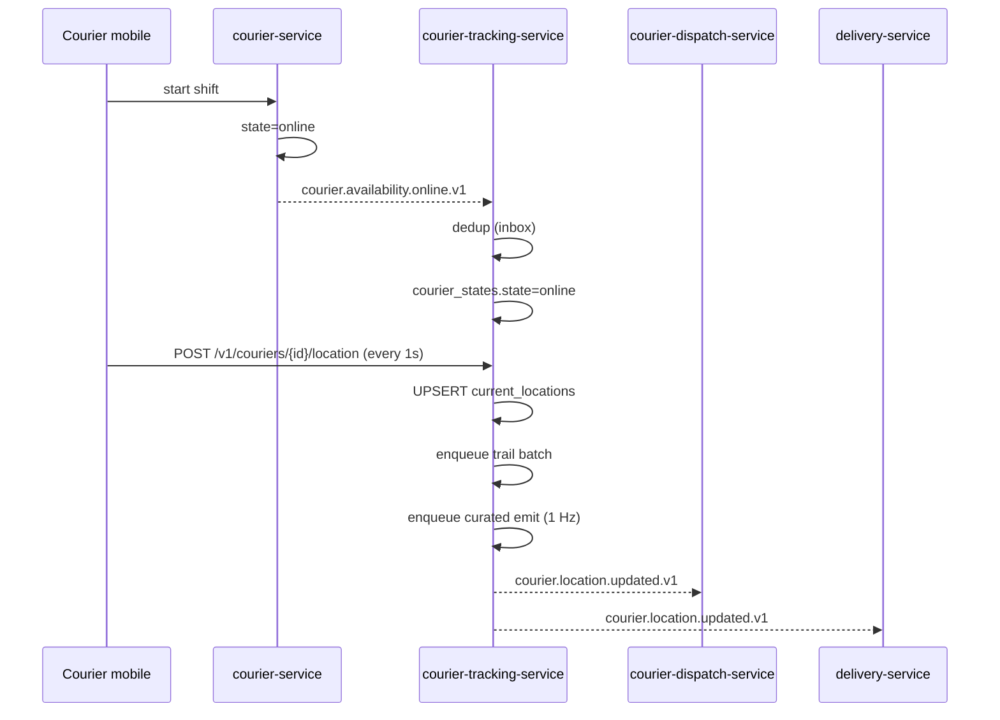
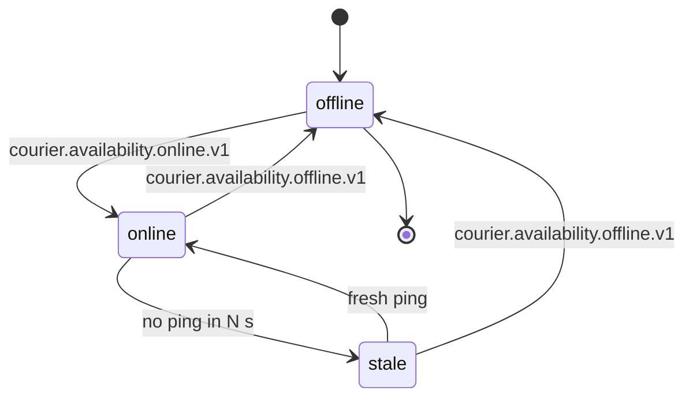
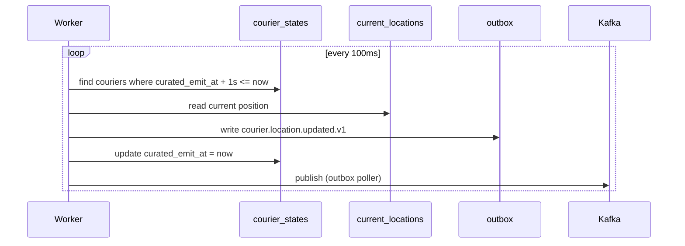
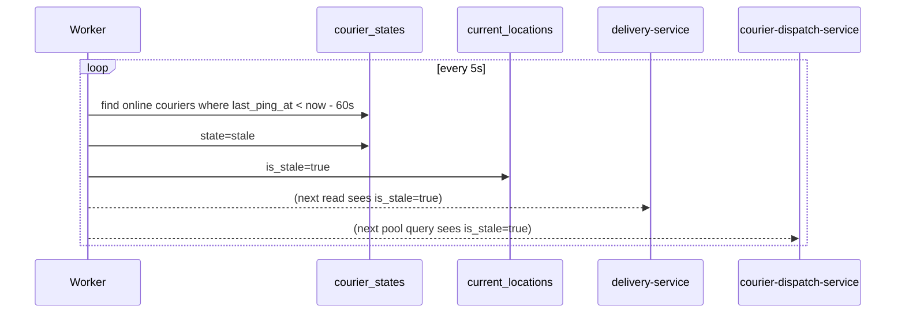
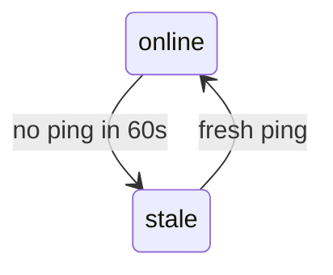
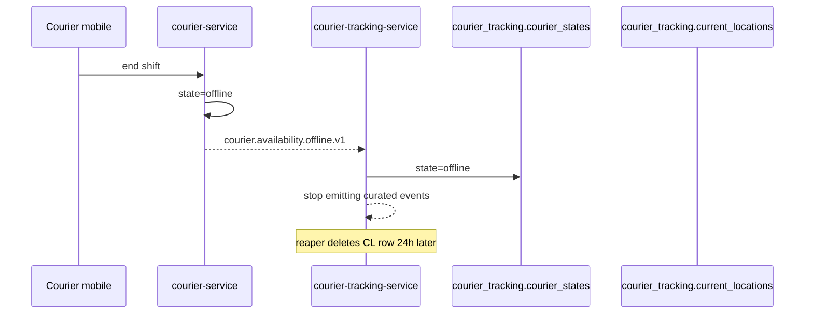
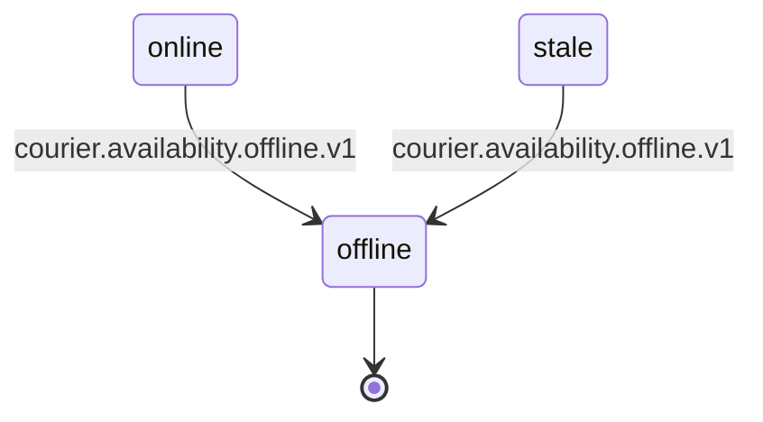
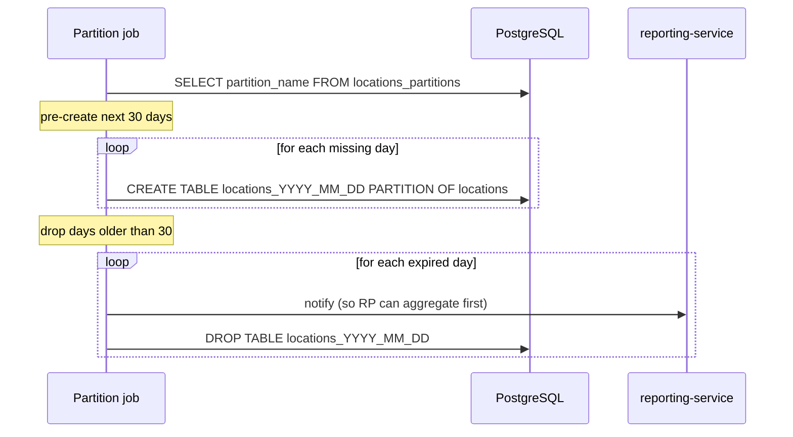

# courier-tracking-service — Workflows

## 1. `Courier Comes Online → Starts Pinging` (Onboarding)

### 1.1 Objective

When a courier ends a shift in `courier-service` and goes online,
this service begins accepting pings and emitting curated events.

### 1.2 Initiating Actor

`courier-service` (system actor) emits
`courier.availability.online.v1`.

### 1.3 Participating Services

- `courier-service` (producer)
- `courier-tracking-service` (this service)
- `courier-dispatch-service` (downstream consumer)
- `delivery-service` (downstream consumer)

### 1.4 Prerequisites

- The courier has a valid `courier_id`.
- The mobile app is authenticated and has location permission.

### 1.5 Happy Path

### 1.6 Alternate Paths

- **Courier already online**: idempotent; the state row is
  upserted; no duplicate emits.

### 1.7 Failure Paths

- **Inbox replay**: the same `courier.availability.online.v1`
  arriving twice is a no-op.
- **DB write fails**: the ping is rejected with 503; the mobile
  app retries with backoff.

### 1.8 Business Rules

- The state in this service mirrors the authoritative
  `courier-service` state, with the addition of `stale`.

### 1.9 State Transitions

### 1.10 Events

| Event | Direction | When |
|-------|-----------|------|
| `courier.availability.online.v1` | consumed | on shift start |
| `courier.location.updated.v1` | produced | at curated cadence |

### 1.11 APIs Involved

| API | Direction | When |
|-----|-----------|------|
| `POST /v1/couriers/{id}/location` | inbound | every 1s |

### 1.12 Compensation / Rollback

None. The state is event-sourced; the next `offline` event cleans
up.

### 1.13 Final State

- `courier_states.state = online`
- `current_locations` row present.

## 2. `Curated Stream Emission`

### 2.1 Objective

Decouple the raw ping rate (up to 5 Hz) from the curated stream
rate (1 Hz) so downstream consumers are not overloaded.

### 2.2 Initiating Actor

A scheduler-driven worker in this service pops ready couriers
every 100ms.

### 2.3 Participating Services

- `courier-tracking-service` (this service)
- Downstream consumers (`courier-dispatch-service`,
  `delivery-service`, `eta-routing-service`,
  `ride-safety-service`)

### 2.4 Prerequisites

- A courier is `online` and has a `last_ping_at`.
- The cadence `curated_rate_hz` is loaded.

### 2.5 Happy Path

### 2.6 Alternate Paths

- **Courier is stale**: skipped.
- **Courier is offline**: skipped.
- **No new ping since last emit**: skipped (only emit when
  `last_ping_at > curated_emit_at`).

### 2.7 Failure Paths

- **Outbox publish fails**: retried with backoff; after N
  failures → DLQ.
- **Courier is offline but emit is scheduled**: skipped on the
  next iteration.

### 2.8 Business Rules

- At most `curated_rate_hz` emits per courier per second.
- No emit for stale or offline couriers.

### 2.9 State Transitions

N/A.

### 2.10 Events

| Event | Direction | When |
|-------|-----------|------|
| `courier.location.updated.v1` | produced | at cadence |

### 2.11 APIs Involved

None external.

### 2.12 Compensation / Rollback

N/A.

### 2.13 Final State

- `courier_states.curated_emit_at` updated.

## 3. `Stale Detection`

### 3.1 Objective

Mark a courier as `stale` when no ping has been received in
`stale_threshold_seconds` (default 60).

### 3.2 Initiating Actor

A scheduler-driven worker in this service runs every 5s.

### 3.3 Participating Services

- `courier-tracking-service` (this service)
- `courier-dispatch-service` (downstream: sees stale and widens
  search)

### 3.4 Prerequisites

- A courier is `online` (in `courier_states`).

### 3.5 Happy Path

### 3.6 Alternate Paths

- **Courier comes back online (fresh ping)**: `state=online`,
  `is_stale=false`.

### 3.7 Failure Paths

- **Stale worker is down**: a backup hourly job in
  `reporting-service` detects stale > 5 min and pages on-call.

### 3.8 Business Rules

- Stale threshold is configurable per city.
- A stale courier is not removed from the pool — they may recover.

### 3.9 State Transitions

### 3.10 Events

No new events; downstream reads see `is_stale=true` via the
read API and adjust accordingly.

### 3.11 APIs Involved

| API | Direction | When |
|-----|-----------|------|
| `GET /v1/couriers/{id}/location` | inbound | from downstream consumers |

### 3.12 Compensation / Rollback

A fresh ping reverts the stale flag.

### 3.13 Final State

`courier_states.state = stale`, `current_locations.is_stale = true`.

## 4. `Courier Goes Offline` (End of Shift)

### 4.1 Objective

When the courier ends their shift, stop persisting pings and stop
emitting curated events; keep the last position for 24h for
post-mortem queries.

### 4.2 Initiating Actor

`courier-service` emits `courier.availability.offline.v1`.

### 4.3 Participating Services

- `courier-service` (producer)
- `courier-tracking-service` (this service)

### 4.4 Prerequisites

- The courier is `online` in `courier_states`.

### 4.5 Happy Path

### 4.6 Alternate Paths

- **Courier was stale**: same path; the reaper still deletes
  after 24h.

### 4.7 Failure Paths

- **Reaper fails**: a daily job in `reporting-service` finds
  offline couriers with `received_at` older than 24h and deletes
  them.

### 4.8 Business Rules

- A reaper deletes `current_locations` rows for offline couriers
  24h after they went offline.
- The trail (`locations`) is unaffected; it ages out with the
  daily partition.

### 4.9 State Transitions

### 4.10 Events

| Event | Direction | When |
|-------|-----------|------|
| `courier.availability.offline.v1` | consumed | on shift end |

### 4.11 APIs Involved

None.

### 4.12 Compensation / Rollback

If the courier re-opens the app, `courier.availability.online.v1`
is re-emitted; the service resumes.

### 4.13 Final State

- `courier_states.state = offline`
- `current_locations` row reaped after 24h.

## 5. `Daily Partition Maintenance`

### 5.1 Objective

Pre-create daily partitions for the next 30 days; drop partitions
older than 30 days.

### 5.2 Initiating Actor

A scheduled job runs daily at 02:00 UTC.

### 5.3 Participating Services

- `courier-tracking-service` (this service)
- (Optional) `reporting-service` consumes the daily aggregation
  from the dropped partition before it is dropped.

### 5.4 Prerequisites

- The `locations` table is range-partitioned by day.
- The reaper is configured with `trail_retention_days=30`.

### 5.5 Happy Path

### 5.6 Alternate Paths

- **A partition is missing for today**: a critical alert fires
  (would cause INSERT failures).

### 5.7 Failure Paths

- **DDL fails**: the job retries with backoff; on persistent
  failure, on-call is paged.

### 5.8 Business Rules

- Pre-create 30 days ahead.
- Drop 30 days behind.

### 5.9 State Transitions

N/A.

### 5.10 Events

None (this is an internal maintenance job). Optionally, an
`audit.partition.maintained.v1` event is emitted.

### 5.11 APIs Involved

None.

### 5.12 Compensation / Rollback

A dropped partition cannot be recovered. The job takes a snapshot
of the day's data into a cold-storage bucket before dropping (per
platform archival policy).

### 5.13 Final State

- 30 future partitions exist.
- 30 past partitions exist.
- Older partitions are gone (data is in cold storage).

---

## See also

### Sibling docs for this service

- [`README.md`](./README.md) — purpose, bounded context, responsibilities
- [`BRD.md`](./BRD.md) — business requirements
- [`SRS.md`](./SRS.md) — functional + non-functional requirements
- [`ERD.md`](./ERD.md) — data model (entities, relationships)
- [`INTEGRATION.md`](./INTEGRATION.md) — inter-service contracts (APIs, events, sagas)
- [`WORKFLOWS.md`](./WORKFLOWS.md) — operational workflows (happy paths, failure modes)
- [`TECH.md`](./TECH.md) — technology profile (runtime, libraries, data layer, admin endpoints, RBAC)

### Platform-wide

- [`../../shared/README.md`](../../shared/README.md) — `platform-spring-boot-starter` shared library (the single source of cross-cutting code for all Spring Boot services in the platform)
- [`../RECOMMENDATIONS.md`](../RECOMMENDATIONS.md) — platform-wide technology map (language, framework, version baseline, admin/RBAC pattern)
- [`../../README.md`](../../README.md) — services overview (the catalog of all 58 services)
- [`../../../main.md`](../../../main.md) — top-level platform specification (architecture, Keycloak, PostgreSQL 18, messaging, observability baseline)

