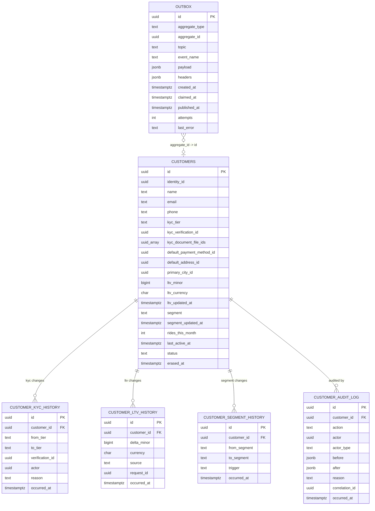

# customer-service — Entity-Relationship Diagram

## 1. Database

- **Engine**: PostgreSQL 19.
- **Schema**: `customer`.
- **Migrations**: `services/customer-service/migrations/`
  (versioned, forward-only, Flyway).

## 2. Cross-Service References

| Column | Type | Refers to | Source of truth |
|--------|------|-----------|------------------|
| `identity_id` | UUID | `Identity` in `identity-service` | `identity-service` |
| `default_payment_method_id` | UUID | `PaymentMethod` in `payment-service` | `payment-service` |
| `default_address_id` | UUID | `Address` in ``customer-service` (addresses)` | ``customer-service` (addresses)` |
| `primary_city_id` | UUID | `City` in ``geolocation-service` (zones)` | ``geolocation-service` (zones)` |
| `kyc_verification_id` | UUID | KYC provider's verification id | KYC provider |
| `kyc_document_file_ids` | UUID[] | `File` in `file-service` | `file-service` |

All stored as UUID columns WITHOUT database FKs.

## 3. Entities

### `customers`

The platform's customer aggregate. One row per customer.

#### Columns

| Column | Type | Constraints | Notes |
|--------|------|-------------|-------|
| `id` | UUID | PK | UUIDv7 |
| `identity_id` | UUID | NOT NULL, UNIQUE | cross-service ref |
| `name` | TEXT | NULL (PII, column-level encrypted) | cached |
| `email` | TEXT | NULL (PII, column-level encrypted) | cached |
| `phone` | TEXT | NULL (PII, column-level encrypted) | cached |
| `kyc_tier` | TEXT | NOT NULL DEFAULT 'tier_0' | `tier_0` / `tier_1` / `tier_2` / `tier_3` |
| `kyc_verification_id` | UUID | NULL | provider's id |
| `kyc_verified_at` | TIMESTAMPTZ | NULL | when the current tier was set |
| `kyc_document_file_ids` | UUID[] | NOT NULL DEFAULT '{}' | file-service refs |
| `default_payment_method_id` | UUID | NULL | cross-service ref |
| `default_address_id` | UUID | NULL | cross-service ref |
| `primary_city_id` | UUID | NULL | cross-service ref |
| `ltv_minor` | BIGINT | NOT NULL DEFAULT 0 | rolling 365-day |
| `ltv_currency` | CHAR(3) | NOT NULL DEFAULT 'USD' | ISO 4217 |
| `ltv_updated_at` | TIMESTAMPTZ | NULL | when LTV was last updated |
| `segment` | TEXT | NOT NULL DEFAULT 'standard' | `standard` / `frequent` / `vip` / `churned` |
| `segment_updated_at` | TIMESTAMPTZ | NULL | when segment was last computed |
| `rides_this_month` | INT | NOT NULL DEFAULT 0 | for `frequent` segment |
| `last_active_at` | TIMESTAMPTZ | NULL | for `churned` segment |
| `status` | TEXT | NOT NULL DEFAULT 'active' | `active` / `suspended` / `disabled` / `erased` |
| `suspended_reason` | TEXT | NULL | mirror of identity reason |
| `suspended_at` | TIMESTAMPTZ | NULL | when suspended |
| `suspended_by` | UUID | NULL | actor's identity_id |
| `disabled_at` | TIMESTAMPTZ | NULL | when disabled |
| `erased_at` | TIMESTAMPTZ | NULL | when GDPR-erased |
| `row_version` | BIGINT | NOT NULL DEFAULT 1 | optimistic-lock |
| `created_at` | TIMESTAMPTZ | NOT NULL DEFAULT now() | audit |
| `updated_at` | TIMESTAMPTZ | NOT NULL DEFAULT now() | audit |
| `created_by` | UUID | NOT NULL | identity |
| `updated_by` | UUID | NOT NULL | identity |
| `deleted_at` | TIMESTAMPTZ | NULL | soft delete |

#### Indexes

- PK on `id`.
- UNIQUE on `identity_id` (partial, `WHERE deleted_at IS NULL`).
- Index on `kyc_tier` (partial, `WHERE kyc_tier <> 'tier_0'`).
- Index on `segment` (partial, `WHERE status = 'active'`).
- Index on `status` (partial, `WHERE status <> 'active'`).
- Index on `default_payment_method_id` (partial, `WHERE default_payment_method_id IS NOT NULL`).
- Index on `default_address_id` (partial, `WHERE default_address_id IS NOT NULL`).

#### Constraints

- CHECK: `kyc_tier IN ('tier_0', 'tier_1', 'tier_2', 'tier_3')`.
- CHECK: `segment IN ('standard', 'frequent', 'vip', 'churned')`.
- CHECK: `status IN ('active', 'suspended', 'disabled', 'erased')`.
- CHECK: `ltv_minor >= 0`.

### `customer_kyc_history`

Append-only history of KYC tier changes.

#### Columns

| Column | Type | Constraints | Notes |
|--------|------|-------------|-------|
| `id` | UUID | PK | UUIDv7 |
| `customer_id` | UUID | NOT NULL | FK to `customers.id` |
| `from_tier` | TEXT | NULL | previous tier (null for first) |
| `to_tier` | TEXT | NOT NULL | new tier |
| `verification_id` | UUID | NULL | provider's id |
| `actor` | UUID | NULL | actor's identity_id |
| `reason` | TEXT | NULL | free text |
| `occurred_at` | TIMESTAMPTZ | NOT NULL DEFAULT now() | when changed |

#### Constraints

- No `UPDATE` or `DELETE` on this table.

### `customer_ltv_history`

Append-only history of LTV changes. Range-partitioned
by month.

#### Columns

| Column | Type | Constraints | Notes |
|--------|------|-------------|-------|
| `id` | UUID | PK | UUIDv7 |
| `customer_id` | UUID | NOT NULL | FK to `customers.id` |
| `delta_minor` | BIGINT | NOT NULL | change in LTV (positive or negative) |
| `currency` | CHAR(3) | NOT NULL | ISO 4217 |
| `service` | TEXT | NOT NULL | `ride` / `food` / `adjustment` (now `service` enum per ADR-0020) |
| `request_id` | UUID | NULL | the polymorphic request identifier per ADR-0020 |
| `occurred_at` | TIMESTAMPTZ | NOT NULL DEFAULT now() | partition key |

#### Partitioning

- Range partition by `occurred_at` (monthly).
- Pre-create the next 30 days of partitions.
- Drop partitions older than 1 year (after archive).

### `customer_segment_history`

Append-only history of segment changes.

#### Columns

| Column | Type | Constraints | Notes |
|--------|------|-------------|-------|
| `id` | UUID | PK | UUIDv7 |
| `customer_id` | UUID | NOT NULL | FK to `customers.id` |
| `from_segment` | TEXT | NULL | previous segment |
| `to_segment` | TEXT | NOT NULL | new segment |
| `trigger` | TEXT | NOT NULL | `nightly_job` / `ltv_change` / `rides_count_change` / `idle_threshold` |
| `occurred_at` | TIMESTAMPTZ | NOT NULL DEFAULT now() | when changed |

### `customer_audit_log`

Append-only audit of every state change. Immutable.

#### Columns

| Column | Type | Constraints | Notes |
|--------|------|-------------|-------|
| `id` | UUID | PK | UUIDv7 |
| `customer_id` | UUID | NOT NULL | FK to `customers.id` |
| `action` | TEXT | NOT NULL | `create` / `update` / `kyc_change` / `suspend` / `reinstate` / `disable` / `erase` / `default_method_change` / `default_address_change` |
| `actor` | UUID | NULL | actor's identity_id |
| `actor_type` | TEXT | NOT NULL | `user` / `admin` / `service` / `system` |
| `before` | JSONB | NULL | snapshot before |
| `after` | JSONB | NULL | snapshot after |
| `reason` | TEXT | NULL | reason code or free text |
| `correlation_id` | UUID | NULL | request correlation id |
| `occurred_at` | TIMESTAMPTZ | NOT NULL DEFAULT now() | when the action happened |

#### Constraints

- No `UPDATE` or `DELETE`.
- Retention 7 years.

### `outbox`

Outbox table for the outbox pattern. Same shape as
`identity-service.outbox`.

## 4. Mermaid ER Diagram



## 5. DDL Sketch

```sql
CREATE SCHEMA IF NOT EXISTS customer;

CREATE TABLE customer.customers (
    id UUID PRIMARY KEY,
    identity_id UUID NOT NULL,
    name TEXT,
    email TEXT,
    phone TEXT,
    kyc_tier TEXT NOT NULL DEFAULT 'tier_0',
    kyc_verification_id UUID,
    kyc_verified_at TIMESTAMPTZ,
    kyc_document_file_ids UUID[] NOT NULL DEFAULT '{}',
    default_payment_method_id UUID,
    default_address_id UUID,
    primary_city_id UUID,
    ltv_minor BIGINT NOT NULL DEFAULT 0,
    ltv_currency CHAR(3) NOT NULL DEFAULT 'USD',
    ltv_updated_at TIMESTAMPTZ,
    segment TEXT NOT NULL DEFAULT 'standard',
    segment_updated_at TIMESTAMPTZ,
    rides_this_month INT NOT NULL DEFAULT 0,
    last_active_at TIMESTAMPTZ,
    status TEXT NOT NULL DEFAULT 'active',
    suspended_reason TEXT,
    suspended_at TIMESTAMPTZ,
    suspended_by UUID,
    disabled_at TIMESTAMPTZ,
    erased_at TIMESTAMPTZ,
    row_version BIGINT NOT NULL DEFAULT 1,
    created_at TIMESTAMPTZ NOT NULL DEFAULT now(),
    updated_at TIMESTAMPTZ NOT NULL DEFAULT now(),
    created_by UUID NOT NULL,
    updated_by UUID NOT NULL,
    deleted_at TIMESTAMPTZ,
    CONSTRAINT customers_kyc_tier_check
        CHECK (kyc_tier IN ('tier_0','tier_1','tier_2','tier_3')),
    CONSTRAINT customers_segment_check
        CHECK (segment IN ('standard','frequent','vip','churned')),
    CONSTRAINT customers_status_check
        CHECK (status IN ('active','suspended','disabled','erased')),
    CONSTRAINT customers_ltv_minor_check
        CHECK (ltv_minor >= 0)
);

CREATE UNIQUE INDEX customers_identity_id_uniq
    ON customer.customers (identity_id)
    WHERE deleted_at IS NULL;

CREATE INDEX customers_kyc_tier_idx
    ON customer.customers (kyc_tier)
    WHERE kyc_tier <> 'tier_0';

CREATE INDEX customers_segment_idx
    ON customer.customers (segment)
    WHERE status = 'active';

CREATE INDEX customers_status_idx
    ON customer.customers (status)
    WHERE status <> 'active';

CREATE INDEX customers_default_payment_method_id_idx
    ON customer.customers (default_payment_method_id)
    WHERE default_payment_method_id IS NOT NULL;

CREATE INDEX customers_default_address_id_idx
    ON customer.customers (default_address_id)
    WHERE default_address_id IS NOT NULL;

CREATE TABLE customer.customer_kyc_history (
    id UUID PRIMARY KEY,
    customer_id UUID NOT NULL REFERENCES customer.customers(id),
    from_tier TEXT,
    to_tier TEXT NOT NULL,
    verification_id UUID,
    actor UUID,
    reason TEXT,
    occurred_at TIMESTAMPTZ NOT NULL DEFAULT now()
);

CREATE TABLE customer.customer_ltv_history (
    id UUID NOT NULL,
    customer_id UUID NOT NULL REFERENCES customer.customers(id),
    delta_minor BIGINT NOT NULL,
    currency CHAR(3) NOT NULL,
    source TEXT NOT NULL,
    request_id UUID,
    occurred_at TIMESTAMPTZ NOT NULL DEFAULT now(),
    PRIMARY KEY (id, occurred_at)
) PARTITION BY RANGE (occurred_at);

-- Idempotent pre-creation; safe to rerun as part of the maintenance job.
CREATE TABLE IF NOT EXISTS customer.customer_ltv_history_2026_07
    PARTITION OF customer.customer_ltv_history
    FOR VALUES FROM ('2026-07-01 00:00:00+00') TO ('2026-08-01 00:00:00+00');

CREATE TABLE customer.customer_segment_history (
    id UUID PRIMARY KEY,
    customer_id UUID NOT NULL REFERENCES customer.customers(id),
    from_segment TEXT,
    to_segment TEXT NOT NULL,
    trigger TEXT NOT NULL,
    occurred_at TIMESTAMPTZ NOT NULL DEFAULT now()
);

CREATE TABLE customer.customer_audit_log (
    id UUID PRIMARY KEY,
    customer_id UUID NOT NULL REFERENCES customer.customers(id),
    action TEXT NOT NULL,
    actor UUID,
    actor_type TEXT NOT NULL,
    before JSONB,
    after JSONB,
    reason TEXT,
    correlation_id UUID,
    occurred_at TIMESTAMPTZ NOT NULL DEFAULT now()
);

CREATE TRIGGER customer_audit_log_no_update
    BEFORE UPDATE OR DELETE ON customer.customer_audit_log
    FOR EACH STATEMENT EXECUTE FUNCTION raise_exception();

CREATE TABLE customer.outbox (
    id UUID PRIMARY KEY,
    aggregate_type TEXT NOT NULL,
    aggregate_id UUID NOT NULL,
    topic TEXT NOT NULL,
    event_name TEXT NOT NULL,
    payload JSONB NOT NULL,
    headers JSONB NOT NULL DEFAULT '{}'::jsonb,
    created_at TIMESTAMPTZ NOT NULL DEFAULT now(),
    claimed_at TIMESTAMPTZ,
    published_at TIMESTAMPTZ,
    attempts INT NOT NULL DEFAULT 0,
    last_error TEXT
);

CREATE INDEX outbox_unpublished_idx
    ON customer.outbox (created_at)
    WHERE published_at IS NULL;

CREATE INDEX outbox_aggregate_id_idx
    ON customer.outbox (aggregate_id);
```

## 6. Audit Columns

Every mutable table has `created_at`, `updated_at`,
`created_by`, `updated_by`. The `customers` table also
has `row_version` for optimistic locking. The
`customer_audit_log` is the source of truth for audit;
every state change writes there AND emits the
corresponding `customer.*.v1` event.

## 7. Soft Delete

- The `customers` table uses soft delete (`deleted_at`).
  Soft delete is performed on GDPR erasure; the row
  is preserved for referential integrity.

## 8. JSONB Usage

- `customer_audit_log.before` / `after` — snapshots.
- `outbox.payload` / `outbox.headers` — event envelope.
- `kyc_document_file_ids` is a UUID array; not JSONB
  because the elements are simple UUIDs queried in
  `WHERE` clauses (e.g. "is file X attached to a
  customer?").

## 9. Partitioning

- `customer_ltv_history` is range-partitioned by
  `occurred_at` (monthly).
- Pre-create the next 30 days of partitions.
- Drop partitions older than 1 year (after archive).

## 10. Data Retention

| Table | Retention | Purged by |
|-------|-----------|-----------|
| `customers` | until erasure + 7 years (tombstone) | background job |
| `customer_kyc_history` | 7 years (audit) | background job |
| `customer_ltv_history` | 1 year hot, then archived; 7 years total | partition drop after archive |
| `customer_segment_history` | 7 years (audit) | background job |
| `customer_audit_log` | 7 years (audit) | background job |
| `outbox` | 24 h after `published_at` | background job |

## 11. Migration Considerations

- Adding a new field: ALTER TABLE; backfill via
  background job; no breaking change.
- Renaming a field: deprecated alias column added;
  new writes go to the new column; old column is read
  but not written; dropped after a deprecation window.
- Adding a new segment value: update the
  `customers_segment_check` constraint; the
  segment-recomputation job picks up the new value.
- Cross-service references (`identity_id`,
  `default_payment_method_id`, etc.) are added as
  nullable columns; the back-channel consumer
  populates them.

---

## See also

### Sibling docs for this service

- [`README.md`](./README.md) — purpose, bounded context, responsibilities
- [`BRD.md`](./BRD.md) — business requirements
- [`SRS.md`](./SRS.md) — functional + non-functional requirements
- [`ERD.md`](./ERD.md) — data model (entities, relationships)
- [`INTEGRATION.md`](./INTEGRATION.md) — inter-service contracts (APIs, events, sagas)
- [`WORKFLOWS.md`](./WORKFLOWS.md) — operational workflows (happy paths, failure modes)
- [`TECH.md`](./TECH.md) — technology profile (runtime, libraries, data layer, admin endpoints, RBAC)

### Platform-wide

- [`../../shared/README.md`](../../shared/README.md) — `platform-spring-boot-starter` shared library (the single source of cross-cutting code for all Spring Boot services in the platform)
- [`../RECOMMENDATIONS.md`](../RECOMMENDATIONS.md) — platform-wide technology map (language, framework, version baseline, admin/RBAC pattern)
- [`../../README.md`](../../README.md) — services overview (the catalog of all 20 services)
- [`../../../main.md`](../../../main.md) — top-level platform specification (architecture, Keycloak, PostgreSQL 19, messaging, observability baseline)

## Related docs

- [`../../architecture/DATA_OWNERSHIP.md`](../../architecture/DATA_OWNERSHIP.md) — full source-of-truth matrix
- [`../../architecture/SERVICE_ISOLATION.md`](../../architecture/SERVICE_ISOLATION.md) — how this service handles a downstream outage
- [`../../architecture/DATABASE_ARCHITECTURE.md`](../../architecture/DATABASE_ARCHITECTURE.md) — PostgreSQL-per-service rules
- [`../../architecture/CONSISTENCY_STRATEGY.md`](../../architecture/CONSISTENCY_STRATEGY.md) — strong vs eventual consistency per context

