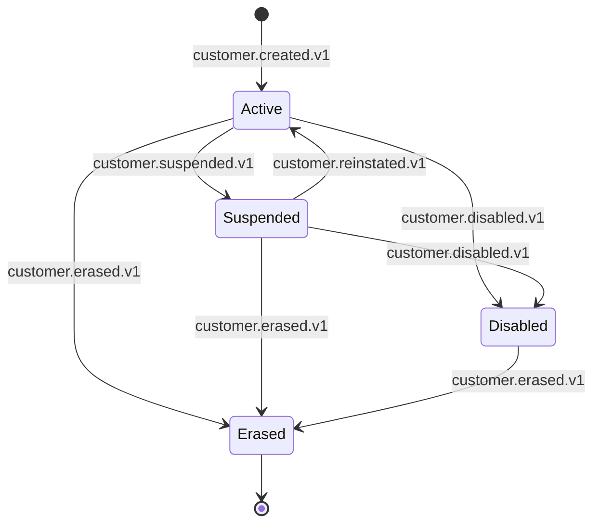

# customer-service — Software Requirements Specification

## 1. Introduction

This document specifies the software behavior, contracts,
and non-functional requirements of the `customer-service`.
The service is the platform's source of truth for the
customer aggregate — KYC, LTV, segment, default method /
address, and the customer state machine.

## 2. Scope

**In scope:**

- Customer profile (KYC, LTV, segment, default method,
  default address).
- Customer state machine (active, suspended, disabled,
  erased).
- KYC tier upgrade flow.
- LTV incremental update on payment events.
- Segment recomputation (nightly + on LTV change).
- GDPR right-to-erasure.
- Event emission (`customer.*.v1`,
  `customer.kyc.tier_changed.v1`,
  `customer.segment.changed.v1`).

**Out of scope:**

- Authentication (Keycloak via `identity-service`).
- Common user preferences (``customer-service` (cross-persona profile)`).
- Payment data (no PAN).
- Saved addresses (only a reference).
- Ride / order history.
- Reviews.
- Loyalty points.

## 3. System Context

```mermaid
flowchart LR
    IS[identity-service]
    PS[payment-service]
    AS["`customer-service` (addresses)]
    RPI["`payment-service` (ride saga)]
    FPI["`payment-service` (food saga)]
    KAFKA[(Kafka)]
    CSV[customer-service]
    DB[(PostgreSQL schema: customer)]
    REDIS[(Redis)]
    KYC[KYC provider]
    CFG[configuration-service]
    PROMO["`pricing-service` (promotion)]
    LOY["`pricing-service` (loyalty rules) / `customer-service` (account)]
    PRC[pricing-service]
    AUD[audit-service]
    ANA["`reporting-service` (data lake)]
    NOT[notification-service]
    ADM[admin-service]
    RRS["`trip-service` (ride-request)]
    FOS[food-order-service]
    CART["`food-order-service` (cart)]
    FRS[fraud-risk-service]

    IS -->|identity.*.v1| KAFKA
    KAFKA --> CSV
    PS -->|payment.method.saved.v1, payment.method.removed.v1| KAFKA
    KAFKA --> CSV
    RPI -->|ride.payment.completed.v1| KAFKA
    KAFKA --> CSV
    FPI -->|food.payment.completed.v1| KAFKA
    KAFKA --> CSV
    CFG -->|configuration.updated.v1| KAFKA
    KAFKA --> CSV
    CSV --> DB
    CSV --> REDIS
    CSV --> KYC
    CSV -->|customer.*.v1| KAFKA
    KAFKA --> PROMO
    KAFKA --> LOY
    KAFKA --> PRC
    KAFKA --> AUD
    KAFKA --> ANA
    KAFKA --> NOT
    KAFKA --> ADM
    KAFKA --> RRS
    KAFKA --> FOS
    KAFKA --> CART
    KAFKA --> FRS
    ADM --> CSV
```

## 4. Actors

- **Customer** (human) — manage profile, KYC, default
  method / address.
- **Internal admin / support** (human) — admin actions.
- **KYC provider** (system) — verifies documents.
- **Downstream services** (system) — read the customer
  for ride / order / checkout / payment decisions.

## 5. Functional Requirements

| ID | Requirement | Priority |
|----|-------------|----------|
| FR--001 | Provide `GET /v1/customers/{customer_id}` returning the customer. | MUST |
| FR--002 | Provide `POST /v1/customers` to create a customer (idempotent on `identity_id`). | MUST |
| FR--003 | Provide `PATCH /v1/customers/{customer_id}` to update profile fields. | MUST |
| FR--004 | Provide `GET /v1/customers/{customer_id}/kyc` returning the KYC tier. | MUST |
| FR--005 | Provide `POST /v1/customers/{customer_id}/kyc/upgrade` to request a KYC upgrade. | MUST |
| FR--006 | Provide `POST /v1/customers/{customer_id}/suspend` (admin) with reason. | MUST |
| FR--007 | Provide `POST /v1/customers/{customer_id}/reinstate` (admin). | MUST |
| FR--008 | Provide `POST /v1/customers/{customer_id}/disable` (admin, permanent). | MUST |
| FR--009 | Provide `POST /v1/customers/{customer_id}/erase` for GDPR. | MUST |
| FR--010 | Provide `PUT /v1/customers/{customer_id}/default-payment-method/{payment_method_id}`. | MUST |
| FR--011 | Provide `PUT /v1/customers/{customer_id}/default-address/{address_id}`. | SHOULD |
| FR--012 | Consume `identity.user.created.v1` to back-fill a customer. | MUST |
| FR--013 | Consume `identity.user.updated.v1` to refresh cached claims. | MUST |
| FR--014 | Consume `identity.user.suspended.v1` to mark the customer suspended. | MUST |
| FR--015 | Consume `identity.user.disabled.v1` to mark the customer disabled. | MUST |
| FR--016 | Consume `identity.user.reinstated.v1` to clear suspension. | MUST |
| FR--017 | Consume `identity.user.erased.v1` to GDPR-erasure. | MUST |
| FR--018 | Consume `payment.method.saved.v1` to set the default method. | MUST |
| FR--019 | Consume `payment.method.removed.v1` to clear the default method. | MUST |
| FR--020 | Consume `ride.payment.completed.v1` and `food.payment.completed.v1` to update LTV. | MUST |
| FR--021 | Recompute segment nightly and on LTV change. | MUST |
| FR--022 | Emit `customer.created.v1` on creation. | MUST |
| FR--023 | Emit `customer.updated.v1` on any change. | MUST |
| FR--024 | Emit `customer.suspended.v1` on suspension. | MUST |
| FR--025 | Emit `customer.disabled.v1` on disablement. | MUST |
| FR--026 | Emit `customer.reinstated.v1` on re-instatement. | MUST |
| FR--027 | Emit `customer.erased.v1` on GDPR erasure. | MUST |
| FR--028 | Emit `customer.segment.changed.v1` on segment change. | MUST |
| FR--029 | Emit `customer.kyc.tier_changed.v1` on KYC tier change. | MUST |
| FR--030 | All writes use the outbox pattern. | MUST |
| FR--031 | All non-idempotent POSTs require `Idempotency-Key`. | MUST |

## 6. Non-Functional Requirements

| ID | Category | Requirement | Target |
|----|----------|-------------|--------|
| NFR--001 | availability | monthly uptime | 99.95% |
| NFR--002 | performance | P99 read latency | ≤ 30 ms |
| NFR--003 | performance | P99 write latency | ≤ 500 ms |
| NFR--004 | scalability | concurrent reads per replica | ≥ 5,000 |
| NFR--005 | scalability | horizontal scale | 3 → 30 replicas per region |
| NFR--006 | maintainability | MTTR | ≤ 15 min median |
| NFR--007 | reliability | outbox publish lag P99 | ≤ 5 s |
| NFR--008 | reliability | LTV update lag P99 | ≤ 5 min |
| NFR--009 | reliability | event loss | 0 |
| NFR--010 | compliance | GDPR erasure SLA | 100% within 24 h expedited |

## 7. API Requirements

All endpoints follow `architecture/API_STANDARDS.md`.
Full contract in `INTEGRATION.md`.

## 8. Data Requirements

| ID | Requirement | Notes |
|----|-------------|-------|
| DATA--001 | The service MUST own the `customer` schema. | One writer. |
| DATA--002 | Primary keys MUST be UUIDv7. | Time-ordered. |
| DATA--003 | Cross-service IDs (`identity_id`, `payment_method_id`, `address_id`, `kyc_verification_id`) MUST be UUID columns WITHOUT database FKs. | Consistency strategy. |
| DATA--004 | PII columns (`name`, `email`, `phone`) MUST be column-level encrypted. | Envelope encryption. |
| DATA--005 | Audit columns MUST be present on every mutable table. | Standard. |
| DATA--006 | Soft delete (`deleted_at`) MUST be used for customers. | GDPR. |
| DATA--007 | LTV MUST be stored as `BIGINT` minor units with a `currency` column. | No floats. |
| DATA--008 | The `outbox` table MUST be present and used. | At-least-once. |
| DATA--009 | `customer_ltv_history` MUST be range-partitioned by month. | Volume. |

(Full schema in `ERD.md`.)

## 9. Validation Rules

- `kyc_tier` MUST be in `('tier_0', 'tier_1', 'tier_2',
  'tier_3')`.
- `segment` MUST be in `('standard', 'frequent', 'vip',
  'churned')`.
- `status` MUST be in `('active', 'suspended', 'disabled',
  'erased')`.
- A suspension reason MUST be in the allowed set
  (same as `identity-service`).
- The default payment method reference MUST be a valid
  `payment_method_id` (validated via `payment-service`
  on set).
- The default address reference MUST be a valid
  `address_id` (validated via ``customer-service` (addresses)` on
  set).

## 10. State Transitions



## 11. Authorization Requirements

- All endpoints require a JWT bearer token.
- Self-service endpoints require `X-User-Id ==
  customer_id`; otherwise 403 `FORBIDDEN`.
- Cross-customer reads (e.g. ride-request reading the
  customer for verification) require `customer.read.any`
  scope.
- Admin endpoints require `customer.admin` realm role
  on `platform-internal`.

## 12. Configuration Requirements

Listed in `README.md` 13.

## 13. Error Handling

| Condition | Response |
|-----------|----------|
| Unknown `customer_id` | 404 `NOT_FOUND` |
| Concurrent update | 409 `CONFLICT` |
| KYC tier upgrade with no documents | 422 `KYC_DOCUMENTS_REQUIRED` |
| KYC provider failure | 502 `DEPENDENCY_UPSTREAM_FAILURE` |
| Default method not owned by customer | 403 `FORBIDDEN` |
| GDPR erasure with active financial records | 200 with `warnings[]` |
| `Idempotency-Key` reused with different body | 422 `IDEMPOTENCY_KEY_REUSED` |

## 14. Concurrency Requirements

- The `customers` row has an optimistic-lock version
  (`row_version`).
- The outbox poller is single-writer per replica via a
  Postgres advisory lock.
- LTV updates are serialized by `customer_id` via a
  row-level lock on the `customers` row.

## 15. Idempotency Requirements

- All non-idempotent POSTs require `Idempotency-Key`.
- The service stores `(actor, idempotency_key,
  request_hash, response_status, response_body,
  expires_at)` for 24 h.

## 16. Performance

- **Dominant path**: customer read by `customer_id`
  (PK index hit) → return row. P99 ≤ 30 ms.
- Hot DB query: `SELECT * FROM customer.customers
  WHERE id = $1`.
- Cache: Redis claim hot-cache TTL 600 s.

## 17. Scalability

- **Horizontal**: stateless beyond PostgreSQL + Redis +
  Kafka.
- **Vertical**: 1 vCPU / 1 GiB default.
- **HPA**: CPU 60% target; custom metric
  `customer_lookups_per_second` (target 5k/replica).

## 18. Availability

- **SLO**: 99.95% per 30d.
- **Error budget**: ~22 min / 30d.
- **Maintenance window**: none planned; rolling deploys.

## 19. Security

| ID | Requirement | Notes |
|----|-------------|-------|
| SEC--001 | All endpoints require a JWT bearer token. | Self or service. |
| SEC--002 | Self-service endpoints enforce `X-User-Id == customer_id`. | Gateway-injected header. |
| SEC--003 | PII columns are column-level encrypted. | Envelope encryption. |
| SEC--004 | No PAN stored; only the tokenized `payment_method_id` reference. | PCI. |
| SEC--005 | No full address data stored; only the `address_id` reference. | Data minimization. |
| SEC--006 | KYC documents stored in `file-service`; this service holds only the `verification_id`. | Defense in depth. |
| SEC--007 | No PII is logged in production. | Defense in depth. |
| SEC--008 | GDPR erasure preserves `customer_id`. | Soft delete + tombstone. |
| SEC--009 | mTLS in cluster. | Network-layer identity. |

## 20. Privacy

- Stored PII: `name`, `email`, `phone` (cached claims).
- Encryption: column-level, per-tenant DEK.
- Retention: until erasure + 7 years for the
  `customer_id` tombstone; financial records retained
  per legal hold with PII redacted.
- Erasure: `POST /v1/customers/{id}/erase` anonymizes
  PII; `customer_id` preserved.
- Logs do not contain PII in production.

## 21. Auditability

- Every state change writes a row to
  `customer.customer_audit_log` (append-only) AND
  emits the corresponding `customer.*.v1` event.
- Retention 7 years.

## 22. Observability

- **Logs**: JSON to stdout; fields listed in
  `README.md` 15.
- **Metrics**: RED per endpoint + business metrics
  listed in `README.md` 15.
- **Traces**: OpenTelemetry. Sample 100% on errors,
  10% on success.
- **Alerts**: SLO burn-rate; LTV update lag; segment
  change rate; KYC tier distribution drift.

## 23. Maintainability

- **Code style**: Java 21 (Spotless + Checkstyle).
- **Test coverage**: ≥ 85% overall, 100% on
  KYC, LTV, segment, erasure paths.

## 24. Disaster Recovery

- **RPO**: ≤ 5 min (WAL streaming + 7-day PITR).
- **RTO**: ≤ 30 min (warm standby).

## 25. Acceptance Criteria

- An `identity.user.created.v1` event results in a
  `customer.customers` row within 5 seconds.
- A KYC tier upgrade request results in a
  `customer.kyc.tier_changed.v1` event after the
  provider's verification.
- A `payment.method.saved.v1` event with the
  customer's most-recent method results in the
  default method reference updated and
  `customer.updated.v1` emitted.
- A `ride.payment.completed.v1` or
  `food.payment.completed.v1` event results in LTV
  updated within 5 minutes.
- A suspension request results in
  `customer.suspended.v1` emitted; subsequent ride /
  order / cart / payment attempts by the customer
  are rejected by downstream services.
- A GDPR erasure request results in PII redaction
  and `customer.erased.v1` emitted.
- A `payment.method.removed.v1` event with the
  matching `payment_method_id` clears the default
  reference.
- The service is the only writer of the `customer`
  schema.

---

## See also

### Sibling docs for this service

- [`README.md`](./README.md) — purpose, bounded context, responsibilities
- [`BRD.md`](./BRD.md) — business requirements
- [`SRS.md`](./SRS.md) — functional + non-functional requirements
- [`ERD.md`](./ERD.md) — data model (entities, relationships)
- [`INTEGRATION.md`](./INTEGRATION.md) — inter-service contracts (APIs, events, sagas)
- [`WORKFLOWS.md`](./WORKFLOWS.md) — operational workflows (happy paths, failure modes)
- [`TECH.md`](./TECH.md) — technology profile (runtime, libraries, data layer, admin endpoints, RBAC)

### Platform-wide

- [`../../shared/README.md`](../../shared/README.md) — `platform-spring-boot-starter` shared library (the single source of cross-cutting code for all Spring Boot services in the platform)
- [`../RECOMMENDATIONS.md`](../RECOMMENDATIONS.md) — platform-wide technology map (language, framework, version baseline, admin/RBAC pattern)
- [`../../README.md`](../../README.md) — services overview (the catalog of all 20 services)
- [`../../../main.md`](../../../main.md) — top-level platform specification (architecture, Keycloak, PostgreSQL 18, messaging, observability baseline)

