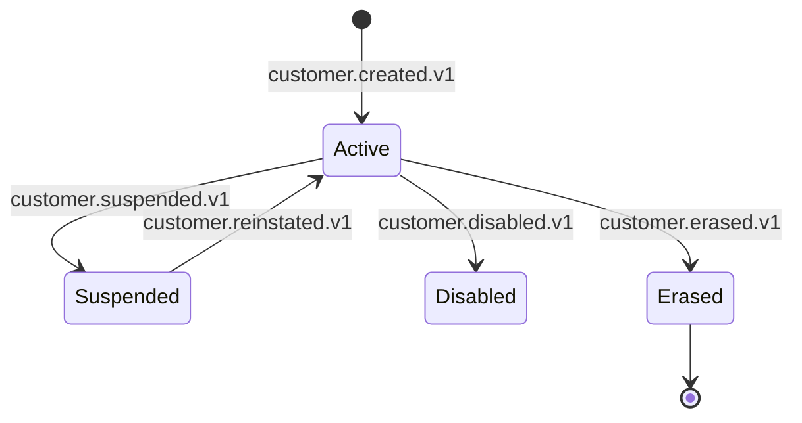

# customer-service — Workflows

## 1. Customer Onboarding (Happy Path)

### 1.1 Objective

When a new user is created in `identity-service`, ensure
a `customer.customers` row exists with `kyc_tier='tier_0'`
and the customer's basic claims, before any dependent
service (ride-request, food-order, cart, checkout)
references the new `customer_id`.

### 1.2 Initiating Actor

`identity-service` emits `identity.user.created.v1`.

### 1.3 Participating Services

- `identity-service` (producer).
- `customer-service` (this service; consumer).
- `audit-service`, `analytics-service`,
  `identity-service` (consumers of
  `customer.created.v1`).

### 1.4 Prerequisites

- `identity-service` has emitted
  `identity.user.created.v1`.
- The `customer` schema is migrated.

### 1.5 Happy Path

```mermaid
sequenceDiagram
    participant IS as identity-service
    participant T as Kafka (identity.user.created)
    participant CSV as customer-service
    participant ISV as identity-service (REST)
    participant DB as PostgreSQL (customer)
    participant OB as Outbox
    participant T2 as Kafka (customer.created)

    IS->>T: produce identity.user.created.v1
    T->>CSV: deliver
    CSV->>ISV: GET /v1/identities/{identity_id}
    ISV-->>CSV: { name, email, phone, ... }
    CSV->>DB: BEGIN; INSERT INTO customer.customers (identity_id, name, email, phone, kyc_tier='tier_0'); INSERT INTO outbox; COMMIT
    OB->>T2: produce customer.created.v1
```

### 1.6 Alternate Paths

- **Direct creation**: a persona service calls
  `POST /v1/customers` with the `identity_id`. The
  service creates the row, enriches with claims from
  `identity-service`, emits the event.

### 1.7 Failure Paths

- **`identity-service` unreachable on read**: the
  consumer retries 3 times with backoff; on failure,
  the message lands in the DLQ.
- **DB write fails**: the consumer retries; on
  failure, the message lands in the DLQ.
- **Outbox publish fails**: the poller retries.

### 1.8 Business Rules

- A new `customers` row MUST be created before any
  dependent service references the `customer_id`.
- `kyc_tier` defaults to `tier_0` (no payments
  allowed).

### 1.9 State Transitions



### 1.10 Events

| Event | Direction | When |
|-------|-----------|------|
| `customer.created.v1` | produced | on creation |
| `identity.user.created.v1` | consumed | to create the row |

### 1.11 APIs Involved

| API | Direction | When |
|-----|-----------|------|
| `GET /v1/identities/{id}` | outbound | on creation |
| Kafka publish | outbound (outbox) | on creation |

### 1.12 Compensation / Rollback

None. The row and the event are atomic.

### 1.13 Final State

- The `customers` row exists with `kyc_tier='tier_0'`.
- `customer.created.v1` is on the topic.
- The dependent services can now reference the
  `customer_id`.

## 2. KYC Tier Upgrade

### 2.1 Objective

A customer uploads KYC documents; the service sends
them to the KYC provider; on the provider's
verification, the tier is updated and
`customer.kyc.tier_changed.v1` is emitted.

### 2.2 Initiating Actor

A customer (or admin) calls
`POST /v1/customers/{customer_id}/kyc/upgrade` with
document file IDs and a target tier.

### 2.3 Participating Services

- `customer-service` (this service).
- KYC provider (external).
- `payment-service`, `ride-request-service`,
  `food-order-service`, `notification-service`
  (consumers of `customer.kyc.tier_changed.v1`).

### 2.4 Prerequisites

- The `customers` row exists.
- The customer has at least one document file
  uploaded to `file-service`.

### 2.5 Happy Path

```mermaid
sequenceDiagram
    participant C as Customer
    participant CSV as customer-service
    participant FS as file-service
    participant KYC as KYC provider
    participant DB as PostgreSQL (customer)
    participant OB as Outbox
    participant T as Kafka (customer.kyc.tier_changed)
    participant PAY as payment-service

    C->>FS: upload document
    FS-->>C: { file_id, virus_scan: "clean" }
    C->>CSV: POST /v1/customers/{id}/kyc/upgrade { document_file_ids, target_tier: "tier_3" }
    CSV->>KYC: POST /v1/verifications { customer_id, file_ids, target_tier }
    KYC-->>CSV: { verification_id, status: "processing" }
    CSV-->>C: 202 Accepted { verification_id }
    Note over KYC: async verification
    KYC-->>CSV: webhook: verification.completed { verification_id, status: "verified", tier: "tier_3" }
    CSV->>DB: BEGIN; UPDATE customers SET kyc_tier='tier_3', kyc_verification_id=..., kyc_verified_at=now(); INSERT INTO customer_kyc_history; INSERT INTO outbox; COMMIT
    OB->>T: produce customer.kyc.tier_changed.v1
    T->>PAY: consume -> update tier limit
```

### 2.6 Alternate Paths

- **Synchronous verification (small market)**: the
  KYC provider returns the tier immediately; the
  service returns 200 with the tier.
- **Admin override**: an admin sets the tier
  directly (bypassing the provider) with a reason;
  the same flow applies with `actor_type=admin`.

### 2.7 Failure Paths

- **No documents**: 422 `KYC_DOCUMENTS_REQUIRED`.
- **KYC provider unreachable**: 502
  `DEPENDENCY_UPSTREAM_FAILURE`; the customer is
  told to retry.
- **Provider rejects**: 422 with the provider's
  reason; the documents are flagged in
  `file-service`.

### 2.8 Business Rules

- A KYC tier upgrade requires a verified document
  from the provider (or admin override).
- The new tier MUST be greater than the current
  tier (no downgrades via this endpoint; downgrades
  are an admin action or automatic on document
  expiry).
- The new tier MUST be propagated to dependent
  services within 10 seconds (P99).

### 2.9 State Transitions

The `kyc_tier` field has no explicit state machine;
it's an enum. The `customers.status` state machine
is unaffected.

### 2.10 Events

| Event | Direction | When |
|-------|-----------|------|
| `customer.kyc.tier_changed.v1` | produced | on tier change |
| `customer.updated.v1` | produced | on tier change |

### 2.11 APIs Involved

| API | Direction | When |
|-----|-----------|------|
| `POST /v1/customers/{id}/kyc/upgrade` | inbound | per upgrade |
| KYC provider | outbound | per upgrade |
| Kafka publish | outbound (outbox) | per tier change |

### 2.12 Compensation / Rollback

A downgrade (admin action or automatic) emits
`customer.kyc.tier_changed.v1` with
`from_tier=tier_3, to_tier=tier_2`. There is no
compensation at the service level; the dependent
services update their limits accordingly.

### 2.13 Final State

- The `customers.kyc_tier` is the new tier.
- The `customer_kyc_history` has the change.
- `customer.kyc.tier_changed.v1` is on the topic.
- The dependent services have updated their limits.

## 3. Default Payment Method Change

### 3.1 Objective

When a customer saves a new payment method in
`payment-service`, the customer's default is updated
(if it's the most-recent or the customer has no
default). `customer.updated.v1` is emitted.

### 3.2 Initiating Actor

A customer adds a payment method in
`payment-service` (via the customer app's wallet
screen). `payment-service` emits
`payment.method.saved.v1`.

### 3.3 Participating Services

- `payment-service` (producer).
- `customer-service` (this service; consumer).
- `notification-service` (consumer of
  `customer.updated.v1`).

### 3.4 Prerequisites

- The `customers` row exists.
- The `payment_method_id` is owned by the
  `customer_id` (validated via `payment-service` on
  the original save).

### 3.5 Happy Path

```mermaid
sequenceDiagram
    participant C as Customer
    participant PS as payment-service
    participant T as Kafka (payment.method.saved)
    participant CSV as customer-service
    participant DB as PostgreSQL (customer)
    participant OB as Outbox
    participant T2 as Kafka (customer.updated)

    C->>PS: add payment method
    PS->>T: produce payment.method.saved.v1
    T->>CSV: deliver
    CSV->>DB: BEGIN; UPDATE customers SET default_payment_method_id=pm_id, row_version=row_version+1 WHERE id=customer_id AND (default_payment_method_id IS NULL OR pm_id=most_recent); INSERT INTO customer_audit_log; INSERT INTO outbox; COMMIT
    OB->>T2: produce customer.updated.v1
```

### 3.6 Alternate Paths

- **Customer sets default explicitly**: the customer
  calls
  `PUT /v1/customers/{id}/default-payment-method/{pm_id}`;
  the service validates ownership via
  `payment-service` and updates the row.
- **Payment method removed**: `payment-service`
  emits `payment.method.removed.v1`; the service
  clears the default if it matches.

### 3.7 Failure Paths

- **`payment-service` unreachable on validation**:
  the call retries; on failure, the default is not
  set. The customer is told to retry.

### 3.8 Business Rules

- A default payment method MUST be owned by the
  customer.
- The change MUST propagate to dependent services
  within 10 seconds (P99).

### 3.9 State Transitions

None (default_payment_method_id is a single value,
not a state machine).

### 3.10 Events

| Event | Direction | When |
|-------|-----------|------|
| `customer.updated.v1` | produced | on default change |
| `payment.method.saved.v1` | consumed | to update default |
| `payment.method.removed.v1` | consumed | to clear default |

### 3.11 APIs Involved

| API | Direction | When |
|-----|-----------|------|
| `PUT /v1/customers/{id}/default-payment-method/{pm_id}` | inbound | on explicit set |
| `GET /v1/payment-methods/{id}` | outbound | on validation |
| Kafka publish | outbound (outbox) | on change |

### 3.12 Compensation / Rollback

The customer can set a different default; a
`payment.method.removed.v1` clears it.

### 3.13 Final State

- The `customers.default_payment_method_id` is
  updated.
- `customer.updated.v1` is on the topic.
- The dependent services have the new default.

## 4. LTV Update on Payment

### 4.1 Objective

On `ride.payment.completed.v1` or
`food.payment.completed.v1`, increment the customer's
LTV by the payment amount. If the LTV change crosses
a segment threshold, recompute the segment and emit
`customer.segment.changed.v1`.

### 4.2 Initiating Actor

`ride-payment-integration-service` or
`food-payment-integration-service` emits
`*.payment.completed.v1` on successful payment.

### 4.3 Participating Services

- `ride-payment-integration-service` /
  `food-payment-integration-service` (producer).
- `customer-service` (this service; consumer).
- `promotion-service`, `loyalty-service`,
  `pricing-service`, `notification-service`
  (consumers of `customer.segment.changed.v1`).

### 4.4 Prerequisites

- The `customers` row exists.
- The `customer_id` in the event is valid.

### 4.5 Happy Path

```mermaid
sequenceDiagram
    participant RPI as ride-payment-integration-service
    participant T as Kafka (ride.payment.completed)
    participant CSV as customer-service
    participant DB as PostgreSQL (customer)
    participant OB as Outbox
    participant T2 as Kafka (customer.updated)
    participant T3 as Kafka (customer.segment.changed)

    RPI->>T: produce ride.payment.completed.v1 (customer_id, amount_minor, currency)
    T->>CSV: deliver
    CSV->>DB: BEGIN; SELECT FOR UPDATE customers WHERE id=customer_id; UPDATE customers SET ltv_minor=ltv_minor+amount_minor, ltv_updated_at=now(); INSERT INTO customer_ltv_history; (recompute segment); INSERT INTO outbox (customer.updated.v1, customer.segment.changed.v1 if changed); COMMIT
    OB->>T2: produce customer.updated.v1
    OB->>T3: produce customer.segment.changed.v1 (if changed)
```

### 4.6 Alternate Paths

- **Refund / chargeback**: the saga emits a
  `*.payment.refund.completed.v1`; the service
  decrements LTV by the refund amount.
- **Adjustment (admin)**: an admin issues a manual
  LTV adjustment via
  `POST /v1/customers/{id}/ltv-adjustments`; the
  service applies the delta and emits the event.

### 4.7 Failure Paths

- **DB write fails**: the consumer retries; on
  failure, the message lands in the DLQ. The
  reconciliation job in `reporting-service` detects
  drift and re-emits (idempotent).
- **Currency mismatch**: 422 with
  `code: "CURRENCY_MISMATCH"`; the LTV is
  single-currency per customer (set at creation;
  no FX conversion).

### 4.8 Business Rules

- LTV is `BIGINT` minor units, single-currency per
  customer.
- LTV MUST be updated within 5 minutes (P99) of the
  payment event.
- A segment change MUST be propagated within 10
  seconds (P99).

### 4.9 State Transitions

The `segment` field is a single value; no explicit
state machine. The `customers.status` state machine
is unaffected.

### 4.10 Events

| Event | Direction | When |
|-------|-----------|------|
| `customer.updated.v1` | produced | on LTV change |
| `customer.segment.changed.v1` | produced | if segment changed |
| `ride.payment.completed.v1` | consumed | to update LTV |
| `food.payment.completed.v1` | consumed | to update LTV |

### 4.11 APIs Involved

| API | Direction | When |
|-----|-----------|------|
| Kafka publish | outbound (outbox) | on LTV change |

### 4.12 Compensation / Rollback

A refund decrements LTV; a manual adjustment can
correct a miscalculation. There is no compensation
at the service level beyond these.

### 4.13 Final State

- The `customers.ltv_minor` is updated.
- The `customer_ltv_history` has the delta.
- `customer.updated.v1` is on the topic.
- If the segment changed, `customer.segment.changed.v1`
  is on the topic.

## 5. Segment Change (Nightly Recomputation)

### 5.1 Objective

Recompute the segment for every active customer every
night. Also recompute on LTV change (in the same
transaction). Emit `customer.segment.changed.v1` if
the segment changed.

### 5.2 Initiating Actor

A nightly job (cron in the service) iterates active
customers and recomputes the segment.

### 5.3 Participating Services

- `customer-service` (this service).
- `promotion-service`, `loyalty-service`,
  `pricing-service`, `notification-service`
  (consumers).

### 5.4 Prerequisites

- The `customers` table has the rides_this_month,
  ltv_minor, and last_active_at columns populated.

### 5.5 Happy Path

```mermaid
sequenceDiagram
    participant JOB as Nightly job
    participant DB as PostgreSQL (customer)
    participant OB as Outbox
    participant T as Kafka (customer.segment.changed)
    participant PROMO as promotion-service

    JOB->>DB: SELECT id, segment, rides_this_month, ltv_minor, last_active_at FROM customers WHERE status='active' AND deleted_at IS NULL
    loop for each customer
        JOB->>JOB: compute new segment from rules
        alt new_segment != current_segment
            JOB->>DB: BEGIN; UPDATE customers SET segment=new_segment; INSERT INTO customer_segment_history; INSERT INTO outbox; COMMIT
            OB->>T: produce customer.segment.changed.v1
            T->>PROMO: consume -> update segment-aware promotions
        end
    end
```

### 5.6 Alternate Paths

- **LTV-change-triggered recompute**: same logic,
  inlined in the LTV update transaction.

### 5.7 Failure Paths

- **DB write fails**: the job logs and retries on the
  next nightly run; drift is bounded.
- **Outbox publish fails**: the poller retries.

### 5.8 Business Rules

- Segment transitions are deterministic from
  `(rides_this_month, ltv_minor, last_active_at)`.
- A segment change MUST be propagated within 10
  seconds (P99) of the trigger.

### 5.9 State Transitions

None (segment is a single value).

### 5.10 Events

| Event | Direction | When |
|-------|-----------|------|
| `customer.segment.changed.v1` | produced | on segment change |

### 5.11 APIs Involved

None (internal job).

### 5.12 Compensation / Rollback

None. The next nightly run corrects any miscalculation.

### 5.13 Final State

- The `customers.segment` is the new segment.
- The `customer_segment_history` has the change.
- `customer.segment.changed.v1` is on the topic.

## 6. Suspension of a Customer

### 6.1 Objective

Suspend a customer (admin action); block them from
ride / order / cart / payment actions; propagate
`customer.suspended.v1` to every dependent service
within 10 seconds (P99).

### 6.2 Initiating Actor

`admin-service` calls
`POST /v1/customers/{customer_id}/suspend` on behalf
of an admin, fraud-reviewer, or automated
payment-failure handler.

### 6.3 Participating Services

- `admin-service` (caller).
- `customer-service` (this service).
- Kafka (`customer.suspended.v1`).
- `ride-request-service`, `food-order-service`,
  `cart-service`, `payment-service`,
  `notification-service`, `fraud-risk-service`,
  `audit-service` (consumers).

### 6.4 Prerequisites

- The `customers` row exists.
- The admin has the `customer.admin` realm role.

### 6.5 Happy Path

```mermaid
sequenceDiagram
    participant ADM as admin-service
    participant CSV as customer-service
    participant DB as PostgreSQL (customer)
    participant OB as Outbox
    participant T as Kafka (customer.suspended)
    participant RRS as ride-request-service
    participant FOS as food-order-service
    participant CART as cart-service
    participant PAY as payment-service
    participant NOT as notification-service

    ADM->>CSV: POST /v1/customers/{id}/suspend { reason: "fraud" }
    CSV->>DB: BEGIN; UPDATE customers SET status='suspended', suspended_reason=..., suspended_at=now(), suspended_by=actor; INSERT INTO customer_audit_log; INSERT INTO outbox; COMMIT
    CSV-->>ADM: 200 OK
    OB->>T: produce customer.suspended.v1
    T->>RRS: consume -> block ride requests
    T->>FOS: consume -> block food orders
    T->>CART: consume -> disable cart
    T->>PAY: consume -> block payments
    T->>NOT: consume -> notify customer
```

### 6.6 Alternate Paths

- **Payment-failure auto-suspend**: the
  `payment-service` saga detects repeated payment
  failure and calls with
  `reason: "payment_failure"` and
  `actor_type: "service"`.
- **Fraud auto-suspend**: `fraud-risk-service`
  detects a high-risk pattern and calls with
  `reason: "fraud"`.

### 6.7 Failure Paths

- **DB write fails**: the action is not performed;
  the admin retries.
- **Outbox publish fails**: the poller retries; the
  event is eventually emitted. The propagation lag
  may exceed 10 s during the failure window.

### 6.8 Business Rules

- A suspension reason MUST be in the allowed set.
- A customer already suspended with a different
  reason cannot be suspended again (409 CONFLICT).
- The suspension MUST be propagated to dependent
  services within 10 s (P99).

### 6.9 State Transitions

As in §1.9.

### 6.10 Events

| Event | Direction | When |
|-------|-----------|------|
| `customer.suspended.v1` | produced | on suspension |
| `customer.reinstated.v1` | produced | on re-instatement |
| `customer.disabled.v1` | produced | on disablement |

### 6.11 APIs Involved

| API | Direction | When |
|-----|-----------|------|
| `POST /v1/customers/{id}/suspend` | inbound | per suspension |
| Kafka publish | outbound (outbox) | per suspension |

### 6.12 Compensation / Rollback

A re-instatement (`POST /v1/customers/{id}/reinstate`)
reverts the action; `customer.reinstated.v1` is
emitted; the dependent services clear the
suspension flag.

### 6.13 Final State

- The `customers.status` is `suspended`.
- The `customer_audit_log` has the suspension
  entry.
- `customer.suspended.v1` is on the topic.
- The dependent services have marked the customer
  as suspended.

## 7. GDPR Right-to-Erasure

### 7.1 Objective

Anonymize the `customers` row and the cached claims;
emit `customer.erased.v1`; preserve the
`customer_id` and `identity_id` for referential
integrity (financial records in
`ledger-service` and `payment-service` retain the
`customer_id` reference but their PII fields are
redacted by the owning service).

### 7.2 Initiating Actor

`admin-service` calls
`POST /v1/customers/{customer_id}/erase` on behalf
of a compliance officer or a user self-service
flow.

### 7.3 Participating Services

- `admin-service` (caller).
- `customer-service` (this service).
- Kafka (`customer.erased.v1`).
- `audit-service`, `analytics-service`, every
  service that owns a profile (consumers).

### 7.4 Prerequisites

- The `customers` row exists.
- The compliance officer has `customer.admin` or
  `super_admin` realm role.

### 7.5 Happy Path

```mermaid
sequenceDiagram
    participant ADM as admin-service
    participant CSV as customer-service
    participant DB as PostgreSQL (customer)
    participant OB as Outbox
    participant T as Kafka (customer.erased)
    participant AUD as audit-service
    participant LD as ledger-service
    participant PAY as payment-service

    ADM->>CSV: POST /v1/customers/{id}/erase { legal_basis: "user_request" }
    CSV->>DB: BEGIN; UPDATE customers SET name='REDACTED', email='REDACTED', phone='REDACTED', kyc_document_file_ids='{}', default_payment_method_id=NULL, default_address_id=NULL, status='erased', erased_at=now(), deleted_at=now(); INSERT INTO customer_audit_log; INSERT INTO outbox; COMMIT
    CSV-->>ADM: 200 OK { status: "erased", warnings: [] }
    OB->>T: produce customer.erased.v1
    T->>AUD: consume
    T->>LD: consume -> ledger retains customer_id, redacts PII
    T->>PAY: consume -> payment retains customer_id, redacts PII
```

### 7.6 Alternate Paths

- **Erasure with active financial records**: the
  service performs the erasure but populates
  `warnings[]` in the response (e.g.
  "active_ledger_entries: 12"). The owning services
  retain the `customer_id` reference but redact
  PII.

### 7.7 Failure Paths

- **DB write fails**: the action is not performed;
  the admin retries.
- **Outbox publish fails**: the poller retries; the
  event is eventually emitted. The dependent
  services eventually anonymize their PII; the
  reconciliation job in `reporting-service`
  detects any drift and re-emits the erasure
  (idempotent).

### 7.8 Business Rules

- The `customer_id` and `identity_id` are
  preserved.
- All PII columns are set to `REDACTED` / NULL.
- The `status` is set to `erased`.
- The `deleted_at` is set; the row is a tombstone.
- `customer.erased.v1` is emitted exactly once
  (idempotency on `Idempotency-Key`).
- The audit log retains the erasure entry
  indefinitely (legal hold).

### 7.9 State Transitions

```mermaid
stateDiagram-v2
    [*] --> Active
    Active --> Erased: POST /erase
    Suspended --> Erased: POST /erase
    Disabled --> Erased: POST /erase
    Erased --> [*]
    Erased -.->|re-activation NOT allowed| Erased
```

### 7.10 Events

| Event | Direction | When |
|-------|-----------|------|
| `customer.erased.v1` | produced | on erasure |

### 7.11 APIs Involved

| API | Direction | When |
|-----|-----------|------|
| `POST /v1/customers/{id}/erase` | inbound | per erasure |
| Kafka publish | outbound (outbox) | per erasure |

### 7.12 Compensation / Rollback

None. Erasure is irreversible.

### 7.13 Final State

- The `customers` row is a tombstone with PII
  redacted.
- `customer.erased.v1` is on the topic.
- The dependent services have anonymized their PII
  but retain the `customer_id` reference.
- The audit log has the erasure entry.

---

## See also

### Sibling docs for this service

- [`README.md`](./README.md) — purpose, bounded context, responsibilities
- [`BRD.md`](./BRD.md) — business requirements
- [`SRS.md`](./SRS.md) — functional + non-functional requirements
- [`ERD.md`](./ERD.md) — data model (entities, relationships)
- [`INTEGRATION.md`](./INTEGRATION.md) — inter-service contracts (APIs, events, sagas)
- [`WORKFLOWS.md`](./WORKFLOWS.md) — operational workflows (happy paths, failure modes)
- [`TECH.md`](./TECH.md) — technology profile (runtime, libraries, data layer, admin endpoints, RBAC)

### Platform-wide

- [`../../shared/README.md`](../../shared/README.md) — `platform-spring-boot-starter` shared library (the single source of cross-cutting code for all Spring Boot services in the platform)
- [`../RECOMMENDATIONS.md`](../RECOMMENDATIONS.md) — platform-wide technology map (language, framework, version baseline, admin/RBAC pattern)
- [`../../README.md`](../../README.md) — services overview (the catalog of all 58 services)
- [`../../../main.md`](../../../main.md) — top-level platform specification (architecture, Keycloak, PostgreSQL 18, messaging, observability baseline)

