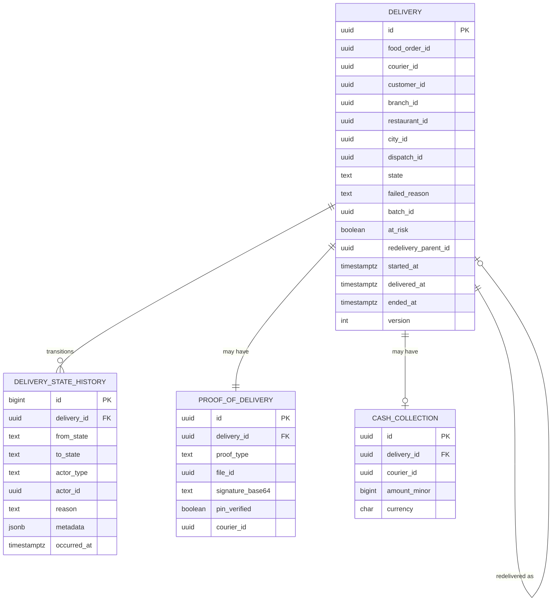

# delivery-service — Entity-Relationship Diagram

## 1. Database

- Engine: PostgreSQL 18.
- Schema: `delivery` (owned exclusively by this service).
- Migrations: `services/delivery-service/migrations/` — versioned,
  forward-only.

## 2. Cross-Service References

| Column | Type | Refers to | Source of truth |
|--------|------|-----------|------------------|
| `food_order_id` | UUID | `FoodOrder` in `food-order-service` | `food-order-service` |
| `courier_id` | UUID | `Courier` in `courier-service` | `courier-service` |
| `customer_id` | UUID | `Customer` in `customer-service` | `customer-service` |
| `branch_id` | UUID | `Branch` in `branch-service` | `branch-service` |
| `restaurant_id` | UUID | `Restaurant` in `restaurant-service` | `restaurant-service` |
| `city_id` | UUID | `City` in `zone-service` | `zone-service` |
| `dispatch_id` | UUID | `Dispatch` in `courier-dispatch-service` | `courier-dispatch-service` |
| `proof_file_id` | UUID | `File` in `file-service` | `file-service` |
| `correlation_id` | UUID | request scope | gateway |

All cross-service references are stored as UUID columns **without**
database-level foreign keys. See
[`architecture/CONSISTENCY_STRATEGY.md`](../../architecture/CONSISTENCY_STRATEGY.md).

## 3. Entities

### `Delivery`

The top-level entity. One row per `delivery_id`.

#### Columns

| Column | Type | Constraints | Notes |
|--------|------|-------------|-------|
| `id` | UUID | PK | UUIDv7 |
| `food_order_id` | UUID | NOT NULL | |
| `courier_id` | UUID | NULL | null only in `unassigned` |
| `customer_id` | UUID | NOT NULL | |
| `branch_id` | UUID | NOT NULL | |
| `restaurant_id` | UUID | NOT NULL | |
| `city_id` | UUID | NOT NULL | |
| `dispatch_id` | UUID | NOT NULL | |
| `state` | TEXT | NOT NULL CHECK in (`assigned`,`en_route_pickup`,`arrived_pickup`,`picked_up`,`en_route_dropoff`,`delivered`,`failed`,`cancelled`,`unassigned`) | state machine |
| `failed_reason` | TEXT | NULL CHECK in (`customer_unreachable`,`unreachable_timeout`,`restaurant_closed`,`redelivered`,`courier_cancelled`,`force_fail`,`other`) | only when state in (`failed`,`cancelled`) |
| `batch_id` | UUID | NULL | shared with sibling deliveries |
| `at_risk` | BOOLEAN | NOT NULL DEFAULT false | true on `customer.suspended` |
| `redelivery_parent_id` | UUID | NULL REFERENCES delivery(id) | self-FK only within schema |
| `pickup_lat` | NUMERIC(9,6) | NOT NULL | denormalised |
| `pickup_lng` | NUMERIC(9,6) | NOT NULL | |
| `pickup_address` | TEXT | NOT NULL | denormalised (one-line) |
| `dropoff_lat` | NUMERIC(9,6) | NOT NULL | |
| `dropoff_lng` | NUMERIC(9,6) | NOT NULL | |
| `dropoff_address` | TEXT | NOT NULL | |
| `last_known_lat` | NUMERIC(9,6) | NULL | courier's last point |
| `last_known_lng` | NUMERIC(9,6) | NULL | |
| `last_known_at` | TIMESTAMPTZ | NULL | |
| `eta_seconds` | INT | NULL | recomputed on each location ping |
| `unreachable_started_at` | TIMESTAMPTZ | NULL | when the 5-min timer started |
| `unreachable_resolved_at` | TIMESTAMPTZ | NULL | when the timer was cleared |
| `cod_amount_minor` | BIGINT | NULL | only when COD applies |
| `cod_currency` | CHAR(3) | NULL | ISO 4217 |
| `cod_collected_at` | TIMESTAMPTZ | NULL | |
| `started_at` | TIMESTAMPTZ | NOT NULL DEFAULT now() | when first created |
| `delivered_at` | TIMESTAMPTZ | NULL | when terminal `delivered` |
| `ended_at` | TIMESTAMPTZ | NULL | when any terminal state |
| `correlation_id` | UUID | NOT NULL | from upstream event |
| `created_at` | TIMESTAMPTZ | NOT NULL DEFAULT now() | |
| `updated_at` | TIMESTAMPTZ | NOT NULL DEFAULT now() | |
| `created_by` | UUID | NOT NULL | |
| `updated_by` | UUID | NOT NULL | |
| `version` | INT | NOT NULL DEFAULT 1 | optimistic concurrency |

#### Indexes

- PK on `id`.
- Unique on `dispatch_id` (one delivery per dispatch; redelivery
  creates a new row, not an update).
- Unique on `food_order_id` (one active delivery per order; a new
  row is inserted for redelivery, and the old row is closed).
- Index on `(courier_id, state)` for "active deliveries per courier".
- Index on `(state, ended_at)` partial WHERE `state IN ('assigned',
  'en_route_pickup', 'arrived_pickup', 'picked_up', 'en_route_dropoff')`
  for "in-flight" queries.
- Index on `city_id, state` for city dashboards.

#### Constraints

- CHECK `state IN (...)` as above.
- CHECK `failed_reason IN (...)` as above.
- CHECK `(state = 'failed' OR state = 'cancelled') = (failed_reason IS NOT NULL)`.
- CHECK `(cod_amount_minor IS NULL) = (cod_currency IS NULL)`.
- CHECK `version > 0`.

### `DeliveryStateHistory`

Append-only audit table. One row per state transition. Partitioned
by week for retention.

#### Columns

| Column | Type | Constraints | Notes |
|--------|------|-------------|-------|
| `id` | BIGSERIAL | PK | |
| `delivery_id` | UUID | NOT NULL | FK within schema |
| `from_state` | TEXT | NULL | null for the initial `assigned` |
| `to_state` | TEXT | NOT NULL | |
| `actor_type` | TEXT | NOT NULL CHECK in (`courier`,`admin`,`system`) | |
| `actor_id` | UUID | NULL | courier or admin id |
| `reason` | TEXT | NULL | human-readable |
| `metadata` | JSONB | NOT NULL DEFAULT '{}' | e.g. `{"lat": 52.37}` |
| `occurred_at` | TIMESTAMPTZ | NOT NULL | |
| `correlation_id` | UUID | NOT NULL | |
| `created_at` | TIMESTAMPTZ | NOT NULL DEFAULT now() | |

#### Indexes

- PK on `id`.
- Index on `delivery_id, occurred_at` for the "history" view.
- Index on `actor_id, occurred_at` for actor audit queries.

### `ProofOfDelivery`

One row per completed delivery. The `file_id` references the
photo/signature in `file-service`. The PIN is never stored; only
the `pin_verified=true` boolean.

#### Columns

| Column | Type | Constraints | Notes |
|--------|------|-------------|-------|
| `id` | UUID | PK | UUIDv7 |
| `delivery_id` | UUID | UNIQUE NOT NULL | one per delivery |
| `proof_type` | TEXT | NOT NULL CHECK in (`photo`,`signature`,`pin`) | |
| `file_id` | UUID | NULL | for photo; FK to `file-service` (no DB FK) |
| `signature_base64` | TEXT | NULL | for signature; ≤ 32 KB |
| `pin_verified` | BOOLEAN | NOT NULL DEFAULT false | for PIN |
| `courier_id` | UUID | NOT NULL | the courier at completion |
| `submitted_at` | TIMESTAMPTZ | NOT NULL DEFAULT now() | |
| `correlation_id` | UUID | NOT NULL | |
| `created_at` | TIMESTAMPTZ | NOT NULL DEFAULT now() | |

#### Constraints

- CHECK `(proof_type = 'photo' AND file_id IS NOT NULL)
       OR (proof_type = 'signature' AND signature_base64 IS NOT NULL)
       OR (proof_type = 'pin' AND pin_verified = true)`.

### `CashCollection`

One row per COD collection. The financial saga consumes
`cash.collected.v1`; this table is the local record.

#### Columns

| Column | Type | Constraints | Notes |
|--------|------|-------------|-------|
| `id` | UUID | PK | UUIDv7 |
| `delivery_id` | UUID | UNIQUE NOT NULL | one per delivery |
| `courier_id` | UUID | NOT NULL | who collected |
| `amount_minor` | BIGINT | NOT NULL | positive |
| `currency` | CHAR(3) | NOT NULL | ISO 4217 |
| `collected_at` | TIMESTAMPTZ | NOT NULL | |
| `correlation_id` | UUID | NOT NULL | |
| `created_at` | TIMESTAMPTZ | NOT NULL DEFAULT now() | |

#### Constraints

- CHECK `amount_minor > 0`.

### `Outbox` / `Inbox`

Standard platform outbox/inbox for transactional event publishing
and consumer dedup. See
[`EVENT_ARCHITECTURE.md`](../../architecture/EVENT_ARCHITECTURE.md).

## 4. Mermaid ER Diagram



## 5. DDL Sketch

```sql
CREATE SCHEMA IF NOT EXISTS delivery;

CREATE TABLE delivery.deliveries (
    id UUID PRIMARY KEY,
    food_order_id UUID NOT NULL,
    courier_id UUID,
    customer_id UUID NOT NULL,
    branch_id UUID NOT NULL,
    restaurant_id UUID NOT NULL,
    city_id UUID NOT NULL,
    dispatch_id UUID NOT NULL,
    state TEXT NOT NULL,
    failed_reason TEXT,
    batch_id UUID,
    at_risk BOOLEAN NOT NULL DEFAULT false,
    redelivery_parent_id UUID REFERENCES delivery.deliveries(id),
    pickup_lat NUMERIC(9,6) NOT NULL,
    pickup_lng NUMERIC(9,6) NOT NULL,
    pickup_address TEXT NOT NULL,
    dropoff_lat NUMERIC(9,6) NOT NULL,
    dropoff_lng NUMERIC(9,6) NOT NULL,
    dropoff_address TEXT NOT NULL,
    last_known_lat NUMERIC(9,6),
    last_known_lng NUMERIC(9,6),
    last_known_at TIMESTAMPTZ,
    eta_seconds INT,
    unreachable_started_at TIMESTAMPTZ,
    unreachable_resolved_at TIMESTAMPTZ,
    cod_amount_minor BIGINT,
    cod_currency CHAR(3),
    cod_collected_at TIMESTAMPTZ,
    started_at TIMESTAMPTZ NOT NULL DEFAULT now(),
    delivered_at TIMESTAMPTZ,
    ended_at TIMESTAMPTZ,
    correlation_id UUID NOT NULL,
    created_at TIMESTAMPTZ NOT NULL DEFAULT now(),
    updated_at TIMESTAMPTZ NOT NULL DEFAULT now(),
    created_by UUID NOT NULL,
    updated_by UUID NOT NULL,
    version INT NOT NULL DEFAULT 1,
    CONSTRAINT deliveries_state_chk CHECK (state IN
        ('assigned','en_route_pickup','arrived_pickup','picked_up',
         'en_route_dropoff','delivered','failed','cancelled','unassigned')),
    CONSTRAINT deliveries_failed_reason_chk CHECK (failed_reason IN
        ('customer_unreachable','unreachable_timeout','restaurant_closed',
         'redelivered','courier_cancelled','force_fail','other')),
    CONSTRAINT deliveries_reason_state_chk
        CHECK ((state IN ('failed','cancelled')) = (failed_reason IS NOT NULL)),
    CONSTRAINT deliveries_cod_pair_chk
        CHECK ((cod_amount_minor IS NULL) = (cod_currency IS NULL)),
    CONSTRAINT deliveries_version_chk CHECK (version > 0)
);

CREATE UNIQUE INDEX deliveries_dispatch_uq
    ON delivery.deliveries (dispatch_id);
CREATE UNIQUE INDEX deliveries_order_uq
    ON delivery.deliveries (food_order_id);
CREATE INDEX deliveries_courier_state_ix
    ON delivery.deliveries (courier_id, state);
CREATE INDEX deliveries_inflight_ix
    ON delivery.deliveries (state, ended_at)
    WHERE state IN ('assigned','en_route_pickup','arrived_pickup',
                    'picked_up','en_route_dropoff');
CREATE INDEX deliveries_city_state_ix
    ON delivery.deliveries (city_id, state);

CREATE TABLE delivery.delivery_state_history (
    id BIGSERIAL PRIMARY KEY,
    delivery_id UUID NOT NULL REFERENCES delivery.deliveries(id),
    from_state TEXT,
    to_state TEXT NOT NULL,
    actor_type TEXT NOT NULL CHECK (actor_type IN ('courier','admin','system')),
    actor_id UUID,
    reason TEXT,
    metadata JSONB NOT NULL DEFAULT '{}',
    occurred_at TIMESTAMPTZ NOT NULL,
    correlation_id UUID NOT NULL,
    created_at TIMESTAMPTZ NOT NULL DEFAULT now()
) PARTITION BY RANGE (occurred_at);

-- Idempotent pre-creation; safe to rerun as part of the maintenance job.
CREATE TABLE IF NOT EXISTS delivery.delivery_state_history_2026_w31
    PARTITION OF delivery.delivery_state_history
    FOR VALUES FROM ('2026-07-27 00:00:00+00') TO ('2026-08-03 00:00:00+00');

CREATE INDEX delhist_delivery_ix
    ON delivery.delivery_state_history (delivery_id, occurred_at);
CREATE INDEX delhist_actor_ix
    ON delivery.delivery_state_history (actor_id, occurred_at);

CREATE TABLE delivery.proof_of_delivery (
    id UUID PRIMARY KEY,
    delivery_id UUID UNIQUE NOT NULL REFERENCES delivery.deliveries(id),
    proof_type TEXT NOT NULL CHECK (proof_type IN ('photo','signature','pin')),
    file_id UUID,
    signature_base64 TEXT,
    pin_verified BOOLEAN NOT NULL DEFAULT false,
    courier_id UUID NOT NULL,
    submitted_at TIMESTAMPTZ NOT NULL DEFAULT now(),
    correlation_id UUID NOT NULL,
    created_at TIMESTAMPTZ NOT NULL DEFAULT now(),
    CONSTRAINT proof_shape_chk CHECK (
        (proof_type = 'photo'    AND file_id IS NOT NULL) OR
        (proof_type = 'signature' AND signature_base64 IS NOT NULL) OR
        (proof_type = 'pin'      AND pin_verified = true)
    )
);

CREATE TABLE delivery.cash_collections (
    id UUID PRIMARY KEY,
    delivery_id UUID UNIQUE NOT NULL REFERENCES delivery.deliveries(id),
    courier_id UUID NOT NULL,
    amount_minor BIGINT NOT NULL,
    currency CHAR(3) NOT NULL,
    collected_at TIMESTAMPTZ NOT NULL,
    correlation_id UUID NOT NULL,
    created_at TIMESTAMPTZ NOT NULL DEFAULT now(),
    CONSTRAINT cash_amount_chk CHECK (amount_minor > 0)
);

CREATE TABLE delivery.outbox (
    id BIGSERIAL PRIMARY KEY,
    event_id UUID UNIQUE NOT NULL,
    topic TEXT NOT NULL,
    partition_key UUID NOT NULL,
    payload JSONB NOT NULL,
    created_at TIMESTAMPTZ NOT NULL DEFAULT now(),
    claimed_at TIMESTAMPTZ,
    published_at TIMESTAMPTZ
);

CREATE TABLE delivery.inbox (
    event_id UUID PRIMARY KEY,
    topic TEXT NOT NULL,
    received_at TIMESTAMPTZ NOT NULL DEFAULT now(),
    processed_at TIMESTAMPTZ,
    error TEXT
);
```

## 6. Audit Columns

Every mutable table has `created_at`, `updated_at`, `created_by`,
`updated_by`. The `delivery_state_history` table is append-only; its
`created_at` is set once.

## 7. Soft Delete

Not used. Terminal states are recorded in `state`; rows are never
deleted during the operational window. A nightly batch hard-deletes
deliveries older than 3 years (and their history partitions).

## 8. JSONB Usage

- `delivery_state_history.metadata` — small per-transition payload
  (lat/lng, proof type, etc.). Bounded to < 1 KB.
- `outbox.payload` — event envelope.

## 9. Partitioning

- `delivery_state_history` is range-partitioned by week on
  `occurred_at`.
- Pre-create partitions for the next 8 weeks via a maintenance job.
- Drop partitions older than 3 years.

## 10. Data Retention

| Table | Retention | Purged by |
|-------|-----------|-----------|
| `deliveries` | 3 years (operational + audit) | nightly batch |
| `delivery_state_history` | 3 years (audit) | partition drop |
| `proof_of_delivery` | 3 years (audit + dispute) | nightly batch |
| `cash_collections` | 7 years (financial) | nightly batch |
| `outbox` | 24h after `published_at` | poller |
| `inbox` | 30 days (TTL) | nightly batch |

## 11. Migration Considerations

- All migrations are forward-only.
- Adding a new `state` value requires a CHECK constraint update AND
  a code change to the state machine.
- Adding a new `proof_type` requires a CHECK constraint update AND
  proof validation in the `complete` handler.
- Pre-creating weekly history partitions must be added to the
  platform's partition-maintenance job.
- Migrations run as a separate migration user; the application role
  has DML only.

---

## See also

### Sibling docs for this service

- [`README.md`](./README.md) — purpose, bounded context, responsibilities
- [`BRD.md`](./BRD.md) — business requirements
- [`SRS.md`](./SRS.md) — functional + non-functional requirements
- [`ERD.md`](./ERD.md) — data model (entities, relationships)
- [`INTEGRATION.md`](./INTEGRATION.md) — inter-service contracts (APIs, events, sagas)
- [`WORKFLOWS.md`](./WORKFLOWS.md) — operational workflows (happy paths, failure modes)
- [`TECH.md`](./TECH.md) — technology profile (runtime, libraries, data layer, admin endpoints, RBAC)

### Platform-wide

- [`../../shared/README.md`](../../shared/README.md) — `platform-spring-boot-starter` shared library (the single source of cross-cutting code for all Spring Boot services in the platform)
- [`../RECOMMENDATIONS.md`](../RECOMMENDATIONS.md) — platform-wide technology map (language, framework, version baseline, admin/RBAC pattern)
- [`../../README.md`](../../README.md) — services overview (the catalog of all 58 services)
- [`../../../main.md`](../../../main.md) — top-level platform specification (architecture, Keycloak, PostgreSQL 18, messaging, observability baseline)

