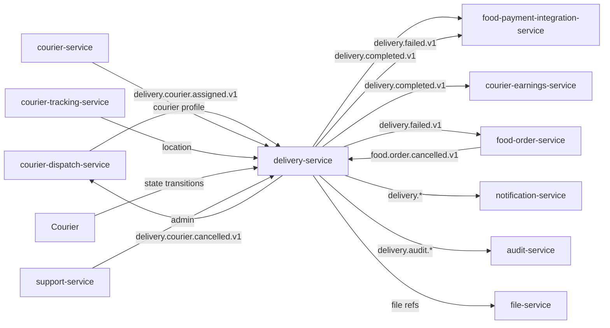

# delivery-service — Software Requirements Specification

## 1. Introduction

This document specifies the software behaviour of `delivery-service`.
It is the engineering source of truth for the delivery state machine,
its API, and its data model. It MUST remain consistent with
`BRD.md` (business intent) and `INTEGRATION.md` (contracts).

## 2. Scope

- In scope: delivery state machine, state-transition API, proof of
  delivery, batched delivery, customer-unreachable handling,
  redelivery / reassignment, COD collection, audit trail.
- Out of scope: courier matching (owned by `courier-dispatch-service`),
  payment (financial services), food order state, customer
  notifications.

## 3. System Context



## 4. Actors

- `courier` (Keycloak `platform-courier`, role `courier`).
- `courier-dispatch-service` (system actor).
- `food-order-service` (system actor).
- `customer-service` (system actor; read-only).
- `admin-service` / `support-service` (Keycloak `platform-internal`,
  role `admin` or `support_agent_l2`).

## 5. Functional Requirements

| ID | Requirement | Priority |
|----|-------------|----------|
| FR--001 | On `delivery.courier.assigned.v1`, insert a `delivery` row in `state=assigned` and return 201 to the dispatcher. | MUST |
| FR--002 | Accept `POST /v1/deliveries/{id}/en_route_pickup` from the assigned courier only; transition `assigned → en_route_pickup`. | MUST |
| FR--003 | Accept `POST /v1/deliveries/{id}/arrived_pickup` from the assigned courier only; transition `en_route_pickup → arrived_pickup`. | MUST |
| FR--004 | Accept `POST /v1/deliveries/{id}/pickup` from the assigned courier only; transition `arrived_pickup → picked_up`. | MUST |
| FR--005 | Accept `POST /v1/deliveries/{id}/en_route_dropoff` from the assigned courier only; transition `picked_up → en_route_dropoff`. | MUST |
| FR--006 | Accept `POST /v1/deliveries/{id}/complete` with proof (photo, signature, or PIN) and transition `en_route_dropoff → delivered`. | MUST |
| FR--007 | Reject any state transition from a courier that is not the assigned courier of the delivery (403). | MUST |
| FR--008 | Reject any state transition that violates the state machine (409 `STATE_INVALID`). | MUST |
| FR--009 | On `food.order.cancelled.v1`, if the delivery is not `picked_up`, transition to `cancelled`. | MUST |
| FR--010 | On `POST /v1/deliveries/{id}/failed` (reason=`customer_unreachable`), start a 5-minute wait timer. | MUST |
| FR--011 | On timer expiry with no resolution, transition to `failed` with reason `unreachable_timeout` and emit `delivery.failed.v1`. | MUST |
| FR--012 | On `POST /v1/deliveries/{id}/cancel` (courier cancel pre-pickup), emit `delivery.courier.cancelled.v1` and transition to `unassigned` (triggers reassignment in `courier-dispatch-service`). | MUST |
| FR--013 | On `POST /v1/deliveries/{id}/cash-collected` (amount, courier_id), emit `cash.collected.v1` and persist the collection row. | MUST |
| FR--014 | Support `POST /v1/deliveries/{id}/redeliver` (admin); close the current delivery as `failed` with reason `redelivered` and trigger a new delivery through the dispatcher. | SHOULD |
| FR--015 | Support batched deliveries: a courier may hold up to `batch_max_size` (default 3) deliveries, each with an independent state machine. | SHOULD |
| FR--016 | Persist every state transition in the `delivery_state_history` table within 1 second. | MUST |
| FR--017 | Emit `delivery.completed.v1` exactly once per terminal `delivered` state. | MUST |
| FR--018 | Emit `delivery.audit.state_changed.v1` for every transition. | MUST |
| FR--019 | Honour per-merchant `proof.required` configuration. | SHOULD |
| FR--020 | Reject any state transition that is older than 5 minutes (clock-skew guard). | MUST |

## 6. Non-Functional Requirements

| ID | Category | Requirement | Target |
|----|----------|-------------|--------|
| NFR--001 | performance | P99 state-transition API | ≤ 300ms |
| NFR--002 | performance | P99 pickup-to-delivered | ≤ 35min (per city) |
| NFR--003 | performance | P99 unread-delivery check | ≤ 50ms |
| NFR--004 | availability | Service uptime | 99.95% / 30d |
| NFR--005 | scalability | Concurrent active deliveries per replica | ≥ 5,000 |
| NFR--006 | scalability | Sustained state-transition rate | 200 rps |
| NFR--007 | maintainability | MTTR | ≤ 30 min |
| NFR--008 | observability | End-to-end trace per delivery | 100% |
| NFR--009 | consistency | Delivery state visible to all readers within | 1 second of commit |
| NFR--010 | durability | No state transition may be lost (at-least-once with inbox dedup) | MUST |

## 7. API Requirements

- All non-idempotent `POST` endpoints require `Idempotency-Key`.
- The Idempotency-Key pattern is
  `delivery:<delivery_id>:<action>:<attempt_id>`.
- All responses use the standard error envelope.
- All endpoints validate input with JSON Schema.
- Full contracts: `INTEGRATION.md`.

## 8. Data Requirements

| ID | Requirement | Notes |
|----|-------------|-------|
| DATA--001 | `delivery_id` is a UUIDv7. | |
| DATA--002 | `food_order_id`, `courier_id`, `customer_id`, `branch_id`, `restaurant_id`, `city_id`, `dispatch_id` are stored as UUID columns WITHOUT database FKs. | Cross-service references. |
| DATA--003 | `proof.file_id` is a UUID reference to `file-service`; the binary is not stored in this service. | |
| DATA--004 | The `delivery_state_history` table is append-only. | |
| DATA--005 | Money values (`cod_amount`) are `amount_minor BIGINT` + `currency CHAR(3)`. | |
| DATA--006 | No PII is stored. | |

## 9. Validation Rules

- `state` MUST be in the documented set (CHECK constraint).
- `proof.type` MUST be one of `photo`, `signature`, `pin`.
- For `pin` proof, the supplied PIN MUST match the order's PIN.
- For `photo` proof, the `file_id` MUST exist in `file-service` and
  have `scan_status=clean`.
- For `signature` proof, the base64 signature MUST be non-empty
  and ≤ 32 KB.
- `attempt_id` MUST be a UUIDv7.
- A courier MAY NOT transition the same delivery twice within 2
  seconds (debounce; prevents accidental double-tap).

## 10. State Transitions

See `WORKFLOWS.md` for full state diagrams.

```
assigned → en_route_pickup → arrived_pickup → picked_up →
  en_route_dropoff → delivered
                            ↘ failed
                            ↘ unreachable (5min) → failed
unassigned (after courier cancel) → reassigned (via dispatcher)
```

## 11. Authorization Requirements

- Couriers may act only on their own deliveries
  (`delivery.courier_id == sub`).
- Admins / support agents require `delivery.admin` or
  `support_agent_l2` for force-fail and redeliver.
- Service-to-service callers must have the `delivery.read` or
  `delivery.write` role in the `delivery-service` client.

## 12. Configuration Requirements

- Reads `delivery.*` from `configuration-service` at startup and
  on `configuration.updated.v1`.
- All numeric configuration validated against min/max bounds.
- The `unreachable_wait_seconds` and `proof.required` are loaded
  per-merchant (cache) and per-zone (default).

## 13. Error Handling

| Error | Response |
|-------|----------|
| Invalid state transition | 409 `STATE_INVALID` |
| Courier not the assigned courier | 403 `NOT_ASSIGNED_COURIER` |
| Proof validation failed | 422 `PROOF_INVALID` |
| Idempotency-Key reused with different body | 422 `IDEMPOTENCY_KEY_REUSED` |
| Downstream (courier-dispatch-service) down on reassign | 503 `CIRCUIT_OPEN` |
| Clock skew | 422 `TIMESTAMP_OUT_OF_BOUNDS` |

## 14. Concurrency Requirements

- A row-level lock on the `delivery` row is acquired at every state
  transition.
- The state machine uses optimistic concurrency (`updated_at`
  predicate) for the actual transition.
- The batched-delivery invariant is enforced at the dispatcher
  level (this service trusts the dispatcher's batch membership).

## 15. Idempotency Requirements

- All `POST` state transitions require `Idempotency-Key`.
- Replay returns the original response and DOES NOT re-transition
  the state.
- The `accept` (post-`failed`) flow's idempotency key is
  `delivery:<id>:accept:<admin_id>:<timestamp>`.

## 16. Performance

- Dominant path: courier mobile app pings a state transition; the
  service writes a row, updates the state, emits an event, and
  returns 200.
- P50 / P95 / P99: see NFRs.
- Hot spot: PostgreSQL writes on `deliveries` and
  `delivery_state_history`. Mitigated by:
  - `delivery_id` (UUIDv7) is the primary key → time-ordered.
  - `delivery_state_history` is partitioned by week.
  - Reads (ETA, status) hit a Redis cache keyed on `delivery_id`.

## 17. Scalability

- Horizontal: stateless; HPA on `kafka_consumer_lag` and
  `delivery_in_flight` gauge.
- Vertical: bounded by PostgreSQL connection pool.

## 18. Availability

- SLO: 99.95% over 30 days. Error budget: ~22 min / 30d.
- Maintenance: rolling deploys only.
- Degraded mode: if `courier-tracking-service` is down, ETAs are
  marked `unknown`; the state machine is unaffected.

## 19. Security

| ID | Requirement | Notes |
|----|-------------|-------|
| SEC--001 | All endpoints require JWT bearer validated at the gateway. | |
| SEC--002 | Couriers may only act on their own deliveries. | Server-side check on `courier_id == sub`. |
| SEC--003 | No PII is stored. | Only UUIDs. |
| SEC--004 | Admin actions are audit-logged. | `admin.action.performed.v1`. |
| SEC--005 | Proof-of-delivery photos are stored encrypted by `file-service`; references are UUIDs. | |
| SEC--006 | Rate limit: 30 state transitions per courier per minute. | At the service. |

## 20. Privacy

- PII stored: none.
- Retention: deliveries retained for 3 years (operational + audit).
- Erasure: not applicable (no PII to erase).

## 21. Auditability

- Every state transition is persisted in
  `delivery_state_history` with `actor_id`, `actor_type`
  (`courier`/`admin`/`system`), `from_state`, `to_state`,
  `timestamp`, `correlation_id`.
- Admin force-fail and redeliver emit `admin.action.performed.v1`
  with `actor_id`, `target_delivery_id`, `from_state`, `to_state`,
  `reason`.

## 22. Observability

- Logs: JSON, fields include `correlation_id`, `delivery_id`,
  `order_id`, `courier_id`, `state`, `region`.
- Metrics: `delivery_state_transitions_total{from,to,result}`,
  `delivery_pickup_seconds`, `delivery_dropoff_seconds`,
  `delivery_failed_total{reason}`,
  `delivery_proof_type_total{type}`.
- Traces: OpenTelemetry; one root span per state transition.
- Alerts: SLO burn-rate; `unreachable_timeout` rate > 5%; redelivery
  success rate < 70%.

## 23. Maintainability

- Code style: TypeScript strict, ESLint with platform rules.
- Test coverage: ≥ 80% line, ≥ 75% branch; 100% on the state
  machine.
- Documentation: this folder + `WORKFLOWS.md` diagrams.

## 24. Disaster Recovery

- RPO: 5 minutes (state history is replicated to standby region).
- RTO: 30 minutes (stateless service; replay outbox + state from
  PostgreSQL replica).

## 25. Acceptance Criteria

- All FR/NFR are met and verified by automated tests.
- All SEC are met and verified by a security review.
- A load test sustains 200 rps with p99 ≤ 300ms for 30 minutes.
- A chaos test (kill `courier-tracking-service`) shows the state
  machine is unaffected.
- Batched deliveries work end-to-end in staging.

---

## See also

### Sibling docs for this service

- [`README.md`](./README.md) — purpose, bounded context, responsibilities
- [`BRD.md`](./BRD.md) — business requirements
- [`SRS.md`](./SRS.md) — functional + non-functional requirements
- [`ERD.md`](./ERD.md) — data model (entities, relationships)
- [`INTEGRATION.md`](./INTEGRATION.md) — inter-service contracts (APIs, events, sagas)
- [`WORKFLOWS.md`](./WORKFLOWS.md) — operational workflows (happy paths, failure modes)
- [`TECH.md`](./TECH.md) — technology profile (runtime, libraries, data layer, admin endpoints, RBAC)

### Platform-wide

- [`../../shared/README.md`](../../shared/README.md) — `platform-spring-boot-starter` shared library (the single source of cross-cutting code for all Spring Boot services in the platform)
- [`../RECOMMENDATIONS.md`](../RECOMMENDATIONS.md) — platform-wide technology map (language, framework, version baseline, admin/RBAC pattern)
- [`../../README.md`](../../README.md) — services overview (the catalog of all 58 services)
- [`../../../main.md`](../../../main.md) — top-level platform specification (architecture, Keycloak, PostgreSQL 18, messaging, observability baseline)

