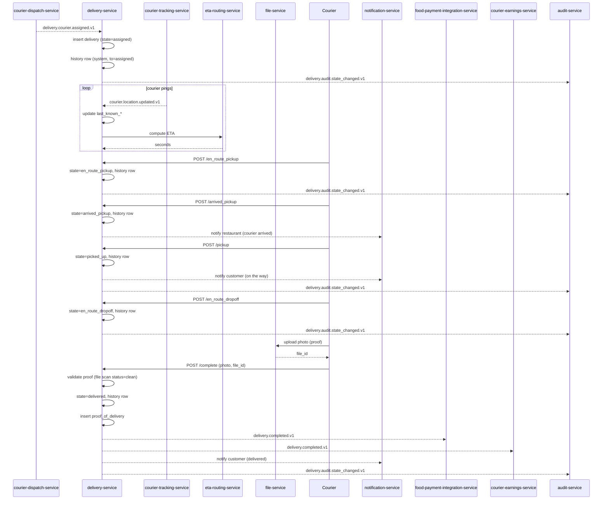
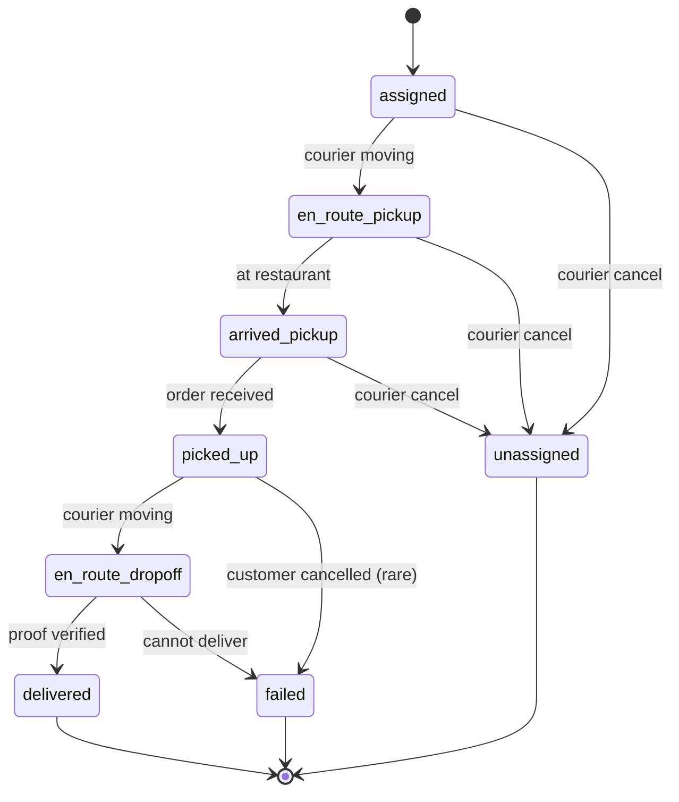
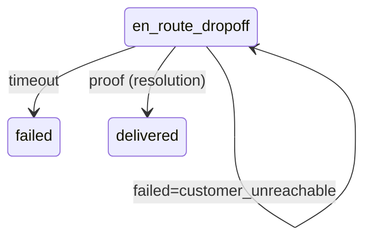
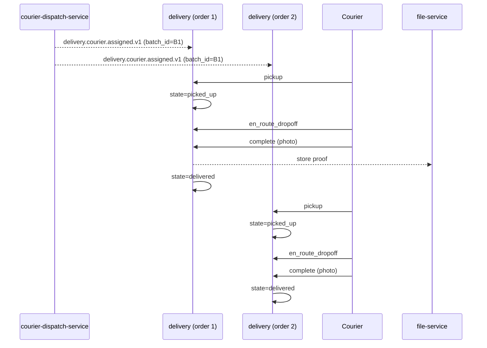
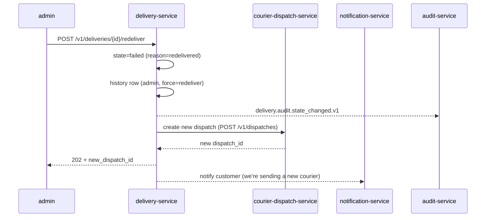
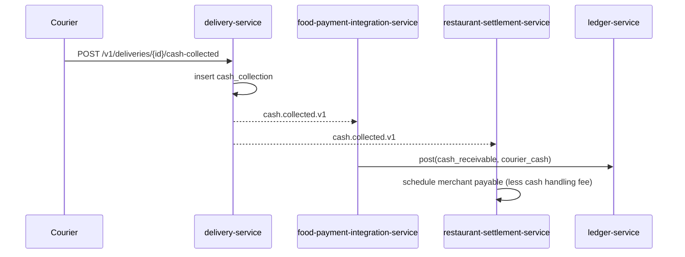

# delivery-service — Workflows

## 1. `Courier Assigned → Delivered` (Happy Path)

### 1.1 Objective

Drive a delivery from `assigned` to `delivered` with valid proof,
emitting lifecycle events for downstream consumers.

### 1.2 Initiating Actor

`courier-dispatch-service` (system actor) emits
`delivery.courier.assigned.v1`.

### 1.3 Participating Services

- `courier-dispatch-service` (producer of the trigger)
- `delivery-service` (this service)
- `courier-tracking-service` (location updates)
- `eta-routing-service` (ETAs)
- `file-service` (proof photos)
- `notification-service` (customer-facing)
- `food-payment-integration-service` (downstream consumer)
- `courier-earnings-service` (downstream consumer)
- `customer-service` (history)
- `review-rating-service` (downstream consumer)

### 1.4 Prerequisites

- A `delivery.courier.assigned.v1` event has been received and
  dedup'd.
- The food order is in `state=ready`.
- The courier is online and in the same city.

### 1.5 Happy Path



### 1.6 Alternate Paths

- **PIN proof**: courier receives the PIN from the customer (out of
  band) and submits it; `pin_verified=true` is recorded.
- **Signature proof**: courier captures the signature; stored as
  base64 (≤ 32 KB) in `proof_of_delivery.signature_base64`.
- **ETA recompute** is triggered every `courier_eta_ping_seconds`
  (default 30) and on every state transition.

### 1.7 Failure Paths

- **State transition rejected** (wrong state, wrong courier): 409
  `STATE_INVALID` or 403 `NOT_ASSIGNED_COURIER`. No state change.
  The mobile app retries with the correct call.
- **Proof validation fails** (e.g. file scan status is not `clean`):
  422 `PROOF_INVALID`. The delivery stays in `en_route_dropoff`;
  the courier is prompted to re-take.
- **Outbox publish fails**: the row remains in the outbox; the
  poller retries with backoff; after N failures → DLQ → support
  ticket.
- **Courier app crash mid-delivery**: on reopen, the mobile app
  reads the current state via `GET /v1/deliveries/{id}` and
  resumes from there.

### 1.8 Business Rules

- A courier can only transition their own delivery.
- A delivery is `delivered` only with valid proof.
- The pickup-to-delivered duration is recorded for KPIs.

### 1.9 State Transitions



### 1.10 Events

| Event | Direction | When |
|-------|-----------|------|
| `delivery.courier.assigned.v1` | consumed | on creation |
| `delivery.pickup.v1` | produced | on `picked_up` |
| `delivery.in_transit.v1` | produced | on `en_route_dropoff` |
| `delivery.arrived.v1` | produced | on courier arrive at dropoff |
| `delivery.completed.v1` | produced | on `delivered` |
| `delivery.audit.state_changed.v1` | produced | on every transition |

### 1.11 APIs Involved

| API | Direction | When |
|-----|-----------|------|
| `POST /v1/deliveries/{id}/en_route_pickup` | inbound | courier |
| `POST /v1/deliveries/{id}/arrived_pickup` | inbound | courier |
| `POST /v1/deliveries/{id}/pickup` | inbound | courier |
| `POST /v1/deliveries/{id}/en_route_dropoff` | inbound | courier |
| `POST /v1/deliveries/{id}/complete` | inbound | courier |
| `GET /v1/couriers/{id}` | outbound | enrich |
| `GET /v1/orders/{id}` | outbound | enrich |

### 1.12 Compensation / Rollback

- **Order cancelled after dispatch but before pickup**: the service
  receives `food.order.cancelled.v1`, transitions the delivery to
  `cancelled`, and emits `delivery.audit.state_changed.v1`. No
  payment is captured (the food-payment saga listens to
  `delivery.completed.v1` only).
- **Admin force-fail**: a separate `POST /v1/deliveries/{id}/failed`
  with `reason=force_fail`; the service transitions and emits
  `delivery.failed.v1`. Downstream refund flows may be triggered.

### 1.13 Final State

- Delivery: `delivered` (happy) with a `proof_of_delivery` row.
- Lifecycle events emitted for payment, earning, history, and
  notification.

## 2. `Customer Unreachable` (5-Minute Wait)

### 2.1 Objective

When a courier reports `customer_unreachable`, start a 5-minute
wait; on expiry, fail the delivery; on resolution, continue.

### 2.2 Initiating Actor

The courier (mobile app) calls `POST /v1/deliveries/{id}/failed`
with `reason=customer_unreachable`.

### 2.3 Participating Services

- `delivery-service` (this service)
- `notification-service` (customer outreach: SMS, push)
- `support-service` (escalation)
- `food-order-service` (consumes `delivery.failed.v1`)
- `food-payment-integration-service` (refund)

### 2.4 Prerequisites

- Delivery is in state `en_route_dropoff`.
- `delivery.unreachable_wait_seconds` is loaded.

### 2.5 Happy Path (timeout)

```mermaid
sequenceDiagram
    participant CUR as Courier
    participant DLV as delivery-service
    participant NOT as notification-service
    participant C as Customer
    participant SUP as support-service
    participant FOR as food-order-service
    participant FPI as food-payment-integration-service

    CUR->>DLV: POST /failed (reason=customer_unreachable)
    DLV->>DLV: state=en_route_dropoff (unchanged); unreachable_started_at=now()
    DLV-->>NOT: notify customer (call us, SMS)
    NOT-->>C: SMS / push
    Note over DLV: 5-minute wait
    alt customer reaches support
        SUP->>DLV: redeliver (admin)
        DLV->>DLV: state=failed (reason=redelivered)
        DLV-->>FOR: delivery.failed.v1
        DLV-->>FPI: refund (per policy)
    else timeout
        DLV->>DLV: state=failed (reason=unreachable_timeout)
        DLV-->>FOR: delivery.failed.v1
        DLV-->>FPI: partial refund (per policy)
        DLV-->>SUP: open ticket
    end
```

### 2.6 Alternate Paths

- **Customer reaches support**: support can mark the timer as
  resolved; the courier resumes the delivery.
- **Courier tries again**: the courier can clear the timer by
  calling `en_route_dropoff` again.

### 2.7 Failure Paths

- Timer scheduler fails: a daily reconciliation detects
  `unreachable_started_at IS NOT NULL AND unresolved > 1h` and
  auto-fails with `reason=unreachable_timeout`.
- Notification service is down: timer still ticks; failure path
  still works.

### 2.8 Business Rules

- Timer is per-delivery, not per-courier.
- Default wait is 5 minutes; per-merchant override allowed.

### 2.9 State Transitions



### 2.10 Events

| Event | Direction | When |
|-------|-----------|------|
| `delivery.failed.v1` | produced | on timeout |

### 2.11 APIs Involved

| API | Direction | When |
|-----|-----------|------|
| `POST /v1/deliveries/{id}/failed` | inbound | courier |

### 2.12 Compensation / Rollback

None — the failure is the terminal state. The customer-facing
refund is handled by `food-payment-integration-service`.

### 2.13 Final State

- Delivery: `failed` with `failed_reason=unreachable_timeout` or
  `redelivered`.
- Refund flow triggered (or redelivery flow).

## 3. `Batched Delivery` (One Courier, Multiple Orders)

### 3.1 Objective

A single courier holding multiple deliveries (assigned at
different times but not yet picked up) completes them
independently.

### 3.2 Initiating Actor

Two `delivery.courier.assigned.v1` events with the same
`batch_id` arrive close in time.

### 3.3 Participating Services

Same as the happy path; each delivery is independent.

### 3.4 Prerequisites

- Feature flag `delivery.feature.batched` is `true`.
- Both deliveries are assigned to the same courier and share a
  `batch_id`.

### 3.5 Happy Path



### 3.6 Alternate Paths

- One delivery fails: the other continues independently.
- The batch expires (one of the deliveries is older than
  `batch_max_age_minutes`): the dispatcher may un-batch by
  re-dispatching; this service does not change.

### 3.7 Failure Paths

- One proof fails: only that delivery is held; the other proceeds.

### 3.8 Business Rules

- `batch_max_size` is 3 (configurable).
- A batch is a dispatcher concept; this service trusts the
  `batch_id` and treats each delivery independently.

### 3.9 State Transitions

Each delivery has its own state machine (see §1.9).

### 3.10 Events

| Event | Direction | When |
|-------|-----------|------|
| `delivery.completed.v1` | produced (per delivery) | each terminal `delivered` |

### 3.11 APIs Involved

Same as single delivery.

### 3.12 Compensation / Rollback

Per-delivery compensation; one failure does not affect the other.

### 3.13 Final State

Each delivery reaches its own terminal state independently.

## 4. `Redelivery` (Admin-Driven)

### 4.1 Objective

An admin (or a successful support intervention) triggers a
redelivery: the current delivery is closed as `failed` with
`reason=redelivered`, and a new dispatch is created for the same
food order.

### 4.2 Initiating Actor

Admin via `POST /v1/deliveries/{id}/redeliver`.

### 4.3 Participating Services

- `delivery-service` (this service)
- `courier-dispatch-service` (creates a new dispatch)
- `notification-service` (notifies the customer and restaurant)
- `audit-service`

### 4.4 Prerequisites

- Admin has `delivery.admin` role.
- The current delivery is in `failed` (e.g. `customer_unreachable`,
  `unreachable_timeout`) and the food is still viable (within
  `redelivery_window_minutes` from pickup).

### 4.5 Happy Path



### 4.6 Alternate Paths

- If the food is no longer viable (older than
  `redelivery_window_minutes`), the service returns 409 with
  `code: REDELIVERY_WINDOW_EXPIRED`. The admin must trigger a
  refund instead.

### 4.7 Failure Paths

- `courier-dispatch-service` is down: the service returns 503
  `CIRCUIT_OPEN`. The original delivery is left in `failed`;
  the admin can retry later.
- Idempotency: a second call with the same Idempotency-Key
  returns the original `new_dispatch_id`.

### 4.8 Business Rules

- Redelivery requires an `audit_note` ≥ 10 characters.
- The new delivery's `redelivery_parent_id` points to the
  previous delivery (within-schema self-FK).

### 4.9 State Transitions

Current delivery: `failed (reason=redelivered)`. New delivery
starts at `assigned` (after the new dispatch is matched).

### 4.10 Events

| Event | Direction | When |
|-------|-----------|------|
| `delivery.audit.state_changed.v1` | produced | on `failed (redelivered)` |
| `delivery.failed.v1` | produced | (because the terminal state is `failed`) |
| `delivery.courier.assigned.v1` | consumed | (from the new dispatch) |

### 4.11 APIs Involved

| API | Direction | When |
|-----|-----------|------|
| `POST /v1/deliveries/{id}/redeliver` | inbound | admin |
| `POST /v1/dispatches` | outbound | to dispatcher |

### 4.12 Compensation / Rollback

None — the redelivery is a forward action; a failed redelivery
becomes a separate `failed` delivery that is itself eligible for
redelivery or refund.

### 4.13 Final State

- Original delivery: `failed (reason=redelivered)`.
- New delivery: a fresh `delivery_id` linked via
  `redelivery_parent_id`.

## 5. `Cash on Delivery` (Merchant-Enabled)

### 5.1 Objective

When a merchant allows COD, the courier collects cash from the
customer; the event drives the financial saga.

### 5.2 Initiating Actor

Courier (mobile app) calls `POST /v1/deliveries/{id}/cash-collected`.

### 5.3 Participating Services

- `delivery-service` (this service)
- `food-payment-integration-service` (consumes `cash.collected.v1`)
- `restaurant-settlement-service` (reduces merchant payable)
- `ledger-service` (posts the cash entry)

### 5.4 Prerequisites

- The merchant has `cash_on_delivery_enabled=true` in
  `configuration-service`.
- The delivery is in `en_route_dropoff` or `delivered` (cash
  collected at handover).

### 5.5 Happy Path



### 5.6 Alternate Paths

- The merchant's COD is disabled: the API returns 422
  `COD_NOT_ENABLED`.

### 5.7 Failure Paths

- The amount is invalid (<= 0): 422 `VALIDATION_FAILED`.
- The currency is invalid: 422.

### 5.8 Business Rules

- COD is recorded in minor units with currency.
- A delivery may have at most one `cash_collection` row
  (UNIQUE on `delivery_id`).

### 5.9 State Transitions

No state change; the delivery continues to its terminal state.

### 5.10 Events

| Event | Direction | When |
|-------|-----------|------|
| `cash.collected.v1` | produced | on POST |

### 5.11 APIs Involved

| API | Direction | When |
|-----|-----------|------|
| `POST /v1/deliveries/{id}/cash-collected` | inbound | courier |

### 5.12 Compensation / Rollback

If the amount is wrong, an admin can issue a correction via
`/v1/deliveries/{id}/cash-correction` (separate endpoint, admin
only). The correction is audit-logged.

### 5.13 Final State

- Delivery: terminal state (delivered or failed).
- `cash_collections` row present (if COD was applied).

---

## See also

### Sibling docs for this service

- [`README.md`](./README.md) — purpose, bounded context, responsibilities
- [`BRD.md`](./BRD.md) — business requirements
- [`SRS.md`](./SRS.md) — functional + non-functional requirements
- [`ERD.md`](./ERD.md) — data model (entities, relationships)
- [`INTEGRATION.md`](./INTEGRATION.md) — inter-service contracts (APIs, events, sagas)
- [`WORKFLOWS.md`](./WORKFLOWS.md) — operational workflows (happy paths, failure modes)
- [`TECH.md`](./TECH.md) — technology profile (runtime, libraries, data layer, admin endpoints, RBAC)

### Platform-wide

- [`../../shared/README.md`](../../shared/README.md) — `platform-spring-boot-starter` shared library (the single source of cross-cutting code for all Spring Boot services in the platform)
- [`../RECOMMENDATIONS.md`](../RECOMMENDATIONS.md) — platform-wide technology map (language, framework, version baseline, admin/RBAC pattern)
- [`../../README.md`](../../README.md) — services overview (the catalog of all 58 services)
- [`../../../main.md`](../../../main.md) — top-level platform specification (architecture, Keycloak, PostgreSQL 18, messaging, observability baseline)

