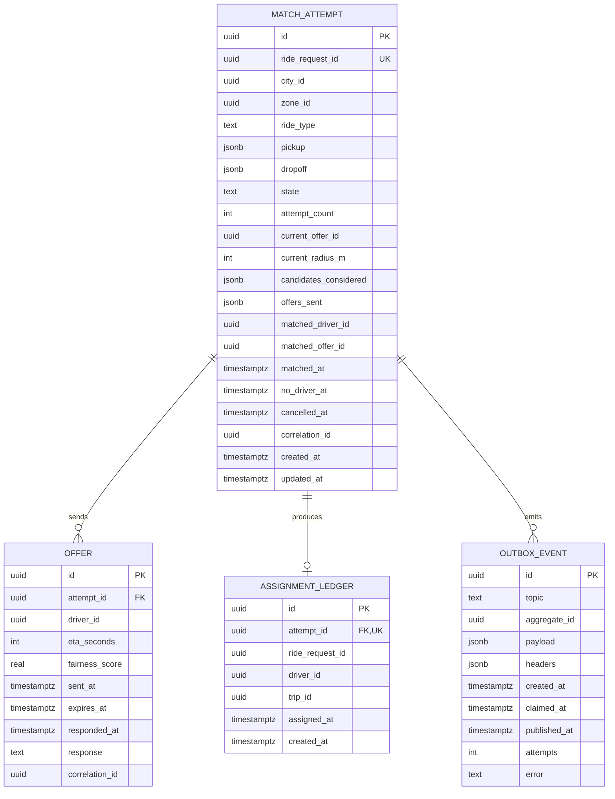

# dispatch-service — Entity-Relationship Diagram

## 1. Database

- Engine: PostgreSQL 18
- Schema: `dispatch` (owned exclusively by this service)
- Migrations: `services/dispatch-service/migrations/`

## 2. Cross-Service References

| Column | Type | Refers to | Source of truth |
|--------|------|-----------|------------------|
| `attempts.ride_request_id` | UUID | `ride_request` in `ride-request-service` | `ride-request-service` |
| `offers.driver_id` | UUID | `driver` in `driver-service` | `driver-service` |
| `assignment_ledger.driver_id` | UUID | `driver` in `driver-service` | `driver-service` |
| `assignment_ledger.trip_id` | UUID (nullable) | `trip` in `trip-service` | `trip-service` |

## 3. Entities

### `MatchAttempt`

A single match attempt for a ride request.

#### Columns

| Column | Type | Constraints | Notes |
|--------|------|-------------|-------|
| `id` | UUID | PK | UUIDv7 |
| `ride_request_id` | UUID | NOT NULL, UNIQUE | one attempt per request |
| `city_id` | UUID | NOT NULL | |
| `zone_id` | UUID | NOT NULL | pickup zone |
| `ride_type` | TEXT | NOT NULL | |
| `pickup` | JSONB | NOT NULL | `{lat, lon, address, place_id}` |
| `dropoff` | JSONB | NOT NULL | same shape |
| `state` | TEXT | NOT NULL, CHECK (state IN ('searching','offering','matched','no_driver','cancelled')) | state machine |
| `attempt_count` | INT | NOT NULL DEFAULT 0 | increments per offer |
| `current_offer_id` | UUID | NULL | FK to `offers.id` (within schema) |
| `current_radius_m` | INT | NOT NULL DEFAULT 1000 | current search radius |
| `candidates_considered` | JSONB | NOT NULL DEFAULT '[]' | `[{driver_id, eta_seconds, fairness_score, ...}]` |
| `offers_sent` | JSONB | NOT NULL DEFAULT '[]' | `[{offer_id, driver_id, sent_at, expired_at, accepted_at}]` |
| `matched_driver_id` | UUID | NULL | set on `matched` |
| `matched_offer_id` | UUID | NULL | the offer that was accepted |
| `matched_at` | TIMESTAMPTZ | NULL | |
| `no_driver_at` | TIMESTAMPTZ | NULL | |
| `cancelled_at` | TIMESTAMPTZ | NULL | |
| `correlation_id` | UUID | NOT NULL | |
| `created_at` | TIMESTAMPTZ | NOT NULL DEFAULT now() | |
| `updated_at` | TIMESTAMPTZ | NOT NULL DEFAULT now() | |
| `created_by` | UUID | NOT NULL | system / service identity |
| `updated_by` | UUID | NOT NULL | |

#### Indexes

- PK on `id`
- UNIQUE on `ride_request_id`
- `idx_attempt_state_zone` on `(state, zone_id)` — supports
  dashboards.
- `idx_attempt_correlation` on `(correlation_id)` — supports
  tracing.

#### Constraints

- `CHECK (state IN ('searching','offering','matched','no_driver','cancelled'))`
- `CHECK (matched_at IS NULL OR state = 'matched')`
- `CHECK (no_driver_at IS NULL OR state = 'no_driver')`
- `CHECK (cancelled_at IS NULL OR state = 'cancelled')`

### `Offer`

A single offer sent to a driver.

#### Columns

| Column | Type | Constraints | Notes |
|--------|------|-------------|-------|
| `id` | UUID | PK | UUIDv7 |
| `attempt_id` | UUID | NOT NULL, UNIQUE per active offer | FK to `attempts.id` |
| `driver_id` | UUID | NOT NULL | |
| `eta_seconds` | INT | NOT NULL | computed at offer time |
| `fairness_score` | REAL | NOT NULL | the candidate's score |
| `sent_at` | TIMESTAMPTZ | NOT NULL DEFAULT now() | |
| `expires_at` | TIMESTAMPTZ | NOT NULL | sent_at + ttl_seconds |
| `responded_at` | TIMESTAMPTZ | NULL | accept or explicit reject |
| `response` | TEXT | NULL, CHECK (response IN ('accepted','rejected','expired','superseded')) | |
| `correlation_id` | UUID | NOT NULL | |

#### Indexes

- PK on `id`
- UNIQUE partial on `(attempt_id)` WHERE `response IS NULL` (one
  active offer per attempt).
- `idx_offer_driver` on `(driver_id, sent_at DESC)` — supports
  the driver's pending offers.
- `idx_offer_expires` on `(expires_at)` WHERE `response IS NULL` —
  supports the sweeper.

### `AssignmentLedger`

The final, durable record of who was assigned which ride. Used for
financial and fairness reporting.

#### Columns

| Column | Type | Constraints | Notes |
|--------|------|-------------|-------|
| `id` | UUID | PK | UUIDv7 |
| `attempt_id` | UUID | NOT NULL | FK to `attempts.id` |
| `ride_request_id` | UUID | NOT NULL | |
| `driver_id` | UUID | NOT NULL | |
| `trip_id` | UUID | NULL | set once `trip-service` creates the trip |
| `assigned_at` | TIMESTAMPTZ | NOT NULL | when `matched` was emitted |
| `created_at` | TIMESTAMPTZ | NOT NULL DEFAULT now() | |

#### Indexes

- PK on `id`
- UNIQUE on `(attempt_id)`
- `idx_ledger_driver` on `(driver_id, assigned_at DESC)`
- `idx_ledger_request` on `(ride_request_id)`

### `OutboxEvent`

#### Columns

| Column | Type | Constraints | Notes |
|--------|------|-------------|-------|
| `id` | UUID | PK | UUIDv7 |
| `topic` | TEXT | NOT NULL | |
| `aggregate_id` | UUID | NOT NULL | partition key = `attempt_id` |
| `payload` | JSONB | NOT NULL | |
| `headers` | JSONB | NOT NULL DEFAULT '{}'::jsonb | |
| `created_at` | TIMESTAMPTZ | NOT NULL DEFAULT now() | |
| `claimed_at` | TIMESTAMPTZ | NULL | |
| `published_at` | TIMESTAMPTZ | NULL | |
| `attempts` | INT | NOT NULL DEFAULT 0 | |
| `error` | TEXT | NULL | |

#### Indexes

- PK on `id`
- `idx_outbox_pending` on `(created_at)` partial `WHERE
  published_at IS NULL`.

## 4. Mermaid ER Diagram



## 5. DDL Sketch

```sql
CREATE SCHEMA IF NOT EXISTS dispatch;
SET search_path TO dispatch;

CREATE TABLE dispatch.attempts (
    id UUID PRIMARY KEY,
    ride_request_id UUID NOT NULL UNIQUE,
    city_id UUID NOT NULL,
    zone_id UUID NOT NULL,
    ride_type TEXT NOT NULL,
    pickup JSONB NOT NULL,
    dropoff JSONB NOT NULL,
    state TEXT NOT NULL,
    attempt_count INT NOT NULL DEFAULT 0,
    current_offer_id UUID,
    current_radius_m INT NOT NULL DEFAULT 1000,
    candidates_considered JSONB NOT NULL DEFAULT '[]'::jsonb,
    offers_sent JSONB NOT NULL DEFAULT '[]'::jsonb,
    matched_driver_id UUID,
    matched_offer_id UUID,
    matched_at TIMESTAMPTZ,
    no_driver_at TIMESTAMPTZ,
    cancelled_at TIMESTAMPTZ,
    correlation_id UUID NOT NULL,
    created_at TIMESTAMPTZ NOT NULL DEFAULT now(),
    updated_at TIMESTAMPTZ NOT NULL DEFAULT now(),
    created_by UUID NOT NULL,
    updated_by UUID NOT NULL,
    CONSTRAINT chk_attempt_state CHECK (state IN
        ('searching','offering','matched','no_driver','cancelled'))
);
CREATE INDEX idx_attempt_state_zone ON dispatch.attempts (state, zone_id);
CREATE INDEX idx_attempt_correlation ON dispatch.attempts (correlation_id);

CREATE TABLE dispatch.offers (
    id UUID PRIMARY KEY,
    attempt_id UUID NOT NULL REFERENCES dispatch.attempts(id),
    driver_id UUID NOT NULL,
    eta_seconds INT NOT NULL,
    fairness_score REAL NOT NULL,
    sent_at TIMESTAMPTZ NOT NULL DEFAULT now(),
    expires_at TIMESTAMPTZ NOT NULL,
    responded_at TIMESTAMPTZ,
    response TEXT,
    correlation_id UUID NOT NULL,
    CONSTRAINT chk_offer_response CHECK (
        response IS NULL OR response IN ('accepted','rejected','expired','superseded')
    )
);
CREATE UNIQUE INDEX idx_offer_active ON dispatch.offers (attempt_id)
    WHERE response IS NULL;
CREATE INDEX idx_offer_driver ON dispatch.offers (driver_id, sent_at DESC);
CREATE INDEX idx_offer_expires ON dispatch.offers (expires_at)
    WHERE response IS NULL;

CREATE TABLE dispatch.assignment_ledger (
    id UUID NOT NULL,
    attempt_id UUID NOT NULL UNIQUE REFERENCES dispatch.attempts(id),
    ride_request_id UUID NOT NULL,
    driver_id UUID NOT NULL,
    trip_id UUID,
    assigned_at TIMESTAMPTZ NOT NULL,
    created_at TIMESTAMPTZ NOT NULL DEFAULT now(),
    PRIMARY KEY (id, assigned_at)
) PARTITION BY RANGE (assigned_at);
CREATE INDEX idx_ledger_driver
    ON dispatch.assignment_ledger (driver_id, assigned_at DESC);
CREATE INDEX idx_ledger_request
    ON dispatch.assignment_ledger (ride_request_id);

CREATE TABLE IF NOT EXISTS dispatch.assignment_ledger_2026_08
    PARTITION OF dispatch.assignment_ledger
    FOR VALUES FROM ('2026-08-01 00:00:00+00') TO ('2026-09-01 00:00:00+00');

CREATE TABLE dispatch.outbox (
    id UUID PRIMARY KEY,
    topic TEXT NOT NULL,
    aggregate_id UUID NOT NULL,
    payload JSONB NOT NULL,
    headers JSONB NOT NULL DEFAULT '{}'::jsonb,
    created_at TIMESTAMPTZ NOT NULL DEFAULT now(),
    claimed_at TIMESTAMPTZ,
    published_at TIMESTAMPTZ,
    attempts INT NOT NULL DEFAULT 0,
    error TEXT
);
CREATE INDEX idx_outbox_pending
    ON dispatch.outbox (created_at)
    WHERE published_at IS NULL;
```

## 6. Audit Columns

Every mutable table has `created_at`, `updated_at`, `created_by`,
`updated_by`. The `assignment_ledger` is append-only.

## 7. Soft Delete

Not used. The state is the source of truth.

## 8. JSONB Usage

- `attempts.candidates_considered`: list of candidate drivers with
  ETA and fairness score.
- `attempts.offers_sent`: list of offers with timestamps.
- `outbox.payload`: full event envelope.

## 9. Partitioning

| Table | Strategy | Cadence | Pre-create | Retention |
|-------|----------|---------|------------|-----------|
| `assignment_ledger` | RANGE on `assigned_at` | monthly | 12 months | 7 years |

See [`DATABASE_ARCHITECTURE.md` §"Table Partitioning — Canonical Template"](../../architecture/DATABASE_ARCHITECTURE.md) for the idempotent `CREATE TABLE IF NOT EXISTS … PARTITION OF …` pattern, naming convention, and the service-owned maintenance-job contract.

## 10. Data Retention

| Table | Retention | Purged by |
|-------|-----------|-----------|
| `attempts` | 30 days | scheduled purge |
| `offers` | 30 days | with the attempt |
| `assignment_ledger` | 7 years | financial; append-only |
| `outbox` | 24h after publish | poller purge |

## 11. Migration Considerations

- The `state` CHECK is the source of truth for the state machine;
  adding a new state requires a multi-step migration.
- The UNIQUE on `ride_request_id` enforces one attempt per request.
  Relaxing it requires a new column and a migration plan.
- The `offers` table's UNIQUE on `attempt_id WHERE response IS NULL`
  is the active-offer invariant; the sweeper updates `response`
  atomically.

---

## See also

### Sibling docs for this service

- [`README.md`](./README.md) — purpose, bounded context, responsibilities
- [`BRD.md`](./BRD.md) — business requirements
- [`SRS.md`](./SRS.md) — functional + non-functional requirements
- [`ERD.md`](./ERD.md) — data model (entities, relationships)
- [`INTEGRATION.md`](./INTEGRATION.md) — inter-service contracts (APIs, events, sagas)
- [`WORKFLOWS.md`](./WORKFLOWS.md) — operational workflows (happy paths, failure modes)
- [`TECH.md`](./TECH.md) — technology profile (runtime, libraries, data layer, admin endpoints, RBAC)

### Platform-wide

- [`../../shared/README.md`](../../shared/README.md) — `platform-spring-boot-starter` shared library (the single source of cross-cutting code for all Spring Boot services in the platform)
- [`../RECOMMENDATIONS.md`](../RECOMMENDATIONS.md) — platform-wide technology map (language, framework, version baseline, admin/RBAC pattern)
- [`../../README.md`](../../README.md) — services overview (the catalog of all 58 services)
- [`../../../main.md`](../../../main.md) — top-level platform specification (architecture, Keycloak, PostgreSQL 18, messaging, observability baseline)

