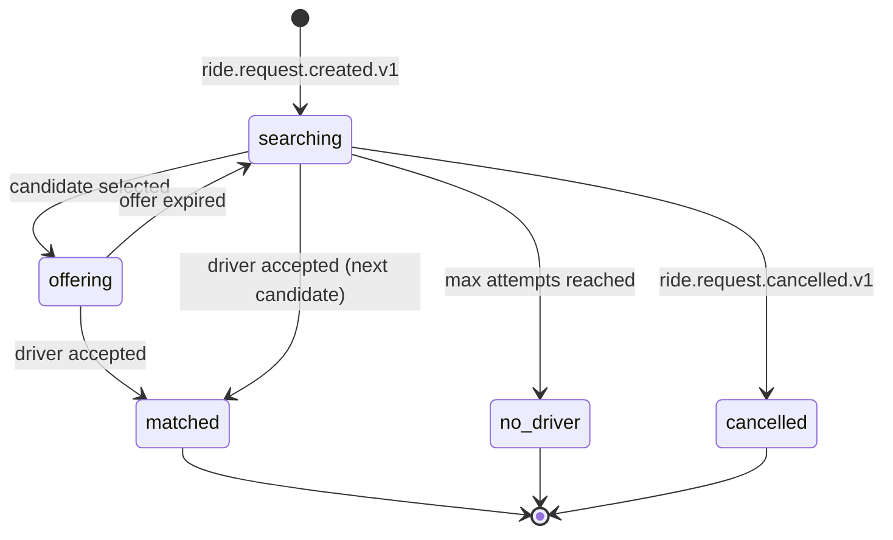

# dispatch-service — Software Requirements Specification

## 1. Introduction

This document specifies the requirements for `dispatch-service`. The
service must be correct, fair, fast, and observable. The match
attempt is the heart of the marketplace; getting it wrong means
stranded customers and idle drivers.

## 2. Scope

In scope:

- The match attempt aggregate.
- The candidate search and ranking.
- The offer/accept/expire flow.
- The 15s offer timer.
- The fairness policy.
- The no-driver fallback.

Out of scope:

- The ride request aggregate.
- Driver online state.
- Driver location.
- The trip aggregate.
- Pricing.

## 3. System Context

```mermaid
flowchart LR
    RR[ride-request-service] -. ride.request.created.v1 .-> DS[dispatch-service]
    RR -. ride.request.cancelled.v1 .-> DS
    DA[driver-availability-service] -. driver.availability.offline.v1 .-> DS
    DL[driver-location-service] -. driver.location.updated.v1 .-> DS
    DS --> DA
    DS --> DL
    DS --> ETA[eta-routing-service]
    DS --> DRV[driver-service]
    DS -. dispatch.*.v1 .-> K[(Kafka)]
    K --> RR
    K --> TR[trip-service]
    K --> NOT[notification-service]
```

## 4. Actors

- **`ride-request-service`** — system actor via events.
- **`driver-availability-service`** — system actor via REST + events.
- **`driver-location-service`** — system actor via REST + events.
- **`eta-routing-service`** — system actor via REST.
- **Driver app** — accepts via push; reads pending offers via REST.
- **Admin / support** — read attempts.

## 5. Functional Requirements

| ID | Requirement | Priority |
|----|-------------|----------|
| FR--001 | On `ride.request.created.v1`, create a `match_attempt` and begin searching. | MUST |
| FR--002 | On `ride.request.cancelled.v1`, mark the attempt as `cancelled` and stop searching. | MUST |
| FR--003 | Query `driver-availability-service` for online drivers in the pickup zone with the requested ride type. | MUST |
| FR--004 | Exclude drivers who are `online_busy` or have a high fraud score. | MUST |
| FR--005 | For each candidate, compute ETA via `eta-routing-service`. | MUST |
| FR--006 | Sort candidates by ETA ascending, with a fairness tie-breaker (recent offers window, recent cancellations). | MUST |
| FR--007 | Send an offer to the top candidate via push. | MUST |
| FR--008 | Hold a 15s offer timer; on expiry, emit `dispatch.offer.expired.v1` and try the next candidate. | MUST |
| FR--009 | On accept, emit `dispatch.matched.v1` and stop the search. | MUST |
| FR--010 | After N attempts, emit `dispatch.no_driver.v1`. | MUST |
| FR--011 | Expand the search radius by `expansion_factor` each attempt. | MUST |
| FR--012 | On `driver.availability.offline.v1` for a candidate, remove the candidate from the attempt. | MUST |
| FR--013 | On `driver.location.updated.v1` (curated) for a candidate, update the candidate's position. | MUST |
| FR--014 | Persist every attempt with the list of candidates considered, the offers sent, and the outcome. | MUST |
| FR--015 | All state changes go through the transactional outbox. | MUST |
| FR--016 | Reject all invalid state transitions with 409 `STATE_INVALID`. | MUST |
| FR--017 | Support surge: a higher surge zone gets a larger candidate pool. | SHOULD |
| FR--018 | `GET /v1/dispatch/drivers/{driver_id}/offers` returns the driver's pending offers. | MUST |
| FR--019 | Force-cancel a match attempt via admin API with a reason. | MUST |
| FR--020 | The 15s timer is enforced server-side via a Redis sorted-set; the driver app's local timer is advisory. | MUST |

## 6. Non-Functional Requirements

| ID | Category | Requirement | Target |
|----|----------|-------------|--------|
| NFR--001 | performance | P99 match latency (request → first offer) | ≤ 2s |
| NFR--002 | performance | P99 match latency (request → matched) | ≤ 30s |
| NFR--003 | availability | uptime | 99.95% (Tier-1) |
| NFR--004 | scalability | concurrent match attempts | 100k per region |
| NFR--005 | maintainability | MTTR for a bad deploy | ≤ 15 minutes |
| NFR--006 | observability | tracing coverage | 100% |
| NFR--007 | fairness | Gini coefficient on offers per driver | ≤ 0.3 |

## 7. API Requirements

REST per `architecture/API_STANDARDS.md`. The
`POST /v1/dispatch/requests` endpoint is system-only; the driver's
offers endpoint is per-driver with rate limiting. Errors use the
standard envelope. Full contract in `INTEGRATION.md`.

## 8. Data Requirements

| ID | Requirement | Notes |
|----|-------------|-------|
| DATA--001 | `attempts` has a UUIDv7 PK | time-ordered |
| DATA--002 | All timestamps `timestamptz` UTC | RFC3339 at the wire |
| DATA--003 | Cross-service references (`ride_request_id`, `driver_id`) as UUID without FKs | |
| DATA--004 | The candidate list and the offers list stored as JSONB | for audit |
| DATA--005 | Audit columns on every mutable table | platform standard |
| DATA--006 | No PII beyond pickup/dropoff (held in the attempt) | encrypted at rest |

## 9. Validation Rules

- `ride_type` must be in the requested set.
- The pickup zone must be served.
- A driver offered cannot be `online_busy` (re-check at offer time).

## 10. State Transitions



## 11. Authorization Requirements

- `POST /v1/dispatch/requests` is system-only (service-to-service).
- `GET /v1/dispatch/drivers/{driver_id}/offers` is driver-only.
- Admin can read attempts and force-cancel with a reason.

## 12. Configuration Requirements

Consumed from `configuration-service` and refreshed on
`configuration.updated.v1`. See `README.md` §13.

## 13. Error Handling

| Error | Response | Recovery |
|-------|----------|----------|
| Driver availability down | 503 | retry; on persistent, fall back to a stale candidate list |
| ETA service down | 503 | fall back to haversine; then to last-known-position proxy |
| Driver service down | 503 | skip rating-based fairness; use ETA only |
| Inbox duplicate | no-op | idempotent |
| Outbox publish fails | retry | DLQ on persistent failure |

## 14. Concurrency Requirements

- A match attempt is mutated by at most one writer at a time. The
  row lock on `attempts.id` serialises the offer/expire/accept
  flow.
- The candidate list is held in Redis (sorted-set by ETA) and
  updated on `driver.location.updated.v1`.

## 15. Idempotency Requirements

- All event handlers are idempotent by `event_id`.
- The `POST /v1/dispatch/requests` endpoint is idempotent by
  `ride_request_id` (one attempt per request).

## 16. Performance

- Dominant path: the search and rank; we cache the per-zone
  candidate set for 2s.
- P50 / P95 / P99: 1s / 5s / 30s (end-to-end match).

## 17. Scalability

- Horizontal: stateless, scale by HPA on
  `dispatch_match_seconds_p99` and CPU.
- The candidate set cache absorbs bursts.

## 18. Availability

- SLO: 99.95% over 30 days.
- Error budget: ~22 minutes per 30 days.
- Maintenance window: weekly Sun 04:00–06:00 UTC.

## 19. Security

| ID | Requirement | Notes |
|----|-------------|-------|
| SEC--001 | All endpoints require a valid JWT bearer token | gateway validates |
| SEC--002 | System endpoints require service-to-service JWT | `dispatch-service` client id |
| SEC--003 | Driver endpoints are scoped to the driver | `driver_id == sub` |
| SEC--004 | Admin actions require `X-Audit-Reason` | |
| SEC--005 | PII (pickup/dropoff) encrypted at rest | disk-level KMS |
| SEC--006 | Idempotency keys are opaque UUIDs | |
| SEC--007 | TLS 1.3 at edge; mTLS in cluster | platform standard |

## 20. Privacy

- PII stored: pickup/dropoff (in the attempt row).
- Retention: 30 days for the attempt (audit); 7 years for the
  assignment ledger (financial).
- Erasure: per GDPR, PII columns are erased; the assignment ledger
  is retained de-identified.

## 21. Auditability

- Every state transition is logged with `correlation_id`,
  `attempt_id`, `from_state`, `to_state`.
- Every offer/accept/expire is recorded in the attempt's
  `candidates_considered` and `offers_sent` JSONB.
- Every admin action is logged at `warn` and emitted to
  `audit-service`.

## 22. Observability

- Logs: JSON to stdout with `correlation_id`, `service`, `version`,
  `route`, `latency_ms`, `status`.
- Metrics: see `README.md` §15.
- Traces: OpenTelemetry, root span per match attempt; child spans
  per candidate evaluation.
- Alerts: SLO burn-rate, no-driver rate, fairness Gini drift.

## 23. Maintainability

- Code style: TypeScript with `strict: true`; ESLint + Prettier.
- Test coverage: ≥ 80% line / branch; 100% on the state machine.
- Documentation: this folder.

## 24. Disaster Recovery

- RPO: ≤ 1 minute.
- RTO: ≤ 15 minutes. A match attempt is recoverable from
  `ride.request.created.v1` (the in-flight offers may be lost;
  reconciliation can replay them).

## 25. Acceptance Criteria

- A match attempt ends in exactly one of `matched`, `no_driver`,
  `cancelled`.
- The 15s offer TTL is enforced server-side; an offer cannot be
  accepted after expiry.
- The fairness policy is applied to every attempt.
- All match attempts are persisted in `dispatch.attempts`.

---

## See also

### Sibling docs for this service

- [`README.md`](./README.md) — purpose, bounded context, responsibilities
- [`BRD.md`](./BRD.md) — business requirements
- [`SRS.md`](./SRS.md) — functional + non-functional requirements
- [`ERD.md`](./ERD.md) — data model (entities, relationships)
- [`INTEGRATION.md`](./INTEGRATION.md) — inter-service contracts (APIs, events, sagas)
- [`WORKFLOWS.md`](./WORKFLOWS.md) — operational workflows (happy paths, failure modes)
- [`TECH.md`](./TECH.md) — technology profile (runtime, libraries, data layer, admin endpoints, RBAC)

### Platform-wide

- [`../../shared/README.md`](../../shared/README.md) — `platform-spring-boot-starter` shared library (the single source of cross-cutting code for all Spring Boot services in the platform)
- [`../RECOMMENDATIONS.md`](../RECOMMENDATIONS.md) — platform-wide technology map (language, framework, version baseline, admin/RBAC pattern)
- [`../../README.md`](../../README.md) — services overview (the catalog of all 58 services)
- [`../../../main.md`](../../../main.md) — top-level platform specification (architecture, Keycloak, PostgreSQL 18, messaging, observability baseline)

