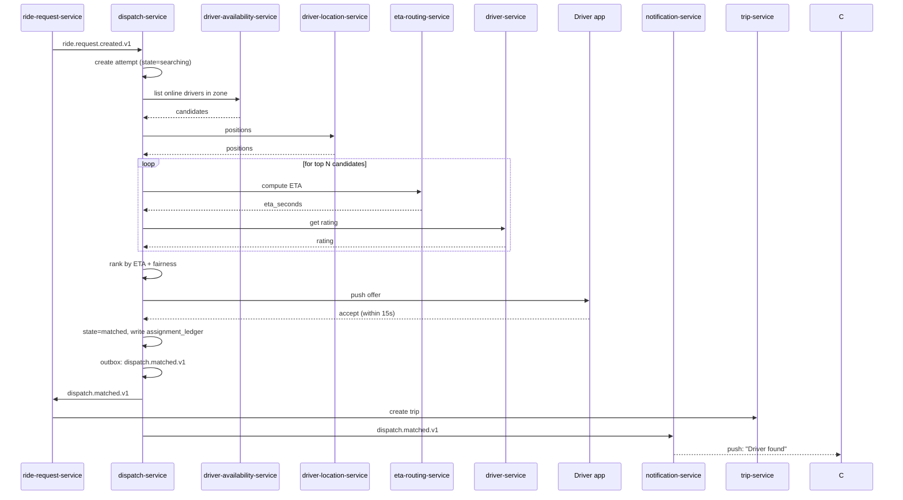
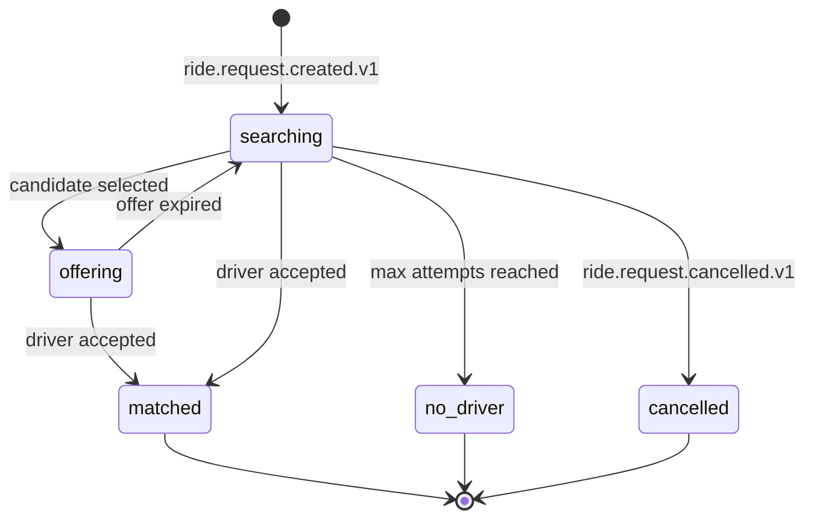
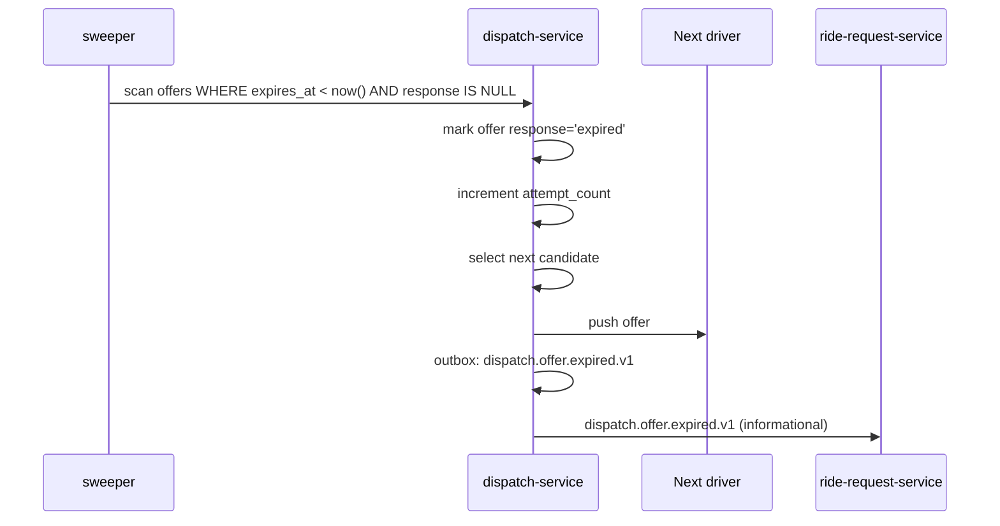
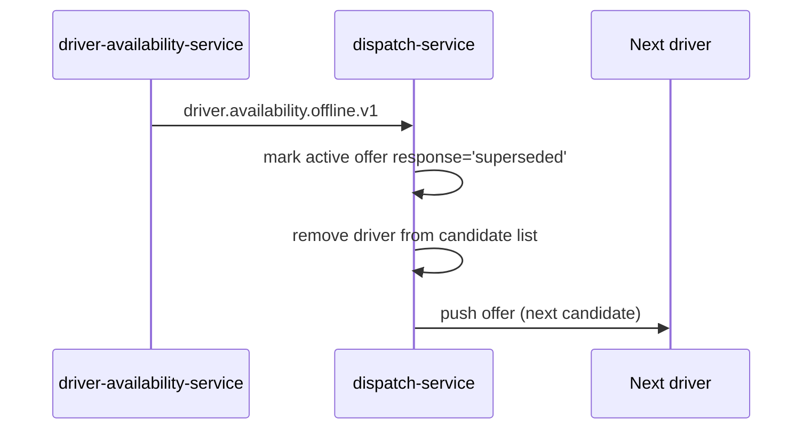

# dispatch-service — Workflows

## 1. Match Attempt (Happy Path)

### 1.1 Objective

Match a ride request to a driver who accepts within 15s, with a fair
distribution of offers and an honest record of what happened.

### 1.2 Initiating Actor

`ride-request-service` emits `ride.request.created.v1`.

### 1.3 Participating Services

- `ride-request-service` (event producer)
- `dispatch-service` (this service)
- `driver-availability-service` (candidates)
- `driver-location-service` (positions)
- `eta-routing-service` (ETA)
- `driver-service` (rating for fairness)
- Driver app (accept)

### 1.4 Prerequisites

- The pickup zone is served.
- At least one candidate driver is online.
- The fare, surge, and config are loaded.

### 1.5 Happy Path



### 1.6 Alternate Paths

- **First driver rejects / no response**: offer expires after 15s;
  try the next candidate.
- **Driver goes offline mid-offer**: offer is expired; next
  candidate.
- **ETA service down**: fall back to haversine; then to last-known
  position proxy.
- **Driver service down**: skip rating-based fairness; use ETA only.

### 1.7 Failure Paths

- **No candidates at all**: emit `dispatch.no_driver.v1` immediately
  (no need to try).
- **Max attempts reached**: emit `dispatch.no_driver.v1`.
- **Customer cancels mid-match**: emit (or, more accurately, the
  request service emits) `ride.request.cancelled.v1`; the attempt is
  marked `cancelled`; the search stops.

### 1.8 Business Rules

- BR--010 to BR--016, BR--019, BR--022.

### 1.9 State Transitions



### 1.10 Events

| Event | Direction | When |
|-------|-----------|------|
| `dispatch.matched.v1` | produced | on accept |
| `dispatch.no_driver.v1` | produced | on max attempts |
| `dispatch.offer.expired.v1` | produced | on offer TTL |
| `ride.request.created.v1` | consumed | trigger |
| `ride.request.cancelled.v1` | consumed | abandon |
| `driver.availability.offline.v1` | consumed | drop candidate |
| `driver.location.updated.v1` | consumed | refresh candidate |

### 1.11 APIs Involved

| API | Direction | When |
|-----|-----------|------|
| `POST /v1/dispatch/requests` | inbound | trigger |
| `GET /v1/availability/zone/{id}/online-drivers` | outbound | candidates |
| `GET /v1/location/zone/{id}/current` | outbound | positions |
| `POST /v1/routing/eta` | outbound | ETA |
| `GET /v1/drivers/{id}/rating` | outbound | fairness |

### 1.12 Compensation / Rollback

- If `dispatch.matched.v1` fails to publish after the row is
  committed, the outbox retries. The driver is matched; the
  downstream may not see the event for a few seconds; the
  assignment_ledger is the source of truth.
- If the customer cancels after a match, the downstream
  `ride-request-service` and `trip-service` handle the
  compensation.

### 1.13 Final State

`matched`, `no_driver`, or `cancelled`. The
`assignment_ledger` row is written on `matched`.

## 2. Offer Expires (Next Candidate)

### 2.1 Objective

When a driver does not respond within 15s, expire the offer and
try the next candidate.

### 2.2 Initiating Actor

The 15s timer in `dispatch-service` (sweeper every 1s).

### 2.3 Participating Services

- `dispatch-service` (this service)
- Driver app (the next candidate)
- `ride-request-service` (re-attempt consumer)

### 2.4 Prerequisites

- An offer is in flight and its TTL has elapsed.
- The attempt is not yet at `max_attempts`.

### 2.5 Happy Path



### 2.6 Alternate Paths

- The driver explicitly rejects: same flow but `response=rejected`.
- The attempt has reached `max_attempts`: emit
  `dispatch.no_driver.v1` instead.

### 2.7 Failure Paths

- Sweeper DB lock contention: the next tick handles it.

### 2.8 Business Rules

- BR--014, BR--030.

### 2.9 State Transitions

`offering → searching → offering` (next candidate) or
`searching → no_driver` (max attempts).

### 2.10 Events

| Event | Direction | When |
|-------|-----------|------|
| `dispatch.offer.expired.v1` | produced | on expiry |

### 2.11 APIs Involved

None (sweeper + internal).

### 2.12 Compensation / Rollback

N/A (idempotent).

### 2.13 Final State

Either a new offer is sent, or the attempt is `no_driver`.

## 3. Customer Cancels Mid-Match

### 3.1 Objective

When the customer cancels while a match is in progress, abandon the
attempt and stop sending offers.

### 3.2 Initiating Actor

`ride-request-service` emits `ride.request.cancelled.v1`.

### 3.3 Participating Services

- `ride-request-service` (event producer)
- `dispatch-service` (this service)
- Driver app (the offered driver, who will see the attempt gone)

### 3.4 Prerequisites

- The attempt is in `searching` or `offering`.

### 3.5 Happy Path

```mermaid
sequenceDiagram
    participant RR as ride-request-service
    participant DS as dispatch-service
    participant DR as Offered driver

    RR->>DS: ride.request.cancelled.v1
    DS->>DS: row-lock; state=cancelled
    DS->>DS: mark active offer response='superseded'
    DS->>DR: push: "offer withdrawn" (best effort)
```

### 3.6 Alternate Paths

- The offer was already accepted: the attempt is already `matched`;
  the cancellation is a no-op (the trip-service handles the trip
  cancellation).

### 3.7 Failure Paths

- DB down: retry; on persistent failure, page on-call.

### 3.8 Business Rules

- BR--017.

### 3.9 State Transitions

`* → cancelled`.

### 3.10 Events

| Event | Direction | When |
|-------|-----------|------|
| `ride.request.cancelled.v1` | consumed | trigger |

### 3.11 APIs Involved

None.

### 3.12 Compensation / Rollback

N/A (idempotent).

### 3.13 Final State

`cancelled`. The driver is free for other offers.

## 4. Driver Goes Offline Mid-Offer

### 4.1 Objective

When the offered driver goes offline, expire the offer and try the
next candidate.

### 4.2 Initiating Actor

`driver-availability-service` emits `driver.availability.offline.v1`.

### 4.3 Participating Services

- `driver-availability-service` (event producer)
- `dispatch-service` (this service)
- Driver app (the next candidate)

### 4.4 Prerequisites

- The driver is the current offer.

### 4.5 Happy Path



### 4.6 Alternate Paths

- The offline driver is in the candidate list but not the current
  offer: just remove them.

### 4.7 Failure Paths

- DB down: retry.

### 4.8 Business Rules

- BR--018.

### 4.9 State Transitions

`offering → searching → offering` (next candidate).

### 4.10 Events

| Event | Direction | When |
|-------|-----------|------|
| `driver.availability.offline.v1` | consumed | trigger |

### 4.11 APIs Involved

None.

### 4.12 Compensation / Rollback

N/A.

### 4.13 Final State

Either a new offer is sent, or the attempt is `no_driver`.

---

## 99. `monthly` Partition Maintenance

### 99.1 Objective

Idempotently pre-create the next 12 months for partitioned tables in `dispatch`.

### 99.2 Initiating Actor

A scheduled job runs daily at `02:00 UTC`. Leader-elected via `pg_try_advisory_xact_lock(hashtext('dispatch.partition'), hashtext('monthly'))`.

### 99.3 Happy Path

```mermaid
sequenceDiagram
    participant JOB as Partition job
    participant PG as PostgreSQL
    JOB->>PG: pg_try_advisory_xact_lock('dispatch.monthly')
    alt lock acquired
        loop for each missing month in next 12
            JOB->>PG: CREATE TABLE IF NOT EXISTS dispatch.assignment_ledger_YYYY_MM PARTITION OF dispatch.assignment_ledger
            JOB->>PG: verify (pg_inherits, relpartbound)
        end
        JOB->>PG: assert now() in existing child
    else lock NOT acquired
        Note over JOB: another instance is running; exit cleanly
    end
```

### 99.4 Failure Paths

| Failure | Handling |
|---------|----------|
| Lock contention | exit 0 |
| DDL fails | retry 3× with backoff (1 s / 4 s / 16 s); page on-call |
| Today's child missing | critical alert; INSERTs would fail |

### 99.5 Business Rules

- Pre-create 12 complete future months.
- Every child is created with `CREATE TABLE IF NOT EXISTS … PARTITION OF …`.
- A verification step (`pg_inherits` parent + `relpartbound` range) runs after every `CREATE TABLE IF NOT EXISTS`.
- Optionally emit `audit.partition.maintained.v1` on success.

---

## See also

### Sibling docs for this service

- [`README.md`](./README.md) — purpose, bounded context, responsibilities
- [`BRD.md`](./BRD.md) — business requirements
- [`SRS.md`](./SRS.md) — functional + non-functional requirements
- [`ERD.md`](./ERD.md) — data model (entities, relationships)
- [`INTEGRATION.md`](./INTEGRATION.md) — inter-service contracts (APIs, events, sagas)
- [`WORKFLOWS.md`](./WORKFLOWS.md) — operational workflows (happy paths, failure modes)
- [`TECH.md`](./TECH.md) — technology profile (runtime, libraries, data layer, admin endpoints, RBAC)

### Platform-wide

- [`../../shared/README.md`](../../shared/README.md) — `platform-spring-boot-starter` shared library (the single source of cross-cutting code for all Spring Boot services in the platform)
- [`../RECOMMENDATIONS.md`](../RECOMMENDATIONS.md) — platform-wide technology map (language, framework, version baseline, admin/RBAC pattern)
- [`../../README.md`](../../README.md) — services overview (the catalog of all 58 services)
- [`../../../main.md`](../../../main.md) — top-level platform specification (architecture, Keycloak, PostgreSQL 18, messaging, observability baseline)

