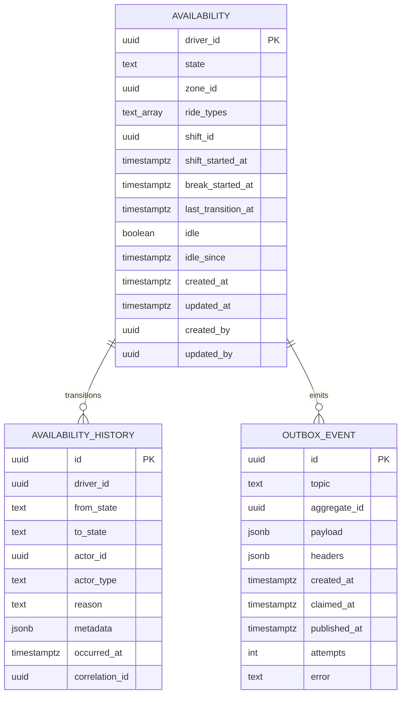

# driver-availability-service — Entity-Relationship Diagram

## 1. Database

- Engine: PostgreSQL 18
- Schema: `driver_availability` (owned exclusively by this service)
- Migrations: `services/driver-availability-service/migrations/`

## 2. Cross-Service References

| Column | Type | Refers to | Source of truth |
|--------|------|-----------|------------------|
| `availability.driver_id` | UUID (PK) | `driver` in `driver-service` | `driver-service` |
| `availability.zone_id` | UUID | `zone` in `zone-service` | `zone-service` |
| `availability_history.actor_id` | UUID | whoever did it | the actor's service |

## 3. Entities

### `Availability`

The driver's current online state. One row per driver.

#### Columns

| Column | Type | Constraints | Notes |
|--------|------|-------------|-------|
| `driver_id` | UUID | PK | UUIDv7 |
| `state` | TEXT | NOT NULL, CHECK (state IN ('offline','online_available','online_busy','on_break')) | state machine |
| `zone_id` | UUID | NULL | set on `online_available` |
| `ride_types` | TEXT[] | NOT NULL DEFAULT '{}' | economy/premium/xl/shared |
| `shift_id` | UUID | NOT NULL | the current shift UUIDv7 |
| `shift_started_at` | TIMESTAMPTZ | NULL | when this shift began |
| `break_started_at` | TIMESTAMPTZ | NULL | when on_break started |
| `last_transition_at` | TIMESTAMPTZ | NOT NULL DEFAULT now() | |
| `idle` | BOOLEAN | NOT NULL DEFAULT false | true when idle-flagged |
| `idle_since` | TIMESTAMPTZ | NULL | |
| `created_at` | TIMESTAMPTZ | NOT NULL DEFAULT now() | |
| `updated_at` | TIMESTAMPTZ | NOT NULL DEFAULT now() | |
| `created_by` | UUID | NOT NULL | identity |
| `updated_by` | UUID | NOT NULL | identity |

#### Indexes

- PK on `driver_id`
- `idx_availability_state_zone` on `(state, zone_id)` — supports
  "online drivers in zone" queries.
- `idx_availability_idle` on `(idle)` partial `WHERE idle = true`.

#### Constraints

- `CHECK (state IN ('offline','online_available','online_busy','on_break'))`
- `CHECK ((state = 'online_available' AND zone_id IS NOT NULL) OR
  (state <> 'online_available'))`

### `AvailabilityHistory`

Append-only audit trail of every state transition.

#### Columns

| Column | Type | Constraints | Notes |
|--------|------|-------------|-------|
| `id` | UUID | PK | UUIDv7 |
| `driver_id` | UUID | NOT NULL | |
| `from_state` | TEXT | NULL | null for the initial creation |
| `to_state` | TEXT | NOT NULL | |
| `actor_id` | UUID | NOT NULL | |
| `actor_type` | TEXT | NOT NULL, CHECK (actor_type IN ('driver','admin','support','safety','system')) | |
| `reason` | TEXT | NULL | free text |
| `metadata` | JSONB | NULL | e.g. `{"zone_from":...,"zone_to":...}` |
| `occurred_at` | TIMESTAMPTZ | NOT NULL DEFAULT now() | |
| `correlation_id` | UUID | NOT NULL | |

#### Indexes

- PK on `id`
- `idx_history_driver_time` on `(driver_id, occurred_at DESC)`

### `OutboxEvent`

#### Columns

| Column | Type | Constraints | Notes |
|--------|------|-------------|-------|
| `id` | UUID | PK | UUIDv7 |
| `topic` | TEXT | NOT NULL | |
| `aggregate_id` | UUID | NOT NULL | partition key = `driver_id` |
| `payload` | JSONB | NOT NULL | |
| `headers` | JSONB | NOT NULL DEFAULT '{}'::jsonb | |
| `created_at` | TIMESTAMPTZ | NOT NULL DEFAULT now() | |
| `claimed_at` | TIMESTAMPTZ | NULL | |
| `published_at` | TIMESTAMPTZ | NULL | |
| `attempts` | INT | NOT NULL DEFAULT 0 | |
| `error` | TEXT | NULL | |

#### Indexes

- PK on `id`
- `idx_outbox_pending` on `(created_at)` partial `WHERE
  published_at IS NULL`.

## 4. Mermaid ER Diagram



## 5. DDL Sketch

```sql
CREATE SCHEMA IF NOT EXISTS driver_availability;
SET search_path TO driver_availability;

CREATE TABLE driver_availability.availability (
    driver_id UUID PRIMARY KEY,
    state TEXT NOT NULL,
    zone_id UUID,
    ride_types TEXT[] NOT NULL DEFAULT '{}',
    shift_id UUID NOT NULL,
    shift_started_at TIMESTAMPTZ,
    break_started_at TIMESTAMPTZ,
    last_transition_at TIMESTAMPTZ NOT NULL DEFAULT now(),
    idle BOOLEAN NOT NULL DEFAULT false,
    idle_since TIMESTAMPTZ,
    created_at TIMESTAMPTZ NOT NULL DEFAULT now(),
    updated_at TIMESTAMPTZ NOT NULL DEFAULT now(),
    created_by UUID NOT NULL,
    updated_by UUID NOT NULL,
    CONSTRAINT chk_state CHECK (state IN
        ('offline','online_available','online_busy','on_break')),
    CONSTRAINT chk_zone_online CHECK (
        state = 'online_available' AND zone_id IS NOT NULL
        OR state <> 'online_available'
    )
);
CREATE INDEX idx_availability_state_zone
    ON driver_availability.availability (state, zone_id);
CREATE INDEX idx_availability_idle
    ON driver_availability.availability (idle)
    WHERE idle = true;

CREATE TABLE driver_availability.availability_history (
    id UUID NOT NULL,
    driver_id UUID NOT NULL,
    from_state TEXT,
    to_state TEXT NOT NULL,
    actor_id UUID NOT NULL,
    actor_type TEXT NOT NULL,
    reason TEXT,
    metadata JSONB,
    occurred_at TIMESTAMPTZ NOT NULL DEFAULT now(),
    correlation_id UUID NOT NULL,
    PRIMARY KEY (id, occurred_at),
    CONSTRAINT chk_actor_type CHECK (actor_type IN
        ('driver','admin','support','safety','system'))
) PARTITION BY RANGE (occurred_at);
CREATE INDEX idx_history_driver_time
    ON driver_availability.availability_history (driver_id, occurred_at DESC);

CREATE TABLE IF NOT EXISTS driver_availability.availability_history_2026_08_04
    PARTITION OF driver_availability.availability_history
    FOR VALUES FROM ('2026-08-04 00:00:00+00') TO ('2026-08-05 00:00:00+00');

CREATE TABLE driver_availability.outbox (
    id UUID PRIMARY KEY,
    topic TEXT NOT NULL,
    aggregate_id UUID NOT NULL,
    payload JSONB NOT NULL,
    headers JSONB NOT NULL DEFAULT '{}'::jsonb,
    created_at TIMESTAMPTZ NOT NULL DEFAULT now(),
    claimed_at TIMESTAMPTZ,
    published_at TIMESTAMPTZ,
    attempts INT NOT NULL DEFAULT 0,
    error TEXT
);
CREATE INDEX idx_outbox_pending
    ON driver_availability.outbox (created_at)
    WHERE published_at IS NULL;
```

## 6. Audit Columns

Every mutable table has `created_at`, `updated_at`, `created_by`,
`updated_by`. `availability_history` is append-only.

## 7. Soft Delete

Not used. The state is the source of truth; suspended is a hard
state.

## 8. JSONB Usage

- `availability_history.metadata`: state-specific payload
  (e.g. zone change, ride types change).
- `outbox.payload`: full event envelope.

## 9. Partitioning

| Table | Strategy | Cadence | Pre-create | Retention |
|-------|----------|---------|------------|-----------|
| `availability_history` | RANGE on `occurred_at` | daily | 30 days | 7 years |

See [`DATABASE_ARCHITECTURE.md` §"Table Partitioning — Canonical Template"](../../architecture/DATABASE_ARCHITECTURE.md) for the idempotent `CREATE TABLE IF NOT EXISTS … PARTITION OF …` pattern, naming convention, and the service-owned maintenance-job contract.

## 10. Data Retention

| Table | Retention | Purged by |
|-------|-----------|-----------|
| `availability` | 7 years (driver retired) | scheduled; per-driver hard delete |
| `availability_history` | 7 years | with the driver |
| `outbox` | 24h after publish | poller purge |

## 11. Migration Considerations

- The `state` CHECK is the source of truth for the state machine;
  adding a new state requires a multi-step migration.
- The `ride_types` array is small and well-known; adding a new
  type is an additive change.
- Indexes on `state` and `(state, zone_id)` are hot; keep them in
  sync with the per-zone query.

---

## See also

### Sibling docs for this service

- [`README.md`](./README.md) — purpose, bounded context, responsibilities
- [`BRD.md`](./BRD.md) — business requirements
- [`SRS.md`](./SRS.md) — functional + non-functional requirements
- [`ERD.md`](./ERD.md) — data model (entities, relationships)
- [`INTEGRATION.md`](./INTEGRATION.md) — inter-service contracts (APIs, events, sagas)
- [`WORKFLOWS.md`](./WORKFLOWS.md) — operational workflows (happy paths, failure modes)
- [`TECH.md`](./TECH.md) — technology profile (runtime, libraries, data layer, admin endpoints, RBAC)

### Platform-wide

- [`../../shared/README.md`](../../shared/README.md) — `platform-spring-boot-starter` shared library (the single source of cross-cutting code for all Spring Boot services in the platform)
- [`../RECOMMENDATIONS.md`](../RECOMMENDATIONS.md) — platform-wide technology map (language, framework, version baseline, admin/RBAC pattern)
- [`../../README.md`](../../README.md) — services overview (the catalog of all 58 services)
- [`../../../main.md`](../../../main.md) — top-level platform specification (architecture, Keycloak, PostgreSQL 18, messaging, observability baseline)

