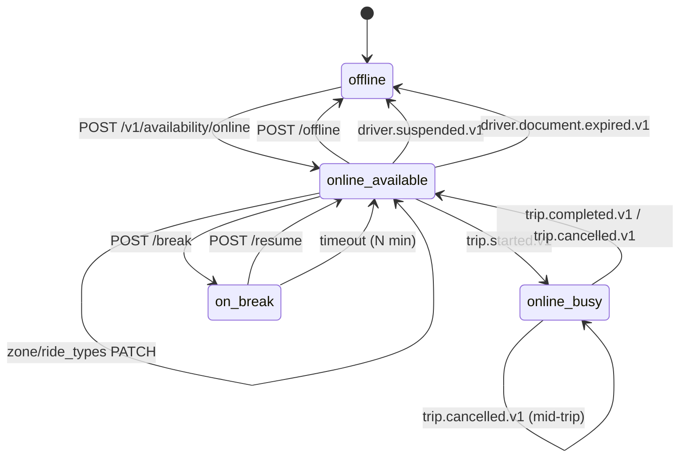

# driver-availability-service — Software Requirements Specification

## 1. Introduction

This document specifies the requirements for `driver-availability-service`.
The service must be correct, fast, and consistent: dispatch and
`driver-location-service` both rely on its state events.

## 2. Scope

In scope:

- The driver online state machine.
- Zone and ride-type changes.
- Breaks.
- Reacting to driver lifecycle and trip events.
- Emitting availability events.

Out of scope:

- Driver profile.
- Driver location stream.
- The trip aggregate.

## 3. System Context

```mermaid
flowchart LR
    DR[Driver app] --> DA[driver-availability-service]
    DRV[driver-service] -. driver.approved.v1 / driver.suspended.v1 / driver.document.expired.v1 .-> DA
    TR[trip-service] -. trip.started.v1 / trip.completed.v1 / trip.cancelled.v1 .-> DA
    DA --> DRV
    DA --> ZN[zone-service]
    DA -. driver.availability.*.v1 .-> K[(Kafka)]
    K --> DSP[dispatch-service]
    K --> DL[driver-location-service]
    K --> NOT[notification-service]
```

## 4. Actors

- **Driver app** — JWT role `driver`. Reads/writes own state.
- **Admin / support / safety** — JWT roles. Force-offline with
  reason.
- **driver-service**, **trip-service** — system actors via events.

## 5. Functional Requirements

| ID | Requirement | Priority |
|----|-------------|----------|
| FR--001 | `POST /v1/availability/online` with `{vehicle_id, ride_types[], zone_id}`; transition to `online_available`; emit `driver.availability.online.v1`. | MUST |
| FR--002 | Refuse `online` if the driver is not `approved` (consume `driver.approved.v1`). | MUST |
| FR--003 | Refuse `online` if the driver is `suspended` (consume `driver.suspended.v1`). | MUST |
| FR--004 | Refuse `online` if the zone is not served. | MUST |
| FR--005 | `POST /v1/availability/offline`; transition to `offline`; emit `driver.availability.offline.v1`. | MUST |
| FR--006 | Refuse `offline` if state is `online_busy`; return 409 `CANNOT_OFFLINE_BUSY`. | MUST |
| FR--007 | `PATCH /v1/availability/{id}/zone`; transition within `online_available`; emit `driver.availability.zone.changed.v1`. | MUST |
| FR--008 | Refuse zone change if state is `online_busy`; return 409 `CANNOT_CHANGE_ZONE_BUSY`. | MUST |
| FR--009 | `PATCH /v1/availability/{id}/ride-types`; replace the list; emit `driver.availability.ride_types.changed.v1`. | MUST |
| FR--010 | `POST /v1/availability/{id}/break`; transition to `on_break`; auto-end at N minutes; emit `driver.availability.busy.v1` (busy for the break). | MUST |
| FR--011 | `POST /v1/availability/{id}/resume`; transition to `online_available`. | MUST |
| FR--012 | On `driver.suspended.v1`, if the driver is online, force offline and emit `driver.availability.offline.v1` with `reason=suspended`. | MUST |
| FR--013 | On `driver.document.expired.v1`, if the driver is online, force offline and emit `driver.availability.offline.v1` with `reason=document_expired`. | MUST |
| FR--014 | On `trip.started.v1`, transition to `online_busy` and emit `driver.availability.busy.v1`. | MUST |
| FR--015 | On `trip.completed.v1`, transition to `online_available` (unless on break) and emit `driver.availability.available.v1`. | MUST |
| FR--016 | On pre-pickup `trip.cancelled.v1`, transition to `online_available` and emit `driver.availability.available.v1`. | MUST |
| FR--017 | On mid-trip `trip.cancelled.v1`, transition to `online_available` and emit `driver.availability.available.v1`. | MUST |
| FR--018 | Refuse all invalid transitions with 409 `STATE_INVALID`. | MUST |
| FR--019 | All state transitions are written through the transactional outbox. | MUST |
| FR--020 | Idle detection: if online_available and no `driver.location.updated.v1` for N minutes, set an `idle=true` flag and emit a metric. | SHOULD |

## 6. Non-Functional Requirements

| ID | Category | Requirement | Target |
|----|----------|-------------|--------|
| NFR--001 | performance | P95 latency for online/offline | ≤ 200ms |
| NFR--002 | performance | P99 latency for state reads | ≤ 50ms |
| NFR--003 | availability | uptime | 99.95% (Tier-1) |
| NFR--004 | scalability | concurrent online drivers | 1M per region |
| NFR--005 | maintainability | MTTR for a bad deploy | ≤ 15 minutes |
| NFR--006 | observability | tracing coverage | 100% |
| NFR--007 | consistency | event publish lag | p99 ≤ 1s after state change |

## 7. API Requirements

REST per `architecture/API_STANDARDS.md`. Idempotency-Key required on
`POST /v1/availability/{id}/break` and `POST /v1/availability/{id}/resume`.
GETs are safe. Errors use the standard envelope. Full contract in
`INTEGRATION.md`.

## 8. Data Requirements

| ID | Requirement | Notes |
|----|-------------|-------|
| DATA--001 | One row per driver (UUIDv7 PK = driver_id) | |
| DATA--002 | State encoded as TEXT with CHECK | see state machine |
| DATA--003 | `ride_types` stored as TEXT[] | PostgreSQL array |
| DATA--004 | `zone_id` stored as UUID | cross-service ref to `zone-service` |
| DATA--005 | `shift_id` stored as UUID | internal |
| DATA--006 | Audit columns on every mutable table | platform standard |
| DATA--007 | State transitions history is append-only | `availability_history` |
| DATA--008 | No PII stored | only driver_id and zone_id |

## 9. Validation Rules

- `ride_types` must be a non-empty subset of the driver's approved
  types (from `driver-service`).
- `zone_id` must be a served zone.
- `break` is allowed only in `online_available`.
- `resume` is allowed only in `on_break`.

## 10. State Transitions



## 11. Authorization Requirements

- Driver can read/write own state.
- Admin can force-offline with `X-Audit-Reason` and emit a
  high-severity audit event.
- The `online` and `offline` endpoints are not callable while in
  `online_busy`.

## 12. Configuration Requirements

Consumed from `configuration-service` and refreshed on
`configuration.updated.v1`. See `README.md` §13.

## 13. Error Handling

| Error | Response | Recovery |
|-------|----------|----------|
| Driver not approved | 403 `DRIVER_NOT_APPROVED` | none |
| Driver suspended | 403 `DRIVER_SUSPENDED` | none |
| Zone unserved | 422 `ZONE_UNSERVED` | none |
| Offline while busy | 409 `CANNOT_OFFLINE_BUSY` | wait for trip |
| Invalid transition | 409 `STATE_INVALID` | refresh |
| Idempotency conflict | 422 `IDEMPOTENCY_KEY_REUSED` | new key |

## 14. Concurrency Requirements

- One row per driver; updates use `SELECT … FOR UPDATE`.
- Event consumers use the inbox + dedup pattern; replays are
  idempotent.

## 15. Idempotency Requirements

- `Idempotency-Key` required for `break` and `resume`.
- All event handlers are idempotent by `(driver_id, event_id)`.

## 16. Performance

- Dominant path: `POST /v1/availability/online` and the per-zone
  "online drivers" query.
- P50 / P95 / P99: 100ms / 200ms / 400ms.

## 17. Scalability

- Horizontal: stateless, scale by HPA on CPU.
- The "online drivers" query is cached in Redis for 5s per zone.

## 18. Availability

- SLO: 99.95% over 30 days.
- Error budget: ~22 minutes per 30 days.
- Maintenance window: weekly Sun 04:00–06:00 UTC.

## 19. Security

| ID | Requirement | Notes |
|----|-------------|-------|
| SEC--001 | All endpoints require a valid JWT bearer token | gateway validates |
| SEC--002 | Driver ownership is enforced | `driver_id == sub` |
| SEC--003 | Admin actions require `X-Audit-Reason` | |
| SEC--004 | No PII stored | |
| SEC--005 | Idempotency keys are opaque UUIDs | |
| SEC--006 | TLS 1.3 at edge; mTLS in cluster | platform standard |

## 20. Privacy

- PII stored: none. Driver ID is a UUID, not a PII field.
- Retention: 7 years for the row; forever for the history (audit).

## 21. Auditability

- Every state transition is logged and recorded in
  `availability_history`.
- Every force-offline is logged at `warn`.

## 22. Observability

- Logs: JSON to stdout with `correlation_id`, `driver_id`, `route`,
  `latency_ms`, `status`.
- Metrics: see `README.md` §15.
- Traces: OpenTelemetry.
- Alerts: SLO burn-rate, force-offline rate, idle-driver spike.

## 23. Maintainability

- Code style: TypeScript with `strict: true`; ESLint + Prettier.
- Test coverage: ≥ 80% line / branch; 100% on the state machine.
- Documentation: this folder.

## 24. Disaster Recovery

- RPO: ≤ 1 minute.
- RTO: ≤ 15 minutes. A driver can re-go-online; we replay events
  from the inbox.

## 25. Acceptance Criteria

- The state machine refuses all invalid transitions with 409
  `STATE_INVALID`.
- A driver in `online_busy` cannot go offline; the API returns 409.
- A driver idle for N minutes is flagged.
- All state transitions emit events and are recorded in
  `availability_history`.

---

## See also

### Sibling docs for this service

- [`README.md`](./README.md) — purpose, bounded context, responsibilities
- [`BRD.md`](./BRD.md) — business requirements
- [`SRS.md`](./SRS.md) — functional + non-functional requirements
- [`ERD.md`](./ERD.md) — data model (entities, relationships)
- [`INTEGRATION.md`](./INTEGRATION.md) — inter-service contracts (APIs, events, sagas)
- [`WORKFLOWS.md`](./WORKFLOWS.md) — operational workflows (happy paths, failure modes)
- [`TECH.md`](./TECH.md) — technology profile (runtime, libraries, data layer, admin endpoints, RBAC)

### Platform-wide

- [`../../shared/README.md`](../../shared/README.md) — `platform-spring-boot-starter` shared library (the single source of cross-cutting code for all Spring Boot services in the platform)
- [`../RECOMMENDATIONS.md`](../RECOMMENDATIONS.md) — platform-wide technology map (language, framework, version baseline, admin/RBAC pattern)
- [`../../README.md`](../../README.md) — services overview (the catalog of all 58 services)
- [`../../../main.md`](../../../main.md) — top-level platform specification (architecture, Keycloak, PostgreSQL 18, messaging, observability baseline)

