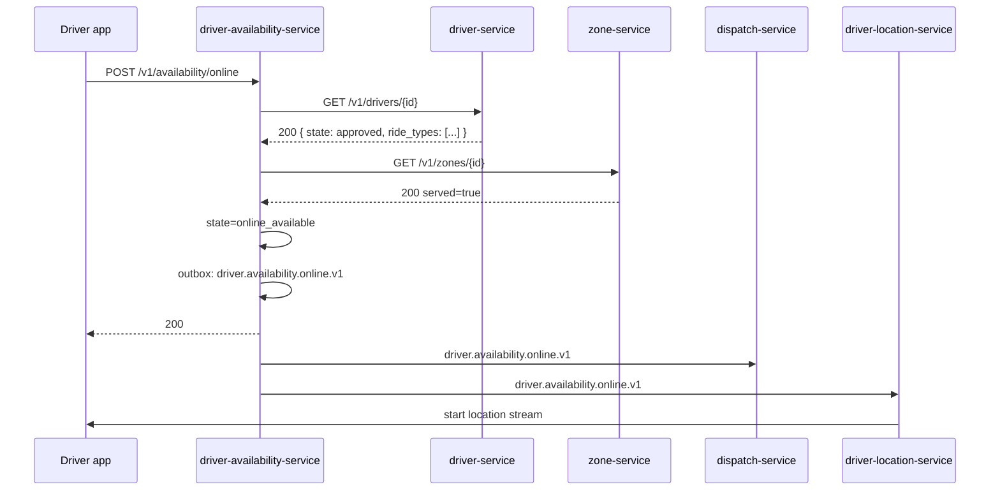
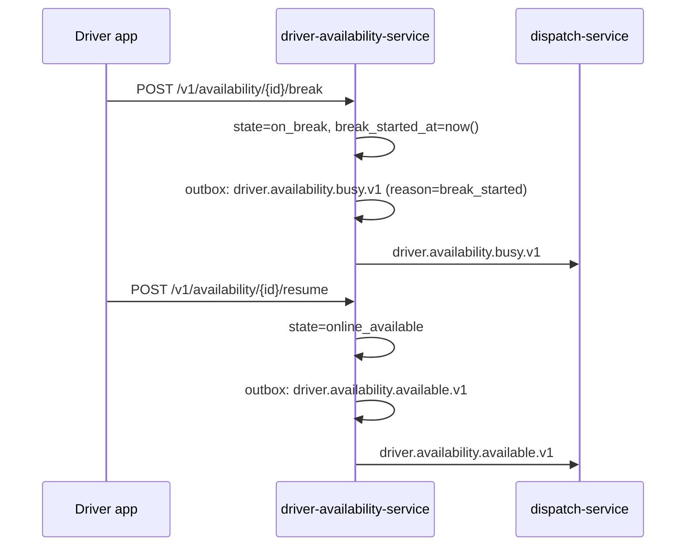

# driver-availability-service — Workflows

## 1. Driver Goes Online

### 1.1 Objective

Move a driver from `offline` to `online_available` and notify
`dispatch-service` so the driver is now a candidate for ride offers.

### 1.2 Initiating Actor

The driver app.

### 1.3 Participating Services

- `driver-availability-service` (this service)
- `driver-service` (validate approved / not suspended)
- `zone-service` (validate zone)
- `dispatch-service` (event consumer)
- `driver-location-service` (event consumer; starts location
  streaming)

### 1.4 Prerequisites

- The driver is `approved` and not `suspended` (we check via cached
  data and a sync call to `driver-service`).
- The driver has at least one accepted ride type.
- The zone is served.

### 1.5 Happy Path



### 1.6 Alternate Paths

- Driver not approved: 403 `DRIVER_NOT_APPROVED`.
- Driver suspended: 403 `DRIVER_SUSPENDED`.
- Zone not served: 422 `ZONE_UNSERVED`.
- Already online: 409 `STATE_INVALID`.

### 1.7 Failure Paths

- `driver-service` down: circuit open; the request is rejected with
  503 `DEPENDENCY_TIMEOUT`. The driver is told to retry.
- `zone-service` down: same.

### 1.8 Business Rules

- BR--010, BR--011, BR--012.

### 1.9 State Transitions

`offline → online_available`.

### 1.10 Events

| Event | Direction | When |
|-------|-----------|------|
| `driver.availability.online.v1` | produced | on success |

### 1.11 APIs Involved

| API | Direction | When |
|-----|-----------|------|
| `POST /v1/availability/online` | inbound | trigger |
| `GET /v1/drivers/{id}` | outbound | validate |
| `GET /v1/zones/{id}` | outbound | validate |

### 1.12 Compensation / Rollback

If the outbox publish fails after the row is committed, the poller
retries. The driver is online; dispatch may not see the event for a
few seconds; the row is the source of truth.

### 1.13 Final State

`online_available`. The `shift_id` is recorded; `zone_id` and
`ride_types` are set.

## 2. Driver Suspended Mid-Shift

### 2.1 Objective

Force a driver offline when they are suspended, within 30s of
`driver.suspended.v1`. Their active trip (if any) is unaffected.

### 2.2 Initiating Actor

`driver-service` emits `driver.suspended.v1`.

### 2.3 Participating Services

- `driver-service` (event producer)
- `driver-availability-service` (this service)
- `dispatch-service` (event consumer)
- `driver-location-service` (event consumer; stops streaming)
- `notification-service` (notify driver)

### 2.4 Prerequisites

- The driver is currently online (in any of `online_available`,
  `online_busy`, `on_break`).

### 2.5 Happy Path

```mermaid
sequenceDiagram
    participant DRV as driver-service
    participant DA as driver-availability-service
    participant DSP as dispatch-service
    participant DL as driver-location-service
    participant NOT as notification-service

    DRV->>DA: driver.suspended.v1
    DA->>DA: row-lock; state=offline, reason=suspended
    DA->>DA: outbox: driver.availability.offline.v1
    DA->>DSP: driver.availability.offline.v1
    DA->>DL: driver.availability.offline.v1
    DA->>NOT: notify driver
```

### 2.6 Alternate Paths

- Driver already offline: no-op (idempotent).
- Driver in `online_busy`: state → `offline`; the active trip is
  unaffected. The driver cannot accept new offers.

### 2.7 Failure Paths

- DB down: retry; on persistent failure, page on-call.

### 2.8 Business Rules

- BR--016: ≤ 30s after `driver.suspended.v1`.

### 2.9 State Transitions

`* (online) → offline` with `reason=suspended`.

### 2.10 Events

| Event | Direction | When |
|-------|-----------|------|
| `driver.availability.offline.v1` | produced | on success |
| `driver.suspended.v1` | consumed | trigger |

### 2.11 APIs Involved

None (event-driven).

### 2.12 Compensation / Rollback

If the outbox publish fails, the poller retries. The driver is
offline in the database; dispatch may not see the event for a few
seconds; reconciliation detects the discrepancy.

### 2.13 Final State

`offline`. The driver cannot go online again until reinstated by
`driver-service` (`driver.reinstated.v1`).

## 3. Trip Start → Busy

### 3.1 Objective

Mark the driver `busy` when a trip starts, so dispatch stops sending
offers.

### 3.2 Initiating Actor

`trip-service` emits `trip.started.v1`.

### 3.3 Participating Services

- `trip-service` (event producer)
- `driver-availability-service` (this service)
- `dispatch-service` (event consumer)

### 3.4 Prerequisites

- The driver is in `online_available`.

### 3.5 Happy Path

```mermaid
sequenceDiagram
    participant TR as trip-service
    participant DA as driver-availability-service
    participant DSP as dispatch-service

    TR->>DA: trip.started.v1
    DA->>DA: row-lock; state=online_busy
    DA->>DA: outbox: driver.availability.busy.v1
    DA->>DSP: driver.availability.busy.v1
    DSP->>DSP: remove driver from candidate list
```

### 3.6 Alternate Paths

- Driver not in `online_available`: log; no transition (e.g.
  driver in `on_break` but the trip is from before the break).
- Event duplicate: inbox dedup.

### 3.7 Failure Paths

- DB down: retry; on persistent failure, page on-call.

### 3.8 Business Rules

- BR--018: ≤ 1s after `trip.started.v1`.

### 3.9 State Transitions

`online_available → online_busy`.

### 3.10 Events

| Event | Direction | When |
|-------|-----------|------|
| `driver.availability.busy.v1` | produced | on success |
| `trip.started.v1` | consumed | trigger |

### 3.11 APIs Involved

None.

### 3.12 Compensation / Rollback

If the outbox publish fails, the poller retries. The driver is
`online_busy` in the database; dispatch may not see the event for a
few seconds; reconciliation detects the discrepancy.

### 3.13 Final State

`online_busy`. The driver is in a trip.

## 4. Trip End → Available

### 4.1 Objective

Mark the driver `available` when a trip ends, so dispatch resumes
sending offers.

### 4.2 Initiating Actor

`trip-service` emits `trip.completed.v1` (or pre-pickup
`trip.cancelled.v1`, or mid-trip `trip.cancelled.v1`).

### 4.3 Participating Services

- `trip-service` (event producer)
- `driver-availability-service` (this service)
- `dispatch-service` (event consumer)

### 4.4 Prerequisites

- The driver is in `online_busy`.

### 4.5 Happy Path

```mermaid
sequenceDiagram
    participant TR as trip-service
    participant DA as driver-availability-service
    participant DSP as dispatch-service

    TR->>DA: trip.completed.v1
    DA->>DA: row-lock; if on_break, no transition; else state=online_available
    DA->>DA: outbox: driver.availability.available.v1
    DA->>DSP: driver.availability.available.v1
    DSP->>DSP: add driver to candidate list
```

### 4.6 Alternate Paths

- Driver in `on_break`: no transition; emit
  `driver.availability.available.v1` is **not** emitted (the driver
  is still on break).
- Event duplicate: inbox dedup.

### 4.7 Failure Paths

- DB down: retry; on persistent failure, page on-call.

### 4.8 Business Rules

- BR--019: ≤ 1s after `trip.completed.v1`.

### 4.9 State Transitions

`online_busy → online_available` (or stay `on_break`).

### 4.10 Events

| Event | Direction | When |
|-------|-----------|------|
| `driver.availability.available.v1` | produced | on transition |
| `trip.completed.v1` | consumed | trigger |
| `trip.cancelled.v1` | consumed | trigger |

### 4.11 APIs Involved

None.

### 4.12 Compensation / Rollback

If the outbox publish fails, the poller retries.

### 4.13 Final State

`online_available` (or `on_break` if the driver was on break).

## 5. Driver Break

### 5.1 Objective

Allow a driver to take a break (e.g. for food or a rest) without
losing their shift; auto-end at the policy limit.

### 5.2 Initiating Actor

The driver app.

### 5.3 Participating Services

- `driver-availability-service` (this service)
- `dispatch-service` (event consumer)
- `notification-service` (remind the driver as the break approaches
  the limit)

### 5.4 Prerequisites

- The driver is in `online_available`.

### 5.5 Happy Path



### 5.6 Alternate Paths

- Break already in progress: 409 `ALREADY_ON_BREAK`.
- Break ends automatically at the policy limit: state →
  `online_available`; emit `driver.availability.available.v1` with
  `reason=break_timeout`.

### 5.7 Failure Paths

- DB down: retry; on persistent failure, page on-call.

### 5.8 Business Rules

- BR--015: at most N minutes.
- BR--035: auto-end at N minutes.

### 5.9 State Transitions

`online_available → on_break → online_available`.

### 5.10 Events

| Event | Direction | When |
|-------|-----------|------|
| `driver.availability.busy.v1` | produced | on break start |
| `driver.availability.available.v1` | produced | on break end |

### 5.11 APIs Involved

| API | Direction | When |
|-----|-----------|------|
| `POST /v1/availability/{id}/break` | inbound | start |
| `POST /v1/availability/{id}/resume` | inbound | end |

### 5.12 Compensation / Rollback

If the outbox publish fails, the poller retries.

### 5.13 Final State

`online_available` (or `on_break` if the driver does not resume and
the policy timer has not yet fired).


## 99. Driver Availability State Machine

This state machine summarizes the service's internal
state transitions (across all workflows above).

```mermaid
stateDiagram-v2
    [*] --> Offline: driver not online
    Offline --> Online: POST /v1/availability/online
    Online --> Busy: dispatch.matched.v1
    Busy --> Online: trip.completed.v1
    Online --> Offline: POST /v1/availability/offline
    Busy --> Offline: driver goes offline mid-trip (rare; 409)
    Online --> Suspended: driver.suspended.v1
    Busy --> Suspended: driver.suspended.v1
    Suspended --> Offline: driver.suspended.v1 (auto-offline)
    Offline --> [*]
```



---

## 99. `daily` Partition Maintenance

### 99.1 Objective

Idempotently pre-create the next 30 days for partitioned tables in `driver_availability`.

### 99.2 Initiating Actor

A scheduled job runs daily at `02:00 UTC`. Leader-elected via `pg_try_advisory_xact_lock(hashtext('driver_availability.partition'), hashtext('daily'))`.

### 99.3 Happy Path

```mermaid
sequenceDiagram
    participant JOB as Partition job
    participant PG as PostgreSQL
    JOB->>PG: pg_try_advisory_xact_lock('driver_availability.daily')
    alt lock acquired
        loop for each missing day in next 30
            JOB->>PG: CREATE TABLE IF NOT EXISTS driver_availability.availability_history_YYYY_MM_DD PARTITION OF driver_availability.availability_history
            JOB->>PG: verify (pg_inherits, relpartbound)
        end
        JOB->>PG: assert now() in existing child
    else lock NOT acquired
        Note over JOB: another instance is running; exit cleanly
    end
```

### 99.4 Failure Paths

| Failure | Handling |
|---------|----------|
| Lock contention | exit 0 |
| DDL fails | retry 3× with backoff (1 s / 4 s / 16 s); page on-call |
| Today's child missing | critical alert; INSERTs would fail |

### 99.5 Business Rules

- Pre-create 30 complete future days.
- Every child is created with `CREATE TABLE IF NOT EXISTS … PARTITION OF …`.
- A verification step (`pg_inherits` parent + `relpartbound` range) runs after every `CREATE TABLE IF NOT EXISTS`.
- Optionally emit `audit.partition.maintained.v1` on success.

---

## See also

### Sibling docs for this service

- [`README.md`](./README.md) — purpose, bounded context, responsibilities
- [`BRD.md`](./BRD.md) — business requirements
- [`SRS.md`](./SRS.md) — functional + non-functional requirements
- [`ERD.md`](./ERD.md) — data model (entities, relationships)
- [`INTEGRATION.md`](./INTEGRATION.md) — inter-service contracts (APIs, events, sagas)
- [`WORKFLOWS.md`](./WORKFLOWS.md) — operational workflows (happy paths, failure modes)
- [`TECH.md`](./TECH.md) — technology profile (runtime, libraries, data layer, admin endpoints, RBAC)

### Platform-wide

- [`../../shared/README.md`](../../shared/README.md) — `platform-spring-boot-starter` shared library (the single source of cross-cutting code for all Spring Boot services in the platform)
- [`../RECOMMENDATIONS.md`](../RECOMMENDATIONS.md) — platform-wide technology map (language, framework, version baseline, admin/RBAC pattern)
- [`../../README.md`](../../README.md) — services overview (the catalog of all 58 services)
- [`../../../main.md`](../../../main.md) — top-level platform specification (architecture, Keycloak, PostgreSQL 18, messaging, observability baseline)

