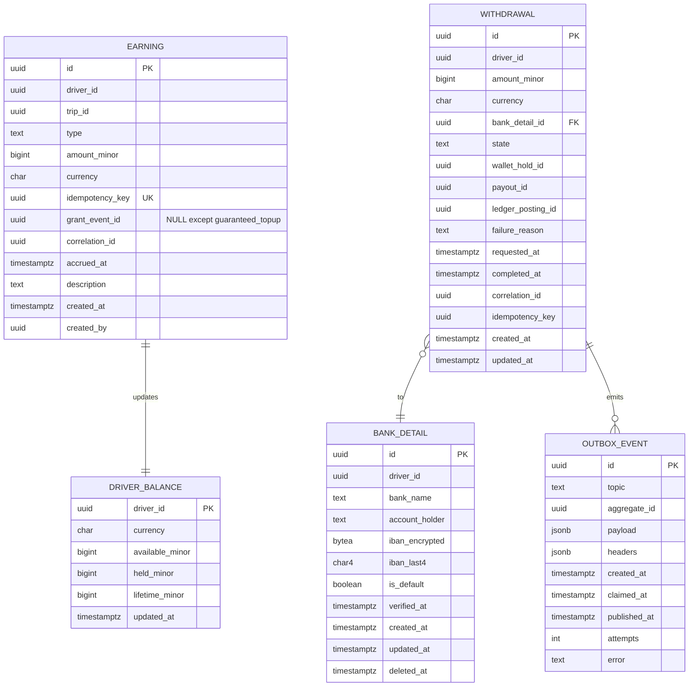

# driver-earnings-service — Entity-Relationship Diagram

## 1. Database

- Engine: PostgreSQL 18
- Schema: `driver_earnings` (owned exclusively by this service).
- Migrations: `services/driver-earnings-service/migrations/`.
- Partitioning: yes — `driver_earnings.earnings` is
  range-partitioned by month on `accrued_at`.

## 2. Cross-Service References

| Column | Type | Refers to | Source of truth |
|--------|------|-----------|------------------|
| `earnings.driver_id` | UUID | `driver` in `driver-service` | `driver-service` |
| `earnings.trip_id` | UUID | `trip` in `trip-service` | `trip-service` |
| `earnings.payment_intent_id` | UUID (nullable) | `payment_intent` in `payment-service` | `payment-service` |
| `earnings.grant_event_id` | UUID (nullable) | `grant_event_id` of a `trip.reward.granted.v1` from `trip-service` | `trip-service` |
| `withdrawals.driver_id` | UUID | `driver` in `driver-service` | `driver-service` |
| `withdrawals.bank_detail_id` | UUID | `bank_detail` (in this schema) | this service |
| `withdrawals.wallet_hold_id` | UUID (nullable) | `hold` in `wallet-service` | `wallet-service` |
| `withdrawals.payout_id` | UUID (nullable) | `payout` in `payment-service` | `payment-service` |
| `withdrawals.ledger_posting_id` | UUID (nullable) | `posting` in `ledger-service` | `ledger-service` |

## 3. Entities

### `Earning`

An entry in the driver's earnings ledger. Append-only.

#### Columns

| Column | Type | Constraints | Notes |
|--------|------|-------------|-------|
| `id` | UUID | PK | UUIDv7 |
| `driver_id` | UUID | NOT NULL | |
| `trip_id` | UUID | NULL | nullable for corrections / bonuses not tied to a trip |
| `type` | TEXT | NOT NULL, CHECK (type IN ('fare','tip','bonus','penalty','correction','incentive','guaranteed_topup')) | `guaranteed_topup` is set for `trip.reward.granted.v1` (DATA--008) |
| `amount_minor` | BIGINT | NOT NULL | can be negative for penalty / correction |
| `currency` | CHAR(3) | NOT NULL | ISO 4217 |
| `idempotency_key` | UUID | NOT NULL, UNIQUE | per (driver, trip, type); for `type=guaranteed_topup` the value is `trip:{trip_id}:reward:driver:grant:{grant_event_id}` |
| `grant_event_id` | UUID | NULL | required when `type='guaranteed_topup'`; partial UNIQUE where `type='guaranteed_topup'` (DATA--009); cross-service ref, no FK |
| `correlation_id` | UUID | NOT NULL | |
| `accrued_at` | TIMESTAMPTZ | NOT NULL DEFAULT now() | |
| `description` | TEXT | NULL | free text |
| `created_at` | TIMESTAMPTZ | NOT NULL DEFAULT now() | |
| `created_by` | UUID | NOT NULL | system / admin |

#### Indexes

- PK on `id`
- UNIQUE on `idempotency_key`
- `idx_earning_driver_time` on `(driver_id, accrued_at DESC)`
- `idx_earning_trip` on `(trip_id)` WHERE `trip_id IS NOT NULL`
- `uq_earning_grant_event` partial UNIQUE on `(grant_event_id)` WHERE
  `type = 'guaranteed_topup'` — inbox dedup of `trip.reward.granted.v1`
- `idx_earning_grant_event` on `(grant_event_id)` WHERE
  `grant_event_id IS NOT NULL` — lookup for `trip.reward.reversed.v1`

#### Constraints

- `CHECK (type IN ('fare','tip','bonus','penalty','correction','incentive','guaranteed_topup'))`
- `CHECK ((type = 'guaranteed_topup' AND grant_event_id IS NOT NULL) OR (type <> 'guaranteed_topup'))`

### `DriverBalance`

A denormalised, cached balance per driver. Updated atomically with
each earning / withdrawal.

#### Columns

| Column | Type | Constraints | Notes |
|--------|------|-------------|-------|
| `driver_id` | UUID | PK | |
| `currency` | CHAR(3) | NOT NULL | |
| `available_minor` | BIGINT | NOT NULL DEFAULT 0 | withdrawable |
| `held_minor` | BIGINT | NOT NULL DEFAULT 0 | in active holds |
| `lifetime_minor` | BIGINT | NOT NULL DEFAULT 0 | lifetime earnings |
| `updated_at` | TIMESTAMPTZ | NOT NULL DEFAULT now() | |

#### Constraints

- `CHECK (available_minor >= 0)`
- `CHECK (held_minor >= 0)`

### `Withdrawal`

A withdrawal request.

#### Columns

| Column | Type | Constraints | Notes |
|--------|------|-------------|-------|
| `id` | UUID | PK | UUIDv7 |
| `driver_id` | UUID | NOT NULL | |
| `amount_minor` | BIGINT | NOT NULL | > 0 |
| `currency` | CHAR(3) | NOT NULL | |
| `bank_detail_id` | UUID | NOT NULL | FK to `bank_details.id` |
| `state` | TEXT | NOT NULL, CHECK (state IN ('requested','held','paid','failed')) | state machine |
| `wallet_hold_id` | UUID | NULL | set on `held` |
| `payout_id` | UUID | NULL | set on `paid` |
| `ledger_posting_id` | UUID | NULL | set on `paid` |
| `failure_reason` | TEXT | NULL | |
| `requested_at` | TIMESTAMPTZ | NOT NULL DEFAULT now() | |
| `completed_at` | TIMESTAMPTZ | NULL | |
| `correlation_id` | UUID | NOT NULL | |
| `idempotency_key` | UUID | NOT NULL | client-supplied |
| `created_at` | TIMESTAMPTZ | NOT NULL DEFAULT now() | |
| `updated_at` | TIMESTAMPTZ | NOT NULL DEFAULT now() | |

#### Indexes

- PK on `id`
- `idx_withdrawal_driver_state` on `(driver_id, state)`
- `idx_withdrawal_requested_at` on `(requested_at)`

#### Constraints

- `CHECK (state IN ('requested','held','paid','failed'))`
- `CHECK (amount_minor > 0)`
- `CHECK (completed_at IS NULL OR state IN ('paid','failed'))`

### `BankDetail`

The driver's bank details for withdrawals.

#### Columns

| Column | Type | Constraints | Notes |
|--------|------|-------------|-------|
| `id` | UUID | PK | UUIDv7 |
| `driver_id` | UUID | NOT NULL | |
| `bank_name` | TEXT | NOT NULL | |
| `account_holder` | TEXT | NOT NULL | |
| `iban_encrypted` | BYTEA | NOT NULL | per-column encryption (AES-GCM) |
| `iban_last4` | CHAR(4) | NOT NULL | for display |
| `is_default` | BOOLEAN | NOT NULL DEFAULT false | |
| `verified_at` | TIMESTAMPTZ | NULL | |
| `created_at` | TIMESTAMPTZ | NOT NULL DEFAULT now() | |
| `updated_at` | TIMESTAMPTZ | NOT NULL DEFAULT now() | |
| `deleted_at` | TIMESTAMPTZ | NULL | soft delete |

#### Indexes

- PK on `id`
- `idx_bank_detail_driver` on `(driver_id)` partial `WHERE
  deleted_at IS NULL`

### `OutboxEvent`

#### Columns

| Column | Type | Constraints | Notes |
|--------|------|-------------|-------|
| `id` | UUID | PK | UUIDv7 |
| `topic` | TEXT | NOT NULL | |
| `aggregate_id` | UUID | NOT NULL | partition key = `driver_id` |
| `payload` | JSONB | NOT NULL | |
| `headers` | JSONB | NOT NULL DEFAULT '{}'::jsonb | |
| `created_at` | TIMESTAMPTZ | NOT NULL DEFAULT now() | |
| `claimed_at` | TIMESTAMPTZ | NULL | |
| `published_at` | TIMESTAMPTZ | NULL | |
| `attempts` | INT | NOT NULL DEFAULT 0 | |
| `error` | TEXT | NULL | |

## 4. Mermaid ER Diagram



## 5. DDL Sketch

```sql
CREATE SCHEMA IF NOT EXISTS driver_earnings;
SET search_path TO driver_earnings;

CREATE TABLE driver_earnings.earnings (
    id UUID NOT NULL,
    driver_id UUID NOT NULL,
    trip_id UUID,
    type TEXT NOT NULL,
    amount_minor BIGINT NOT NULL,
    currency CHAR(3) NOT NULL,
    idempotency_key UUID NOT NULL UNIQUE,
    grant_event_id UUID,
    correlation_id UUID NOT NULL,
    accrued_at TIMESTAMPTZ NOT NULL DEFAULT now(),
    description TEXT,
    created_at TIMESTAMPTZ NOT NULL DEFAULT now(),
    created_by UUID NOT NULL,
    PRIMARY KEY (id, accrued_at),
    CONSTRAINT chk_earning_type CHECK (type IN
        ('fare','tip','bonus','penalty','correction','incentive','guaranteed_topup')),
    CONSTRAINT chk_earning_grant_event CHECK (
        (type = 'guaranteed_topup' AND grant_event_id IS NOT NULL)
        OR (type <> 'guaranteed_topup'))
) PARTITION BY RANGE (accrued_at);

-- Idempotent pre-creation; safe to rerun as part of the maintenance job.
CREATE TABLE IF NOT EXISTS driver_earnings.earnings_2026_07
    PARTITION OF driver_earnings.earnings
    FOR VALUES FROM ('2026-07-01 00:00:00+00') TO ('2026-08-01 00:00:00+00');

CREATE INDEX idx_earning_driver_time
    ON driver_earnings.earnings (driver_id, accrued_at DESC);
CREATE INDEX idx_earning_trip
    ON driver_earnings.earnings (trip_id)
    WHERE trip_id IS NOT NULL;
CREATE UNIQUE INDEX uq_earning_grant_event
    ON driver_earnings.earnings (grant_event_id)
    WHERE type = 'guaranteed_topup';
CREATE INDEX idx_earning_grant_event
    ON driver_earnings.earnings (grant_event_id)
    WHERE grant_event_id IS NOT NULL;

CREATE TABLE driver_earnings.driver_balance (
    driver_id UUID PRIMARY KEY,
    currency CHAR(3) NOT NULL,
    available_minor BIGINT NOT NULL DEFAULT 0,
    held_minor BIGINT NOT NULL DEFAULT 0,
    lifetime_minor BIGINT NOT NULL DEFAULT 0,
    updated_at TIMESTAMPTZ NOT NULL DEFAULT now(),
    CONSTRAINT chk_available_nonneg CHECK (available_minor >= 0),
    CONSTRAINT chk_held_nonneg CHECK (held_minor >= 0)
);

CREATE TABLE driver_earnings.bank_details (
    id UUID PRIMARY KEY,
    driver_id UUID NOT NULL,
    bank_name TEXT NOT NULL,
    account_holder TEXT NOT NULL,
    iban_encrypted BYTEA NOT NULL,
    iban_last4 CHAR(4) NOT NULL,
    is_default BOOLEAN NOT NULL DEFAULT false,
    verified_at TIMESTAMPTZ,
    created_at TIMESTAMPTZ NOT NULL DEFAULT now(),
    updated_at TIMESTAMPTZ NOT NULL DEFAULT now(),
    deleted_at TIMESTAMPTZ
);
CREATE INDEX idx_bank_detail_driver
    ON driver_earnings.bank_details (driver_id)
    WHERE deleted_at IS NULL;

CREATE TABLE driver_earnings.withdrawals (
    id UUID PRIMARY KEY,
    driver_id UUID NOT NULL,
    amount_minor BIGINT NOT NULL,
    currency CHAR(3) NOT NULL,
    bank_detail_id UUID NOT NULL REFERENCES driver_earnings.bank_details(id),
    state TEXT NOT NULL,
    wallet_hold_id UUID,
    payout_id UUID,
    ledger_posting_id UUID,
    failure_reason TEXT,
    requested_at TIMESTAMPTZ NOT NULL DEFAULT now(),
    completed_at TIMESTAMPTZ,
    correlation_id UUID NOT NULL,
    idempotency_key UUID NOT NULL,
    created_at TIMESTAMPTZ NOT NULL DEFAULT now(),
    updated_at TIMESTAMPTZ NOT NULL DEFAULT now(),
    CONSTRAINT chk_withdrawal_state CHECK (state IN
        ('requested','held','paid','failed')),
    CONSTRAINT chk_withdrawal_amount CHECK (amount_minor > 0)
);
CREATE INDEX idx_withdrawal_driver_state
    ON driver_earnings.withdrawals (driver_id, state);
CREATE INDEX idx_withdrawal_requested_at
    ON driver_earnings.withdrawals (requested_at);

CREATE TABLE driver_earnings.outbox (
    id UUID PRIMARY KEY,
    topic TEXT NOT NULL,
    aggregate_id UUID NOT NULL,
    payload JSONB NOT NULL,
    headers JSONB NOT NULL DEFAULT '{}'::jsonb,
    created_at TIMESTAMPTZ NOT NULL DEFAULT now(),
    claimed_at TIMESTAMPTZ,
    published_at TIMESTAMPTZ,
    attempts INT NOT NULL DEFAULT 0,
    error TEXT
);
CREATE INDEX idx_outbox_pending
    ON driver_earnings.outbox (created_at)
    WHERE published_at IS NULL;
```

## 6. Audit Columns

Every mutable table has `created_at`, `updated_at`, `created_by`.
`earnings` is append-only.

## 7. Soft Delete

`bank_details.deleted_at` is the soft delete; earnings and
withdrawals are not soft-deleted.

## 8. JSONB Usage

- `outbox.payload`: full event envelope.

## 9. Partitioning

| Table | Strategy | Retention |
|-------|----------|-----------|
| `earnings` | RANGE by `accrued_at` (month) | 7 years |

The partition maintenance job pre-creates 3 months ahead and
drops partitions older than 7 years.

## 10. Data Retention

| Table | Retention | Purged by |
|-------|-----------|-----------|
| `earnings` | 7 years | partition drop |
| `driver_balance` | with the driver | scheduled |
| `withdrawals` | 7 years | financial |
| `bank_details` | with the driver | scheduled |
| `outbox` | 24h after publish | poller purge |

## 11. Migration Considerations

- The `earnings` table is partitioned; any new index must be
  created on the parent.
- The `driver_balance` row is updated atomically with each
  earning / withdrawal; race conditions are handled by the row
  lock.
- Bank details are encrypted at rest; the encryption key is
  managed by the platform's KMS.
- The `state` CHECK on `withdrawals` is the source of truth for
  the withdrawal state machine.

---

## See also

### Sibling docs for this service

- [`README.md`](./README.md) — purpose, bounded context, responsibilities
- [`BRD.md`](./BRD.md) — business requirements
- [`SRS.md`](./SRS.md) — functional + non-functional requirements
- [`ERD.md`](./ERD.md) — data model (entities, relationships)
- [`INTEGRATION.md`](./INTEGRATION.md) — inter-service contracts (APIs, events, sagas)
- [`WORKFLOWS.md`](./WORKFLOWS.md) — operational workflows (happy paths, failure modes)
- [`TECH.md`](./TECH.md) — technology profile (runtime, libraries, data layer, admin endpoints, RBAC)

### Platform-wide

- [`../../shared/README.md`](../../shared/README.md) — `platform-spring-boot-starter` shared library (the single source of cross-cutting code for all Spring Boot services in the platform)
- [`../RECOMMENDATIONS.md`](../RECOMMENDATIONS.md) — platform-wide technology map (language, framework, version baseline, admin/RBAC pattern)
- [`../../README.md`](../../README.md) — services overview (the catalog of all 58 services)
- [`../../../main.md`](../../../main.md) — top-level platform specification (architecture, Keycloak, PostgreSQL 18, messaging, observability baseline)

