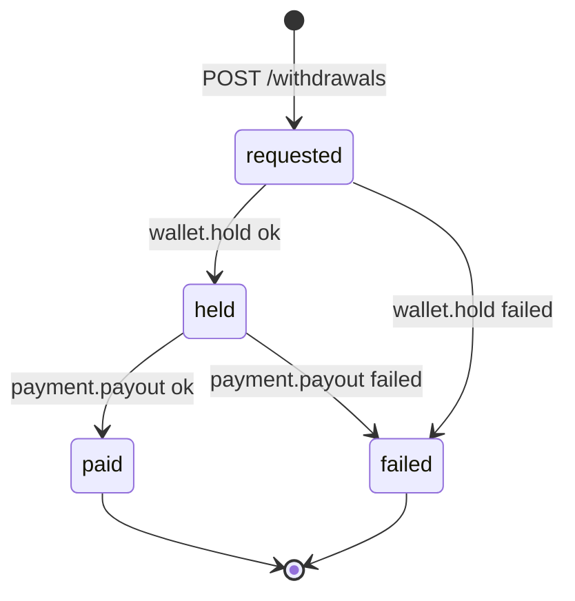

# driver-earnings-service — Software Requirements Specification

## 1. Introduction

This document specifies the requirements for
`driver-earnings-service`. The service owns the driver's earnings
ledger and the withdrawal flow; correctness and idempotency are
non-negotiable.

## 2. Scope

In scope:

- The driver earnings ledger.
- The withdrawable balance.
- Withdrawal requests.
- Bank details.
- Tips / bonuses.
- Penalty postings.

Out of scope:

- The trip aggregate.
- Card capture.
- Wallet balance.
- Driver profile.

## 3. System Context

```mermaid
flowchart LR
    RPI[ride-payment-integration-service] -. ride.payment.completed.v1 .-> DE[driver-earnings-service]
    TR[trip-service] -. trip.completed.v1 .-> DE
    DE --> PAY[payment-service]
    DE --> WLT[wallet-service]
    DE --> LD[ledger-service]
    DE --> DRV[driver-service]
    DE -. driver.earning.accrued.v1 .-> K[(Kafka)]
    DE -. driver.withdrawal.*.v1 .-> K
    K --> RH[ride-history-service]
    K --> SUP[support-service]
    K --> NOT[notification-service]
    K --> AUD[audit-service]
```

## 4. Actors

- **Driver app** — JWT role `driver`. Read balance, request
  withdrawal, manage bank.
- **`ride-payment-integration-service`** — system actor via events.
- **`trip-service`** — system actor via events.
- **`payment-service`**, **`wallet-service`**, **`ledger-service`** —
  system actors via REST.
- **Admin / support** — read; force-adjust.

## 5. Functional Requirements

| ID | Requirement | Priority |
|----|-------------|----------|
| FR--001 | On `ride.payment.completed.v1`, accrue the earning with `Idempotency-Key=trip:{trip_id}:earn`. | MUST |
| FR--002 | On `trip.completed.v1` (for tips / bonuses), accrue with the appropriate idempotency key. | MUST |
| FR--003 | Reject duplicate accrual (same idempotency key) with no-op. | MUST |
| FR--004 | `GET /v1/earnings/balance` returns the current withdrawable balance. | MUST |
| FR--005 | `GET /v1/earnings/today` returns today's earnings. | MUST |
| FR--006 | `GET /v1/earnings/week` returns this week's earnings. | MUST |
| FR--007 | `GET /v1/earnings/statement?from=…&to=…` returns a paginated statement. | MUST |
| FR--008 | `POST /v1/earnings/withdrawals` with `{amount_minor, currency, bank_detail_id}`; reject if balance < amount or within cooldown. | MUST |
| FR--009 | On withdrawal request, call `wallet-service.hold(amount)` with `Idempotency-Key=wd:{withdrawal_id}:hold`. | MUST |
| FR--010 | On hold success, call `payment-service.payout(bank, amount)` with `Idempotency-Key=wd:{withdrawal_id}:payout`. | MUST |
| FR--011 | On payout success, call `wallet-service.release(hold_id)` and `ledger-service.post`. | MUST |
| FR--012 | On payout failure, call `wallet-service.release(hold_id)` and emit `driver.withdrawal.failed.v1`. | MUST |
| FR--013 | `GET /v1/earnings/withdrawals/{id}` returns the withdrawal. | MUST |
| FR--014 | `GET /v1/earnings/bank` and `PATCH /v1/earnings/bank` manage bank details. | MUST |
| FR--015 | All money-movement calls use idempotency keys. | MUST |
| FR--016 | All events go through the transactional outbox. | MUST |
| FR--017 | Reject all invalid state transitions with 409 `STATE_INVALID`. | MUST |
| FR--018 | Admin can force-adjust with a reason; this creates a `correction` earning row. | MUST |
| FR--019 | Bank details are encrypted at rest (per-column encryption). | MUST |
| FR--020 | The balance is computed from the ledger (sum of positive - sum of negative - holds). | MUST |
| FR--021 | On `trip.reward.granted.v1` from `trip-service`, accrue an earning row with `type=guaranteed_topup` and `Idempotency-Key=trip:{trip_id}:reward:driver:grant`. The grant's `grant_event_id` is stored for inbox dedup; a duplicate `grant_event_id` is a no-op. The amount and currency are copied from the event payload. | MUST |
| FR--022 | On `trip.reward.reversed.v1` from `trip-service`, post a `type=correction` earning row whose `amount_minor` is the negation of the original grant (and whose `grant_event_id` matches the original) — never UPDATE/DELETE the original grant earning. The reversal is idempotent on `grant_event_id` + a `reversal` marker. | MUST |
| FR--023 | Expose `GET /v1/drivers/{id}/period-eligible-earnings?window=hourly\|daily` returning the sum of the driver's positive `type=guaranteed_topup` earning rows in the window (excluding `type=penalty`). The window size defaults to `trip.reward.driver.min_window_minutes` (default 60 min). See `INTEGRATION.md` §1.9 and `WORKFLOWS.md` §5. | MUST |

## 6. Non-Functional Requirements

| ID | Category | Requirement | Target |
|----|----------|-------------|--------|
| NFR--001 | performance | P95 accrual latency after `ride.payment.completed.v1` | ≤ 1s |
| NFR--002 | performance | P95 balance read | ≤ 100ms |
| NFR--003 | performance | P95 withdrawal submission | ≤ 500ms |
| NFR--004 | availability | uptime | 99.95% (Tier-1) |
| NFR--005 | scalability | concurrent active drivers | 1M per region |
| NFR--006 | maintainability | MTTR for a bad deploy | ≤ 15 minutes |
| NFR--007 | observability | tracing coverage | 100% |

## 7. API Requirements

REST per `architecture/API_STANDARDS.md`. `Idempotency-Key` required
on `POST /v1/earnings/withdrawals`. Errors use the standard
envelope. Full contract in `INTEGRATION.md`.

## 8. Data Requirements

| ID | Requirement | Notes |
|----|-------------|-------|
| DATA--001 | `earnings` has a UUIDv7 PK; time-ordered | partitioned by month |
| DATA--002 | All timestamps `timestamptz` UTC | RFC3339 at the wire |
| DATA--003 | Money in `amount_minor BIGINT` with `currency CHAR(3)` | no floats |
| DATA--004 | Cross-service refs (`trip_id`, `payment_intent_id`, `wallet_hold_id`, `payout_id`) as UUID without FKs | |
| DATA--005 | Bank details encrypted at rest (per-column encryption) | SECURITY |
| DATA--006 | The ledger is append-only; corrections are negative entries with `reason` | |
| DATA--007 | Audit columns on every mutable table | platform standard |
| DATA--008 | `earnings.type` includes `guaranteed_topup` (per-trip driver top-up from `trip.reward.granted.v1`) in addition to `fare`, `tip`, `bonus`, `penalty`, `correction`, `incentive`; reversal of a top-up is a new `type=correction` row keyed by `grant_event_id` | enum CHECK on `earnings.type` |
| DATA--009 | `earnings.grant_event_id UUID NULL` column for inbox idempotency on `trip.reward.*`; partial unique on `(grant_event_id)` where `type = 'guaranteed_topup'` | cross-service ref, no FK |

## 9. Validation Rules

- Withdrawal `amount_minor > 0`.
- Withdrawal `amount_minor ≤ balance`.
- Withdrawal `currency` matches the driver's wallet currency.
- Bank detail belongs to the driver.
- `earnings.type` must be one of `fare`, `tip`, `bonus`, `penalty`,
  `correction`, `incentive`, `guaranteed_topup` (DB-level CHECK;
  see `ERD.md` §3 `Earning`).
- `earnings.grant_event_id` is required when `type = 'guaranteed_topup'`
  and must be unique across all rows of that type (partial UNIQUE
  index on `grant_event_id` WHERE `type = 'guaranteed_topup'`).
- `trip.reward.reversed.v1` whose `grant_event_id` matches an
  existing `guaranteed_topup` row produces a `correction` row of
  equal magnitude; replay is idempotent on `grant_event_id`.

## 10. State Transitions



## 11. Authorization Requirements

- Driver can read/write own earnings.
- Admin can read and force-adjust with a reason.
- The accrual endpoints are system-only (consumed via events).

## 12. Configuration Requirements

Consumed from `configuration-service` and refreshed on
`configuration.updated.v1`. See `README.md` §13.

## 13. Error Handling

| Error | Response | Recovery |
|-------|----------|----------|
| Insufficient balance | 422 `INSUFFICIENT_BALANCE` | none |
| Within cooldown | 409 `WITHDRAWAL_COOLDOWN` | wait |
| Wallet hold failed | 502 `DEPENDENCY_TIMEOUT` | retry |
| Payout failed | release hold, emit `failed.v1` | support ticket |
| Duplicate accrual | no-op (200) | idempotent |
| Idempotency conflict | 422 `IDEMPOTENCY_KEY_REUSED` | new key |

## 14. Concurrency Requirements

- The driver's balance is updated under a row-level lock
  (`SELECT … FOR UPDATE` on the driver's "wallet" row).
- Accrual and withdrawal are serialised per driver.

## 15. Idempotency Requirements

- `Idempotency-Key=trip:{trip_id}:earn` on accrual.
- `Idempotency-Key=wd:{withdrawal_id}:hold` on hold.
- `Idempotency-Key=wd:{withdrawal_id}:payout` on payout.
- All event handlers are idempotent by `event_id`.

## 16. Performance

- Dominant path: accrual.
- P50 / P95 / P99: 100ms / 500ms / 1s.

## 17. Scalability

- Horizontal: stateless, scale by HPA on CPU and on
  `driver_earnings_accrual_seconds_p99`.
- The earnings table is partitioned by month; the partition
  maintenance job pre-creates 3 months ahead.

## 18. Availability

- SLO: 99.95% over 30 days.
- Error budget: ~22 minutes per 30 days.
- Maintenance window: weekly Sun 04:00–06:00 UTC.

## 19. Security

| ID | Requirement | Notes |
|----|-------------|-------|
| SEC--001 | All endpoints require a valid JWT bearer token | gateway validates |
| SEC--002 | Driver ownership is enforced | `driver_id == sub` |
| SEC--003 | Bank details encrypted at rest (per-column encryption with a per-tenant KEK) | DATA--005 |
| SEC--004 | Admin actions require `X-Audit-Reason` | |
| SEC--005 | No PAN stored | the payment-service handles PAN |
| SEC--006 | Idempotency keys are opaque UUIDs | |
| SEC--007 | TLS 1.3 at edge; mTLS in cluster | platform standard |

## 20. Privacy

- PII stored: bank details, earning amounts, trip refs.
- Retention: 7 years (financial).
- Erasure: per GDPR, identifiers are erased; financial records
  retained de-identified.

## 21. Auditability

- Every accrual and withdrawal is logged with `correlation_id`,
  `driver_id`, `amount`, `currency`.
- Every admin action is logged at `warn` and emitted to
  `audit-service`.

## 22. Observability

- Logs: JSON to stdout with `correlation_id`, `service`,
  `version`, `route`, `latency_ms`, `status`.
- Metrics: see `README.md` §15.
- Traces: OpenTelemetry.
- Alerts: SLO burn-rate, accrual lag, withdrawal failure rate,
  reconciliation drift.

## 23. Maintainability

- Code style: TypeScript with `strict: true`; ESLint + Prettier.
- Test coverage: ≥ 80% line / branch.
- Documentation: this folder.

## 24. Disaster Recovery

- RPO: ≤ 1 minute.
- RTO: ≤ 15 minutes. The ledger is recoverable from the events
  + the outbox.

## 25. Acceptance Criteria

(There are 23 functional requirements above; these acceptance
criteria cover each one plus the data and validation rules.)

- Replaying `ride.payment.completed.v1` for the same trip id does
  not double-accrue.
- Replaying `trip.reward.granted.v1` for the same `grant_event_id`
  does not double-accrue (only one `type=guaranteed_topup` row is
  produced per grant).
- A `trip.reward.reversed.v1` for an already-reversed
  `grant_event_id` is a no-op (single `type=correction` reversal
  row exists per grant).
- `GET /v1/drivers/{id}/period-eligible-earnings?window=hourly`
  returns the sum of positive `type=guaranteed_topup` rows for the
  driver in the trailing 60-minute window, excluding any
  `type=penalty` rows.
- A withdrawal below the minimum is rejected.
- A withdrawal within the cooldown is rejected.
- A payout failure releases the hold and emits
  `driver.withdrawal.failed.v1`.
- Bank details are encrypted at rest.

---

## See also

### Sibling docs for this service

- [`README.md`](./README.md) — purpose, bounded context, responsibilities
- [`BRD.md`](./BRD.md) — business requirements
- [`SRS.md`](./SRS.md) — functional + non-functional requirements
- [`ERD.md`](./ERD.md) — data model (entities, relationships)
- [`INTEGRATION.md`](./INTEGRATION.md) — inter-service contracts (APIs, events, sagas)
- [`WORKFLOWS.md`](./WORKFLOWS.md) — operational workflows (happy paths, failure modes)
- [`TECH.md`](./TECH.md) — technology profile (runtime, libraries, data layer, admin endpoints, RBAC)

### Platform-wide

- [`../../shared/README.md`](../../shared/README.md) — `platform-spring-boot-starter` shared library (the single source of cross-cutting code for all Spring Boot services in the platform)
- [`../RECOMMENDATIONS.md`](../RECOMMENDATIONS.md) — platform-wide technology map (language, framework, version baseline, admin/RBAC pattern)
- [`../../README.md`](../../README.md) — services overview (the catalog of all 58 services)
- [`../../../main.md`](../../../main.md) — top-level platform specification (architecture, Keycloak, PostgreSQL 18, messaging, observability baseline)

