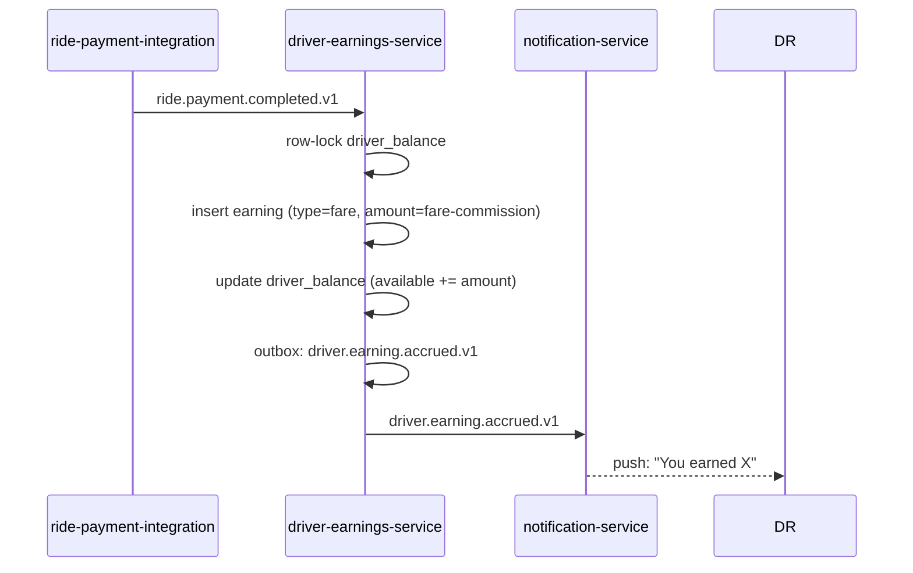
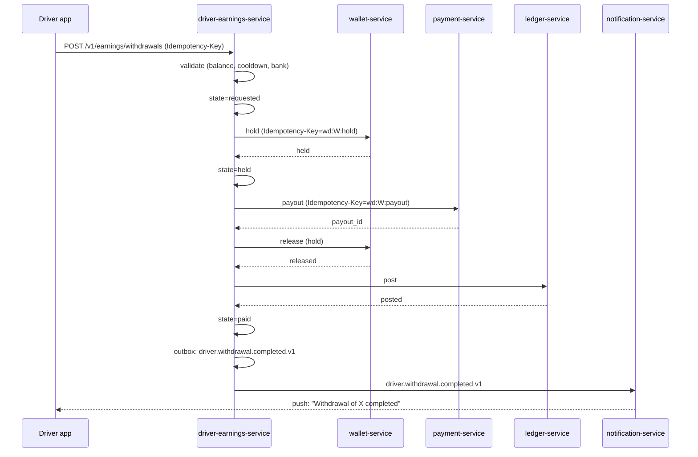
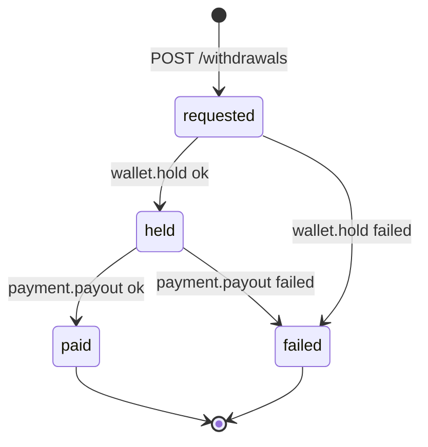
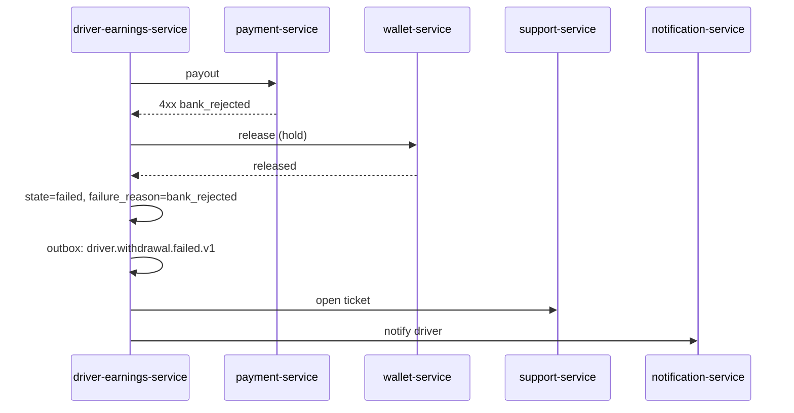
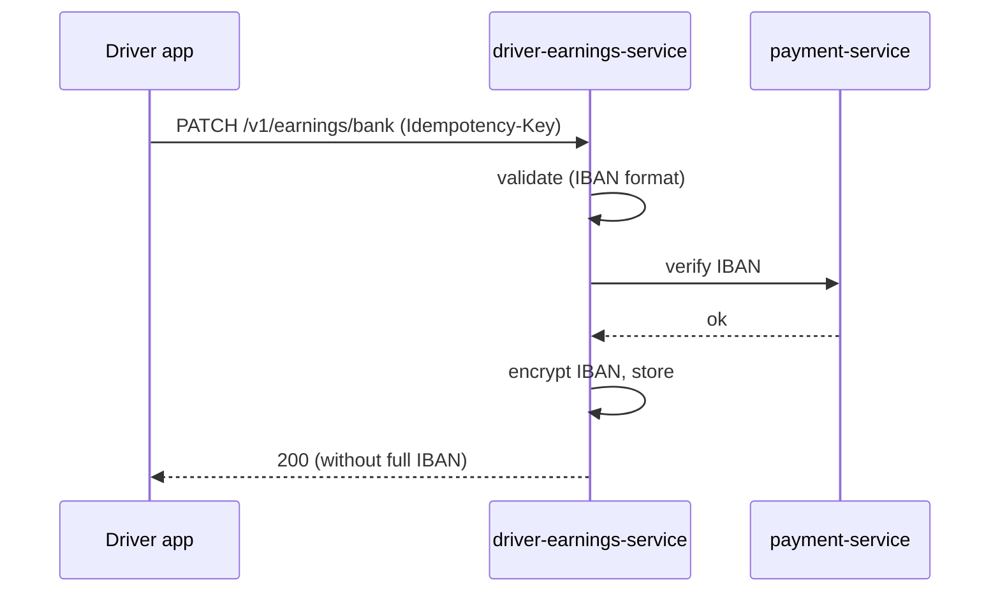
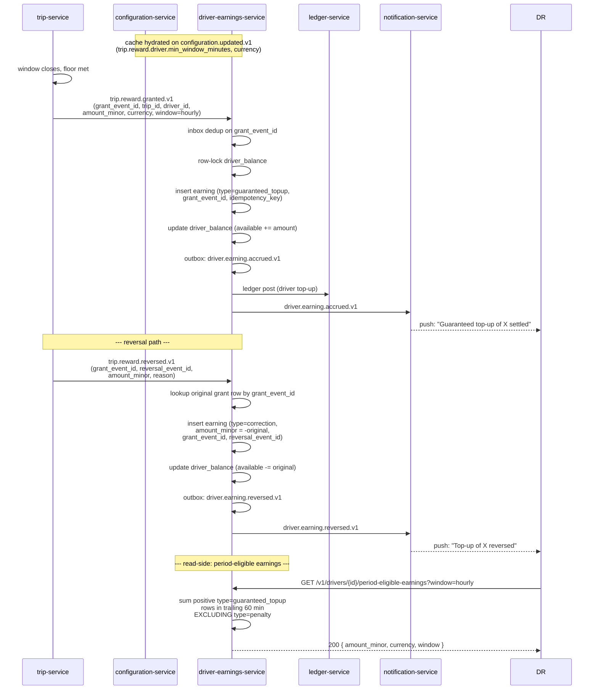
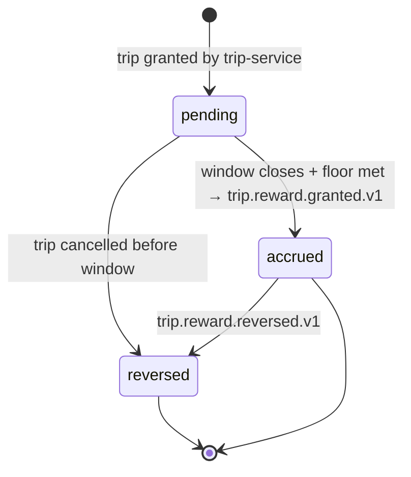

# driver-earnings-service — Workflows

## 1. Accrual on Payment Completed

### 1.1 Objective

Record the driver's earning when a ride payment completes, and
update the driver's withdrawable balance.

### 1.2 Initiating Actor

`ride-payment-integration-service` emits `ride.payment.completed.v1`.

### 1.3 Participating Services

- `ride-payment-integration-service` (event producer)
- `driver-earnings-service` (this service)
- `notification-service` (notify driver)

### 1.4 Prerequisites

- The driver is `approved`.
- The trip's `final_fare` is known.

### 1.5 Happy Path

### 1.6 Alternate Paths

- **Tip attached to the trip**: the same flow is triggered by
  `trip.completed.v1` with a tip entry in the trip; we insert a
  `tip` earning row.
- **Bonus from `driver-incentive-service`**: same flow with
  `type=incentive`.
- **Penalty from `ride-payment-integration-service`**: same flow
  with `type=penalty` and a negative amount.

### 1.7 Failure Paths

- DB down: retry; on persistent failure, page on-call.
- Idempotency conflict: no-op (the prior event was already
  processed).

### 1.8 Business Rules

- BR--010, BR--011.

### 1.9 State Transitions

N/A (the earning row is `accrued` once; the balance is updated
atomically).

### 1.10 Events

| Event | Direction | When |
|-------|-----------|------|
| `driver.earning.accrued.v1` | produced | on accrual |
| `ride.payment.completed.v1` | consumed | trigger |

### 1.11 APIs Involved

None (event-driven).

### 1.12 Compensation / Rollback

- If the accrual succeeds but the event publish fails, the outbox
  retries. The balance is the source of truth.
- If a `correction` is needed (admin force-adjust), a new
  `type=correction` row is inserted with a negative amount and a
  reason.

### 1.13 Final State

The earning row is in the ledger; the balance is updated; the
event is emitted.

## 2. Withdrawal Request (Happy Path)

### 2.1 Objective

Pay the driver's requested amount to their bank account, with the
hold / payout / post flow executed atomically.

### 2.2 Initiating Actor

The driver app (or admin on the driver's behalf).

### 2.3 Participating Services

- `driver-earnings-service` (this service)
- `wallet-service` (hold / release)
- `payment-service` (payout)
- `ledger-service` (post)
- `notification-service` (notify driver)

### 2.4 Prerequisites

- The driver's balance ≥ amount.
- The driver is outside the cooldown.
- The bank detail is verified.

### 2.5 Happy Path

### 2.6 Alternate Paths

- **Hold fails**: state → `failed`; emit `driver.withdrawal.failed.v1`;
  notify the driver; open a support ticket.

### 2.7 Failure Paths

- **Payout fails**: release the hold; state → `failed`; emit
  `driver.withdrawal.failed.v1`; notify the driver; open a support
  ticket.
- **Ledger post fails**: retry; on persistent failure, page
  on-call (P1); the withdrawal is still `paid` (the money moved).

### 2.8 Business Rules

- BR--012, BR--013, BR--014, BR--015, BR--016, BR--017.

### 2.9 State Transitions

### 2.10 Events

| Event | Direction | When |
|-------|-----------|------|
| `driver.withdrawal.requested.v1` | produced | on request |
| `driver.withdrawal.completed.v1` | produced | on success |
| `driver.withdrawal.failed.v1` | produced | on failure |

### 2.11 APIs Involved

| API | Direction | When |
|-----|-----------|------|
| `POST /v1/earnings/withdrawals` | inbound | trigger |
| `wallet-service.hold` | outbound | hold |
| `payment-service.payout` | outbound | payout |
| `wallet-service.release` | outbound | release |
| `ledger-service.post` | outbound | post |

### 2.12 Compensation / Rollback

- If the hold succeeds but the payout fails, the hold is
  released.
- If the payout succeeds but the post fails, the withdrawal is
  `paid`; reconciliation detects the missing post.

### 2.13 Final State

`paid` (and the event is emitted) or `failed` (and the failure
event is emitted).

## 3. Withdrawal Failure (Payout Rejected)

### 3.1 Objective

When the bank rejects the payout, release the hold, mark the
withdrawal as failed, notify the driver, and open a support
ticket.

### 3.2 Initiating Actor

`payment-service` returns a 4xx/5xx on payout.

### 3.3 Participating Services

- `payment-service` (the failure source)
- `driver-earnings-service` (this service)
- `wallet-service` (release)
- `support-service` (ticket)
- `notification-service` (driver)

### 3.4 Prerequisites

- The withdrawal is in `held`.

### 3.5 Happy Path (Failure)

### 3.6 Alternate Paths

- The driver updates their bank details and retries: a new
  withdrawal is created.

### 3.7 Failure Paths

- `wallet-service.release` fails: retry; on persistent failure,
  page on-call (P1).
- `support-service` or `notification-service` down: retry; on
  persistent failure, page on-call.

### 3.8 Business Rules

- BR--034.

### 3.9 State Transitions

`held → failed`.

### 3.10 Events

| Event | Direction | When |
|-------|-----------|------|
| `driver.withdrawal.failed.v1` | produced | on failure |

### 3.11 APIs Involved

| API | Direction | When |
|-----|-----------|------|
| `payment-service.payout` | outbound | the failed call |
| `wallet-service.release` | outbound | compensation |
| `support-service` (event) | outbound | ticket |

### 3.12 Compensation / Rollback

- The hold is released; the driver's balance is restored.

### 3.13 Final State

`failed`. The driver's balance is intact.

## 4. Bank Details Update

### 4.1 Objective

Allow the driver to add, update, or remove bank details for
withdrawals.

### 4.2 Initiating Actor

The driver app (or admin/support on the driver's behalf).

### 4.3 Participating Services

- `driver-earnings-service` (this service)
- `payment-service` (verification of the IBAN; the bank verification
  microservice)

### 4.4 Prerequisites

- The driver is `approved`.
- The IBAN is valid (validated by the format and by a bank
  verification service).

### 4.5 Happy Path

### 4.6 Alternate Paths

- IBAN invalid: 422 `INVALID_IBAN`.
- Max bank details reached: 422 `MAX_BANK_DETAILS_REACHED`.
- Bank verification fails: 422 `BANK_VERIFICATION_FAILED`.

### 4.7 Failure Paths

- DB down: retry; on persistent failure, page on-call.

### 4.8 Business Rules

- BR--022, BR--023.

### 4.9 State Transitions

N/A (CRUD on a config-like entity).

### 4.10 Events

None (informational; no event emitted for a bank detail change).

### 4.11 APIs Involved

| API | Direction | When |
|-----|-----------|------|
| `PATCH /v1/earnings/bank` | inbound | trigger |
| `payment-service.verify_iban` | outbound | verification |

### 4.12 Compensation / Rollback

If the verification fails, no row is written.

### 4.13 Final State

The bank detail is stored (encrypted) and returned to the driver
without the full IBAN.

## 5. Driver Guaranteed Reward Settlement (per-trip, hourly, daily)

### 5.1 Objective

Record the driver side of a per-trip **guaranteed reward** issued
by `trip-service` (the customer side is settled in
`wallet-service` / `customer-service`). The driver receives either
a per-trip top-up (`trip.reward.granted.v1`) that, once the
hourly or daily window closes and the driver did at least
`trip.reward.driver.min_window_minutes` minutes online, is
settled into their earnings ledger as `type=guaranteed_topup`,
or a reversal (`trip.reward.reversed.v1`) that posts a matching
`type=correction` row. The endpoint
`GET /v1/drivers/{id}/period-eligible-earnings?window=hourly|daily`
then exposes the trailing-window sum for compliance, support, and
the driver app.

### 5.2 Initiating Actor

`trip-service` — the per-trip reward engine — emits
`trip.reward.granted.v1` on every qualifying trip and
`trip.reward.reversed.v1` when the grant is reversed (for example
after fraud review or trip cancellation past the reward window).

### 5.3 Participating Services

- `trip-service` (event producer; computes the grant)
- `driver-earnings-service` (this service)
- `wallet-service` (customer-side settlement; out of scope here)
- `customer-service` (customer notification; out of scope here)
- `notification-service` (driver push / email)
- `configuration-service` (publishes `trip.reward.*` config keys;
  consumed via `configuration.updated.v1`)

### 5.4 Prerequisites

- The driver is `approved`.
- The trip is in a `completed` state.
- `trip.reward.driver.min_window_minutes` has been resolved from
  `configuration-service` (default 60 min).
- The driver's earnings currency matches the grant currency.

### 5.5 Happy Path

The hourly / daily settlement cadence is "in-band" with the
per-trip grant: the grant is queued as `pending` in `trip-service`
and, after the window closes and the driver meets the floor, is
emitted as `trip.reward.granted.v1`. The reversal path is the
mirror image.

The daily window is the same flow with `window=daily` and a
24-hour trailing sum (or the configured `min_window_minutes`).

### 5.6 Alternate Paths

- **Grant arrives for a trip already reversed**: insert
  `type=guaranteed_topup`, then immediately process the queued
  reversal (idempotent on `grant_event_id` + `reversal_event_id`).
- **Currency mismatch**: insert the row in the driver's earnings
  currency using the FX from `pricing-service` (best-effort); if
  FX is unavailable, defer accrual and emit a warning event.
- **Driver offline at window close**: `trip-service` still emits
  the grant; the driver-side accrual proceeds (the top-up is
  unconditional; the floor is on online minutes, not on
  per-trip delivery).

### 5.7 Failure Paths

- **DB unavailable**: retry 3× with exponential backoff; on
  persistent failure, route to DLQ and emit
  `trip.reward.granted.dlq.v1` (or `…reversed.dlq.v1`).
- **Inbox dedup hit (duplicate grant_event_id)**: no-op; the
  prior event was already processed (idempotent).
- **Ledger post fails**: retry; on persistent failure, page
  on-call (P1); the earning row and balance update are still
  authoritative — the ledger post is reconciled by the nightly
  reconciliation job.
- **Driver balance would go negative on reversal**: still post
  the correction; flag the driver account `balance_negative=true`
  for support review (cannot happen for a correctly-tracked
  grant because the reversal matches the original grant 1:1).

### 5.8 Business Rules

- BR--035, FR--021, FR--022, FR--023 (see `SRS.md`); chart of
  accounts in `README.md` "Accounting view".

### 5.9 State Transitions

### 5.10 Events

| Event | Direction | When |
|-------|-----------|------|
| `trip.reward.granted.v1` | consumed | window closes, floor met |
| `trip.reward.reversed.v1` | consumed | grant reversed |
| `driver.earning.accrued.v1` | produced | on accrual |
| `driver.earning.reversed.v1` | produced | on reversal (correction posted) |
| `configuration.updated.v1` | consumed (cache only) | `trip.reward.*` keys reload |

### 5.11 APIs Involved

| API | Direction | When |
|-----|-----------|------|
| `GET /v1/drivers/{id}/period-eligible-earnings?window=hourly\|daily` | inbound | driver / support query |
| `ledger-service.post` | outbound | post top-up / correction |

### 5.12 Compensation / Rollback

- A `trip.reward.reversed.v1` never UPDATEs or DELETEs the
  original `type=guaranteed_topup` row — it appends a
  `type=correction` row whose `amount_minor` is the negation of
  the original grant. The ledger is append-only (DATA--006).
- If the reversal event is processed before the original grant
  (network reordering), the reversal is queued in the inbox
  with the same `grant_event_id` and processed after the grant
  arrives; the inbox dedup guarantees a single correction.

### 5.13 Final State

A `type=guaranteed_topup` row in `driver_earnings.earnings` with
`grant_event_id` populated (and partial UNIQUE enforced); the
balance is updated; `driver.earning.accrued.v1` is emitted. If
the grant is later reversed, a paired `type=correction` row
exists; the sum of the two is zero.

---

## See also

### Sibling docs for this service

- [`README.md`](./README.md) — purpose, bounded context, responsibilities
- [`BRD.md`](./BRD.md) — business requirements
- [`SRS.md`](./SRS.md) — functional + non-functional requirements
- [`ERD.md`](./ERD.md) — data model (entities, relationships)
- [`INTEGRATION.md`](./INTEGRATION.md) — inter-service contracts (APIs, events, sagas)
- [`WORKFLOWS.md`](./WORKFLOWS.md) — operational workflows (happy paths, failure modes)
- [`TECH.md`](./TECH.md) — technology profile (runtime, libraries, data layer, admin endpoints, RBAC)

### Platform-wide

- [`../../shared/README.md`](../../shared/README.md) — `platform-spring-boot-starter` shared library (the single source of cross-cutting code for all Spring Boot services in the platform)
- [`../RECOMMENDATIONS.md`](../RECOMMENDATIONS.md) — platform-wide technology map (language, framework, version baseline, admin/RBAC pattern)
- [`../../README.md`](../../README.md) — services overview (the catalog of all 58 services)
- [`../../../main.md`](../../../main.md) — top-level platform specification (architecture, Keycloak, PostgreSQL 18, messaging, observability baseline)

