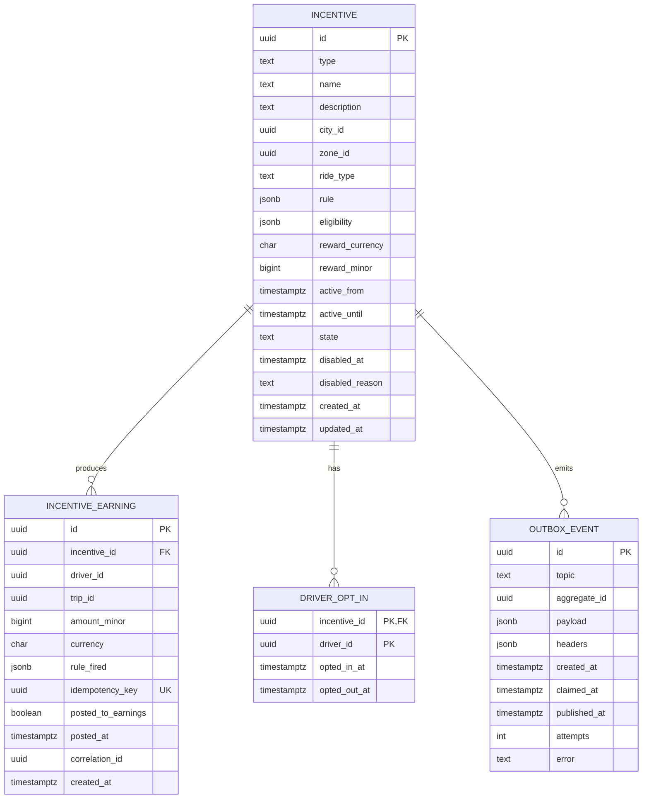

# driver-incentive-service — Entity-Relationship Diagram

## 1. Database

- Engine: PostgreSQL 18
- Schema: `driver_incentive` (owned exclusively by this service).
- Migrations: `services/driver-incentive-service/migrations/`.

## 2. Cross-Service References

| Column | Type | Refers to | Source of truth |
|--------|------|-----------|------------------|
| `incentives.driver_id` (in scope of a quest) | UUID | `driver` in `driver-service` | `driver-service` |
| `incentive_earnings.driver_id` | UUID | `driver` in `driver-service` | `driver-service` |
| `incentive_earnings.trip_id` | UUID | `trip` in `trip-service` | `trip-service` |
| `driver_opt_ins.driver_id` | UUID | `driver` in `driver-service` | `driver-service` |

## 3. Entities

### `Incentive`

A quest / bonus / guarantee definition.

#### Columns

| Column | Type | Constraints | Notes |
|--------|------|-------------|-------|
| `id` | UUID | PK | UUIDv7 |
| `type` | TEXT | NOT NULL, CHECK (type IN ('quest','bonus','guarantee')) | |
| `name` | TEXT | NOT NULL | human-readable |
| `description` | TEXT | NULL | |
| `city_id` | UUID | NOT NULL | |
| `zone_id` | UUID | NULL | nullable for city-wide |
| `ride_type` | TEXT | NULL | nullable for any |
| `rule` | JSONB | NOT NULL | type-specific rule (e.g. `{target_trips: 20, reward_minor: 10000, window: {start, end}}`) |
| `eligibility` | JSONB | NOT NULL | `{min_rating, min_trip_count, requires_opt_in}` |
| `reward_currency` | CHAR(3) | NOT NULL | |
| `reward_minor` | BIGINT | NOT NULL | |
| `active_from` | TIMESTAMPTZ | NOT NULL | |
| `active_until` | TIMESTAMPTZ | NOT NULL | |
| `state` | TEXT | NOT NULL, CHECK (state IN ('draft','active','disabled','expired')) | |
| `disabled_at` | TIMESTAMPTZ | NULL | soft delete |
| `disabled_reason` | TEXT | NULL | |
| `created_at` | TIMESTAMPTZ | NOT NULL DEFAULT now() | |
| `updated_at` | TIMESTAMPTZ | NOT NULL DEFAULT now() | |
| `created_by` | UUID | NOT NULL | admin |
| `updated_by` | UUID | NOT NULL | admin |

#### Indexes

- PK on `id`
- `idx_incentive_state_window` on `(state, active_from, active_until)` — supports "active" queries.
- `idx_incentive_city_ride` on `(city_id, ride_type)` partial
  `WHERE state = 'active'`.

#### Constraints

- `CHECK (type IN ('quest','bonus','guarantee'))`
- `CHECK (active_from < active_until)`
- `CHECK (reward_minor > 0)`
- `CHECK (state IN ('draft','active','disabled','expired'))`

### `IncentiveEarning`

A driver's earning for a given incentive on a given trip.

#### Columns

| Column | Type | Constraints | Notes |
|--------|------|-------------|-------|
| `id` | UUID | PK | UUIDv7 |
| `incentive_id` | UUID | NOT NULL | FK to `incentives.id` |
| `driver_id` | UUID | NOT NULL | |
| `trip_id` | UUID | NOT NULL | |
| `amount_minor` | BIGINT | NOT NULL | can be 0 (no earning) |
| `currency` | CHAR(3) | NOT NULL | |
| `rule_fired` | JSONB | NULL | the rule branch that fired |
| `idempotency_key` | UUID | NOT NULL, UNIQUE | trip:{trip_id}:incentive:{incentive_id} |
| `posted_to_earnings` | BOOLEAN | NOT NULL DEFAULT false | true after posting |
| `posted_at` | TIMESTAMPTZ | NULL | |
| `correlation_id` | UUID | NOT NULL | |
| `created_at` | TIMESTAMPTZ | NOT NULL DEFAULT now() | |

#### Indexes

- PK on `id`
- UNIQUE on `idempotency_key`
- `idx_incentive_earning_driver` on `(driver_id, created_at DESC)`

### `DriverOptIn`

A driver's opt-in to a quest.

#### Columns

| Column | Type | Constraints | Notes |
|--------|------|-------------|-------|
| `incentive_id` | UUID | PK, FK | |
| `driver_id` | UUID | PK, FK | |
| `opted_in_at` | TIMESTAMPTZ | NOT NULL DEFAULT now() | |
| `opted_out_at` | TIMESTAMPTZ | NULL | |

#### Indexes

- PK on `(incentive_id, driver_id)`

### `OutboxEvent`

#### Columns

| Column | Type | Constraints | Notes |
|--------|------|-------------|-------|
| `id` | UUID | PK | UUIDv7 |
| `topic` | TEXT | NOT NULL | |
| `aggregate_id` | UUID | NOT NULL | partition key = `incentive_id` or `driver_id` |
| `payload` | JSONB | NOT NULL | |
| `headers` | JSONB | NOT NULL DEFAULT '{}'::jsonb | |
| `created_at` | TIMESTAMPTZ | NOT NULL DEFAULT now() | |
| `claimed_at` | TIMESTAMPTZ | NULL | |
| `published_at` | TIMESTAMPTZ | NULL | |
| `attempts` | INT | NOT NULL DEFAULT 0 | |
| `error` | TEXT | NULL | |

## 4. Mermaid ER Diagram



## 5. DDL Sketch

```sql
CREATE SCHEMA IF NOT EXISTS driver_incentive;
SET search_path TO driver_incentive;

CREATE TABLE driver_incentive.incentives (
    id UUID PRIMARY KEY,
    type TEXT NOT NULL,
    name TEXT NOT NULL,
    description TEXT,
    city_id UUID NOT NULL,
    zone_id UUID,
    ride_type TEXT,
    rule JSONB NOT NULL,
    eligibility JSONB NOT NULL,
    reward_currency CHAR(3) NOT NULL,
    reward_minor BIGINT NOT NULL,
    active_from TIMESTAMPTZ NOT NULL,
    active_until TIMESTAMPTZ NOT NULL,
    state TEXT NOT NULL,
    disabled_at TIMESTAMPTZ,
    disabled_reason TEXT,
    created_at TIMESTAMPTZ NOT NULL DEFAULT now(),
    updated_at TIMESTAMPTZ NOT NULL DEFAULT now(),
    created_by UUID NOT NULL,
    updated_by UUID NOT NULL,
    CONSTRAINT chk_incentive_type CHECK (type IN ('quest','bonus','guarantee')),
    CONSTRAINT chk_incentive_state CHECK (state IN
        ('draft','active','disabled','expired')),
    CONSTRAINT chk_incentive_window CHECK (active_from < active_until),
    CONSTRAINT chk_incentive_reward CHECK (reward_minor > 0)
);
CREATE INDEX idx_incentive_state_window
    ON driver_incentive.incentives (state, active_from, active_until);
CREATE INDEX idx_incentive_city_ride
    ON driver_incentive.incentives (city_id, ride_type)
    WHERE state = 'active';

CREATE TABLE driver_incentive.incentive_earnings (
    id UUID NOT NULL,
    incentive_id UUID NOT NULL REFERENCES driver_incentive.incentives(id),
    driver_id UUID NOT NULL,
    trip_id UUID NOT NULL,
    amount_minor BIGINT NOT NULL,
    currency CHAR(3) NOT NULL,
    rule_fired JSONB,
    idempotency_key UUID NOT NULL,
    posted_to_earnings BOOLEAN NOT NULL DEFAULT false,
    posted_at TIMESTAMPTZ,
    correlation_id UUID NOT NULL,
    created_at TIMESTAMPTZ NOT NULL DEFAULT now(),
    PRIMARY KEY (id, created_at)
) PARTITION BY RANGE (created_at);
CREATE INDEX idx_incentive_earning_driver
    ON driver_incentive.incentive_earnings (driver_id, created_at DESC);
CREATE UNIQUE INDEX idx_incentive_earning_idempotency
    ON driver_incentive.incentive_earnings (idempotency_key);

CREATE TABLE IF NOT EXISTS driver_incentive.incentive_earnings_2026_08
    PARTITION OF driver_incentive.incentive_earnings
    FOR VALUES FROM ('2026-08-01 00:00:00+00') TO ('2026-09-01 00:00:00+00');

CREATE TABLE driver_incentive.driver_opt_ins (
    incentive_id UUID NOT NULL REFERENCES driver_incentive.incentives(id),
    driver_id UUID NOT NULL,
    opted_in_at TIMESTAMPTZ NOT NULL DEFAULT now(),
    opted_out_at TIMESTAMPTZ,
    PRIMARY KEY (incentive_id, driver_id)
);

CREATE TABLE driver_incentive.outbox (
    id UUID PRIMARY KEY,
    topic TEXT NOT NULL,
    aggregate_id UUID NOT NULL,
    payload JSONB NOT NULL,
    headers JSONB NOT NULL DEFAULT '{}'::jsonb,
    created_at TIMESTAMPTZ NOT NULL DEFAULT now(),
    claimed_at TIMESTAMPTZ,
    published_at TIMESTAMPTZ,
    attempts INT NOT NULL DEFAULT 0,
    error TEXT
);
CREATE INDEX idx_outbox_pending
    ON driver_incentive.outbox (created_at)
    WHERE published_at IS NULL;
```

## 6. Audit Columns

Every mutable table has `created_at`, `updated_at`, `created_by`,
`updated_by`. `incentive_earnings` is append-only.

## 7. Soft Delete

`incentives.disabled_at` is the soft delete; the row stays for
audit.

## 8. JSONB Usage

- `incentives.rule`: type-specific rule.
- `incentives.eligibility`: `{min_rating, min_trip_count,
  requires_opt_in}`.
- `incentive_earnings.rule_fired`: the rule branch that fired.
- `outbox.payload`: full event envelope.

## 9. Partitioning

| Table | Strategy | Cadence | Pre-create | Retention |
|-------|----------|---------|------------|-----------|
| `incentive_earnings` | RANGE on `created_at` | monthly | 12 months | 7 years |

See [`DATABASE_ARCHITECTURE.md` §"Table Partitioning — Canonical Template"](../../architecture/DATABASE_ARCHITECTURE.md) for the idempotent `CREATE TABLE IF NOT EXISTS … PARTITION OF …` pattern, naming convention, and the service-owned maintenance-job contract.

## 10. Data Retention

| Table | Retention | Purged by |
|-------|-----------|-----------|
| `incentives` | 7 years | financial; with the program |
| `incentive_earnings` | 7 years | financial |
| `driver_opt_ins` | with the incentive | scheduled |
| `outbox` | 24h after publish | poller purge |

## 11. Migration Considerations

- The `rule` JSONB is the source of truth for the rule schema;
  changes must be backward-compatible.
- The `state` CHECK on `incentives` is the source of truth for the
  lifecycle.
- The UNIQUE on `idempotency_key` enforces one earning per
  (trip, incentive); relaxing it requires a new column.

---

## See also

### Sibling docs for this service

- [`README.md`](./README.md) — purpose, bounded context, responsibilities
- [`BRD.md`](./BRD.md) — business requirements
- [`SRS.md`](./SRS.md) — functional + non-functional requirements
- [`ERD.md`](./ERD.md) — data model (entities, relationships)
- [`INTEGRATION.md`](./INTEGRATION.md) — inter-service contracts (APIs, events, sagas)
- [`WORKFLOWS.md`](./WORKFLOWS.md) — operational workflows (happy paths, failure modes)
- [`TECH.md`](./TECH.md) — technology profile (runtime, libraries, data layer, admin endpoints, RBAC)

### Platform-wide

- [`../../shared/README.md`](../../shared/README.md) — `platform-spring-boot-starter` shared library (the single source of cross-cutting code for all Spring Boot services in the platform)
- [`../RECOMMENDATIONS.md`](../RECOMMENDATIONS.md) — platform-wide technology map (language, framework, version baseline, admin/RBAC pattern)
- [`../../README.md`](../../README.md) — services overview (the catalog of all 58 services)
- [`../../../main.md`](../../../main.md) — top-level platform specification (architecture, Keycloak, PostgreSQL 18, messaging, observability baseline)

