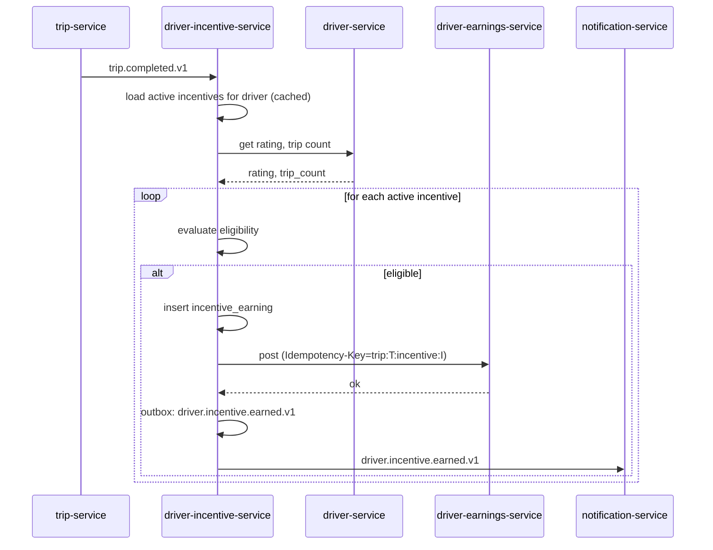
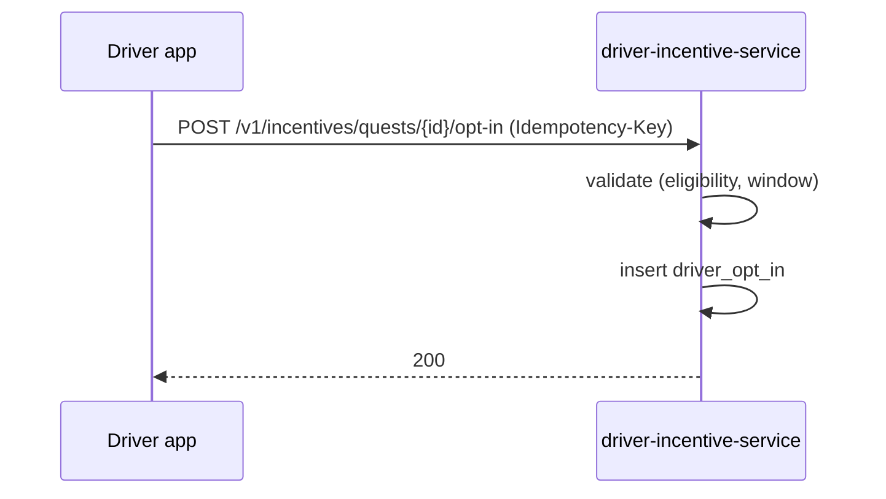
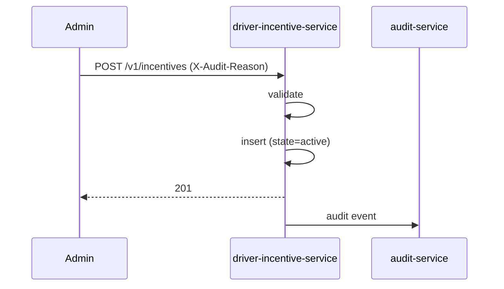
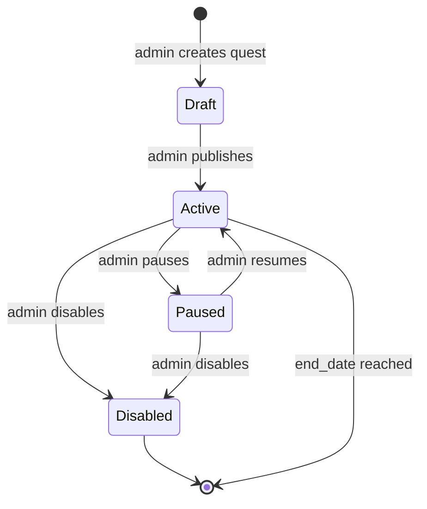

# driver-incentive-service — Workflows

## 1. Evaluation on Trip Completed

### 1.1 Objective

When a trip completes, evaluate all active incentives for the
driver; if any fire, post the earned amount to
`driver-earnings-service`.

### 1.2 Initiating Actor

`trip-service` emits `trip.completed.v1`.

### 1.3 Participating Services

- `trip-service` (event producer)
- `driver-incentive-service` (this service)
- `driver-service` (rating, trip count)
- `driver-earnings-service` (post)
- `notification-service` (notify driver)

### 1.4 Prerequisites

- The trip is `completed`.
- The driver's rating and trip count are queryable (cached if
  `driver-service` is down).

### 1.5 Happy Path



### 1.6 Alternate Paths

- **No active incentives**: no-op.
- **Driver not eligible**: no earning; log.
- **`driver-service` down**: fall back to the cached rating; if no
  cache, skip the rating check (the incentive may still fire).
- **`driver-earnings-service` down**: retry; on persistent
  failure, mark `posted_to_earnings=false`; reconciliation
  catches.

### 1.7 Failure Paths

- DB down: retry; on persistent failure, page on-call.

### 1.8 Business Rules

- BR--010, BR--011, BR--012, BR--013.

### 1.9 State Transitions

N/A (the `incentive_earning` row is `accrued` once; the
`posted_to_earnings` flag is updated after posting).

### 1.10 Events

| Event | Direction | When |
|-------|-----------|------|
| `driver.incentive.earned.v1` | produced | on earning |
| `trip.completed.v1` | consumed | trigger |

### 1.11 APIs Involved

| API | Direction | When |
|-----|-----------|------|
| `driver-service.get_rating` | outbound | eligibility |
| `driver-earnings-service.accrue` | outbound | post |

### 1.12 Compensation / Rollback

- If the post succeeds but the event publish fails, the outbox
  retries. The `incentive_earning` row is the source of truth.
- If the post fails, the row is inserted with
  `posted_to_earnings=false`; reconciliation retries.

### 1.13 Final State

The `incentive_earning` row is inserted; the amount is posted;
the event is emitted.

## 2. Quest Opt-In

### 2.1 Objective

Allow a driver to opt in to a quest that requires opt-in.

### 2.2 Initiating Actor

The driver app.

### 2.3 Participating Services

- `driver-incentive-service` (this service)

### 2.4 Prerequisites

- The quest requires opt-in.
- The driver is eligible (rating, trip count).

### 2.5 Happy Path



### 2.6 Alternate Paths

- Driver not eligible: 422 `INELIGIBLE`.
- Quest doesn't require opt-in: 422 `OPT_IN_NOT_REQUIRED`.
- Already opted in: 409 `ALREADY_OPTED_IN`.

### 2.7 Failure Paths

- DB down: 503.

### 2.8 Business Rules

- BR--016.

### 2.9 State Transitions

N/A (the `driver_opt_in` row is created once; `opted_out_at` is
set on opt-out).

### 2.10 Events

None.

### 2.11 APIs Involved

| API | Direction | When |
|-----|-----------|------|
| `POST /v1/incentives/quests/{id}/opt-in` | inbound | trigger |

### 2.12 Compensation / Rollback

If the insert fails, no row is created.

### 2.13 Final State

The `driver_opt_in` row is created.

## 3. Admin Creates a Quest

### 3.1 Objective

Allow an admin to create a quest / bonus / guarantee.

### 3.2 Initiating Actor

The admin console.

### 3.3 Participating Services

- `driver-incentive-service` (this service)
- `audit-service` (audit event)

### 3.4 Prerequisites

- The admin has the right role and a reason.

### 3.5 Happy Path



### 3.6 Alternate Paths

- Invalid: 400 `VALIDATION_FAILED`.
- Window invalid: 422 `INVALID_WINDOW`.

### 3.7 Failure Paths

- DB down: 503.

### 3.8 Business Rules

- BR--015.

### 3.9 State Transitions

`[*] → active` (or `draft` if the admin wants to delay
activation).

### 3.10 Events

None (informational; the audit event is emitted to
`audit-service`).

### 3.11 APIs Involved

| API | Direction | When |
|-----|-----------|------|
| `POST /v1/incentives` | inbound | trigger |

### 3.12 Compensation / Rollback

If the insert fails, no row is created.

### 3.13 Final State

The incentive is `active` (or `draft`); drivers see it in the
app.


## 99. Quest Lifecycle State Machine

This state machine summarizes the service's internal
state transitions (across all workflows above).



---

## 99. `monthly` Partition Maintenance

### 99.1 Objective

Idempotently pre-create the next 12 months for partitioned tables in `driver_incentive`.

### 99.2 Initiating Actor

A scheduled job runs daily at `02:00 UTC`. Leader-elected via `pg_try_advisory_xact_lock(hashtext('driver_incentive.partition'), hashtext('monthly'))`.

### 99.3 Happy Path

```mermaid
sequenceDiagram
    participant JOB as Partition job
    participant PG as PostgreSQL
    JOB->>PG: pg_try_advisory_xact_lock('driver_incentive.monthly')
    alt lock acquired
        loop for each missing month in next 12
            JOB->>PG: CREATE TABLE IF NOT EXISTS driver_incentive.incentive_earnings_YYYY_MM PARTITION OF driver_incentive.incentive_earnings
            JOB->>PG: verify (pg_inherits, relpartbound)
        end
        JOB->>PG: assert now() in existing child
    else lock NOT acquired
        Note over JOB: another instance is running; exit cleanly
    end
```

### 99.4 Failure Paths

| Failure | Handling |
|---------|----------|
| Lock contention | exit 0 |
| DDL fails | retry 3× with backoff (1 s / 4 s / 16 s); page on-call |
| Today's child missing | critical alert; INSERTs would fail |

### 99.5 Business Rules

- Pre-create 12 complete future months.
- Every child is created with `CREATE TABLE IF NOT EXISTS … PARTITION OF …`.
- A verification step (`pg_inherits` parent + `relpartbound` range) runs after every `CREATE TABLE IF NOT EXISTS`.
- Optionally emit `audit.partition.maintained.v1` on success.

---

## See also

### Sibling docs for this service

- [`README.md`](./README.md) — purpose, bounded context, responsibilities
- [`BRD.md`](./BRD.md) — business requirements
- [`SRS.md`](./SRS.md) — functional + non-functional requirements
- [`ERD.md`](./ERD.md) — data model (entities, relationships)
- [`INTEGRATION.md`](./INTEGRATION.md) — inter-service contracts (APIs, events, sagas)
- [`WORKFLOWS.md`](./WORKFLOWS.md) — operational workflows (happy paths, failure modes)
- [`TECH.md`](./TECH.md) — technology profile (runtime, libraries, data layer, admin endpoints, RBAC)

### Platform-wide

- [`../../shared/README.md`](../../shared/README.md) — `platform-spring-boot-starter` shared library (the single source of cross-cutting code for all Spring Boot services in the platform)
- [`../RECOMMENDATIONS.md`](../RECOMMENDATIONS.md) — platform-wide technology map (language, framework, version baseline, admin/RBAC pattern)
- [`../../README.md`](../../README.md) — services overview (the catalog of all 58 services)
- [`../../../main.md`](../../../main.md) — top-level platform specification (architecture, Keycloak, PostgreSQL 18, messaging, observability baseline)

