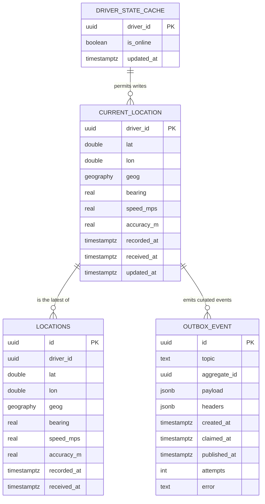

# driver-location-service — Entity-Relationship Diagram

## 1. Database

- Engine: PostgreSQL 18 with PostGIS extension.
- Schema: `driver_location` (owned exclusively by this service).
- Migrations: `services/driver-location-service/migrations/`.
- Partitioning: yes — `driver_location.locations` is
  range-partitioned by day on `recorded_at`.

## 2. Cross-Service References

| Column | Type | Refers to | Source of truth |
|--------|------|-----------|------------------|
| `current_location.driver_id` | UUID (PK) | `driver` in `driver-service` | `driver-service` |
| `locations.driver_id` | UUID | `driver` in `driver-service` | `driver-service` |
| `driver_state_cache.driver_id` | UUID (PK) | `driver` in `driver-service` | `driver-service` |

## 3. Entities

### `CurrentLocation`

One row per online driver. UPSERT only.

#### Columns

| Column | Type | Constraints | Notes |
|--------|------|-------------|-------|
| `driver_id` | UUID | PK | UUIDv7 |
| `lat` | DOUBLE PRECISION | NOT NULL | |
| `lon` | DOUBLE PRECISION | NOT NULL | |
| `geog` | geography(Point, 4326) | NOT NULL, GENERATED ALWAYS AS (ST_MakePoint(lon, lat)::geography) STORED | PostGIS |
| `bearing` | REAL | NULL | degrees, 0..360 |
| `speed_mps` | REAL | NULL | |
| `accuracy_m` | REAL | NULL | |
| `recorded_at` | TIMESTAMPTZ | NOT NULL | when the driver app recorded it |
| `received_at` | TIMESTAMPTZ | NOT NULL DEFAULT now() | when our service received it |
| `stale` | BOOLEAN | NOT NULL DEFAULT false | computed on read; not stored |
| `updated_at` | TIMESTAMPTZ | NOT NULL DEFAULT now() | |

#### Indexes

- PK on `driver_id`
- GIST on `geog` — supports `ST_DWithin` per-zone queries.
- `idx_current_location_received` on `(received_at)` — supports
  stale-read detection.

### `Locations`

Append-only trail. Range-partitioned by `recorded_at` (day).

#### Columns

| Column | Type | Constraints | Notes |
|--------|------|-------------|-------|
| `id` | UUID | NOT NULL | UUIDv7 |
| `driver_id` | UUID | NOT NULL | |
| `lat` | DOUBLE PRECISION | NOT NULL | |
| `lon` | DOUBLE PRECISION | NOT NULL | |
| `geog` | geography(Point, 4326) | NOT NULL, GENERATED ALWAYS AS (ST_MakePoint(lon, lat)::geography) STORED | PostGIS |
| `bearing` | REAL | NULL | |
| `speed_mps` | REAL | NULL | |
| `accuracy_m` | REAL | NULL | |
| `recorded_at` | TIMESTAMPTZ | NOT NULL | driver app's timestamp |
| `received_at` | TIMESTAMPTZ | NOT NULL DEFAULT now() | our timestamp |

#### Indexes

- PK on `(id, recorded_at)` (must include the partition key)
- `idx_locations_driver_recorded` on `(driver_id, recorded_at DESC)`
- GIST on `geog` (per partition)

#### Partitioning

RANGE by `recorded_at` (day). Pre-create 30 days. Drop partitions
older than `now() - 48h` (the trail is 2h, plus margin for the
partition drop job).

### `DriverStateCache`

A small table fed by the `driver.availability.*.v1` events. Used
to know whether to accept a point from a given driver.

#### Columns

| Column | Type | Constraints | Notes |
|--------|------|-------------|-------|
| `driver_id` | UUID | PK | |
| `is_online` | BOOLEAN | NOT NULL | |
| `updated_at` | TIMESTAMPTZ | NOT NULL DEFAULT now() | |

### `OutboxEvent`

#### Columns

| Column | Type | Constraints | Notes |
|--------|------|-------------|-------|
| `id` | UUID | PK | UUIDv7 |
| `topic` | TEXT | NOT NULL | |
| `aggregate_id` | UUID | NOT NULL | partition key = `driver_id` |
| `payload` | JSONB | NOT NULL | |
| `headers` | JSONB | NOT NULL DEFAULT '{}'::jsonb | |
| `created_at` | TIMESTAMPTZ | NOT NULL DEFAULT now() | |
| `claimed_at` | TIMESTAMPTZ | NULL | |
| `published_at` | TIMESTAMPTZ | NULL | |
| `attempts` | INT | NOT NULL DEFAULT 0 | |
| `error` | TEXT | NULL | |

## 4. Mermaid ER Diagram



## 5. DDL Sketch

```sql
CREATE EXTENSION IF NOT EXISTS postgis;

CREATE SCHEMA IF NOT EXISTS driver_location;
SET search_path TO driver_location;

CREATE TABLE driver_location.current_location (
    driver_id UUID PRIMARY KEY,
    lat DOUBLE PRECISION NOT NULL,
    lon DOUBLE PRECISION NOT NULL,
    geog geography(Point, 4326) GENERATED ALWAYS AS (ST_MakePoint(lon, lat)::geography) STORED,
    bearing REAL,
    speed_mps REAL,
    accuracy_m REAL,
    recorded_at TIMESTAMPTZ NOT NULL,
    received_at TIMESTAMPTZ NOT NULL DEFAULT now(),
    updated_at TIMESTAMPTZ NOT NULL DEFAULT now()
);
CREATE INDEX idx_current_location_geog
    ON driver_location.current_location USING GIST (geog);
CREATE INDEX idx_current_location_received
    ON driver_location.current_location (received_at);

CREATE TABLE driver_location.locations (
    id UUID NOT NULL,
    driver_id UUID NOT NULL,
    lat DOUBLE PRECISION NOT NULL,
    lon DOUBLE PRECISION NOT NULL,
    geog geography(Point, 4326) GENERATED ALWAYS AS (ST_MakePoint(lon, lat)::geography) STORED,
    bearing REAL,
    speed_mps REAL,
    accuracy_m REAL,
    recorded_at TIMESTAMPTZ NOT NULL,
    received_at TIMESTAMPTZ NOT NULL DEFAULT now(),
    PRIMARY KEY (id, recorded_at)
) PARTITION BY RANGE (recorded_at);
CREATE INDEX idx_locations_driver_recorded
    ON driver_location.locations (driver_id, recorded_at DESC);
CREATE INDEX idx_locations_geog
    ON driver_location.locations USING GIST (geog);

CREATE TABLE IF NOT EXISTS driver_location.locations_2026_07_29
    PARTITION OF driver_location.locations
    FOR VALUES FROM ('2026-07-29 00:00:00+00') TO ('2026-07-30 00:00:00+00');

-- Verify the child is actually attached to the correct parent with
-- the expected bounds. IF NOT EXISTS only guards the name; it does
-- not verify bounds.
DO $$
DECLARE
    v_parent   REGCLASS := 'driver_location.locations'::REGCLASS;
    v_child    REGCLASS := 'driver_location.locations_2026_07_29'::REGCLASS;
    v_expected TSTZRANGE := tstzrange('2026-07-29 00:00:00+00',
                                      '2026-07-30 00:00:00+00',
                                      '[)');
BEGIN
    IF (SELECT inhparent FROM pg_inherits WHERE inhrelid = v_child)
       IS DISTINCT FROM v_parent THEN
        RAISE EXCEPTION 'partition % is not attached to %',
            v_child::text, v_parent::text;
    END IF;
    IF NOT (SELECT relpartbound FROM pg_class WHERE oid = v_child)
              = v_expected THEN
        RAISE EXCEPTION 'partition % has unexpected bounds', v_child::text;
    END IF;
END $$;

CREATE TABLE driver_location.driver_state_cache (
    driver_id UUID PRIMARY KEY,
    is_online BOOLEAN NOT NULL,
    updated_at TIMESTAMPTZ NOT NULL DEFAULT now()
);

CREATE TABLE driver_location.outbox (
    id UUID PRIMARY KEY,
    topic TEXT NOT NULL,
    aggregate_id UUID NOT NULL,
    payload JSONB NOT NULL,
    headers JSONB NOT NULL DEFAULT '{}'::jsonb,
    created_at TIMESTAMPTZ NOT NULL DEFAULT now(),
    claimed_at TIMESTAMPTZ,
    published_at TIMESTAMPTZ,
    attempts INT NOT NULL DEFAULT 0,
    error TEXT
);
CREATE INDEX idx_outbox_pending
    ON driver_location.outbox (created_at)
    WHERE published_at IS NULL;
```

## 6. Audit Columns

`current_location` and `driver_state_cache` have `updated_at` (no
soft delete). `locations` is append-only; no `updated_at`.

## 7. Soft Delete

Not used. The trail is dropped by partition; the current location
is overwritten by the next point.

## 8. JSONB Usage

- `outbox.payload`: full event envelope.

## 9. Partitioning

| Table | Strategy | Retention |
|-------|----------|-----------|
| `locations` | RANGE by `recorded_at` (day) | 2h; partition dropped at 48h |

The partition maintenance job:
- Pre-creates the next 30 days of partitions.
- Drops partitions whose max `recorded_at` is older than
  `now() - 48h`.

See [`DATABASE_ARCHITECTURE.md` §"Table Partitioning — Canonical Template"](../../architecture/DATABASE_ARCHITECTURE.md) for the idempotent `CREATE TABLE IF NOT EXISTS … PARTITION OF …` pattern, naming convention, and the service-owned maintenance-job contract (advisory lock, verification, retention/mixed-retention handling).

## 10. Data Retention

| Table | Retention | Purged by |
|-------|-----------|-----------|
| `current_location` | overwritten on next point | UPSERT |
| `locations` | 2h | partition drop |
| `driver_state_cache` | with the driver | scheduled |
| `outbox` | 24h after publish | poller purge |

## 11. Migration Considerations

- The `locations` table is partitioned; any new index must be
  created on the parent (PostgreSQL propagates to children).
- Adding a generated column is online. Renaming is not.
- The PostGIS extension must be installed before any service
  starts; this is part of the cluster bootstrap.
- The UPSERT is keyed on `driver_id`; concurrent writes for the
  same driver are serialised by the row lock.

---

## See also

### Sibling docs for this service

- [`README.md`](./README.md) — purpose, bounded context, responsibilities
- [`BRD.md`](./BRD.md) — business requirements
- [`SRS.md`](./SRS.md) — functional + non-functional requirements
- [`ERD.md`](./ERD.md) — data model (entities, relationships)
- [`INTEGRATION.md`](./INTEGRATION.md) — inter-service contracts (APIs, events, sagas)
- [`WORKFLOWS.md`](./WORKFLOWS.md) — operational workflows (happy paths, failure modes)
- [`TECH.md`](./TECH.md) — technology profile (runtime, libraries, data layer, admin endpoints, RBAC)

### Platform-wide

- [`../../shared/README.md`](../../shared/README.md) — `platform-spring-boot-starter` shared library (the single source of cross-cutting code for all Spring Boot services in the platform)
- [`../RECOMMENDATIONS.md`](../RECOMMENDATIONS.md) — platform-wide technology map (language, framework, version baseline, admin/RBAC pattern)
- [`../../README.md`](../../README.md) — services overview (the catalog of all 58 services)
- [`../../../main.md`](../../../main.md) — top-level platform specification (architecture, Keycloak, PostgreSQL 18, messaging, observability baseline)

