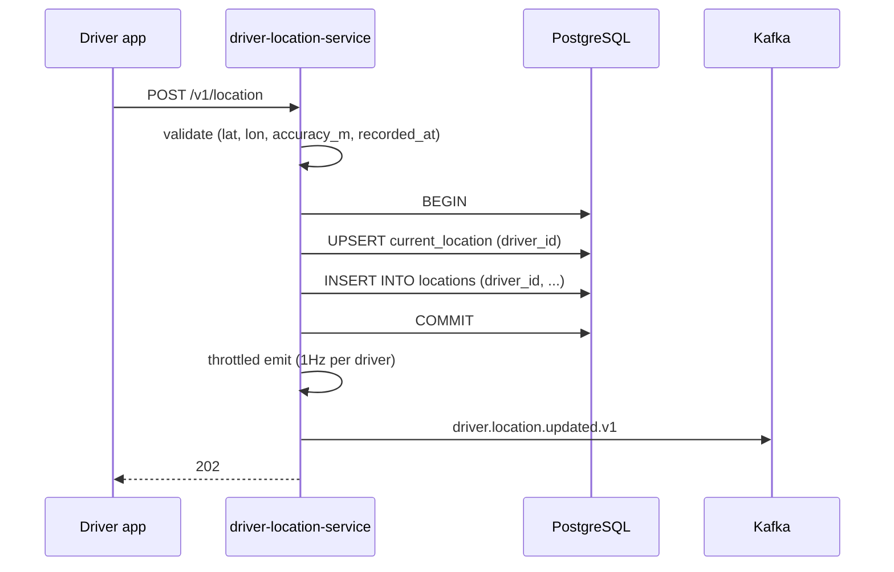
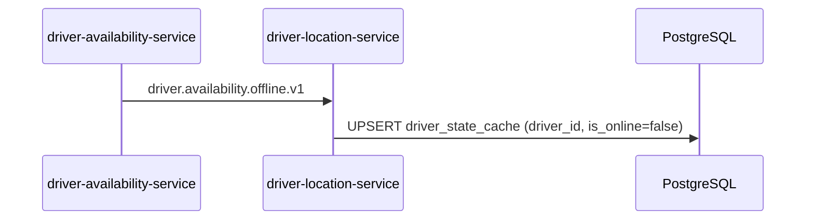
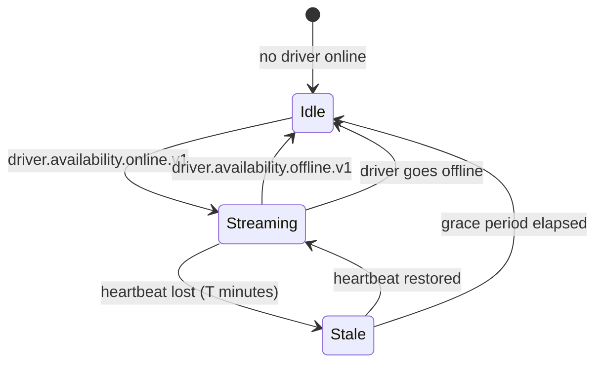

# driver-location-service — Workflows

## 1. Driver Streams GPS (Single Point)

### 1.1 Objective

Record the driver's latest position and publish a curated event
for downstream consumers (dispatch, trip, safety, ETA).

### 1.2 Initiating Actor

The driver app.

### 1.3 Participating Services

- `driver-location-service` (this service)
- PostgreSQL 18 with PostGIS
- Kafka

### 1.4 Prerequisites

- The driver is online (we accept late points with a warning).
- The point passes validation.

### 1.5 Happy Path



### 1.6 Alternate Paths

- Driver offline: log warning; still accept (driver in tunnel);
  still publish curated event.
- Bad coordinates: 400 `VALIDATION_FAILED`; no DB write.
- Bad accuracy: 400 `GPS_TOO_NOISY`; no DB write.

### 1.7 Failure Paths

- DB down: 503 `DEPENDENCY_TIMEOUT`; driver app retries with
  backoff. The point is buffered client-side.
- Kafka down: write succeeds; the outbox holds the curated event;
  the poller retries.

### 1.8 Business Rules

- BR--002, BR--003, BR--007, BR--016.

### 1.9 State Transitions

N/A (no state machine). The row in `current_location` is the truth.

### 1.10 Events

| Event | Direction | When |
|-------|-----------|------|
| `driver.location.updated.v1` | produced | at most 1Hz per driver |

### 1.11 APIs Involved

| API | Direction | When |
|-----|-----------|------|
| `POST /v1/location` | inbound | trigger |

### 1.12 Compensation / Rollback

- If the DB transaction fails, no event is published.
- If the outbox publish fails, the poller retries; the write is
  durable.

### 1.13 Final State

`current_location` is updated; `locations` has a new row; the
curated event is published.

## 2. Driver Batch Upload (Offline Recovery)

### 2.1 Objective

Allow the driver app to upload a backlog of points after a tunnel
or temporary disconnect.

### 2.2 Initiating Actor

The driver app.

### 2.3 Participating Services

- `driver-location-service` (this service)
- PostgreSQL 18
- Kafka

### 2.4 Prerequisites

- The batch size is ≤ 1000.
- All points pass validation.
- The driver is online (we accept late points with a warning).

### 2.5 Happy Path

```mermaid
sequenceDiagram
    participant DR as Driver app
    participant DL as driver-location-service
    participant PG as PostgreSQL
    participant K as Kafka

    DR->>DL: POST /v1/location/batch (Idempotency-Key)
    DL->>DL: validate each point
    DL->>PG: BEGIN
    loop each point
        DL->>PG: UPSERT current_location
        DL->>PG: INSERT INTO locations
    end
    DL->>PG: COMMIT
    DL->>DL: throttled emit (1Hz; collapse to latest)
    DL->>K: driver.location.updated.v1 (latest)
    DL-->>DR: 202
```

### 2.6 Alternate Paths

- Batch > 1000: 422 `BATCH_TOO_LARGE`.
- Some points fail validation: the batch is rejected; the driver
  app is told which indices failed.

### 2.7 Failure Paths

- DB down: 503; the driver app retries with backoff.
- Idempotency replay: returns the stored response.

### 2.8 Business Rules

- BR--018: batch upload supported.

### 2.9 State Transitions

N/A.

### 2.10 Events

| Event | Direction | When |
|-------|-----------|------|
| `driver.location.updated.v1` | produced | collapsed to latest at 1Hz |

### 2.11 APIs Involved

| API | Direction | When |
|-----|-----------|------|
| `POST /v1/location/batch` | inbound | trigger |

### 2.12 Compensation / Rollback

- If the DB transaction fails mid-batch, the whole transaction is
  rolled back; no partial state.
- If the outbox publish fails, the poller retries.

### 2.13 Final State

`current_location` is updated to the latest point in the batch;
`locations` has N new rows (one per point in the batch); one
curated event is published.

## 3. Driver Goes Offline

### 3.1 Objective

Mark the driver as offline in the local cache; continue to accept
late points with a warning.

### 3.2 Initiating Actor

`driver-availability-service` emits `driver.availability.offline.v1`.

### 3.3 Participating Services

- `driver-availability-service` (event producer)
- `driver-location-service` (this service)

### 3.4 Prerequisites

- None.

### 3.5 Happy Path



### 3.6 Alternate Paths

- Event duplicate: inbox dedup.

### 3.7 Failure Paths

- DB down: retry; on persistent failure, page on-call.

### 3.8 Business Rules

- BR--020: audit event.

### 3.9 State Transitions

N/A.

### 3.10 Events

| Event | Direction | When |
|-------|-----------|------|
| `driver.availability.offline.v1` | consumed | trigger |

### 3.11 APIs Involved

None.

### 3.12 Compensation / Rollback

If the DB write fails, the poller retries.

### 3.13 Final State

`driver_state_cache` reflects `is_online=false`; we still accept
late points with a warning.

## 4. Dispatch Reads Per-Zone

### 4.1 Objective

Serve a per-zone "drivers in zone" query for dispatch.

### 4.2 Initiating Actor

`dispatch-service` (or the admin UI).

### 4.3 Participating Services

- `driver-location-service` (this service)
- PostgreSQL 18 with PostGIS

### 4.4 Prerequisites

- The query is for a valid zone and a sensible radius.

### 4.5 Happy Path

```mermaid
sequenceDiagram
    participant DSP as dispatch-service
    participant DL as driver-location-service
    participant PG as PostgreSQL

    DSP->>DL: GET /v1/location/zone/{zone_id}/current?radius_m=5000
    DL->>PG: SELECT ... FROM current_location c
              JOIN zones z ON ...
              WHERE ST_DWithin(c.geog, z.centroid, 5000)
              AND NOT stale
    PG-->>DL: rows
    DL-->>DSP: 200 { items: [...] }
```

### 1.6 Alternate Paths

- Zone not found: 404 `ZONE_NOT_FOUND`.
- Radius too large: 422 `RADIUS_TOO_LARGE`.

### 1.7 Failure Paths

- DB down: 503.

### 1.8 Business Rules

- BR--019: ≤ 200ms p99.

### 1.9 State Transitions

N/A.

### 1.10 Events

None.

### 1.11 APIs Involved

| API | Direction | When |
|-----|-----------|------|
| `GET /v1/location/zone/{zone_id}/current` | inbound | trigger |

### 1.12 Compensation / Rollback

N/A.

### 1.13 Final State

A list of drivers in the zone with their last known positions.


## 99. Driver Location Stream State Machine

This state machine summarizes the service's internal
state transitions (across all workflows above).



## 99. `Daily` Partition Maintenance`

### 99.1 Objective

Idempotently pre-create the next 30 day child partitions for `driver_location.locations` so an INSERT at any time lands in an existing child. The drop half is handled by the per-service retention job.

### 99.2 Initiating Actor

A scheduled job runs daily at `02:00 UTC`. Leader-elected via `pg_try_advisory_xact_lock(hashtext('driver_location.partition'), hashtext('daily'))`.

### 99.3 Happy Path

```mermaid
sequenceDiagram
    participant JOB as Partition job
    participant PG as PostgreSQL
    JOB->>PG: pg_try_advisory_xact_lock('driver_location.daily')
    alt lock acquired
        loop for each missing day in next 30
            JOB->>PG: CREATE TABLE IF NOT EXISTS driver_location.locations_day PARTITION OF driver_location.locations
            JOB->>PG: verify (pg_inherits, relpartbound)
        end
        JOB->>PG: assert now() in existing child
    else lock NOT acquired
        Note over JOB: another instance is running; exit cleanly
    end
```

### 99.4 Failure Paths

| Failure | Handling |
|---------|----------|
| Lock contention | exit 0 |
| DDL fails | retry 3× with backoff (1 s / 4 s / 16 s); page on-call |
| Today's child missing | critical alert; INSERTs would fail |

### 99.5 Business Rules

- Pre-create 30 complete future days.
- Every child is created with `CREATE TABLE IF NOT EXISTS … PARTITION OF …` so the job is safe to run twice in the same window.
- A verification step (`pg_inherits` parent + `relpartbound` range) runs after every `CREATE TABLE IF NOT EXISTS` because `IF NOT EXISTS` only guards the name, not the bounds.
- Optionally emit `audit.partition.maintained.v1` on success.

---

## See also

### Sibling docs for this service

- [`README.md`](./README.md) — purpose, bounded context, responsibilities
- [`BRD.md`](./BRD.md) — business requirements
- [`SRS.md`](./SRS.md) — functional + non-functional requirements
- [`ERD.md`](./ERD.md) — data model (entities, relationships)
- [`INTEGRATION.md`](./INTEGRATION.md) — inter-service contracts (APIs, events, sagas)
- [`WORKFLOWS.md`](./WORKFLOWS.md) — operational workflows (happy paths, failure modes)
- [`TECH.md`](./TECH.md) — technology profile (runtime, libraries, data layer, admin endpoints, RBAC)

### Platform-wide

- [`../../shared/README.md`](../../shared/README.md) — `platform-spring-boot-starter` shared library (the single source of cross-cutting code for all Spring Boot services in the platform)
- [`../RECOMMENDATIONS.md`](../RECOMMENDATIONS.md) — platform-wide technology map (language, framework, version baseline, admin/RBAC pattern)
- [`../../README.md`](../../README.md) — services overview (the catalog of all 58 services)
- [`../../../main.md`](../../../main.md) — top-level platform specification (architecture, Keycloak, PostgreSQL 18, messaging, observability baseline)

