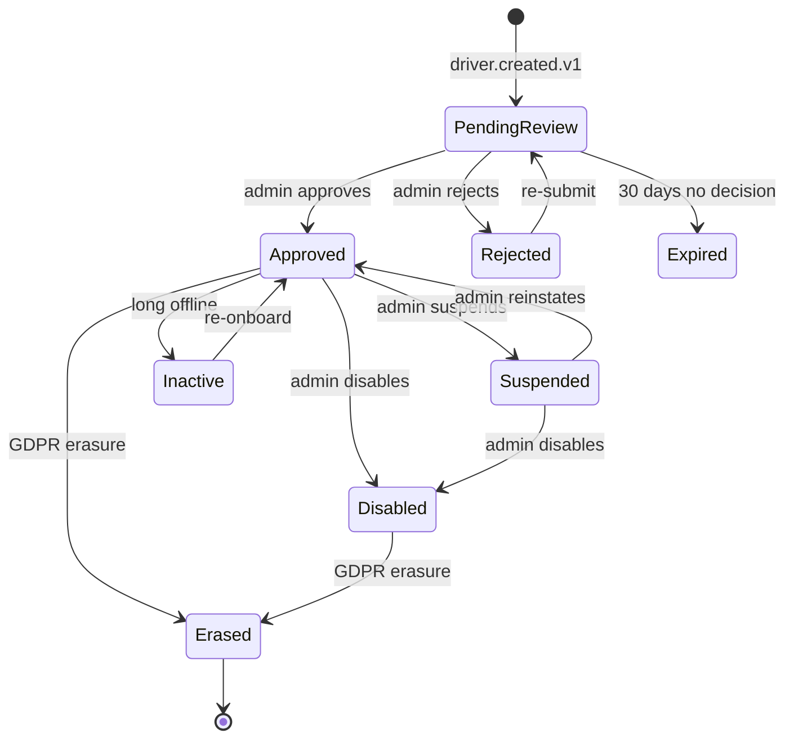

# driver-service — Software Requirements Specification

## 1. Introduction

This document specifies the software behavior, contracts,
and non-functional requirements of the `driver-service`.
The service is the platform's source of truth for the
driver aggregate — KYC, document expiry, eligibility per
city, rating, and the driver state machine.

## 2. Scope

**In scope:**

- Driver profile (KYC, documents, eligibility, rating).
- Driver state machine (`pending_review`, `approved`,
  `rejected`, `suspended`, `inactive`, `erased`).
- Document expiry warnings (30, 7, 1 day) and
  auto-suspend after grace period.
- City-level eligibility.
- Rating read-model.
- GDPR right-to-erasure.
- Event emission (`driver.*.v1`).

**Out of scope:**

- Authentication (Keycloak via `identity-service`).
- Common user preferences.
- Location.
- Availability.
- Earnings / withdrawals.
- Reviews / ratings aggregation.
- Vehicle data (only a reference).

## 3. System Context

```mermaid
flowchart LR
    IS[identity-service]
    VS["`driver-service` (vehicles)]
    RRS["`trip-service` / `food-order-service` / `search-service` (review projections)]
    KAFKA[(Kafka)]
    DSV[driver-service]
    DB[(PostgreSQL schema: driver)]
    REDIS[(Redis)]
    KYC[KYC + background-check providers]
    CFG[configuration-service]
    DAS["`driver-service` (availability)]
    DSP["`driver-service` (dispatch)]
    RRS2["`trip-service` (ride-request)]
    NOT[notification-service]
    FRS[fraud-risk-service]
    AUD[audit-service]
    ANA["`reporting-service` (data lake)]
    ADM[admin-service]

    IS -->|identity.*.v1| KAFKA
    KAFKA --> DSV
    VS -->|vehicle.*.v1| KAFKA
    KAFKA --> DSV
    RRS -->|review.aggregated.v1| KAFKA
    KAFKA --> DSV
    CFG -->|configuration.updated.v1| KAFKA
    KAFKA --> DSV
    DSV --> DB
    DSV --> REDIS
    DSV --> KYC
    DSV -->|driver.*.v1| KAFKA
    KAFKA --> DAS
    KAFKA --> DSP
    KAFKA --> RRS2
    KAFKA --> NOT
    KAFKA --> FRS
    KAFKA --> AUD
    KAFKA --> ANA
    ADM --> DSV
```

## 4. Actors

- **Driver** (human) — manages profile, uploads
  documents.
- **Internal admin / support** (human) — admin actions.
- **KYC / background-check providers** (system) —
  verify documents.
- **Downstream services** (system) — read the driver
  for ride matching, etc.

## 5. Functional Requirements

| ID | Requirement | Priority |
|----|-------------|----------|
| FR--001 | Provide `GET /v1/drivers/{driver_id}` returning the driver. | MUST |
| FR--002 | Provide `POST /v1/drivers` to create a driver (idempotent on `identity_id`). | MUST |
| FR--003 | Provide `PATCH /v1/drivers/{driver_id}` to update profile fields. | MUST |
| FR--004 | Provide `GET /v1/drivers/{driver_id}/documents`. | MUST |
| FR--005 | Provide `POST /v1/drivers/{driver_id}/documents` to upload a document. | MUST |
| FR--006 | Provide `DELETE /v1/drivers/{driver_id}/documents/{document_id}`. | MUST |
| FR--007 | Provide `GET /v1/drivers/{driver_id}/eligibility` returning per-city eligibility. | MUST |
| FR--008 | Provide `POST /v1/drivers/{driver_id}/eligibility/cities/{city_id}`. | MUST |
| FR--009 | Provide `GET /v1/drivers/{driver_id}/rating`. | MUST |
| FR--010 | Provide `POST /v1/drivers/{driver_id}/approve` (admin). | MUST |
| FR--011 | Provide `POST /v1/drivers/{driver_id}/reject` (admin). | MUST |
| FR--012 | Provide `POST /v1/drivers/{driver_id}/suspend` (admin). | MUST |
| FR--013 | Provide `POST /v1/drivers/{driver_id}/reinstate` (admin). | MUST |
| FR--014 | Provide `POST /v1/drivers/{driver_id}/disable` (admin). | MUST |
| FR--015 | Provide `POST /v1/drivers/{driver_id}/erase` (GDPR). | MUST |
| FR--016 | Consume `identity.user.created.v1` to back-fill a driver. | MUST |
| FR--017 | Consume `identity.user.updated.v1` to refresh cached claims. | MUST |
| FR--018 | Consume `identity.user.suspended.v1` to mark the driver suspended. | MUST |
| FR--019 | Consume `identity.user.disabled.v1`. | MUST |
| FR--020 | Consume `identity.user.reinstated.v1`. | MUST |
| FR--021 | Consume `identity.user.erased.v1` to GDPR-erasure. | MUST |
| FR--022 | Consume `vehicle.registered.v1` to link primary vehicle. | MUST |
| FR--023 | Consume `vehicle.insurance.expired.v1` to auto-suspend. | MUST |
| FR--024 | Consume `vehicle.inspection.expired.v1` to auto-suspend. | MUST |
| FR--025 | Consume `review.aggregated.v1` to update rating. | MUST |
| FR--026 | Nightly job emits `driver.document.expiring.v1` 30, 7, 1 day before expiry. | MUST |
| FR--027 | Nightly job auto-suspends drivers with expired critical documents after grace period. | MUST |
| FR--028 | Emit `driver.created.v1`. | MUST |
| FR--029 | Emit `driver.approved.v1`. | MUST |
| FR--030 | Emit `driver.rejected.v1`. | MUST |
| FR--031 | Emit `driver.suspended.v1`. | MUST |
| FR--032 | Emit `driver.reinstated.v1`. | MUST |
| FR--033 | Emit `driver.disabled.v1`. | MUST |
| FR--034 | Emit `driver.erased.v1`. | MUST |
| FR--035 | Emit `driver.document.expiring.v1`. | MUST |
| FR--036 | Emit `driver.document.expired.v1`. | MUST |
| FR--037 | Emit `driver.inactive.v1`. | SHOULD |
| FR--038 | All writes use the outbox pattern. | MUST |
| FR--039 | All non-idempotent POSTs require `Idempotency-Key`. | MUST |

## 6. Non-Functional Requirements

| ID | Category | Requirement | Target |
|----|----------|-------------|--------|
| NFR--001 | availability | monthly uptime | 99.95% |
| NFR--002 | performance | P99 read latency | ≤ 30 ms |
| NFR--003 | performance | P99 write latency | ≤ 500 ms |
| NFR--004 | scalability | concurrent reads per replica | ≥ 5,000 |
| NFR--005 | scalability | horizontal scale | 3 → 30 replicas per region |
| NFR--006 | maintainability | MTTR | ≤ 15 min median |
| NFR--007 | reliability | outbox publish lag P99 | ≤ 5 s |
| NFR--008 | reliability | event loss | 0 |
| NFR--009 | compliance | GDPR erasure SLA | 100% within 24 h expedited |
| NFR--010 | safety | auto-suspend within grace period | 100% |

## 7. API Requirements

All endpoints follow `architecture/API_STANDARDS.md`.
Full contract in `INTEGRATION.md`.

## 8. Data Requirements

| ID | Requirement | Notes |
|----|-------------|-------|
| DATA--001 | The service MUST own the `driver` schema. | One writer. |
| DATA--002 | Primary keys MUST be UUIDv7. | Time-ordered. |
| DATA--003 | Cross-service IDs (`identity_id`, `vehicle_id`, `background_check_verification_id`) MUST be UUID columns WITHOUT database FKs. | Consistency strategy. |
| DATA--004 | PII columns MUST be column-level encrypted. | Envelope encryption. |
| DATA--005 | Audit columns MUST be present on every mutable table. | Standard. |
| DATA--006 | Soft delete (`deleted_at`) MUST be used for drivers. | GDPR. |
| DATA--007 | The `outbox` table MUST be present and used. | At-least-once. |
| DATA--008 | `driver_rating_history` MUST be range-partitioned by month. | Volume. |

(Full schema in `ERD.md`.)

## 9. Validation Rules

- `status` MUST be in `('pending_review', 'approved',
  'rejected', 'suspended', 'inactive', 'erased')`.
- A `document.type` MUST be in
  `driver.kyc.required_documents`.
- A `document.expiry_date` MUST be a future date
  on upload.
- A `rating` MUST be in `[0.0, 5.0]`.
- A driver cannot be `approved` unless all
  required documents are uploaded and verified.
- A driver cannot be `approved` unless they have a
  primary vehicle.

## 10. State Transitions



## 11. Authorization Requirements

- All endpoints require a JWT bearer token.
- Self-service endpoints require `X-User-Id ==
  driver_id`; otherwise 403.
- Cross-driver reads (e.g. dispatch reading
  eligibility) require `driver.read.any` scope.
- Admin endpoints require `driver.admin` realm
  role on `platform-internal`.

## 12. Configuration Requirements

Listed in `README.md` 13.

## 13. Error Handling

| Condition | Response |
|-----------|----------|
| Unknown `driver_id` | 404 `NOT_FOUND` |
| Concurrent update | 409 `CONFLICT` |
| Approve with missing documents | 422 `KYC_DOCUMENTS_REQUIRED` |
| KYC provider failure | 502 `DEPENDENCY_UPSTREAM_FAILURE` |
| `Idempotency-Key` reused with different body | 422 `IDEMPOTENCY_KEY_REUSED` |
| Already-approved driver re-approved | 409 `CONFLICT` |

## 14. Concurrency Requirements

- The `drivers` row has an optimistic-lock version
  (`row_version`).
- The outbox poller is single-writer per replica via
  a Postgres advisory lock.

## 15. Idempotency Requirements

- All non-idempotent POSTs require `Idempotency-Key`.

## 16. Performance

- **Dominant path**: driver read by `driver_id` (PK
  index hit) → return row. P99 ≤ 30 ms.
- Hot DB query: `SELECT * FROM driver.drivers WHERE
  id = $1`.
- Cache: Redis claim hot-cache TTL 600 s.

## 17. Scalability

- **Horizontal**: stateless beyond PostgreSQL +
  Redis + Kafka.
- **Vertical**: 1 vCPU / 1 GiB default.
- **HPA**: CPU 60% target; custom metric
  `driver_lookups_per_second` (target 5k/replica).

## 18. Availability

- **SLO**: 99.95% per 30d.
- **Error budget**: ~22 min / 30d.
- **Maintenance window**: none planned; rolling
  deploys.

## 19. Security

| ID | Requirement | Notes |
|----|-------------|-------|
| SEC--001 | All endpoints require a JWT bearer token. | Self or service. |
| SEC--002 | Self-service endpoints enforce `X-User-Id == driver_id`. | Gateway-injected header. |
| SEC--003 | PII columns are column-level encrypted. | Envelope encryption. |
| SEC--004 | Document files stored in `file-service`; this service holds only the `file_id`. | Defense in depth. |
| SEC--005 | No PII is logged in production. | Defense in depth. |
| SEC--006 | GDPR erasure preserves `driver_id`. | Soft delete + tombstone. |
| SEC--007 | mTLS in cluster. | Network-layer identity. |

## 20. Privacy

- Stored PII: `name`, `email`, `phone` (cached
  claims).
- Encryption: column-level, per-tenant DEK.
- Retention: until erasure + 7 years for the
  `driver_id` tombstone; financial records retained
  per legal hold with PII redacted.
- Erasure: `POST /v1/drivers/{id}/erase` anonymizes
  PII; `driver_id` preserved.
- Logs do not contain PII in production.

## 21. Auditability

- Every state change writes a row to
  `driver.driver_audit_log` (append-only) AND
  emits the corresponding `driver.*.v1` event.
- Retention 7 years.

## 22. Observability

- **Logs**: JSON to stdout; fields listed in
  `README.md` 15.
- **Metrics**: RED per endpoint + business metrics
  listed in `README.md` 15.
- **Traces**: OpenTelemetry. Sample 100% on errors,
  10% on success.
- **Alerts**: SLO burn-rate; document expiry
  warning lag; auto-suspend lag; rating update
  lag.

## 23. Maintainability

- **Code style**: Java 21 (Spotless + Checkstyle).
- **Test coverage**: ≥ 85% overall, 100% on
  KYC, document expiry, eligibility, erasure
  paths.

## 24. Disaster Recovery

- **RPO**: ≤ 5 min (WAL streaming + 7-day PITR).
- **RTO**: ≤ 30 min (warm standby).

## 25. Acceptance Criteria

- An `identity.user.created.v1` event results in
  a `drivers` row within 5 seconds.
- A document upload results in a
  `driver.documents` row and triggers the KYC
  provider verification.
- An admin approval results in
  `driver.approved.v1` emitted; the driver can
  go online.
- An admin rejection results in
  `driver.rejected.v1` emitted with a reason.
- A document expiring in 30 / 7 / 1 day results
  in `driver.document.expiring.v1` emitted with
  the correct `days_remaining`.
- A document expired past the grace period
  results in `driver.document.expired.v1` emitted
  and the driver auto-suspended.
- A `vehicle.insurance.expired.v1` event results
  in the driver auto-suspended if no replacement
  is uploaded within the grace period.
- A `review.aggregated.v1` event results in the
  driver's rating updated within 5 minutes.
- A GDPR erasure request results in PII redaction
  and `driver.erased.v1` emitted.
- A ``driver-service` (dispatch)` request to check a
  driver's eligibility returns `true` for an
  approved, non-suspended driver with valid
  documents in the city.

---

## Appendix A — Predecessor SRS absorbed (dispatch + driver-availability + driver-location + driver-incentive)

The functional and non-functional requirements below were migrated
from ``driver-service` (dispatch)/SRS.md`, ``driver-service` (availability)/SRS.md`,
``driver-service` (location)/SRS.md`, and ``driver-service` (incentives)/SRS.md`
as part of [ADR-0016](../../architecture/adrs/0016-service-domain-consolidation.md).
The canonical source is [`../../MIGRATION_HUB.md`](../../MIGRATION_HUB.md)
3.4, 3.5, 3.6, 3.7.

### A.1 Functional requirements (from dispatch)

| ID | Requirement | Priority |
|----|-------------|----------|
| FR-DSP-001 | On `ride.request.created.v1`, start a match attempt. | MUST |
| FR-DSP-002 | Query the embedded available-driver pool and sort by ETA, fairness, recent activity. | MUST |
| FR-DSP-003 | Send a ride offer to the top candidate; hold 15 s offer timer. | MUST |
| FR-DSP-004 | On accept, emit `dispatch.matched.v1`; stop search. | MUST |
| FR-DSP-005 | On expiration, emit `dispatch.offer.expired.v1`; try next. | MUST |
| FR-DSP-006 | After N attempts, emit `dispatch.no_driver.v1`. | MUST |
| FR-DSP-007 | Persist every match attempt for audit and fairness. | MUST |
| FR-DSP-008 | Honour surge / restricted zones in candidate scoring. | SHOULD |

### A.2 Functional requirements (from driver-availability)

| ID | Requirement | Priority |
|----|-------------|----------|
| FR-DA-001 | Accept online / offline requests. | MUST |
| FR-DA-002 | Track ride types and zone. | MUST |
| FR-DA-003 | Mark driver `busy` on match; back to `available` on trip complete. | MUST |
| FR-DA-004 | Refuse offline if active trip. | MUST |
| FR-DA-005 | Emit online / offline / busy / zone-changed events. | MUST |

### A.3 Functional requirements (from driver-location)

| ID | Requirement | Priority |
|----|-------------|----------|
| FR-DL-001 | Ingest GPS pings at up to 5 Hz per driver. | MUST |
| FR-DL-002 | UPSERT current_location by `driver_id`. | MUST |
| FR-DL-003 | Persist recent trail (partitioned by day). | MUST |
| FR-DL-004 | Emit `driver.location.updated.v1` at curated 1 Hz. | MUST |
| FR-DL-005 | Serve `GET /v1/drivers/{id}/location` ≤ 30 ms p99. | MUST |

### A.4 Functional requirements (from driver-incentive)

| ID | Requirement | Priority |
|----|-------------|----------|
| FR-DI-001 | Define quests / bonuses / guarantees (admin-configured). | MUST |
| FR-DI-002 | Evaluate eligibility per completed trip. | MUST |
| FR-DI-003 | Calculate the earned amount; post to embedded earnings ledger with idempotency key. | MUST |
| FR-DI-004 | Emit `driver.incentive.earned.v1`. | MUST |

### A.5 Validation rules (predecessor)

- A driver MUST be `online` and in the requested city/zone.
- A driver MUST NOT already hold an active offer or active trip.
- `offer_window_seconds` MUST be > 0 and ≤ 60.
- `max_attempts` MUST be ≥ 1 and ≤ 20.
- An `accept` MUST arrive within the offer window.

### A.6 Idempotency keys (predecessor)

- `match:<match_id>:accept:<driver_id>`
- `match:<match_id>:reject:<driver_id>`
- `match:<match_id>:reassign:<admin_id>:<timestamp>`
- `driver:{driver_id}:incentive:{trip_id}`

### A.7 Non-functional requirements (predecessor)

| ID | Category | Target |
|----|----------|--------|
| NFR-DSP-001 | performance | P50 time-to-match ≤ 30 s |
| NFR-DSP-002 | performance | P95 time-to-match ≤ 60 s |
| NFR-DSP-003 | availability | 99.95% / 30 d |
| NFR-DL-001 | performance | 5 Hz ingestion per driver |
| NFR-DL-002 | performance | P95 GET ≤ 30 ms |
| NFR-DA-001 | correctness | Refuse offline if busy |
| NFR-DI-001 | correctness | Idempotent posting of earned amount |

### A.8 Acceptance criteria (predecessor)

- Match attempt reaches the closest candidate within 30 s p50.
- Embedded location stream degrades gracefully (stale + wider radius)
  when location sub-call fails.
- Driver cannot go offline while busy.

---

## See also

### Sibling docs for this service

- [`README.md`](./README.md) — purpose, bounded context, responsibilities
- [`BRD.md`](./BRD.md) — business requirements
- [`SRS.md`](./SRS.md) — functional + non-functional requirements
- [`ERD.md`](./ERD.md) — data model (entities, relationships)
- [`INTEGRATION.md`](./INTEGRATION.md) — inter-service contracts (APIs, events, sagas)
- [`WORKFLOWS.md`](./WORKFLOWS.md) — operational workflows (happy paths, failure modes)
- [`TECH.md`](./TECH.md) — technology profile (runtime, libraries, data layer, admin endpoints, RBAC)

### Platform-wide

- [`../../shared/README.md`](../../shared/README.md) — `platform-spring-boot-starter` shared library (the single source of cross-cutting code for all Spring Boot services in the platform)
- [`../RECOMMENDATIONS.md`](../RECOMMENDATIONS.md) — platform-wide technology map (language, framework, version baseline, admin/RBAC pattern)
- [`../../README.md`](../../README.md) — services overview (the catalog of all 20 services)
- [`../../../main.md`](../../../main.md) — top-level platform specification (architecture, Keycloak, PostgreSQL 18, messaging, observability baseline)

