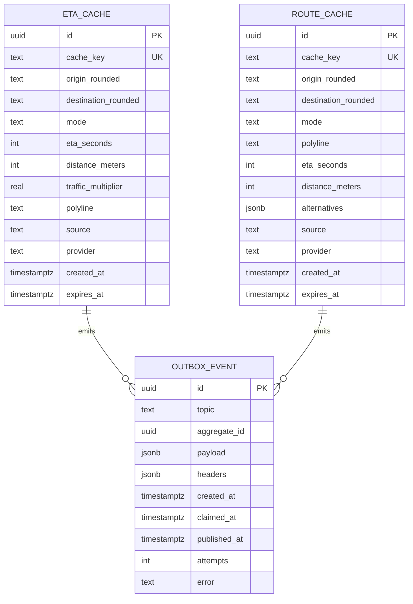

# eta-routing-service — Entity-Relationship Diagram

## 1. Database

- Engine: PostgreSQL 18
- Schema: `eta_routing` (owned exclusively by this service).
- Migrations: `services/eta-routing-service/migrations/`.
- The schema is **cache only** — the source of truth is the map
  provider. The cache is rebuilt on TTL or provider update.

## 2. Cross-Service References

None. The service does not store references to other services.

## 3. Entities

### `EtaCache`

A cached ETA result.

#### Columns

| Column | Type | Constraints | Notes |
|--------|------|-------------|-------|
| `id` | UUID | PK | UUIDv7 |
| `cache_key` | TEXT | NOT NULL, UNIQUE | hash of the request |
| `origin_rounded` | TEXT | NOT NULL | e.g. `25.2048,55.2708` |
| `destination_rounded` | TEXT | NOT NULL | same |
| `mode` | TEXT | NOT NULL | car/motorcycle/bicycle/walking |
| `eta_seconds` | INT | NOT NULL | |
| `distance_meters` | INT | NOT NULL | |
| `traffic_multiplier` | REAL | NOT NULL DEFAULT 1.0 | |
| `polyline` | TEXT | NULL | optional |
| `source` | TEXT | NOT NULL, CHECK (source IN ('cache','provider','failover')) | observability |
| `provider` | TEXT | NOT NULL | here / google / osrm |
| `created_at` | TIMESTAMPTZ | NOT NULL DEFAULT now() | |
| `expires_at` | TIMESTAMPTZ | NOT NULL | |

#### Indexes

- PK on `id`
- UNIQUE on `cache_key`
- `idx_eta_cache_expires` on `(expires_at)` for purging.

### `RouteCache`

A cached route result.

#### Columns

| Column | Type | Constraints | Notes |
|--------|------|-------------|-------|
| `id` | UUID | PK | UUIDv7 |
| `cache_key` | TEXT | NOT NULL, UNIQUE | hash of the request |
| `origin_rounded` | TEXT | NOT NULL | |
| `destination_rounded` | TEXT | NOT NULL | |
| `mode` | TEXT | NOT NULL | |
| `polyline` | TEXT | NOT NULL | |
| `eta_seconds` | INT | NOT NULL | |
| `distance_meters` | INT | NOT NULL | |
| `alternatives` | JSONB | NOT NULL DEFAULT '[]' | `[{polyline, eta_seconds, distance_meters}]` |
| `source` | TEXT | NOT NULL | |
| `provider` | TEXT | NOT NULL | |
| `created_at` | TIMESTAMPTZ | NOT NULL DEFAULT now() | |
| `expires_at` | TIMESTAMPTZ | NOT NULL | |

#### Indexes

- PK on `id`
- UNIQUE on `cache_key`
- `idx_route_cache_expires` on `(expires_at)` for purging.

### `OutboxEvent`

#### Columns

| Column | Type | Constraints | Notes |
|--------|------|-------------|-------|
| `id` | UUID | PK | UUIDv7 |
| `topic` | TEXT | NOT NULL | |
| `aggregate_id` | UUID | NOT NULL | partition key = `cache_key` hash |
| `payload` | JSONB | NOT NULL | |
| `headers` | JSONB | NOT NULL DEFAULT '{}'::jsonb | |
| `created_at` | TIMESTAMPTZ | NOT NULL DEFAULT now() | |
| `claimed_at` | TIMESTAMPTZ | NULL | |
| `published_at` | TIMESTAMPTZ | NULL | |
| `attempts` | INT | NOT NULL DEFAULT 0 | |
| `error` | TEXT | NULL | |

## 4. Mermaid ER Diagram



## 5. DDL Sketch

```sql
CREATE SCHEMA IF NOT EXISTS eta_routing;
SET search_path TO eta_routing;

CREATE TABLE eta_routing.eta_cache (
    id UUID NOT NULL,
    cache_key TEXT NOT NULL,
    origin_rounded TEXT NOT NULL,
    destination_rounded TEXT NOT NULL,
    mode TEXT NOT NULL,
    eta_seconds INT NOT NULL,
    distance_meters INT NOT NULL,
    traffic_multiplier REAL NOT NULL DEFAULT 1.0,
    polyline TEXT,
    source TEXT NOT NULL,
    provider TEXT NOT NULL,
    created_at TIMESTAMPTZ NOT NULL DEFAULT now(),
    expires_at TIMESTAMPTZ NOT NULL,
    PRIMARY KEY (id, created_at),
    CONSTRAINT chk_eta_source CHECK (source IN ('cache','provider','failover'))
) PARTITION BY RANGE (created_at);
CREATE INDEX idx_eta_cache_expires
    ON eta_routing.eta_cache (expires_at);
CREATE UNIQUE INDEX idx_eta_cache_key
    ON eta_routing.eta_cache (cache_key);

CREATE TABLE IF NOT EXISTS eta_routing.eta_cache_2026_08
    PARTITION OF eta_routing.eta_cache
    FOR VALUES FROM ('2026-08-01 00:00:00+00') TO ('2026-09-01 00:00:00+00');

CREATE TABLE eta_routing.route_cache (
    id UUID PRIMARY KEY,
    cache_key TEXT NOT NULL UNIQUE,
    origin_rounded TEXT NOT NULL,
    destination_rounded TEXT NOT NULL,
    mode TEXT NOT NULL,
    polyline TEXT NOT NULL,
    eta_seconds INT NOT NULL,
    distance_meters INT NOT NULL,
    alternatives JSONB NOT NULL DEFAULT '[]'::jsonb,
    source TEXT NOT NULL,
    provider TEXT NOT NULL,
    created_at TIMESTAMPTZ NOT NULL DEFAULT now(),
    expires_at TIMESTAMPTZ NOT NULL
);
CREATE INDEX idx_route_cache_expires
    ON eta_routing.route_cache (expires_at);

CREATE TABLE eta_routing.outbox (
    id UUID PRIMARY KEY,
    topic TEXT NOT NULL,
    aggregate_id UUID NOT NULL,
    payload JSONB NOT NULL,
    headers JSONB NOT NULL DEFAULT '{}'::jsonb,
    created_at TIMESTAMPTZ NOT NULL DEFAULT now(),
    claimed_at TIMESTAMPTZ,
    published_at TIMESTAMPTZ,
    attempts INT NOT NULL DEFAULT 0,
    error TEXT
);
CREATE INDEX idx_outbox_pending
    ON eta_routing.outbox (created_at)
    WHERE published_at IS NULL;
```

## 6. Audit Columns

None. The cache is rebuilt on TTL; no audit trail beyond the
events emitted to `analytics-service`.

## 7. Soft Delete

Not used. The cache is purged by TTL.

## 8. JSONB Usage

- `route_cache.alternatives`: list of alternative routes.
- `outbox.payload`: full event envelope.

## 9. Partitioning

| Table | Strategy | Cadence | Pre-create | Retention |
|-------|----------|---------|------------|-----------|
| `eta_cache` | RANGE on `created_at` | monthly | 12 months | TTL (default 60s) |

See [`DATABASE_ARCHITECTURE.md` §"Table Partitioning — Canonical Template"](../../architecture/DATABASE_ARCHITECTURE.md) for the idempotent `CREATE TABLE IF NOT EXISTS … PARTITION OF …` pattern, naming convention, and the service-owned maintenance-job contract.

## 10. Data Retention

| Table | Retention | Purged by |
|-------|-----------|-----------|
| `eta_cache` | TTL (default 60s) | scheduled purge of `expires_at < now()` |
| `route_cache` | TTL (default 300s) | scheduled purge |
| `outbox` | 24h after publish | poller purge |

## 11. Migration Considerations

- The cache is rebuilt on TTL; a schema change can be deployed
  with a brief cache flush.
- The `source` CHECK is the source of truth for the observability
  classification; adding a new value requires a migration.

---

## See also

### Sibling docs for this service

- [`README.md`](./README.md) — purpose, bounded context, responsibilities
- [`BRD.md`](./BRD.md) — business requirements
- [`SRS.md`](./SRS.md) — functional + non-functional requirements
- [`ERD.md`](./ERD.md) — data model (entities, relationships)
- [`INTEGRATION.md`](./INTEGRATION.md) — inter-service contracts (APIs, events, sagas)
- [`WORKFLOWS.md`](./WORKFLOWS.md) — operational workflows (happy paths, failure modes)
- [`TECH.md`](./TECH.md) — technology profile (runtime, libraries, data layer, admin endpoints, RBAC)

### Platform-wide

- [`../../shared/README.md`](../../shared/README.md) — `platform-spring-boot-starter` shared library (the single source of cross-cutting code for all Spring Boot services in the platform)
- [`../RECOMMENDATIONS.md`](../RECOMMENDATIONS.md) — platform-wide technology map (language, framework, version baseline, admin/RBAC pattern)
- [`../../README.md`](../../README.md) — services overview (the catalog of all 58 services)
- [`../../../main.md`](../../../main.md) — top-level platform specification (architecture, Keycloak, PostgreSQL 18, messaging, observability baseline)

